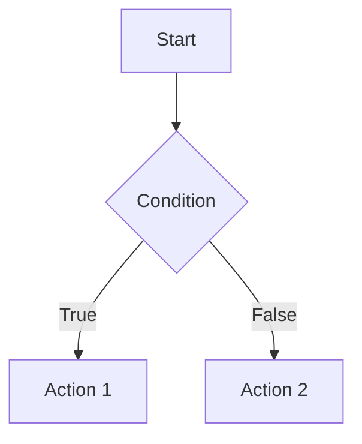

# Contributing to My Java Roadmap

Thank you for your interest in contributing to this project. This document provides guidelines and instructions for contributing content to the Java Roadmap documentation.

---

## Table of Contents

- [Getting Started](#getting-started)
- [Types of Contributions](#types-of-contributions)
- [Content Guidelines](#content-guidelines)
- [File Structure and Naming](#file-structure-and-naming)
- [Writing Style Guide](#writing-style-guide)
- [Submitting Contributions](#submitting-contributions)
- [Review Process](#review-process)

---

## Getting Started

### Prerequisites

Before contributing, ensure you have the following installed:

- Git
- Python 3.8+
- pip

### Setting Up the Development Environment

1. **Fork the repository** on GitHub

2. **Clone your fork locally**
   ```bash
   git clone https://github.com/YOUR_USERNAME/My-Java-Rodemap.git
   cd My-Java-Rodemap
   ```

3. **Add the upstream remote**
   ```bash
   git remote add upstream https://github.com/7amo10/My-Java-Rodemap.git
   ```

4. **Create a virtual environment and install dependencies**
   ```bash
   python -m venv venv
   source venv/bin/activate  # On Windows: venv\Scripts\activate
   pip install mkdocs-material
   ```

5. **Start the development server**
   ```bash
   mkdocs serve
   ```

6. **View your changes** at `http://127.0.0.1:8000`

---

## Types of Contributions

We welcome the following types of contributions:

| Type | Description |
|------|-------------|
| **New Topic Notes** | Add comprehensive notes for a new Java topic |
| **Book Summaries** | Add summaries and insights from Java-related books |
| **Bug Fixes** | Fix typos, broken links, or formatting issues |
| **Content Improvements** | Enhance existing content with examples, diagrams, or clarifications |
| **Code Examples** | Add practical, well-documented code examples |
| **Diagrams** | Add Mermaid diagrams to visualize concepts |

---

## Content Guidelines

### Topic Notes Structure

Each topic should follow this structure:

```
topic-X-topic-name/
├── index.md          # Topic overview and navigation
├── topic-note.md     # Course notes (Part 1)
├── topic-note-2.md   # Course notes (Part 2, if needed)
├── book-reading.md   # Related book insights
└── summary.md        # Synthesized knowledge and key takeaways
```

### Required Elements for Topic Notes

1. **Clear Headers**: Use proper heading hierarchy (H1 for title, H2 for sections, H3 for subsections)

2. **Front Matter**: Include tags for searchability
   ```yaml
   ---
   tags:
     - java
     - collections
     - generics
   ---
   ```

3. **Practical Examples**: Every concept should include working code examples

4. **Diagrams**: Use Mermaid for flowcharts, class diagrams, and visual explanations

5. **External References**: Link to official documentation and credible sources

### Book Reading Notes Structure

When adding book summaries, include:

- Key Takeaways (bullet points)
- Notable Quotes (with page references)
- Practical Applications
- Common Pitfalls
- Summary

---

## File Structure and Naming

### Naming Conventions

- **Directories**: Use lowercase with hyphens (e.g., `topic-1-java-basics`)
- **Files**: Use lowercase with hyphens (e.g., `book-reading.md`)
- **No spaces**: Replace spaces with hyphens

### Where to Place Content

| Content Type | Location |
|--------------|----------|
| Phase 1 Topics (Fundamentals) | `docs/notes/phase-1/` |
| Phase 2 Topics (Advanced) | `docs/notes/phase-2/` |
| Book Summaries | `docs/books/` |
| Resources | `docs/resources/` |
| Projects | `docs/projects/` |

---

## Writing Style Guide

### General Principles

1. **Clarity First**: Write for developers learning Java, not experts showing off
2. **Be Concise**: Remove unnecessary words while maintaining completeness
3. **Use Active Voice**: "The method returns a value" not "A value is returned by the method"
4. **Explain Why**: Don't just show what to do; explain why it matters

### Code Examples

- Use proper syntax highlighting with language identifiers
- Include comments for complex logic
- Show both correct and incorrect approaches when teaching pitfalls
- Keep examples focused and minimal

**Good Example:**
```java
// Prefer for-each when you don't need the index
for (String item : items) {
    System.out.println(item);
}
```

**Bad Example:**
```java
for(int i=0;i<items.size();i++){System.out.println(items.get(i));}
```

### Mermaid Diagrams

Use Mermaid for visual explanations:

```markdown


### Admonitions

Use MkDocs Material admonitions for callouts:

```markdown
!!! tip "Best Practice"
    Always close resources in a finally block or use try-with-resources.

!!! warning "Common Pitfall"
    Comparing wrapper objects with `==` compares references, not values.

!!! note "Version Info"
    This feature is available from Java 14 onwards.
```

---

## Submitting Contributions

### Step 1: Create a Branch

Create a descriptive branch name:

```bash
git checkout -b feature/topic-3-oop-fundamentals
# or
git checkout -b fix/typo-in-collections-page
```

### Step 2: Make Your Changes

- Follow the content and style guidelines above
- Test your changes locally with `mkdocs serve`
- Ensure all links work correctly

### Step 3: Commit Your Changes

Write clear, descriptive commit messages:

```bash
# Good commit messages
git commit -m "Add comprehensive notes for Topic 3: OOP Fundamentals"
git commit -m "Fix broken link in collections summary page"
git commit -m "Add Mermaid diagram for inheritance hierarchy"

# Bad commit messages
git commit -m "Update"
git commit -m "Fixed stuff"
```

### Step 4: Push and Create a Pull Request

```bash
git push origin your-branch-name
```

Then create a Pull Request on GitHub with:

- A clear title describing the change
- A description of what was added or changed
- Reference to any related issues

---

## Review Process

### What We Look For

1. **Accuracy**: Is the technical content correct?
2. **Completeness**: Does it cover the topic adequately?
3. **Clarity**: Is it easy to understand?
4. **Consistency**: Does it follow our style guide?
5. **Formatting**: Is the Markdown properly formatted?

### Response Time

We aim to review pull requests within 7 days. Complex contributions may take longer.

### Feedback

If changes are requested:

1. Address the feedback in new commits
2. Reply to comments explaining your changes
3. Request a re-review when ready

---

## Questions?

If you have questions about contributing, please open an issue with the label `question`.

---

Thank you for helping make this Java Roadmap better for everyone.
