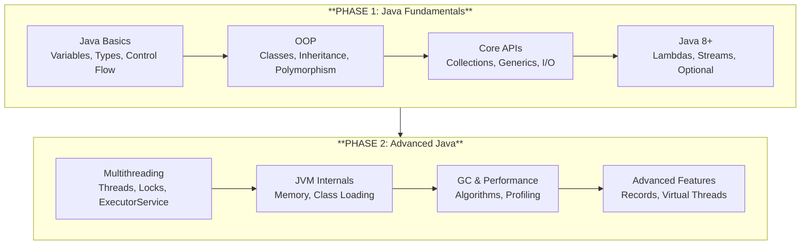

# My Java Roadmap

Welcome to my **Java Learning Journey** documentation based on the comprehensive Java Roadmap 2025.

---

## Overview

-   :material-notebook-outline:{ .lg .middle } **Learning Notes**

    ---

    Phase 1 (Java Fundamentals) and Phase 2 (Advanced Java & Concurrency) notes.

    [:octicons-arrow-right-24: Start Learning](notes/index.md)

-   :material-book-open-page-variant:{ .lg .middle } **Book Summaries**

    ---

    Key takeaways from essential books like Effective Java and Clean Code.

    [:octicons-arrow-right-24: Browse Books](books/index.md)

-   :material-link-box-outline:{ .lg .middle } **Resources**

    ---

    Curated tutorials, courses, documentation, and development tools.

    [:octicons-arrow-right-24: Explore Resources](resources/index.md)

-   :material-code-braces-box:{ .lg .middle } **Projects**

    ---

    Applied project references demonstrating practical implementation.

    [:octicons-arrow-right-24: View Projects](projects/index.md)

---

## Learning Path

---

## Roadmap Overview

| Phase | Duration | Focus |
|-------|----------|-------|
| **Phase 1** | 2-3 months | Java Fundamentals, OOP, Collections, Java 8+ |
| **Phase 2** | 2-3 months | Concurrency, JVM, Performance |
| Phase 3 | 3-4 months | Spring Ecosystem |
| Phase 4 | 2-3 months | Microservices |
| Phase 5-8 | Ongoing | Design Patterns, Testing, DevOps, Advanced |

---

## Getting Started

1. **[Learning Notes](notes/index.md)** - Start with Phase 1 fundamentals
2. **[Book Summaries](books/index.md)** - Read Effective Java alongside
3. **[Resources](resources/index.md)** - Explore curated learning materials
4. **[Projects](projects/index.md)** - Apply your knowledge with hands-on projects

---

!!! tip "Quick Navigation"
    Use the **search bar** (++cmd+k++ or ++ctrl+k++) to quickly find any topic.
