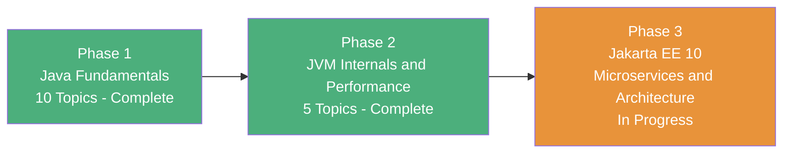

# :material-notebook-multiple: Learning Notes

My structured Java learning journey — from language fundamentals to JVM internals and performance engineering. Each phase builds on the last, with deep notes, book readings, diagrams, and internals.

---

## :material-map: Learning Roadmap Overview

---

## :material-folder-open: Phases

-   :material-numeric-1-box:{ .lg .middle } **Phase 1 — Java Fundamentals**

    ---

    Build a rock-solid foundation in Java: syntax, OOP principles, generics, lambdas & functional programming, the Collections Framework, Streams API, immutability patterns, DateTime API, and a complete module on concurrency & multithreading.

    **Topics Covered:**

    - Topic 1: Java Basic Interactive Applications
    - Topic 2: OOP & Class Design Internals
    - Topic 3: Arrays, Lists & Autoboxing
    - Topic 4: Abstraction, Interfaces, Generics & Nested Classes
    - Topic 5: Lambda Expressions & Functional Programming
    - Topic 6: Collections Framework
    - Topic 7: Java Streams API
    - Topic 8: Mastering Mutability, Immutability & Final Keyword
    - Topic 9: Math, BigDecimal & DateTime API
    - Topic 10: Mastering Java Concurrency & Multithreading

    **Resources:** Tim Buchalka's Java Masterclass · Effective Java · Core Java Vol. I · Java Concurrency in Practice

    [:octicons-arrow-right-24: Go to Phase 1](phase-1/index.md)

-   :material-numeric-2-box:{ .lg .middle } **Phase 2 — Java Internals & Performance**

    ---

    Master the JVM from the inside out: classloading, JIT compilation tiers, CPU memory hierarchy, performance observables, GC algorithms, profiling tools, microbenchmarking with JMH, and systematic performance engineering methodology.

    **Topics Covered:**

    - Topic 1 ✅: Optimizing Java — Part I: Foundations (Chs 1–5)
    - Topic 2 ✅: Garbage Collection Deep Dive (Chs 6–8)
    - Topic 3 ✅: Bytecode & JIT Internals (Chs 9–10)
    - Topic 4 ✅: Language Performance & Concurrency (Chs 11–12)
    - Topic 5 ✅: Advanced JVM Optimization Techniques (Chs 13–15)

    **Resources:** Optimizing Java (O'Reilly) · Java Performance: The Definitive Guide · async-profiler · JDK Mission Control

    [:octicons-arrow-right-24: Go to Phase 2](phase-2/index.md)

-   :material-numeric-3-box:{ .lg .middle } **Phase 3 — Jakarta EE 10: Microservices & Architecture**

    ---

    Master enterprise Java on a real Jakarta EE container: CDI 4.0 dependency injection, JAX-RS 3.1 REST services, JPA 3.1 persistence, JTA transactions, Jakarta Security with JWT, Adam Bien's BCE architecture pattern, ManagedExecutorService, Server-Sent Events, and JPA performance tuning.

    **Weeks Covered:**

    - Week 1: CDI 4.0 Component Model & JAX-RS 3.1 RESTful Services
    - Week 2: JPA 3.1 Persistence, JTA Transactions & Jakarta Security 3.0
    - Week 3: BCE Architecture Patterns, Async Execution & Performance Tuning
    - Week 4 (Capstone): JVM-Pulse EE — Bytecode Inspection Microservice Platform

    **Resources:** Pro Jakarta Persistence · Java EE 8 Application Development · Real-World Java EE Patterns · Design Web APIs

    [:octicons-arrow-right-24: Go to Phase 3](phase-3/index.md)

---

## :material-book-open-variant: Document Structure

Each topic folder follows a consistent structure:

| Document | Role |
|----------|------|
| `index.md` | Topic overview, chapter/lecture map, key internals to understand, progress tracker |
| `topic-note.md` / `topic-note-partN.md` | Course lecture notes with code examples, mermaid diagrams, and insights |
| `book-reading.md` / `book-reading-chN.md` | Deep chapter-by-chapter reading notes from the assigned book |
| `summary.md` | Combined final understanding — API cheat sheets, internals deep-dives, key questions |

---

## :material-checkbox-marked-outline: Overall Progress

### Phase 1 — Java Fundamentals

- [x] Topic 1: Java Basic Interactive Applications
- [x] Topic 2: OOP & Class Design Internals
- [x] Topic 3: Arrays, Lists & Autoboxing
- [x] Topic 4: Abstraction, Interfaces, Generics & Nested Classes
- [x] Topic 5: Lambda Expressions & Functional Programming
- [x] Topic 6: Collections Framework
- [x] Topic 7: Java Streams API
- [x] Topic 8: Mastering Mutability, Immutability & Final Keyword
- [x] Topic 9: Java Core Fundamentals — Math, BigDecimal & DateTime
- [x] Topic 10: Mastering Java Concurrency & Multithreading

### Phase 2 — Java Internals & Performance

- [x] Topic 1 (Part I): Optimizing Java — Foundations (Chapters 1–5)
- [x] Topic 2: Garbage Collection Deep Dive (Chapters 6–8)
- [x] Topic 3: Bytecode & JIT Internals (Chapters 9–10)
- [x] Topic 4: Language Performance & Concurrency (Chapters 11–12)
- [x] Topic 5: Advanced JVM Optimization Techniques (Chapters 13–15)

### Phase 3 — Jakarta EE 10: Microservices & Architecture

- [ ] Week 1 — Day 01: CDI 4.0 Scopes, Contexts & Lifecycle
- [ ] Week 1 — Day 02: Qualifiers, Producers, Interceptors & Events
- [ ] Week 1 — Day 03: JAX-RS 3.1 Fundamentals & REST Resource Architecture
- [ ] Week 1 — Day 04: JSON-B / JSON-P & Unified Exception Handling
- [ ] Week 1 — Day 05: JAX-RS Filters & Request/Response Pipelines
- [ ] Week 1 — Days 06-07: JVM-Pulse Core Integration Milestone
- [ ] Week 2 — Day 08-14: JPA 3.1, JTA Transactions & Jakarta Security
- [ ] Week 3 — Day 15-21: BCE Patterns, Async & Performance Tuning
- [ ] Week 4 — Day 22-28: JVM-Pulse EE Capstone Project
