# :material-book-open-page-variant: Book Reading: Syntax, Variables & Control Flow

> **Book:** Effective Java (3rd Edition) by Joshua Bloch  
> **Relevant Items:** 57, 58, 61 (Chapter 9: General Programming)  
> **Status:** :material-check-circle: Completed

---

## :material-target: Reading Goals

- [x] Understand Joshua Bloch's perspective on fundamental Java practices
- [x] Build theoretical mindset around language constructs
- [x] Extract best practices for variables and method design
- [x] Learn when to break the rules and why

---

## :material-book-open-variant: Chapter Notes

## Item 57: Minimize the Scope of Local Variables

#### The Core Principle

> **"The most powerful technique for minimizing the scope of a local variable is to declare it where it is first used."**

Most programming languages, including older versions of C, required variables to be declared at the beginning of a block. This led to declaring all variables at the top of methods, creating a gap between declaration and usage that makes code harder to understand and easier to break.

**Java allows declaration anywhere in a block** - use this power wisely!

#### Why Scope Minimization Matters


#### The Techniques

##### 1. Declare Variables Where First Used

```java
// ❌ Bad: C-style declaration at top
public void processItems(List<Item> items) {
    int count;          // What is this for?
    String name;        // Which name?
    Item current;       // Current what?
    
    // ... 50 lines later ...
    
    for (current = items.get(0); /* ... */) {
        name = current.getName();
        count++;
    }
}

// ✅ Good: Declaration at point of use
public void processItems(List<Item> items) {
    // Variables declared exactly where needed
    for (Item current : items) {          // Scope: loop only
        String name = current.getName();   // Scope: iteration only
        processName(name);
    }
}
```

##### 2. Initialize Variables with Declaration

> **"Nearly every local variable declaration should contain an initializer."**

```java
// ❌ Bad: Declaration without initialization
List<String> names;
// ... code that might or might not initialize names ...
if (condition) {
    names = getNames();  // Might not execute!
}
names.size();  // Potential NullPointerException or uninitialized variable

// ✅ Good: Always initialize
List<String> names = getNames();  // Clear intent, no ambiguity
```

**Exception:** `try-catch` blocks sometimes require declaration outside:

```java
// Acceptable pattern when initialization can throw
Connection connection = null;
try {
    connection = dataSource.getConnection();
    // use connection
} catch (SQLException e) {
    // handle
} finally {
    if (connection != null) {
        connection.close();
    }
}

// Even better with try-with-resources (Item 9)
try (Connection connection = dataSource.getConnection()) {
    // use connection
}  // Automatically closed
```

##### 3. Prefer For Loops to While Loops (for scope)

The `for` loop has a tighter scope for the loop variable:

```java
// ❌ While loop: iterator leaks into enclosing scope
Iterator<Element> i = c.iterator();
while (i.hasNext()) {
    doSomething(i.next());
}

// Bug waiting to happen:
Iterator<Element> i2 = c2.iterator();
while (i.hasNext()) {  // Oops! Used wrong iterator, compiles fine!
    doSomething(i2.next());
}

// ✅ For loop: iterator scoped to loop
for (Iterator<Element> i = c.iterator(); i.hasNext(); ) {
    doSomething(i.next());
}

// This bug would be caught at compile time:
for (Iterator<Element> i2 = c2.iterator(); i.hasNext(); ) {
    // COMPILE ERROR: i cannot be resolved
}
```

##### 4. Keep Methods Small and Focused

```java
// ❌ Long method = large variable scopes
public void processOrder() {
    Customer customer = getCustomer();
    // ... 100 lines where customer is in scope but not used ...
    Address address = getAddress();
    // ... 50 lines where both are in scope ...
    sendConfirmation(customer, address);
}

// ✅ Small methods = minimal scopes
public void processOrder() {
    validateOrder();
    calculateTotal();
    sendConfirmation();
}
```

#### Quotes to Remember

> *"If a variable is declared before it is used, it's just clutter—one more thing to distract the reader who is trying to figure out what the program does."*

> *"Declaring a local variable prematurely can cause its scope not only to begin too early but also to end too late."*

---

## Item 58: Prefer For-Each Loops to Traditional For Loops

#### The Evolution of Iteration


#### Why For-Each is Superior

The traditional `for` loop has three things that can go wrong:

```java
// Traditional for loop - prone to error
for (int i = 0; i < array.length; i++) {
    doSomething(array[i]);
}
```

| Error Source | Risk |
|--------------|------|
| Initialization (`int i = 0`) | Off-by-one if wrong start |
| Condition (`i < array.length`) | Off-by-one, infinite loop |
| Increment (`i++`) | Wrong direction, skip elements |
| Index usage (`array[i]`) | Copy-paste with wrong array |

**For-each eliminates ALL of these:**

```java
// For-each - clean and safe
for (Element e : elements) {
    doSomething(e);
}
```

#### The Nested Loop Bug

This is a famous pitfall that for-each prevents:

```java
enum Suit { CLUB, DIAMOND, HEART, SPADE }
enum Rank { ACE, TWO, THREE, /* ... */ KING }

// ❌ BROKEN - throws NoSuchElementException
List<Card> deck = new ArrayList<>();
for (Iterator<Suit> i = suits.iterator(); i.hasNext(); ) {
    for (Iterator<Rank> j = ranks.iterator(); j.hasNext(); ) {
        deck.add(new Card(i.next(), j.next()));
        //                 ↑ Bug! Called once per rank, not once per suit
    }
}

// ✅ For-each: impossible to make this mistake
for (Suit suit : suits) {
    for (Rank rank : ranks) {
        deck.add(new Card(suit, rank));
    }
}
```

#### When Traditional For is REQUIRED

Joshua Bloch identifies **three situations** where you cannot use for-each:

##### 1. Destructive Filtering (Removing Elements)

```java
// ❌ ConcurrentModificationException!
for (Element e : collection) {
    if (shouldRemove(e)) {
        collection.remove(e);
    }
}

// ✅ Traditional iterator with explicit remove
for (Iterator<Element> i = collection.iterator(); i.hasNext(); ) {
    Element e = i.next();
    if (shouldRemove(e)) {
        i.remove();  // Safe removal
    }
}

// ✅ Java 8+: Even cleaner
collection.removeIf(e -> shouldRemove(e));
```

##### 2. Transforming (Replacing Elements)

```java
// ❌ For-each loop variable is a copy
for (String s : list) {
    s = s.toUpperCase();  // Only modifies local copy!
}

// ✅ Traditional for with index
for (int i = 0; i < list.size(); i++) {
    list.set(i, list.get(i).toUpperCase());
}
```

##### 3. Parallel Iteration

```java
// ❌ Cannot control two iterators independently
for (String name : names) {
    // How do we get corresponding age?
}

// ✅ Traditional for with shared index
for (int i = 0; i < names.size(); i++) {
    System.out.println(names.get(i) + ": " + ages.get(i));
}
```

#### Decision Diagram


#### Quotes to Remember

> *"The for-each loop provides compelling advantages over the traditional for loop in clarity, flexibility, and bug prevention, with no performance penalty."*

> *"Not only does the for-each loop let you iterate over collections and arrays, it lets you iterate over any object that implements the Iterable interface."*

---

## Item 61: Prefer Primitive Types to Boxed Primitives

#### The Two Type Systems

Java has a fundamental duality:

| Primitive | Boxed (Reference) |
|-----------|-------------------|
| `int` | `Integer` |
| `long` | `Long` |
| `double` | `Double` |
| `boolean` | `Boolean` |
| `char` | `Character` |
| `byte` | `Byte` |
| `short` | `Short` |
| `float` | `Float` |

#### The Three Critical Differences


##### Difference 1: Identity vs Value

```java
// ❌ Broken comparator - can you spot the bug?
Comparator<Integer> naturalOrder = (i, j) -> (i < j) ? -1 : (i == j ? 0 : 1);

// Test it:
naturalOrder.compare(new Integer(42), new Integer(42));  // Returns 1, not 0!

// Why? When i == j is evaluated:
// - i < j uses unboxing: 42 < 42 is false ✓
// - i == j compares IDENTITY (references), not values!
// - These are different Integer objects, so i == j is false!

// ✅ Fixed: use equals() or unbox first
Comparator<Integer> naturalOrder = (iBoxed, jBoxed) -> {
    int i = iBoxed;  // Auto-unboxing
    int j = jBoxed;  // Auto-unboxing
    return (i < j) ? -1 : ((i == j) ? 0 : 1);
};

// ✅ Or simply use the built-in
Comparator<Integer> naturalOrder = Integer::compare;
```

!!! danger "Identity Trap"
    **Never use `==` on boxed primitives unless you're checking for `null`!**
    Use `.equals()` or unbox to primitives first.

##### Difference 2: Nullability (The Silent Killer)

```java
public class Unbelievable {
    static Integer i;  // Defaults to null (not 0!)
    
    public static void main(String[] args) {
        if (i == 42) {  // NullPointerException!
            System.out.println("Unbelievable");
        }
    }
}
```

**What happens?**
1. `i` is `Integer` reference, defaults to `null`
2. `i == 42` triggers auto-unboxing
3. Unboxing `null` throws `NullPointerException`

```java
// ✅ Fix: use primitive
static int i;  // Defaults to 0

// Or: null check if boxed is necessary
if (i != null && i == 42) { ... }
```

##### Difference 3: Performance (Death by a Thousand Cuts)

```java
// ❌ Hideously slow - can you spot why?
public static void main(String[] args) {
    Long sum = 0L;  // Boxed type!
    for (long i = 0; i <= Integer.MAX_VALUE; i++) {
        sum += i;  // Creates 2^31 Long objects!
    }
    System.out.println(sum);
}
// Takes about 6.3 seconds

// ✅ Fast version
public static void main(String[] args) {
    long sum = 0L;  // Primitive type
    for (long i = 0; i <= Integer.MAX_VALUE; i++) {
        sum += i;  // Simple addition
    }
    System.out.println(sum);
}
// Takes about 0.6 seconds - 10x faster!
```

#### Memory Comparison

| Type | Size (bits) | Heap Overhead |
|------|-------------|---------------|
| `int` | 32 | None (stack) |
| `Integer` | 128+ | Object header + padding |
| `long` | 64 | None (stack) |
| `Long` | 192+ | Object header + padding |

**A single `Integer` uses 4x the memory of an `int`!**

#### When to Use Boxed Primitives

Despite the drawbacks, boxed primitives are required for:

| Use Case | Reason |
|----------|--------|
| Collections (`List<Integer>`) | Generics don't support primitives |
| Generic type parameters | `Map<String, Integer>` |
| Reflective method invocations | Object-based API |
| Nullable values | When `null` is meaningful |

#### Decision Checklist

```java
// Ask yourself these questions:

// 1. Does it need to go in a collection?
List<Integer> numbers;  // Boxed required

// 2. Does it need to be nullable?
Integer employeeId;  // null = "not assigned"
int employeeId = -1;  // Magic number (avoid!)

// 3. Is it a generic type parameter?
Optional<Integer> maybeValue;  // Boxed required

// If NO to all three: use primitives!
int count = 0;  // ✅ Primitive
long total = 0L;  // ✅ Primitive
boolean isValid = true;  // ✅ Primitive
```

#### Quotes to Remember

> *"Autoboxing reduces the verbosity, but not the danger, of using boxed primitives."*

> *"There's no way to create a boxed primitive value that says 'I'm the same as that other one.' Two boxed primitives can have the same value but be different objects."*

> *"In nearly every case where a primitive type is appropriate, you should use it."*

---

## :material-head-cog: Theoretical Framework

### Mental Model for Variables

Think of variables like **labeled boxes** in a warehouse:

```mermaid
flowchart LR
    subgraph "Good: Minimal Scope"
        A[📦 temp] -.-> |"Exists only<br/>when needed"| B[🗑️ Discarded]
    end
    
    subgraph "Bad: Large Scope"
        C[📦 temp] --> D[📦 temp] --> E[📦 temp] --> F[📦 temp]
        F -.-> |"Finally<br/>discarded"| G[🗑️]
    end
```



**Key principles:**

1. **Declare late** - Create the box when you need it
2. **Initialize immediately** - Put something in it right away
3. **Scope narrowly** - Keep it in a small room, not the whole warehouse
4. **Prefer primitive boxes** - They're smaller and faster

### Control Flow Design Principles

From Bloch's wisdom, derive these principles for loops:

1. **Default to for-each** - It's safer and cleaner
2. **Read the exceptions** - Know when traditional is required
3. **Consider `removeIf()` and Streams** - Modern alternatives exist
4. **Make intent clear** - The loop style signals your purpose

---

## :material-thought-bubble: Reflections & Connections

### Connections to Course Material

| Effective Java Item | Note Section | Connection |
|---------------------|---------------------|------------|
| Item 57 (Scope) | Code Blocks | Both emphasize variables living in the smallest possible block |
| Item 58 (For-each) | Control Flow | For-each is the modern expression of iteration |
| Item 61 (Primitives) | Variables & Data Types | Understanding when types matter beyond just syntax |

**Key insight:** The course teaches you *how* to use these constructs. Effective Java teaches you *when* and *why* to prefer one over another. Together, they create mastery.

### New Perspectives Gained

1. **Scope is a safety feature**, not just organization
2. **Loop choice communicates intent** - for-each says "I'm reading," traditional says "I'm modifying or need control"
3. **Autoboxing is convenient but dangerous** - like a power tool, respect it
4. **Compile-time safety is worth pursuing** - Item 57's for-loop example shows how scope catches bugs
5. **Performance intuition** - Now I'll notice `Long sum = 0L` as a red flag

---

## :material-format-list-checks: Summary Points

1. **Declare variables at point of first use** - minimizes scope, maximizes clarity
2. **Always initialize variables** - avoid ambiguity and potential bugs
3. **Prefer for loops to while loops** when loop variable is needed - catches copy-paste bugs at compile time
4. **Use for-each by default** - it's safer, cleaner, and just as fast
5. **Know the three for-each exceptions**: filtering, transforming, parallel iteration
6. **Boxed primitives have identity** - never use `==` except for null checks
7. **Boxed primitives can be null** - autoboxing null throws NPE
8. **Prefer primitives for performance** - avoid "Long sum = 0L" patterns
9. **Reserve boxed types for generics and nullability** - when required by API

---

## :material-pin: Bookmarks & Page References

| Topic | Item | Key Quote |
|-------|------|-----------|
| Variable declaration timing | 57 | "Declare it where it is first used" |
| for vs while scope | 57 | "Compile-time error is better than runtime bug" |
| For-each advantages | 58 | "No performance penalty, prevents bugs" |
| Nested iteration bug | 58 | Classic iterator.next() in inner loop |
| Three for-each exceptions | 58 | Filtering, transforming, parallel iteration |
| `==` on boxed types | 61 | Identity comparison, not value |
| Null unboxing | 61 | Auto-unboxing null → NPE |
| Performance impact | 61 | "Long sum" example - 10x slower |

---

## :material-code-tags: Practical Checklist

Before writing a variable declaration, ask:

- [ ] Is this the first place I use this variable?
- [ ] Am I initializing it immediately?
- [ ] Could I use a for-loop instead of while to restrict scope?

Before writing a loop, ask:

- [ ] Can I use for-each? (Default choice)
- [ ] Am I removing elements? → Use iterator.remove() or removeIf()
- [ ] Am I replacing elements? → Use traditional for with index
- [ ] Am I iterating in parallel? → Use traditional for with shared index

Before using a boxed primitive, ask:

- [ ] Is this required for a collection or generic?
- [ ] Do I need nullability?
- [ ] If no to both → Use primitive instead!
- [ ] If yes → Remember: no `==`, check for null

---

*Last Updated: 2026-01-22*
