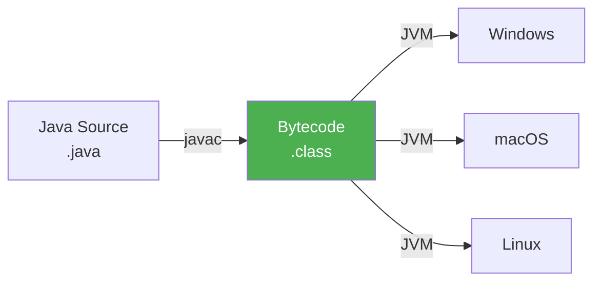
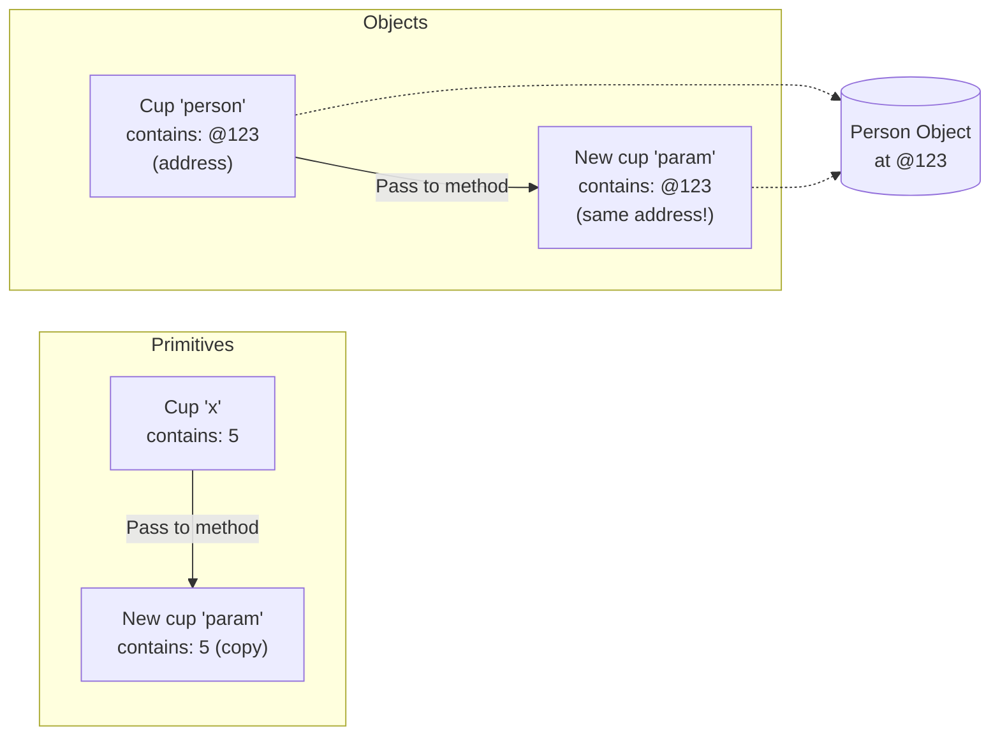

# :material-school: Summary: Syntax, Variables & Control Flow

> **Combined Knowledge from:** Tim Buchalka's Course + Effective Java  
> **Mastery Level:** :material-star::material-star::material-star::material-star::material-star:

---

## :material-star-shooting: Topic Overview

A comprehensive understanding of Java's foundational syntax, variable management, and control flow constructs that form the backbone of all Java programs. This topic also covers crucial JVM internals that every Java developer must understand.

---

## :material-key: Core Concepts

### 1. Variables & Data Types

#### Primitive Types

| Type      | Size   | Default  | Range              |
| --------- | ------ | -------- | ------------------ |
| `byte`    | 8-bit  | 0        | -128 to 127        |
| `short`   | 16-bit | 0        | -32,768 to 32,767  |
| `int`     | 32-bit | 0        | -2³¹ to 2³¹-1      |
| `long`    | 64-bit | 0L       | -2⁶³ to 2⁶³-1      |
| `float`   | 32-bit | 0.0f     | IEEE 754           |
| `double`  | 64-bit | 0.0d     | IEEE 754           |
| `boolean` | 1-bit  | false    | true/false         |
| `char`    | 16-bit | '\u0000' | Unicode characters |

#### Key Insights

- **Primitives live on the Stack** - fast access, automatic cleanup
- **Default values matter** - uninitialized instance fields get defaults, local variables don't!
- **Boxed types (Integer, Long, etc.)** - slower, can be null, needed for collections

---

### 2. Operators & Expressions

#### Operator Precedence (High to Low)

1. Postfix: `expr++`, `expr--`
2. Unary: `++expr`, `--expr`, `+`, `-`, `!`
3. Multiplicative: `*`, `/`, `%`
4. Additive: `+`, `-`
5. Relational: `<`, `>`, `<=`, `>=`
6. Equality: `==`, `!=`
7. Logical AND: `&&`
8. Logical OR: `||`
9. Assignment: `=`, `+=`, `-=`, etc.

#### Best Practices

- **Use parentheses liberally** - don't rely on precedence memory
- **Avoid side effects in expressions** - `a[i] = i++` is confusing
- **Short-circuit evaluation** - `&&` and `||` don't evaluate right side if left determines result

---

### 3. Control Flow Mastery

#### Decision Making

```java
// Modern switch expression (Java 14+)
String result = switch (day) {
    case MONDAY, FRIDAY, SUNDAY -> "Relaxed day";
    case TUESDAY, WEDNESDAY -> "Busy day";
    case THURSDAY, SATURDAY -> "Moderate day";
};
```

#### Iteration Patterns (from Effective Java)

| Pattern             | Use Case                          | Example                |
| ------------------- | --------------------------------- | ---------------------- |
| **for-each**        | Default choice - simple iteration | `for (Item i : items)` |
| **Traditional for** | Need index, parallel iteration    | `for (int i = 0; ...)` |
| **Iterator**        | Need to remove during iteration   | `iter.remove()`        |
| **Stream.forEach**  | Functional style                  | `items.forEach(...)`   |

---

## :material-head-cog: Key Internals to Understand

### 1. Platform Independence: JVM & Bytecode

**"Write Once, Run Anywhere" (WORA)** is Java's foundational promise.



#### How It Works

1. **Compile Once:** `javac` compiles `.java` files to `.class` bytecode files
2. **Bytecode is platform-neutral:** Same `.class` runs everywhere
3. **JVM interprets/compiles:** Each platform has its own JVM that translates bytecode to native code
4. **JIT Compilation:** Hot code paths are compiled to native for performance

#### Key Components

| Component        | Purpose                                            |
| ---------------- | -------------------------------------------------- |
| **javac**        | Compiles Java source to bytecode                   |
| **Bytecode**     | Intermediate, platform-independent instruction set |
| **JVM**          | Virtual machine that executes bytecode             |
| **JIT**          | Just-In-Time compiler for performance optimization |
| **Class Loader** | Loads .class files into memory                     |

#### Why This Matters

```java
// This SAME bytecode runs on any platform with a JVM!
public class Hello {
    public static void main(String[] args) {
        System.out.println("Hello World!");
    }
}
// Compile on Windows, run on Linux - no changes needed
```

---

### 2. Stack vs Heap Memory

Understanding where Java stores data is crucial for writing efficient programs.


#### Stack Memory

| Characteristic    | Description                                                |
| ----------------- | ---------------------------------------------------------- |
| **What's stored** | Primitives, method call frames, references to heap objects |
| **Scope**         | Thread-local (each thread has its own)                     |
| **Lifecycle**     | Created/destroyed with method calls (LIFO)                 |
| **Size**          | Small (typically 512KB - 1MB per thread)                   |
| **Access**        | Very fast (memory addresses are predictable)               |
| **Error**         | `StackOverflowError` when full (deep recursion)            |

#### Heap Memory

| Characteristic    | Description                              |
| ----------------- | ---------------------------------------- |
| **What's stored** | All objects, arrays, class instances     |
| **Scope**         | Shared by all threads                    |
| **Lifecycle**     | Objects live until garbage collected     |
| **Size**          | Large (can be GBs, controlled by `-Xmx`) |
| **Access**        | Slower (dynamic allocation, GC overhead) |
| **Error**         | `OutOfMemoryError` when full             |

#### Visual Example

```java
public class Memory {
    public static void main(String[] args) {    // Frame created on Stack
        int count = 10;                         // Primitive → Stack
        String name = "Ahmed";                  // Reference → Stack, Object → Heap
        Person p = new Person("Ali", 25);       // Reference → Stack, Object → Heap

        calculate(count);                       // New frame pushed to Stack
    }                                           // Frame popped, objects eligible for GC

    static int calculate(int x) {               // New frame on Stack
        int result = x * 2;                     // Primitive → Stack (this frame)
        return result;                          // Frame will be popped
    }
}
```

#### Comparison Table

| Aspect            | Stack                                 | Heap                                       |
| ----------------- | ------------------------------------- | ------------------------------------------ |
| Speed             | :material-speedometer: Fast           | :material-turtle: Slower                   |
| Size              | :material-ruler: Small                | :material-ruler-square: Large              |
| Thread Safety     | :material-lock: Thread-private        | :material-lock-open: Needs synchronization |
| Memory Management | :material-autorenew: Automatic (LIFO) | :material-recycle: Garbage Collector       |
| Data              | Primitives + References               | Objects + Arrays                           |

---

### 3. Pass-by-Value Mechanism

**Java is ALWAYS pass-by-value.** This is the most misunderstood concept!

#### The Coffee Cup Analogy

Think of variables as **labeled cups** and values as what's **inside** the cups:



#### For Primitives: Copy of the VALUE

```java
public static void main(String[] args) {
    int x = 10;
    modifyPrimitive(x);
    System.out.println(x);  // Still 10! Original unchanged
}

static void modifyPrimitive(int num) {
    num = 50;  // Only modifies the local copy
}
```

#### For Objects: Copy of the REFERENCE (not the object!)

```java
public static void main(String[] args) {
    Person p = new Person("Ahmed");

    modifyObject(p);
    System.out.println(p.name);  // "Modified" - object was changed!

    reassignReference(p);
    System.out.println(p.name);  // Still "Modified" - reference wasn't changed!
}

static void modifyObject(Person person) {
    person.name = "Modified";  // ✅ Modifies the actual object
}

static void reassignReference(Person person) {
    person = new Person("New");  // ❌ Only reassigns local copy of reference
}
```

#### The Golden Rules

| Rule                       | Explanation                                     |
| -------------------------- | ----------------------------------------------- |
| **Primitive parameters**   | Changes inside method have NO effect outside    |
| **Object parameters**      | Can modify the object's state                   |
| **Reference reassignment** | Reassigning the reference has NO effect outside |

#### Common Misconception

```java
// "Java passes objects by reference" - WRONG!
// If true, this would work:

static void swap(Integer a, Integer b) {
    Integer temp = a;
    a = b;       // Only swaps local copies
    b = temp;    // Original references unchanged!
}

Integer x = 1, y = 2;
swap(x, y);
// x is still 1, y is still 2 - swap failed!
```

---

## :material-alert: Common Pitfalls

### 1. Primitive vs Wrapper Confusion

```java
Integer a = 127;
Integer b = 127;
System.out.println(a == b);  // true (cached)

Integer c = 128;
Integer d = 128;
System.out.println(c == d);  // FALSE! (not cached, different objects)
System.out.println(c.equals(d));  // true (correct way)
```

**Rule:** Never use `==` with boxed primitives (except for null check).

### 2. Integer Overflow

```java
int billion = 1_000_000_000;
int result = billion * 3;  // OVERFLOW! Result is negative
long correct = (long) billion * 3;  // Cast BEFORE multiply
```

### 3. Floating-Point Precision

```java
double result = 0.1 + 0.2;
System.out.println(result);  // 0.30000000000000004 !

// For money, use BigDecimal
BigDecimal precise = new BigDecimal("0.1").add(new BigDecimal("0.2"));
```

---

## :material-lightbulb-on: Best Practices Checklist

From Effective Java Items 57, 58, 61:

- [x] Minimize scope of local variables (declare at first use)
- [x] Prefer for-each loops when possible
- [x] Use primitives over boxed types for performance
- [x] Initialize variables at declaration
- [x] Keep methods short and focused
- [x] Never use `==` on boxed primitives
- [x] Understand pass-by-value for debugging

---

## :material-bookmark: Learning Resources

### Platform Independence & JVM

- [Oracle JVM Specification](https://docs.oracle.com/javase/specs/jvms/se17/html/jvms-2.html)
- [Jenkov - Java Virtual Machine](https://jenkov.com/tutorials/java/jvm.html)

### Stack vs Heap Memory

- [DigitalOcean - Heap vs Stack](https://www.digitalocean.com/community/tutorials/java-heap-space-vs-stack-memory)
- [Baeldung - Stack and Heap](https://www.baeldung.com/java-stack-heap)

### Pass-by-Value

- [JavaRanch - Cup Size Story](https://www.javaranch.com/campfire/StoryPassBy.jsp) ⭐ Best explanation!
- [Baeldung - Pass by Value](https://www.baeldung.com/java-pass-by-value-or-pass-by-reference)

---

## :material-link-variant: Related Topics

- [OOP & Class Design](../topic-2-oop-class-design/summary.md)
- [Arrays, Lists & Generics](../topic-3-arrays-lists-generics/summary.md)

---

## :material-bookshelf: References

- **Course:** Tim Buchalka - Java Programming Masterclass
- **Book:** Effective Java - Joshua Bloch (Items 57, 58, 61)
- **Spec:** [JVM Specification](https://docs.oracle.com/javase/specs/jvms/se17/html/)
- **Tutorial:** [Oracle Java Tutorials](https://docs.oracle.com/javase/tutorial/)

---

_Completed: 2026-01-22 | Confidence: 9/10_
