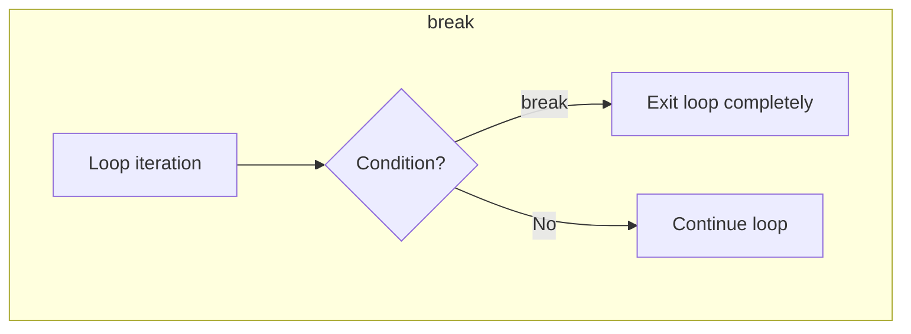
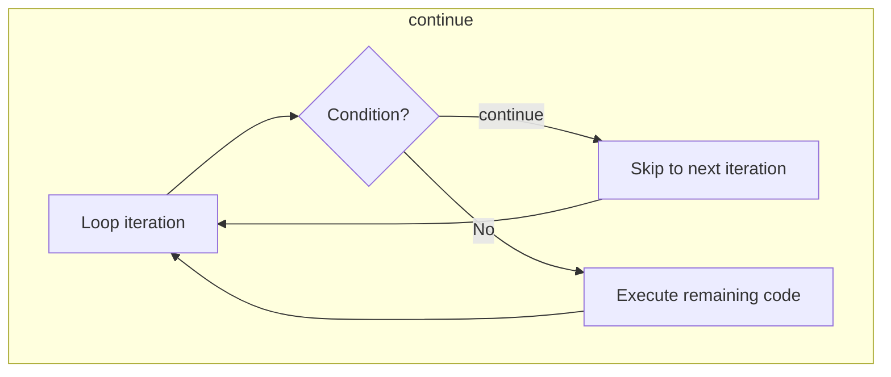

# :material-pencil: Topic Note Part 2: Control Flow, Loops & User Input

> **Course:** Java Programming Masterclass - Tim Buchalka (Udemy)  
> **Section:** 06. Mastering Conditional Logic, Loops, And Interactive Java Applications  
> **Status:** :material-check-circle: Completed

---

## :material-target: Learning Objectives

- [x] Master the switch statement (traditional + enhanced)
- [x] Understand the for loop and its three components
- [x] Implement while and do-while loops for conditional iteration
- [x] Apply break and continue for loop control
- [x] Grasp local variables and scope in code blocks
- [x] Handle exceptions with try-catch
- [x] Read user input with Scanner class

---

## :material-head-cog: Key Concepts from the Course

### The Switch Statement

The switch statement provides an alternative to long if-else-if chains when testing a single variable against multiple values.

#### Traditional Switch (Pre-Java 14)

```java
int switchValue = 3;
switch (switchValue) {
    case 1:
        System.out.println("Value was 1");
        break;
    case 2:
        System.out.println("Value was 2");
        break;
    case 3:
    case 4:
    case 5:
        System.out.println("Was a 3, 4, or 5");
        System.out.println("Actually it was: " + switchValue);
        break;
    default:
        System.out.println("Was not 1 to 5");
        break;
}
```

#### Key Components

| Component | Purpose |
|-----------|---------|
| `switch (value)` | The variable/expression to test |
| `case X:` | Value to compare against (ends with **colon**) |
| `break;` | Exit the switch block (prevents fall-through) |
| `default:` | Executes if no case matches (like `else`) |

#### Valid Data Types for Switch

| Allowed | Not Allowed |
|---------|-------------|
| `byte`, `short`, `int`, `char` | `boolean` |
| `Byte`, `Short`, `Integer`, `Character` | `long`, `float`, `double` |
| `String`, `enum` | Their wrapper classes |

!!! warning "Fall-Through Behavior"
    Without `break`, execution "falls through" to the next case, executing ALL code below until a `break` or end of switch is reached.

```java
// Fall-through example - prints BOTH lines!
case 3:
    System.out.println("Was 3");
    // No break - falls through!
case 4:
    System.out.println("Was 4");  // This ALSO executes if value is 3!
    break;
```

---

### Enhanced Switch (Java 14+)

The enhanced switch eliminates common pitfalls and is more concise.

```java
// Enhanced switch statement
switch (switchValue) {
    case 1 -> System.out.println("Value was 1");
    case 2 -> System.out.println("Value was 2");
    case 3, 4, 5 -> {
        System.out.println("Was a 3, 4, or 5");
        System.out.println("Actually it was: " + switchValue);
    }
    default -> System.out.println("Was not 1 to 5");
}
```

#### Key Differences from Traditional

| Traditional | Enhanced |
|-------------|----------|
| Uses `:` (colon) | Uses `->` (arrow) |
| Requires `break` | No `break` needed |
| Multiple case labels | Comma-separated values |
| Fall-through possible | Fall-through impossible |

---

### Switch Expressions (Returning Values)

The enhanced switch can return a value directly!

```java
// Switch as an expression - returns a value
public static String getQuarter(String month) {
    return switch (month) {
        case "January", "February", "March" -> "1st";
        case "April", "May", "June" -> "2nd";
        case "July", "August", "September" -> "3rd";
        case "October", "November", "December" -> "4th";
        default -> month + " is invalid";
    };
}
```

#### The `yield` Keyword

When you need a code block in a switch expression, use `yield` instead of `return`:

```java
return switch (month) {
    case "January", "February", "March" -> "1st";
    default -> {
        String badResponse = month + " is bad";
        yield badResponse;  // NOT return!
    }
};
```

!!! tip "When to use yield"
    - Switch is used as an **expression** (returns a value)
    - Case uses a **code block** `{}`
    - You need to return a value from that block

---

## :material-sync: Looping Statements

Java provides three main loop constructs, each suited for different scenarios.

### The for Loop

Best when you know the number of iterations in advance.

```java
for (initialization; condition; increment) {
    // code to repeat
}
```

#### Anatomy of a for Loop

```java
for (int i = 1; i <= 5; i++) {
    System.out.println(i);
}
//   ↑           ↑        ↑
//   │           │        └── Increment (after each iteration)
//   │           └── Condition (checked before each iteration)
//   └── Initialization (runs once at start)
```

#### Practical Example: Interest Calculator

```java
for (double rate = 2.0; rate <= 5.0; rate++) {
    double interest = calculateInterest(10000, rate);
    System.out.println("$10,000 at " + rate + "% = $" + interest);
}
```

#### Loop Variable Naming Convention

| Variable | Usage |
|----------|-------|
| `i` | Standard iteration variable (short for "iterator") |
| `j`, `k` | Nested loops |
| Descriptive names | When clarity matters (e.g., `rate`, `counter`) |

---

### The while Loop

Best when the number of iterations is unknown and depends on a condition.

```java
while (condition) {
    // code to repeat
    // must update condition to avoid infinite loop!
}
```

#### Comparison: for vs while

```java
// For loop - initialization inside declaration
for (int i = 1; i <= 5; i++) {
    System.out.println(i);
}

// While loop - initialization OUTSIDE
int j = 1;
while (j <= 5) {
    System.out.println(j);
    j++;  // Must increment manually!
}
```

!!! danger "Infinite Loop Warning"
    If you forget to update the condition variable in a while loop, you create an **infinite loop** that never terminates!

#### Common Pattern: while(true) with break

```java
int j = 1;
while (true) {  // Infinite loop
    if (j > 5) {
        break;  // Exit condition tested inside
    }
    System.out.println(j);
    j++;
}
```

---

### The do-while Loop

**Always executes at least once**, then checks the condition.

```java
do {
    // code to execute at least once
} while (condition);  // Note the semicolon!
```

#### Key Difference from while

```java
boolean isReady = false;

// while loop - never executes
while (isReady) {
    System.out.println("This never runs");
}

// do-while loop - executes ONCE
do {
    System.out.println("This runs once!");
} while (isReady);
```

#### When to Use do-while

- **User input validation** - Ask once, then keep asking if invalid
- **Menu systems** - Show menu at least once
- **Retry logic** - Attempt operation, retry if failed

```java
// Perfect for input validation
int yearOfBirth;
do {
    System.out.print("Enter year of birth (1900-2024): ");
    yearOfBirth = scanner.nextInt();
} while (yearOfBirth < 1900 || yearOfBirth > 2024);
```

---

### Loop Control: break and continue

#### break - Exit the Loop Entirely

```java
for (double i = 7.5; i <= 10; i += 0.25) {
    double interest = calculateInterest(100, i);
    if (interest > 8.5) {
        break;  // Exit loop when interest exceeds $8.50
    }
    System.out.println("$100 at " + i + "% = $" + interest);
}
```

#### continue - Skip to Next Iteration

```java
int number = 0;
while (number < 50) {
    number += 5;
    if (number % 25 == 0) {
        continue;  // Skip numbers divisible by 25
    }
    System.out.print(number + " ");
}
// Output: 5 10 15 20 30 35 40 45
// (25 and 50 are skipped!)
```

#### Visual Comparison





---

## :material-code-braces: Local Variables and Scope

### What is Scope?

**Scope** defines where a variable can be accessed in your code.

- **In scope**: Variable can be used
- **Out of scope**: Variable is not accessible

### Scope Rules

1. Variables are **in scope** in the block where they're declared
2. Variables are **also in scope** in any nested (inner) blocks
3. Variables are **out of scope** in containing (outer) blocks

```java
public void example() {
    int x = 10;           // x is in scope for entire method
    
    if (x > 5) {
        int y = 20;       // y is in scope ONLY inside this if block
        System.out.println(x);  // ✅ OK - x is accessible
        System.out.println(y);  // ✅ OK - y is accessible
    }
    
    System.out.println(x);  // ✅ OK - x still in scope
    System.out.println(y);  // ❌ ERROR - y is out of scope!
}
```

### For Loop Variable Scope

Variables declared in the for loop initialization are scoped to the loop:

```java
for (int i = 0; i < 5; i++) {
    System.out.println(i);  // ✅ OK
}
System.out.println(i);  // ❌ ERROR - i is out of scope
```

### Switch Statement Scope (Special Case!)

Unlike if-else, variables in switch cases are accessible in subsequent cases:

```java
switch (value) {
    case 1:
        int i = 10;  // Declared here
        break;
    case 2:
        i = 20;      // ✅ Accessible here (but not recommended!)
        break;
    default:
        i = 30;      // ✅ Also accessible
        break;
}
// i is OUT of scope here
```

!!! tip "Best Practice"
    Declare variables in the **narrowest scope possible**. If a variable is only needed inside a loop, declare it there.

---

## :material-alert-circle: Exception Handling Basics

### What is an Exception?

An **exception** is an error that occurs during program execution. Java has many named exceptions:

| Exception | Cause |
|-----------|-------|
| `NullPointerException` | Calling method on null reference |
| `ArrayIndexOutOfBoundsException` | Accessing invalid array index |
| `NumberFormatException` | Parsing non-numeric string as number |
| `ArithmeticException` | Division by zero |

### The try-catch Statement

```java
try {
    // Code that might throw an exception
    String name = System.console().readLine();
} catch (NullPointerException e) {
    // Code to handle the exception
    System.out.println("Console not available!");
    // Alternative approach here
}
```

#### Structure

```
try {
    // risky code
} catch (ExceptionType variableName) {
    // handling code
}
```

---

## :material-keyboard: Reading User Input

### The Scanner Class

Scanner is Java's tool for reading console input. It's part of `java.util`.

```java
import java.util.Scanner;

public class InputExample {
    public static void main(String[] args) {
        Scanner scanner = new Scanner(System.in);
        
        System.out.print("Enter your name: ");
        String name = scanner.nextLine();
        
        System.out.print("Enter your year of birth: ");
        int yearOfBirth = Integer.parseInt(scanner.nextLine());
        
        int age = 2024 - yearOfBirth;
        System.out.println("Hi " + name + ", you are " + age + " years old!");
        
        scanner.close();  // Good practice to close scanner
    }
}
```

### Key Scanner Methods

| Method | Returns | Description |
|--------|---------|-------------|
| `nextLine()` | String | Reads entire line |
| `next()` | String | Reads next word (until space) |
| `nextInt()` | int | Reads an integer |
| `nextDouble()` | double | Reads a double |
| `hasNextInt()` | boolean | Checks if next input is int |

### Creating a Scanner

```java
// For console input
Scanner scanner = new Scanner(System.in);

// System.in = standard input (keyboard)
// System.out = standard output (console)
```

### Input Validation with do-while

```java
Scanner scanner = new Scanner(System.in);
int yearOfBirth;

do {
    System.out.print("Enter year of birth (1900-2024): ");
    yearOfBirth = Integer.parseInt(scanner.nextLine());
    
    if (yearOfBirth < 1900 || yearOfBirth > 2024) {
        System.out.println("Invalid year! Please try again.");
    }
} while (yearOfBirth < 1900 || yearOfBirth > 2024);

System.out.println("Valid year entered: " + yearOfBirth);
```

---

## :material-lightbulb-on: Key Insights & Best Practices

### Switch Statement Insights

1. **Use enhanced switch** for cleaner, safer code (Java 14+)
2. **Include default** in switch expressions (required!)
3. **Prefer switch over long if-else chains** when testing one variable

### Loop Selection Guide

| Scenario | Best Loop |
|----------|-----------|
| Known iteration count | `for` |
| Unknown count, condition first | `while` |
| Execute at least once | `do-while` |
| Iterate over collection | `for-each` (later topic) |

### Variable Scope Best Practices

1. **Declare at point of first use** - not at method start
2. **Use narrowest scope possible** - declare in the block where needed
3. **Initialize when declaring** - avoid uninitialized variables
4. **Prefer for-loop init section** - keeps loop var scoped to loop

---

## :material-pin: Quick Reference

### Loop Comparison Table

| Feature | for | while | do-while |
|---------|-----|-------|----------|
| Executes at least once? | No | No | **Yes** |
| Condition location | Declaration | Before block | **After block** |
| Initialization | In declaration | Before loop | Before loop |
| Increment | In declaration | In block | In block |
| Semicolon after? | No | No | **Yes** |

### Control Flow Keywords

| Keyword | Effect |
|---------|--------|
| `break` | Exit loop/switch entirely |
| `continue` | Skip to next iteration |
| `return` | Exit method |
| `yield` | Return value from switch expression block |

---

## :material-help-circle: Questions Explored

- [x] What's the difference between traditional and enhanced switch?
- [x] When does fall-through occur and how to prevent it?
- [x] How do for, while, and do-while differ?
- [x] What is variable scope and why does it matter?
- [x] How to read user input with Scanner?
- [ ] How do labeled break/continue work with nested loops?

---

*Last Updated: 2026-01-24*
