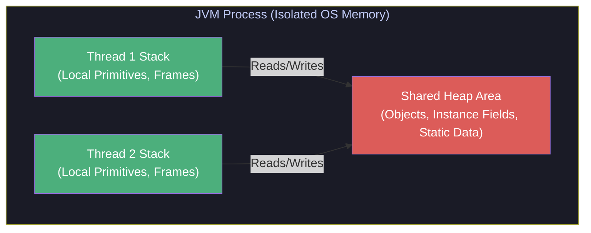
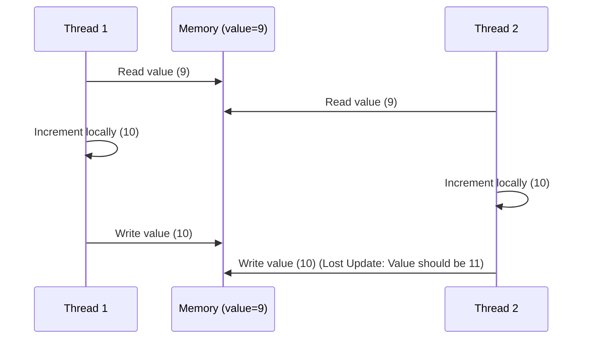

# :material-book-open-page-variant: Book Reading Part 2: JCIP (Chapters 1 – 5) — Concurrency Foundations

This document provides an exhaustive, highly detailed breakdown of Chapters 1 through 5 of Brian Goetz’s *Java Concurrency in Practice* (JCIP). It mirrors the structure of the topic notes, incorporating programmatic examples, structural diagrams, and design rules.

---

## :material-target: Learning Objectives
By the end of this reading log, you should be able to:
- [x] Identify the core benefits and hazards of multithreading at OS and JVM levels
- [x] Diagnose race conditions (Check-Then-Act vs. Read-Modify-Write) in code
- [x] Explain the implementation of intrinsic lock reentrancy in JVM thread execution
- [x] Avoid object escape and unsafe publication patterns during construction
- [x] Configure thread confinement using ThreadLocal variables and local stacks
- [x] Contrast the locking models of Synchronized Collections with Concurrent Collections
- [x] Apply synchronizers (`CountDownLatch`, `Semaphore`, `CyclicBarrier`) to coordinate execution

---

## :material-book-open-variant: Chapter 1: Introduction

### The Shared Memory Paradigm
In Java, threads are the primary execution mechanism. While processes provide isolated execution boundaries with protected memory spaces (Heaps), threads running within the same JVM process share the process-wide Heap. This enables fast data exchange but introduces the hazard of concurrent modifications to shared state.



### Benefits and Risks of Multithreading
*   **Exploiting Multi-Core Processor Power**: Standard processors rely on core counts to increase throughput. Serial code utilizes only a fraction of this power.
*   **Simplicity of Code Architecture**: Decoupling complex tasks into individual, single-purpose worker threads is easier than managing asynchronous state-machines (callbacks/event loops).
*   **Hazards (Safety vs. Liveness)**:
    *   *Safety*: Ensuring the program behaves correctly (nothing bad happens).
    *   *Liveness*: Ensuring the program makes progress (something good eventually happens).

!!! tip "Green Threads vs. Native Threads"
    Historically, Java used "Green Threads" (user-space threads scheduled by the JVM on a single OS thread). Modern Java uses native $1:1$ threads mapped directly to OS kernel threads. Project Loom (Virtual Threads) brings back a highly optimized $M:N$ user-space scheduling model.

---

## :material-book-open-variant: Chapter 2: Thread Safety

An object's thread safety is determined by its **state**. State is any data stored in instance or static fields that can affect the object's observable behavior.

!!! danger "The Core Law of Shared State"
    If multiple threads access the same mutable state variable without synchronization, your program is **broken**. To fix it, you must:
    1. Make the state variable immutable.
    2. Don't share the state variable across threads.
    3. Use synchronization whenever accessing the state variable.

### Race Conditions
A race condition occurs when the correctness of a computation depends on the relative timing or interleaving of multiple threads.

#### 1. Read-Modify-Write (Lost Updates)
An operation requires reading a value, modifying it locally, and writing it back to memory. If another thread reads the value before the write completes, the update is lost.

```java
// ❌ BROKEN: Not thread-safe!
public class UnsafeSequence {
    private int value;

    public int getNext() {
        return value++; // i.e., value = value + 1
    }
}
```



#### 2. Check-Then-Act (Lazy Initialization)
A thread checks a condition (e.g., `if (instance == null)`) and acts based on that observation. However, another thread may modify the state between the check and the act.

```java
// ❌ BROKEN: Multiple instances can be initialized
public class LazyInitRace {
    private ExpensiveObject instance = null;

    public ExpensiveObject getInstance() {
        if (instance == null) {
            instance = new ExpensiveObject();
        }
        return instance;
    }
}
```

### Intrinsic Locking and Reentrancy
Java provides the `synchronized` keyword to enforce mutual exclusion. It utilizes **intrinsic locks** (also called monitor locks).

```java
public class SynchronizedFactorizer {
    private long count;

    // Acquires the intrinsic lock of 'this' instance
    public synchronized long getCount() {
        return count;
    }

    public void service() {
        // Blocks until lock on 'this' is acquired
        synchronized (this) {
            count++;
        }
    }
}
```

#### Reentrancy Mechanics
Intrinsic locks are **reentrant**: locks are acquired on a *per-thread* basis rather than a *per-invocation* basis. If a thread attempts to acquire a lock it already holds, the JVM succeeds the request by incrementing an internal acquisition counter. When the thread exits the synchronized block, the counter decrements. The lock is released when the count hits zero.

```java
// Reentrancy prevents subclass execution deadlock
public class LoggingWidget extends Widget {
    public synchronized void doSomething() {
        System.out.println("Logging Widget doSomething");
        super.doSomething(); // ✅ Succeeds! Same thread holds the Widget monitor
    }
}
```

---

## :material-book-open-variant: Chapter 3: Sharing Objects

Locking is not just about keeping threads from modifying data at the same time; it is also about ensuring that changes made by one thread are visible to others.

### Visibility and Stale Data
Without synchronization, a reading thread can observe writes out of order or not at all due to CPU registers and local cache hierarchies.

```java
// ❌ BROKEN: Visibility trap
public class NoVisibility {
    private static boolean ready;
    private static int number;

    private static class ReaderThread extends Thread {
        public void run() {
            while (!ready) {
                Thread.yield(); // Spins waiting for ready flag
            }
            System.out.println(number); // ⚠️ Might print 0 or spin forever!
        }
    }

    public static void main(String[] args) {
        new ReaderThread().start();
        number = 42;      // Write 1
        ready = true;     // Write 2 (Reader may see ready=true but number=0!)
    }
}
```

### Volatile Variables
Declaring a field as `volatile` guarantees **visibility**. It forces the JVM and compiler to bypass local caches and direct all reads/writes to main memory, establishing a happens-before relationship.

!!! warning "Volatile limits"
    `volatile` only guarantees *visibility*, not *atomicity*. Use it only for status flags or variables where the new value does not depend on the previous value (like `ready = true`).

### Publication and Escape
*   **Publishing**: Making an object available outside its current scope (e.g., returning a reference from a public method).
*   **Escape**: An object is published when it should not have been.

#### Constructor Escape Danger
Never allow the `this` reference to escape during construction. If you publish a reference to `this` inside a constructor (e.g., registering as an event listener), another thread can access a partially constructed object.

```java
// ❌ BROKEN: constructor escape
public class ThisEscape {
    public ThisEscape(EventSource source) {
        source.registerListener(
            new EventListener() {
                public void onEvent(Event e) {
                    doSomething(e); // ⚠️ Accesses outer ThisEscape before constructor finishes!
                }
            }
        );
    }
}
```

### Thread Confinement
If data is only accessed by a single thread, synchronization is unnecessary.
*   **Ad-hoc Thread Confinement**: Relying on programmer discipline (very fragile).
*   **Stack Confinement**: Confining variables to local method scopes. Since local primitives live on the thread stack, they cannot be shared.
*   **ThreadLocal**: A utility that creates separate independent variable instances for each thread accessing it.

```java
// ThreadLocal pattern for Thread-safe SimpleDateFormat
public class ThreadSafeFormatter {
    private static final ThreadLocal<SimpleDateFormat> formatter = 
        ThreadLocal.withInitial(() -> new SimpleDateFormat("yyyy-MM-dd"));

    public static String format(Date date) {
        return formatter.get().format(date); // Thread-confined access
    }
}
```

### Immutability
Immutable objects are automatically thread-safe and can be safely shared across threads without synchronization.
An object is immutable if:
1.  Its state cannot be modified after construction.
2.  All its fields are `final`.
3.  It is properly constructed (the `this` reference did not escape during construction).

---

## :material-book-open-variant: Chapter 4: Composing Objects

Designing a thread-safe class involves confining state variables, establishing invariants, and managing concurrent access policies.

### Java Monitor Pattern
The Java Monitor Pattern involves wrapping mutable state in a class and guarding all access through `synchronized` methods or blocks locking on the class instance monitor.

```java
public class MonitorVehicleTracker {
    private final Map<String, SafePoint> locations; // Confined map

    public MonitorVehicleTracker(Map<String, SafePoint> locations) {
        this.locations = deepCopy(locations);
    }

    public synchronized Map<String, SafePoint> getLocations() {
        return deepCopy(locations); // Deep copy prevents escape
    }

    public synchronized void setLocation(String id, int x, int y) {
        SafePoint loc = locations.get(id);
        if (loc == null) throw new IllegalArgumentException("No such ID: " + id);
        loc.x = x;
        loc.y = y;
    }
}
```

### Client-Side Locking
If you want to perform an atomic operation on an existing thread-safe class (e.g., check-then-act on a synchronized list), you must lock on the **exact lock** the class uses internally.

```java
// ❌ BROKEN: Lock on 'this' list helper, NOT the list itself!
public class ListHelper<E> {
    public final List<E> list = Collections.synchronizedList(new ArrayList<>());

    public synchronized boolean putIfAbsent(E x) { // Locks on ListHelper instance!
        boolean absent = !list.contains(x);
        if (absent) list.add(x); // ⚠️ Unsynchronized read/write on 'list'!
        return absent;
    }
}

// ✅ CORRECT: Lock on the list monitor directly
public class CorrectListHelper<E> {
    public final List<E> list = Collections.synchronizedList(new ArrayList<>());

    public boolean putIfAbsent(E x) {
        synchronized (list) { // Locks on the actual list instance!
            boolean absent = !list.contains(x);
            if (absent) list.add(x);
            return absent;
        }
    }
}
```

---

## :material-book-open-variant: Chapter 5: Building Blocks

### Synchronized Collections vs. Concurrent Collections
Synchronized collections (`Vector`, `Collections.synchronizedList`) use a single lock for all operations. This limits throughput. They also require external synchronization when iterating:

```java
// ❌ Danger: Can throw ConcurrentModificationException during iteration
List<Widget> list = Collections.synchronizedList(new ArrayList<>());
for (Widget w : list) {
    doSomething(w); // If another thread modifies list, this throws exception!
}

// ✅ Correct: Externally synchronize the iteration block
synchronized (list) {
    for (Widget w : list) {
        doSomething(w);
    }
}
```

Concurrent collections (`ConcurrentHashMap`, `CopyOnWriteArrayList`) use segmented locks or copy-on-write arrays to allow safe concurrent access without blocking reads or throwing modification exceptions during iteration.

### Bounded Blocking Queues
`BlockingQueue` implementations block the caller thread when trying to `put()` elements into a full queue, or when trying to `take()` from an empty queue.

```java
public class ProducerConsumerDemo {
    private static final BlockingQueue<String> queue = new ArrayBlockingQueue<>(10);

    public static void main(String[] args) {
        // Producer
        new Thread(() -> {
            try {
                queue.put("Data"); // Blocks if queue is full
            } catch (InterruptedException e) {
                Thread.currentThread().interrupt();
            }
        }).start();

        // Consumer
        new Thread(() -> {
            try {
                String data = queue.take(); // Blocks if queue is empty
                System.out.println(data);
            } catch (InterruptedException e) {
                Thread.currentThread().interrupt();
            }
        }).start();
    }
}
```

### Synchronizers
A **synchronizer** is an object that coordinates the control flow of threads based on its state.

#### 1. CountDownLatch
A one-time gate that blocks threads until it reaches zero.

```java
public class LatchDemo {
    public static void main(String[] args) throws InterruptedException {
        CountDownLatch startGate = new CountDownLatch(1);
        CountDownLatch endGate = new CountDownLatch(5);

        for (int i = 0; i < 5; i++) {
            new Thread(() -> {
                try {
                    startGate.await(); // Wait for start gate to open
                    System.out.println("Thread running");
                } catch (InterruptedException e) {
                    Thread.currentThread().interrupt();
                } finally {
                    endGate.countDown();
                }
            }).start();
        }

        System.out.println("Releasing start gate...");
        startGate.countDown(); // Starts all threads simultaneously
        endGate.await();       // Wait for all threads to finish
        System.out.println("All threads complete.");
    }
}
```

#### 2. CyclicBarrier
Similar to a latch, but can be reset and reused. It forces a set of threads to wait until they all arrive at a synchronization barrier.

```java
CyclicBarrier barrier = new CyclicBarrier(3, () -> {
    System.out.println("Barrier reached! executing barrier action.");
});
// Threads call barrier.await() to coordinate phases of parallel calculations
```

#### 3. Semaphore
Manages virtual permits to control access to a resource pool.

```java
Semaphore semaphore = new Semaphore(5); // Maximum 5 concurrent permits
semaphore.acquire(); // Blocks if no permits available
try {
    // Access limited resource
} finally {
    semaphore.release();
}
```

---

## :material-alert: Summary of Chapter Design Rules

- **Mutable state belongs to a single thread or must be synchronized.**
- **Prefer final fields to establish immutability.**
- **Check-then-act operations are never thread-safe without locks.**
- **Document the thread-safety level of all published interfaces.**
- **Never publish the `this` reference inside a constructor.**
- **Iterating synchronized collections requires external synchronization.**

---

## :material-navigation: Related Book Readings

| Part | Topic | Link |
|:----:|-------|------|
| 1 | Effective Java (Items 78–84) | [← Part 1](book-reading.md) |
| 2 | JCIP (Chapters 1–5): Foundations | **You are here** |
| 3 | JCIP (Chapters 6–8): Task Structuring | [Part 3 →](book-reading-part3.md) |
| 4 | JCIP (Chapters 11–12): Performance & Testing | [Part 4 →](book-reading-part4.md) |

---

*Last Updated: 2026-07-01*
