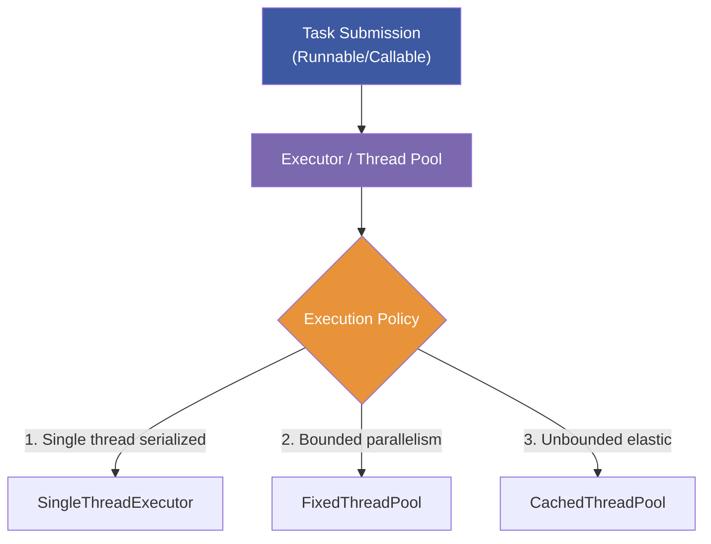

# :material-book-open-page-variant: Book Reading Part 3: JCIP (Chapters 6 – 8) — Task Structuring & Pools

This document provides a highly detailed, annotated analysis of Chapters 6 through 8 of Brian Goetz’s *Java Concurrency in Practice* (JCIP), focusing on task execution, cancellation, and thread pool configuration.

---

## :material-target: Learning Objectives
By the end of this reading log, you should be able to:
- [x] Configure and size custom ThreadPoolExecutor instances for optimal CPU utilization
- [x] Explain the hazards of Thread Starvation Deadlock in fixed-size pools
- [x] Implement thread cancellation using the cooperative interruption protocol
- [x] Handle InterruptedException cleanly in blocking pipelines (restore vs. propagate)
- [x] Configure saturation rejection policies for bounded work queues
- [x] Hook custom task execution metrics using ThreadPoolExecutor extensions

---

## :material-book-open-variant: Chapter 6: Task Execution

Most concurrent applications are structured around execution boundaries. Instead of execution flowing linearly through a single thread, work is broken into individual tasks.

### The Executor Framework
The `Executor` interface is the core abstraction for task execution in Java. It separates task submission from task execution details:

```java
public interface Executor {
    void execute(Runnable command);
}
```

#### Execution Policies
An execution policy defines *how*, *where*, and *when* tasks run, including:
*   What thread will execute the tasks?
*   In what order (FIFO, LIFO, Priority)?
*   How many tasks can run concurrently?
*   How many tasks can be queued waiting?
*   If a task is rejected, how is the client notified?



### Callable and Future
*   **Runnable**: Does not return a value and cannot throw checked exceptions.
*   **Callable**: Returns a value and can throw exceptions.
*   **Future**: Represents the lifecycle of a task. It provides methods to cancel, check completion, or wait (blocking) to retrieve the result.

```java
public class FutureTaskDemo {
    private final ExecutorService executor = Executors.newFixedThreadPool(2);

    public void runTask() {
        Callable<String> fetchTask = () -> {
            // Simulate slow I/O
            TimeUnit.SECONDS.sleep(2);
            return "Fetched Data";
        };

        Future<String> future = executor.submit(fetchTask);

        try {
            // Blocks current thread for up to 3 seconds waiting for result
            String result = future.get(3, TimeUnit.SECONDS);
            System.out.println(result);
        } catch (TimeoutException e) {
            future.cancel(true); // Interrupt execution if it times out
        } catch (ExecutionException e) {
            System.err.println("Task threw exception: " + e.getCause());
        } catch (InterruptedException e) {
            Thread.currentThread().interrupt(); // Restore flag
        }
    }
}
```

---

## :material-book-open-variant: Chapter 7: Cancellation and Shutdown

There is no way to safely force a thread to stop immediately in Java (methods like `Thread.stop()` are deprecated because they release all monitors, leaving objects in inconsistent states). Java uses a **cooperative cancellation** model.

### Interruption
Interruption is a cooperative mechanism where one thread signals another to stop. The target thread decides how to handle the signal.

```java
public class TaskRunner implements Runnable {
    public void run() {
        try {
            while (!Thread.currentThread().isInterrupted()) {
                // Perform blocking operations (e.g., take() from blocking queue)
                doWork();
            }
        } catch (InterruptedException e) {
            // Thread was interrupted while blocked
        } finally {
            cleanUp();
        }
    }
}
```

!!! danger "The InterruptedException Trap"
    Catching `InterruptedException` clears the thread's interrupted status. If you catch it and do not rethrow it, you **must reassert the interrupt** by calling `Thread.currentThread().interrupt()`. Otherwise, the thread-level interrupt state is lost, and the task executor won't know the thread was cancelled.

```java
// ❌ WRONG: Interrupted state is lost!
public void run() {
    try {
        Thread.sleep(1000);
    } catch (InterruptedException e) {
        System.out.println("Interrupted!"); // Swallowed!
    }
}

// ✅ CORRECT: Interrupted state is reasserted
public void run() {
    try {
        Thread.sleep(1000);
    } catch (InterruptedException e) {
        System.out.println("Interrupted! Restoring status.");
        Thread.currentThread().interrupt(); // Reassert!
    }
}
```

### Shutdown Hooks
A shutdown hook is an unstarted thread registered with the JVM that runs automatically when the JVM begins its shutdown sequence (e.g., on `System.exit()` or SIGTERM).

```java
public class ShutdownHookDemo {
    public void registerHook() {
        Runtime.getRuntime().addShutdownHook(new Thread(() -> {
            System.out.println("JVM shutting down. Closing thread pools...");
            closeResources();
        }));
    }
}
```

---

## :material-book-open-variant: Chapter 8: Applying Thread Pools

### Thread Starvation Deadlock
In fixed-size thread pools, if tasks executed inside the pool submit *sub-tasks* to the same pool and wait for their completion, the pool can run out of available threads and deadlock.

```java
// ❌ BROKEN: Fixed-size pool thread starvation deadlock
public class ThreadStarvationDeadlock {
    private final ExecutorService exec = Executors.newSingleThreadExecutor();

    public void runDeadlock() {
        Callable<String> outerTask = () -> {
            Future<String> subTask = exec.submit(() -> "Subtask Result");
            return subTask.get(); // ⚠️ Blocks waiting for sub-task! Single thread is blocked.
        };
        exec.submit(outerTask);
    }
}
```

!!! important "Rule of Thumb for Thread Pools"
    Tasks that depend on other tasks must not be executed in the same thread pool unless the pool is unbounded (like a CachedThreadPool).

### Sizing Thread Pools
To size a thread pool, calculate the ratio of compute time to wait time:
$$N_{\text{threads}} = N_{\text{CPU}} \times U_{\text{CPU}} \times \left(1 + \frac{W}{C}\right)$$
Where:
*   $N_{\text{CPU}}$ is the number of CPUs available (`Runtime.getRuntime().availableProcessors()`).
*   $U_{\text{CPU}}$ is the target CPU utilization ($0 \le U_{\text{CPU}} \le 1$).
*   $W/C$ is the ratio of wait time to compute time.

### Saturation policies (ThreadPoolExecutor)
When a bounded work queue fills up, the `RejectedExecutionHandler` decides what to do with incoming tasks:

```java
ThreadPoolExecutor executor = new ThreadPoolExecutor(
    5, 10, 60, TimeUnit.SECONDS,
    new LinkedBlockingQueue<>(100),
    new ThreadPoolExecutor.CallerRunsPolicy() // Saturation Rejection Policy
);
```

1.  **AbortPolicy** (Default): Throws `RejectedExecutionException`.
2.  **CallerRunsPolicy**: Executes the task in the caller thread. This slows down task submission (throttling).
3.  **DiscardPolicy**: Silently discards the rejected task.
4.  **DiscardOldestPolicy**: Discards the oldest queued task and retries submission.

### Extending ThreadPoolExecutor
You can extend `ThreadPoolExecutor` to add logging, metrics, or execution hooks:

```java
public class TimingThreadPool extends ThreadPoolExecutor {
    private final ThreadLocal<Long> startTime = new ThreadLocal<>();
    private final Logger log = Logger.getLogger("TimingThreadPool");

    public TimingThreadPool(int corePoolSize, int maxPoolSize, long keepAlive, TimeUnit unit, BlockingQueue<Runnable> queue) {
        super(corePoolSize, maxPoolSize, keepAlive, unit, queue);
    }

    @Override
    protected void beforeExecute(Thread t, Runnable r) {
        super.beforeExecute(t, r);
        startTime.set(System.nanoTime()); // Start timer
    }

    @Override
    protected void afterExecute(Runnable r, Throwable t) {
        try {
            long endTime = System.nanoTime();
            long taskTime = endTime - startTime.get();
            log.fine(String.format("Task took: %d ns", taskTime));
        } finally {
            super.afterExecute(r, t);
        }
    }
}
```

---

## :material-navigation: Related Book Readings

| Part | Topic | Link |
|:----:|-------|------|
| 1 | Effective Java (Items 78–84) | [← Part 1](book-reading.md) |
| 2 | JCIP (Chapters 1–5): Foundations | [← Part 2](book-reading-part2.md) |
| 3 | JCIP (Chapters 6–8): Task Structuring | **You are here** |
| 4 | JCIP (Chapters 11–12): Performance & Testing | [Part 4 →](book-reading-part4.md) |

---

*Last Updated: 2026-07-01*
