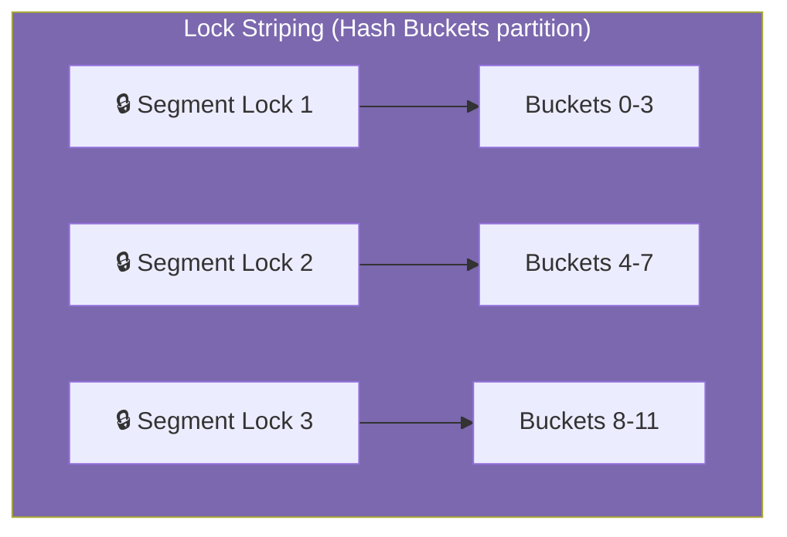

# :material-book-open-page-variant: Book Reading Part 4: JCIP (Chapters 11 – 12) — Performance & Testing

This document details Chapters 11 and 12 of Brian Goetz’s *Java Concurrency in Practice* (JCIP), focusing on concurrency optimizations, Amdahl's Law, lock striping, and multi-threaded testing strategies.

---

## :material-target: Learning Objectives
By the end of this reading log, you should be able to:
- [x] Apply Amdahl's Law to calculate theoretical application speedups
- [x] Reduce lock contention via scope shrinking, lock splitting, and lock striping
- [x] Implement thread-safe resource pools using explicit locking techniques
- [x] Write concurrent safety tests using CyclicBarrier synchronization check-sums
- [x] Analyze JVM thread dumps to locate deadlocks and execution bottlenecks

---

## :material-book-open-variant: Chapter 11: Performance and Scalability

Concurrency aims to improve performance by splitting work across multiple threads. However, managing threads introduces overhead.

### Concurrency Overhead
1.  **OS Context-Switching**: The OS must suspend the executing thread and load the state of the incoming thread (saving registers, program counter, and cache references). This takes thousands of CPU cycles.
2.  **Memory Barriers**: CPU cache invalidations and memory bus locks reduce hardware pipelining efficiency.
3.  **Thread Creation & Resource Allocation**: Spawning OS threads allocates native memory and kernel resources.

### Amdahl's Law
Amdahl's Law states that the potential speedup of a program parallelized across $N$ processors is constrained by its sequential execution fraction ($F$):
$$\text{Speedup} \le \frac{1}{F + \frac{1 - F}{N}}$$

For example:
*   If $F = 5\%$ (only 5% of code must run sequentially under locks or database operations), the maximum speedup on 4 processors is:
    $$\text{Speedup} \le \frac{1}{0.05 + \frac{0.95}{4}} \approx 3.48\times$$
*   Even with an infinite number of processors, the speedup can never exceed $20\times$ ($\frac{1}{0.05}$).

| CPU Cores ($N$) | Speedup ($F = 0.10$) |
|:---:|:---:|
| 1 | 1.00x |
| 2 | 1.81x |
| 4 | 3.07x |
| 8 | 4.70x |
| 16 | 6.40x |
| 32 | 7.80x |
| 64 | 8.76x |
| $\infty$ | 10.00x |

---

### Reducing Lock Contention
Scalability is the ability of an application to scale throughput linearly with processor core counts. High lock contention is the main bottleneck. We can reduce contention using three lock optimizations:

#### 1. Shrinking Lock Scope
Keep lock hold times as short as possible. Move calculations that don't depend on shared state out of the synchronized block.

```java
// ❌ High Contention: Entire method synchronized
public synchronized void updateLocation(String user, Point location) {
    Point old = locations.get(user);
    if (old == null || !old.equals(location)) {
        locations.put(user, location);
    }
}

// ✅ Optimized: Synchronize only the write operation
public void updateLocationOptimized(String user, Point location) {
    Point old = locations.get(user); // Map reads don't require write locks
    if (old == null || !old.equals(location)) {
        synchronized (locations) { // Lock only critical write
            locations.put(user, location);
        }
    }
}
```

#### 2. Lock Splitting
If a single lock guards multiple independent state variables, split it into separate locks for each variable:

```java
// Split BankAccount locks
public class BankAccount {
    private double balance;
    private String name;
    private final Object lockBalance = new Object();
    private final Object lockName = new Object();

    public void setName(String name) {
        synchronized (lockName) { this.name = name; }
    }

    public void deposit(double amount) {
        synchronized (lockBalance) { balance += amount; }
    }
}
```

#### 3. Lock Striping
Lock striping partitions a single collection into distinct segments, each guarded by its own lock. For example, `ConcurrentHashMap` uses an array of locks. When a thread modifies bucket $X$, it only locks segment $S(X)$, leaving other segments open for concurrent writes.



---

## :material-book-open-variant: Chapter 12: Testing Concurrent Programs

Testing concurrent code is difficult because bugs (like race conditions) are non-deterministic and depend on thread interleavings.

### 1. Safety Testing
Safety tests verify that invariants are not violated under concurrent access (e.g., verifying that a parallel list's size matches the number of elements inserted).

*   **Producer-Consumer Testing Pattern**: Create parallel arrays of producers and consumers. Have producers generate checksum values of their items, and consumers tally the checksums of items taken. Compare the checksums at termination.

```java
// Conceptual Safety Test: checksum validation
class PutTakeTest {
    private final CyclicBarrier barrier;
    private final AtomicInteger putSum = new AtomicInteger(0);
    private final AtomicInteger takeSum = new AtomicInteger(0);

    public PutTakeTest(int npairs) {
        this.barrier = new CyclicBarrier(npairs * 2 + 1); // producers + consumers + main thread
    }

    void runTest() throws Exception {
        // Spawn producer threads adding to putSum
        // Spawn consumer threads adding to takeSum
        barrier.await(); // Starting Gate
        barrier.await(); // Ending Gate
        if (putSum.get() != takeSum.get()) {
            throw new AssertionError("Safety violation: Checksum mismatch!");
        }
    }
}
```

### 2. Liveness Testing
Liveness tests ensure that the application does not deadlock or freeze under load.
*   **Programmatic Timeouts**: Build tests that assert operations complete within a maximum duration (e.g., using `Future.get(timeout)`).
*   **Thread Dumps**: Programmatic or manual analysis of JVM thread stacks (`jstack`) to verify lock cycles and locate deadlocked threads.

### 3. Performance Testing
Performance tests measure scalability and throughput under load.
*   **Warmup cycles**: Run tests long enough for the JIT compiler to optimize code before measuring throughput.
*   **Avoid Garbage Collection spikes**: Run tests with large heap allocations to prevent GC interruptions from skewing measurements.

---

## :material-navigation: Related Book Readings

| Part | Topic | Link |
|:----:|-------|------|
| 1 | Effective Java (Items 78–84) | [← Part 1](book-reading.md) |
| 2 | JCIP (Chapters 1–5): Foundations | [← Part 2](book-reading-part2.md) |
| 3 | JCIP (Chapters 6–8): Task Structuring | [← Part 3](book-reading-part3.md) |
| 4 | JCIP (Chapters 11–12): Performance & Testing | **You are here** |

---

*Last Updated: 2026-07-01*
