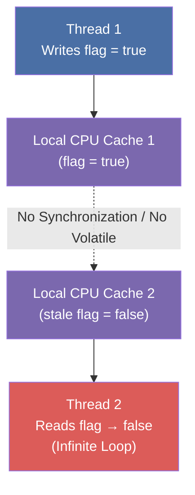

# :material-book-open-page-variant: Book Reading Part 1: Effective Java (Items 78 – 84)

This document provides a deep, expert walkthrough of Joshua Bloch’s *Effective Java* (3rd Edition, Chapter 11) focusing on core concurrency items.

---

## :material-bookmark: Item 78: Synchronize access to shared mutable data

### The Visibility vs. Mutual Exclusion Principle
Synchronization in Java is commonly associated with *mutual exclusion*—ensuring that only a single thread can execute a critical section at any given time. However, synchronization is equally critical for *visibility*—ensuring that memory writes performed by one thread are made visible to subsequent reading threads.



### The Infinite Loop Trap
Without proper synchronization, the compiler or JVM can optimize code via **hoisting**, causing threads to spin indefinitely on stale data:

```java
// ❌ BROKEN: May run forever due to hoisting
public class StopThread {
    private static boolean stopRequested;

    public static void main(String[] args) throws InterruptedException {
        Thread backgroundThread = new Thread(() -> {
            int i = 0;
            while (!stopRequested) {
                i++;
            }
        });
        backgroundThread.start();
        TimeUnit.SECONDS.sleep(1);
        stopRequested = true;
    }
}
```

The virtual machine may optimize the loop condition inside `backgroundThread`:
```java
// JVM Hoisted Code
if (!stopRequested) {
    while (true) {
        i++;
    }
}
```

### The Solutions
1.  **Synchronized Accessors**: Ensure both read and write operations are synchronized on the same lock.
    ```java
    public class StopThread {
        private static boolean stopRequested;
        private static synchronized void requestStop() { stopRequested = true; }
        private static synchronized boolean isStopRequested() { return stopRequested; }
        // ...
    }
    ```
2.  **Volatile Fields**: If mutual exclusion is not required (only visibility), the `volatile` keyword ensures reads/writes bypass CPU caches and hit main memory directly.
    ```java
    private static volatile boolean stopRequested;
    ```

### Limits of Volatile
`volatile` does not guarantee *atomicity*. Compound actions like `count++` (which translates to read-modify-write) are not atomic and suffer from race conditions.
```java
// ❌ BROKEN: Thread-unsafe
private static volatile int nextSerialNumber = 0;
public static int generateSerialNumber() {
    return nextSerialNumber++; // Read-modify-write is not atomic!
}

// ✅ CORRECT: Atomic variable
private static final AtomicInteger serialNumber = new AtomicInteger(0);
public static int generateSafeSerialNumber() {
    return serialNumber.getAndIncrement();
}
```

---

## :material-bookmark: Item 79: Avoid excessive synchronization

### The Alien Method Hazard
Inside a synchronized block, **never cede control to an alien method**. An alien method is any method whose behavior is not controlled by the class containing the synchronized block (e.g., client-provided callbacks, observers, or overridable methods).

If an alien method attempts to interact with the locked class, it can cause:
1.  **Exceptions** (e.g., `ConcurrentModificationException` if the callback attempts to mutate a list currently being iterated under lock).
2.  **Deadlock** (if the callback tries to acquire another lock or re-acquire the same lock asynchronously).

```java
// ❌ BROKEN: Invokes alien methods while holding lock
public class ObservableSet<E> extends ForwardingSet<E> {
    private final List<SetObserver<E>> observers = new ArrayList<>();

    private void notifyElementAdded(E element) {
        synchronized (observers) {
            for (SetObserver<E> observer : observers) {
                observer.added(this, element); // ⚠️ ALIEN CALL HOLDING LOCK!
            }
        }
    }
}
```

### Solution 1: Open Calls (Lock Splitting)
Move alien method calls *outside* of the synchronized block. This is called an **open call** and prevents lock-safety violations:

```java
// ✅ CORRECT: Open call pattern
private void notifyElementAddedSafe(E element) {
    List<SetObserver<E>> snapshot = null;
    synchronized (observers) {
        snapshot = new ArrayList<>(observers); // Copy state under lock
    }
    for (SetObserver<E> observer : snapshot) {
        observer.added(this, element); // Safe alien call (no lock held)
    }
}
```

### Solution 2: Concurrent Collections
Use a concurrent list container like `CopyOnWriteArrayList` to handle observers. This eliminates the need for manual synchronization blocks:

```java
// ✅ CORRECT: Loosely coupled observation
private final List<SetObserver<E>> observers = new CopyOnWriteArrayList<>();

private void notifyElementAddedConc(E element) {
    for (SetObserver<E> observer : observers) {
        observer.added(this, element); // Thread-safe iteration on internal snapshot
    }
}
```

---

## :material-bookmark: Item 80: Prefer executors, tasks, and streams to threads

### The Executor Framework (`java.util.concurrent`)
You should decouple the logical unit of execution (**Task**) from the physical execution mechanism (**Thread**).

*   **Runnable / Callable**: Represent the task.
*   **ExecutorService**: Represents the execution mechanism.

### Selecting the Right Thread Pool
*   **`Executors.newCachedThreadPool`**: Appropriate for light, short-lived tasks. Under heavy production loads, it can spawn threads boundlessly, depleting OS resources.
*   **`Executors.newFixedThreadPool(n)`**: Bounded execution. Safest choice for production application servers.
*   **`ThreadPoolExecutor`**: Use when you need fine-grained control over queues (bounded queues), core sizes, and task rejection policies.

---

## :material-bookmark: Item 81: Prefer concurrency utilities to wait and notify

### Why Concurrency Utilities Outperform wait/notify
High-level concurrency utilities (`java.util.concurrent`) eliminate the need for error-prone wait-notify loops.
*   **Concurrent Collections**: `ConcurrentHashMap` uses segmented locks, while `CopyOnWriteArrayList` uses copy-on-write. Never write custom synchronization wrappers around `HashMap` or `ArrayList` when concurrent alternatives exist.
*   **Synchronizers**: Primitives like `CountDownLatch`, `Semaphore`, and `CyclicBarrier` manage complex synchronization signals without manual locking.

### The Canonical wait-loop Pattern
If you must maintain legacy code that uses `wait()` and `notify()`, **always invoke `wait()` inside a loop**:

```java
// ✅ Standard wait-loop pattern
synchronized (lock) {
    while (conditionDoesNotHold()) {
        lock.wait(); // Releases lock, suspends thread, waits for notify
    }
    // Perform action appropriate to condition
}
```

!!! danger "Why is a `while` loop mandatory?"
    Threads can suffer from **spurious wakeups** (waking up without a notification) or a notify signal might have occurred but the condition has since been invalidated by another thread before the waiting thread resumed. A `while` loop re-evaluates the invariant.

---

## :material-bookmark: Item 82: Document thread safety

Every class must explicitly state its thread-safety contract for users. 

### Thread Safety Levels
1.  **Immutable**: Instances are constant. No external synchronization is required (e.g., `String`, `BigDecimal`).
2.  **Thread-safe**: Instances are mutable, but internal synchronization makes them safe for concurrent use without external locks (e.g., `ConcurrentHashMap`).
3.  **Conditionally thread-safe**: Some methods require external synchronization (e.g., `Collections.synchronizedList` when iterating).
4.  **Not thread-safe**: Clients must surround all calls with external locks (e.g., `ArrayList`, `HashMap`).
5.  **Thread-hostile**: Unsafe even with external locking, typically because they mutate static variables without synchronization.

---

## :material-bookmark: Item 83: Use lazy initialization judiciously

Lazy initialization should only be used to optimize startup or instance-creation costs if profiling shows a significant bottleneck.

### 1. Normal Initialization (Default)
```java
private final FieldType field = computeFieldValue();
```

### 2. Lazy Initialization Holder Class (Static Fields)
Uses the class loader initialization lock to guarantee thread-safe initialization without execution-time lock overhead.
```java
// ✅ Thread-safe lazy static initialization
private static class FieldHolder {
    static final FieldType field = computeFieldValue();
}

public static FieldType getField() {
    return FieldHolder.field;
}
```

### 3. Double-Checked Locking (Instance Fields)
Limits lock acquisition overhead by performing a quick un-synchronized read check first.
```java
// ✅ Thread-safe lazy instance initialization
private volatile FieldType field; // Must be volatile!

public FieldType getField() {
    FieldType result = field;
    if (result == null) { // First check (no lock)
        synchronized (this) {
            result = field;
            if (result == null) { // Second check (lock held)
                field = result = computeFieldValue();
            }
        }
    }
    return result;
}
```

---

## :material-bookmark: Item 84: Don't depend on the thread scheduler

### Portability Guidelines
*   **Avoid Priority Overrides**: Thread priority properties (`Thread.setPriority`) have non-portable behaviors across OS schedulers.
*   **Avoid `Thread.yield()`**: Schedulers can ignore yield instructions. Calling yield to fix concurrency bugs is a design smell.
*   **Avoid Busy-Spinning**: Do not write loops that spin while waiting for a flag to change. It spikes CPU usage and slows down the VM scheduler.

---

## :material-navigation: Related Book Readings

| Part | Topic | Link |
|:----:|-------|------|
| 1 | Effective Java (Items 78–84) | **You are here** |
| 2 | JCIP (Chapters 1–5): Foundations | [Part 2 →](book-reading-part2.md) |
| 3 | JCIP (Chapters 6–8): Task Structuring | [Part 3 →](book-reading-part3.md) |
| 4 | JCIP (Chapters 11–12): Performance & Testing | [Part 4 →](book-reading-part4.md) |

---

*Last Updated: 2026-07-01*
