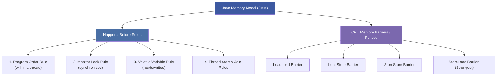
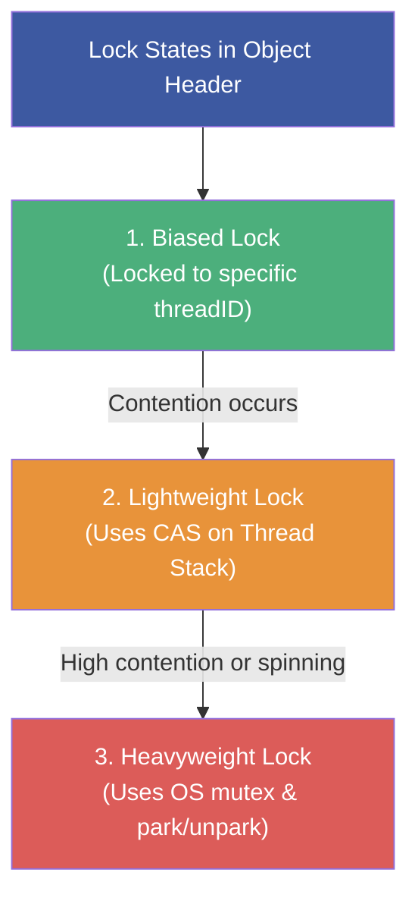
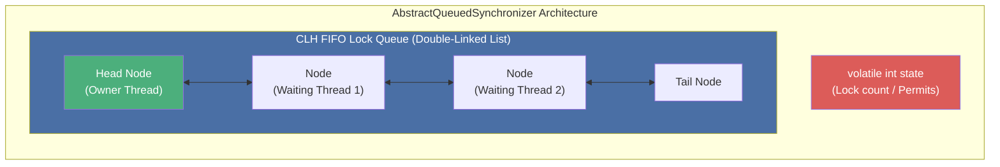
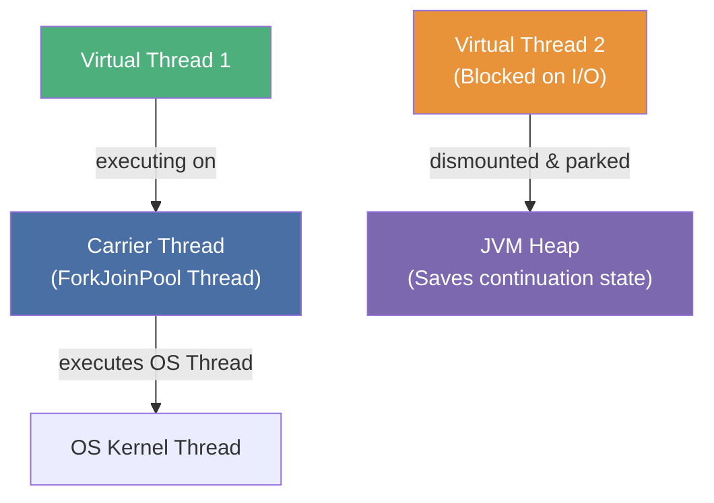

# :material-school: Summary & Concurrency Internals Deep Dive

This document provides a comprehensive synthesis of Java Concurrency and Multithreading, focusing on class methods, API cheat sheets, and JVM/CPU-level internals.

---

## :material-card-account-details: 1. Concurrency API & Class Cheat Sheet

Below is a reference guide to the core concurrency classes in `java.lang` and `java.util.concurrent`.

### Thread and Task Management

| Class / Interface | Key Methods | Purpose |
|---|---|---|
| `Thread` | `start()`, `run()`, `sleep(ms)`, `join()`, `interrupt()`, `isInterrupted()`, `threadId()`, `getState()` | Represents a thread of execution in the JVM. |
| `Runnable` | `run()` | Represents a task without a return value. |
| `Callable<V>` | `call() throws Exception` | Represents a task that returns a value and can throw checked exceptions. |
| `ThreadLocal<T>` | `get()`, `set(value)`, `remove()` | Confines data to a specific thread; prevents variable sharing. |
| `InheritableThreadLocal<T>` | Same as `ThreadLocal` | Passes thread-local values from parent thread to child thread upon creation. |

### Locks and Synchronizers

| Class | Key Methods | Purpose |
|---|---|---|
| `ReentrantLock` | `lock()`, `unlock()`, `tryLock()`, `newCondition()`, `isLocked()` | An explicit mutual-exclusion lock with fair/unfair options. |
| `Condition` | `await()`, `signal()`, `signalAll()` | Finer-grained signaling queue attached to an explicit lock. |
| `Semaphore` | `acquire()`, `release()`, `availablePermits()` | Manages a pool of virtual permits to control resource access. |
| `CountDownLatch` | `countDown()`, `await()` | Block threads until the latch count reaches zero (non-resettable). |
| `CyclicBarrier` | `await()`, `reset()`, `getNumberWaiting()` | A synchronization point where threads rendezvous (resettable). |

### Executor Services and Futures

| Interface / Class | Key Methods | Purpose |
|---|---|---|
| `ExecutorService` | `submit()`, `execute()`, `shutdown()`, `shutdownNow()`, `invokeAll()`, `awaitTermination()` | Manages thread pools, thread creation, lifecycle, and queueing. |
| `ScheduledExecutorService` | `schedule()`, `scheduleAtFixedRate()`, `scheduleWithFixedDelay()` | Executes tasks periodically or after a specific delay. |
| `Future<V>` | `get()`, `cancel()`, `isDone()`, `isCancelled()` | A token representing an incomplete asynchronous calculation. |
| `CompletableFuture<T>` | `thenApply()`, `thenAccept()`, `supplyAsync()`, `exceptionally()`, `allOf()` | A composable asynchronous pipeline framework (reactive). |

---

## :material-cogs: 2. Java Memory Model (JMM) & Happens-Before

The Java Memory Model (JMM) defines the legal boundaries of optimization (like compiler reordering and caching) in concurrent programs.



### The Happens-Before Relationship
Happens-before is a partial ordering over operations in a program. If operation $A$ happens-before operation $B$, the JMM guarantees that the results of $A$ are visible to $B$, and that the order is preserved.

1.  **Program Order Rule**: Each action in a thread happens-before any action in that thread that comes later in program order.
2.  **Monitor Lock Rule**: An unlock on a monitor lock happens-before every subsequent lock acquisition on that same monitor.
3.  **Volatile Variable Rule**: A write to a `volatile` field happens-before every subsequent read of that same field.
4.  **Thread Start Rule**: A call to `Thread.start()` on a thread happens-before any action in the started thread.
5.  **Thread Join Rule**: Any action in a thread happens-before any other thread detects its termination (via `join()` returning `true`).
6.  **Transitivity**: If $A$ happens-before $B$, and $B$ happens-before $C$, then $A$ happens-before $C$.

### Memory Barriers (Fences)
At the processor level, the JVM implements the JMM happens-before rules using hardware-specific **Memory Barriers** (Instruction Fences):

*   **LoadLoad**: Guarantees that preceding reads are completed before subsequent reads execute.
*   **StoreStore**: Guarantees that preceding writes are flushed to cache/memory before subsequent writes execute.
*   **LoadStore**: Guarantees that preceding reads execute before subsequent writes.
*   **StoreLoad**: The strongest barrier. Guarantees that preceding writes are flushed and visible before subsequent reads are loaded. It invalidates CPU store-buffers.

> **Resource:** [JSR-133 Java Memory Model Specification](https://jcp.org/en/jsr/detail?id=133) — The formal JMM specification.
> **Resource:** [Doug Lea's JMM Cookbook](https://gee.cs.oswego.edu/dl/jmm/cookbook.html) — Processor-specific memory barrier mapping guide.

---

## :material-memory: 3. Deep Dive: Intrinsic Lock Internals

When a thread enters a `synchronized` block, the JVM performs lock operations using the target object's **Mark Word** (located in the object header).



### Lock Inflation (Escalation) States
The HotSpot JVM optimizes synchronization by shifting the lock representation dynamically based on contention:

1.  **Biased Locking**: The lock is "biased" toward the first thread that acquires it. The thread's ID is written to the object's Mark Word. Subsequent acquisitions by the same thread require zero synchronization overhead.
2.  **Lightweight Locking (Thin Lock)**: If another thread attempts to acquire a biased lock, the bias is revoked. The lock escalates to *lightweight*. The acquiring thread uses a Compare-And-Swap (CAS) to copy the object's Mark Word to its own execution stack frame (Displaced Mark Word). If CAS succeeds, the lock is acquired.
3.  **Heavyweight Locking (Fat Lock)**: If CAS fails (the lock is contested), threads begin spin-waiting. If spinning fails to acquire the lock within limits, the lock inflates to *heavyweight*. The JVM creates an OS-level monitor block (`ObjectMonitor`) containing wait queues, and suspends blocked threads using OS syscalls (`park` / `unpark`).

> **Resource:** [OpenJDK `synchronizer.cpp`](https://github.com/openjdk/jdk/blob/master/src/hotspot/share/runtime/synchronizer.cpp) — JVM lightweight and inflated lock implementation.
> **Resource:** [OpenJDK `objectMonitor.cpp`](https://github.com/openjdk/jdk/blob/master/src/hotspot/share/runtime/objectMonitor.cpp) — Core logic for Thread parking/unparking and monitor queues.

---

## :material-lock-open: 4. CAS (Compare-And-Swap) & Lock-Free Internals

Atomic classes (`AtomicInteger`, `AtomicLong`) provide lock-free thread safety using optimistic synchronization.

### CPU Level Mechanics
CAS is executed as a single CPU instruction that performs a read-modify-write operation atomically at the hardware level.

*   On x86 architectures, the JVM uses the assembly instruction prefix **`LOCK CMPXCHG`** (Lock Compare and Exchange).
*   This instruction locks the CPU cache line (or system memory bus) while executing the swap, preventing other cores from modifying the target memory location.

```java
// Conceptual implementation of CAS inside the JDK (Unsafe.java)
public final boolean compareAndSwapInt(Object o, long offset, int expected, int update) {
    // Calls native code which executes:
    // lock cmpxchg [address], update
    return JVM_CompareAndSwapInt(o, offset, expected, update);
}
```

### The ABA Problem
*   **The Problem**: A thread reads value $A$, is preempted, and another thread changes the value to $B$ and then back to $A$. When the first thread resumes and performs CAS, it sees $A$ and succeeds, unaware that the variable was modified in the interim.
*   **The Fix**: Use version stamps or time stamps. In Java, this is solved by `AtomicStampedReference<T>` or `AtomicMarkableReference<T>`.
    ```java
    // AtomicStampedReference binds an integer stamp to the reference
    AtomicStampedReference<String> ref = new AtomicStampedReference<>("value", 0);
    
    int[] stampHolder = new int[1];
    String currentRef = ref.get(stampHolder); // Retrieves value and current stamp
    
    // CAS succeeds only if BOTH reference and stamp match
    boolean success = ref.compareAndSet(currentRef, "newValue", stampHolder[0], stampHolder[0] + 1);
    ```

> **Resource:** [OpenJDK `AtomicInteger.java`](https://github.com/openjdk/jdk/blob/master/src/java.base/share/classes/java/util/concurrent/atomic/AtomicInteger.java) — Atomic variable source code.
> **Resource:** [OpenJDK `Unsafe.java`](https://github.com/openjdk/jdk/blob/master/src/java.base/share/classes/jdk/internal/misc/Unsafe.java) — Direct hardware interface and CAS operations.

---

## :material-tournament: 5. AQS (AbstractQueuedSynchronizer) Internals

Most concurrency synchronizers (`ReentrantLock`, `Semaphore`, `CountDownLatch`, `ReentrantReadWriteLock`) are built on top of a single base framework: `java.util.concurrent.locks.AbstractQueuedSynchronizer` (AQS).



### Core Components
AQS uses:
1.  **An integer state**: Guarded by `volatile`, modified using CAS (`getState()`, `setState()`, `compareAndSetState()`).
    *   In `ReentrantLock`, state represents the reentrant hold count.
    *   In `Semaphore`, state represents the number of available permits.
    *   In `CountDownLatch`, state represents the remaining count.
2.  **A CLH Queue**: A variant of a Craig, Landin, and Hagersten (CLH) lock queue. It is a FIFO double-linked list where blocked threads wait in queues.
3.  **Thread Parking**: Nodes use `LockSupport.park()` to suspend execution and wait to be signaled by preceding nodes.

> **Resource:** [OpenJDK `AbstractQueuedSynchronizer.java`](https://github.com/openjdk/jdk/blob/master/src/java.base/share/classes/java/util/concurrent/locks/AbstractQueuedSynchronizer.java) — Native queue construction and lock queue management.
> **Resource:** [The java.util.concurrent Synchronizer Framework (Doug Lea)](https://gee.cs.oswego.edu/dl/papers/aqs.pdf) — Academic design paper detailing AQS.

---

## :material-transit-connection-variant: 6. Virtual Threads Internals (Project Loom)

Introduced as a production feature in JDK 21, Virtual Threads decouple Java threads from underlying operating system threads.

| Characteristic | Platform Threads | Virtual Threads |
|---|---|---|
| **OS Mapping** | $1:1$ with OS Thread | $M:N$ (Many virtual on few carrier threads) |
| **Allocation Cost** | High (memory & kernel allocation) | Low (Java objects on the heap) |
| **Metadata Footprint** | $\sim 1\text{MB}$ stack size | $\sim 200\text{B} - a\text{ few KB}$ metadata |
| **Blocking Behavior** | Blocks OS thread (expensive kernel context switch) | Dismounts from carrier thread; parks on heap |



### Mount and Dismount Cycle
1.  **Mounting**: The virtual thread scheduler (a FIFO `ForkJoinPool` by default) assigns a virtual thread to a Platform Thread (called the **Carrier Thread**).
2.  **Executing**: The virtual thread runs normally.
3.  **Parking (Dismounting)**: When the virtual thread performs a blocking operation (e.g., `Thread.sleep` or socket read), it intercepts the call, copies its call stack frame to the **JVM heap** (saving its *Continuation*), and dismounts. The Carrier Thread is freed to run another virtual thread.
4.  **Resuming**: When the I/O operation completes, the continuation is scheduled, mounted back onto an available Carrier Thread, and execution resumes.

> **Resource:** [JEP 444: Virtual Threads](https://openjdk.org/jeps/444) — JDK enhancement proposal.
> **Resource:** [OpenJDK `VirtualThread.java`](https://github.com/openjdk/jdk/blob/master/src/java.base/share/classes/java/lang/VirtualThread.java) — Virtual thread implementation, task mounting, and continuation processing.

---

## :material-help-circle: Questions Explored

- [x] How does the JVM guarantee happens-before visibility at the CPU level?
- [x] Describe the three lock states in HotSpot JVM lock inflation.
- [x] What is the difference between a Lock-based counter and a CAS-based counter?
- [x] How does AbstractQueuedSynchronizer manage waiting threads?
- [x] Why do virtual threads eliminate the need for reactive asynchronous callbacks?

---

## :material-navigation: Related Notes

| Part | Topic | Link |
|:----:|-------|------|
| 1 | Threads, States & Memory Model | [← Part 1](topic-note.md) |
| 2 | Synchronization & Locks | [← Part 2](topic-note-part2.md) |
| 3 | ExecutorService & Thread Pools | [← Part 3](topic-note-part3.md) |
| 4 | Parallel Streams & Concurrent Collections | [← Part 4](topic-note-part4.md) |
| 5 | Thread Hazards, Atomics & WatchService | [← Part 5](topic-note-part5.md) |
| 6 | Theoretical Book Readings | [Book Reading →](book-reading.md) |

---

*Last Updated: 2026-07-01*
