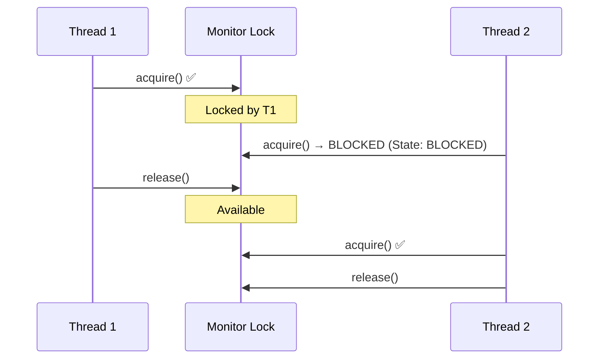
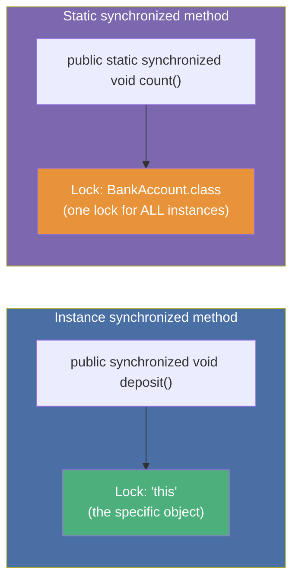
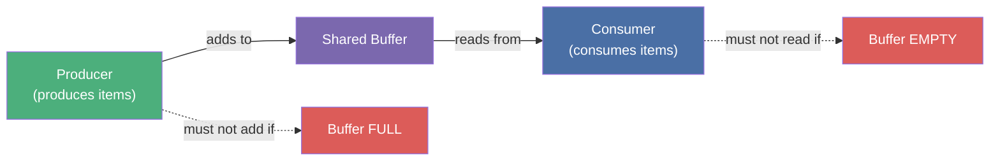
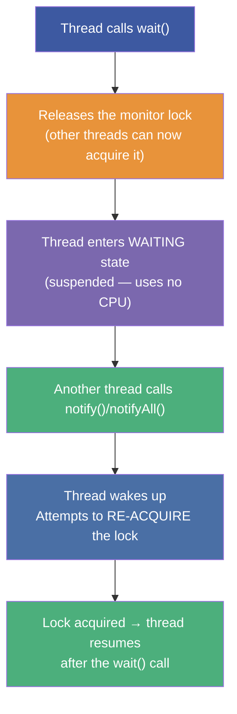
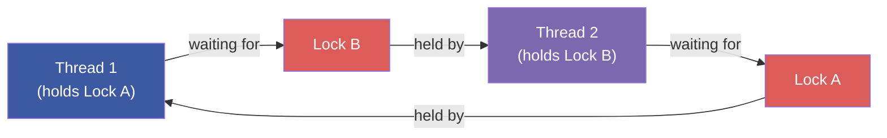
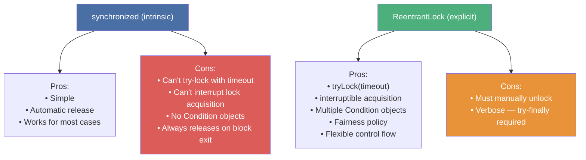
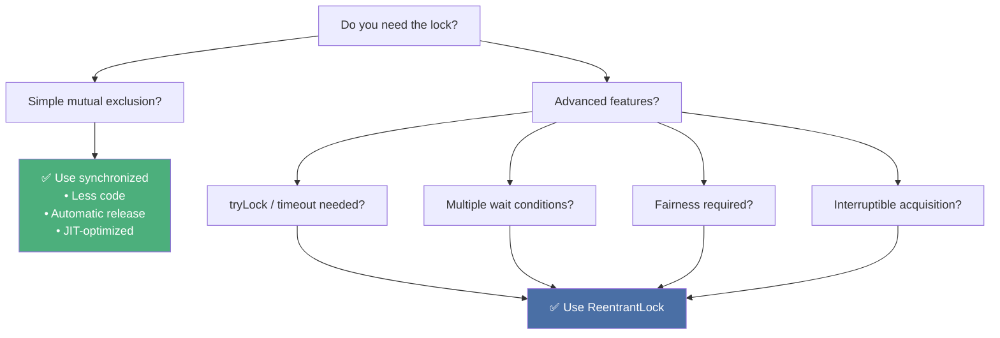

# :material-pencil: Topic Note Part 2: Synchronization & Explicit Locking

> **Course:** Mastering Java Concurrency and Multithreading — Tim Buchalka (Udemy)
> **Section:** 21 — Mastering Java Concurrency and Multithreading
> **Lectures:** 8–14
> **Status:** :material-check-circle: Complete

---

## :material-target: Learning Objectives

By the end of this part, you should be able to:

- [x] Explain what an **intrinsic monitor lock** is and how `synchronized` acquires it
- [x] Distinguish `synchronized` **methods** from `synchronized` **blocks**
- [x] Identify the lock object for instance methods vs static methods
- [x] Use a private lock sentinel to prevent inadvertent lock sharing
- [x] Implement the **producer-consumer** pattern with `synchronized`
- [x] Explain how deadlock occurs and identify the four Coffman conditions
- [x] Use `wait()`, `notify()`, and `notifyAll()` correctly with their protocol requirements
- [x] Create a `ReentrantLock` and use it with `try-finally` for guaranteed unlock
- [x] Use `tryLock()` with a timeout to avoid deadlock
- [x] Create `Condition` objects for fine-grained signaling with `ReentrantLock`

---

## :material-lock: 1. The `synchronized` Keyword — Intrinsic Locks

### What It Does

Every Java object has an associated **monitor lock** (also called the **intrinsic lock** or **mutex**). The `synchronized` keyword causes a thread to:

1. **Acquire** the monitor lock (blocking if another thread holds it)
2. **Execute** the synchronized code
3. **Release** the monitor lock (even if an exception is thrown)

This guarantees **mutual exclusion** (only one thread executes at a time) AND establishes a **happens-before relationship** (everything before the unlock is visible to the next thread that acquires the lock).



### Synchronized Methods

```java
public class BankAccount {
    private double balance;

    // Acquires lock on 'this' (the BankAccount instance)
    public synchronized void deposit(double amount) {
        balance += amount;
    }

    // Also acquires lock on 'this'
    public synchronized void withdraw(double amount) {
        if (balance >= amount) balance -= amount;
    }

    // Lock on BankAccount.class (shared across ALL instances)
    public static synchronized int getAccountCount() {
        return accountCount;
    }
}
```

### Lock Objects for Methods



---

## :material-lock-open: 2. `synchronized` Blocks — Fine-Grained Locking

### Why Use Blocks Instead of Methods?

- **Reduce critical section size** — less time holding the lock = less contention
- **Choose your own lock object** — don't expose `this` as the lock
- **Lock on multiple objects** — different sections protect different state

```java
public class Counter {
    private int count = 0;
    private final Object lock = new Object(); // Private sentinel lock

    public void increment() {
        // Only the critical section is synchronized
        System.out.println("About to increment...");  // ← NOT protected

        synchronized (lock) {                          // ← Acquire lock
            count++;                                   // ← Protected
        }                                              // ← Release lock

        System.out.println("Done incrementing");      // ← NOT protected
    }

    public int getCount() {
        synchronized (lock) {
            return count;
        }
    }
}
```

### Private Lock Object Pattern

```java
public class SafeInventory {
    private int stock = 0;

    // ✅ Private, final, dedicated lock
    private final Object stockLock = new Object();

    // ❌ Don't synchronize on 'this' — callers could also synchronize on your object
    //    and create unintended deadlocks or bypass your locking

    public void addStock(int qty) {
        synchronized (stockLock) {
            stock += qty;
        }
    }
}
```

!!! tip "When to Use a Block vs Method"
    Prefer `synchronized` **blocks** with a private lock object in any public class. Using `synchronized` on a method exposes `this` as the lock, allowing external code to interfere by synchronizing on the same object.

---

## :material-account-group: 3. The Producer-Consumer Pattern

### The Problem



### Naïve Implementation (Deadlock Prone)

```java
// ❌ BUG: Without wait/notify, this deadlocks
public synchronized void produce(int item) {
    while (buffer.size() == CAPACITY) {
        // Spinning while holding the lock — consumer can NEVER acquire it!
    }
    buffer.add(item);
}
```

---

## :material-sleep: 4. `wait()`, `notify()`, and `notifyAll()`

### The Contract

These three methods are on `java.lang.Object` and may **only be called from within a synchronized block/method** for the same object:

```java
synchronized (lockObject) {
    // Must check condition in a LOOP, not an if
    while (conditionNotMet) {
        lockObject.wait();        // Releases lock + suspends thread
    }
    // Condition is now met — proceed
}
```

```java
synchronized (lockObject) {
    // Change the condition
    buffer.add(item);
    lockObject.notify();          // Wake ONE waiting thread
    // lockObject.notifyAll();    // Wake ALL waiting threads
}
```

### What `wait()` Does Atomically



!!! danger "Always `wait()` in a `while` Loop, Never `if`"
    **Spurious wakeups** — a thread can wake up without `notify()` being called (allowed by the JVM spec). Always re-check the condition in a loop after `wait()`.

### Correct Producer-Consumer with `wait`/`notify`

```java
public class BoundedBuffer {
    private final int[] buffer;
    private int count = 0;
    private final int capacity;

    public BoundedBuffer(int capacity) {
        this.capacity = capacity;
        this.buffer = new int[capacity];
    }

    public synchronized void produce(int item) throws InterruptedException {
        while (count == capacity) {       // ← WHILE, not if
            wait();                        // Releases lock, waits for space
        }
        buffer[count++] = item;
        System.out.println("Produced: " + item + " | Buffer: " + count);
        notifyAll();                       // Wake sleeping consumers
    }

    public synchronized int consume() throws InterruptedException {
        while (count == 0) {              // ← WHILE, not if
            wait();                        // Releases lock, waits for item
        }
        int item = buffer[--count];
        System.out.println("Consumed: " + item + " | Buffer: " + count);
        notifyAll();                       // Wake sleeping producers
        return item;
    }
}
```

### `notify()` vs `notifyAll()`

| | `notify()` | `notifyAll()` |
|---|---|---|
| **Wakes** | One random waiting thread | ALL waiting threads |
| **Risk** | May wake wrong waiter (e.g., producer wakes producer) | Safer — always correct but less efficient |
| **Use when** | All waiters are identical and any one can proceed | Multiple types of waiters OR unsure |
| **Recommendation** | Use `notifyAll()` by default | ← prefer this |

---

## :material-alert-octagon: 5. Deadlock — The Mutual Hold-and-Wait Problem

### Definition

Deadlock occurs when two (or more) threads are **each waiting for a lock the other holds**, and neither can proceed.

```java
// ❌ Classic two-lock deadlock
Object lockA = new Object();
Object lockB = new Object();

Thread t1 = new Thread(() -> {
    synchronized (lockA) {         // T1 holds A
        Thread.sleep(100);
        synchronized (lockB) {     // T1 waits for B (held by T2)
            System.out.println("T1 done");
        }
    }
});

Thread t2 = new Thread(() -> {
    synchronized (lockB) {         // T2 holds B
        Thread.sleep(100);
        synchronized (lockA) {     // T2 waits for A (held by T1)
            System.out.println("T2 done");
        }
    }
});
```



### The Four Coffman Conditions (all must hold for deadlock)

| Condition | Meaning | Break By |
|-----------|---------|----------|
| **Mutual Exclusion** | Locks cannot be shared | (usually can't change this) |
| **Hold and Wait** | Thread holds one lock while waiting for another | Acquire all locks atomically |
| **No Preemption** | Locks can't be taken away | Use `tryLock()` with timeout |
| **Circular Wait** | Thread A waits for B, B waits for A | Always acquire locks in the **same order** |

**Prevention Strategy 1 — Consistent Lock Ordering:**

```java
// ✅ Both threads always acquire A before B
synchronized (lockA) {
    synchronized (lockB) {
        // Critical section
    }
}
```

---

## :material-lock-plus: 6. `ReentrantLock` — Explicit Locking

### Why `ReentrantLock`?



### Basic Usage — Mandatory `try-finally`

```java
private final ReentrantLock lock = new ReentrantLock();
private int count = 0;

public void increment() {
    lock.lock();              // Acquire
    try {
        count++;              // Critical section
    } finally {
        lock.unlock();        // ALWAYS unlock in finally — even if exception thrown
    }
}
```

!!! danger "ALWAYS Unlock in `finally`"
    If you call `lock.lock()` and an exception is thrown before `unlock()`, the lock is held **forever**. `try-finally` is the mandatory pattern — no exceptions.

### `tryLock()` — Non-Blocking / Timed Acquisition

```java
ReentrantLock lock = new ReentrantLock();

// Attempt to acquire without blocking
if (lock.tryLock()) {
    try {
        // We got the lock
    } finally {
        lock.unlock();
    }
} else {
    System.out.println("Lock not available — skipping");
}

// With timeout — prevents deadlock
if (lock.tryLock(500, TimeUnit.MILLISECONDS)) {
    try {
        // Got the lock within 500ms
    } finally {
        lock.unlock();
    }
} else {
    // Timed out — take alternative action
    System.out.println("Could not acquire lock in 500ms");
}
```

### `ReentrantLock` is Re-entrant

```java
lock.lock();
try {
    lock.lock();    // Same thread — OK! Lock count increments to 2
    try {
        // Nested critical section
    } finally {
        lock.unlock();   // Count decrements to 1
    }
} finally {
    lock.unlock();       // Count decrements to 0 — lock released
}
```

A thread that already holds a `ReentrantLock` can acquire it again without deadlocking. The lock tracks a **hold count** — released only when `unlock()` count matches `lock()` count.

### `Condition` — Fine-Grained Signaling

`Condition` objects are the `ReentrantLock` equivalent of `wait`/`notify`, but with the advantage of **multiple condition queues per lock**:

```java
private final ReentrantLock lock = new ReentrantLock();
private final Condition notFull  = lock.newCondition();   // Producer waits here
private final Condition notEmpty = lock.newCondition();   // Consumer waits here
private int count = 0;

public void produce(int item) throws InterruptedException {
    lock.lock();
    try {
        while (count == CAPACITY) {
            notFull.await();       // Release lock, wait for space
        }
        buffer[count++] = item;
        notEmpty.signal();         // Wake one consumer
    } finally {
        lock.unlock();
    }
}

public int consume() throws InterruptedException {
    lock.lock();
    try {
        while (count == 0) {
            notEmpty.await();      // Release lock, wait for item
        }
        int item = buffer[--count];
        notFull.signal();          // Wake one producer
        return item;
    } finally {
        lock.unlock();
    }
}
```

!!! tip "`Condition.await()` vs `Object.wait()`"
    Both do the same thing (release lock + suspend). The advantage of `Condition` is having **separate queues for producers and consumers** — `signal()` on `notEmpty` wakes *only* consumers, not other producers. `Object.notify()` wakes an arbitrary waiter from a single queue.

### Fair Lock — FIFO Scheduling

```java
ReentrantLock fairLock = new ReentrantLock(true);  // fair = true
// Threads acquire in the order they requested the lock (FIFO)
// Prevents starvation of low-priority threads
// Trade-off: lower throughput (no thread can "jump the queue")
```

---

## :material-compare: 7. `synchronized` vs `ReentrantLock` — Decision Guide



---

## :material-help-circle: Questions Explored

- [x] What is an intrinsic monitor lock and how does `synchronized` use it?
- [x] What lock object does a `static synchronized` method use?
- [x] Why should you prefer a private lock sentinel over locking on `this`?
- [x] Why must `wait()` always be called in a `while` loop?
- [x] What does `wait()` do to the monitor lock vs `Thread.sleep()`?
- [x] What is a spurious wakeup and how do you protect against it?
- [x] What are the four Coffman conditions for deadlock?
- [x] How does consistent lock ordering prevent deadlock?
- [x] Why is `try-finally` mandatory with `ReentrantLock`?
- [x] What advantage does `Condition` have over `Object.wait()/notify()`?
- [x] When does a `ReentrantLock` fair mode hurt performance?

---

## :material-navigation: Related Notes

| Part | Topic | Link |
|:----:|-------|------|
| 1 | Threads, States & Memory Model | [← Part 1](topic-note.md) |
| 2 | Synchronization & Locks | **You are here** |
| 3 | ExecutorService & Thread Pools | [Part 3 →](topic-note-part3.md) |
| 4 | Parallel Streams & Concurrent Collections | [Part 4 →](topic-note-part4.md) |
| 5 | Thread Hazards, Atomics & WatchService | [Part 5 →](topic-note-part5.md) |

---

*Last Updated: 2026-07-01*
