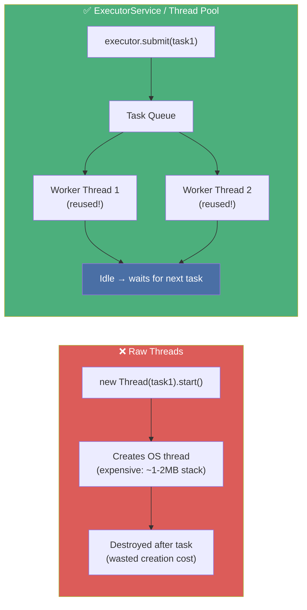
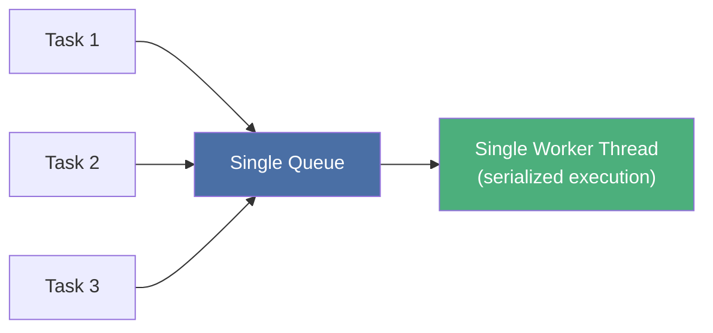
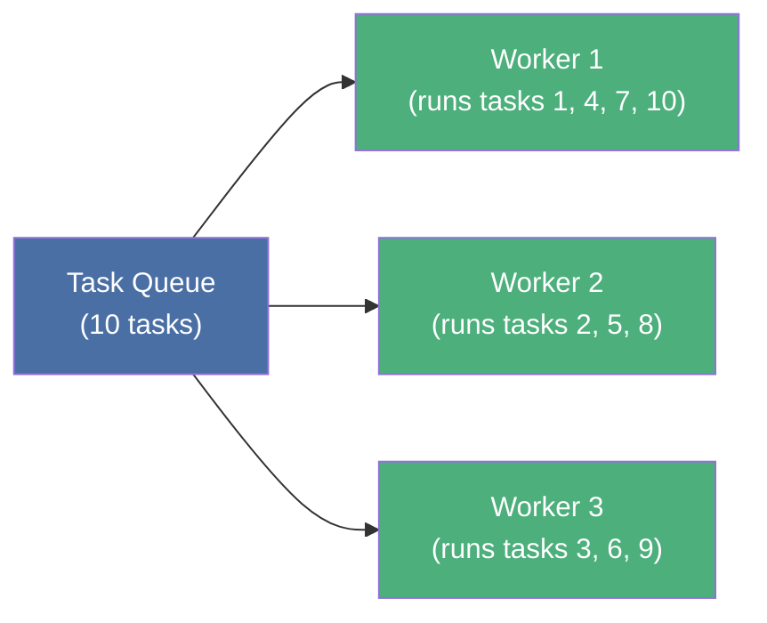
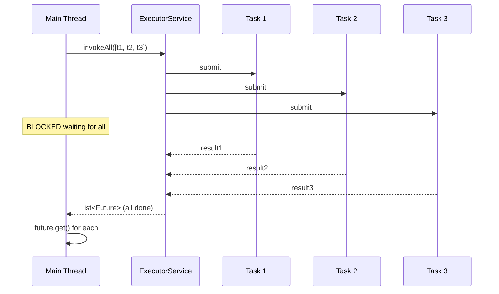
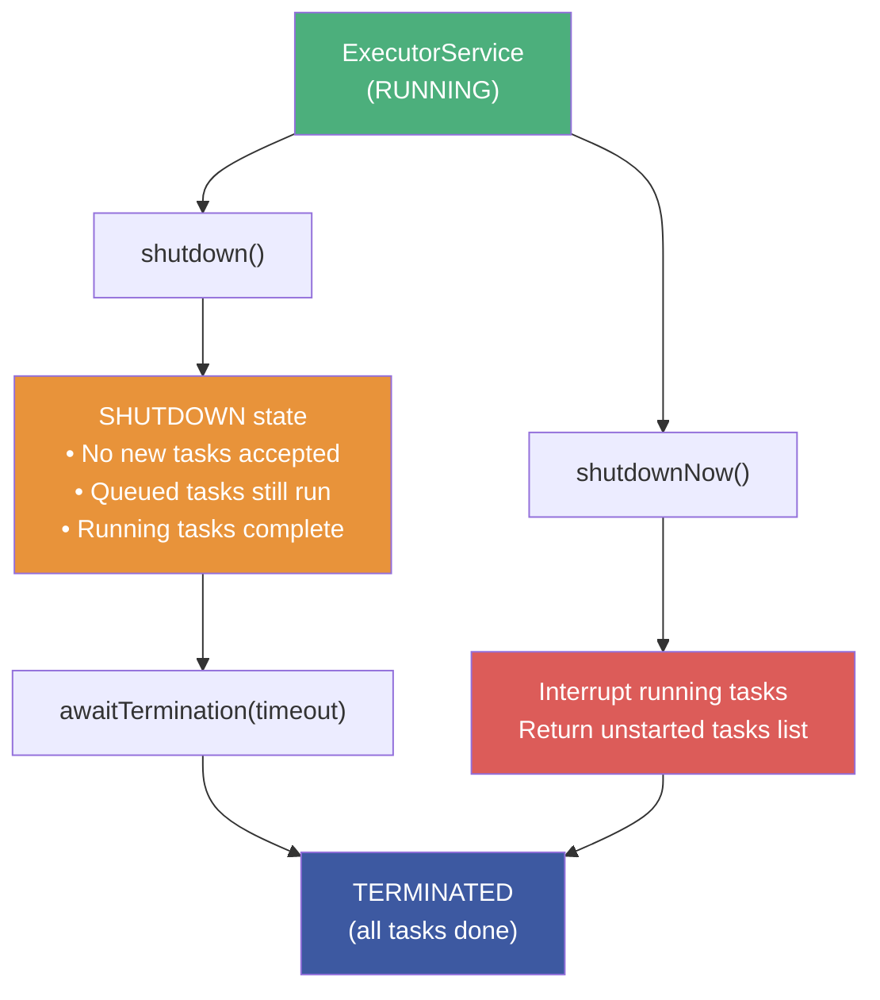
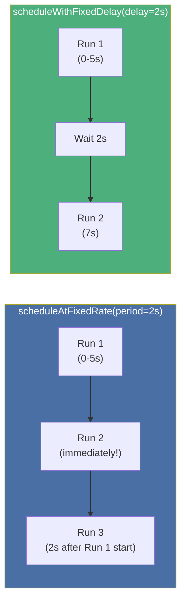
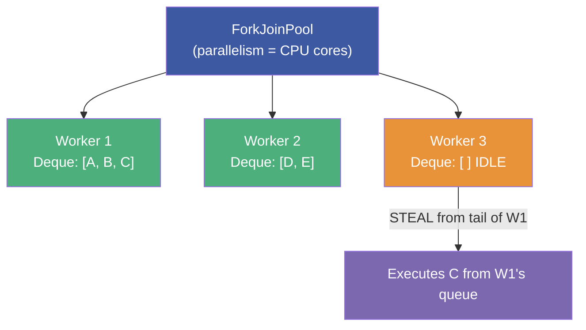
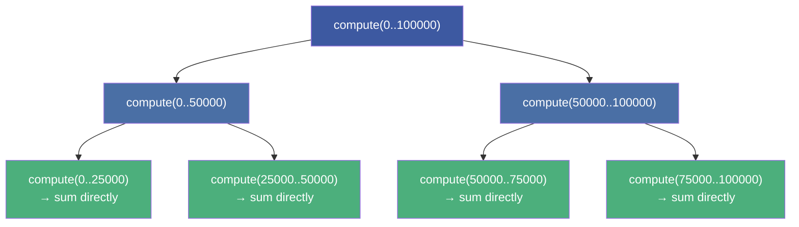
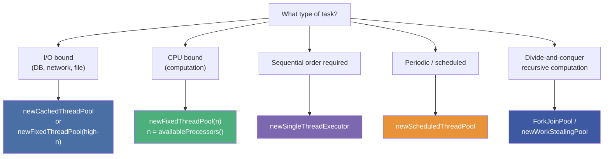

# :material-pencil: Topic Note Part 3: ExecutorService, Thread Pools & ForkJoin

> **Course:** Mastering Java Concurrency and Multithreading — Tim Buchalka (Udemy)
> **Section:** 21 — Mastering Java Concurrency and Multithreading
> **Lectures:** 15–20
> **Status:** :material-check-circle: Complete

---

## :material-target: Learning Objectives

By the end of this part, you should be able to:

- [x] Explain what `ExecutorService` is and why it replaces manual thread creation
- [x] Use `execute(Runnable)` vs `submit(Callable)` and explain the difference
- [x] Create and manage `SingleThreadExecutor`, `FixedThreadPool`, and `CachedThreadPool`
- [x] Shut down an executor gracefully with `shutdown()` + `awaitTermination()`
- [x] Use `Callable<T>` and `Future<T>` to retrieve results from concurrent tasks
- [x] Use `invokeAll()` and `invokeAny()` for bulk task submission
- [x] Schedule tasks with `ScheduledExecutorService` (`schedule`, `scheduleAtFixedRate`, `scheduleWithFixedDelay`)
- [x] Explain the work-stealing algorithm in `WorkStealingPool` / `ForkJoinPool`
- [x] Write `RecursiveTask<T>` for divide-and-conquer parallel computation

---

## :material-pool: 1. `ExecutorService` — The Thread Pool Abstraction

### Why Not Raw Threads?



**Thread pool advantages:**
- **Reuse** — worker threads are not destroyed after a task; they wait for the next task
- **Bounded resources** — limit the number of concurrent threads (no unbounded thread explosion)
- **Task queue** — excess tasks wait in a queue, not blocked callers
- **Lifecycle management** — clean shutdown, graceful termination

### The `ExecutorService` Interface

```java
public interface ExecutorService extends Executor {
    void execute(Runnable task);             // Fire-and-forget (no return value)
    <T> Future<T> submit(Callable<T> task); // Return Future<T> for result retrieval
    <T> Future<T> submit(Runnable task, T result); // Runnable with forced result
    Future<?> submit(Runnable task);        // Runnable wrapped in Future

    <T> List<Future<T>> invokeAll(Collection<Callable<T>> tasks) throws InterruptedException;
    <T> T invokeAny(Collection<Callable<T>> tasks) throws InterruptedException, ExecutionException;

    void shutdown();                         // Graceful — no new tasks, drain queue
    List<Runnable> shutdownNow();            // Aggressive — interrupt running threads
    boolean awaitTermination(long timeout, TimeUnit unit) throws InterruptedException;
    boolean isShutdown();
    boolean isTerminated();
}
```

---

## :material-server-network: 2. Factory Methods — `Executors` Class

### `newSingleThreadExecutor()`

```java
var executor = Executors.newSingleThreadExecutor(
    new ColorThreadFactory(ThreadColor.ANSI_BLUE)  // Custom thread factory
);

executor.execute(Main::countDown);   // Submit Runnable

executor.shutdown();
boolean done = executor.awaitTermination(500, TimeUnit.MILLISECONDS);
if (done) System.out.println("Finished!");
```



**Use when:** Tasks must execute in submission order, one at a time (e.g., database write serialization).

### `newFixedThreadPool(n)`

```java
int poolSize = 3;
var executor = Executors.newFixedThreadPool(poolSize, new ColorThreadFactory());

for (int i = 0; i < 10; i++) {
    executor.execute(Main::countDown);  // 10 tasks, only 3 threads
}
executor.shutdown();
```



**Use when:** CPU-bound tasks where `n ≈ Runtime.getRuntime().availableProcessors()`.

### `newCachedThreadPool()`

```java
var executor = Executors.newCachedThreadPool();
// Creates new threads on demand; reuses idle threads (60s idle timeout)
// Good for short-lived async tasks; bad for long-running tasks (unbounded growth)
```

### `ThreadFactory` — Custom Thread Configuration

```java
class ColorThreadFactory implements ThreadFactory {
    private String threadName;
    private int colorValue = 1;

    public ColorThreadFactory(ThreadColor color) {
        this.threadName = color.name();
    }

    @Override
    public Thread newThread(Runnable r) {
        Thread thread = new Thread(r);
        thread.setName(threadName);  // Name based on color enum
        return thread;
    }
}

// Usage
var blueExecutor = Executors.newSingleThreadExecutor(
    new ColorThreadFactory(ThreadColor.ANSI_BLUE)
);
```

---

## :material-cash-check: 3. `Callable<T>` and `Future<T>`

### `Callable` vs `Runnable`

| | `Runnable` | `Callable<T>` |
|---|---|---|
| **Return** | `void` | `T` (any type) |
| **Exception** | Cannot declare checked exceptions | Can throw `Exception` |
| **Use with** | `execute()` or `submit()` | `submit()` only |
| **SAM** | `void run()` | `T call() throws Exception` |

```java
Callable<Integer> sumTask = () -> {
    int sum = 0;
    for (int i = 1; i <= 10; i++) sum += i;
    return sum;  // Returns a value!
};

Future<Integer> future = executor.submit(sumTask);
```

### `Future<T>` — Handle for Async Results

```java
Future<Integer> future = executor.submit(sumTask);

future.isDone();              // true if completed (normally, cancelled, or exception)
future.isCancelled();         // true if cancelled before completion
future.cancel(true);          // Cancel; true = interrupt if running

Integer result = future.get();                              // Block until done
Integer result2 = future.get(500, TimeUnit.MILLISECONDS);  // Block with timeout
```

!!! warning "`Future.get()` Can Throw"
    - `ExecutionException` — if `call()` threw an exception (wraps it)
    - `InterruptedException` — if the waiting thread was interrupted
    - `TimeoutException` — if `get(timeout, unit)` expired
    Always handle all three.

### `invokeAll()` — Submit All, Wait for All

```java
List<Callable<Integer>> tasks = List.of(
    () -> sum(1, 10, 1, "red"),
    () -> sum(10, 100, 10, "blue"),
    () -> sum(2, 20, 2, "green")
);

var multiExecutor = Executors.newCachedThreadPool();
try {
    List<Future<Integer>> results = multiExecutor.invokeAll(tasks);
    // Blocks until ALL tasks complete (or exception/interrupt)

    for (var result : results) {
        System.out.println(result.get(500, TimeUnit.MILLISECONDS));
    }
} catch (InterruptedException | TimeoutException | ExecutionException e) {
    throw new RuntimeException(e);
} finally {
    multiExecutor.shutdown();
}
```



### `invokeAny()` — Submit All, Take First Winner

```java
// Returns the result of the FIRST task to complete successfully
// All other tasks are cancelled
Integer firstResult = multiExecutor.invokeAny(tasks);
System.out.println("First to finish: " + firstResult);
```

**Use case:** Redundant computation — submit the same job to multiple threads, take whoever finishes first (e.g., querying multiple data sources).

---

## :material-executor: 4. Shutdown — Graceful vs Immediate



```java
executor.shutdown();   // Signal shutdown (non-blocking)
try {
    // Wait up to 10 seconds for all tasks to finish
    if (!executor.awaitTermination(10, TimeUnit.SECONDS)) {
        executor.shutdownNow();   // Force if timeout exceeded
    }
} catch (InterruptedException e) {
    executor.shutdownNow();
    Thread.currentThread().interrupt();
}
```

---

## :material-clock-fast: 5. `ScheduledExecutorService` — Timed Tasks

### Factory

```java
ScheduledExecutorService scheduler = Executors.newScheduledThreadPool(4);
// OR single-threaded:
ScheduledExecutorService single = Executors.newSingleThreadScheduledExecutor();
```

### Three Scheduling Modes

```java
Runnable task = () -> System.out.println("Running at: " + ZonedDateTime.now());

// 1. Run ONCE after a delay
scheduler.schedule(task, 5, TimeUnit.SECONDS);

// 2. Fixed rate — start every N seconds from the first start
// (If task takes longer than period, next run starts immediately after previous ends)
ScheduledFuture<?> fixed = scheduler.scheduleAtFixedRate(
    task,
    2,    // initialDelay
    2,    // period (between START of each execution)
    TimeUnit.SECONDS
);

// 3. Fixed delay — wait N seconds AFTER previous execution ends
scheduler.scheduleWithFixedDelay(
    task,
    2,    // initialDelay
    3,    // delay (between END of last execution and START of next)
    TimeUnit.SECONDS
);
```



!!! info "Rate vs Delay"
    - `scheduleAtFixedRate`: Period is measured from **start of previous execution**. If a task runs longer than the period, the next run starts immediately (no accumulation of missed runs).
    - `scheduleWithFixedDelay`: Delay is measured from **end of previous execution**. Guarantees a rest period between runs regardless of task duration.

### Cancelling Scheduled Tasks

```java
ScheduledFuture<?> task = scheduler.scheduleAtFixedRate(job, 0, 2, TimeUnit.SECONDS);

// Check and cancel after 10 seconds
long start = System.currentTimeMillis();
while (!task.isDone()) {
    Thread.sleep(2000);
    if ((System.currentTimeMillis() - start) / 1000 > 10) {
        task.cancel(true);   // Cancel with interrupt
    }
}
scheduler.shutdown();
```

---

## :material-fork: 6. `WorkStealingPool` & `ForkJoinPool`

### Work-Stealing Algorithm



**Work stealing:** Each worker has its own double-ended queue (deque). Workers process their own tasks from the front. Idle workers **steal tasks from the TAIL** of other workers' queues — minimizing contention (owner takes front, thieves take back).

### `newWorkStealingPool()`

```java
// Creates a ForkJoinPool with parallelism = available CPU cores
var executor = Executors.newWorkStealingPool();

// Equivalent to:
new ForkJoinPool(Runtime.getRuntime().availableProcessors());

System.out.println("CPUs: " + Runtime.getRuntime().availableProcessors());
System.out.println("Parallelism: " + ForkJoinPool.commonPool().getParallelism());
```

### `RecursiveTask<T>` — Divide and Conquer

```java
class RecursiveSumTask extends RecursiveTask<Long> {
    private final long[] numbers;
    private final int start, end, division;

    @Override
    protected Long compute() {
        // Base case: small enough to compute directly
        if ((end - start) <= (numbers.length / division)) {
            long sum = 0;
            for (int i = start; i < end; i++) sum += numbers[i];
            return sum;
        }
        // Recursive case: split into subtasks
        int mid = (start + end) / 2;
        RecursiveSumTask left  = new RecursiveSumTask(numbers, start, mid, division);
        RecursiveSumTask right = new RecursiveSumTask(numbers, mid, end, division);

        left.fork();   // Async submit to pool
        right.fork();  // Async submit to pool

        return left.join() + right.join();  // Wait for results + combine
    }
}

// Usage
ForkJoinPool pool = ForkJoinPool.commonPool();
RecursiveTask<Long> task = new RecursiveSumTask(numbers, 0, numbers.length, 2);
long result = pool.invoke(task);   // submit + wait for root task
```



### `RecursiveAction` vs `RecursiveTask<T>`

| | `RecursiveTask<T>` | `RecursiveAction` |
|---|---|---|
| **Returns** | `T` (a computed value) | `void` |
| **Use for** | Divide-and-conquer computation | Parallel operations with side effects |
| **Example** | Sum an array in parallel | Sort an array in parallel |

---

## :material-compare: 7. Choosing the Right Executor



---

## :material-help-circle: Questions Explored

- [x] Why is creating a new thread for every task inefficient?
- [x] What's the difference between `execute()` and `submit()`?
- [x] What states can a `Future` be in?
- [x] What exceptions can `Future.get()` throw and why?
- [x] What's the difference between `invokeAll()` and `invokeAny()`?
- [x] What's the difference between `shutdown()` and `shutdownNow()`?
- [x] What's the difference between `scheduleAtFixedRate` and `scheduleWithFixedDelay`?
- [x] How does the work-stealing algorithm prevent idle threads?
- [x] What's the difference between `RecursiveTask` and `RecursiveAction`?
- [x] When should you use `ForkJoinPool` vs `FixedThreadPool`?

---

## :material-navigation: Related Notes

| Part | Topic | Link |
|:----:|-------|------|
| 1 | Threads, States & Memory Model | [← Part 1](topic-note.md) |
| 2 | Synchronization & Locks | [← Part 2](topic-note-part2.md) |
| 3 | ExecutorService & Thread Pools | **You are here** |
| 4 | Parallel Streams & Concurrent Collections | [Part 4 →](topic-note-part4.md) |
| 5 | Thread Hazards, Atomics & WatchService | [Part 5 →](topic-note-part5.md) |

---

*Last Updated: 2026-07-01*
