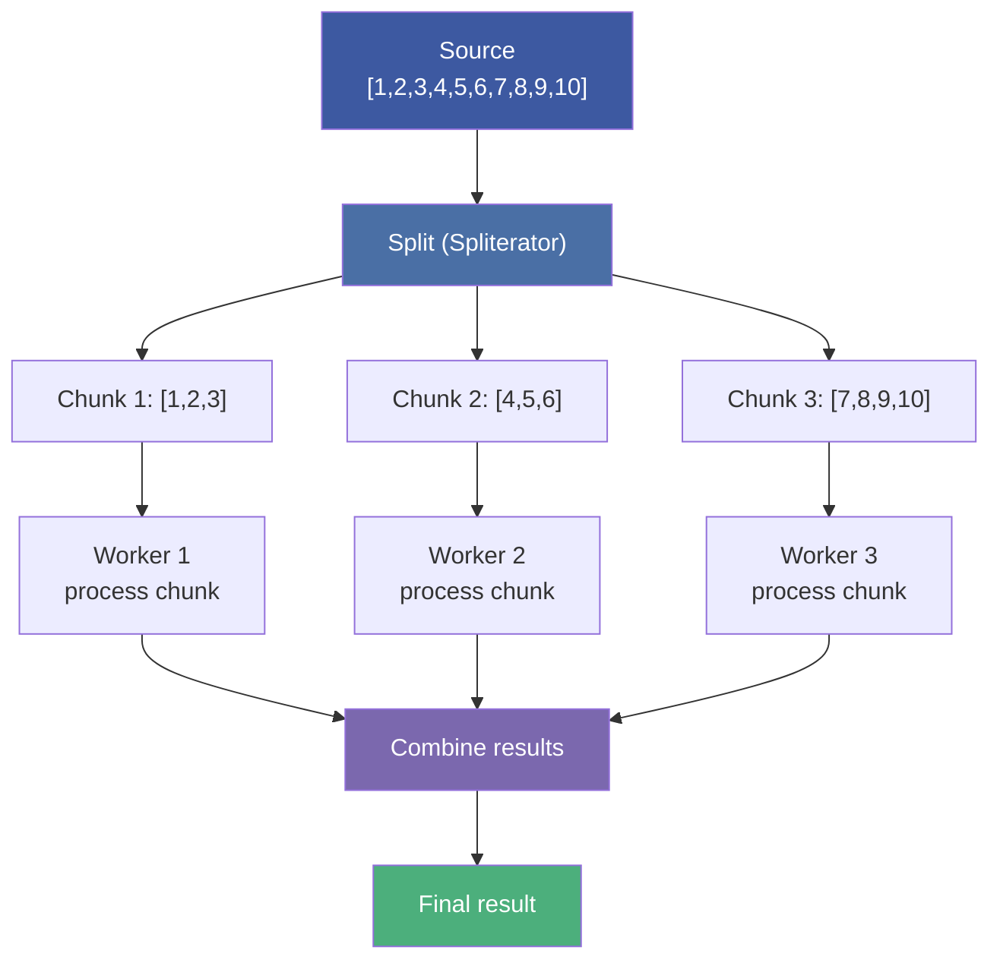
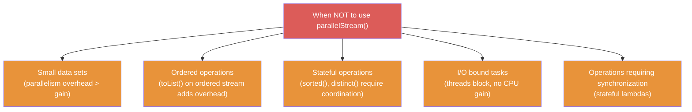
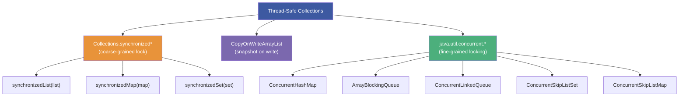
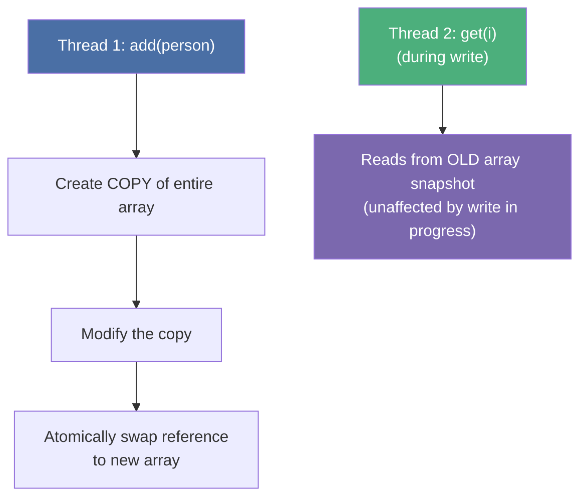
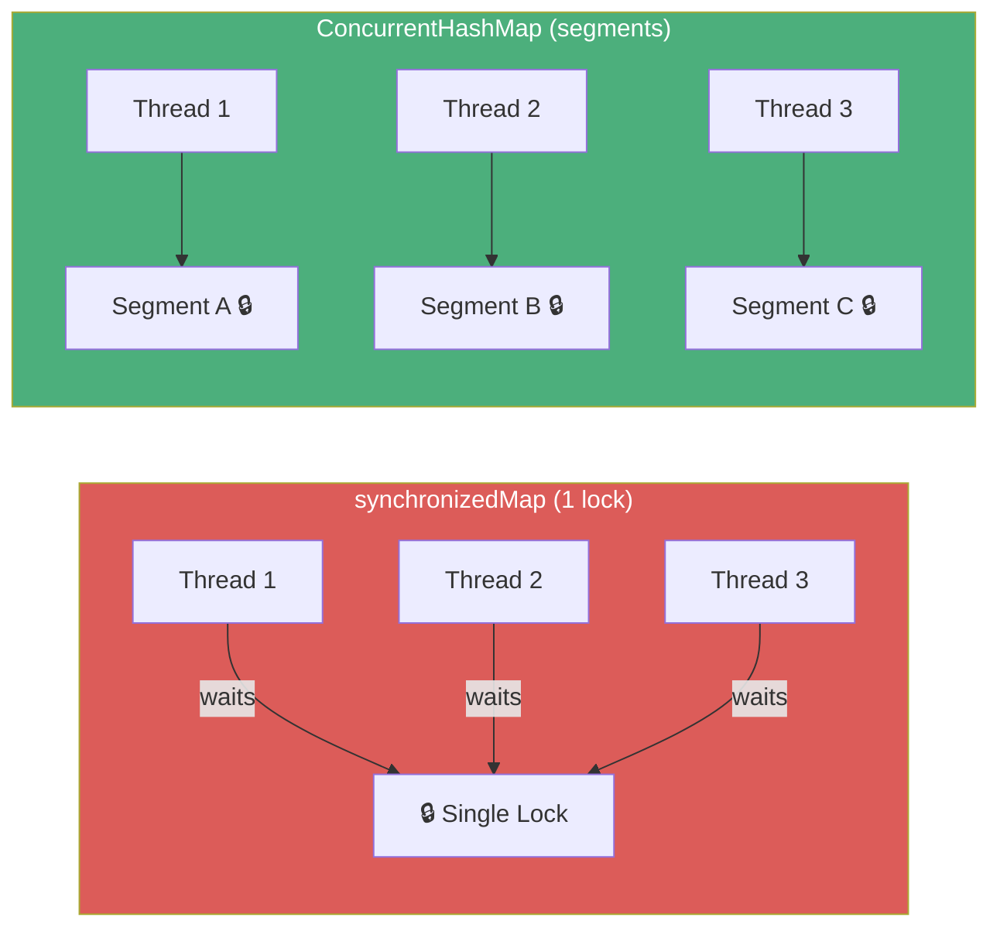
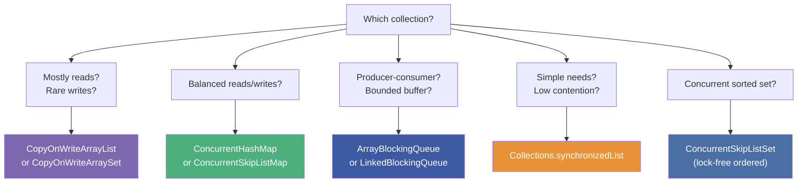

# :material-pencil: Topic Note Part 4: Parallel Streams & Concurrent Collections

> **Course:** Mastering Java Concurrency and Multithreading — Tim Buchalka (Udemy)
> **Section:** 21 — Mastering Java Concurrency and Multithreading
> **Lectures:** 21–25
> **Status:** :material-check-circle: Complete

---

## :material-target: Learning Objectives

By the end of this part, you should be able to:

- [x] Convert a sequential stream to parallel and understand the threading model
- [x] Identify when parallel streams help vs hurt performance
- [x] Use `forEachOrdered()` to preserve encounter order in parallel streams
- [x] Perform parallel reductions with `reduce()` (associativity requirement)
- [x] Use `Collectors.groupingByConcurrent()` for thread-safe collection in parallel streams
- [x] Distinguish `Collections.synchronizedList` from `CopyOnWriteArrayList`
- [x] Use `ConcurrentHashMap` and understand why it's faster than `synchronizedMap`
- [x] Use `ArrayBlockingQueue` as a bounded, blocking producer-consumer buffer
- [x] Implement a multi-threaded producer-consumer with `put()` and `take()`

---

## :material-parallel: 1. Parallel Streams

### What Is a Parallel Stream?

A parallel stream splits its source into multiple chunks and processes them concurrently using the **ForkJoinPool.commonPool()** (shared by default across the JVM):

```java
// Sequential
Arrays.stream(numbers).average().orElseThrow();

// Parallel — uses ForkJoinPool.commonPool()
Arrays.stream(numbers).parallel().average().orElseThrow();

// OR from a Collection
list.parallelStream().filter(...).collect(...);
```



### When Parallel Streams Help

```java
// ✅ GOOD: Large data, CPU-bound, stateless, unordered
int numbersLength = 100_000_000;
long[] numbers = new Random().longs(numbersLength, 1, numbersLength).toArray();

double averageParallel = Arrays.stream(numbers).parallel().average().orElseThrow();
// Can be 3-8x faster than sequential on multi-core machines
```

### When Parallel Streams Hurt



### `forEachOrdered()` — Preserving Encounter Order

```java
var persons = Stream.generate(Person::new)
    .limit(10)
    .sorted(Comparator.comparing(Person::lastName))
    .toArray();

// ❌ forEach() in parallel — ORDER NOT GUARANTEED
Arrays.stream(persons).parallel().forEach(System.out::println);

// ✅ forEachOrdered() — preserves original encounter order
Arrays.stream(persons).parallel().forEachOrdered(System.out::println);
```

!!! warning "Ordering Costs Performance"
    `forEachOrdered` re-serializes the terminal operation, eliminating much of the parallelism benefit. Use it only when ordering is truly required.

---

## :material-math-integral: 2. Parallel Stream Reduction

### The Associativity Requirement

For `reduce()` to work correctly in parallel, the combining function must be **associative** — the result must be the same regardless of how the work is grouped:

```java
// ✅ Associative — works correctly in parallel
int sum = IntStream.range(1, 101)
    .parallel()
    .reduce(0, Integer::sum);
// (1+2) + (3+4) == 1 + (2+3+4) → OK

// ✅ String concatenation in parallel (note: order may vary)
var words = new Scanner(text).tokens().toList();
var joined = words.parallelStream()
    .reduce("", (s1, s2) -> s1.concat(s2).concat(" "));
```

!!! danger "Non-Associative Operations Break Parallel Streams"
    Subtraction is NOT associative: `(10-3)-2 ≠ 10-(3-2)`. Never use non-associative operations with `reduce()` on parallel streams.

### `Collectors.groupingByConcurrent()` — Thread-Safe Collection

```java
// ❌ groupingBy() is NOT thread-safe for parallel streams
Map<String, Long> lastNameCounts = Stream.generate(Person::new)
    .limit(10000)
    .parallel()
    .collect(Collectors.groupingBy(           // ❌ May produce wrong results
        Person::lastName, Collectors.counting()));

// ✅ groupingByConcurrent() — designed for parallel streams
Map<String, Long> lastNameCounts = Stream.generate(Person::new)
    .limit(10000)
    .parallel()
    .collect(Collectors.groupingByConcurrent( // ✅ Thread-safe, uses ConcurrentHashMap
        Person::lastName, Collectors.counting()));

System.out.println(lastNameCounts.getClass().getName());
// java.util.concurrent.ConcurrentHashMap
```

---

## :material-lock-outline: 3. Thread-Safe Collections

### Overview



### `Collections.synchronizedList()` — Coarse Locking

```java
List<String> safeList = Collections.synchronizedList(new ArrayList<>());

// Each individual method call is synchronized
safeList.add("item");   // ← synchronized
safeList.get(0);        // ← synchronized

// ❌ BUT: Compound actions (iteration) still need external synchronization
synchronized (safeList) {           // ← You must synchronize on safeList
    for (String s : safeList) {     //   to prevent ConcurrentModificationException
        System.out.println(s);
    }
}
```

!!! warning "Coarse Locking Has Limitations"
    `synchronizedList` synchronizes each method individually but **not compound operations** like size-check-then-add. External synchronization is still needed for iteration.

### `CopyOnWriteArrayList` — Snapshot on Write

```java
CopyOnWriteArrayList<Person> masterList =
    Stream.generate(Person::new)
        .distinct()
        .limit(2500)
        .collect(CopyOnWriteArrayList::new,
                 CopyOnWriteArrayList::add,
                 CopyOnWriteArrayList::addAll);
```



| | `synchronizedList` | `CopyOnWriteArrayList` |
|---|---|---|
| **Read** | Synchronized (blocks writes) | **Zero locking** — reads old snapshot |
| **Write** | Synchronized (blocks reads) | Copies entire array — expensive |
| **Iteration** | Needs external lock | **Safe without lock** — iterates snapshot |
| **Best for** | Write-heavy | **Read-heavy**, infrequent writes |
| **Thread-safe?** | Yes | Yes |

```java
// CopyOnWriteArrayList use case: check-then-add for new visitors
if (!masterList.contains(visitor)) {
    masterList.add(visitor);          // Read + write — both thread-safe
    System.out.println("New visitor gets coupon!");
}
```

### `ConcurrentHashMap` — Segment-Level Locking

```java
// ❌ Collections.synchronizedMap — ONE lock for entire map
var syncMap = Collections.synchronizedMap(new TreeMap<String, Long>());
Stream.generate(Person::new)
    .limit(10000)
    .parallel()
    .forEach(p -> syncMap.merge(p.lastName(), 1L, Long::sum));  // contention!

// ✅ ConcurrentHashMap — segment-level or lock-striped (much less contention)
var concMap = new ConcurrentHashMap<String, Long>();
Stream.generate(Person::new)
    .limit(10000)
    .parallel()
    .forEach(p -> concMap.merge(p.lastName(), 1L, Long::sum));  // fine-grained
```



**Key `ConcurrentHashMap` atomic operations:**

```java
ConcurrentHashMap<String, Long> map = new ConcurrentHashMap<>();

map.putIfAbsent("key", 1L);                    // Atomic: only adds if key absent
map.computeIfAbsent("key", k -> 0L);           // Atomic: compute only if missing
map.merge("key", 1L, Long::sum);               // Atomic: add or merge value
map.compute("key", (k, v) -> v == null ? 1 : v + 1); // Atomic compute
```

---

## :material-queue: 4. `ArrayBlockingQueue` — Bounded Blocking Queue

### What Is It?

`ArrayBlockingQueue<E>` is a bounded, **thread-safe** queue backed by an array. It uses internal `ReentrantLock` + `Condition` objects to:
- **Block producers** (`put()`) when the queue is FULL
- **Block consumers** (`take()`) when the queue is EMPTY

This is the canonical implementation of the **bounded producer-consumer** pattern.


### Key Methods

| Method | Behavior When Full/Empty | Use When |
|--------|:---:|---|
| `put(e)` | **Blocks** (waits for space) | Producer: always wait |
| `offer(e, timeout, unit)` | Waits up to timeout, returns `false` | Producer: with timeout |
| `add(e)` | Throws `IllegalStateException` | Avoid — no blocking |
| `take()` | **Blocks** (waits for item) | Consumer: always wait |
| `poll(timeout, unit)` | Waits up to timeout, returns `null` | Consumer: with timeout |
| `remove()` | Throws `NoSuchElementException` | Avoid — no blocking |
| `drainTo(collection)` | Atomically drains all available | Bulk consumer |
| `peek()` | Returns head without removing | Non-blocking peek |

### Full Producer-Consumer Implementation

```java
// From VisitorList.java
private static final ArrayBlockingQueue<Person> newVisitors =
    new ArrayBlockingQueue<>(5);  // Bounded capacity of 5

// Producer
Runnable producer = () -> {
    Person visitor = new Person();
    boolean queued = false;
    try {
        queued = newVisitors.offer(visitor, 5, TimeUnit.SECONDS);  // Wait up to 5s
    } catch (InterruptedException e) {
        System.out.println("Interrupted!");
    }
    if (!queued) {
        System.out.println("Queue full! Draining to file...");
        List<Person> temp = new ArrayList<>();
        newVisitors.drainTo(temp);  // Drain all current items
        // write temp to file...
    }
};

// Consumer
Runnable consumer = () -> {
    Person visitor = null;
    try {
        visitor = newVisitors.take();   // Block until item available
    } catch (InterruptedException e) {
        throw new RuntimeException(e);
    }
    if (!masterList.contains(visitor)) {
        masterList.add(visitor);
        System.out.println("New visitor gets coupon!");
    }
};
```

### Scheduling Producers and Consumers

```java
// 1 producer, triggered every 3 seconds
ScheduledExecutorService producerExecutor =
    Executors.newSingleThreadScheduledExecutor();
producerExecutor.scheduleWithFixedDelay(producer, 0, 3, TimeUnit.SECONDS);

// 3 consumers, running every 1 second
ScheduledExecutorService consumerPool =
    Executors.newScheduledThreadPool(3);
for (int i = 0; i < 3; i++) {
    consumerPool.scheduleAtFixedRate(consumer, 6, 1, TimeUnit.SECONDS);
}
```

---

## :material-compare: 5. Choosing the Right Thread-Safe Collection



---

## :material-help-circle: Questions Explored

- [x] How does a parallel stream split work between `ForkJoinPool` workers?
- [x] Why is `groupingBy()` unsafe for parallel streams, but `groupingByConcurrent()` is safe?
- [x] When does a parallel stream hurt performance instead of helping?
- [x] What stream characteristic determines whether `forEachOrdered()` is needed?
- [x] What is the associativity requirement for `reduce()` in parallel streams?
- [x] How does `CopyOnWriteArrayList` avoid locking for reads?
- [x] Why is `ConcurrentHashMap` faster than `Collections.synchronizedMap`?
- [x] What is the difference between `put()` and `offer()` on `ArrayBlockingQueue`?
- [x] What does `drainTo()` do and when would you use it?
- [x] How do `ScheduledExecutorService` producers and consumers work together?

---

## :material-navigation: Related Notes

| Part | Topic | Link |
|:----:|-------|------|
| 1 | Threads, States & Memory Model | [← Part 1](topic-note.md) |
| 2 | Synchronization & Locks | [← Part 2](topic-note-part2.md) |
| 3 | ExecutorService & Thread Pools | [← Part 3](topic-note-part3.md) |
| 4 | Parallel Streams & Concurrent Collections | **You are here** |
| 5 | Thread Hazards, Atomics & WatchService | [Part 5 →](topic-note-part5.md) |

---

*Last Updated: 2026-07-01*
