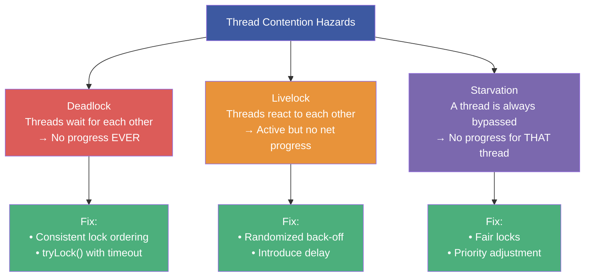
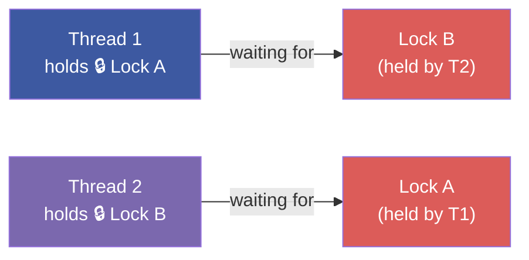
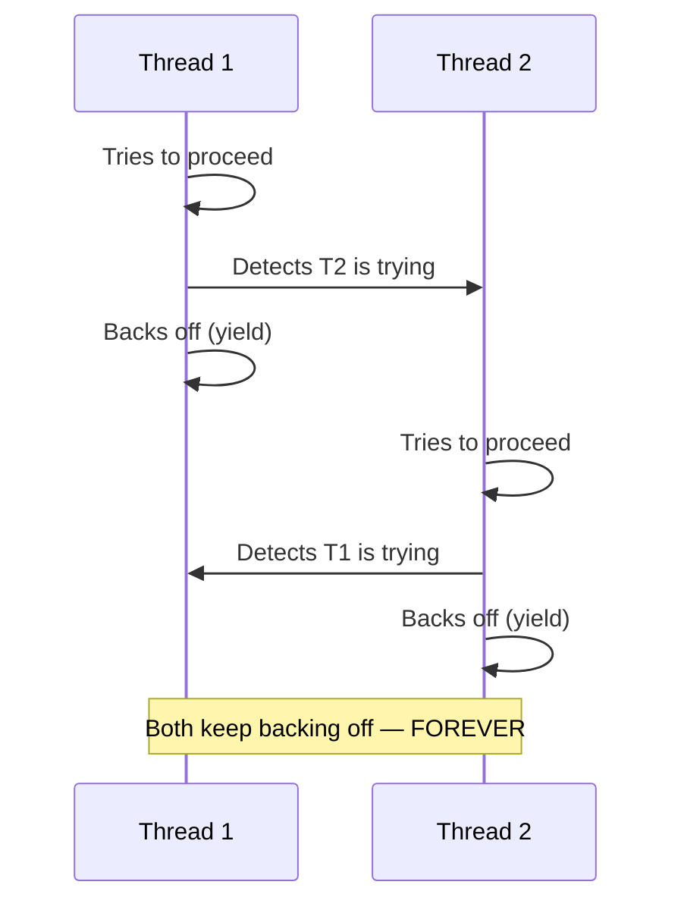
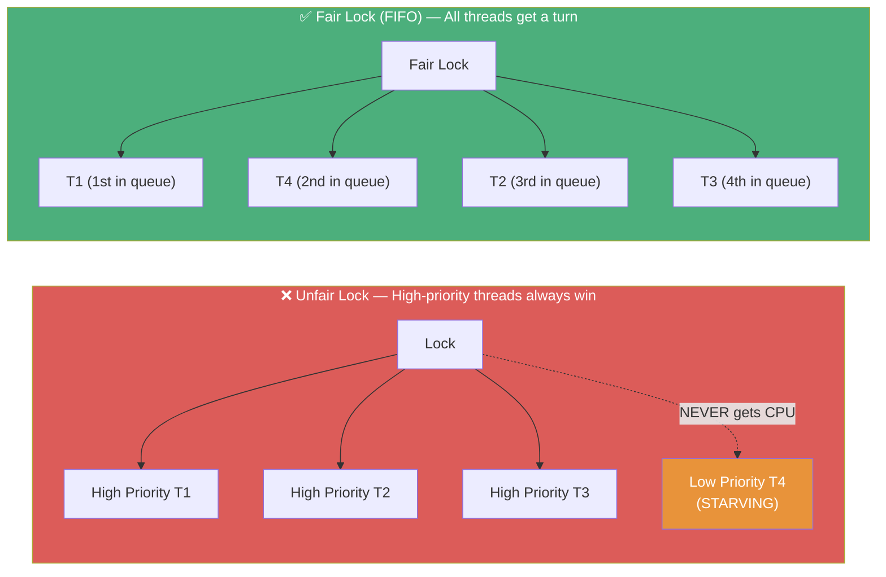
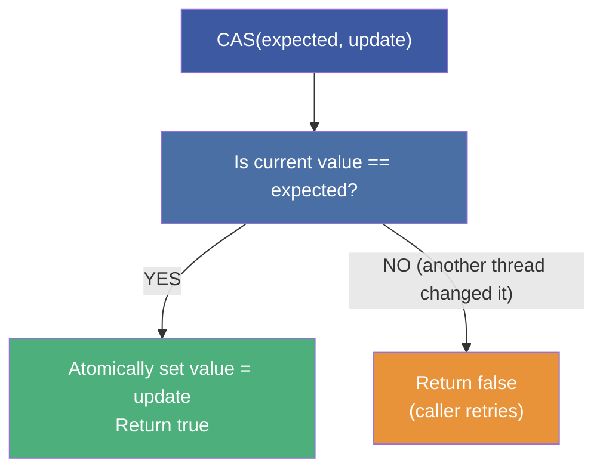
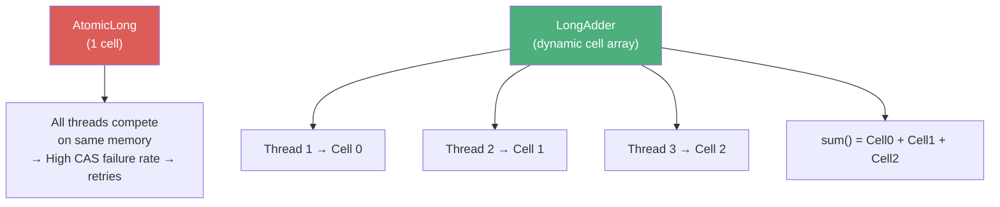
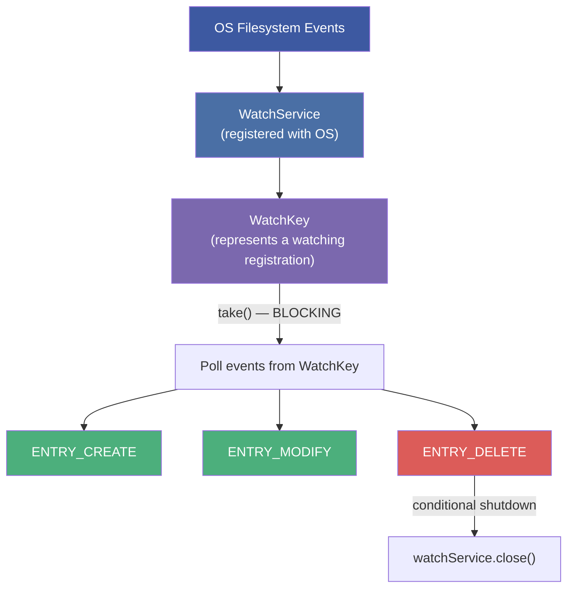

# :material-pencil: Topic Note Part 5: Thread Hazards, Atomic Variables & WatchService

> **Course:** Mastering Java Concurrency and Multithreading — Tim Buchalka (Udemy)
> **Section:** 21 — Mastering Java Concurrency and Multithreading
> **Lectures:** 26–30
> **Status:** :material-check-circle: Complete

---

## :material-target: Learning Objectives

By the end of this part, you should be able to:

- [x] Define and distinguish **deadlock**, **livelock**, and **starvation**
- [x] Identify the four Coffman conditions and which ones to break
- [x] Explain how consistent lock ordering prevents deadlock
- [x] Explain what livelock is and implement the randomized back-off solution
- [x] Explain thread starvation and configure fair locks to prevent it
- [x] Use `AtomicInteger`, `AtomicBoolean`, `AtomicReference` correctly
- [x] Explain CAS (Compare-And-Swap) and why atomic variables are lock-free
- [x] Use `LongAdder` for high-contention counter scenarios
- [x] Set up a `WatchService` to monitor a directory for filesystem changes
- [x] Handle `WatchEvent` types (`ENTRY_CREATE`, `ENTRY_MODIFY`, `ENTRY_DELETE`)

---

## :material-alert-octagon: 1. Thread Contention Hazards — The Three Dangers



---

## :material-lock: 2. Deadlock — Mutual Hold-and-Wait

### The Four Coffman Conditions (All Must Hold)

| # | Condition | Meaning |
|---|-----------|---------|
| 1 | **Mutual Exclusion** | Resources (locks) can't be shared simultaneously |
| 2 | **Hold and Wait** | Thread holds one resource while requesting another |
| 3 | **No Preemption** | OS cannot forcibly take a lock from a thread |
| 4 | **Circular Wait** | Thread A waits for B, B waits for A (cycle) |

Breaking **any one** condition prevents deadlock.

### Classic Two-Lock Deadlock

```java
Object lockA = new Object();
Object lockB = new Object();

// Thread 1: acquires A → waits for B
new Thread(() -> {
    synchronized (lockA) {
        Thread.sleep(100);
        synchronized (lockB) { /* work */ }
    }
}).start();

// Thread 2: acquires B → waits for A  ← DEADLOCK!
new Thread(() -> {
    synchronized (lockB) {
        Thread.sleep(100);
        synchronized (lockA) { /* work */ }
    }
}).start();
```



### Prevention Strategy 1: Consistent Lock Ordering

```java
// ✅ BOTH threads always acquire locks in the SAME ORDER (A then B)
// → Circular wait condition is broken
Thread t1 = new Thread(() -> {
    synchronized (lockA) { synchronized (lockB) { /* work */ } }
});
Thread t2 = new Thread(() -> {
    synchronized (lockA) { synchronized (lockB) { /* work */ } }  // Same order!
});
```

### Prevention Strategy 2: `tryLock()` with Timeout

```java
ReentrantLock lockA = new ReentrantLock();
ReentrantLock lockB = new ReentrantLock();

// Thread that won't deadlock
boolean gotA = false, gotB = false;
try {
    gotA = lockA.tryLock(500, TimeUnit.MILLISECONDS);
    gotB = lockB.tryLock(500, TimeUnit.MILLISECONDS);
    if (gotA && gotB) {
        // Do work with both locks
    } else {
        System.out.println("Could not acquire both locks — backing off");
    }
} catch (InterruptedException e) {
    Thread.currentThread().interrupt();
} finally {
    if (gotA) lockA.unlock();
    if (gotB) lockB.unlock();
}
```

---

## :material-refresh: 3. Livelock — The Polite Deadlock

### What Is Livelock?

Threads are NOT blocked — they are actively running — but they keep responding to each other's state changes in a way that prevents any real progress:



**Real-world analogy:** Two people in a narrow hallway who keep stepping the same direction to let each other pass.

### Livelock Example — The Maze Runner

```java
// MazeRunner backs off when another runner is on the same path
public void run() {
    while (!maze.isAtEnd(this)) {
        if (maze.isOtherRunnerHere(this)) {
            // Both back off simultaneously
            Thread.sleep(50);  // ← Fixed delay — can cause livelock!
        } else {
            maze.moveForward(this);
        }
    }
}
```

### Resolution: Randomized Back-Off

```java
// ✅ Randomized delay breaks the symmetry that causes livelock
Random random = new Random();

if (maze.isOtherRunnerHere(this)) {
    int backoffMs = random.nextInt(50) + 10;  // Random 10-60ms
    Thread.sleep(backoffMs);                   // Asymmetric retry
}
```

!!! tip "Why Randomization Breaks Livelock"
    If both threads use a **random** delay, the probability that they back off for exactly the same duration — and keep conflicting — approaches zero. Eventually one thread proceeds first.

---

## :material-account-off: 4. Starvation — The Overlooked Thread

### What Is Starvation?

A thread is repeatedly denied access to a resource even though the resource is not permanently held. It's "alive" but making no progress:



### `StarvingThread` — The Pattern

```java
// StarvingThread.java
class StarvingThread extends Thread {
    private final ReentrantLock lock;

    public void run() {
        int attempts = 0;
        while (true) {
            if (lock.tryLock()) {
                try {
                    System.out.println(getName() + " got the lock on attempt " + attempts);
                    return;
                } finally {
                    lock.unlock();
                }
            }
            attempts++;  // Can increment thousands of times if starved
        }
    }
}
```

### Fair Lock — FIFO Scheduling with `ReentrantLock(true)`

```java
// ❌ Default (unfair) — lock may be given to any waiting thread (random)
ReentrantLock unfairLock = new ReentrantLock();

// ✅ Fair — lock given to the thread that has been waiting the LONGEST (FIFO)
ReentrantLock fairLock = new ReentrantLock(true);

// All threads get a fair chance, even with different priorities
Thread[] threads = new Thread[10];
for (int i = 0; i < 10; i++) {
    threads[i] = new StarvingThread(fairLock, "Thread-" + i);
    threads[i].start();
}
```

### Fair Lock Trade-Off

| | Unfair `ReentrantLock` | Fair `ReentrantLock(true)` |
|---|---|---|
| **Throughput** | **Higher** (barging allowed) | Lower (strict FIFO queue) |
| **Starvation** | Possible | Prevented |
| **Overhead** | Minimal | More bookkeeping (queue management) |
| **Use when** | High throughput, starvation acceptable | Fairness is a correctness requirement |

!!! note "`synchronized` Cannot Be Made Fair"
    The intrinsic monitor lock is **always unfair** — the JVM does not guarantee FIFO among waiting threads. Only `ReentrantLock(true)` provides fairness.

---

## :material-atom: 5. Atomic Variables — Lock-Free Thread Safety

### The Problem with `synchronized` for Counters

```java
// synchronized works, but has overhead:
// - Thread switching context
// - Lock acquisition/release
// - Memory barriers

private int count = 0;
public synchronized void increment() { count++; }
```

### CAS — Compare-And-Swap

Atomic variables use **CPU-level CAS instructions** (no OS lock needed):



This is an optimistic (non-blocking) concurrency strategy — retries are cheap because CAS is a single CPU instruction.

### `AtomicInteger` — Thread-Safe Counter

```java
// From AtomicStudentId.java
class AtomicStudentId {
    private final AtomicInteger nextId = new AtomicInteger(0);

    public int getId() {
        return nextId.get();
    }

    public int getNextId() {
        return nextId.incrementAndGet();  // Atomic: read + increment + write
    }
}

// Key operations
AtomicInteger counter = new AtomicInteger(0);
counter.get();                    // Read current value
counter.set(10);                  // Write (not atomic with other ops)
counter.getAndIncrement();        // Return old value, then increment (like i++)
counter.incrementAndGet();        // Increment, then return new value (like ++i)
counter.addAndGet(5);             // Add 5, return new value
counter.compareAndSet(5, 10);     // If value == 5, set to 10, return true
counter.updateAndGet(v -> v * 2); // Apply function atomically
```

### `AtomicBoolean` — Flag Without `volatile`

```java
AtomicBoolean running = new AtomicBoolean(true);

Thread worker = new Thread(() -> {
    while (running.get()) {
        // Do work
    }
    System.out.println("Stopped cleanly");
});

// From another thread:
running.set(false);             // Atomic write — visible immediately
running.compareAndSet(true, false);  // Only stop if currently true
```

### `AtomicReference<T>` — Atomic Object Reference

```java
AtomicReference<String> statusRef = new AtomicReference<>("INITIALIZING");

// CAS on object identity
boolean updated = statusRef.compareAndSet("INITIALIZING", "RUNNING");
System.out.println(statusRef.get());  // "RUNNING"
```

### `LongAdder` — High-Contention Counter

When many threads increment the same `AtomicLong` simultaneously, all threads compete for CAS on a **single cell**. `LongAdder` solves this with **striping**:



```java
LongAdder counter = new LongAdder();
counter.increment();         // Increment a thread-local cell
counter.add(10);             // Add to a cell
long total = counter.sum();  // Sum all cells — not guaranteed to reflect concurrent increments
```

!!! tip "`LongAdder` vs `AtomicLong`"
    - **`AtomicLong`**: Better when you frequently read the value (fewer cells to sum)
    - **`LongAdder`**: Better for high-contention counters where you only read the final sum

### Full Example — Thread-Safe Student IDs

```java
// From ConcurrencyExtras/Main.java
class AtomicStudentId {
    private final AtomicInteger nextId = new AtomicInteger(0);
    public int getNextId() { return nextId.incrementAndGet(); }
}

AtomicStudentId idGenerator = new AtomicStudentId();
Callable<Student> studentMaker = () -> {
    int studentId = idGenerator.getNextId();   // Thread-safe, no locks
    return new Student("Tim " + studentId, random.nextInt(2018, 2026), studentId);
};

var executor = Executors.newCachedThreadPool();
for (int i = 0; i < 10; i++) {
    var futures = executor.invokeAll(Collections.nCopies(10, studentMaker));
}
```

---

## :material-eye: 6. `WatchService` — Filesystem Monitoring

### What Is WatchService?

`java.nio.file.WatchService` provides a **real-time filesystem event monitoring** API. Instead of polling a directory every N seconds, the OS notifies your application immediately when files change.



### Complete Example

```java
// From FileWatcherExample.java
public static void main(String[] args) throws IOException {

    // 1. Create WatchService
    WatchService watchService = FileSystems.getDefault().newWatchService();

    // 2. Register a directory and which event types to watch
    Path directory = Paths.get(".");   // Current directory
    directory.register(watchService,
        StandardWatchEventKinds.ENTRY_CREATE,
        StandardWatchEventKinds.ENTRY_MODIFY,
        StandardWatchEventKinds.ENTRY_DELETE);

    boolean keepGoing = true;

    // 3. Event loop
    while (keepGoing) {
        WatchKey watchKey;
        try {
            watchKey = watchService.take();  // BLOCKS until an event arrives
        } catch (InterruptedException e) {
            throw new RuntimeException(e);
        }

        // 4. Process all pending events from this key
        List<WatchEvent<?>> events = watchKey.pollEvents();
        for (WatchEvent<?> event : events) {
            Path context = (Path) event.context();  // The affected file
            System.out.printf("Event type: %s - File: %s%n",
                event.kind(), context);

            // 5. Conditional shutdown
            if (context.getFileName().toString().equals("Testing.txt")
                    && event.kind() == StandardWatchEventKinds.ENTRY_DELETE) {
                System.out.println("Shutting down watch service");
                watchService.close();
                keepGoing = false;
                break;
            }
        }

        // 6. MANDATORY: Reset the key to receive further events
        watchKey.reset();
    }
}
```

!!! danger "Always Call `watchKey.reset()`"
    After processing events from a `WatchKey`, you MUST call `watchKey.reset()` to put it back into the "ready" state. Without this, the key remains in "signalled" state and you will receive no further events for that directory.

### WatchService API Reference

| Method | Description |
|--------|-------------|
| `watchService.take()` | **Blocking** — waits until an event occurs |
| `watchService.poll()` | **Non-blocking** — returns `null` if no events |
| `watchService.poll(timeout, unit)` | Non-blocking with timeout |
| `watchKey.pollEvents()` | Retrieve and remove all pending events |
| `watchKey.reset()` | Put key back into ready state (MANDATORY) |
| `watchKey.cancel()` | Stop watching (deregister) |
| `watchKey.isValid()` | `false` if cancelled or watchService closed |
| `watchService.close()` | Stop all watching |

### Event Kinds

```java
StandardWatchEventKinds.ENTRY_CREATE  // File/directory was created
StandardWatchEventKinds.ENTRY_MODIFY  // File/directory was modified
StandardWatchEventKinds.ENTRY_DELETE  // File/directory was deleted
StandardWatchEventKinds.OVERFLOW      // Events may have been lost (queue overflowed)
```

### Running the Watcher in a Background Thread

```java
// Run the watch loop in a daemon thread so it doesn't prevent JVM exit
Thread watcherThread = new Thread(() -> {
    try {
        WatchService watcher = FileSystems.getDefault().newWatchService();
        Path dir = Paths.get("./data");
        dir.register(watcher, ENTRY_CREATE, ENTRY_MODIFY, ENTRY_DELETE);

        while (true) {
            WatchKey key = watcher.take();
            for (WatchEvent<?> event : key.pollEvents()) {
                System.out.printf("[%s] %s%n", event.kind(), event.context());
            }
            key.reset();
        }
    } catch (IOException | InterruptedException e) {
        System.out.println("Watcher stopped: " + e.getMessage());
    }
});
watcherThread.setDaemon(true);   // JVM exits when main thread ends
watcherThread.start();
```

---

## :material-shield-check: 7. Concurrency Anti-Patterns Summary

### Anti-Pattern Catalogue

| Anti-Pattern | Description | Fix |
|---|---|---|
| **Deadlock** | Circular lock wait | Consistent ordering, `tryLock()` |
| **Livelock** | Threads react endlessly | Randomized back-off |
| **Starvation** | Thread never gets CPU | Fair lock `ReentrantLock(true)` |
| **Race condition** | Unsynchronized read-modify-write | `synchronized`, atomic variables |
| **Memory visibility error** | Thread sees stale cached value | `volatile`, `synchronized` |
| **Double-checked locking** (broken) | Unsafe lazy init pattern | Use `volatile` + DCL, or initialization-on-demand holder |
| **Lock contention** | Too many threads on one lock | Striped locks, `ConcurrentHashMap`, `LongAdder` |
| **Missed signal** | `notify()` before `wait()`| Check condition in `while` loop |
| **Thread leak** | Executors never shut down | Always call `shutdown()` + `awaitTermination()` |
| **Publishing unsafe objects** | Sharing partially-constructed object | Safe publication via `volatile`, `final`, `synchronized` |

---

## :material-help-circle: Questions Explored

- [x] What are the four Coffman conditions for deadlock?
- [x] Which Coffman condition is easiest to eliminate in practice?
- [x] What is the difference between deadlock and livelock?
- [x] Why does randomized back-off solve livelock?
- [x] Why can the JVM not use fair scheduling for `synchronized`?
- [x] What is the performance trade-off of `ReentrantLock(true)`?
- [x] What is CAS and why does it avoid OS locking?
- [x] When does `LongAdder` outperform `AtomicLong`?
- [x] What happens if you forget `watchKey.reset()` in a `WatchService` loop?
- [x] What is the `OVERFLOW` event kind and when does it occur?

---

## :material-navigation: Related Notes

| Part | Topic | Link |
|:----:|-------|------|
| 1 | Threads, States & Memory Model | [← Part 1](topic-note.md) |
| 2 | Synchronization & Locks | [← Part 2](topic-note-part2.md) |
| 3 | ExecutorService & Thread Pools | [← Part 3](topic-note-part3.md) |
| 4 | Parallel Streams & Concurrent Collections | [← Part 4](topic-note-part4.md) |
| 5 | Thread Hazards, Atomics & WatchService | **You are here** |

---

*Last Updated: 2026-07-01*
