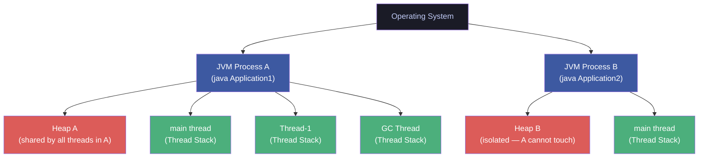
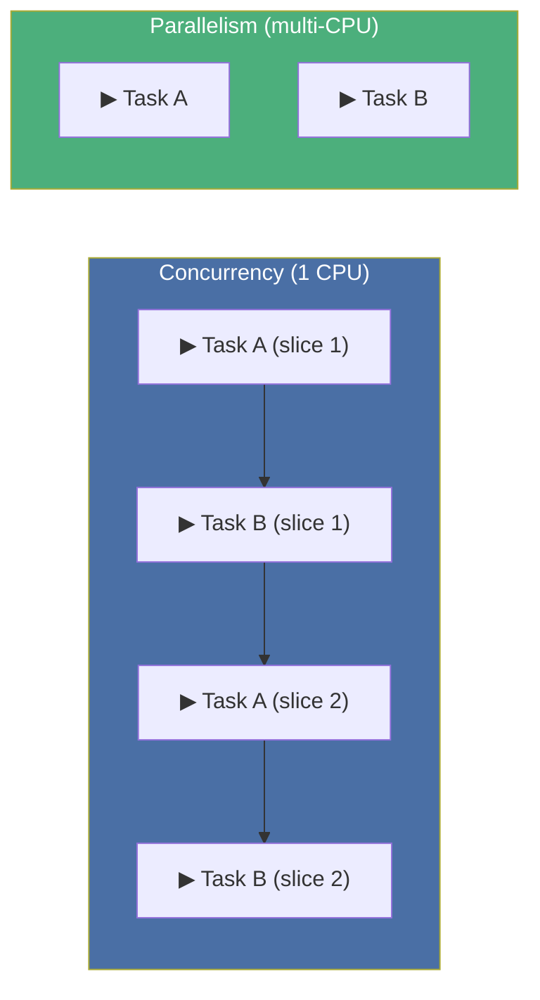
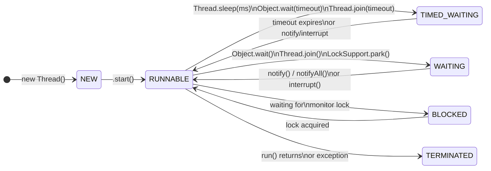
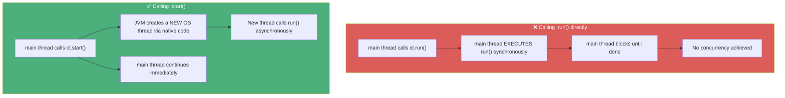
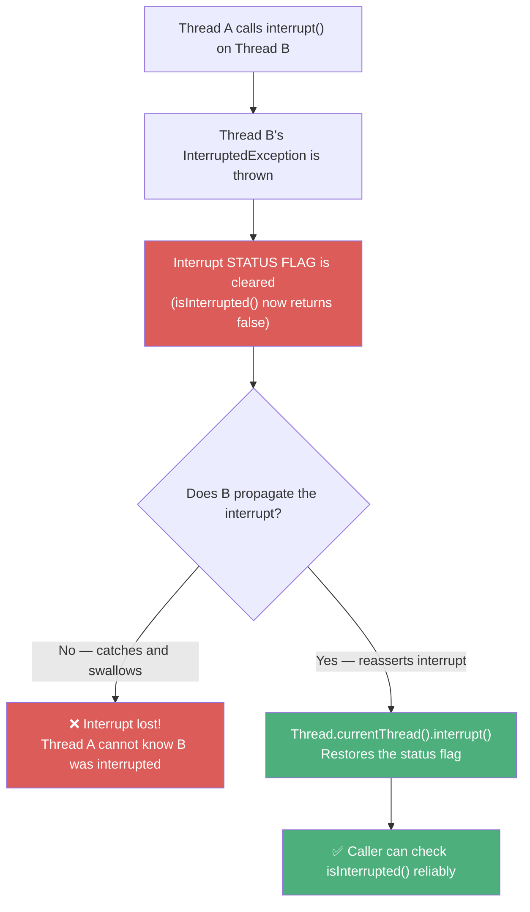
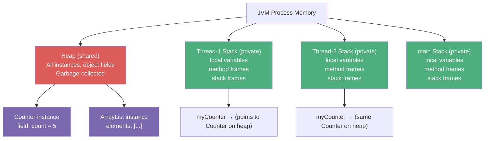
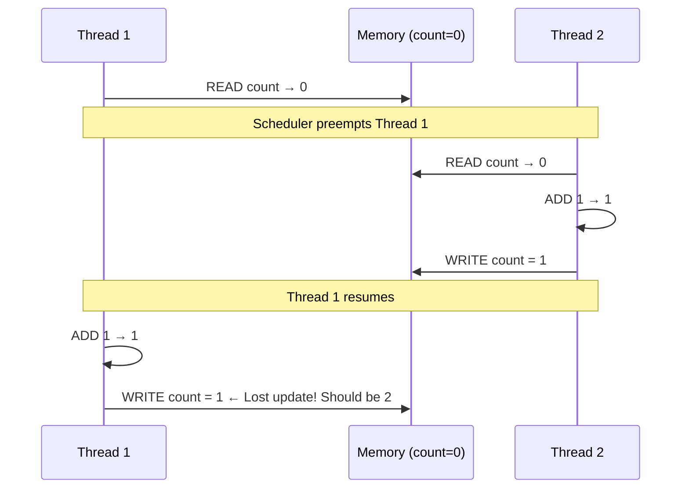
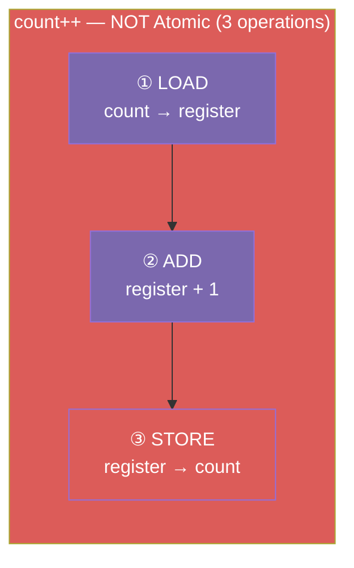
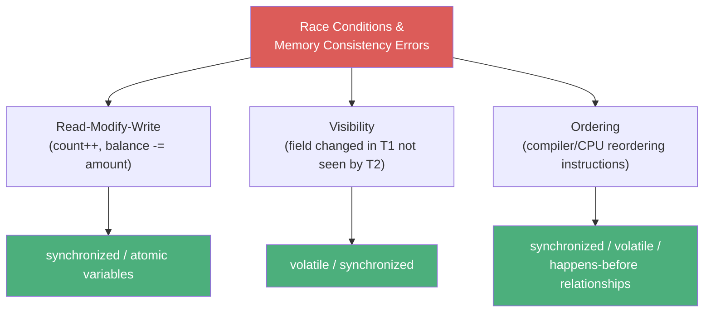

# :material-pencil: Topic Note Part 1: Threads, States & the Java Memory Model

> **Course:** Mastering Java Concurrency and Multithreading — Tim Buchalka (Udemy)
> **Section:** 21 — Mastering Java Concurrency and Multithreading
> **Lectures:** 1–7
> **Status:** :material-check-circle: Complete

---

## :material-target: Learning Objectives

By the end of this part, you should be able to:

- [x] Distinguish a **Process** from a **Thread** and explain their memory relationship
- [x] Enumerate and explain all six **Thread lifecycle states**
- [x] Create threads via `extends Thread` AND via `Runnable` / lambda — and pick the right approach
- [x] Explain the critical difference between calling `run()` vs `start()`
- [x] Use `Thread.sleep()`, `interrupt()`, `isInterrupted()`, and `join()` correctly
- [x] Apply the **interrupt reassertion idiom** to preserve interrupt status across catch blocks
- [x] Describe how the **heap** and **thread stack** differ and why the distinction matters
- [x] Explain **instruction interleaving**, loss of **atomicity**, and **memory consistency errors**

---

## :material-server: 1. Process vs Thread — The Foundation

### Definitions

| Concept | Definition | Memory |
|---------|-----------|--------|
| **Process** | A running instance of a program (e.g., a JVM instance) | Has its own private **heap** |
| **Thread** | A single unit of execution *within* a process | Shares the process **heap**; has its own private **thread stack** |



!!! important "The Two Key Memory Rules"
    1. **Heap** — shared across all threads of the same process. Object fields live here.
    2. **Thread Stack** — completely private to one thread. Local variables and method call frames live here.

### Why Use Multiple Threads?

- **Offload blocking I/O** — while one thread downloads data, the main thread stays responsive
- **Parallel computation** — split large datasets across CPU cores to reduce wall-clock time
- **Responsive UIs** — prevent the main/UI thread from freezing on slow operations
- **Web servers** — handle thousands of simultaneous client connections concurrently

### Concurrency vs Parallelism



**Concurrency** = tasks make *incremental* progress by time-slicing (even on one CPU).  
**Parallelism** = tasks literally execute *simultaneously* on different CPU cores.

Java threads support both — the JVM scheduler decides when to preempt.

---

## :material-state-machine: 2. Thread Lifecycle States

Every Java thread is always in exactly one of six states defined in `Thread.State`:



| State | When | Observable From |
|-------|------|----------------|
| `NEW` | `new Thread()` — not yet started | Outside thread |
| `RUNNABLE` | Executing on CPU or ready to execute | Inside thread: always RUNNABLE |
| `BLOCKED` | Waiting to acquire a monitor lock | Outside thread |
| `WAITING` | Indefinitely waiting (e.g., `Object.wait()`) | Outside thread |
| `TIMED_WAITING` | Waiting with a timeout (`Thread.sleep`) | Outside thread |
| `TERMINATED` | `run()` returned or threw an uncaught exception | Outside thread |

!!! info "Inside vs Outside Perspective"
    When you call `getState()` *from inside the thread's own `run()` method*, you will **always** see `RUNNABLE` — the thread is by definition executing. The `BLOCKED` / `WAITING` / `TIMED_WAITING` states are only visible to *other* threads observing this thread.

### Thread Identity Fields

```java
Thread t = Thread.currentThread();

System.out.println(t);              // Thread[main,5,main]
                                    // format: name, priority, group

t.getId();           // Unique long (e.g., 1 for main)
t.getName();         // "main"
t.getPriority();     // 5 (NORM_PRIORITY)
t.getState();        // RUNNABLE
t.getThreadGroup();  // java.lang.ThreadGroup[name=main, ...]
t.isAlive();         // true while running
t.isDaemon();        // false for user threads (JVM exits when all user threads finish)
```

**Thread Priority Constants:**

| Constant | Value | Meaning |
|----------|-------|---------|
| `Thread.MIN_PRIORITY` | 1 | Background hint |
| `Thread.NORM_PRIORITY` | 5 | Default |
| `Thread.MAX_PRIORITY` | 10 | Critical hint |

!!! warning "Priority Is a Hint, Not a Guarantee"
    Priority behavior varies across JVM implementations and operating systems. Never design correctness around thread scheduling priority — use synchronization constructs instead.

---

## :material-code-braces: 3. Creating Threads — Two Strategies

### Strategy 1: Extend `Thread`

```java
// CustomThread.java
public class CustomThread extends Thread {

    @Override
    public void run() {
        for (int i = 0; i < 5; i++) {
            System.out.println("Custom thread: " + i);
            try {
                Thread.sleep(500);
            } catch (InterruptedException e) {
                e.printStackTrace();
            }
        }
    }
}

// Usage
CustomThread ct = new CustomThread();
ct.start();   // ← NOT ct.run()!
```

### Strategy 2: Implement `Runnable` (Preferred)

```java
// Using a lambda (most concise)
Runnable task = () -> {
    for (int i = 0; i < 8; i++) {
        System.out.println("Runnable thread: " + i);
        try {
            TimeUnit.MILLISECONDS.sleep(250);
        } catch (InterruptedException e) {
            e.printStackTrace();
        }
    }
};

Thread t = new Thread(task);
t.start();

// Inline — even more concise
new Thread(() -> System.out.println("Hello from thread!")).start();
```

### `start()` vs `run()` — The Most Important Distinction



!!! danger "Never Call `run()` for Concurrency"
    Calling `thread.run()` executes the method synchronously on the **calling thread**. Zero concurrency. `start()` is what triggers the JVM's native thread creation and invokes `run()` on the **new** thread.

### `start()` Internals

Inside `Thread.start()` (simplified):

```java
public synchronized void start() {
    // Check not already started
    if (threadStatus != 0) throw new IllegalThreadStateException();
    group.add(this);
    start0();    // ← native method — calls into OS (C/C++) to create OS thread
}

private native void start0();  // OS-level thread creation
```

The `native` keyword means the implementation is in C/C++ and talks directly to the OS thread scheduler.

### Comparison

| | `extends Thread` | `implements Runnable` / lambda |
|---|---|---|
| **Flexibility** | Cannot extend any other class | Can extend any class |
| **Coupling** | Tightly coupled to Thread | Loosely coupled (task separate from threading) |
| **Reuse** | Thread IS the task | Runnable can be submitted to ExecutorService too |
| **Access** | Direct access to Thread methods | Must use `Thread.currentThread()` |
| **Best Use** | Rare — when you need to override Thread behavior | **Preferred in all cases** |

---

## :material-sleep: 4. Managing Running Threads

### `Thread.sleep(ms)` — Pausing Execution

```java
// Static method — always applies to the CURRENT thread
Thread.sleep(1000);                            // 1 second pause

// Via TimeUnit (more readable, recommended)
TimeUnit.SECONDS.sleep(1);
TimeUnit.MILLISECONDS.sleep(500);
TimeUnit.NANOSECONDS.sleep(100_000);
```

!!! warning "`sleep()` Does Not Release Locks"
    A sleeping thread **retains any monitors it holds**. Other threads waiting on those locks are still blocked. This is different from `Object.wait()`, which releases the lock.

### `interrupt()` — Requesting Thread Cancellation

```java
Thread downloadThread = new Thread(() -> {
    for (int i = 0; i < 10; i++) {
        System.out.print(".");
        try {
            Thread.sleep(500);
        } catch (InterruptedException e) {
            // ⚠️ Interrupt status is CLEARED when exception is thrown
            System.out.println("Interrupted! Cleaning up...");
            Thread.currentThread().interrupt(); // ← REASSERT the interrupt
            break;
        }
    }
});

downloadThread.start();
Thread.sleep(2000);          // Let it run for 2 seconds
downloadThread.interrupt();  // Request cancellation
```

### The Interrupt Reassertion Idiom



!!! important "The Interrupt Reassertion Rule"
    When you catch `InterruptedException` and are **not re-throwing it**, you MUST call `Thread.currentThread().interrupt()` to restore the interrupt status flag. Otherwise the interrupt signal is permanently lost.

### `join()` — Thread Dependencies

`join()` causes the *calling* thread to block until the *joined* thread terminates:

```java
Thread downloadThread = new Thread(downloadTask, "download-thread");
Thread installThread  = new Thread(installTask,  "install-thread");

downloadThread.start();

// Main thread BLOCKS here until downloadThread finishes
try {
    downloadThread.join();        // Wait indefinitely
    // downloadThread.join(5000); // Wait at most 5 seconds
} catch (InterruptedException e) {
    Thread.currentThread().interrupt();
}

// Only start install if download succeeded (not interrupted)
if (!downloadThread.isInterrupted()) {
    installThread.start();
} else {
    System.out.println("Install cancelled — download was interrupted");
}
```

### `isAlive()` vs `isInterrupted()`

| Method | Returns | Clears Flag? |
|--------|---------|:---:|
| `thread.isAlive()` | `true` if still running (not TERMINATED) | No |
| `thread.isInterrupted()` | `true` if interrupt flag is set | **No** |
| `Thread.interrupted()` (static) | `true` if current thread's flag is set | **Yes** — side effect! |

---

## :material-memory: 5. The Java Memory Model — Heap vs Thread Stack

### Memory Layout



### What Lives Where?

| Data | Location | Accessible By |
|------|----------|:---:|
| Primitive local variable (`int x = 5`) | Thread Stack | Only that thread |
| Object reference local variable (`Counter c`) | Thread Stack (the reference) | Only that thread |
| The actual object (`new Counter()`) | Heap | **All threads** |
| Object's fields (`counter.count`) | Heap | **All threads** |
| `static` fields | Method Area / Heap | **All threads** |

!!! danger "The Danger Zone"
    The reference is private to the stack, but the **object it points to** lives on the shared heap. Two threads holding references to the *same object* are mutating the **same fields** concurrently — this is where race conditions are born.

### Heap Isolation Between Processes

```java
// Application A:
int[] data = new int[1_000_000];  // Heap A

// Application B CANNOT access Heap A — processes are isolated
// This is why inter-process communication needs IPC (sockets, files, etc.)
```

---

## :material-shuffle-variant: 6. Interleaving, Atomicity & Memory Consistency

### Instruction Interleaving

On a single CPU (or even multiple CPUs), threads don't execute in a predetermined alternating order — the OS scheduler preempts threads at any instruction boundary:



### Lost Update — The Race Condition

```java
// Shared state — on the heap
private static int count = 0;

// Thread 1 and Thread 2 both execute:
count++;
// count++ is NOT ATOMIC — it's THREE bytecode instructions:
// 1. LOAD count from memory into register
// 2. ADD 1 to register value
// 3. STORE register back to count in memory
```



### Memory Consistency Errors

Even without interleaving, thread-local CPU caches can diverge from main memory:

```java
// Thread 1 writes:
running = false;  // ← Thread 2 might not "see" this!

// Thread 2 checks:
while (running) { ... }  // ← May loop forever with a stale cached value
```

The Java Memory Model (JMM) guarantees visibility ONLY through synchronization actions:
- `synchronized` blocks (acquire/release)
- `volatile` variables (flush on write, invalidate on read)
- `java.util.concurrent` primitives

Without these, there is **no guarantee** a change made by one thread will be visible to another.

### Summary: What You Need Synchronization For



---

## :material-alert: Common Pitfalls in Part 1

### 1. Calling `run()` Instead of `start()`

```java
customThread.run();   // ❌ Synchronous — same thread, no concurrency
customThread.start(); // ✅ Asynchronous — new thread created
```

### 2. Swallowing `InterruptedException`

```java
// ❌ Wrong — interrupt signal lost forever
try { Thread.sleep(1000); } catch (InterruptedException e) { }

// ✅ Correct — reassert the interrupt
try { Thread.sleep(1000); } catch (InterruptedException e) {
    Thread.currentThread().interrupt();
}
```

### 3. Confusing Thread Priority with Determinism

```java
thread.setPriority(Thread.MAX_PRIORITY); // This is a HINT, not a guarantee
```

### 4. Starting a Thread Twice

```java
Thread t = new Thread(task);
t.start();
t.start(); // ❌ IllegalThreadStateException — cannot restart a thread
```

---

## :material-help-circle: Questions Explored

- [x] What is the difference between a process and a thread?
- [x] What memory does each thread have exclusively, and what is shared?
- [x] Why can two JVM processes not share the same heap?
- [x] What are the six thread states and when does each occur?
- [x] Why does calling `run()` directly produce no concurrency?
- [x] What does `start()` actually do under the hood?
- [x] When should you prefer `implements Runnable` over `extends Thread`?
- [x] What happens to the interrupt status flag when `InterruptedException` is caught?
- [x] Why must you call `Thread.currentThread().interrupt()` in a catch block?
- [x] What is a race condition and why does `count++` suffer from one?
- [x] What is a memory consistency error?

---

## :material-navigation: Related Notes

| Part | Topic | Link |
|:----:|-------|------|
| 1 | Threads, States & Memory Model | **You are here** |
| 2 | Synchronization & Locks | [Part 2 →](topic-note-part2.md) |
| 3 | ExecutorService & Thread Pools | [Part 3 →](topic-note-part3.md) |
| 4 | Parallel Streams & Concurrent Collections | [Part 4 →](topic-note-part4.md) |
| 5 | Thread Hazards, Atomics & WatchService | [Part 5 →](topic-note-part5.md) |

---

*Last Updated: 2026-07-01*
