# :material-book-open-page-variant: Book Reading: OOP & Class Design Internals

> **Book:** Effective Java by Joshua Bloch (3rd Edition)  
> **Relevant Chapters:** 2-4 (Creating & Destroying Objects, Common Methods, Classes & Interfaces)  
> **Status:** :material-check-circle: Complete

---

## :material-target: Reading Goals

- [x] Understand best practices for object creation
- [x] Learn common method contracts (equals, hashCode, toString)
- [x] Master class and interface design principles

---

## :material-book-open-variant: Chapter 2: Creating and Destroying Objects

### Item 1: Consider Static Factory Methods Instead of Constructors

#### Key Takeaways

A **static factory method** is a static method that returns an instance of the class. Unlike constructors, these methods have names, can return cached instances, and can return subtypes.

```java
// Constructor approach (limited)
BigInteger prime = new BigInteger(100, 10, new Random());

// Static factory approach (clearer intent)
BigInteger prime = BigInteger.probablePrime(100, new Random());
```

!!! tip "Named Creation Methods"
    Static factory methods like `probablePrime()` immediately tell you what kind of object you're getting, unlike a constructor that only shows parameter types.

#### Advantages Over Constructors

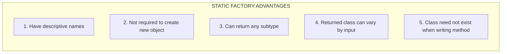

**1. They have names**

```java
// Which constructor creates a probable prime? Not obvious!
BigInteger(int, int, Random)

// Static factory - crystal clear intent
BigInteger.probablePrime(int, Random)
```

**2. Not required to create a new object each time**

```java
// Boolean.valueOf() returns cached TRUE or FALSE instances
// Never creates new Boolean objects!
public static Boolean valueOf(boolean b) {
    return b ? Boolean.TRUE : Boolean.FALSE;
}
```

This enables **instance-controlled** classes:
- Singletons (only one instance exists)
- Noninstantiable classes (no instances exist)
- Flyweight pattern (reuse immutable instances)

**3. Can return any subtype of the return type**

```java
// Returns different implementations based on size!
public static <E extends Enum<E>> EnumSet<E> noneOf(Class<E> elementType) {
    if (elementType.getEnumConstants().length <= 64)
        return new RegularEnumSet<>(elementType);  // Small set
    else
        return new JumboEnumSet<>(elementType);    // Large set
}
```

The caller only knows about `EnumSet` - the implementation is hidden!

**4. Returned class can vary based on input parameters**

```java
// Same factory, different return types based on input
EnumSet<Color> colors = EnumSet.of(Color.RED, Color.BLUE);
// Returns RegularEnumSet or JumboEnumSet - client doesn't care!
```

**5. Class of returned object need not exist when writing the method**

This enables **service provider frameworks** like JDBC:
```java
// The PostgreSQL driver doesn't exist when writing this API
Connection conn = DriverManager.getConnection(url);
// Driver loaded at runtime!
```

#### Disadvantages

| Disadvantage | Mitigation |
|--------------|------------|
| Classes without public constructors cannot be subclassed | Use composition over inheritance (Item 18) |
| Hard to find in API documentation | Follow naming conventions |

#### Common Naming Conventions

| Name | Purpose | Example |
|------|---------|---------|
| `from` | Type conversion | `Date.from(instant)` |
| `of` | Aggregation | `EnumSet.of(RED, BLUE)` |
| `valueOf` | Same value, maybe cached | `Integer.valueOf(42)` |
| `getInstance` | Return instance (maybe cached) | `StackWalker.getInstance()` |
| `newInstance` | Always new instance | `Array.newInstance(...)` |
| `getType` | Factory in different class | `Files.getFileStore(path)` |
| `newType` | New instance from different class | `Files.newBufferedReader(...)` |

---

### Item 2: Consider a Builder When Faced with Many Constructor Parameters

#### Key Takeaways

When a class has **many constructor parameters** (especially optional ones), the **Builder pattern** provides readable, flexible object creation.

#### The Problem: Telescoping Constructors

```java
// ❌ BAD: Hard to read, easy to swap parameters!
public class NutritionFacts {
    public NutritionFacts(int servingSize, int servings) { ... }
    public NutritionFacts(int servingSize, int servings, int calories) { ... }
    public NutritionFacts(int servingSize, int servings, int calories, int fat) { ... }
    public NutritionFacts(int servingSize, int servings, int calories, int fat, 
                          int sodium, int carbohydrate) { ... }
}

// Easy mistake: Did I pass calories or fat first?
NutritionFacts facts = new NutritionFacts(240, 8, 100, 0, 35, 27);
```

#### The Problem: JavaBeans Pattern

```java
// ❌ BAD: Object in inconsistent state during construction!
NutritionFacts facts = new NutritionFacts();
facts.setServingSize(240);  // Object is incomplete here!
facts.setServings(8);
facts.setCalories(100);     // Still being built...
facts.setSodium(35);
// Object is now mutable forever
```

#### The Solution: Builder Pattern

```java
// ✅ GOOD: Readable, immutable, and safe!
public class NutritionFacts {
    private final int servingSize;
    private final int servings;
    private final int calories;
    private final int fat;
    private final int sodium;
    private final int carbohydrate;

    public static class Builder {
        // Required parameters
        private final int servingSize;
        private final int servings;

        // Optional parameters - initialized to default values
        private int calories      = 0;
        private int fat           = 0;
        private int sodium        = 0;
        private int carbohydrate  = 0;

        public Builder(int servingSize, int servings) {
            this.servingSize = servingSize;
            this.servings    = servings;
        }

        public Builder calories(int val) {
            calories = val;
            return this;  // Return this for method chaining
        }

        public Builder fat(int val) {
            fat = val;
            return this;
        }

        public Builder sodium(int val) {
            sodium = val;
            return this;
        }

        public Builder carbohydrate(int val) {
            carbohydrate = val;
            return this;
        }

        public NutritionFacts build() {
            return new NutritionFacts(this);
        }
    }

    private NutritionFacts(Builder builder) {
        servingSize  = builder.servingSize;
        servings     = builder.servings;
        calories     = builder.calories;
        fat          = builder.fat;
        sodium       = builder.sodium;
        carbohydrate = builder.carbohydrate;
    }
}
```

#### Using the Builder

```java
// Fluent, readable, self-documenting!
NutritionFacts cocaCola = new NutritionFacts.Builder(240, 8)
        .calories(100)
        .sodium(35)
        .carbohydrate(27)
        .build();
```

#### When to Use

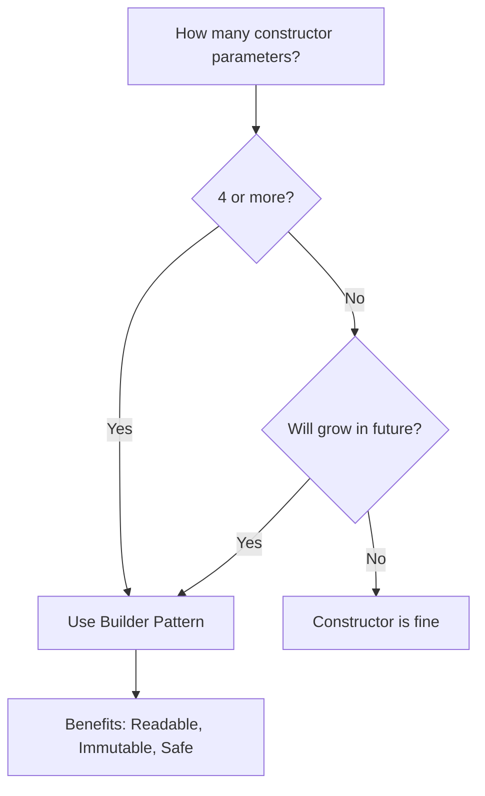

!!! warning "Cost of Builder"
    Creating a Builder object has a small performance cost. For performance-critical code with few parameters, constructors may be better.

---

### Item 3: Enforce the Singleton Property with a Private Constructor or an Enum Type

#### Key Takeaways

A **singleton** is a class instantiated exactly once. There are three approaches, with **enum being preferred**.

#### Approach 1: Public Static Final Field

```java
public class Elvis {
    public static final Elvis INSTANCE = new Elvis();
    
    private Elvis() { }  // Private constructor
    
    public void leaveTheBuilding() { ... }
}

// Usage
Elvis.INSTANCE.leaveTheBuilding();
```

**Problem**: Reflection attacks can break this!
```java
Constructor<Elvis> c = Elvis.class.getDeclaredConstructor();
c.setAccessible(true);
Elvis imposter = c.newInstance();  // Second instance created!
```

#### Approach 2: Static Factory Method

```java
public class Elvis {
    private static final Elvis INSTANCE = new Elvis();
    
    private Elvis() { }
    
    public static Elvis getInstance() { return INSTANCE; }
    
    public void leaveTheBuilding() { ... }
}
```

**Advantage**: Flexibility to change singleton behavior later without API changes.

**Problem**: Still vulnerable to reflection and serialization issues.

#### Approach 3: Enum Type (RECOMMENDED)

```java
public enum Elvis {
    INSTANCE;
    
    public void leaveTheBuilding() { ... }
}

// Usage
Elvis.INSTANCE.leaveTheBuilding();
```

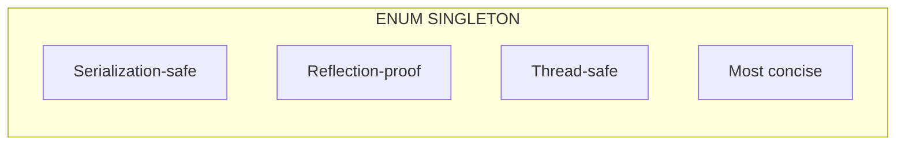

!!! success "Why Enum is Best"
    - **Serialization**: Automatically handled correctly
    - **Reflection**: Cannot create additional instances
    - **Thread safety**: Guaranteed by JVM
    - **Simplicity**: Single line declaration

---

### Item 7: Eliminate Obsolete Object References

#### Key Takeaways

Memory leaks in Java happen when you **unintentionally hold references** to objects you no longer need. The garbage collector cannot reclaim objects that are still reachable.

#### The Classic Example: Stack Implementation

```java
// ❌ MEMORY LEAK: Stack holds obsolete references
public class Stack {
    private Object[] elements;
    private int size = 0;
    
    public Object pop() {
        if (size == 0)
            throw new EmptyStackException();
        return elements[--size];  // BUG: Old reference still exists!
    }
}
```

Even after popping, `elements[size]` still points to the old object!

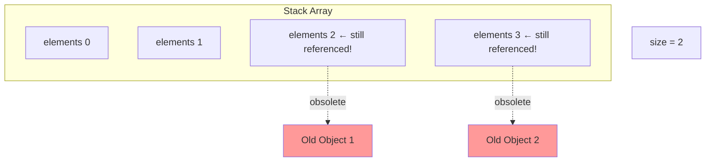

#### The Fix: Null Out Obsolete References

```java
// ✅ CORRECT: Null out obsolete references
public Object pop() {
    if (size == 0)
        throw new EmptyStackException();
    Object result = elements[--size];
    elements[size] = null;  // Eliminate obsolete reference!
    return result;
}
```

#### Common Sources of Memory Leaks

| Source | Description | Solution |
|--------|-------------|----------|
| **Self-managed memory** | Classes with arrays/collections | Null out unused entries |
| **Caches** | Objects cached but never removed | Use `WeakHashMap` or bounded cache |
| **Listeners/Callbacks** | Registered but never unregistered | Use weak references or explicit deregister |

!!! warning "Don't Overdo It"
    Nulling out references should be the **exception, not the norm**. The best way to eliminate obsolete references is to let variables fall out of scope naturally.

---

## :material-book-open-variant: Chapter 3: Methods Common to All Objects

### Item 10: Obey the General Contract When Overriding equals

#### The Contract

When you override `equals()`, you must follow these rules:

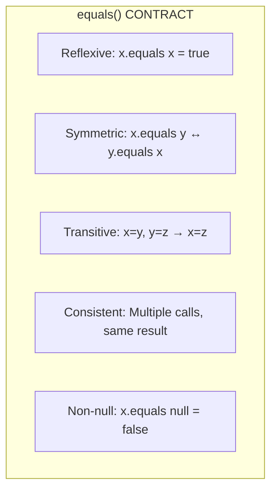

| Property | Meaning | Example Violation |
|----------|---------|-------------------|
| **Reflexive** | `x.equals(x)` always true | Object doesn't equal itself |
| **Symmetric** | If `x.equals(y)`, then `y.equals(x)` | Case-insensitive string vs String |
| **Transitive** | If `x=y` and `y=z`, then `x=z` | Point extended with Color |
| **Consistent** | Multiple calls return same result | Depends on mutable external data |
| **Non-null** | `x.equals(null)` always false | NullPointerException |

#### Classic Symmetry Violation

```java
// ❌ BROKEN: Violates symmetry
public final class CaseInsensitiveString {
    private final String s;
    
    @Override
    public boolean equals(Object o) {
        if (o instanceof CaseInsensitiveString)
            return s.equalsIgnoreCase(((CaseInsensitiveString) o).s);
        if (o instanceof String)  // Interoperates with String!
            return s.equalsIgnoreCase((String) o);
        return false;
    }
}

CaseInsensitiveString cis = new CaseInsensitiveString("Polish");
String s = "polish";

cis.equals(s);  // true
s.equals(cis);  // false ← SYMMETRY BROKEN!
```

#### Correct equals() Implementation

```java
// ✅ CORRECT: Follows all contract rules
@Override
public boolean equals(Object o) {
    // 1. Check for identity (reflexive + optimization)
    if (o == this)
        return true;
    
    // 2. Check for correct type (also handles null)
    if (!(o instanceof PhoneNumber))
        return false;
    
    // 3. Cast and compare significant fields
    PhoneNumber pn = (PhoneNumber) o;
    return pn.lineNum == lineNum &&
           pn.prefix  == prefix &&
           pn.areaCode == areaCode;
}
```

#### Recipe for High-Quality equals()

1. Use `==` to check if argument is reference to `this`
2. Use `instanceof` to check for correct type
3. Cast to correct type
4. Compare all significant fields
5. Ask yourself: Is it symmetric? Transitive? Consistent?

---

### Item 11: Always Override hashCode When You Override equals

#### Key Takeaways

If you override `equals()`, you **MUST** override `hashCode()`. Violating this breaks hash-based collections.

#### The hashCode Contract

```java
// If x.equals(y), then x.hashCode() == y.hashCode() MUST be true!
```

| Rule | Description |
|------|-------------|
| **Consistent** | Same object, same hashCode (unless equals fields change) |
| **Equal objects** | Equal objects MUST have equal hash codes |
| **Unequal objects** | Unequal objects SHOULD have different hash codes (for performance) |

#### What Happens If You Violate This

```java
// ❌ BROKEN: equals() overridden, hashCode() NOT overridden
Map<PhoneNumber, String> map = new HashMap<>();
map.put(new PhoneNumber(707, 867, 5309), "Jenny");

// Different instance, but equals() returns true!
map.get(new PhoneNumber(707, 867, 5309));  // Returns null! WHY?
```

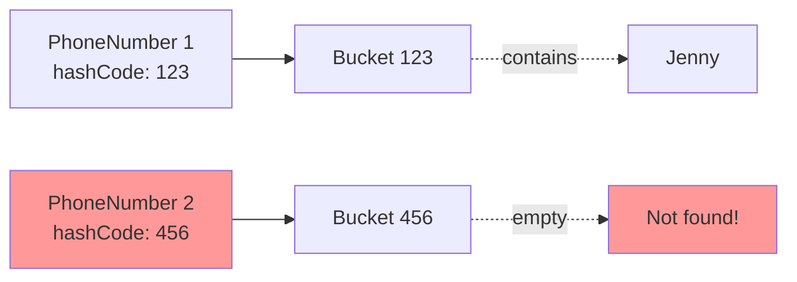

Even though the phone numbers are `equals()`, they go to **different buckets** because of different hash codes!

#### Correct hashCode Implementation

```java
// ✅ CORRECT: Consistent with equals()
@Override
public int hashCode() {
    int result = Short.hashCode(areaCode);
    result = 31 * result + Short.hashCode(prefix);
    result = 31 * result + Short.hashCode(lineNum);
    return result;
}

// Or simpler (slightly slower):
@Override
public int hashCode() {
    return Objects.hash(areaCode, prefix, lineNum);
}
```

!!! info "Why 31?"
    31 is an odd prime. If it were even and multiplication overflowed, information would be lost. Using a prime results in better hash distribution.

---

### Item 12: Always Override toString

#### Key Takeaways

Override `toString()` to provide a useful, human-readable representation of your object.

#### Default toString is Useless

```java
// Default: ClassName@hexHashCode
System.out.println(new PhoneNumber(707, 867, 5309));
// Output: PhoneNumber@1a2b3c4d  ← USELESS!
```

#### Good toString is Invaluable

```java
@Override
public String toString() {
    return String.format("(%03d) %03d-%04d", areaCode, prefix, lineNum);
}

// Now:
System.out.println(new PhoneNumber(707, 867, 5309));
// Output: (707) 867-5309  ← USEFUL!
```

#### Benefits

| Benefit | Description |
|---------|-------------|
| **Debugging** | Meaningful output in logs and debugger |
| **Logging** | Informative diagnostic messages |
| **Collections** | Maps and lists print their contents clearly |
| **Error messages** | "Failed to connect: (707) 867-5309" |

#### Best Practices

1. **Include all interesting information** (key fields that identify the object)
2. **Document the format** if it's intended for parsing
3. **Provide programmatic access** to all fields in toString (getters)
4. **Use StringBuilder** for efficiency when building complex strings

---

## :material-book-open-variant: Chapter 4: Classes and Interfaces

### Item 15: Minimize the Accessibility of Classes and Members

#### Key Takeaways

**Information hiding** (encapsulation) is fundamental to good software design. Make every class and member **as inaccessible as possible**.

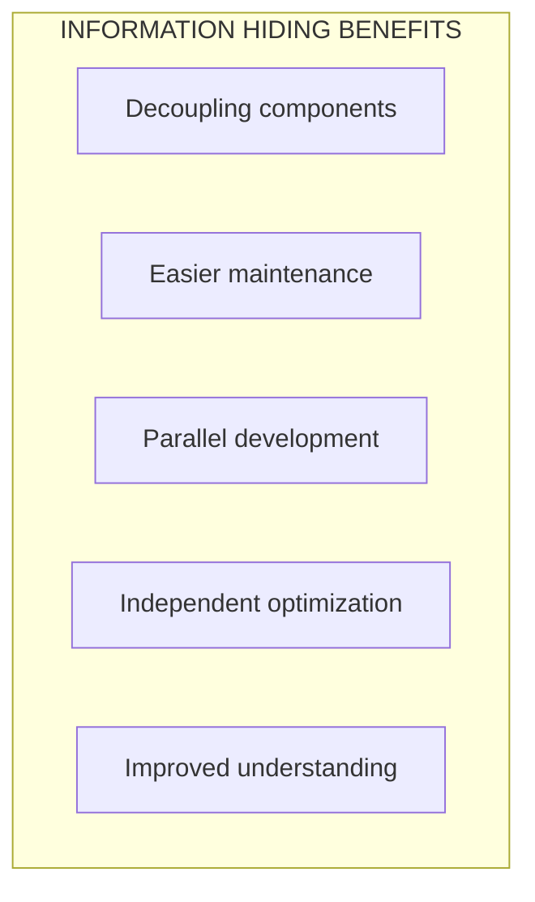

#### Access Levels for Members

| Modifier | Same Class | Same Package | Subclass | World |
|:--------:|:----------:|:------------:|:--------:|:-----:|
| `private` | ✅ | ❌ | ❌ | ❌ |
| (package-private) | ✅ | ✅ | ❌ | ❌ |
| `protected` | ✅ | ✅ | ✅ | ❌ |
| `public` | ✅ | ✅ | ✅ | ✅ |

#### Rules to Follow

1. **Start with private** - Only relax if necessary
2. **Package-private for testing** - OK to expose for testing within package
3. **Think twice about protected** - Part of your public API!
4. **Never public for mutable fields**
5. **Beware of public static final arrays**

```java
// ❌ BROKEN: Array contents can be modified!
public static final Thing[] VALUES = { ... };

// ✅ FIX 1: Unmodifiable list
private static final Thing[] PRIVATE_VALUES = { ... };
public static final List<Thing> VALUES = 
    Collections.unmodifiableList(Arrays.asList(PRIVATE_VALUES));

// ✅ FIX 2: Clone the array
public static final Thing[] values() {
    return PRIVATE_VALUES.clone();
}
```

---

### Item 17: Minimize Mutability

#### Key Takeaways

**Immutable classes** are simpler, safer, and more flexible than mutable classes. Make classes immutable unless there's a good reason not to.

#### Rules for Immutable Classes

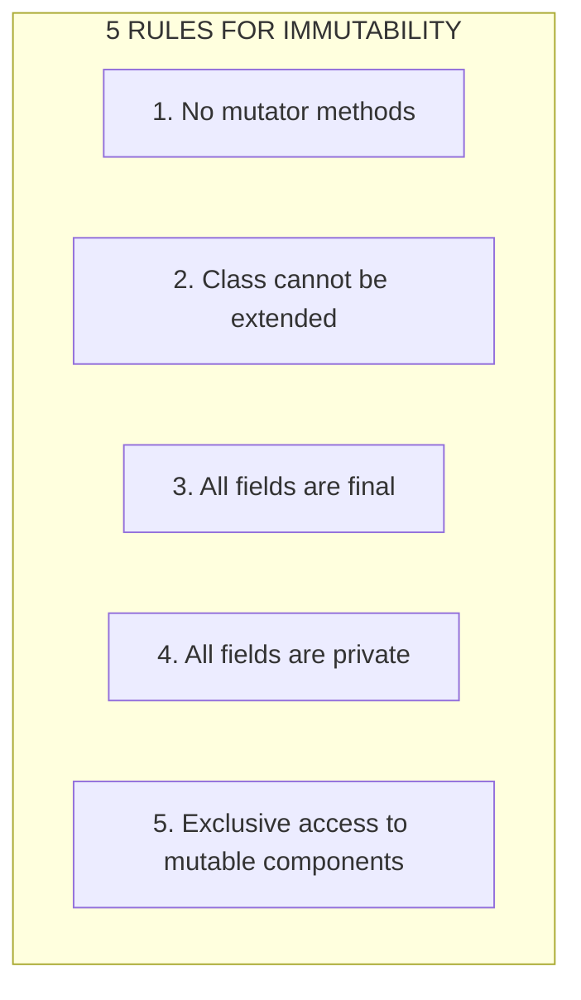

#### Example: Immutable Complex Number

```java
public final class Complex {
    private final double re;
    private final double im;

    public Complex(double re, double im) {
        this.re = re;
        this.im = im;
    }

    public double realPart()      { return re; }
    public double imaginaryPart() { return im; }

    // Return new instance instead of modifying!
    public Complex plus(Complex c) {
        return new Complex(re + c.re, im + c.im);
    }

    public Complex minus(Complex c) {
        return new Complex(re - c.re, im - c.im);
    }
    
    // ...etc
}
```

!!! note "Functional Approach"
    Methods like `plus()` and `minus()` return **new instances** rather than modifying `this`. This is called a **functional** approach.

#### Benefits of Immutability

| Benefit | Why? |
|---------|------|
| **Simple** | Object has exactly one state ever |
| **Thread-safe** | No synchronization needed |
| **Freely shareable** | Can cache and reuse instances |
| **Share internals** | No defensive copying needed |
| **Great map keys** | Hash code never changes |
| **Failure atomicity** | Never in inconsistent state |

#### Disadvantage: Performance

```java
// Creating many intermediate objects can be costly
BigInteger moby = new BigInteger("111...1");  // 1 million 1s
moby = moby.flipBit(0);  // Creates entire new million-bit BigInteger!
```

**Solution**: Provide mutable companion class (e.g., `StringBuilder` for `String`).

---

### Item 18: Favor Composition Over Inheritance

#### Key Takeaways

**Implementation inheritance** (extending a class) is powerful but dangerous. Prefer **composition** (having a reference to another class).

#### The Problem with Inheritance

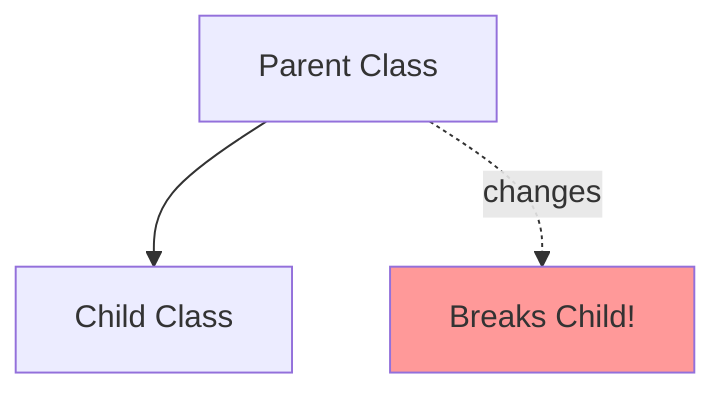

**The Fragile Base Class Problem**: Changes to the parent class can break subclasses, even if the subclass code hasn't changed.

#### Classic Example: InstrumentedHashSet

```java
// ❌ BROKEN: Inheritance gone wrong
public class InstrumentedHashSet<E> extends HashSet<E> {
    private int addCount = 0;

    @Override
    public boolean add(E e) {
        addCount++;
        return super.add(e);
    }

    @Override
    public boolean addAll(Collection<? extends E> c) {
        addCount += c.size();
        return super.addAll(c);  // PROBLEM!
    }

    public int getAddCount() { return addCount; }
}

InstrumentedHashSet<String> s = new InstrumentedHashSet<>();
s.addAll(List.of("Snap", "Crackle", "Pop"));
s.getAddCount();  // Returns 6, not 3! WHY?
```

**Why?** `HashSet.addAll()` internally calls `add()` for each element. So we count each element twice!

#### The Solution: Composition + Forwarding (Wrapper Class)

```java
// ✅ CORRECT: Composition approach
public class InstrumentedSet<E> extends ForwardingSet<E> {
    private int addCount = 0;

    public InstrumentedSet(Set<E> s) {
        super(s);  // Wrap the set
    }

    @Override
    public boolean add(E e) {
        addCount++;
        return super.add(e);
    }

    @Override
    public boolean addAll(Collection<? extends E> c) {
        addCount += c.size();
        return super.addAll(c);
    }

    public int getAddCount() { return addCount; }
}

// Forwarding class (reusable)
public class ForwardingSet<E> implements Set<E> {
    private final Set<E> s;
    public ForwardingSet(Set<E> s) { this.s = s; }
    
    // Forward all Set methods to wrapped set
    public boolean add(E e)     { return s.add(e); }
    public boolean addAll(Collection<? extends E> c) { return s.addAll(c); }
    // ... all other Set methods
}
```

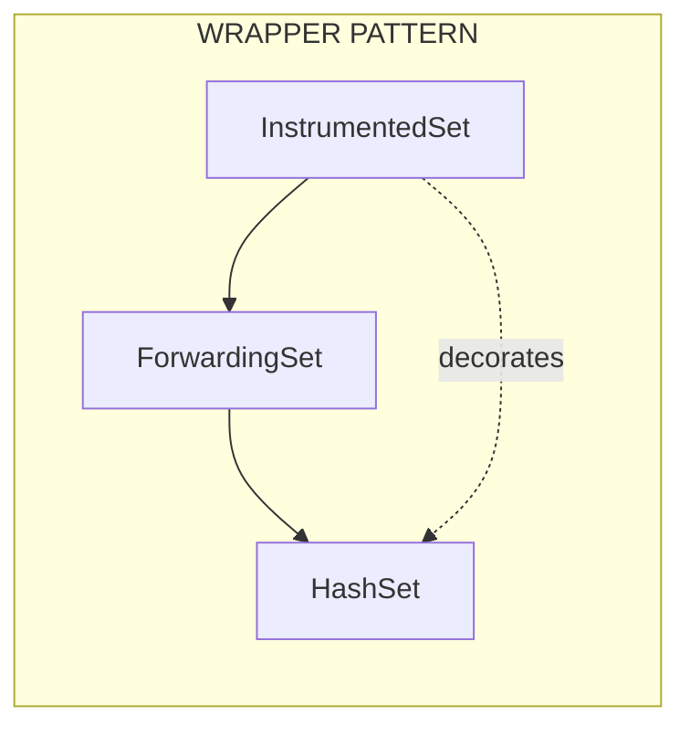

#### When to Use Inheritance vs Composition

| Question | If Yes → |
|----------|----------|
| Is there a true IS-A relationship? | Consider inheritance |
| Will subclass use ALL parent functionality? | Consider inheritance |
| Is parent designed for inheritance? | Consider inheritance |
| **Everything else** | **Use Composition** |

---

### Item 20: Prefer Interfaces to Abstract Classes

#### Key Takeaways

Java's single inheritance of implementation limits abstract classes. Prefer **interfaces** for defining types, but combine with **skeletal implementations** for convenience.

#### Why Interfaces Win

| Feature | Interface | Abstract Class |
|---------|:---------:|:--------------:|
| Multiple inheritance of type | ✅ | ❌ |
| No hierarchy constraints | ✅ | ❌ |
| Mixins (adding functionality) | ✅ | ❌ |
| Default methods (Java 8+) | ✅ | ✅ |
| Can contain state | ❌ | ✅ |

#### The Skeletal Implementation Pattern

Combine benefits of both: **interface + abstract skeletal class**.

```java
// 1. THE INTERFACE - defines the type
public interface Vending {
    void insertCoin();
    void pressButton();
    void refund();
}

// 2. THE SKELETAL IMPLEMENTATION - provides common implementation
public abstract class AbstractVending implements Vending {
    @Override
    public void refund() {
        // Common implementation for all vending machines
        System.out.println("Refunding coins...");
    }
    
    // insertCoin and pressButton remain abstract
}

// 3. CONCRETE CLASSES - extend skeletal for convenience
public class DrinkVending extends AbstractVending {
    @Override
    public void insertCoin() { /* drink-specific */ }
    
    @Override  
    public void pressButton() { /* dispense drink */ }
}
```

#### Naming Convention

Skeletal implementations are named `Abstract<Interface>`:

- `AbstractCollection` for `Collection`
- `AbstractList` for `List`
- `AbstractSet` for `Set`
- `AbstractMap` for `Map`

---

## :material-head-cog: Theoretical Framework

### Mental Model for Object Design

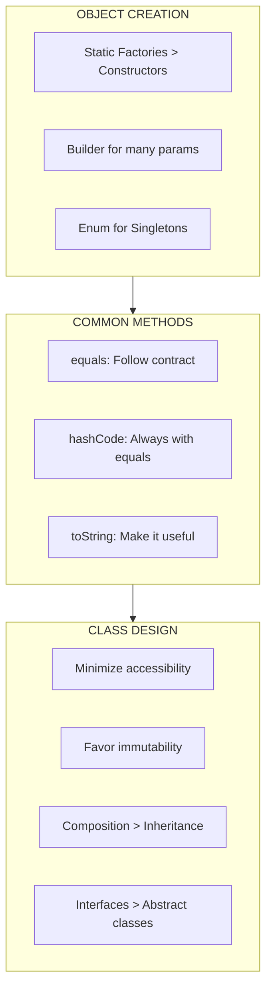

### SOLID Principles Connection

| Principle | Effective Java Connection |
|-----------|---------------------------|
| **S**ingle Responsibility | Item 15: Minimize accessibility keeps classes focused |
| **O**pen/Closed | Item 20: Interfaces allow extension without modification |
| **L**iskov Substitution | Item 10: Proper equals() ensures substitutability |
| **I**nterface Segregation | Item 20: Prefer focused interfaces |
| **D**ependency Inversion | Item 18: Composition allows dependency injection |

---

## :material-thought-bubble: Reflections & Connections

### Connections to Course Material

| Effective Java | Tim's Course |
|----------------|--------------|
| Static Factories (Item 1) | Factory methods in Polymorphism section |
| Builder Pattern (Item 2) | Constructor overloading |
| Singleton (Item 3) | Static members discussion |
| equals/hashCode (10-11) | Object class methods |
| Composition (Item 18) | Section 08: Composition chapter |
| Information Hiding (Item 15) | Encapsulation section |

### New Perspectives Gained

1. **Static factory methods** are underused - many classes should offer them alongside or instead of constructors
2. **Builder pattern** is essential for any class with 4+ parameters
3. **Enum singletons** are the only truly safe way to implement singletons
4. **Immutability** should be the default - only make classes mutable when necessary
5. **Composition** solves most problems inheritance creates

---

## :material-format-list-checks: Summary Points

1. **Object Creation**: Use static factories for flexibility, builders for many parameters, enums for singletons
2. **Common Methods**: Always override hashCode with equals, make toString useful
3. **Accessibility**: Make everything as private as possible
4. **Mutability**: Prefer immutable classes for simplicity and thread-safety
5. **Inheritance**: Favor composition over implementation inheritance
6. **Interfaces**: Prefer interfaces to abstract classes, combine with skeletal implementations

---

## :material-pin: Bookmarks & Page References

| Topic | Item | Key Insight |
|-------|------|-------------|
| Static Factories | Item 1 | Named, cacheable, can return subtypes |
| Builder Pattern | Item 2 | Fluent API for complex object creation |
| Singleton | Item 3 | Enum is the most robust approach |
| Obsolete References | Item 7 | Null out only when managing own memory |
| equals Contract | Item 10 | Reflexive, Symmetric, Transitive, Consistent, Non-null |
| hashCode with equals | Item 11 | Equal objects MUST have equal hash codes |
| toString | Item 12 | Include all interesting information |
| Minimize Accessibility | Item 15 | Start with private, relax only if necessary |
| Minimize Mutability | Item 17 | Five rules for immutable classes |
| Composition over Inheritance | Item 18 | Wrapper class pattern |
| Interfaces over Abstract Classes | Item 20 | Skeletal implementation pattern |

---

*Last Updated: 2026-01-26*
