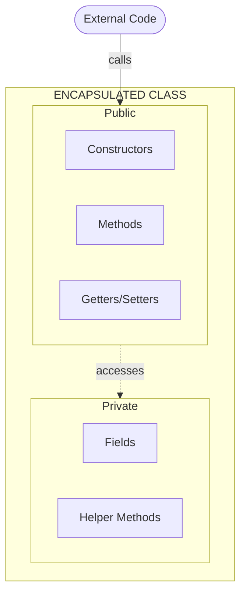
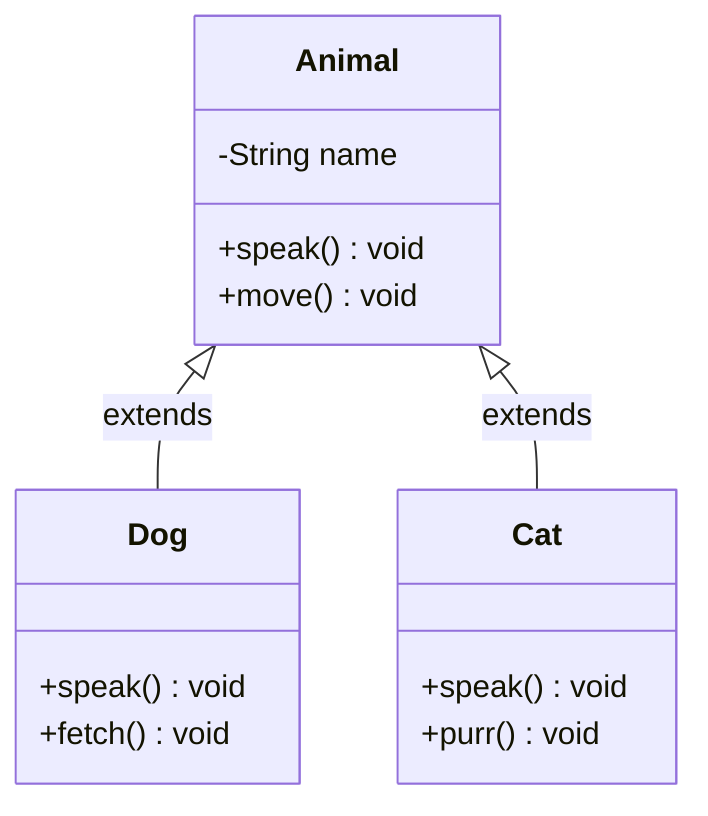
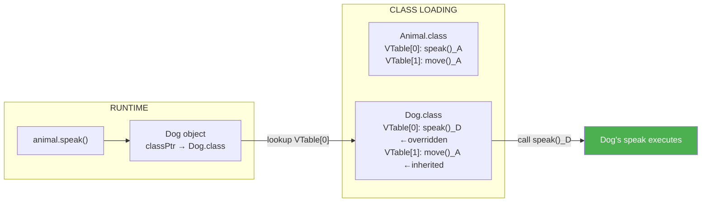
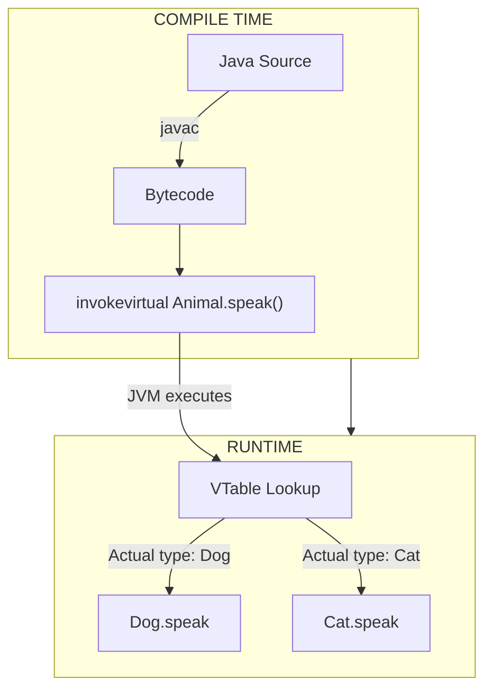
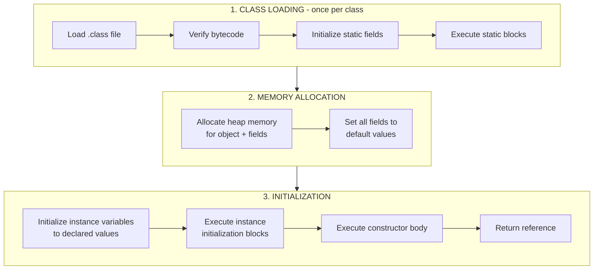
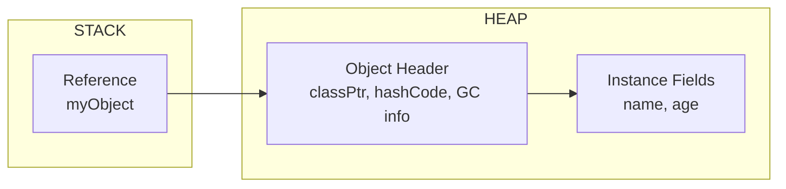
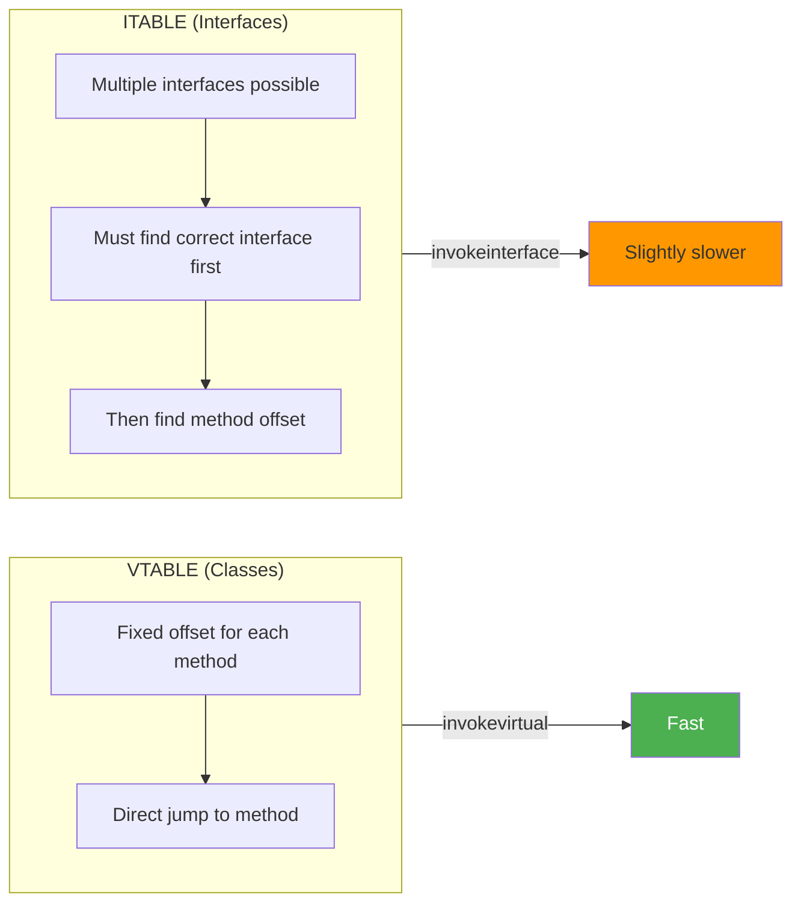
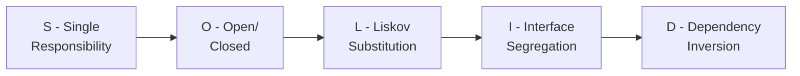
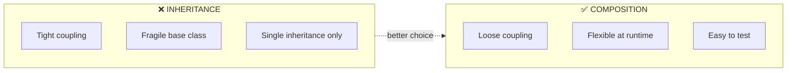

# :material-school: Summary: OOP & Class Design Internals

> **Combined Knowledge from:** Tim Buchalka's Course + Effective Java  
> **Mastery Level:** :material-star::material-star::material-star::material-star::material-star:

---

## :material-star-shooting: Topic Overview

A deep understanding of object-oriented programming principles, their implementation in Java, and best practices for designing robust, maintainable classes. This summary covers both the **what** (concepts) and the **how** (JVM internals).

---

## :material-key: The Four Pillars of OOP

### 1. Encapsulation

**Definition:** Bundling data and methods that operate on that data within a single unit (class), restricting direct access to internal state.



#### Key Principles

- **Data hiding**: Keep fields private, expose through controlled methods
- **Validation**: Validate data in setters and constructors
- **Flexibility**: Internal implementation can change without affecting clients
- **Reduced complexity**: Clients only see what they need

#### Best Practices (from Effective Java)

| Practice                              | Rationale                                  |
| ------------------------------------- | ------------------------------------------ |
| Make fields private by default        | Maximum encapsulation                      |
| Use most restrictive access           | Don't expose more than needed              |
| Provide controlled access via methods | Add validation, logging, etc.              |
| Make classes immutable when possible  | Simpler, thread-safe, no defensive copying |

---

### 2. Inheritance

**Definition:** Mechanism where a new class inherits properties and behaviors from an existing class, establishing an IS-A relationship.



#### Key Principles

- **IS-A relationship**: Dog IS-A Animal
- **Code reuse**: Subclasses inherit parent's implementation
- **Constructor chaining**: `super()` must be first statement
- **Method overriding**: Subclass can replace parent's behavior

#### When to Use Inheritance

✅ **Good use cases:**

- Clear IS-A relationship exists
- Subclass is truly a subtype of superclass
- Behavior needs to be shared across hierarchy
- Parent class is designed for inheritance

❌ **When to Avoid:**

- Just for code reuse → Use composition instead
- Violates Liskov Substitution Principle
- Parent class not designed for inheritance

---

### 3. Polymorphism

**Definition:** Ability of objects to take many forms, allowing same interface to be used for different underlying types.

#### Compile-Time (Static) Polymorphism

```java
// Method Overloading - resolved at COMPILE time
public void print(int x) { }
public void print(String s) { }
public void print(int x, String s) { }
```

#### Runtime (Dynamic) Polymorphism

```java
// Method Overriding - resolved at RUNTIME
Animal animal = new Dog();  // Compile type: Animal, Runtime type: Dog
animal.speak();             // Calls Dog's speak() at runtime!
```

#### How the JVM Resolves It

| Type            | Resolution Time | Mechanism                 |
| --------------- | --------------- | ------------------------- |
| **Overloading** | Compile-time    | Method signature matching |
| **Overriding**  | Runtime         | VTable lookup             |

---

### 4. Abstraction

**Definition:** Hiding complex implementation details and showing only essential features.

#### Abstract Class vs Interface Decision Matrix

| Criteria                   | Abstract Class |        Interface        |
| -------------------------- | :------------: | :---------------------: |
| Shared implementation code |    ✅ Best     | ⚠️ Default methods only |
| Instance fields (state)    |     ✅ Yes     |          ❌ No          |
| Constructor needed         |     ✅ Yes     |          ❌ No          |
| Multiple inheritance       |     ❌ No      |         ✅ Yes          |
| API evolution              |   ⚠️ Limited   |   ✅ Default methods    |
| Define type only           |  ⚠️ Overkill   |         ✅ Best         |

#### The Skeletal Implementation Pattern (Effective Java Item 20)

Combine both: interface for type + abstract class for convenience.

```java
// 1. Interface defines the type
public interface List<E> { ... }

// 2. Skeletal implementation provides common code
public abstract class AbstractList<E> implements List<E> { ... }

// 3. Concrete class extends skeletal for convenience
public class ArrayList<E> extends AbstractList<E> { ... }
```

---

## :material-head-cog: Key Internals to Understand

### 1. Method Dispatch Mechanism (VTable)

The **Virtual Method Table (VTable)** is how the JVM implements runtime polymorphism. It's an array of method pointers stored per-class.



#### How It Works Step-by-Step

1. **Class Loading**: When a class is loaded, the JVM creates its VTable
2. **Object Creation**: Each object has a pointer to its class's VTable
3. **Method Call**: `invokevirtual` instruction is executed
4. **VTable Lookup**: JVM uses fixed offset to find method address
5. **Execution**: Correct method is called based on runtime type

```java
Animal animal = new Dog();  // Runtime type is Dog
animal.speak();             // Steps:
                            // 1. Get object's class (Dog)
                            // 2. Access Dog's VTable
                            // 3. Look up speak() at fixed index
                            // 4. Execute Dog's speak() method
```

#### VTable vs ITable (Interface Tables)

| Mechanism  | Used For          | Lookup                            |
| ---------- | ----------------- | --------------------------------- |
| **VTable** | Class methods     | Fixed offset (fast)               |
| **ITable** | Interface methods | Search required (slightly slower) |

!!! info "JVM Bytecode Instructions"

    - `invokevirtual` - Call class instance method

    - `invokeinterface` - Call interface method
    - `invokespecial` - Call constructor or private method (no override)
    - `invokestatic` - Call static method (no VTable needed)

---

### 2. How Polymorphism Works at Runtime

#### The Complete Picture



#### Code Example with Bytecode

```java
public class Demo {
    public static void main(String[] args) {
        Animal a = new Dog();
        a.speak();  // Which speak() is called?
    }
}
```

**Bytecode generated:**

```
0: new           #2    // class Dog
3: dup
4: invokespecial #3    // Dog.<init>()
7: astore_1
8: aload_1
9: invokevirtual #4    // Animal.speak() - but resolves to Dog at runtime!
12: return
```

The bytecode says `Animal.speak()`, but at runtime the JVM:

1. Looks at the object's actual class (Dog)
2. Finds Dog's VTable
3. Calls Dog's implementation of speak()

---

### 3. Object Creation Process

When you write `new MyClass()`, the JVM performs multiple steps in a specific order.



#### Detailed Execution Order

```java
public class Parent {
    static { System.out.println("1. Parent static block"); }
    { System.out.println("4. Parent instance block"); }

    public Parent() {
        System.out.println("5. Parent constructor");
    }
}

public class Child extends Parent {
    static { System.out.println("2. Child static block"); }
    { System.out.println("6. Child instance block"); }

    public Child() {
        super();  // Implicit if not specified
        System.out.println("7. Child constructor");
    }
}

// new Child() prints:
// 1. Parent static block     ← Static phase (once)
// 2. Child static block      ← Static phase (once)
// 3. (Memory allocated, defaults set)
// 4. Parent instance block   ← Instance phase
// 5. Parent constructor      ← Constructors (bottom-up)
// 6. Child instance block    ← Instance phase
// 7. Child constructor       ← Constructors (bottom-up)
```

#### Memory Layout



#### Best Practices (from Effective Java)

| Pattern            | When to Use                               |
| ------------------ | ----------------------------------------- |
| **Static Factory** | Need descriptive names, caching, subtypes |
| **Builder**        | Many parameters (4+), optional parameters |
| **Constructor**    | Simple, few required parameters           |

---

### 4. Interface vs Abstract Class Performance

#### Bytecode Instructions Comparison

| Instruction       | Used For          | Lookup Method                   |
| ----------------- | ----------------- | ------------------------------- |
| `invokevirtual`   | Class methods     | VTable offset (O(1))            |
| `invokeinterface` | Interface methods | ITable search (slightly slower) |

#### Why Interface Calls Can Be Slower



**Why the difference?**

1. **Vtable** (classes): Method at fixed offset → Single array lookup
2. **Itable** (interfaces): Class may implement many interfaces → Must search

#### JVM Optimizations (Modern JVMs)

| Optimization                 | Description                                         |
| ---------------------------- | --------------------------------------------------- |
| **Monomorphic inline cache** | If call site always resolves to same type, cache it |
| **Devirtualization**         | JIT converts virtual call to direct call            |
| **Inlining**                 | Replace method call with method body                |
| **Type profiling**           | Track actual types at call sites                    |

```java
// If JVM observes that animal is always Dog:
Animal animal = new Dog();
animal.speak();  // JVM can inline Dog.speak() directly!
```

#### The Real-World Verdict

| Factor                     | Advice                                              |
| -------------------------- | --------------------------------------------------- |
| **Performance difference** | ~0-5% in most cases                                 |
| **Modern JVMs**            | Heavily optimized, difference often negligible      |
| **Design**                 | Choose based on design needs, not performance       |
| **Rule of thumb**          | Interface for types, abstract class for shared code |

!!! tip "Don't Micro-Optimize"

    - The performance difference between interfaces and abstract classes is almost never the bottleneck. Focus on correct design first.

---

## :material-lightning-bolt: Class Design Principles

### SOLID Principles Applied



| Principle                  | Description                                 | Effective Java Item             |
| -------------------------- | ------------------------------------------- | ------------------------------- |
| **S** ingle Responsibility | One reason to change                        | Item 15: Minimize accessibility |
| **O** pen/Closed           | Open for extension, closed for modification | Item 20: Prefer interfaces      |
| **L** iskov Substitution   | Subtypes replaceable                        | Item 10: equals contract        |
| **I** nterface Segregation | Small, specific interfaces                  | Item 20: Prefer interfaces      |
| **D** ependency Inversion  | Depend on abstractions                      | Item 18: Composition            |

### Composition Over Inheritance



**From Effective Java Item 18:**

```java
// ❌ BAD: Inheritance - tightly coupled, fragile
public class InstrumentedHashSet<E> extends HashSet<E> { ... }

// ✅ GOOD: Composition - flexible, robust
public class InstrumentedSet<E> implements Set<E> {
    private final Set<E> s;  // Composition: HAS-A
    public InstrumentedSet(Set<E> s) { this.s = s; }
    // Delegate to wrapped set
}
```

---

## :material-alert: Common Pitfalls

### 1. Breaking Encapsulation

```java
// ❌ BAD: Exposing internal state
public List<String> getItems() { return items; }  // Client can modify!

// ✅ GOOD: Defensive copy
public List<String> getItems() { return new ArrayList<>(items); }
```

### 2. Inheritance Abuse

```java
// ❌ BAD: Using inheritance for code reuse
class Stack extends ArrayList { }  // Stack IS-NOT-A ArrayList!

// ✅ GOOD: Composition
class Stack {
    private ArrayList items;  // Stack HAS-A ArrayList
}
```

### 3. equals/hashCode Contract Violations

```java
// ❌ BROKEN: Override equals without hashCode
@Override public boolean equals(Object o) { ... }
// HashMap/HashSet will break!

// ✅ CORRECT: Always override both
@Override public boolean equals(Object o) { ... }
@Override public int hashCode() { ... }
```

### 4. Not Understanding Runtime Types

```java
// What does this print?
Animal a = new Dog();
System.out.println(a.getClass().getName());  // Dog, not Animal!
```

---

## :material-lightbulb-on: Best Practices Checklist

From Effective Java and the course:

- [x] Make classes immutable when possible (Item 17)
- [x] Favor composition over inheritance (Item 18)
- [x] Program to interfaces, not implementations (Item 20)
- [x] Override equals and hashCode together (Items 10-11)
- [x] Consider static factory methods (Item 1)
- [x] Minimize accessibility of everything (Item 15)
- [x] Design for inheritance or prohibit it (make class final)
- [x] Prefer interfaces to abstract classes (Item 20)
- [x] Use the Builder pattern for many parameters (Item 2)
- [x] Eliminate obsolete object references (Item 7)

---

## :material-bookmark: Learning Resources

### VTable & Method Dispatch

- [Aleksey Shipilëv's blog](https://shipilev.net/blog/2015/black-magic-method-dispatch/)
- [Dev.to - Virtual Tables in Java](https://dev.to/kamilbrzezinski/virtual-tables-in-java-3g1m)

### Object Creation Process

- [JVM under the hood - Medium](https://medium.com/@pravvich/jvm-under-the-hood-d3ff1ed9ea34)
- [A Deep Dive into JVM Start-up - inside Java](https://inside.java/2025/01/28/jvm-start-up/)

### Interface vs Abstract Class

- [StackOverflow - Performance Discussion](https://stackoverflow.com/questions/870218/invokeinterface-vs-invokevirtual-performance)
- [Oracle - JVM Specification](https://docs.oracle.com/javase/specs/jvms/se17/html/jvms-6.html)

### Effective Java

- [Effective Java 3rd Edition](https://www.oreilly.com/library/view/effective-java-3rd/9780134686097/)
- [GitHub - Effective Java Summary](https://github.com/HugoMatilla/Effective-JAVA-Summary)

---

## :material-link-variant: Related Topics

- [Syntax, Variables & Control Flow](../topic-1-java-basic-Interactive-applications/summary.md)
- [Arrays, Lists & Autoboxing](../topic-3-arrays-lists-generics/summary.md)
- [Collections Framework](../topic-5-collections-framework/summary.md)

---

## :material-bookshelf: References

- **Course:** Tim Buchalka - Java Programming Masterclass (Sections 7-8)
- **Book:** Effective Java - Joshua Bloch (Chapters 2-4)
- **Book:** Head First Design Patterns (OOP principles applied)
- **Spec:** [JVM Specification - Method Invocation](https://docs.oracle.com/javase/specs/jvms/se17/html/jvms-6.html#jvms-6.5.invokevirtual)

---

_Completed: 2026-01-26 | Confidence: 9/10_
