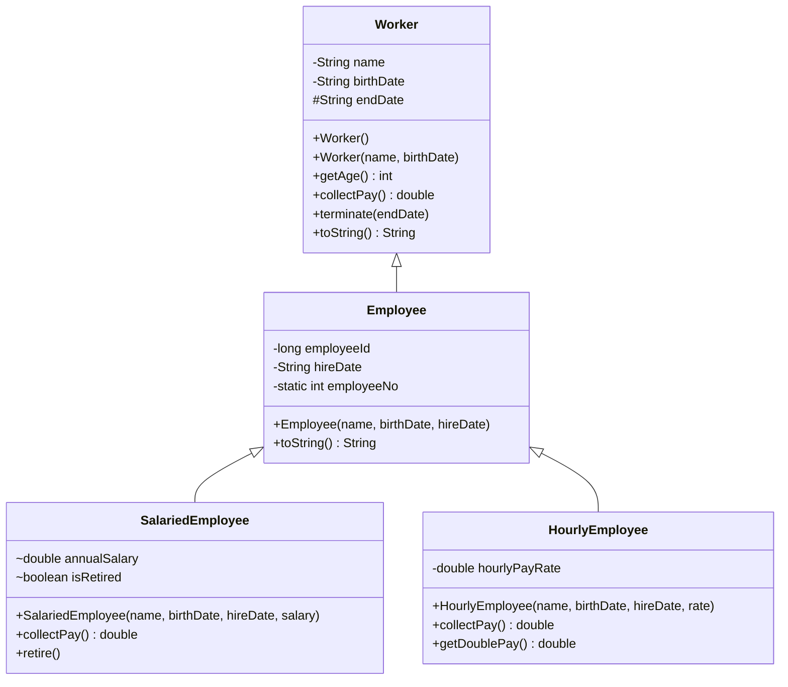
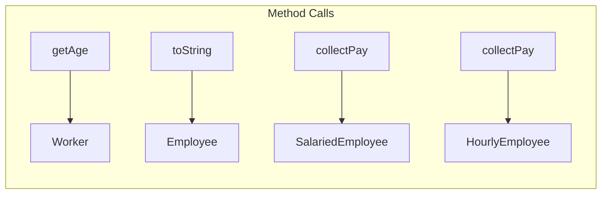
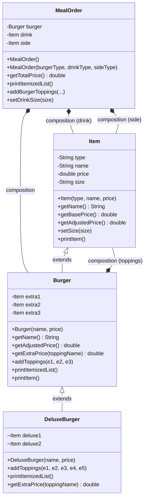
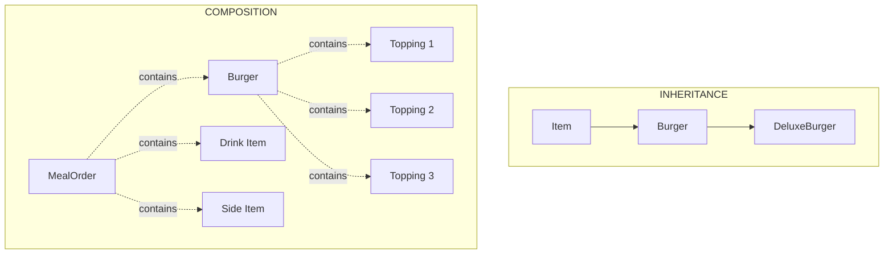

# :material-sword-cross: OOP Challenges

> **Course:** Java Programming Masterclass - Tim Buchalka (Udemy)  
> **Sections:** 07 & 08 - OOP & Class Design  
> **Status:** :material-check-circle: Complete

---

## :material-folder-open: Challenge Overview

| Challenge | Focus Area | Difficulty |
|-----------|------------|:----------:|
| [Inheritance Challenge](#challenge-1-inheritance-challenge-worker-hierarchy) | Classes, Inheritance, Overriding | :material-star::material-star::material-star-outline::material-star-outline::material-star-outline: |
| [OOP Master Challenge](#challenge-2-oop-master-challenge-burger-restaurant) | Composition, Encapsulation, Polymorphism, Inheritance | :material-star::material-star::material-star::material-star::material-star: |

---

# Challenge 1: Inheritance Challenge - Worker Hierarchy

## :material-target: Challenge Overview

Build a worker management system demonstrating **inheritance** and **method overriding**. Create a class hierarchy that models different types of workers at a company.

### Requirements Summary

- Create a base class `Worker` with common attributes
- Create an `Employee` subclass extending `Worker`
- Create specialized employee types: `SalariedEmployee` and `HourlyEmployee`
- Implement pay calculation differently for each employee type
- Use constructor chaining across the hierarchy
- Override methods appropriately

---

## :material-sitemap: Class Hierarchy Design



---

## :material-code-braces: Solution Implementation

### Worker.java - The Base Class

```java
public class Worker {
    private String name;
    private String birthDate;
    protected String endDate;  // Protected for subclass access

    // Default constructor - gives subclasses flexibility
    public Worker() { }

    public Worker(String name, String birthDate) {
        this.name = name;
        this.birthDate = birthDate;
    }

    public int getAge() {
        int currentYear = 2026;
        int birthYear = Integer.parseInt(birthDate.substring(6));
        return (currentYear - birthYear);
    }

    // To be overridden by subclasses
    public double collectPay() {
        return 0.0;
    }

    public void terminate(String endDate) {
        this.endDate = endDate;
    }

    @Override
    public String toString() {
        return "Worker{" +
                "name='" + name + '\'' +
                ", birthDate='" + birthDate + '\'' +
                ", endDate='" + endDate + '\'' + '}';
    }
}
```

!!! info "Key Concepts"
    - **Default constructor**: Allows subclasses flexibility in their own constructors
    - **Protected field**: `endDate` can be accessed/modified by subclasses
    - **`collectPay()` returns 0**: Designed to be overridden by subclasses

### Employee.java - First Level Subclass

```java
public class Employee extends Worker {
    private long employeeId;
    private String hireDate;
    
    // Static field for auto-generating employee IDs
    private static int employeeNo = 1;

    public Employee(String name, String birthDate, String hireDate) {
        super(name, birthDate);  // Call Worker constructor
        this.employeeId = Employee.employeeNo++;  // Auto-increment
        this.hireDate = hireDate;
    }

    @Override
    public String toString() {
        return "Employee{" +
                "employeeId=" + employeeId +
                ", hireDate='" + hireDate + '\'' +
                "} " + super.toString();  // Include parent's toString
    }
}
```

!!! tip "Static Field for Auto-ID"
    Using `static int employeeNo` shared across all Employee instances generates unique IDs automatically. Each new Employee gets assigned an ID and increments the counter.

### SalariedEmployee.java - Specialized Employee

```java
public class SalariedEmployee extends Employee {
    double annualSalary;
    boolean isRetired;

    public SalariedEmployee(String name, String birthDate, 
                            String hireDate, double annualSalary) {
        super(name, birthDate, hireDate);
        this.annualSalary = annualSalary;
    }

    @Override
    public double collectPay() {
        // Bi-weekly pay (26 pay periods per year)
        double paycheck = annualSalary / 26;
        
        // Pension is 90% of salary if retired
        double adjustedPay = (isRetired) ? 0.9 * paycheck : paycheck;
        
        return (int) adjustedPay;  // Whole dollars only
    }

    public void retire() {
        terminate("12/12/2026");  // Calls Worker's terminate()
        isRetired = true;
    }
}
```

### HourlyEmployee.java - Alternative Specialized Employee

```java
public class HourlyEmployee extends Employee {
    private double hourlyPayRate;

    public HourlyEmployee(String name, String birthDate, 
                          String hireDate, double hourlyPayRate) {
        super(name, birthDate, hireDate);
        this.hourlyPayRate = hourlyPayRate;
    }

    @Override
    public double collectPay() {
        // 40 hours per week standard
        return 40 * hourlyPayRate;
    }

    public double getDoublePay() {
        // Overtime: double the regular pay
        return 2 * collectPay();
    }
}
```

---

## :material-play-circle: Testing the Hierarchy

```java
public class Main {
    public static void main(String[] args) {
        // Basic Employee (uses Worker's collectPay - returns 0)
        Employee tim = new Employee("Tim", "11/11/1985", "01/01/2020");
        System.out.println(tim);
        System.out.println("Age = " + tim.getAge());
        System.out.println("Pay = " + tim.collectPay());

        // Salaried Employee
        SalariedEmployee joe = new SalariedEmployee("Joe", "11/11/1990",
                "03/03/2025", 60000);
        System.out.println(joe);
        System.out.println("Joe's Paycheck = $" + joe.collectPay());

        // Retire Joe and check pension
        joe.retire();
        System.out.println("Joe's Pension check = $" + joe.collectPay());

        // Hourly Employee
        HourlyEmployee mary = new HourlyEmployee("Mary", "05/05/1970",
                "03/03/2021", 15);
        System.out.println(mary);
        System.out.println("Mary's Paycheck = $" + mary.collectPay());
        System.out.println("Mary's Holiday Pay = $" + mary.getDoublePay());
    }
}
```

### Output

```
Employee{employeeId=1, hireDate='01/01/2020'} Worker{name='Tim', birthDate='11/11/1985', endDate='null'}
Age = 41
Pay = 0.0
Employee{employeeId=2, hireDate='03/03/2025'} Worker{name='Joe', birthDate='11/11/1990', endDate='null'}
Joe's Paycheck = $2307
Joe's Pension check = $2076
Employee{employeeId=3, hireDate='03/03/2021'} Worker{name='Mary', birthDate='05/05/1970', endDate='null'}
Mary's Paycheck = $600.0
Mary's Holiday Pay = $1200.0
```

---

## :material-lightbulb: Key Learnings

### Method Resolution in Inheritance



| Method | Joe (`SalariedEmployee`) | Mary (`HourlyEmployee`) |
|--------|-------------------------|------------------------|
| `getAge()` | Worker (not overridden) | Worker (not overridden) |
| `toString()` | Employee (extended from Worker) | Employee (extended from Worker) |
| `collectPay()` | SalariedEmployee (overridden) | HourlyEmployee (overridden) |
| `retire()` | SalariedEmployee only | Not available |
| `getDoublePay()` | Not available | HourlyEmployee only |

---

# Challenge 2: OOP Master Challenge - Burger Restaurant

## :material-target: Challenge Overview

Build a complete **Burger Restaurant Application** using ALL OOP principles:

- **Inheritance** - Item → Burger → DeluxeBurger
- **Composition** - MealOrder contains Burger, Drink, Side
- **Encapsulation** - Hide implementation details from calling code
- **Polymorphism** - Different pricing behavior for different burger types

### Business Requirements

1. **Meal Orders** composed of: 1 burger + 1 drink + 1 side item
2. **Burgers** can have up to 3 extra toppings (additional cost)
3. **Drinks** have sizes (Small, Medium, Large) affecting price
4. **Deluxe Burger** (bonus): 5 toppings, fixed price includes everything

---

## :material-sitemap: System Architecture



---

## :material-code-braces: Solution Implementation

### Item.java - Base Class for All Menu Items

```java
public class Item {
    private String type;
    private String name;
    private double price;
    private String size = "Medium";  // Default size

    public Item(String type, String name, double price) {
        this.type = type.toUpperCase();
        this.name = name.toUpperCase();
        this.price = price;
    }

    public String getName() {
        // Include size for drinks and sides only
        if (type.equals("SIDE") || type.equals("DRINK")) {
            return size + " " + name;
        }
        return name;
    }

    public double getBasePrice() {
        return price;
    }

    public double getAdjustedPrice() {
        // Adjust price based on size
        return switch (size) {
            case "SMALL" -> getBasePrice() - 0.5;
            case "LARGE" -> getBasePrice() + 1;
            default -> getBasePrice();  // Medium = no change
        };
    }

    public void setSize(String size) {
        this.size = size;
    }

    // Static method - can be called from anywhere
    public static void printItem(String name, double price) {
        System.out.printf("%20s:%6.2f%n", name, price);
    }

    // Instance method - uses this item's data
    public void printItem() {
        printItem(getName(), getAdjustedPrice());
    }
}
```

!!! note "Polymorphic Design"
    The `getName()` and `getAdjustedPrice()` methods are designed to be **overridden** by subclasses for different behavior.

### Burger.java - Extends Item with Toppings

```java
public class Burger extends Item {
    private Item extra1;
    private Item extra2;
    private Item extra3;

    public Burger(String name, double price) {
        super("Burger", name, price);  // Type is always "Burger"
    }

    @Override
    public String getName() {
        return super.getName() + " BURGER";
    }

    @Override
    public double getAdjustedPrice() {
        // Base price + all toppings (null-safe)
        return getBasePrice() +
                ((extra1 == null) ? 0 : extra1.getAdjustedPrice()) +
                ((extra2 == null) ? 0 : extra2.getAdjustedPrice()) +
                ((extra3 == null) ? 0 : extra3.getAdjustedPrice());
    }

    // Topping pricing logic
    public double getExtraPrice(String toppingName) {
        return switch (toppingName.toUpperCase()) {
            case "AVOCADO", "CHEESE" -> 1.0;
            case "BACON", "HAM", "SALAMI" -> 1.5;
            default -> 0.0;  // Free toppings (lettuce, mayo, etc.)
        };
    }

    public void addToppings(String extra1, String extra2, String extra3) {
        this.extra1 = new Item("TOPPING", extra1, getExtraPrice(extra1));
        this.extra2 = new Item("TOPPING", extra2, getExtraPrice(extra2));
        this.extra3 = new Item("TOPPING", extra3, getExtraPrice(extra3));
    }

    public void printItemizedList() {
        printItem("BASE BURGER", getBasePrice());
        if (extra1 != null) extra1.printItem();
        if (extra2 != null) extra2.printItem();
        if (extra3 != null) extra3.printItem();
    }

    @Override
    public void printItem() {
        printItemizedList();
        System.out.println("-".repeat(30));
        super.printItem();  // Print total burger price
    }
}
```

### DeluxeBurger.java - Premium Burger with Fixed Price

```java
public class DeluxeBurger extends Burger {
    Item deluxe1;
    Item deluxe2;

    public DeluxeBurger(String name, double price) {
        super(name, price);
    }

    // Overloaded method - 5 toppings for deluxe
    public void addToppings(String extra1, String extra2, String extra3, 
                            String extra4, String extra5) {
        super.addToppings(extra1, extra2, extra3);
        deluxe1 = new Item("TOPPING", extra4, 0);  // Free!
        deluxe2 = new Item("TOPPING", extra5, 0);  // Free!
    }

    @Override
    public void printItemizedList() {
        super.printItemizedList();
        if (deluxe1 != null) deluxe1.printItem();
        if (deluxe2 != null) deluxe2.printItem();
    }

    @Override
    public double getExtraPrice(String toppingName) {
        return 0;  // ALL toppings are FREE on deluxe burger!
    }
}
```

!!! tip "Polymorphism in Action"
    `getExtraPrice()` returns 0 for DeluxeBurger, overriding the parent's pricing logic. This makes all toppings free!

### MealOrder.java - Composition Container

```java
public class MealOrder {
    private Burger burger;
    private Item drink;
    private Item side;

    // Default meal constructor - no arguments
    public MealOrder() {
        this("regular", "coke", "fries");
    }

    // Custom meal constructor
    public MealOrder(String burgerType, String drinkType, String sideType) {
        // Create the right type of burger
        if (burgerType.equalsIgnoreCase("deluxe")) {
            this.burger = new DeluxeBurger(burgerType, 8.5);
        } else {
            this.burger = new Burger(burgerType, 4.0);
        }
        this.drink = new Item("drink", drinkType, 1.00);
        this.side = new Item("side", sideType, 1.50);
    }

    public double getTotalPrice() {
        // Deluxe burger includes everything in one price
        if (burger instanceof DeluxeBurger) {
            return burger.getAdjustedPrice();
        }
        return burger.getAdjustedPrice() + 
               drink.getAdjustedPrice() + 
               side.getAdjustedPrice();
    }

    public void printItemizedList() {
        burger.printItem();
        
        // Deluxe meals show drink/side as free
        if (burger instanceof DeluxeBurger) {
            Item.printItem(drink.getName(), 0);
            Item.printItem(side.getName(), 0);
        } else {
            drink.printItem();
            side.printItem();
        }
        
        System.out.println("-".repeat(30));
        Item.printItem("TOTAL PRICE", getTotalPrice());
    }

    // Delegate to burger - 3 toppings
    public void addBurgerToppings(String extra1, String extra2, String extra3) {
        burger.addToppings(extra1, extra2, extra3);
    }

    // Delegate to burger - 5 toppings (deluxe)
    public void addBurgerToppings(String extra1, String extra2, String extra3,
                                   String extra4, String extra5) {
        if (burger instanceof DeluxeBurger db) {
            db.addToppings(extra1, extra2, extra3, extra4, extra5);
        } else {
            burger.addToppings(extra1, extra2, extra3);
        }
    }

    public void setDrinkSize(String size) {
        drink.setSize(size);
    }
}
```

---

## :material-play-circle: Testing the Application

```java
public class Main {
    public static void main(String[] args) {
        
        // Regular Meal - default constructor
        MealOrder regularOrder = new MealOrder();
        regularOrder.addBurgerToppings("BACON", "CHEESE", "MAYO");
        regularOrder.setDrinkSize("LARGE");
        regularOrder.printItemizedList();

        System.out.println("\n" + "=".repeat(30) + "\n");

        // Deluxe Meal - all included in fixed price
        MealOrder deluxeOrder = new MealOrder("deluxe", "7-up", "chili");
        deluxeOrder.addBurgerToppings("AVOCADO", "BACON", "LETTUCE", 
                                       "CHEESE", "MAYO");
        deluxeOrder.setDrinkSize("SMALL");
        deluxeOrder.printItemizedList();
    }
}
```

### Sample Output

```
          BASE BURGER:  4.00
               BACON:  1.50
              CHEESE:  1.00
                MAYO:  0.00
------------------------------
      REGULAR BURGER:  6.50
         Large COKE:  2.00
       Medium FRIES:  1.50
------------------------------
         TOTAL PRICE: 10.00

==============================

          BASE BURGER:  8.50
             AVOCADO:  0.00
               BACON:  0.00
             LETTUCE:  0.00
              CHEESE:  0.00
                MAYO:  0.00
------------------------------
       DELUXE BURGER:  8.50
         Small 7-UP:  0.00
       Medium CHILI:  0.00
------------------------------
         TOTAL PRICE:  8.50
```

---

## :material-palette: OOP Concepts Applied

### Summary Table

| OOP Concept | Where Applied | Example |
|-------------|---------------|---------|
| **Inheritance** | Item → Burger → DeluxeBurger | `class Burger extends Item` |
| **Composition** | MealOrder contains parts | `private Burger burger; private Item drink;` |
| **Encapsulation** | Hidden creation details | MealOrder constructor creates parts internally |
| **Polymorphism** | Different pricing behavior | `getExtraPrice()` returns 0 for DeluxeBurger |
| **Method Overriding** | Customized behavior | `Burger.getAdjustedPrice()` adds toppings |
| **Method Overloading** | Multiple versions | `addToppings(3 params)` vs `addToppings(5 params)` |
| **Pattern Matching** | Type checking + casting | `if (burger instanceof DeluxeBurger db)` |

### Relationship Diagram



---

## :material-lightbulb: Key Takeaways

### What Makes This Challenge Complete

1. **Real-world modeling**: Restaurant ordering system with realistic requirements
2. **Multiple OOP patterns**: Not just inheritance - composition, encapsulation, polymorphism
3. **Extensibility**: Easy to add new burger types, toppings, or menu items
4. **Encapsulation**: Calling code only interacts with `MealOrder` - doesn't need to know about `Item` or `Burger` internals

### Design Decisions Explained

- **Why `Item` as base class?** Everything on the menu has name, type, price
- **Why composition for `MealOrder`?** A meal HAS-A burger, drink, side (not IS-A)
- **Why override `getExtraPrice()`?** Different pricing rules for deluxe burgers
- **Why `instanceof` check?** Deluxe meals have special total price calculation

---

## :material-navigation: Related Notes

| Part | Topic | Link |
|:----:|-------|------|
| 1 | Classes, Objects & Encapsulation | [Part 1](topic-note.md) |
| 2 | Inheritance & Method Overriding | [Part 2](topic-note-part2.md) |
| 3 | Strings & StringBuilder | [Part 3](topic-note-part3.md) |
| 4 | Composition | [Part 4](topic-note-part4.md) |
| 5 | Encapsulation (Advanced) | [Part 5](topic-note-part5.md) |
| 6 | Polymorphism | [Part 6](topic-note-part6.md) |

---

*Last Updated: 2026-01-26*
