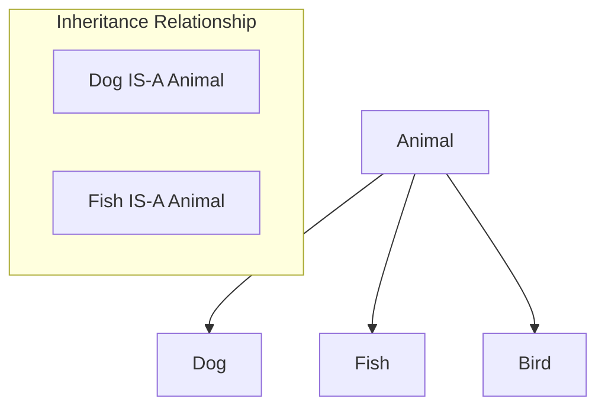
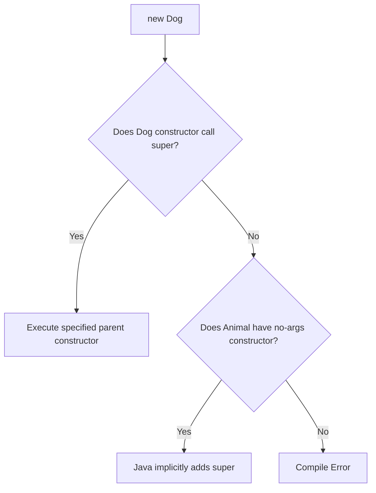
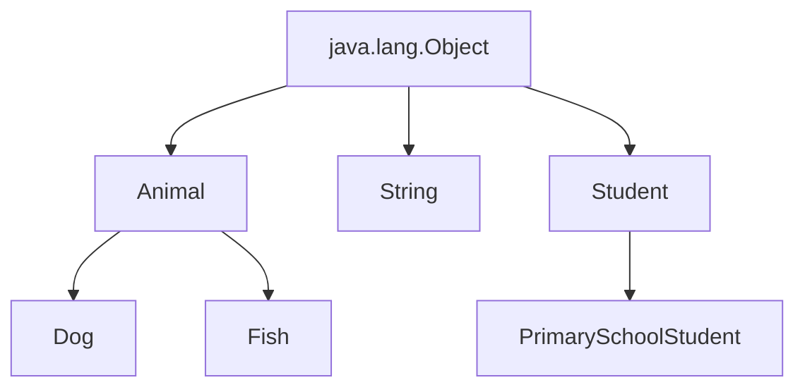
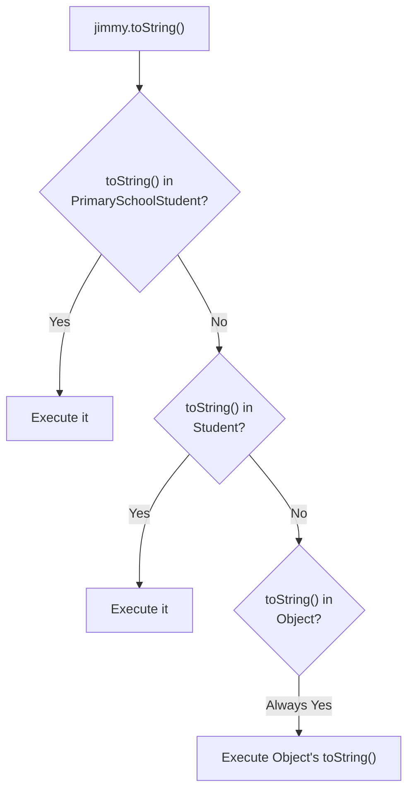

# :material-pencil: Topic Note Part 2: Inheritance

> **Course:** Java Programming Masterclass - Tim Buchalka (Udemy)  
> **Section:** 07. Mastering Java OOP Classes & Inheritance  
> **Status:** :material-check-circle: Complete

---

## :material-target: Learning Objectives

- [x] Understand the concept of inheritance and its purpose
- [x] Use the `extends` keyword to create subclasses
- [x] Master the `super` keyword for accessing parent class members
- [x] Understand and implement method overriding
- [x] Know the difference between `this` and `super` keywords
- [x] Understand `java.lang.Object` as the root of all classes
- [x] Distinguish between method overloading and method overriding

---

## :material-head-cog: What is Inheritance?

### Definition

**Inheritance** is a mechanism where a new class (child/subclass) acquires the properties and behaviors of an existing class (parent/superclass). It enables:

- **Code reuse** - Write once, use in multiple subclasses
- **Hierarchical organization** - Model "is-a" relationships
- **Polymorphism** - Treat subclasses as their parent type



### The `extends` Keyword

Use `extends` to declare that a class inherits from another:

```java
public class Animal {
    protected String type;
    private String size;
    private double weight;
    
    public void move(String speed) {
        System.out.println(type + " moves " + speed);
    }
    
    public void makeNoise() {
        System.out.println(type + " makes noise");
    }
}

public class Dog extends Animal {
    // Dog inherits all non-private members from Animal
    private String earShape;
    private String tailShape;
    
    // Dog-specific methods
    private void bark() {
        System.out.println("Woof!");
    }
}
```

!!! info "Single Inheritance"
    Java only supports **single inheritance** for classes. A class can extend only ONE other class:
    ```java
    public class Dog extends Animal { }       // ✅ Valid
    public class Dog extends Animal, Pet { }  // ❌ Invalid - can't extend multiple classes
    ```

---

## :material-family-tree: Class Hierarchy

### Terminology

| Term | Definition | Example |
|------|------------|---------|
| **Superclass** (Parent, Base) | The class being extended | `Animal` |
| **Subclass** (Child, Derived) | The class that extends | `Dog` |
| **Inheritance tree** | Chain of parent-child relationships | Object → Animal → Dog |

### What Gets Inherited?

| Member Type | Inherited? | Notes |
|-------------|:----------:|-------|
| `public` members | ✅ | Fully accessible |
| `protected` members | ✅ | Accessible in subclass and same package |
| Package-private (no modifier) | ✅ | Only if same package |
| `private` members | ❌ | Not directly accessible |
| Constructors | ❌ | Not inherited, but can be called via `super()` |

!!! tip "The `protected` Access Modifier"
    Use `protected` when you want subclasses to have direct access to a field or method:
    ```java
    public class Animal {
        protected String type;  // Subclasses can access directly
        private double weight;  // Only accessible within Animal
    }
    
    public class Dog extends Animal {
        public void describe() {
            System.out.println(type);   // ✅ Works - protected
            System.out.println(weight); // ❌ Error - private
        }
    }
    ```

---

## :material-cog-sync: The `super` Keyword

### Calling the Parent Constructor

Every subclass constructor must call a parent constructor. Use `super()` to do this explicitly:

```java
public class Dog extends Animal {
    
    public Dog() {
        super("Mutt", "Big", 50);  // Calls Animal(String, String, double)
    }
    
    public Dog(String type, double weight) {
        super(type, 
              weight < 15 ? "small" : (weight < 35 ? "medium" : "large"),
              weight);
    }
}
```

### Critical Rules for `super()`

| Rule | Explanation |
|------|-------------|
| Must be **first statement** | No code can come before `super()` |
| Only in constructors | Can't use `super()` in regular methods |
| Implicitly added | If you don't call `super()`, Java adds `super()` (no-args) |
| Parent needs no-args constructor | If parent doesn't have one and you don't call `super(args)`, compile error |



!!! warning "Common Error"
    If your parent class only has parameterized constructors, you MUST call `super(args)` in every child constructor:
    ```java
    public class Animal {
        public Animal(String type) { }  // No no-args constructor
    }
    
    public class Dog extends Animal {
        public Dog() {
            // ❌ Error: No default constructor in Animal
        }
        
        public Dog(String type) {
            super(type);  // ✅ Must explicitly call parent constructor
        }
    }
    ```

### Accessing Parent Members with `super`

Use `super.` (with dot notation) to access parent class members:

```java
public class Dog extends Animal {
    
    @Override
    public String toString() {
        // Call parent's toString() and add our fields
        return "Dog{earShape='" + earShape + "'} " + super.toString();
    }
    
    @Override
    public void move(String speed) {
        super.move(speed);  // Execute parent's move method first
        // Then add dog-specific behavior
        if (speed.equals("slow")) {
            walk();
            wagTail();
        } else {
            run();
            bark();
        }
    }
}
```

---

## :material-compare: The `this` vs `super` Keywords

### Comparison Table

| Aspect | `this` | `super` |
|--------|--------|---------|
| Refers to | Current instance | Parent class |
| Access members | Current class members | Parent class members |
| In constructor | Calls another constructor in same class | Calls parent constructor |
| Must be first | Yes (when calling constructor) | Yes (when calling constructor) |
| Can coexist | Not with `super()` in same constructor | Not with `this()` in same constructor |

### `this()` vs `super()` Calls

```java
public class Rectangle extends Shape {
    
    // Constructor 1: Uses this() to chain to Constructor 2
    public Rectangle() {
        this(0, 0, 0, 0);  // Calls Constructor 2
    }
    
    // Constructor 2: Uses super() to call parent
    public Rectangle(int x, int y, int width, int height) {
        super(x, y);  // Calls Shape constructor
        this.width = width;
        this.height = height;
    }
}
```

!!! danger "Cannot Use Both"
    You cannot have both `this()` and `super()` in the same constructor - both must be the first statement:
    ```java
    public Dog() {
        this("Mutt", 50);  // ✅ Calls another Dog constructor
        super("Mutt", "Big", 50);  // ❌ Error: super() not first statement
    }
    ```

---

## :material-refresh: Method Overriding

### What is Method Overriding?

**Method overriding** is when a subclass provides its own implementation of a method that's already defined in its parent class.

```java
public class Animal {
    public void makeNoise() {
        System.out.println("Some generic noise");
    }
}

public class Dog extends Animal {
    @Override
    public void makeNoise() {
        System.out.println("Woof! Woof!");  // Different behavior
    }
}
```

### The `@Override` Annotation

The `@Override` annotation is optional but **highly recommended**:

```java
@Override
public void makeNoise() {
    System.out.println("Woof!");
}
```

**Benefits:**
- Compiler verifies you're actually overriding a parent method
- Documents intent to readers
- Catches typos in method names
- Prevents accidental overloading instead of overriding

### Overriding Rules

| Requirement | Rule |
|-------------|------|
| Method name | Must be **identical** |
| Parameters | Must be **identical** (same number, types, order) |
| Return type | Same or **covariant** (subclass of parent's return type) |
| Access modifier | Same or **less restrictive** (can't reduce visibility) |
| Exceptions | Can throw fewer or narrower exceptions (not more) |

```java
// Parent class
public class Animal {
    protected Animal reproduce() { ... }
}

// Valid overrides
public class Dog extends Animal {
    @Override
    public Dog reproduce() { ... }  // ✅ Covariant return type + wider access
}

// Invalid overrides
public class Cat extends Animal {
    @Override
    private Cat reproduce() { ... }  // ❌ More restrictive access (private < protected)
}
```

### Access Modifier Hierarchy

From most restrictive to least:

```
private  →  (package-private)  →  protected  →  public
   ↑                                              ↑
Most restrictive                          Least restrictive
```

When overriding, you can only move **right** (less restrictive), never left.

### Three Ways to Override

| Approach | Description | Use Case |
|----------|-------------|----------|
| **Replace** | Completely new implementation | Different behavior needed |
| **Extend** | Call `super.method()` + add code | Add to existing behavior |
| **Call super only** | Just call `super.method()` | Rarely useful (redundant) |

```java
// 1. REPLACE - Completely different behavior
@Override
public void makeNoise() {
    bark();  // Doesn't call parent's makeNoise
}

// 2. EXTEND - Add to parent's behavior
@Override
public void move(String speed) {
    super.move(speed);  // Do what Animal does
    wagTail();          // Plus dog-specific behavior
}

// 3. CALL SUPER ONLY - Redundant (avoid)
@Override
public void move(String speed) {
    super.move(speed);  // Same as not overriding at all
}
```

---

## :material-all-inclusive: The `java.lang.Object` Class

### Every Class Extends Object

In Java, **every class implicitly extends `java.lang.Object`**:

```java
// These two declarations are equivalent:
public class Student { }
public class Student extends Object { }
```



### Methods Inherited from Object

Every class automatically has these methods available:

| Method | Purpose |
|--------|---------|
| `toString()` | Returns string representation of object |
| `equals(Object obj)` | Compares this object with another |
| `hashCode()` | Returns hash code for the object |
| `getClass()` | Returns runtime class of the object |
| `clone()` | Creates and returns a copy of the object |
| `finalize()` | Called by garbage collector (deprecated) |

### Default `toString()` Behavior

Without overriding, `toString()` returns:
```
ClassName@hexHashCode
```

```java
Student max = new Student("Max", 21);
System.out.println(max);  // Output: Student@65ab7765
```

Override it for meaningful output:
```java
@Override
public String toString() {
    return name + " is " + age + " years old";
}

System.out.println(max);  // Output: Max is 21 years old
```

### Inheritance Chain

When you call a method, Java looks up the inheritance tree:

```java
class PrimarySchoolStudent extends Student {
    @Override
    public String toString() {
        return parentName + "'s kid, " + super.toString();
    }
}
```



---

## :material-compare-horizontal: Method Overloading vs. Overriding

### Side-by-Side Comparison

| Aspect | Overloading | Overriding |
|--------|-------------|------------|
| **Definition** | Same method name, different parameters | Same method name AND parameters |
| **Where** | Usually same class (can be in subclass) | Always in subclass |
| **Parameters** | Must be different | Must be same |
| **Return type** | Can be different | Same or covariant |
| **Access** | Can be different | Same or less restrictive |
| **Static methods** | Can be overloaded | **Cannot be overridden** |
| **Binding** | Compile-time (static) | Runtime (dynamic) |
| **Also called** | Compile-time polymorphism | Runtime polymorphism |

### Visual Comparison

```java
// OVERLOADING - Same class, different parameters
public class Calculator {
    public int add(int a, int b) { return a + b; }
    public int add(int a, int b, int c) { return a + b + c; }
    public double add(double a, double b) { return a + b; }
}

// OVERRIDING - Different classes, same signature
public class Animal {
    public void speak() { System.out.println("..."); }
}

public class Dog extends Animal {
    @Override
    public void speak() { System.out.println("Woof!"); }
}
```

---

## :material-code-braces: Complete Inheritance Example

### Animal Hierarchy

```java
// Base class
public class Animal {
    protected String type;
    private String size;
    private double weight;

    public Animal(String type, String size, double weight) {
        this.type = type;
        this.size = size;
        this.weight = weight;
    }

    public void move(String speed) {
        System.out.println(type + " moves " + speed);
    }

    public void makeNoise() {
        System.out.println(type + " makes noise");
    }

    @Override
    public String toString() {
        return "Animal{type='" + type + "', size='" + size + 
               "', weight=" + weight + "}";
    }
}

// Subclass with specialized behavior
public class Dog extends Animal {
    private String earShape;
    private String tailShape;

    public Dog(String type, double weight, String earShape, String tailShape) {
        super(type, 
              weight < 15 ? "small" : (weight < 35 ? "medium" : "large"),
              weight);
        this.earShape = earShape;
        this.tailShape = tailShape;
    }

    @Override
    public void makeNoise() {
        if (type.equals("Wolf")) {
            System.out.print("Howl! ");
        }
        bark();
    }

    @Override
    public void move(String speed) {
        super.move(speed);  // Call parent's move first
        if (speed.equals("slow")) {
            walk();
            wagTail();
        } else {
            run();
            bark();
        }
    }

    private void bark() { System.out.println("Woof!"); }
    private void run() { System.out.println("Dog running"); }
    private void walk() { System.out.println("Dog walking"); }
    private void wagTail() { System.out.println("Tail wagging"); }

    @Override
    public String toString() {
        return "Dog{earShape='" + earShape + "', tailShape='" + tailShape + 
               "'} " + super.toString();
    }
}
```

### Using Polymorphism

```java
public class Main {
    public static void main(String[] args) {
        // Can pass any Animal subclass to this method
        doAnimalStuff(new Animal("Generic", "Large", 400));
        doAnimalStuff(new Dog("Labrador", 65, "Floppy", "Swimmer"));
        doAnimalStuff(new Fish("Goldfish", 0.25, 2, 3));
    }
    
    public static void doAnimalStuff(Animal animal) {
        animal.makeNoise();  // Calls appropriate overridden method
        animal.move("fast"); // Polymorphic behavior
        System.out.println(animal);
    }
}
```

---

## :material-head-lightbulb: Key Insights & Best Practices

### Do's ✅

1. **Use `@Override` annotation** - Always mark overridden methods
2. **Call super constructor** - Explicitly when parent has no no-args constructor
3. **Use `protected` wisely** - When subclasses need direct access
4. **Override `toString()`** - For meaningful object representation
5. **Use constructor chaining** - Reduce code duplication

### Don'ts ❌

1. **Don't call overridable methods from constructors** - Can cause unexpected behavior
2. **Don't reduce access modifier** - public → protected → private is **not** allowed
3. **Don't confuse overloading with overriding** - Parameters make the difference
4. **Don't forget `super(args)`** - When parent has no default constructor

---

## :material-pin: Quick Reference

### Inheritance Syntax

```java
public class ChildClass extends ParentClass {
    
    // Constructor must call parent constructor
    public ChildClass(/* params */) {
        super(/* parent params */);  // MUST be first statement
        // ... child-specific initialization
    }
    
    // Override parent method
    @Override
    public ReturnType methodName(/* same params as parent */) {
        super.methodName(/* args */);  // Optional - call parent's version
        // ... child-specific behavior
    }
}
```

---

## :material-help-circle: Questions Explored

- [x] What is inheritance and why is it useful?
- [x] How do I create a subclass in Java?
- [x] What's the difference between `this` and `super`?
- [x] When and how do I override methods?
- [x] What is `java.lang.Object` and why does it matter?
- [x] What's the difference between overloading and overriding?

---

## :material-navigation: Related Notes

| Part | Topic | Link |
|:----:|-------|------|
| 1 | Classes, Objects & Encapsulation | [← Part 1](topic-note.md) |
| 2 | Inheritance & Method Overriding | **You are here** |
| 3 | Strings & StringBuilder | [Part 3 →](topic-note-part3.md) |
| 4 | Composition | [Part 4 →](topic-note-part4.md) |
| 5 | Encapsulation (Advanced) | [Part 5 →](topic-note-part5.md) |
| 6 | Polymorphism | [Part 6 →](topic-note-part6.md) |

---

*Last Updated: 2026-01-26*
