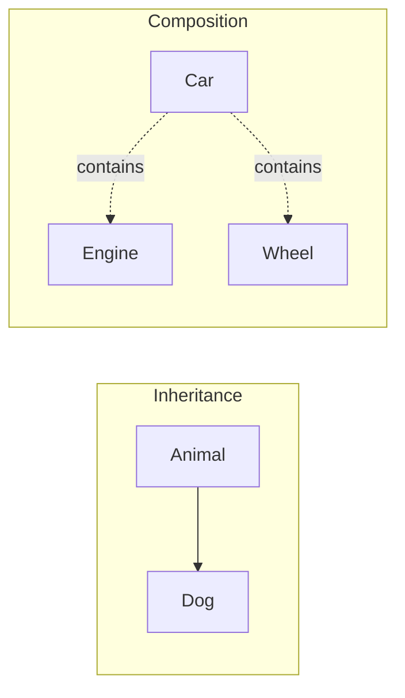
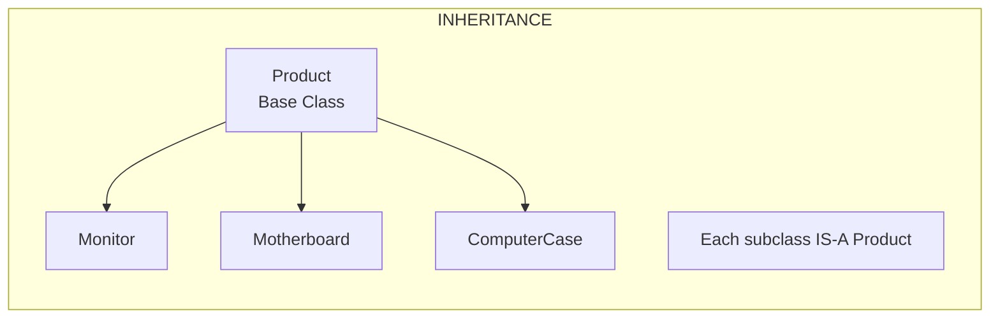
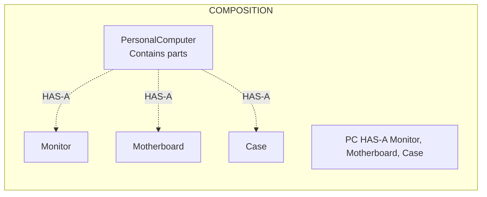
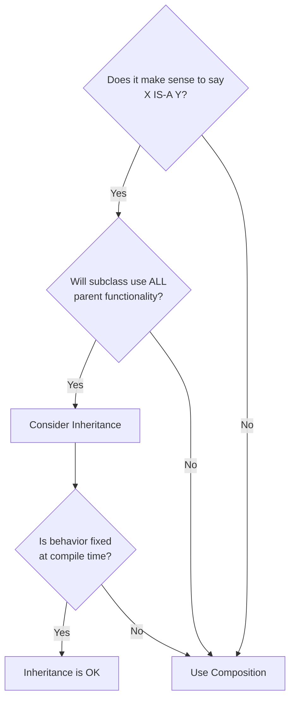

# :material-pencil: Topic Note Part 4: Composition

> **Course:** Java Programming Masterclass - Tim Buchalka (Udemy)  
> **Section:** 08. Advanced OOP Techniques  
> **Status:** :material-check-circle: Complete

---

## :material-target: Learning Objectives

- [x] Understand the difference between IS-A and HAS-A relationships
- [x] Master Composition as an alternative to Inheritance
- [x] Learn when to prefer Composition over Inheritance
- [x] Build complex objects from simpler component parts
- [x] Implement delegation patterns through composite classes
- [x] Apply composition in real-world modeling scenarios

---

## :material-head-cog: IS-A vs HAS-A Relationships

### The Two Fundamental Relationships in OOP

In Object-Oriented Programming, there are two primary ways to relate classes:

| Relationship | Keyword | Description | Example |
|--------------|---------|-------------|---------|
| **IS-A** | `extends` | Inheritance - subclass is a type of parent | `Dog extends Animal` → Dog IS-A Animal |
| **HAS-A** | field reference | Composition - class contains other classes | `Car has-a Engine` → Car HAS-A Engine |



### Understanding the Difference

**Inheritance (IS-A):**

- Creates a class hierarchy where subclasses inherit from parents
- Establishes a "type-of" relationship
- Subclass can be used anywhere parent is expected
- Example: A `Monitor` IS-A `Product`

**Composition (HAS-A):**

- Creates objects from other objects as building blocks
- Establishes a "contains" or "made-up-of" relationship
- The containing class delegates work to its components
- Example: A `PersonalComputer` HAS-A `Monitor`, HAS-A `Motherboard`

---

## :material-puzzle: What is Composition?

### Definition

**Composition** is a design technique where a class is built by combining references to other objects. The composite class (the container) manages its component parts and delegates behavior to them.

### Key Characteristics

1. **Contains references** to other objects as instance fields
2. **Delegates work** to component objects
3. **Manages lifecycle** of its parts (creates, uses, destroys)
4. **Hides complexity** from external code
5. **More flexible** than inheritance for many scenarios

### Visual Comparison






---

## :material-laptop: Building a Computer with Composition

### The Product Hierarchy (Inheritance)

First, let's establish a base class for computer products:

```java
public class Product {
    private String model;
    private String manufacturer;
    private int width;
    private int height;
    private int depth;

    public Product(String model, String manufacturer) {
        this.model = model;
        this.manufacturer = manufacturer;
    }
}
```

### The Component Parts (Subclasses)

Each computer part IS-A Product with its own specific behavior:

```java
class Monitor extends Product {
    private int size;
    private String resolution;

    public Monitor(String model, String manufacturer) {
        super(model, manufacturer);
    }

    public Monitor(String model, String manufacturer, 
                   int size, String resolution) {
        super(model, manufacturer);
        this.size = size;
        this.resolution = resolution;
    }

    public void drawPixelAt(int x, int y, String color) {
        System.out.printf("Drawing pixel at %d,%d in color %s%n", 
                          x, y, color);
    }
}

class Motherboard extends Product {
    private int ramSlots;
    private int cardSlots;
    private String bios;

    public Motherboard(String model, String manufacturer,
                       int ramSlots, int cardSlots, String bios) {
        super(model, manufacturer);
        this.ramSlots = ramSlots;
        this.cardSlots = cardSlots;
        this.bios = bios;
    }

    public void loadProgram(String programName) {
        System.out.println("Program: " + programName + " is now loading...");
    }
}

class ComputerCase extends Product {
    private String powerSupply;

    public ComputerCase(String model, String manufacturer, 
                        String powerSupply) {
        super(model, manufacturer);
        this.powerSupply = powerSupply;
    }

    public void pressPowerButton() {
        System.out.println("Power button pressed!");
    }
}
```

### The Composite Class (PersonalComputer)

Now, the **PersonalComputer** uses **BOTH** inheritance AND composition:

```java
public class PersonalComputer extends Product {
    // COMPOSITION: These are HAS-A relationships
    private ComputerCase computerCase;
    private Monitor monitor;
    private Motherboard motherboard;

    public PersonalComputer(String model, String manufacturer,
                            ComputerCase computerCase, 
                            Monitor monitor,
                            Motherboard motherboard) {
        super(model, manufacturer);  // Inheritance
        this.computerCase = computerCase;
        this.monitor = monitor;
        this.motherboard = motherboard;
    }

    // Private method - internal behavior
    private void drawLogo() {
        monitor.drawPixelAt(1200, 50, "yellow");
    }

    // Public method - delegates to parts
    public void powerUp() {
        computerCase.pressPowerButton();
        drawLogo();
    }
}
```

!!! tip "Combining Inheritance and Composition"
    `PersonalComputer` IS-A `Product` (inherits common attributes) AND HAS-A `Monitor`, `Motherboard`, and `ComputerCase`. This is a powerful combination!

---

## :material-call-split: Two Approaches to Using Composition

### Approach 1: Exposing Components via Getters

The calling code directly accesses parts through getter methods:

```java
// With getter methods on PersonalComputer:
public ComputerCase getComputerCase() { return computerCase; }
public Monitor getMonitor() { return monitor; }
public Motherboard getMotherboard() { return motherboard; }
```

```java
// Calling code
PersonalComputer pc = new PersonalComputer("2208", "Dell", 
                                          theCase, theMonitor, theMotherboard);

// Direct access through getters - method chaining
pc.getMonitor().drawPixelAt(10, 10, "red");
pc.getMotherboard().loadProgram("Windows OS");
pc.getComputerCase().pressPowerButton();
```

**Disadvantages:**

- Exposes internal structure
- Calling code needs to know about parts
- Changes to parts affect all calling code

### Approach 2: Hiding Components via Delegation (Preferred)

The composite class provides public methods that delegate to parts:

```java
public class PersonalComputer extends Product {
    private ComputerCase computerCase;
    private Monitor monitor;
    private Motherboard motherboard;

    // NO GETTERS - parts are hidden

    // Private method - only PC can draw logo
    private void drawLogo() {
        monitor.drawPixelAt(1200, 50, "yellow");
    }

    // Public method - high-level interface
    public void powerUp() {
        computerCase.pressPowerButton();
        drawLogo();
    }
}
```

```java
// Calling code - much simpler!
PersonalComputer pc = new PersonalComputer("2208", "Dell", 
                                          theCase, theMonitor, theMotherboard);

pc.powerUp();  // One method, handles everything
```

**Advantages:**

- Parts are encapsulated
- Calling code doesn't need to know details
- Changes to parts don't affect calling code
- Simpler interface (better encapsulation)

---

## :material-home-automation: Smart Kitchen Challenge Example

### The Composite Container

```java
public class SmartKitchen {
    private CoffeeMaker brewMaster;
    private Refrigerator iceBox;
    private DishWasher dishWasher;

    // No-args constructor creates all appliances
    public SmartKitchen() {
        brewMaster = new CoffeeMaker();
        iceBox = new Refrigerator();
        dishWasher = new DishWasher();
    }

    // Method 1: Set state of all appliances
    public void setKitchenState(boolean coffeeFlag, 
                                 boolean fridgeFlag,
                                 boolean dishWasherFlag) {
        brewMaster.setHasWorkToDo(coffeeFlag);
        iceBox.setHasWorkToDo(fridgeFlag);
        dishWasher.setHasWorkToDo(dishWasherFlag);
    }

    // Method 2: Delegate work to all appliances
    public void doKitchenWork() {
        brewMaster.brewCoffee();
        iceBox.orderFood();
        dishWasher.doDishes();
    }
}
```

### The Component Appliances

```java
class CoffeeMaker {
    private boolean hasWorkToDo;

    public void setHasWorkToDo(boolean hasWorkToDo) {
        this.hasWorkToDo = hasWorkToDo;
    }

    public void brewCoffee() {
        if (hasWorkToDo) {
            System.out.println("Coffee is brewing...");
            hasWorkToDo = false;
        }
    }
}

class Refrigerator {
    private boolean hasWorkToDo;

    public void setHasWorkToDo(boolean hasWorkToDo) {
        this.hasWorkToDo = hasWorkToDo;
    }

    public void orderFood() {
        if (hasWorkToDo) {
            System.out.println("Ordering Food...");
            hasWorkToDo = false;
        }
    }
}

class DishWasher {
    private boolean hasWorkToDo;

    public void setHasWorkToDo(boolean hasWorkToDo) {
        this.hasWorkToDo = hasWorkToDo;
    }

    public void doDishes() {
        if (hasWorkToDo) {
            System.out.println("Washing dishes...");
            hasWorkToDo = false;
        }
    }
}
```

### Using the Smart Kitchen

```java
SmartKitchen kitchen = new SmartKitchen();

// Set which appliances have work to do
kitchen.setKitchenState(true, false, true);  // Coffee & dishes only

// Do all the work - kitchen delegates to parts
kitchen.doKitchenWork();

// Output:
// Coffee is brewing...
// Washing dishes...
```

---

## :material-scale-balance: Composition vs Inheritance

### Why Prefer Composition Over Inheritance?

| Aspect | Inheritance | Composition |
|--------|-------------|-------------|
| **Flexibility** | Less flexible - locked into hierarchy | More flexible - can swap parts |
| **Coupling** | Tight coupling between classes | Loose coupling - parts are independent |
| **Changes** | Changes cascade to all subclasses | Changes isolated to components |
| **Reuse** | Limited to hierarchy | Reuse outside class hierarchy |
| **Testing** | Harder to test in isolation | Easy to test parts independently |
| **Encapsulation** | May break encapsulation (protected) | Preserves encapsulation |

### When to Use Each



### The Digital Product Problem

Consider adding `DigitalProduct` to a `Product` hierarchy:

```java
public class Product {
    private String manufacturer;
    private String model;
    private int width;    // What about digital products?
    private int height;   // They don't have dimensions!
    private int depth;
}

class DigitalProduct extends Product {
    // PROBLEM: Inherits width, height, depth
    // which makes no sense for software!
}
```

**Solution with Composition:**

```java
// Make Product more generic
public class Product {
    private String manufacturer;
    private String model;
}

// Create Dimensions as a component
class Dimensions {
    private int width;
    private int height;
    private int depth;
}

// Physical products USE Dimensions
class Motherboard extends Product {
    private Dimensions dimensions;  // HAS-A dimensions
}

// Digital products don't need Dimensions
class SoftwareProduct extends Product {
    private String licenseKey;
    // No Dimensions needed!
}
```

---

## :material-lightbulb: Key Takeaways

### Composition Best Practices

1. **"Favor composition over inheritance"** - Common OOP design principle
2. **Use inheritance for IS-A** relationships where subclass truly is a type of parent
3. **Use composition for HAS-A** relationships where class contains other objects
4. **Combine both** when appropriate (class inherits AND contains)
5. **Hide components** when possible - delegate through public methods
6. **Create parts internally** when they don't need to be configured externally

### Benefits Summary

- **Flexibility**: Add/remove/change parts without affecting hierarchy
- **Reuse**: Same components can be used in different composites
- **Encapsulation**: Hide complexity behind simple interfaces
- **Maintainability**: Changes are localized to components

---

## :material-navigation: Related Notes

| Part | Topic | Link |
|:----:|-------|------|
| 1 | Classes, Objects & Encapsulation | [← Part 1](topic-note.md) |
| 2 | Inheritance & Method Overriding | [← Part 2](topic-note-part2.md) |
| 3 | Strings & StringBuilder | [← Part 3](topic-note-part3.md) |
| 4 | Composition | **You are here** |
| 5 | Encapsulation | [Part 5 →](topic-note-part5.md) |
| 6 | Polymorphism | [Part 6 →](topic-note-part6.md) |

---

*Last Updated: 2026-01-26*
