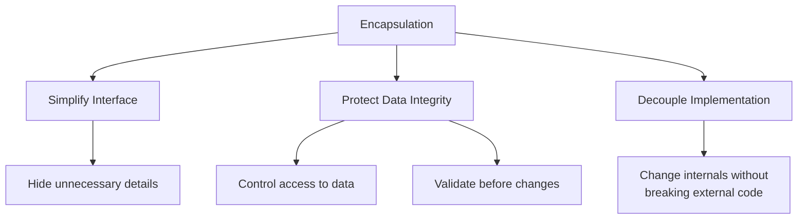
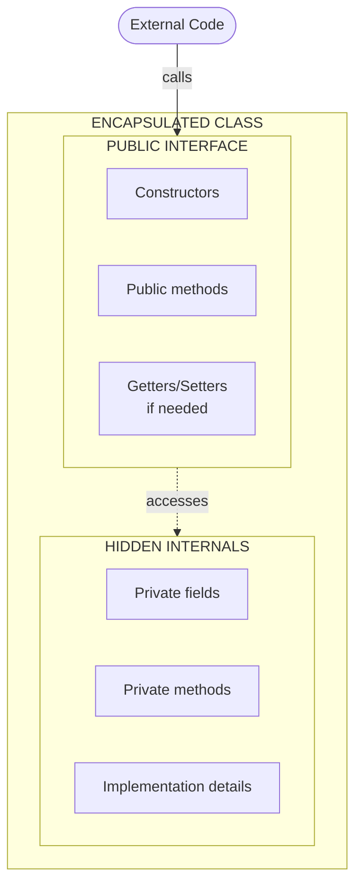
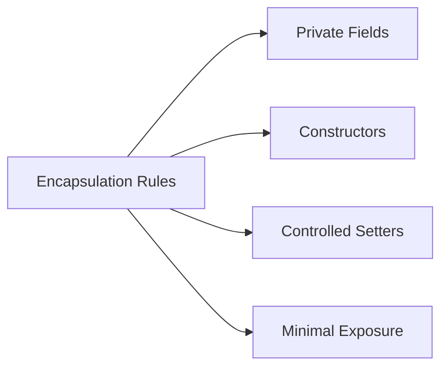

# :material-pencil: Topic Note Part 5: Encapsulation

> **Course:** Java Programming Masterclass - Tim Buchalka (Udemy)  
> **Section:** 08. Advanced OOP Techniques  
> **Status:** :material-check-circle: Complete

---

## :material-target: Learning Objectives

- [x] Understand what encapsulation means and why it matters
- [x] Learn the three major problems of poor encapsulation
- [x] Master creating properly encapsulated classes
- [x] Implement data validation in constructors and setters
- [x] Apply access modifiers correctly for data protection
- [x] Decouple internal implementation from public interface

---

## :material-head-cog: What is Encapsulation?

### Definition

**Encapsulation** is the bundling of data (fields) and methods that operate on that data within a single unit (class), while restricting direct access to some of the object's components.

In simpler terms: **Encapsulation means hiding things by making them private or inaccessible.**

### The Three Goals of Encapsulation



| Goal | Description |
|------|-------------|
| **Simplify Interface** | Hide unnecessary implementation details from users |
| **Protect Data Integrity** | Ensure data is always valid through controlled access |
| **Decouple Implementation** | Allow internal changes without affecting external code |

### The "Black Box" Concept

Think of an encapsulated class as a **black box**:

- Users know **WHAT** it does (public interface)
- Users don't know/need to know **HOW** it does it (private implementation)




---

## :material-alert-circle: Problems Without Encapsulation

### The Bad Example: Player Class

Here's a class that violates encapsulation principles:

```java
public class Player {
    public String name;    // ⚠️ PUBLIC - Direct access!
    public int health;     // ⚠️ PUBLIC - No protection!
    public String weapon;  // ⚠️ PUBLIC - Anyone can modify!

    public void loseHealth(int damage) {
        health = health - damage;
        if (health <= 0) {
            System.out.println("Player knocked out of game");
        }
    }

    public int healthRemaining() {
        return health;
    }

    public void restoreHealth(int extraHealth) {
        health = health + extraHealth;
        if (health > 100) {
            System.out.println("Player restored to 100%");
            health = 100;
        }
    }
}
```

### Problem 1: Bypassing Validation

```java
Player player = new Player();
player.name = "Tim";
player.health = 20;
player.weapon = "sword";

// ... later in the code ...

player.health = 200;  // ⚠️ BYPASSED restoreHealth() validation!
                      // Health should never exceed 100!
```

!!! danger "Data Integrity Broken"
    The `restoreHealth()` method enforces that health never exceeds 100. But because `health` is public, any code can set it directly, bypassing this rule.

### Problem 2: Field Renaming Breaks Code

If you change a field name internally, all external code breaks:

```java
// Before: name field
public String name;

// After: changed to fullName
public String fullName;  // ⚠️ All code using "player.name" now fails!
```

```java
// External code that was working...
player.name = "Tim";

// ...now fails with compile error:
// "Cannot resolve symbol 'name'"
```

### Problem 3: No Guaranteed Initialization

Without constructors, calling code must manually initialize:

```java
Player player = new Player();
// Forgot to set health!
player.name = "Tim";
player.weapon = "sword";

// health is 0 (default) - player is dead before game starts!
```

---

## :material-check-bold: The Encapsulated Solution: EnhancedPlayer

### Properly Encapsulated Class

```java
public class EnhancedPlayer {
    // ✅ PRIVATE fields - no direct access
    private String fullName;
    private int healthPercentage;
    private String weapon;

    // ✅ Constructor ensures valid initialization
    public EnhancedPlayer(String fullName) {
        this(fullName, 100, "Sword");  // Chaining with defaults
    }

    public EnhancedPlayer(String fullName, int health, String weapon) {
        this.fullName = fullName;
        
        // ✅ Validation in constructor
        if (health <= 0) {
            this.healthPercentage = 1;
        } else if (health > 100) {
            this.healthPercentage = 100;
        } else {
            this.healthPercentage = health;
        }
        
        this.weapon = weapon;
    }

    // ✅ Controlled modification through methods
    public void loseHealth(int damage) {
        healthPercentage = healthPercentage - damage;
        if (healthPercentage <= 0) {
            System.out.println("Player knocked out of game");
        }
    }

    public int healthRemaining() {
        return healthPercentage;
    }

    public void restoreHealth(int extraHealth) {
        healthPercentage = healthPercentage + extraHealth;
        if (healthPercentage > 100) {
            System.out.println("Player restored to 100%");
            healthPercentage = 100;
        }
    }
}
```

### How Encapsulation Solves the Problems

**Problem 1 → Solved**: Can't bypass validation

```java
EnhancedPlayer player = new EnhancedPlayer("Tim", 200, "sword");
System.out.println(player.healthRemaining());  // 100, not 200!

// player.healthPercentage = 200;  // ❌ WON'T COMPILE - private!
```

**Problem 2 → Solved**: Internal changes don't break external code

```java
// Internal change: health → healthPercentage
// External code still uses healthRemaining() method
// No changes needed in calling code!
```

**Problem 3 → Solved**: Constructor guarantees valid state

```java
EnhancedPlayer player = new EnhancedPlayer("Tim");
// health is 100 (default)
// weapon is "Sword" (default)
// Player is ready to play!
```

---

## :material-printer: Encapsulation Challenge: Printer Class

### Requirements

Create a `Printer` class with:

- **Fields**: `tonerLevel` (0-100%), `pagesPrinted`, `duplex` (boolean)
- **Constructor**: Validates toner level is in valid range
- **Methods**: `addToner()` and `printPages()`

### Solution

```java
public class Printer {
    private int tonerLevel;
    private int pagesPrinted;
    private boolean duplex;

    public Printer(int tonerLevel, boolean duplex) {
        this.pagesPrinted = 0;
        // Validate toner level in constructor
        this.tonerLevel = (tonerLevel >= 0 && tonerLevel <= 100) 
                          ? tonerLevel : -1;
        this.duplex = duplex;
    }

    public int addToner(int tonerAmount) {
        int tempAmount = tonerAmount + tonerLevel;
        
        // Validate: must stay in 0-100 range
        if (tempAmount > 100 || tempAmount < 0) {
            return -1;  // Error indicator
        }
        
        tonerLevel += tonerAmount;
        return tonerLevel;
    }

    public int printPages(int pages) {
        // Duplex: 2 pages per sheet, odd pages need extra sheet
        int jobPages = (duplex) 
                       ? (pages / 2) + (pages % 2) 
                       : pages;
        
        pagesPrinted += jobPages;
        return jobPages;
    }

    public int getPagesPrinted() {
        return pagesPrinted;
    }
}
```

### Using the Encapsulated Printer

```java
Printer printer = new Printer(50, true);  // 50% toner, duplex enabled

System.out.println(printer.getPagesPrinted());  // 0

int sheets = printer.printPages(5);   // 5 pages, duplex = 3 sheets
System.out.printf("Job: %d sheets, Total: %d%n", 
                  sheets, printer.getPagesPrinted());

sheets = printer.printPages(10);      // 10 pages, duplex = 5 sheets
System.out.printf("Job: %d sheets, Total: %d%n", 
                  sheets, printer.getPagesPrinted());

// Output:
// 0
// Job: 3 sheets, Total: 3
// Job: 5 sheets, Total: 8
```

---

## :material-format-list-checks: Encapsulation Rules

### The Four Principles



### 1. Use `private` for Fields

```java
// ❌ BAD
public String name;
public int health;

// ✅ GOOD
private String name;
private int health;
```

### 2. Use Constructors for Initialization

```java
public EnhancedPlayer(String fullName, int health, String weapon) {
    this.fullName = fullName;
    
    // Validate in constructor!
    if (health <= 0) {
        this.healthPercentage = 1;
    } else if (health > 100) {
        this.healthPercentage = 100;
    } else {
        this.healthPercentage = health;
    }
    
    this.weapon = weapon;
}
```

### 3. Use Setters Sparingly (Only When Needed)

```java
// ❌ Don't automatically generate setters for all fields
public void setHealth(int health) {
    this.health = health;  // No validation!
}

// ✅ Only provide setters when necessary, with validation
public void restoreHealth(int extraHealth) {
    health = health + extraHealth;
    if (health > 100) {
        health = 100;  // Enforce business rule
    }
}
```

### 4. Expose Only What's Necessary

```java
// ❌ Don't expose internal details
public Motherboard getMotherboard() {
    return motherboard;  // Exposes internal component
}

// ✅ Provide high-level operations instead
public void powerUp() {
    computerCase.pressPowerButton();
    drawLogo();
}
```

---

## :material-compare-horizontal: Before vs After Comparison

### Player Class Comparison

| Aspect | Non-Encapsulated (Player) | Encapsulated (EnhancedPlayer) |
|--------|---------------------------|-------------------------------|
| Field access | `public` | `private` |
| Initialization | Manual by caller | Constructor with validation |
| Health modification | Direct access possible | Only through methods |
| Field names exposed | Yes | No |
| Validation enforced | Can be bypassed | Always enforced |
| Breaking changes | Affect all callers | Contained in class |

### Code Comparison

```java
// ❌ Non-encapsulated usage
Player player = new Player();
player.name = "Tim";        // Direct access
player.health = 200;        // Can set invalid values!

// ✅ Encapsulated usage
EnhancedPlayer player = new EnhancedPlayer("Tim", 200, "Sword");
// Health automatically capped to 100
// Can only modify through provided methods
```

---

## :material-shield-check: Benefits of Encapsulation

### Summary Table

| Benefit | Description |
|---------|-------------|
| **Data Protection** | Private fields prevent unauthorized modification |
| **Validation** | Constructors and methods can validate all changes |
| **Flexibility** | Internal implementation can change without breaking callers |
| **Simpler Interface** | Users see only what they need (public API) |
| **Maintainability** | Changes are localized to the class |
| **Debugging** | Easier to track data changes through methods |

### Real-World Analogy

Think of encapsulation like a **bank account**:

- You can't directly modify your balance (private field)
- You must use `deposit()` or `withdraw()` methods
- The bank validates every transaction
- You don't need to know how the bank stores your balance internally

```java
public class BankAccount {
    private double balance;  // You can't touch this directly!
    
    public void deposit(double amount) {
        if (amount > 0) {
            balance += amount;  // Validation
        }
    }
    
    public boolean withdraw(double amount) {
        if (amount > 0 && balance >= amount) {
            balance -= amount;
            return true;
        }
        return false;  // Insufficient funds
    }
    
    public double getBalance() {
        return balance;  // Read-only access
    }
}
```

---

## :material-pin: Quick Reference

### Encapsulation Checklist

- [ ] All instance fields are `private`
- [ ] Constructor(s) validate input data
- [ ] Only necessary getters are provided
- [ ] Setters include validation (or use specialized methods instead)
- [ ] Public methods form a clean, simple interface
- [ ] Internal implementation details are hidden

### Access Modifiers Reminder

| Modifier | Same Class | Same Package | Subclass | World |
|----------|:----------:|:------------:|:--------:|:-----:|
| `private` | ✅ | ❌ | ❌ | ❌ |
| (default) | ✅ | ✅ | ❌ | ❌ |
| `protected` | ✅ | ✅ | ✅ | ❌ |
| `public` | ✅ | ✅ | ✅ | ✅ |

---

## :material-help-circle: Questions Explored

- [x] What is encapsulation and why do we need it?
- [x] What problems occur without proper encapsulation?
- [x] How do I create a properly encapsulated class?
- [x] When should I use getters and setters?
- [x] How does encapsulation relate to the "black box" concept?
- [x] What's the relationship between encapsulation and validation?

---

## :material-navigation: Related Notes

| Part | Topic | Link |
|:----:|-------|------|
| 1 | Classes, Objects & Encapsulation | [← Part 1](topic-note.md) |
| 2 | Inheritance & Method Overriding | [← Part 2](topic-note-part2.md) |
| 3 | Strings & StringBuilder | [← Part 3](topic-note-part3.md) |
| 4 | Composition | [← Part 4](topic-note-part4.md) |
| 5 | Encapsulation | **You are here** |
| 6 | Polymorphism | [Part 6 →](topic-note-part6.md) |

---

*Last Updated: 2026-01-26*
