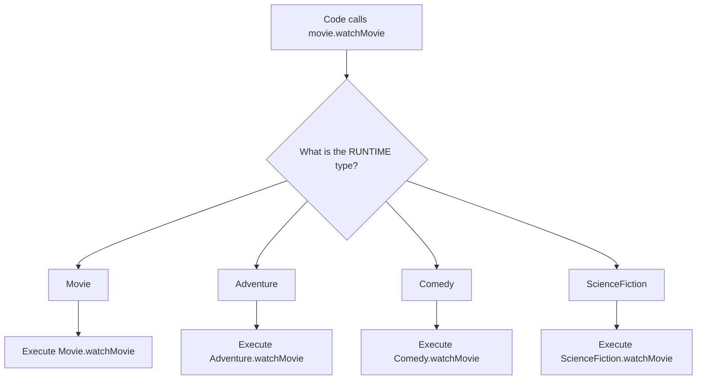
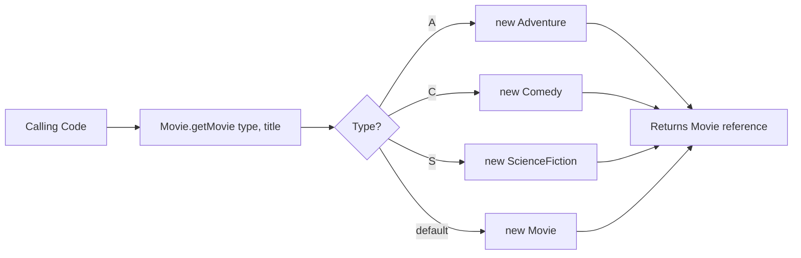

# :material-pencil: Topic Note Part 6: Polymorphism

> **Course:** Java Programming Masterclass - Tim Buchalka (Udemy)  
> **Section:** 08. Advanced OOP Techniques  
> **Status:** :material-check-circle: Complete

---

## :material-target: Learning Objectives

- [x] Understand what polymorphism means and how it works in Java
- [x] Master the difference between compile-time and runtime types
- [x] Learn to write polymorphic code using inheritance
- [x] Implement factory methods for object creation
- [x] Understand type casting and its implications
- [x] Use `instanceof` operator and pattern matching (JDK 16+)
- [x] Apply Local Variable Type Inference (`var` keyword)

---

## :material-head-cog: What is Polymorphism?

### Definition

**Polymorphism** literally means "many forms." In Java, it allows us to:

- Write code that calls a method
- Have **different behavior execute** for different objects at runtime
- Use a **single reference type** to work with multiple object types

### The Core Concept

```java
Movie movie = new Adventure("Star Wars");  // Declared: Movie, Actual: Adventure
movie.watchMovie();  // Calls Adventure's watchMovie(), not Movie's!
```

The **declared type** (compıle-time) is `Movie`, but the **actual type** (runtime) is `Adventure`. Java automatically calls the method on the actual runtime object.

### How Polymorphism Works



---

## :material-movie: Movie Class Hierarchy Example

### The Base Class: Movie

```java
public class Movie {
    private String title;

    public Movie(String title) {
        this.title = title;
    }

    public void watchMovie() {
        // getClass().getSimpleName() returns the RUNTIME class name
        String instanceType = this.getClass().getSimpleName();
        System.out.println(title + " is a " + instanceType + " film");
    }
}
```

### The Subclasses: Adventure, Comedy, ScienceFiction

```java
class Adventure extends Movie {
    public Adventure(String title) {
        super(title);
    }

    @Override
    public void watchMovie() {
        super.watchMovie();  // Call parent's method first
        System.out.printf("..%s%n".repeat(3),
            "Pleasant Scene",
            "Scary Music",
            "Something Bad Happens");
    }

    public void watchAdventure() {
        System.out.println("Watching an Adventure!");
    }
}

class Comedy extends Movie {
    public Comedy(String title) {
        super(title);
    }

    @Override
    public void watchMovie() {
        super.watchMovie();
        System.out.printf("..%s%n".repeat(3),
            "Something funny happens",
            "Something even funnier happens",
            "Happy Ending");
    }

    public void watchComedy() {
        System.out.println("Watching a Comedy!");
    }
}

class ScienceFiction extends Movie {
    public ScienceFiction(String title) {
        super(title);
    }

    @Override
    public void watchMovie() {
        super.watchMovie();
        System.out.printf("..%s%n".repeat(3),
            "Bad Aliens do Bad Stuff",
            "Space Guys Chase Aliens",
            "Planet Blows Up");
    }

    public void watchScienceFiction() {
        System.out.println("Watching a Science Fiction Thriller!");
    }
}
```

### Polymorphism in Action

```java
// Same declared type (Movie), different runtime types
Movie movie1 = new Movie("Generic Film");
Movie movie2 = new Adventure("Star Wars");
Movie movie3 = new Comedy("Airplane");
Movie movie4 = new ScienceFiction("The Matrix");

// Each call executes DIFFERENT behavior!
movie1.watchMovie();  // Movie.watchMovie()
movie2.watchMovie();  // Adventure.watchMovie()
movie3.watchMovie();  // Comedy.watchMovie()
movie4.watchMovie();  // ScienceFiction.watchMovie()
```

**Output:**
```
Generic Film is a Movie film
Star Wars is a Adventure film
..Pleasant Scene
..Scary Music
..Something Bad Happens
Airplane is a Comedy film
..Something funny happens
..Something even funnier happens
..Happy Ending
The Matrix is a ScienceFiction film
..Bad Aliens do Bad Stuff
..Space Guys Chase Aliens
..Planet Blows Up
```

---

## :material-factory: Factory Methods

### What is a Factory Method?

A **factory method** is a static method that returns instances of objects. It hides the details of object creation from calling code.

```java
public class Movie {
    // ... fields and constructor ...

    public static Movie getMovie(String type, String title) {
        return switch (type.toUpperCase().charAt(0)) {
            case 'A' -> new Adventure(title);
            case 'C' -> new Comedy(title);
            case 'S' -> new ScienceFiction(title);
            default -> new Movie(title);
        };
    }
}
```

### Using the Factory Method

```java
// Calling code doesn't need to know about subclasses!
Movie movie = Movie.getMovie("S", "Star Wars");
movie.watchMovie();

// Output:
// Star Wars is a ScienceFiction film
// ..Bad Aliens do Bad Stuff
// ..Space Guys Chase Aliens
// ..Planet Blows Up
```

### Benefits of Factory Methods

1. **Encapsulation**: Subclass details hidden from caller
2. **Flexibility**: Easy to add new types without changing caller code
3. **Centralized creation**: All instantiation logic in one place
4. **Polymorphism-friendly**: Returns parent type, actual type varies



---

## :material-compare: Compile-Time vs Runtime Types

### Understanding the Difference

| Aspect | Compile-Time Type | Runtime Type |
|--------|-------------------|--------------|
| **When determined** | At compilation | During execution |
| **Also called** | Declared type | Actual type |
| **What decides** | Variable declaration | `new` statement |
| **Method resolution** | Checks if method exists | Determines which version runs |

### Example Breakdown

```java
Movie movie = new Adventure("Star Wars");
//    ↑              ↑
//    │              └── Runtime type (Adventure)
//    └── Compile-time type (Movie)
```

### What the Compiler Sees vs What JVM Executes

```java
Movie movie = new Adventure("Jaws");

// Compile-time: Compiler checks if Movie has watchMovie() ✓
// Runtime: JVM executes Adventure's watchMovie()

movie.watchMovie();  // Adventure's version runs!
```

### Method Visibility Based on Declared Type

```java
Movie movie = new Adventure("Jaws");

movie.watchMovie();      // ✅ Works - watchMovie() is on Movie
movie.watchAdventure();  // ❌ COMPILE ERROR - watchAdventure() not on Movie!
```

The compiler only knows about methods on the **declared type** (`Movie`), even though the runtime type (`Adventure`) has additional methods.

---

## :material-cast: Type Casting

### Why Cast?

When you need to access methods specific to a subclass:

```java
Movie movie = Movie.getMovie("A", "Jaws");

// Can't call watchAdventure() on Movie reference
// movie.watchAdventure();  // ❌ Won't compile

// Solution: Cast to Adventure
Adventure adventure = (Adventure) movie;
adventure.watchAdventure();  // ✅ Works!
```

### Casting Risks

```java
Movie movie = Movie.getMovie("C", "Airplane");  // Actually a Comedy

// Dangerous: Casting to wrong type!
Adventure adventure = (Adventure) movie;  // ❌ Runtime Exception!
```

```
java.lang.ClassCastException: class Comedy cannot be cast to class Adventure
```

!!! danger "ClassCastException"
    Casting to the wrong type compiles successfully but throws a `ClassCastException` at runtime. Always verify the type before casting!

### The Object Reference Problem

```java
Object movie = Movie.getMovie("C", "Airplane");

movie.watchMovie();  // ❌ COMPILE ERROR - watchMovie() not on Object!
```

When declared as `Object`, only `Object`'s methods are available (like `toString()`, `equals()`, etc.).

---

## :material-variable: Local Variable Type Inference (`var`)

### What is `var`?

Introduced in **Java 10**, `var` lets the compiler infer the type:

```java
var movie = Movie.getMovie("C", "Airplane");
//  ↑
//  └── Compiler infers: Movie (from method return type)
```

### How Type Inference Works

```java
// Method signature determines inferred type
public static Movie getMovie(String type, String title) { ... }

var movie = Movie.getMovie("C", "Airplane");  // Inferred as Movie

movie.watchMovie();      // ✅ Works - Movie has watchMovie()
movie.watchComedy();     // ❌ Error - Movie doesn't have watchComedy()
```

### Direct Instantiation with var

```java
var plane = new Comedy("Airplane");  // Inferred as Comedy

plane.watchMovie();   // ✅ Works
plane.watchComedy();  // ✅ Works - plane is a Comedy reference!
```

When using `new ClassName()`, the type is inferred as that specific class.

### Limitations of `var`

```java
// ❌ Can't use in field declarations
// private var name;  // Won't compile

// ❌ Can't use in method parameters
// public void process(var item) {}  // Won't compile

// ❌ Can't use in method return types
// public var getItem() {}  // Won't compile

// ❌ Must have initializer
// var x;  // Won't compile - can't infer type

// ❌ Can't assign null
// var x = null;  // Won't compile - can't infer type from null
```

---

## :material-check-circle-outline: Runtime Type Checking

### Method 1: Using getClass()

```java
Object unknownObject = Movie.getMovie("C", "Airplane");

if (unknownObject.getClass().getSimpleName().equals("Comedy")) {
    Comedy c = (Comedy) unknownObject;
    c.watchComedy();
}
```

### Method 2: Using `instanceof` Operator

```java
Object unknownObject = Movie.getMovie("A", "Jaws");

if (unknownObject instanceof Adventure) {
    Adventure a = (Adventure) unknownObject;
    a.watchAdventure();
}
```

The `instanceof` operator checks if an object is an instance of a specific type.

### Method 3: Pattern Matching for `instanceof` (JDK 16+)

```java
Object unknownObject = Movie.getMovie("S", "Star Wars");

// Old way (pre-JDK 16):
if (unknownObject instanceof ScienceFiction) {
    ScienceFiction scifi = (ScienceFiction) unknownObject;
    scifi.watchScienceFiction();
}

// NEW way (JDK 16+) - Pattern Matching:
if (unknownObject instanceof ScienceFiction scifi) {
    // scifi is already typed and ready to use!
    scifi.watchScienceFiction();
}
```

!!! tip "Pattern Matching Benefits"
    - No explicit cast needed
    - Variable (`scifi`) is automatically typed
    - Cleaner, more readable code
    - Variable scope is limited to the `if` block

### Complete Example

```java
Object unknownObject = Movie.getMovie("C", "Airplane");

if (unknownObject.getClass().getSimpleName().equals("Comedy")) {
    Comedy c = (Comedy) unknownObject;
    c.watchComedy();
} else if (unknownObject instanceof Adventure) {
    ((Adventure) unknownObject).watchAdventure();  // Cast inline
} else if (unknownObject instanceof ScienceFiction scifi) {
    scifi.watchScienceFiction();  // Pattern matching
}
```

---

## :material-car: Polymorphism Challenge: Car Classes

### The Car Base Class

```java
public class Car {
    private String description;

    public Car(String description) {
        this.description = description;
    }

    public void startEngine() {
        System.out.println("Car -> startEngine");
    }

    protected void runEngine() {
        System.out.println("Car -> runEngine");
    }

    public void drive() {
        System.out.println("Car -> driving, type is " + 
                          getClass().getSimpleName());
        runEngine();
    }
}
```

### Subclasses with Overridden Methods

```java
class GasPoweredCar extends Car {
    private double avgKmPerLiter;
    private int cylinders = 6;

    public GasPoweredCar(String description, 
                         double avgKmPerLiter, int cylinders) {
        super(description);
        this.avgKmPerLiter = avgKmPerLiter;
        this.cylinders = cylinders;
    }

    @Override
    public void startEngine() {
        System.out.printf("Gas -> All %d cylinders are fired up, Ready!%n", 
                          cylinders);
    }

    @Override
    protected void runEngine() {
        System.out.printf("Gas -> usage exceeds the average: %.2f%n", 
                          avgKmPerLiter);
    }
}

class ElectricCar extends Car {
    private double avgKmPerCharge;
    private int batterySize = 6;

    public ElectricCar(String description, 
                       double avgKmPerCharge, int batterySize) {
        super(description);
        this.avgKmPerCharge = avgKmPerCharge;
        this.batterySize = batterySize;
    }

    @Override
    public void startEngine() {
        System.out.printf("BEV -> switch %d KWh battery on, Ready!%n", 
                          batterySize);
    }

    @Override
    protected void runEngine() {
        System.out.printf("BEV -> usage under the average: %.2f%n", 
                          avgKmPerCharge);
    }
}

class HybridCar extends Car {
    private double avgKmPerLiter;
    private int cylinders = 6;
    private int batterySize;

    public HybridCar(String description, double avgKmPerLiter, 
                     int cylinders, int batterySize) {
        super(description);
        this.avgKmPerLiter = avgKmPerLiter;
        this.cylinders = cylinders;
        this.batterySize = batterySize;
    }

    @Override
    public void startEngine() {
        System.out.printf("Hybrid -> %d cylinders are fired up, Ready!%n", 
                          cylinders);
        System.out.printf("Hybrid -> switch %d KWh battery on, Ready!%n", 
                          batterySize);
    }

    @Override
    protected void runEngine() {
        System.out.printf("Hybrid -> usage below the average: %.2f%n", 
                          avgKmPerLiter);
    }
}
```

### Polymorphic Method

```java
public class Main {
    public static void main(String[] args) {
        Car ferrari = new GasPoweredCar("2022 Ferrari 296 GTS", 15.4, 6);
        Car tesla = new ElectricCar("2022 Tesla Model 3", 568, 75);
        Car ferrariHybrid = new HybridCar("2022 Ferrari SF90", 16, 8, 8);
        
        runRace(ferrari);
        runRace(tesla);
        runRace(ferrariHybrid);
    }
    
    // Polymorphic method - works with ANY Car subclass!
    public static void runRace(Car car) {
        car.startEngine();
        car.drive();
    }
}
```

### Key Insight: Indirect Polymorphism

```java
public void drive() {
    System.out.println("Car -> driving, type is " + getClass().getSimpleName());
    runEngine();  // ← Calls the OVERRIDDEN version!
}
```

Even though `drive()` is NOT overridden, it calls `runEngine()`, which IS overridden. The JVM resolves to the subclass's version!

```
// Output for GasPoweredCar:
Gas -> All 6 cylinders are fired up, Ready!
Car -> driving, type is GasPoweredCar
Gas -> usage exceeds the average: 15.40
```

---

## :material-lightbulb: Key Takeaways

### Polymorphism Summary

1. **"Many Forms"**: Same method call, different behavior based on object type
2. **Enabled by inheritance**: Subclasses override parent methods
3. **Resolution at runtime**: JVM decides which method to execute
4. **Works with parent references**: `Car car = new ElectricCar(...)`

### When to Use Polymorphism

- When writing code that should work with any subclass
- When you want to add new types without changing existing code
- When implementing factory patterns
- When designing flexible, extensible systems

### Type Handling Rules

| Scenario | Solution |
|----------|----------|
| Call method on any subclass | Use parent reference, call overridden method |
| Call subclass-specific method | Cast to specific type (after checking) |
| Check object's actual type | Use `instanceof` (prefer pattern matching) |
| Let compiler infer type | Use `var` keyword |

---

## :material-pin: Quick Reference

### Polymorphism Checklist

- [ ] Base class defines method to be overridden
- [ ] Subclasses override with `@Override` annotation
- [ ] Use parent class as reference type for flexibility
- [ ] Factory methods return parent type
- [ ] Cast only after type checking

### Pattern Matching Syntax (JDK 16+)

```java
if (object instanceof SpecificType variableName) {
    // variableName is already typed as SpecificType
    variableName.specificMethod();
}
```

---

## :material-help-circle: Questions Explored

- [x] What is polymorphism and how does it work?
- [x] What's the difference between compile-time and runtime types?
- [x] How do I write code that works with any subclass?
- [x] What is a factory method and why use it?
- [x] When and how should I cast objects?
- [x] How do I check an object's runtime type safely?
- [x] What is `var` and when can I use it?

---

## :material-navigation: Related Notes

| Part | Topic | Link |
|:----:|-------|------|
| 1 | Classes, Objects & Encapsulation | [← Part 1](topic-note.md) |
| 2 | Inheritance & Method Overriding | [← Part 2](topic-note-part2.md) |
| 3 | Strings & StringBuilder | [← Part 3](topic-note-part3.md) |
| 4 | Composition | [← Part 4](topic-note-part4.md) |
| 5 | Encapsulation | [← Part 5](topic-note-part5.md) |
| 6 | Polymorphism | **You are here** |

---

*Last Updated: 2026-01-26*
