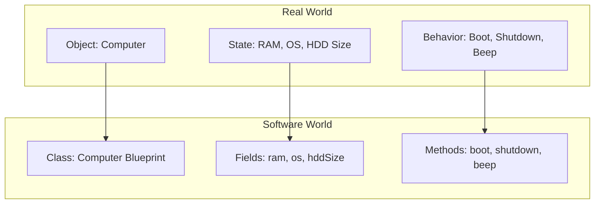
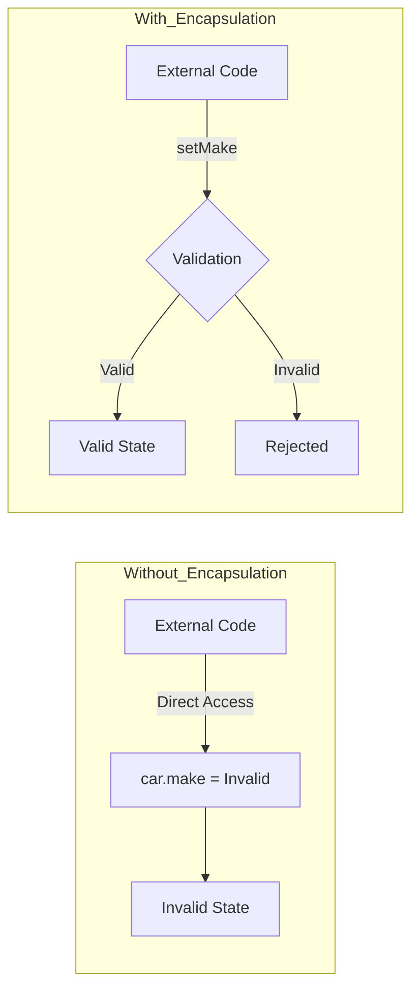
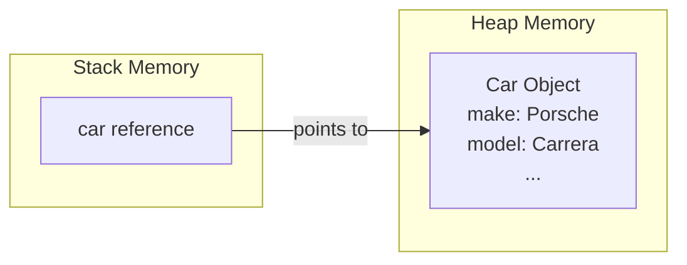
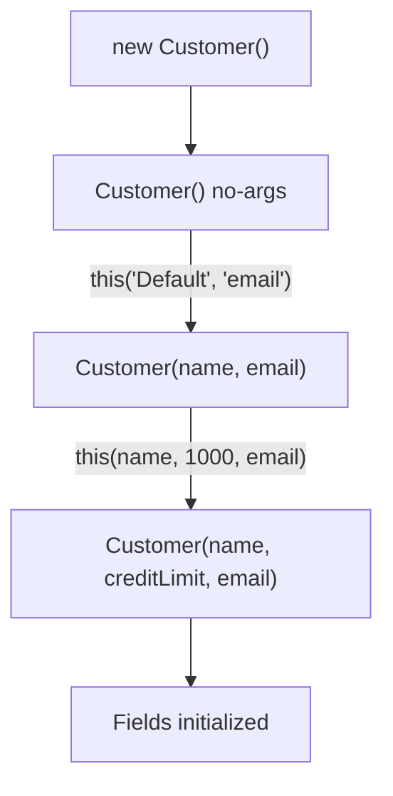
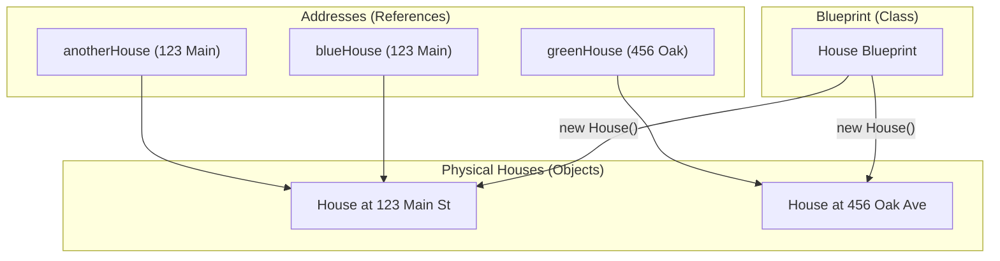
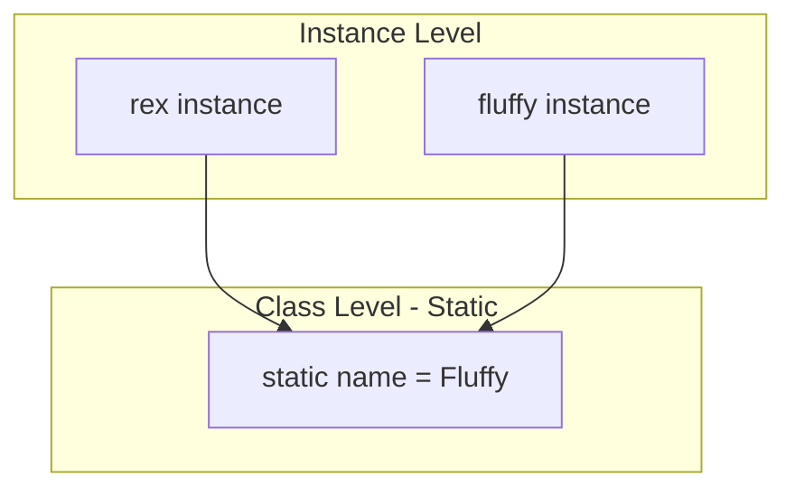
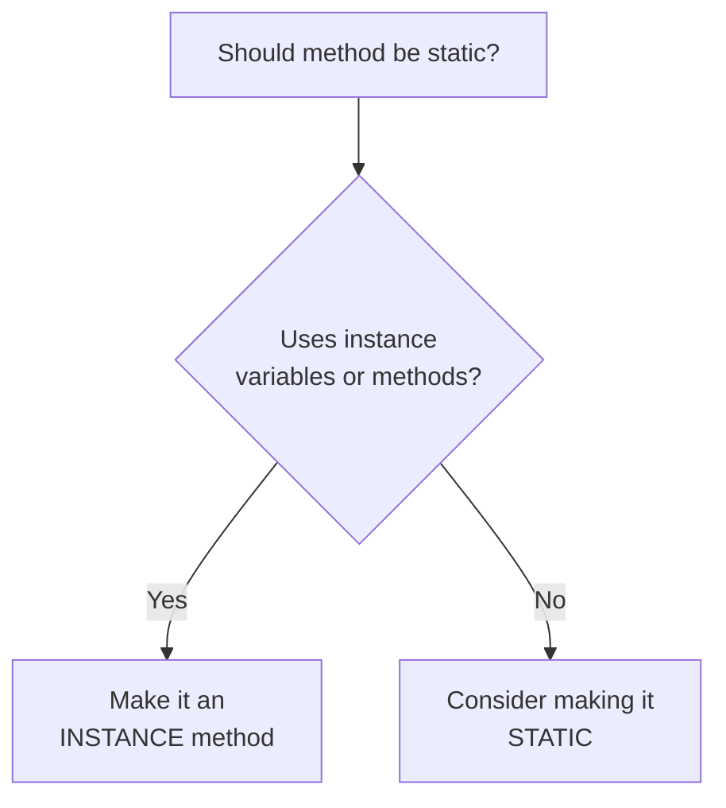

# :material-pencil: Topic Note Part 1: Classes, Objects & Encapsulation

> **Course:** Java Programming Masterclass - Tim Buchalka (Udemy)  
> **Section:** 07. Mastering Java OOP Classes & Inheritance  
> **Status:** :material-check-circle: Complete

---

## :material-target: Learning Objectives

- [x] Understand the fundamentals of Object-Oriented Programming (OOP)
- [x] Master class creation with fields, methods, and access modifiers
- [x] Implement encapsulation using getters and setters
- [x] Learn to create and instantiate objects using the `new` keyword
- [x] Understand constructors: default, parameterized, overloading, and chaining
- [x] Distinguish between references, objects, and instances
- [x] Compare static vs instance members (variables and methods)
- [x] Work with POJOs (Plain Old Java Objects) and Java Records

---

## :material-head-cog: Core Concepts

### What is Object-Oriented Programming?

**Object-Oriented Programming (OOP)** is a programming paradigm that models real-world entities as software objects containing both **data** (state) and **code** (behavior).



| Real-World Concept | Java Equivalent |
|--------------------|-----------------|
| Object characteristics | Fields (variables/attributes) |
| Object actions | Methods |
| Blueprint/Template | Class |

!!! info "Key Insight"
    A **class** is not a data type in the traditional sense—it's a **blueprint** or **template** for creating objects. Think of it as a powerful, user-defined data type.

---

## :material-book-open-variant: Classes in Java

### Anatomy of a Class

A class is declared using the `class` keyword and contains **members** (fields and methods).

```java
public class Car {
    // Fields (instance variables) - represent STATE
    private String make;
    private String model;
    private String color;
    private int doors;
    private boolean convertible;
    
    // Methods - represent BEHAVIOR
    public void describeCar() {
        System.out.println(doors + "-door " + color + " " + make + " " + model);
    }
}
```

### Access Modifiers

Java provides four access levels for controlling visibility of class members:

| Modifier | Class | Package | Subclass | World |
|----------|:-----:|:-------:|:--------:|:-----:|
| `public` | ✅ | ✅ | ✅ | ✅ |
| `protected` | ✅ | ✅ | ✅ | ❌ |
| *no modifier* (package-private) | ✅ | ✅ | ❌ | ❌ |
| `private` | ✅ | ❌ | ❌ | ❌ |

!!! warning "Best Practice"
    **Always make fields `private`** unless you have a compelling reason not to. This is the foundation of encapsulation.

#### For Top-Level Classes

A top-level class (defined in its own source file) can only have:

- `public` - accessible from anywhere
- *no modifier* (package-private) - accessible only within the same package

---

## :material-shield-lock: Encapsulation

### What is Encapsulation?

Encapsulation has **two meanings** in OOP:

1. **Bundling** of data (fields) and behavior (methods) into a single unit (class)
2. **Information hiding** - restricting direct access to internal state

### Why Encapsulate?



### Getters and Setters

**Getters** retrieve field values; **Setters** modify them with optional validation.

```java
public class Car {
    private String make = "Tesla";
    
    // GETTER - retrieves the value
    public String getMake() {
        return make;
    }
    
    // SETTER - sets the value with validation
    public void setMake(String make) {
        if (make == null) {
            this.make = "Unknown";
            return;
        }
        
        String lowerCaseMake = make.toLowerCase();
        switch (lowerCaseMake) {
            case "holden", "porsche", "tesla" -> this.make = make;
            default -> this.make = "Unsupported";
        }
    }
}
```

#### Naming Conventions

| Field Type | Getter Name | Setter Name |
|------------|-------------|-------------|
| `String name` | `getName()` | `setName(String name)` |
| `int age` | `getAge()` | `setAge(int age)` |
| `boolean active` | `isActive()` | `setActive(boolean active)` |

!!! tip "The `this` Keyword"
    When a parameter name matches a field name, use `this.fieldName` to refer to the instance field:
    ```java
    public void setMake(String make) {
        this.make = make;  // this.make = field, make = parameter
    }
    ```

---

## :material-cube-outline: Creating Objects

### The `new` Keyword

Objects are created (instantiated) using the `new` keyword:

```java
// Declaration and instantiation
Car car = new Car();

// Using the object
car.setMake("Porsche");
car.setModel("Carrera");
car.describeCar();  // Output: 2-door Gray Porsche Carrera
```

### What Happens in Memory?



### Default Field Values

Unlike local variables, **class fields** are automatically initialized with default values:

| Type | Default Value |
|------|---------------|
| `byte`, `short`, `int`, `long` | `0` |
| `float`, `double` | `0.0` |
| `char` | `'\u0000'` (null character) |
| `boolean` | `false` |
| Reference types (`String`, objects) | `null` |

!!! danger "null vs. Uninitialized"
    - **Uninitialized variable**: Compile-time error when accessed
    - **null reference**: Compiles but throws `NullPointerException` at runtime
    
    ```java
    Car car;          // Uninitialized - compiler error if used
    Car car = null;   // Null - compiles but NPE if methods called
    Car car = new Car(); // ✅ Properly initialized
    ```

---

## :material-hammer-wrench: Constructors

### What is a Constructor?

A **constructor** is a special code block that initializes an object when it's created. It:

- Has the **same name** as the class
- Has **no return type** (not even `void`)
- Is called automatically when `new` is used

```java
public class Account {
    private String number;
    private double balance;
    
    // Constructor
    public Account(String number, double balance) {
        this.number = number;
        this.balance = balance;
    }
}

// Usage
Account bobsAccount = new Account("12345", 1000.00);
```

### The Default Constructor

If you don't declare any constructor, Java provides an **implicit default (no-args) constructor**:

```java
// This is implicitly added if no constructor exists:
public Account() {
}
```

!!! warning "Critical Rule"
    **If you declare ANY constructor, Java will NOT create the default constructor for you.** You must explicitly declare it if needed.
    
    ```java
    public class Account {
        public Account(String number) { }  // Only this exists
    }
    
    Account a = new Account();  // ❌ Compile error! No no-args constructor
    ```

### Constructor Overloading

Like methods, constructors can be **overloaded** with different parameter lists:

```java
public class Customer {
    private String name;
    private double creditLimit;
    private String email;
    
    // Constructor 1: All fields
    public Customer(String name, double creditLimit, String email) {
        this.name = name;
        this.creditLimit = creditLimit;
        this.email = email;
    }
    
    // Constructor 2: Name and email only (default credit limit)
    public Customer(String name, String email) {
        this(name, 1000.00, email);  // Calls Constructor 1
    }
    
    // Constructor 3: No args (all defaults)
    public Customer() {
        this("Default name", "nobody@email.com");  // Calls Constructor 2
    }
}
```

### Constructor Chaining with `this()`

The `this()` call invokes another constructor in the same class:



!!! danger "Critical Rule"
    `this()` **MUST be the first statement** in the constructor body:
    ```java
    public Customer() {
        System.out.println("Hello");  // ❌ Compile error!
        this("Default", "email");
    }
    ```

!!! tip "Best Practice: Single Point of Initialization"
    Put all field initialization logic in **one main constructor** and have others delegate to it. This avoids code duplication and ensures consistency.

### Direct Field Assignment vs. Calling Setters

In constructors, prefer **direct field assignment** over calling setters:

```java
// ✅ Recommended
public Account(String number) {
    this.number = number;
}

// ⚠️ Can cause issues with inheritance (covered later)
public Account(String number) {
    setNumber(number);
}
```

---

## :material-link-variant: References, Objects, and Instances

### Understanding the Terminology

| Term | Definition |
|------|------------|
| **Class** | Blueprint/template for creating objects |
| **Object** | An instance of a class in memory |
| **Instance** | Synonym for object |
| **Reference** | A variable that "points to" an object in memory |

### The House Analogy



### Multiple References to Same Object

```java
House blueHouse = new House("blue");
House anotherHouse = blueHouse;  // Same object, new reference

anotherHouse.setColor("yellow");

System.out.println(blueHouse.getColor());    // "yellow"
System.out.println(anotherHouse.getColor()); // "yellow"
// Both print "yellow" - they reference the SAME object!
```

!!! info "Key Insight"
    When you assign one reference to another, you're copying the **address**, not the object. Both variables now point to the same object in memory.

### Dereferencing and Garbage Collection

```java
// Object created with no reference - immediately eligible for GC
new House("red");  // Cannot access this object!

// Object with reference
House myHouse = new House("beige");

// Creating new object and reassigning reference
House anotherRed = new House("red");
myHouse = anotherRed;  // Beige house is now eligible for GC
```

---

## :material-toggle-switch: Static vs. Instance Members

### Static Variables

A **static variable** is shared by ALL instances of a class:

```java
public class Dog {
    private static String name;  // Shared by all dogs!
    
    public Dog(String name) {
        Dog.name = name;
    }
    
    public void printName() {
        System.out.println(name);
    }
}

// Usage
Dog rex = new Dog("Rex");
Dog fluffy = new Dog("Fluffy");

rex.printName();    // "Fluffy" - not "Rex"!
fluffy.printName(); // "Fluffy"
// Both print "Fluffy" because static variable is shared
```



#### When to Use Static Variables

| Use Case | Example |
|----------|---------|
| Counters | `private static int instanceCount;` |
| Unique ID generators | `private static long nextId;` |
| Constants | `public static final double PI = 3.14159;` |
| Shared resources | Database connections, loggers |

!!! tip "Access Convention"
    Always access static members using the **class name**, not an instance:
    ```java
    // ✅ Good - makes it clear this is static
    Math.PI
    
    // ⚠️ Works but misleading
    myMath.PI
    ```

### Instance Variables

**Instance variables** are unique to each object:

```java
public class Dog {
    private String name;  // Instance variable - unique per dog
    
    public Dog(String name) {
        this.name = name;
    }
}

Dog rex = new Dog("Rex");
Dog fluffy = new Dog("Fluffy");

rex.printName();    // "Rex"
fluffy.printName(); // "Fluffy"
```

### Static vs. Instance Methods

| Aspect | Static Method | Instance Method |
|--------|---------------|-----------------|
| Declaration | `public static void method()` | `public void method()` |
| Access instance fields? | ❌ No | ✅ Yes |
| Access static fields? | ✅ Yes | ✅ Yes |
| Requires object to call? | ❌ No | ✅ Yes |
| Can use `this`? | ❌ No | ✅ Yes |

```java
public class Calculator {
    // Static method - no instance needed
    public static int add(int a, int b) {
        return a + b;
    }
}

// Call without creating an object
int sum = Calculator.add(5, 3);
```

#### Decision Flowchart



---

## :material-database: POJOs and Java Records

### Plain Old Java Objects (POJOs)

A **POJO** is a class primarily used to store data with minimal behavior.

```java
public class Student {
    private String id;
    private String name;
    private String dateOfBirth;
    private String classList;
    
    // Constructor
    public Student(String id, String name, String dateOfBirth, String classList) {
        this.id = id;
        this.name = name;
        this.dateOfBirth = dateOfBirth;
        this.classList = classList;
    }
    
    // toString for printing
    @Override
    public String toString() {
        return "Student{" +
                "id='" + id + '\'' +
                ", name='" + name + '\'' +
                ", dateOfBirth='" + dateOfBirth + '\'' +
                ", classList='" + classList + '\'' +
                '}';
    }
    
    // Getters and setters for all fields...
}
```

#### Related Terms

| Term | Description |
|------|-------------|
| **POJO** | Plain Old Java Object - simple data class |
| **JavaBean** | POJO with specific rules (no-arg constructor, serializable) |
| **Entity** | POJO that mirrors a database table |
| **DTO** | Data Transfer Object - for moving data between layers |

### The `@Override` Annotation

The `@Override` annotation tells the compiler that a method is meant to override a method from a parent class:

```java
@Override
public String toString() {
    return "Student: " + name;
}
```

!!! info "toString() Method"
    Every class inherits a `toString()` method from `Object`. When you pass an object to `System.out.println()`, Java automatically calls its `toString()` method.

### Java Records (Java 16+)

**Records** are a modern, concise alternative to POJOs for immutable data:

```java
// Traditional POJO: ~60 lines of boilerplate
public class Student { ... }

// Record: 1 line!
public record LPAStudent(String id, String name, String dateOfBirth, String classList) { }
```

#### What Records Generate Automatically

For each component in the record header, Java creates:

| Generated | Description |
|-----------|-------------|
| `private final` field | Immutable storage |
| Public accessor method | Same name as field (e.g., `name()` not `getName()`) |
| `toString()` | Formatted output of all fields |
| `equals()` and `hashCode()` | Based on all fields |
| Constructor | With all parameters |

#### Using Records

```java
// Creating a record instance
LPAStudent student = new LPAStudent("S001", "Bill", "1985-11-05", "Java Masterclass");

// Accessor methods (no "get" prefix!)
System.out.println(student.name());       // "Bill"
System.out.println(student.classList());  // "Java Masterclass"

// Implicit toString()
System.out.println(student);  // LPAStudent[id=S001, name=Bill, ...]

// No setters - records are IMMUTABLE
student.setName("Bob");  // ❌ Compile error!
```

#### POJO vs Record

| Feature | POJO | Record |
|---------|------|--------|
| Mutability | Mutable (has setters) | **Immutable** (no setters) |
| Boilerplate | Lots of code | **Minimal** |
| Field access | `getXxx()` / `isXxx()` | `xxx()` (field name) |
| When to use | Need to modify data | **Read-only data transfer** |

!!! tip "When to Use Records"
    Use records when:
    - Data is read-only after creation
    - You're passing data between layers (DTOs)
    - You want to reduce boilerplate
    
    Use POJOs when:
    - You need to modify fields after creation
    - You need custom behavior in getters/setters
    - Framework requires JavaBean conventions

---

## :material-lightbulb-on: Key Insights & Best Practices

### Encapsulation Best Practices

1. **Always make fields `private`** - control access through methods
2. **Use getters for read access** - even if they just return the value
3. **Add validation in setters** - reject invalid data before it corrupts state
4. **Consider immutability** - use final fields and records when possible

### Constructor Best Practices

1. **Use constructor chaining** - centralize initialization in one constructor
2. **Don't call overridable methods** in constructors (more on this in inheritance)
3. **Assign directly to fields** rather than calling setters in constructors
4. **Validate parameters** - throw exceptions for invalid input

### Static vs. Instance Decision

| Scenario | Use |
|----------|-----|
| Method needs object state | Instance |
| Method is a utility/helper | Static |
| Counter shared across instances | Static |
| Each object has unique data | Instance |

---

## :material-pin: Quick Reference

### Class Declaration Template

```java
public class ClassName {
    // 1. Fields (instance variables)
    private Type fieldName;
    
    // 2. Constructors
    public ClassName() { }
    public ClassName(Type param) {
        this.fieldName = param;
    }
    
    // 3. Getters and Setters
    public Type getFieldName() { return fieldName; }
    public void setFieldName(Type fieldName) { this.fieldName = fieldName; }
    
    // 4. Other methods
    public void doSomething() { }
    
    // 5. toString (optional)
    @Override
    public String toString() { return "..."; }
}
```

### Record Declaration Template

```java
public record RecordName(Type field1, Type field2) {
    // Optional: Custom compact constructor for validation
    public RecordName {
        if (field1 == null) throw new IllegalArgumentException();
    }
    
    // Optional: Additional methods
    public String formatted() { return field1 + ": " + field2; }
}
```

---

## :material-help-circle: Questions Explored

- [x] What is a class and how does it relate to objects?
- [x] What is encapsulation and why is it important?
- [x] How do constructors work and what is constructor chaining?
- [x] What's the difference between a reference and an object?
- [x] When should I use static vs. instance members?
- [x] What are POJOs and when should I use Java Records?

---

## :material-navigation: Related Notes

| Part | Topic | Link |
|:----:|-------|------|
| 1 | Classes, Objects & Encapsulation | **You are here** |
| 2 | Inheritance & Method Overriding | [Part 2 →](topic-note-part2.md) |
| 3 | Strings & StringBuilder | [Part 3 →](topic-note-part3.md) |
| 4 | Composition | [Part 4 →](topic-note-part4.md) |
| 5 | Encapsulation (Advanced) | [Part 5 →](topic-note-part5.md) |
| 6 | Polymorphism | [Part 6 →](topic-note-part6.md) |

---

*Last Updated: 2026-01-26*
