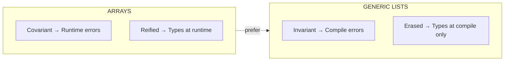
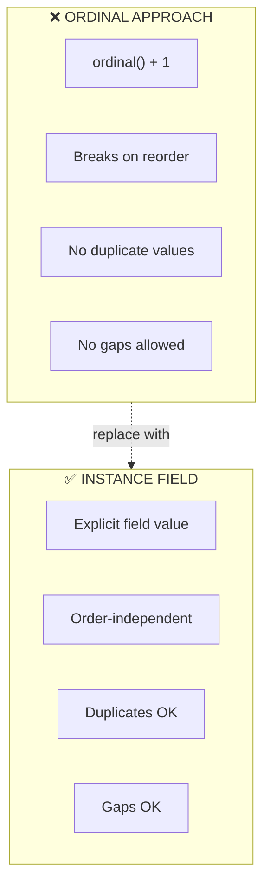
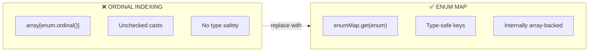
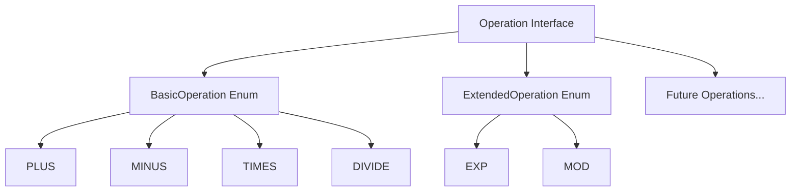
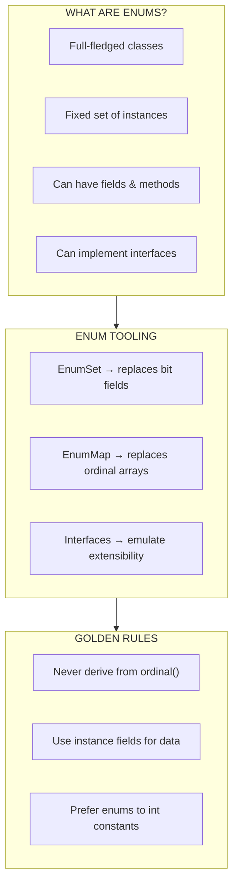
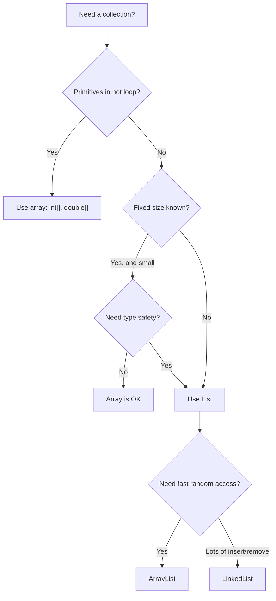

# :material-book-open-page-variant: Book Reading: Arrays, Lists & Autoboxing

> **Book:** Effective Java by Joshua Bloch (3rd Edition)  
> **Relevant Items:** 28 (Generics), 34–39 (Enums & Annotations)  
> **Status:** :material-check-circle: Complete

---

## :material-target: Reading Goals

- [x] Understand why lists are preferred over arrays for type safety
- [x] Master enum best practices (constants, instance fields, EnumSet, EnumMap)
- [x] Learn to avoid the `ordinal()` trap
- [x] Know when to use `EnumSet` and `EnumMap` over traditional approaches

---

## :material-book-open-variant: Chapter 5: Generics (Selected)

### Item 28: Prefer Lists to Arrays

#### Key Takeaways

Arrays and generics have fundamentally different type systems. Arrays are **covariant** (if `Sub` is a subtype of `Super`, then `Sub[]` is a subtype of `Super[]`), while generics are **invariant** (`List<Sub>` is NOT a subtype of `List<Super>`). This makes arrays less type-safe.

#### The Danger of Covariant Arrays

```java
// ❌ COMPILES but FAILS at runtime!
Object[] objectArray = new Long[1];
objectArray[0] = "I don't fit in here!"; // Throws ArrayStoreException at RUNTIME

// ✅ CAUGHT at compile time — much safer!
List<Object> ol = new ArrayList<Long>(); // Won't compile!
ol.add("I don't fit in here!");
```

!!! danger "Runtime vs Compile Time"

    With arrays, you discover type errors when your code is running in production. With lists, the compiler catches them before you even ship.

#### Arrays vs Lists Comparison

| Aspect              | Arrays                                  | Generic Lists                               |
| ------------------- | --------------------------------------- | ------------------------------------------- |
| Variance            | **Covariant** — `Sub[]` is `Super[]`    | **Invariant** — `List<Sub>` ≠ `List<Super>` |
| Type checking       | **Runtime** — `ArrayStoreException`     | **Compile time** — won't compile            |
| Reification         | **Reified** — types enforced at runtime | **Erased** — types removed at runtime       |
| Can hold primitives | ✅ `int[]` directly                     | ❌ Must use `Integer` (autoboxing)          |
| Mix with generics   | ❌ Can't create `new T[]`               | ✅ Designed for generics                    |



#### When Arrays Are Still OK

- **Performance-critical** inner loops with primitives (`int[]`, `double[]`)
- **Varargs** parameters (the language requires them)
- **Low-level** code where you control all access

#### Connection to Course Material

In **Part 1** we learned arrays and `java.util.Arrays`.

In **Part 2** we switched to `ArrayList` and saw how much more convenient and type-safe it is.

Bloch's Item 28 gives us the theoretical _why_ — lists catch type errors at compile time, arrays defer them to runtime.

---

## :material-book-open-variant: Chapter 6: Enums and Annotations

### Item 34: Use Enums Instead of int Constants

#### Key Takeaways

The **int enum pattern** (using `public static final int` for constants) is fragile, unreadable, and provides no type safety. Java enums are full-fledged classes that provide compile-time type safety, readability, and extensibility.

#### The Bad Old Way: int Constants

```java
// ❌ BAD: The int enum anti-pattern
public static final int APPLE_FUJI         = 0;
public static final int APPLE_PIPPIN       = 1;
public static final int APPLE_GRANNY_SMITH = 2;

public static final int ORANGE_NAVEL  = 0;
public static final int ORANGE_TEMPLE = 1;
public static final int ORANGE_BLOOD  = 2;

// No type safety! Nothing stops you from comparing apples to oranges:
if (APPLE_FUJI == ORANGE_NAVEL) { ... }  // Compiles! Both are 0!
```

| Problem            | Description                                          |
| ------------------ | ---------------------------------------------------- |
| **No type safety** | An `int` for apples can be compared to oranges       |
| **No namespace**   | Must prefix names to avoid collisions (`APPLE_FUJI`) |
| **Brittle**        | Changing the value requires recompilation            |
| **No iteration**   | Can't iterate over all values                        |
| **Not printable**  | `System.out.println(0)` — meaningless                |

#### The Enum Solution

```java
// ✅ GOOD: Real enums!
public enum Apple  { FUJI, PIPPIN, GRANNY_SMITH }
public enum Orange { NAVEL, TEMPLE, BLOOD }

// Compile error! Can't compare different enum types!
if (Apple.FUJI == Orange.NAVEL) { ... }  // Won't compile!
```

#### Enums Are Classes

Bloch emphasizes that Java enums are far more powerful than enums in other languages — they are full classes that can have fields, methods, and implement interfaces:

```java
public enum Planet {
    MERCURY(3.302e+23, 2.439e6),
    VENUS  (4.869e+24, 6.052e6),
    EARTH  (5.975e+24, 6.378e6);
    // ... more planets

    private final double mass;           // In kilograms
    private final double radius;         // In meters
    private final double surfaceGravity; // Computed

    Planet(double mass, double radius) {
        this.mass = mass;
        this.radius = radius;
        this.surfaceGravity = G * mass / (radius * radius);
    }

    public double surfaceWeight(double mass) {
        return mass * surfaceGravity;
    }
}
```

!!! success "Connection to Our Code"

    - Our `Topping` enum from Part 4 follows this exact pattern

    - adding a `getPrice()` method with instance-specific behavior via switch expressions.

---

### Item 35: Use Instance Fields Instead of Ordinals

#### Key Takeaways

Every enum has an `ordinal()` method that returns its position (0-based). **Never derive a value from the ordinal** — use instance fields instead.

#### The Temptation

```java
// ❌ BAD: Deriving values from ordinal position
public enum Ensemble {
    SOLO, DUET, TRIO, QUARTET, QUINTET,
    SEXTET, SEPTET, OCTET, NONET, DECTET;

    public int numberOfMusicians() {
        return ordinal() + 1;  // Fragile! Tied to declaration order!
    }
}
```

**Problems:**

- Reordering constants **breaks** the method
- Can't have two constants with the same int value (e.g., `DOUBLE_QUARTET` = 8, same as `OCTET`)
- Can't skip values (e.g., no ensemble of size 12 without filling gaps)

#### The Fix: Instance Fields

```java
// ✅ GOOD: Use instance fields
public enum Ensemble {
    SOLO(1), DUET(2), TRIO(3), QUARTET(4), QUINTET(5),
    SEXTET(6), SEPTET(7), OCTET(8), DOUBLE_QUARTET(8),
    NONET(9), DECTET(10), TRIPLE_QUARTET(12);

    private final int numberOfMusicians;

    Ensemble(int size) { this.numberOfMusicians = size; }

    public int numberOfMusicians() { return numberOfMusicians; }
}
```



!!! warning "Connection to Our Code"

    In Part 4 we demonstrated `ordinal()` with `DayOfTheWeek`. While it's _useful to know about_, Bloch warns: **never use `ordinal()` to derive associated data**. Our `Topping` enum already follows the correct pattern

    - it uses a switch expression in `getPrice()` rather than ordinal math.

---

### Item 36: Use EnumSet Instead of Bit Fields

#### Key Takeaways

Before enums, developers used **bit fields** to represent sets of constants. `EnumSet` is the modern, type-safe replacement that's just as fast.

#### The Old Way: Bit Fields

```java
// ❌ BAD: Bit field constants
public class Text {
    public static final int STYLE_BOLD          = 1 << 0; // 1
    public static final int STYLE_ITALIC        = 1 << 1; // 2
    public static final int STYLE_UNDERLINE     = 1 << 2; // 4
    public static final int STYLE_STRIKETHROUGH = 1 << 3; // 8

    // Apply styles using bitwise OR
    public void applyStyles(int styles) { ... }
}

// Usage - cryptic!
text.applyStyles(STYLE_BOLD | STYLE_ITALIC);
```

#### The Modern Way: EnumSet

```java
// ✅ GOOD: EnumSet
public class Text {
    public enum Style { BOLD, ITALIC, UNDERLINE, STRIKETHROUGH }

    // Accept Set<Style> — backed by EnumSet internally
    public void applyStyles(Set<Style> styles) { ... }
}

// Usage - readable and type-safe!
text.applyStyles(EnumSet.of(Style.BOLD, Style.ITALIC));
```

#### Why EnumSet Wins

| Aspect      | Bit Fields                 | EnumSet                              |
| ----------- | -------------------------- | ------------------------------------ |
| Type safety | ❌ Just `int`              | ✅ Compile-time checked              |
| Readability | ❌ `1 << 3` means what?    | ✅ `Style.STRIKETHROUGH`             |
| Iteration   | ❌ Manual bit manipulation | ✅ Standard `for-each`               |
| Performance | ✅ Single `long`           | ✅ Also single `long` (≤64 elements) |
| Printing    | ❌ Just a number           | ✅ Meaningful names                  |

!!! info "Internal Implementation"

    - For enums with ≤64 constants, `EnumSet` is backed by a single `long`

    - it uses bit manipulation internally, so you get the same performance as bit fields with all the benefits of enums.

---

### Item 37: Use EnumMap Instead of Ordinal Indexing

#### Key Takeaways

When you need to map data by enum values, use `EnumMap` instead of indexing an array by `ordinal()`. It's faster, safer, and clearer.

#### The Bad Way: Ordinal Indexing

```java
// ❌ BAD: Array indexed by ordinal
public class Plant {
    enum LifeCycle { ANNUAL, PERENNIAL, BIENNIAL }

    final LifeCycle lifeCycle;

    // Grouping plants by lifecycle using ordinal
    Set<Plant>[] plantsByLifeCycle =
        (Set<Plant>[]) new Set[LifeCycle.values().length];

    for (int i = 0; i < plantsByLifeCycle.length; i++)
        plantsByLifeCycle[i] = new HashSet<>();

    for (Plant p : garden)
        plantsByLifeCycle[p.lifeCycle.ordinal()].add(p);  // ordinal = fragile!
}
```

**Problems**: Unchecked cast, no type safety on the index, `ArrayIndexOutOfBoundsException` risk, requires manual labeling for output.

#### The Good Way: EnumMap

```java
// ✅ GOOD: EnumMap — type-safe, fast, readable
Map<LifeCycle, Set<Plant>> plantsByLifeCycle =
    new EnumMap<>(LifeCycle.class);

for (LifeCycle lc : LifeCycle.values())
    plantsByLifeCycle.put(lc, new HashSet<>());

for (Plant p : garden)
    plantsByLifeCycle.get(p.lifeCycle).add(p);

// Even better with streams (Java 8+):
Map<LifeCycle, List<Plant>> plantsByLifeCycle = garden.stream()
    .collect(groupingBy(p -> p.lifeCycle,
        () -> new EnumMap<>(LifeCycle.class), toList()));
```



!!! info "Performance"

    `EnumMap` is internally backed by an array, so it matches the performance of ordinal indexing while being type-safe. It's essentially a compiler-checked version of ordinal indexing.

---

### Item 38: Emulate Extensible Enums with Interfaces

#### Key Takeaways

Enums cannot extend other enums — this is by design, because enum inheritance would break the guarantee that you can enumerate all constants. However, you can make enums implement **interfaces** to achieve a form of extensibility.

#### The Pattern: Operation Interface

```java
// Interface defines the contract
public interface Operation {
    double apply(double x, double y);
}

// Basic operations — one enum
public enum BasicOperation implements Operation {
    PLUS("+")  { public double apply(double x, double y) { return x + y; } },
    MINUS("-") { public double apply(double x, double y) { return x - y; } },
    TIMES("*") { public double apply(double x, double y) { return x * y; } },
    DIVIDE("/"){ public double apply(double x, double y) { return x / y; } };

    private final String symbol;
    BasicOperation(String symbol) { this.symbol = symbol; }
    @Override public String toString() { return symbol; }
}

// Extended operations — another enum implementing the same interface!
public enum ExtendedOperation implements Operation {
    EXP("^")  { public double apply(double x, double y) { return Math.pow(x, y); } },
    MOD("%")  { public double apply(double x, double y) { return x % y; } };

    private final String symbol;
    ExtendedOperation(String symbol) { this.symbol = symbol; }
    @Override public String toString() { return symbol; }
}
```

#### Using the Pattern

```java
// Works with ANY Operation implementation!
private static <T extends Enum<T> & Operation> void test(
        Class<T> opEnumType, double x, double y) {
    for (Operation op : opEnumType.getEnumConstants())
        System.out.printf("%f %s %f = %f%n", x, op, y, op.apply(x, y));
}

test(BasicOperation.class, 3, 2);
test(ExtendedOperation.class, 3, 2);  // Seamlessly extended!
```



!!! tip "When to Use"

    - Use this pattern when you need a fixed set of operations that **clients might want to extend** — such as calculation engines, command patterns, or plugin systems.

---

### Item 39: Prefer Annotations to Naming Patterns

#### Key Takeaways

Before annotations, frameworks relied on **naming conventions** to identify special methods (e.g., JUnit 3 required test methods to start with `test`). Annotations are superior because the compiler can enforce them.

#### Naming Patterns Were Fragile

```java
// ❌ BAD: JUnit 3 naming pattern
public class MyTest {
    // Oops! "tset" instead of "test" — silently ignored, no error!
    public void tsetSafetyOverride() {
        // This test NEVER runs, and you don't even know it!
    }
}
```

#### Annotations Are Enforced

```java
// ✅ GOOD: JUnit 4+ annotations
public class MyTest {
    @Test  // Clear intent, compiler-checked
    public void safetyOverride() {
        // Will definitely run!
    }

    @Test(expected = ArithmeticException.class)
    public void divisionByZero() {
        int result = 1 / 0;
    }
}
```

| Aspect            | Naming Patterns   | Annotations                       |
| ----------------- | ----------------- | --------------------------------- |
| Typo detection    | ❌ Silent failure | ✅ Compile error                  |
| Parameter support | ❌ No             | ✅ Yes (`expected`, `timeout`)    |
| Scope control     | ❌ Limited        | ✅ Methods, classes, fields, etc. |
| IDE support       | ❌ Minimal        | ✅ Auto-complete, warnings        |

!!! note "The Bigger Picture"

    - While we haven't written custom annotations yet, this item teaches an important principle: **prefer compiler-enforced contracts** over convention-based ones. This mindset applies beyond annotations

    - it's why enums beat int constants (Item 34) and generics beat casts.

---

## :material-head-cog: Theoretical Framework

### Mental Model for Enums in Java



### Arrays vs Lists Decision Tree



---

## :material-thought-bubble: Reflections & Connections

### Connections to Course Material

| Effective Java                           | Tim's Course (Topic 3)                                     |
| ---------------------------------------- | ---------------------------------------------------------- |
| Item 28: Lists > Arrays                  | Part 1 → Part 2 transition showed this in practice         |
| Item 34: Enums > int constants           | Part 4: `DayOfTheWeek` enum vs raw int days                |
| Item 35: Instance fields > ordinals      | Part 4: `Topping.getPrice()` uses switch, not ordinal math |
| Item 36: EnumSet > bit fields            | New concept — extends Part 4's enum knowledge              |
| Item 37: EnumMap > ordinal indexing      | New concept — type-safe enum-keyed maps                    |
| Item 38: Extensible enums via interfaces | New concept — combines enums with interfaces               |

### New Perspectives Gained

1. **Arrays are covariant** — this is Java's design mistake that generics corrected with invariance
2. **Enums are classes** — not just named integers; they can have fields, methods, and constructors
3. **`ordinal()` is a trap** — it exists for internal use by `EnumSet` and `EnumMap`, not for application code
4. **EnumSet is magic** — it combines the readability of enums with the performance of bit manipulation
5. **Extensible enums via interfaces** — elegant workaround for enum's single-inheritance limitation

---

## :material-format-list-checks: Summary Points

1. **Lists over Arrays**: Prefer `List<T>` to `T[]` — you get compile-time type safety instead of runtime `ArrayStoreException`
2. **Enums over int constants**: Enums provide type safety, namespace, iteration, printing, and extensibility
3. **Instance fields over ordinals**: Never use `ordinal()` to derive data — add explicit fields to your enums
4. **EnumSet over bit fields**: Same performance, much better readability and type safety
5. **EnumMap over ordinal arrays**: Internally array-backed but compiler-checked — best of both worlds
6. **Interfaces for extensibility**: When enums need to be "extended", define a common interface
7. **Annotations over naming**: Prefer compiler-enforced contracts to convention-based ones

---

## :material-pin: Bookmarks & Page References

| Topic                      | Item    | Key Insight                                                                    |
| -------------------------- | ------- | ------------------------------------------------------------------------------ |
| Lists > Arrays             | Item 28 | Arrays are covariant (runtime errors), generics are invariant (compile errors) |
| Enums > int constants      | Item 34 | Enums are full classes with type safety and iteration                          |
| Instance fields > ordinals | Item 35 | `ordinal()` is fragile — always use explicit fields                            |
| EnumSet > bit fields       | Item 36 | Single `long` internally, readable `EnumSet.of()` externally                   |
| EnumMap > ordinal arrays   | Item 37 | Type-safe, array-backed, no unchecked casts                                    |
| Extensible enums           | Item 38 | Implement interface to share behavior across enum types                        |
| Annotations > naming       | Item 39 | Compiler catches typos that naming conventions miss                            |

---

_Last Updated: 2026-02-11_
