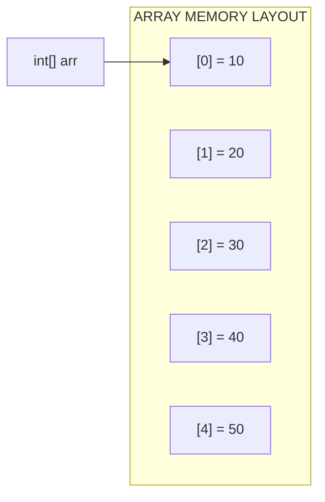
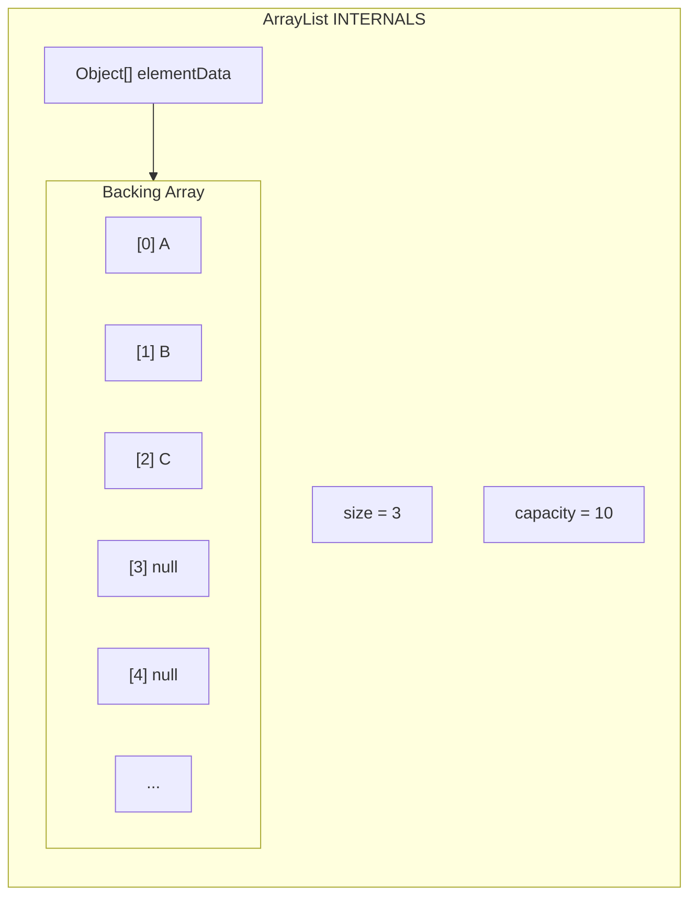
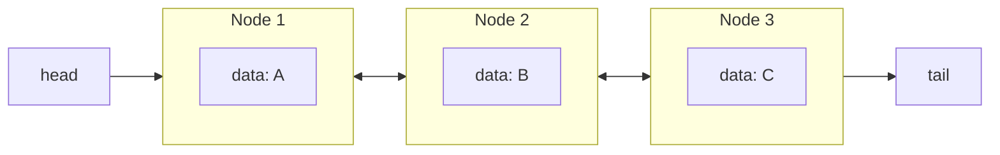
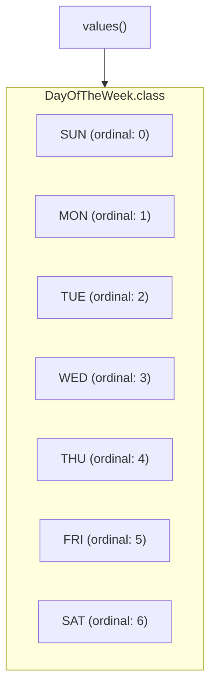
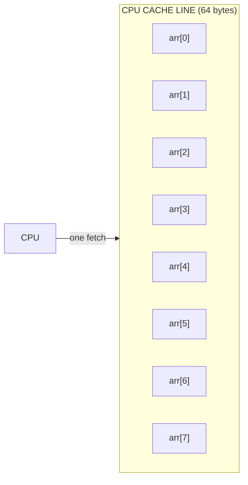
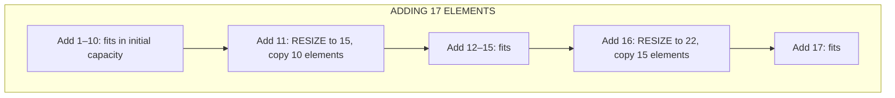
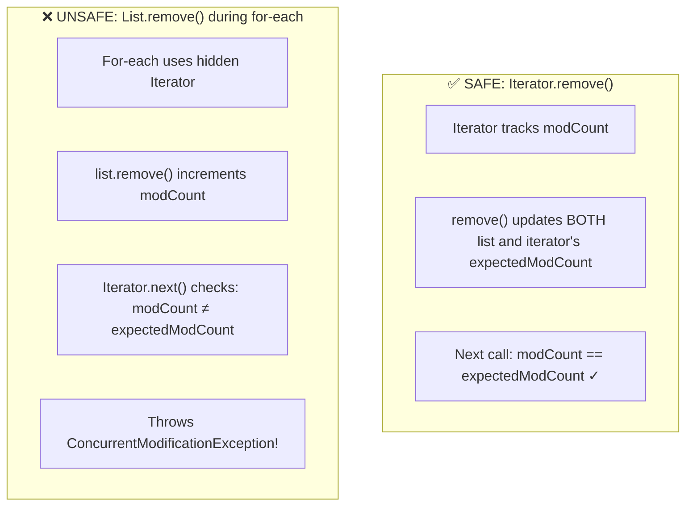
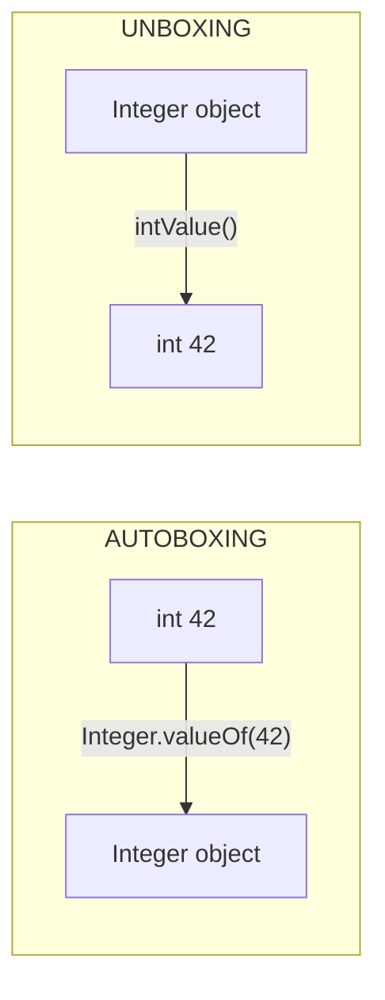
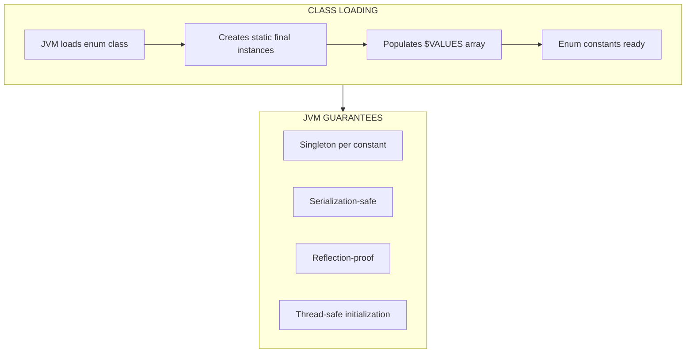
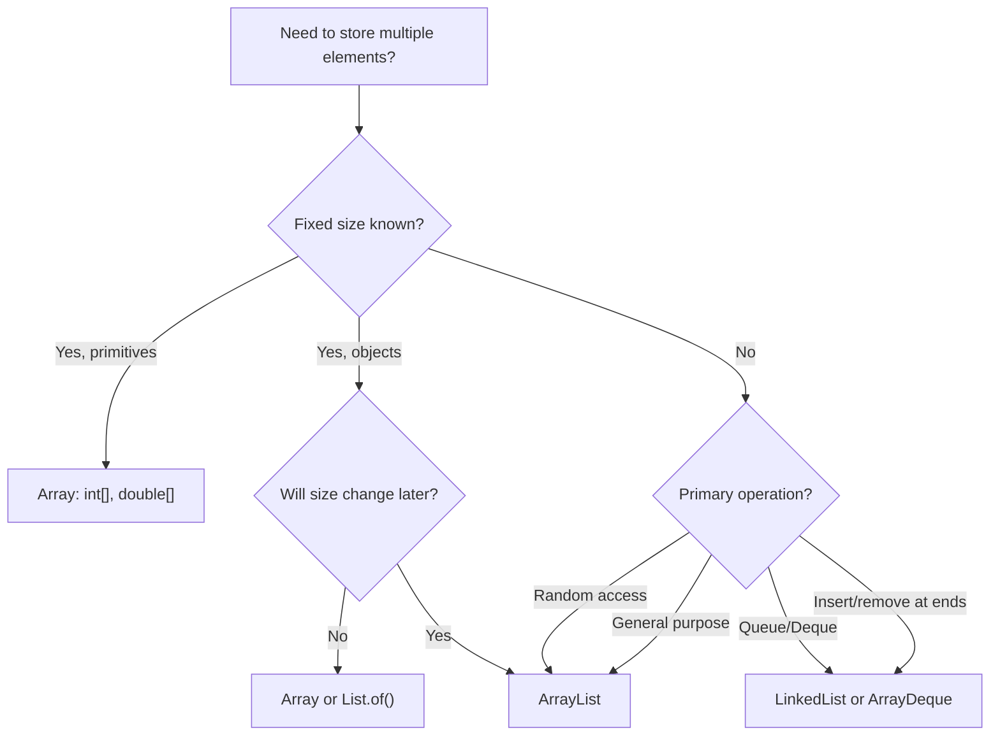

# :material-school: Summary: Arrays, Lists & Autoboxing

> **Combined Knowledge from:** Tim Buchalka's Course + Effective Java  
> **Mastery Level:** :material-star::material-star::material-star::material-star::material-star:

---

## :material-star-shooting: Topic Overview

A deep understanding of Java's core data structures — from fixed-size arrays to resizable lists, the iteration patterns that traverse them, and the autoboxing mechanism that bridges primitive and object worlds. This summary covers both the **how** (practical usage) and the **why** (memory layout, performance, JVM internals).

---

## :material-key: The Four Data Structures

### 1. Arrays

**Definition:** A fixed-size, contiguous block of memory holding elements of the same type. The most fundamental data structure in Java.



#### Key Properties

| Property | Detail |
|----------|--------|
| Size | **Fixed** at creation — cannot grow or shrink |
| Memory | **Contiguous** — elements stored side-by-side |
| Access | **O(1)** random access via index |
| Type | Can hold primitives (`int[]`) or objects (`String[]`) |
| Covariant | `Sub[]` is a subtype of `Super[]` — _a design flaw_ (Item 28) |

#### Essential Operations & Big O

| Operation | Big O | Notes |
|-----------|-------|-------|
| Access by index | **O(1)** | Direct memory offset calculation |
| Search (unsorted) | **O(n)** | Linear scan required |
| Search (sorted) | **O(log n)** | `Arrays.binarySearch()` |
| Insert/Delete | **O(n)** | Must shift elements |
| Sort | **O(n log n)** | `Arrays.sort()` — Dual-Pivot Quicksort for primitives, TimSort for objects |

#### java.util.Arrays Utilities

```java
int[] arr = {5, 3, 1, 4, 2};

Arrays.sort(arr);                    // [1, 2, 3, 4, 5]
Arrays.fill(arr, 0);                 // [0, 0, 0, 0, 0]
int[] copy = Arrays.copyOf(arr, 10); // Copy with new length
String s = Arrays.toString(arr);     // "[0, 0, 0, 0, 0]"
boolean eq = Arrays.equals(a, b);    // Deep value comparison
```

---

### 2. ArrayList

**Definition:** A resizable array implementation of the `List` interface. Internally backed by an `Object[]` that grows automatically.



#### Key Properties

| Property | Detail |
|----------|--------|
| Size | **Dynamic** — grows automatically (by ~50%) |
| Memory | Contiguous backing array + overhead for bookkeeping |
| Access | **O(1)** random access (like arrays) |
| Insertion | **O(1)** amortized at end, **O(n)** at arbitrary position |
| Deletion | **O(n)** — must shift elements to fill gap |

#### Growth Strategy

When the backing array is full:
1. Allocate new array with `newCapacity = oldCapacity + (oldCapacity >> 1)` (~50% growth)
2. Copy all elements to the new array — `Arrays.copyOf()`
3. Old array becomes eligible for garbage collection

```java
List<String> list = new ArrayList<>();  // Default capacity: 10
// After adding 11th element: capacity grows to 15
// After adding 16th element: capacity grows to 22
```

#### CRUD Quick Reference

```java
List<String> items = new ArrayList<>(List.of("A", "B", "C"));

// CREATE
items.add("D");              // Append
items.add(1, "X");           // Insert at index 1

// READ
String first = items.get(0); // By index O(1)
int idx = items.indexOf("B");// By value O(n)

// UPDATE
items.set(0, "Z");           // Replace at index

// DELETE
items.remove(0);             // By index
items.remove("B");           // By value (first occurrence)
```

---

### 3. LinkedList

**Definition:** A doubly-linked list where each node holds a value and pointers to the previous and next nodes. Also implements `Queue`, `Deque`, and can be used as a `Stack`.



#### Key Properties

| Property | Detail |
|----------|--------|
| Size | **Dynamic** — grows node-by-node |
| Memory | **Non-contiguous** — each node is a separate heap object |
| Access | **O(n)** — must traverse from head or tail |
| Insert/Delete at ends | **O(1)** — just rewire pointers |
| Insert/Delete at middle | **O(n)** — must traverse to position first |

#### ArrayList vs LinkedList

| Operation | ArrayList | LinkedList | Winner |
|-----------|-----------|------------|--------|
| `get(i)` | **O(1)** | O(n) | ArrayList |
| `add(end)` | **O(1)** amortized | **O(1)** | Tie |
| `add(0, e)` | O(n) shift | **O(1)** | LinkedList |
| `remove(0)` | O(n) shift | **O(1)** | LinkedList |
| Memory per element | ~4 bytes (ref) | ~24 bytes (node) | ArrayList |
| Cache friendliness | **Excellent** | Poor | ArrayList |
| Iterator remove | O(n) shift | **O(1)** | LinkedList |

> **Rule of thumb:** Use `ArrayList` by default. Use `LinkedList` only when you need frequent insertions/removals at both ends (Queue/Deque pattern) or safe removal during iteration.

#### Multi-Interface Usage

```java
LinkedList<String> ll = new LinkedList<>();

// As List
ll.add("A"); ll.get(0);

// As Queue (FIFO)
ll.offer("B"); ll.poll();     // Add to tail, remove from head

// As Deque (double-ended)
ll.offerFirst("C"); ll.offerLast("D");
ll.pollFirst(); ll.pollLast();

// As Stack (LIFO)
ll.push("E"); ll.pop();       // Add/remove from head
```

---

### 4. Enums

**Definition:** A special class type that defines a fixed set of named constants. Each constant is a `public static final` instance of the enum class.



#### What Enums Really Are

Under the hood, `enum DayOfTheWeek { SUN, MON, ... }` compiles to:

```java
public final class DayOfTheWeek extends Enum<DayOfTheWeek> {
    public static final DayOfTheWeek SUN = new DayOfTheWeek("SUN", 0);
    public static final DayOfTheWeek MON = new DayOfTheWeek("MON", 1);
    // ...
    
    private DayOfTheWeek(String name, int ordinal) {
        super(name, ordinal);
    }
    
    public static DayOfTheWeek[] values() { ... }
    public static DayOfTheWeek valueOf(String name) { ... }
}
```

#### Enum Capabilities

| Feature | Example |
|---------|---------|
| Built-in methods | `name()`, `ordinal()`, `values()`, `valueOf()` |
| Switch support | `switch(day) { case MON -> ... }` |
| Custom fields | `BACON(1.50)` — constructor with args |
| Custom methods | `getPrice()` — behavior per constant |
| Implement interfaces | `enum Op implements Calculable { ... }` |

#### Golden Rules (from Effective Java)

1. **Use enums instead of `int` constants** (Item 34) — type safety, readability, iteration
2. **Never derive data from `ordinal()`** (Item 35) — use instance fields instead
3. **Use `EnumSet` for sets of enums** (Item 36) — replaces bit fields, same performance
4. **Use `EnumMap` for enum-keyed maps** (Item 37) — type-safe, array-backed internally

---

## :material-head-cog: Key Internals to Understand

### 1. Array Memory Layout & Cache Performance

Arrays store elements in a **contiguous block** of memory. This is critical for performance because of CPU cache behavior.



When you access `arr[0]`, the CPU fetches an entire **cache line** (~64 bytes). For `int[]`, that's ~16 consecutive elements loaded at once. Sequential reads become almost free.

**LinkedList nodes**, by contrast, are scattered across the heap. Each node access may cause a **cache miss**, requiring a separate memory fetch.

| Data Structure | Cache Behavior | Sequential Read Speed |
|---------------|---------------|----------------------|
| `int[]` | Excellent — contiguous | ~1 ns/element |
| `ArrayList` | Good — contiguous backing array | ~2–3 ns/element |
| `LinkedList` | Poor — scattered nodes | ~5–10 ns/element |

---

### 2. ArrayList Resizing: Amortized O(1)

When ArrayList's backing array is full, it creates a new one ~50% larger and copies everything. This copy is **O(n)**, but happens infrequently enough to be **amortized O(1)**.



**Amortized analysis:** Over _n_ insertions, total copy cost ≈ n + n/2 + n/4 + ... ≈ 2n. Divided by n insertions = **O(1) per insertion** on average.

!!! tip "Performance Tip"
    If you know the final size, use `new ArrayList<>(expectedSize)` to avoid all resizing overhead.

---

### 3. ConcurrentModificationException & Iterator Safety

The `modCount` mechanism is Java's fast-fail protection against structural modification during iteration.



```java
// ❌ THROWS ConcurrentModificationException
for (String item : list) {
    if (item.equals("remove me")) {
        list.remove(item);  // Modifies list behind iterator's back!
    }
}

// ✅ SAFE — Iterator.remove() keeps state in sync
Iterator<String> it = list.iterator();
while (it.hasNext()) {
    if (it.next().equals("remove me")) {
        it.remove();  // Updates both modCount and expectedModCount
    }
}
```

---

### 4. Autoboxing: What the JVM Actually Does

When you write `Integer x = 42;`, the compiler inserts `Integer x = Integer.valueOf(42);`. This is autoboxing.



#### The Integer Cache Trap

`Integer.valueOf()` caches values between **-128 and 127**. This creates a subtle identity trap:

```java
Integer a = 127;  // Cached: Integer.valueOf(127)
Integer b = 127;  // Same cached object!
System.out.println(a == b);      // true — same object!

Integer c = 128;  // NOT cached: new Integer(128)
Integer d = 128;  // Different new Integer(128)
System.out.println(c == d);      // false — different objects!
System.out.println(c.equals(d)); // true — same VALUE
```

| Value Range | `==` Behavior | Why |
|-------------|---------------|-----|
| -128 to 127 | Returns `true` | Same cached `Integer` object |
| < -128 or > 127 | Returns `false` | Different heap objects |
| Any range with `.equals()` | Correct | Compares values, not references |

!!! danger "Always Use `.equals()` for Boxed Types"
    Never use `==` on `Integer`, `Long`, `Double`, etc. The caching behavior makes `==` unreliable and unpredictable.

#### Performance Cost of Autoboxing

```java
// ❌ SLOW: Autoboxing in a loop — creates ~millions of Integer objects!
Long sum = 0L;
for (long i = 0; i < Integer.MAX_VALUE; i++) {
    sum += i;  // Unbox sum, add, re-box — every iteration!
}

// ✅ FAST: Use primitives
long sum = 0L;
for (long i = 0; i < Integer.MAX_VALUE; i++) {
    sum += i;  // No boxing at all
}
```

---

### 5. Enum Internals: How the JVM Handles Enums

Enums look like simple constants, but the JVM treats them as full classes:



**Key guarantees:**
- Each enum constant is instantiated **exactly once** by the JVM
- Enum constructors are called during **class loading** (static initialization)
- `values()` returns a **clone** of the internal `$VALUES` array each time
- Enums are inherently **thread-safe** — no synchronization needed

---

## :material-lightning-bolt: Design Patterns & Best Practices

### Choosing the Right Data Structure



### Array ↔ ArrayList Conversions

```java
// Array → ArrayList (mutable)
String[] arr = {"A", "B", "C"};
List<String> list = new ArrayList<>(Arrays.asList(arr));

// ArrayList → Array
String[] back = list.toArray(new String[0]);

// Immutable list from values
List<String> immutable = List.of("A", "B", "C");
```

### Effective Java Best Practices Applied

| Practice | Item | Rationale |
|----------|------|-----------|
| Prefer lists to arrays | Item 28 | Compile-time type safety vs runtime errors |
| Use enums, not int constants | Item 34 | Type safety, namespace, iteration, printing |
| Use instance fields, not ordinals | Item 35 | Order-independent, allows duplicates and gaps |
| Use `EnumSet` for flag sets | Item 36 | Same speed as bit fields, far more readable |
| Use `EnumMap` for enum keys | Item 37 | Type-safe, internally array-backed |

---

## :material-alert: Common Pitfalls

### 1. Array Index Errors

```java
int[] arr = new int[5];
arr[5] = 10;  // ❌ ArrayIndexOutOfBoundsException! (valid: 0-4)
```

### 2. Arrays.asList() Returns Fixed-Size List

```java
List<String> list = Arrays.asList("A", "B", "C");
list.add("D");    // ❌ UnsupportedOperationException!
list.set(0, "Z"); // ✅ Modification of existing elements is OK
```

### 3. Autoboxing == Trap

```java
Integer a = 200;
Integer b = 200;
System.out.println(a == b);      // ❌ false! (outside cache range)
System.out.println(a.equals(b)); // ✅ true
```

### 4. ConcurrentModificationException

```java
for (String s : list) {
    list.remove(s);  // ❌ ConcurrentModificationException!
}
// ✅ Use Iterator.remove() or removeIf()
list.removeIf(s -> s.equals("target"));
```

### 5. NullPointerException from Unboxing

```java
Integer boxed = null;
int value = boxed;  // ❌ NullPointerException! (unboxing null)
```

### 6. Relying on ordinal()

```java
// ❌ BAD: Breaks if constants are reordered
int index = myEnum.ordinal();  // Don't use this for logic!

// ✅ GOOD: Use explicit fields
double price = myTopping.getPrice();  // Instance method
```

---

## :material-lightbulb-on: Best Practices Checklist

- [x] Prefer `ArrayList` over arrays for object collections (Item 28)
- [x] Use arrays for primitives in performance-critical code
- [x] Pre-size `ArrayList` when count is known: `new ArrayList<>(expectedSize)`
- [x] Use `Iterator` or `removeIf()` for safe modification during iteration
- [x] Always use `.equals()` for boxed primitive comparison, never `==`
- [x] Use primitives instead of wrapper classes in performance-sensitive loops
- [x] Use enums instead of `public static final int` constants (Item 34)
- [x] Add instance fields to enums instead of deriving from `ordinal()` (Item 35)
- [x] Use `EnumSet` for sets of enum flags (Item 36)
- [x] Use `EnumMap` for enum-keyed maps (Item 37)

---

## :material-bookmark: Learning Resources

### Array Memory & Performance
- [Baeldung - Arrays in Java Memory](https://www.baeldung.com/java-array-memory-management)
- [Oracle - Arrays Tutorial](https://docs.oracle.com/javase/tutorial/java/nutsandbolts/arrays.html)

### ArrayList Internals
- [Baeldung - ArrayList Internals](https://www.baeldung.com/java-arraylist)
- [OpenJDK ArrayList Source](https://github.com/openjdk/jdk/blob/master/src/java.base/share/classes/java/util/ArrayList.java)

### LinkedList vs ArrayList
- [Baeldung - ArrayList vs LinkedList](https://www.baeldung.com/java-arraylist-linkedlist)
- [StackOverflow - When to use LinkedList](https://stackoverflow.com/questions/322715/when-to-use-linkedlist-over-arraylist-in-java)

### Autoboxing & Integer Cache
- [Oracle - Autoboxing and Unboxing](https://docs.oracle.com/javase/tutorial/java/data/autoboxing.html)
- [Baeldung - Integer Cache](https://www.baeldung.com/java-integer-cache)

### Enums Deep Dive
- [Oracle - Enum Types Tutorial](https://docs.oracle.com/javase/tutorial/java/javaOO/enum.html)
- [Baeldung - Guide to Java Enums](https://www.baeldung.com/a-guide-to-java-enums)

### Effective Java
- [Effective Java 3rd Edition](https://www.oreilly.com/library/view/effective-java-3rd/9780134686097/)
- [GitHub - Effective Java Summary](https://github.com/HugoMatilla/Effective-JAVA-Summary)

---

## :material-link-variant: Related Topics

- [Syntax, Variables & Control Flow](../topic-1-java-basic-Interactive-applications/summary.md)
- [OOP & Class Design Internals](../topic-2-oop-class-design/summary.md)
- [Abstraction, Interfaces, Generics & Nested Classes](../topic-4-abstraction-generics/summary.md)

---

## :material-bookshelf: References

- **Course:** Tim Buchalka - Java Programming Masterclass (Sections 9–10)
- **Book:** Effective Java - Joshua Bloch (Items 28, 34–39)
- **API:** [java.util.Arrays](https://docs.oracle.com/en/java/javase/17/docs/api/java.base/java/util/Arrays.html)
- **API:** [java.util.ArrayList](https://docs.oracle.com/en/java/javase/17/docs/api/java.base/java/util/ArrayList.html)
- **API:** [java.util.LinkedList](https://docs.oracle.com/en/java/javase/17/docs/api/java.base/java/util/LinkedList.html)
- **API:** [java.util.Iterator](https://docs.oracle.com/en/java/javase/17/docs/api/java.base/java/util/Iterator.html)
- **API:** [java.lang.Enum](https://docs.oracle.com/en/java/javase/17/docs/api/java.base/java/lang/Enum.html)
- **API:** [java.lang.Integer](https://docs.oracle.com/en/java/javase/17/docs/api/java.base/java/lang/Integer.html)

---

*Completed: 2026-02-11 | Confidence: 9/10*
