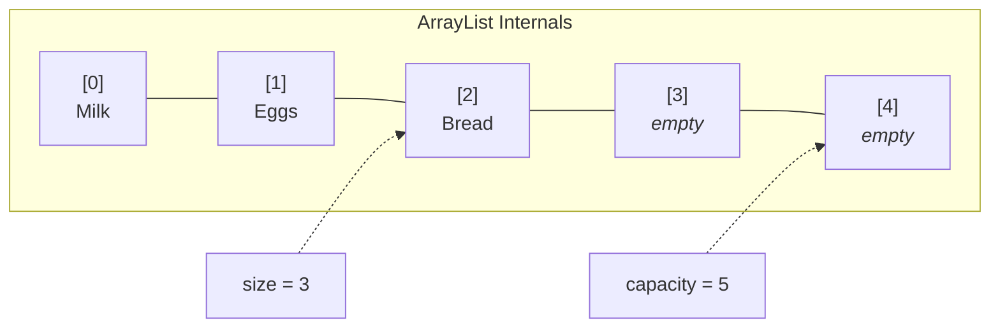
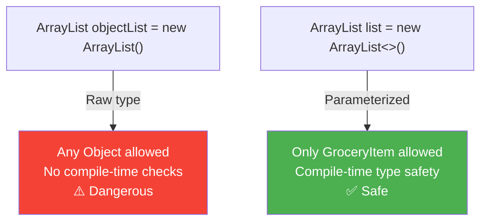
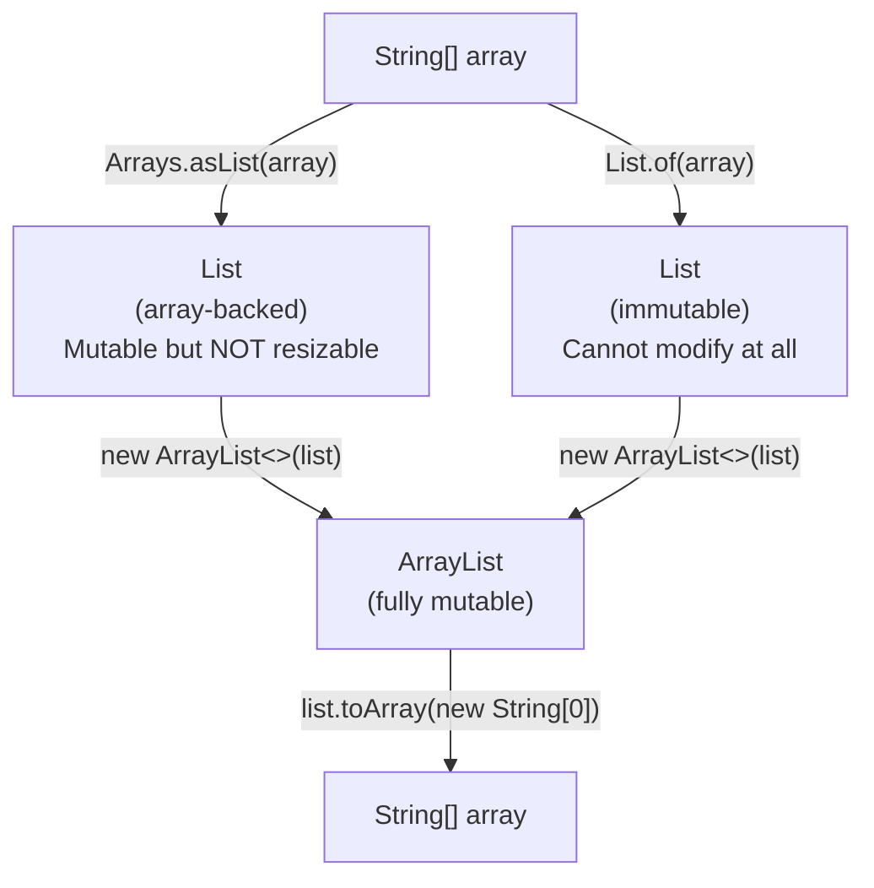

# :material-pencil: Topic Note: ArrayList — Java's Resizable Array

> **Course:** Java Programming Masterclass - Tim Buchalka (Udemy)

> **Section:** 10 - Mastering Lists, Iterators, and Autoboxing (Part 1: ArrayList)

> **Status:** :material-check-circle: Complete (Part 2 of Topic 3)

---

## :material-target: Learning Objectives

- [x] Understand why arrays aren't enough and what the Collections framework provides
- [x] Know what the `List` interface is and what methods it guarantees
- [x] Create and use `ArrayList` with proper type safety (parameterized types)
- [x] Perform CRUD operations: add, get, set, remove, clear
- [x] Search using `contains`, `indexOf`, and `lastIndexOf`
- [x] Sort with `Comparator.naturalOrder()` and `Comparator.reverseOrder()`
- [x] Convert between arrays and ArrayLists in both directions
- [x] Understand the differences between `List.of()`, `Arrays.asList()`, and `new ArrayList<>()`

---

## :material-head-cog: 1. Why Collections? Beyond Basic Arrays

Arrays are powerful, but they have a fundamental limitation: **fixed size**. Once created, you cannot add or remove elements — you can only modify existing ones.

Java provides a complete library of resizable, feature-rich containers called the **Collections Framework** (in `java.util`). Collections take arrays to the next level:

| Feature         | Array                    | Collections                                          |
| --------------- | ------------------------ | ---------------------------------------------------- |
| **Size**        | Fixed at creation        | Dynamic (grows and shrinks)                          |
| **Methods**     | Only `.length` field     | Rich API (`add`, `remove`, `sort`, `contains`, etc.) |
| **Type safety** | Built-in (e.g., `int[]`) | Generics with `<Type>`                               |
| **Primitives**  | Supported directly       | Wrapper classes only (`Integer`, not `int`)          |

The two most common `List` implementations are **ArrayList** and **LinkedList**. This note focuses on `ArrayList`.

---

## :material-head-cog: 2. The List Interface

A `List` is a special type in Java called an **interface**. An interface describes a set of **method signatures** that all implementing classes must provide.

Think of it as a contract: any class that "implements" `List` agrees to have methods like `add`, `remove`, `get`, `contains`, `indexOf`, etc.

### Classes That Implement `List`

| Class                  | Description                                          |
| ---------------------- | ---------------------------------------------------- |
| `ArrayList`            | Resizable array — most commonly used                 |
| `LinkedList`           | Doubly-linked list — efficient insert/remove at ends |
| `Stack`                | LIFO collection (legacy, prefer `Deque`)             |
| `CopyOnWriteArrayList` | Thread-safe variant                                  |
| `AbstractList`         | Base class for custom list implementations           |

!!! info "Interface Preview"

    - Interfaces are covered in depth in the next section of the course. For now, think of `List` as a guarantee that certain methods exist on any list class.

---

## :material-head-cog: 3. ArrayList Fundamentals

An `ArrayList` is a **resizable-array implementation** of the `List` interface. Under the hood, it maintains an internal array that is **larger than what you currently need**:



| Concept      | Description                                                                                                               |
| ------------ | ------------------------------------------------------------------------------------------------------------------------- |
| **Size**     | Number of elements actually stored (retrieved via `.size()`)                                                              |
| **Capacity** | Total slots allocated in the internal array                                                                               |
| **Growth**   | When `size == capacity`, a new, larger array is allocated and elements are copied over — automatically, behind the scenes |

This is why `ArrayList` is called "resizable" — you never manage the capacity yourself.

---

## :material-head-cog: 4. Type Safety: Raw vs Parameterized

### The Problem: Raw ArrayList

If you create an `ArrayList` without specifying a type, Java defaults to `Object`:

```java
ArrayList objectList = new ArrayList<>();    // Raw type — WARNING!
objectList.add(new GroceryItem("Butter"));   // OK
objectList.add("Yogurt");                    // Also OK — but is this what we want?
```

This is called a **raw type**. Any object can be added, destroying type safety — exactly the same problem as using an `Object[]` array.

!!! warning "IntelliJ Warning"

    - IntelliJ flags this with: **"Raw use of parameterized class 'ArrayList'"**. This means compile-time type checking is **disabled**.

### The Solution: Parameterized ArrayList

Specify the element type in **angle brackets** (`<>`):

```java
ArrayList<GroceryItem> groceryList = new ArrayList<>();
groceryList.add(new GroceryItem("Butter"));   // OK
// groceryList.add("Yogurt");                 // COMPILE ERROR! String ≠ GroceryItem
```

### The Diamond Operator (`<>`)

On the right side of the assignment, you can use empty angle brackets — Java **infers** the type from the left side:

```java
// Explicit type argument (verbose but valid)
ArrayList<GroceryItem> groceryList = new ArrayList<GroceryItem>();

// Diamond operator (preferred — cleaner, inferred)
ArrayList<GroceryItem> groceryList = new ArrayList<>();
```



!!! danger "Don't Forget the Diamond"

    - If you write `new ArrayList()` without `<>`, you get a **raw type** even if the left side is parameterized. Always include at least the empty diamond `<>`.

### The GroceryItem Record

The course uses a `record` to model grocery items:

```java
record GroceryItem(String name, String type, int count) {

    // Custom constructor: name only, defaults type="DAIRY" and count=1
    public GroceryItem(String name) {
        this(name, "DAIRY", 1);
    }

    @Override
    public String toString() {
        return String.format("%d %s in %s", count, name.toUpperCase(), type);
    }
}
```

**Key points:**

- Records auto-generate a constructor with all fields
- Custom constructors must chain to the canonical constructor via `this(...)`
- Overriding `toString()` controls how items are printed in the list

---

## :material-head-cog: 5. Creating & Populating ArrayLists

### Method 1: Empty Constructor + `add()`

```java
ArrayList<GroceryItem> groceryList = new ArrayList<>();
groceryList.add(new GroceryItem("Butter"));
groceryList.add(new GroceryItem("Milk"));
groceryList.add(new GroceryItem("Oranges", "PRODUCE", 5));
```

### Method 2: Constructor with `List.of()` (Recommended)

```java
ArrayList<String> groceries = new ArrayList<>(List.of("Apple", "Banana", "Pear"));
groceries.add("yogurt");  // Mutable — this works!
```

**How it works:** `List.of()` creates an **immutable list** which is then passed to the `ArrayList` constructor. The constructor copies the elements into a new, **mutable** `ArrayList`.

### Method 3: One-Line Initialization

```java
ArrayList<String> nextList = new ArrayList<>(
        List.of("pickles", "mustard", "cheese")
);
```

### Method 4: Constructor with `Arrays.asList()`

```java
String[] items = {"Apple", "Banana", "Pear"};
ArrayList<String> groceries = new ArrayList<>(Arrays.asList(items));
```

### Adding Multiple Items at Once: `addAll()`

```java
ArrayList<String> nextList = new ArrayList<>(
        List.of("pickles", "mustard", "cheese")
);

groceries.addAll(nextList);       // Adds all elements from nextList
System.out.println(groceries);    // [Apple, Banana, Pear, yogurt, pickles, mustard, cheese]
```

---

## :material-head-cog: 6. CRUD Operations

### Adding Elements

| Method                | Description                                      | Example                      |
| --------------------- | ------------------------------------------------ | ---------------------------- |
| `add(element)`        | Appends to the **end**                           | `groceries.add("Milk")`      |
| `add(index, element)` | Inserts at **index**, shifts others right        | `groceries.add(0, "Apples")` |
| `addAll(collection)`  | Appends **all** elements from another collection | `groceries.addAll(nextList)` |

```java
ArrayList<GroceryItem> groceryList = new ArrayList<>();
groceryList.add(new GroceryItem("Butter"));       // [Butter]
groceryList.add(new GroceryItem("Yogurt"));       // [Butter, Yogurt]
groceryList.add(0,
        new GroceryItem("Milk", "PRODUCE", 6));   // [Milk, Butter, Yogurt]
```

!!! info "`add(index)` Shifts Elements"

    - When adding at index 0, all existing elements shift by one position to the right. Unlike arrays, the list grows automatically to accommodate.

### Reading Elements: `get()`

```java
System.out.println("Third item: " + groceries.get(2));   // Third item: Pear
```

Like arrays, `ArrayList` uses **zero-based indexing**. But instead of `arr[2]`, you call `.get(2)`.

### Updating Elements: `set()`

```java
groceryList.set(0, new GroceryItem("Apples", "PRODUCE", 6));
// Replaces the element at index 0 (Milk → Apples)
```

`set()` **replaces** the element at the given index. It does not insert — the list size stays the same.

### Removing Elements

| Method                  | Description                                               | Removes           |
| ----------------------- | --------------------------------------------------------- | ----------------- |
| `remove(int index)`     | Removes by **position**                                   | Single element    |
| `remove(Object o)`      | Removes **first occurrence** by value                     | Single element    |
| `removeAll(Collection)` | Removes **all matching** elements                         | Multiple elements |
| `retainAll(Collection)` | Keeps **only matching** elements, removes everything else | Multiple elements |
| `clear()`               | Removes **everything**                                    | All elements      |

```java
System.out.println(groceries);
// [Apple, Banana, Pear, yogurt, pickles, mustard, cheese, yogurt]

groceries.remove(1);                // Removes "Banana" (by index)
System.out.println(groceries);
// [Apple, Pear, yogurt, pickles, mustard, cheese, yogurt]

groceries.remove("yogurt");         // Removes FIRST "yogurt" only
System.out.println(groceries);
// [Apple, Pear, pickles, mustard, cheese, yogurt]

groceries.removeAll(List.of("Apple", "eggs"));
// Removes "Apple" (found), ignores "eggs" (not in list)
System.out.println(groceries);
// [Pear, pickles, mustard, cheese, yogurt]

groceries.retainAll(List.of("Apple", "milk", "mustard", "cheese"));
// Keeps ONLY mustard and cheese (the rest are removed)
System.out.println(groceries);
// [mustard, cheese]

groceries.clear();                   // Removes everything
System.out.println(groceries);       // []
System.out.println(groceries.isEmpty());  // true
```

!!! tip

    "`retainAll` is the Opposite of `removeAll`" - `removeAll(list)` → removes items that **are** in `list` - `retainAll(list)` → removes items that are **not** in `list`

---

## :material-head-cog: 7. Searching

### `contains()` — Boolean Check

Returns `true` if the element exists in the list:

```java
if (groceries.contains("yogurt")) {
    System.out.println("List contains yogurt");
}
// Output: List contains yogurt
```

!!! info "How `contains` Works"

    Internally, `contains` calls the element's `equals()` method. For `String`, this checks character-by-character equality. For your own classes, you may need to override `equals()`.

### `indexOf()` and `lastIndexOf()` — Position Lookup

```java
groceries.add("yogurt");  // Add a duplicate
System.out.println("first = " + groceries.indexOf("yogurt"));
// first = 3

System.out.println("last = " + groceries.lastIndexOf("yogurt"));
// last = 8
```

| Method                 | Returns                       | When Not Found |
| ---------------------- | ----------------------------- | -------------- |
| `indexOf(element)`     | Index of **first** occurrence | `-1`           |
| `lastIndexOf(element)` | Index of **last** occurrence  | `-1`           |

!!! tip "ArrayList vs Array Search"

    With arrays, you had to use `Arrays.binarySearch()` which **requires sorting first**. With `ArrayList`, `contains` and `indexOf` work on **unsorted** lists — they perform a linear scan using `equals()`.

---

## :material-head-cog: 8. Sorting

Unlike `Arrays.sort()` which takes no argument for natural ordering, `ArrayList.sort()` **requires** a `Comparator`:

### Ascending Order (Natural Order)

```java
System.out.println(groceries);
// [Apple, milk, mustard, cheese, eggs, pickles, mustard, ham]

groceries.sort(Comparator.naturalOrder());
System.out.println(groceries);
// [Apple, cheese, eggs, ham, milk, mustard, mustard, pickles]
```

### Descending Order (Reverse Order)

```java
groceries.sort(Comparator.reverseOrder());
System.out.println(groceries);
// [pickles, mustard, mustard, milk, ham, eggs, cheese, Apple]
```

| Sort Method | Array                | ArrayList                              |
| ----------- | -------------------- | -------------------------------------- |
| Ascending   | `Arrays.sort(arr)`   | `list.sort(Comparator.naturalOrder())` |
| Descending  | Manual (bubble sort) | `list.sort(Comparator.reverseOrder())` |

!!! info "What Is a `Comparator`?"

    A `Comparator` is an interface that defines **how** two objects should be compared. `Comparator.naturalOrder()` and `Comparator.reverseOrder()` are factory methods that return pre-built comparators for types with a natural ordering (numbers, strings, etc.). Comparators are covered in depth in the interfaces section.

---

## :material-head-cog: 9. Converting Between Arrays and ArrayLists

There are three factory methods for creating lists from elements, and one method for going back to an array:



### `Arrays.asList()` — Array-Backed List (Not Resizable)

```java
String[] originalArray = new String[]{"First", "Second", "Third"};
var originalList = Arrays.asList(originalArray);

originalList.set(0, "one");       // OK — modifying existing element
System.out.println("list: " + originalList);
// list: [one, Second, Third]

System.out.println("array: " + Arrays.toString(originalArray));
// array: [one, Second, Third]   ← Original array was also modified!

// originalList.add("Fourth");    // UnsupportedOperationException!
// originalList.remove(0);        // UnsupportedOperationException!
```

**Key behavior:**

- Changes to the list **modify the underlying array** (and vice versa)
- You **cannot** add or remove elements — the list is backed by a fixed-size array
- You **can** modify existing elements with `set()`

!!! warning "Array-Backed = Shared Reference"

    `Arrays.asList()` does **not** copy the array. It wraps it. Any `set()` call on the list changes the original array.

### `List.of()` — Immutable List

```java
List<String> newList = List.of("Sunday", "Monday", "Tuesday");
System.out.println(newList);  // [Sunday, Monday, Tuesday]

// newList.add("Wednesday");    // UnsupportedOperationException!
// newList.set(0, "Funday");    // UnsupportedOperationException!
// newList.remove(0);           // UnsupportedOperationException!
```

`List.of()` returns a `java.util.ImmutableCollections$ListN` — you **cannot modify it at all**.

### Comparison Table

| Method                  | Returns           | Mutable?      | Resizable? | Backed by Array?      |
| ----------------------- | ----------------- | ------------- | ---------- | --------------------- |
| `Arrays.asList(arr)`    | Fixed-size `List` | ✅ (set only) | ❌         | ✅ (shared)           |
| `List.of(elements)`     | Immutable `List`  | ❌            | ❌         | ❌                    |
| `new ArrayList<>(list)` | `ArrayList`       | ✅            | ✅         | ❌ (independent copy) |

### `toArray()` — ArrayList → Array

```java
var groceryArray = groceries.toArray(new String[groceries.size()]);
System.out.println(Arrays.toString(groceryArray));
```

Pass a **typed array** as the argument. The returned array will be the same type and contain the list's elements. You can also pass `new String[0]` — the method will still return an array sized to the list.

---

## :material-head-cog: 10. Arrays vs ArrayLists — Complete Comparison

### Similarities

| Feature           | Array                     | ArrayList                 |
| ----------------- | ------------------------- | ------------------------- |
| **Indexed**       | Yes (zero-based)          | Yes (zero-based)          |
| **Ordered**       | By index                  | By index                  |
| **Duplicates**    | Allowed                   | Allowed                   |
| **Nulls**         | Allowed                   | Allowed                   |
| **Inherits from** | `java.lang.Object`        | `java.lang.Object`        |
| **Mutable**       | Yes (elements can change) | Yes (elements can change) |

### Differences

| Aspect               | Array                                | ArrayList                               |
| -------------------- | ------------------------------------ | --------------------------------------- |
| **Primitives**       | ✅ Supported (`int[]`)               | ❌ Wrapper classes only (`Integer`)     |
| **Size**             | Fixed                                | Dynamic (resizable)                     |
| **Get size**         | `.length` (field)                    | `.size()` (method)                      |
| **Access element**   | `arr[i]`                             | `list.get(i)`                           |
| **Set element**      | `arr[i] = val`                       | `list.set(i, val)`                      |
| **Print**            | `Arrays.toString(arr)`               | `System.out.println(list)`              |
| **Print 2D**         | `Arrays.deepToString(arr)`           | `System.out.println(list)`              |
| **Search**           | `Arrays.binarySearch()` (sorted!)    | `contains()`, `indexOf()` (unsorted OK) |
| **Sort**             | `Arrays.sort(arr)`                   | `list.sort(Comparator.naturalOrder())`  |
| **Add/Remove**       | ❌ Not possible                      | ✅ `add()`, `remove()`, etc.            |
| **Built-in methods** | Almost none (use `java.util.Arrays`) | Rich API on the instance itself         |

### Syntax Comparison

```java
// ═══════════════════ ARRAY ═══════════════════
String[] arr = new String[]{"a", "b", "c"};     // Declaration + initialization
int len = arr.length;                             // Size
String first = arr[0];                            // Access
arr[0] = "z";                                     // Set
Arrays.sort(arr);                                 // Sort
System.out.println(Arrays.toString(arr));          // Print

// ═══════════════════ ARRAYLIST ═══════════════
ArrayList<String> list = new ArrayList<>(         // Declaration + initialization
        List.of("a", "b", "c")
);
int size = list.size();                            // Size
String first = list.get(0);                        // Access
list.set(0, "z");                                  // Set
list.sort(Comparator.naturalOrder());              // Sort
System.out.println(list);                           // Print
list.add("d");                                      // Add ← ARRAY CAN'T DO THIS
list.remove("b");                                   // Remove ← ARRAY CAN'T DO THIS
```

!!! tip "When to Use Which?" - **Use arrays** when the size is known and fixed, and you need maximum performance or primitive types - **Use ArrayList** when you need to add/remove elements dynamically, or need the rich built-in methods

---

## :material-head-cog: 11. ArrayList Challenge: Interactive Grocery List

The challenge builds a complete interactive console application using an `ArrayList`, a `Scanner`, enhanced `switch` statements, and text blocks.

### Full Solution

```java
import java.util.ArrayList;
import java.util.Comparator;
import java.util.Scanner;

public class Main {
    private static Scanner scanner = new Scanner(System.in);

    public static void main(String[] args) {
        boolean flag = true;
        ArrayList<String> groceries = new ArrayList<>();

        // Manages grocery list until user quits
        while (flag) {
            printActions();
            switch (Integer.parseInt(scanner.nextLine())) {
                case 1 -> addItems(groceries);
                case 2 -> removeItems(groceries);
                default -> flag = false;
            }
            groceries.sort(Comparator.naturalOrder());
            System.out.println(groceries);
        }
    }

    /**
     * Adds unique trimmed items to the grocery list
     */
    private static void addItems(ArrayList<String> groceries) {
        System.out.println("Add item(s) [separate items by comma]:");
        String[] items = scanner.nextLine().split(",");

        for (String item : items) {
            String trimmedItem = item.trim();
            if (groceries.indexOf(trimmedItem) < 0) {
                groceries.add(trimmedItem);
            }
        }
    }

    private static void removeItems(ArrayList<String> groceries) {
        System.out.println("Remove item(s) [separate items by comma]:");
        String[] items = scanner.nextLine().split(",");
        for (String item : items) {
            String trimmedItem = item.trim();
            groceries.remove(trimmedItem);
        }
    }

    private static void printActions() {
        String textBlock = """
                Available actions:

                0 - to shutdown

                1 - to add item(s) to list (comma delimited list)

                2 - to remove any items (comma delimited list)

                Enter a number for which action you want to do:""";
        System.out.println(textBlock + " ");
    }
}
```

### Key Techniques Used

| Technique                       | Code                                   | Purpose                                 |
| ------------------------------- | -------------------------------------- | --------------------------------------- |
| **Text blocks**                 | `"""..."""`                            | Multi-line menu display (Java 15+)      |
| **Enhanced switch**             | `case 1 -> addItems(...)`              | No `break` needed, no fall-through      |
| **Compound expression**         | `Integer.parseInt(scanner.nextLine())` | Read + parse in one statement           |
| **Trimming**                    | `item.trim()`                          | Remove whitespace from user input       |
| **Duplicate prevention**        | `indexOf(item) < 0`                    | Only add if item is not already in list |
| **`Comparator.naturalOrder()`** | `groceries.sort(...)`                  | Alphabetical sort after every action    |

### Why Not Use `addAll` Directly?

The first approach tried in the course was:

```java
groceries.addAll(List.of(items));   // Adds ALL items — no dedup, no trim!
```

**Two problems:**

1. **Duplicates** — If the user enters "eggs, cereal" and those are already in the list, they get added again
2. **Whitespace** — "eggs, milk, cereal" splits into `["eggs", " milk", " cereal"]` — note the leading spaces

The fix: loop through individually, `trim()` each item, and check with `indexOf()` before adding.

---

## :material-alert: Common Pitfalls Summary

| Pitfall                           | Example                                          | Fix                                              |
| --------------------------------- | ------------------------------------------------ | ------------------------------------------------ |
| Raw ArrayList                     | `new ArrayList()`                                | `new ArrayList<String>()` or `new ArrayList<>()` |
| Missing diamond operator          | `new ArrayList<String>() → new ArrayList()`      | Always include `<>`                              |
| `List.of()` is immutable          | `List.of("a").add("b")` → crash                  | Wrap: `new ArrayList<>(List.of("a"))`            |
| `Arrays.asList()` not resizable   | `Arrays.asList(arr).add("x")` → crash            | Wrap: `new ArrayList<>(Arrays.asList(arr))`      |
| `remove(int)` vs `remove(Object)` | `list.remove(1)` removes by index, not value "1" | Use `list.remove(Integer.valueOf(1))` for value  |
| Whitespace in split               | `"a, b".split(",")` → `["a", " b"]`              | Call `.trim()` on each element                   |

---

## :material-lightbulb-on: Key Takeaways

1. **ArrayList is a resizable array** — it manages capacity automatically behind the scenes. You focus on the data, not the size.
2. **Always parameterize** — use `ArrayList<Type>` with the diamond operator `<>` for compile-time type safety.
3. **`List.of()` is immutable, `Arrays.asList()` is fixed-size** — neither is fully mutable. Wrap with `new ArrayList<>(...)` when you need a mutable list.
4. **Printing is easier** — `System.out.println(list)` works correctly, unlike arrays which print hash codes.
5. **Searching is easier** — `contains()` and `indexOf()` don't require a sorted list, unlike `Arrays.binarySearch()`.
6. **Sorting requires a `Comparator`** — use `Comparator.naturalOrder()` or `Comparator.reverseOrder()`.
7. **No primitives** — ArrayList cannot hold `int`, `double`, etc. Use `Integer`, `Double`, etc. (autoboxing is covered next).

---

## :material-pin: Quick Reference

| Operation                | Syntax                                       |
| ------------------------ | -------------------------------------------- |
| Create (empty)           | `ArrayList<String> list = new ArrayList<>()` |
| Create (with items)      | `new ArrayList<>(List.of("a", "b", "c"))`    |
| Add to end               | `list.add("item")`                           |
| Add at index             | `list.add(0, "item")`                        |
| Add all                  | `list.addAll(otherList)`                     |
| Get element              | `list.get(0)`                                |
| Set element              | `list.set(0, "newValue")`                    |
| Remove by index          | `list.remove(0)`                             |
| Remove by value          | `list.remove("item")`                        |
| Remove multiple          | `list.removeAll(List.of("a", "b"))`          |
| Keep only                | `list.retainAll(List.of("a", "b"))`          |
| Clear all                | `list.clear()`                               |
| Is empty?                | `list.isEmpty()`                             |
| Size                     | `list.size()`                                |
| Contains?                | `list.contains("item")`                      |
| First index of           | `list.indexOf("item")`                       |
| Last index of            | `list.lastIndexOf("item")`                   |
| Sort (A→Z)               | `list.sort(Comparator.naturalOrder())`       |
| Sort (Z→A)               | `list.sort(Comparator.reverseOrder())`       |
| List → Array             | `list.toArray(new String[0])`                |
| Array → List (mutable)   | `new ArrayList<>(Arrays.asList(arr))`        |
| Array → List (immutable) | `List.of(arr)`                               |

---

## :material-navigation: Related Notes

| Part | Topic                              | Link                            |
| :--: | ---------------------------------- | ------------------------------- |
|  1   | Arrays & `java.util.Arrays`        | [← Part 1](topic-note.md)       |
|  2   | ArrayList — Java's Resizable Array | **You are here**                |
|  3   | LinkedList & Iterators             | [Part 3 →](topic-note-part3.md) |
|  4   | Autoboxing, Unboxing & Enums       | [Part 4 →](topic-note-part4.md) |

---

## :material-bookshelf: References

- **Course:** Tim Buchalka - Java Programming Masterclass (Section 10, Lectures 1–6)
- **API:** [java.util.ArrayList (Java 17)](https://docs.oracle.com/en/java/javase/17/docs/api/java.base/java/util/ArrayList.html)
- **API:** [java.util.List (Java 17)](https://docs.oracle.com/en/java/javase/17/docs/api/java.base/java/util/List.html)
- **API:** [java.util.Comparator (Java 17)](https://docs.oracle.com/en/java/javase/17/docs/api/java.base/java/util/Comparator.html)

---

_Last Updated: 2026-02-11 | Confidence: 9/10_
