# :material-pencil: Topic Note: LinkedList & Iterators — Doubly Linked Lists in Java

> **Course:** Java Programming Masterclass - Tim Buchalka (Udemy)

> **Section:** 10 - Mastering Lists, Iterators, and Autoboxing (Part 2: LinkedList)

> **Status:** :material-check-circle: Complete (Part 3 of Topic 3)

---

## :material-target: Learning Objectives

- [x] Understand how memory layout differs between arrays, ArrayLists, and LinkedLists
- [x] Know Big O Notation and how it applies to list operations
- [x] Use a LinkedList as a List, Queue, Double-Ended Queue, and Stack
- [x] Perform add/remove operations with Queue/Stack-specific methods
- [x] Retrieve elements using List, Queue, and Stack APIs
- [x] Traverse lists with `Iterator` and `ListIterator`
- [x] Safely modify a list during iteration (avoiding `ConcurrentModificationException`)
- [x] Navigate bidirectionally (forward/backward) with `ListIterator`
- [x] Build an ordered LinkedList with duplicate prevention and interactive navigation

---

## :material-head-cog: 1. Why LinkedList Exists: Memory & Performance

### How Arrays Store Data in Memory

When a primitive array is created, all elements are stored **contiguously** (side by side) in memory:


Java can find any element with **simple math**: `address = baseAddress + (index × size)`. This makes indexed access **O(1)** — constant time, regardless of how many elements there are.

### How ArrayList Stores Data

An `ArrayList` uses an internal array of **references** (memory addresses), not the actual objects. The references are contiguous, but the objects they point to can be anywhere in memory:

```mermaid
flowchart TD
    subgraph internal["ArrayList Internal Array (references)"]
        direction LR
        R0["[0] → addr 500"] --- R1["[1] → addr 720"] --- R2["[2] → addr 340"]
    end

    R0 -.-> OBJ0["Object at 500<br/>'First'"]
    R1 -.-> OBJ1["Object at 720<br/>'Second'"]
    R2 -.-> OBJ2["Object at 340<br/>'Third'"]
```



**Key insight:** Indexed access is still **O(1)** because the reference addresses are contiguous. But **inserting or removing** requires shifting all subsequent references — that's **O(n)**.

### How LinkedList Stores Data

A `LinkedList` has **no internal array at all**. Each element (called a **node**) stores:

1. The data itself
2. A reference to the **next** node
3. A reference to the **previous** node

```mermaid
flowchart LR
    HEAD["HEAD"] --> A
    A["Alice Springs<br/>prev: null<br/>next: →"] <--> B["Brisbane<br/>prev: ←<br/>next: →"]
    B <--> C["Canberra<br/>prev: ←<br/>next: →"]
    C <--> D["Darwin<br/>prev: ←<br/>next: →"]
    D <--> E["Sydney<br/>prev: ←<br/>next: null"]
    E --> TAIL["TAIL"]

    style HEAD fill:#FF9800,color:#fff
    style TAIL fill:#FF9800,color:#fff
```



This architecture is called a **doubly linked list** — each node links to both the next and previous node. The first node is the **head** and the last is the **tail**.

!!! info "No Index, No Simple Math"

      To find the 5th element, you must start at the head (or tail) and traverse node by node. There's no shortcut — this makes indexed access **O(n)**.

---

## :material-head-cog: 2. Big O Notation — Understanding Performance Costs

**Big O Notation** expresses how the cost of an operation scales with the number of elements `n`.

| Notation   | Name               | Meaning                                                  |
| ---------- | ------------------ | -------------------------------------------------------- |
| **O(1)**   | Constant time      | Cost is the same regardless of `n`                       |
| **O(n)**   | Linear time        | Cost grows proportionally with `n`                       |
| **O(1)\*** | Constant amortized | Usually O(1), occasionally O(n) when reallocation occurs |

### ArrayList vs LinkedList — Big O Comparison

| Operation              | ArrayList | LinkedList | Notes                                       |
| ---------------------- | --------- | ---------- | ------------------------------------------- |
| **Get by index**       | O(1)      | O(n)       | ArrayList wins: simple math vs traversal    |
| **Set by index**       | O(1)      | O(n)       | Same reason                                 |
| **Add to end**         | O(1)\*    | O(1)       | ArrayList may need reallocation             |
| **Add to start**       | O(n)      | O(1)       | ArrayList shifts all elements               |
| **Add at index**       | O(n)      | O(n)       | Both need to find position, then shift/link |
| **Remove from start**  | O(n)      | O(1)       | ArrayList shifts all elements               |
| **Remove from end**    | O(1)      | O(1)       | Both are fast                               |
| **Remove by value**    | O(n)      | O(n)       | Both must search first                      |
| **Contains / indexOf** | O(n)      | O(n)       | Both do linear scan                         |

!!! tip "When to Use Which?"

    - **ArrayList** is the better default choice, especially for **storing and reading** data (random access via index).

    - **LinkedList** is better when you're frequently **adding/removing from the start or end** of the list, or when the maximum size is unknown and may be very large. - If you know the maximum number of elements, use `new ArrayList<>(capacity)` to avoid reallocation. - An `ArrayList`'s maximum capacity is `Integer.MAX_VALUE` (2,147,483,647). A `LinkedList` has no such limit.

---

## :material-head-cog: 3. LinkedList as Four Data Structures

The `LinkedList` class implements **multiple interfaces**, making it usable as four different data structure types:

```mermaid
flowchart TD
    LL["LinkedList<E>"]
    LL -->|implements| LIST["List<E>"]
    LL -->|implements| DEQUE["Deque<E><br/>(Double-Ended Queue)"]
    DEQUE -->|extends| QUEUE["Queue<E>"]

    subgraph behaviors["Behavior Patterns"]
        direction TB
        B1["📋 List — indexed, ordered collection"]
        B2["🚶 Queue (FIFO) — first in, first out"]
        B3["🔄 Deque — access from both ends"]
        B4["📚 Stack (LIFO) — last in, first out"]
    end

    LIST -.-> B1
    QUEUE -.-> B2
    DEQUE -.-> B3
    DEQUE -.-> B4
```



| Pattern          | Add Method                            | Remove Method                     | Description                     |
| ---------------- | ------------------------------------- | --------------------------------- | ------------------------------- |
| **List**         | `add(element)`, `add(index, element)` | `remove(index)`, `remove(object)` | Standard list operations        |
| **Queue (FIFO)** | `offer(element)`                      | `poll()`                          | Add to end, remove from start   |
| **Deque**        | `offerFirst()`, `offerLast()`         | `pollFirst()`, `pollLast()`       | Access from both ends           |
| **Stack (LIFO)** | `push(element)`                       | `pop()`                           | Add to start, remove from start |

---

## :material-head-cog: 4. Creating and Populating a LinkedList

### Declaration

```java
// Explicit type on both sides
LinkedList<String> placesToVisit = new LinkedList<>();

// Using var (must specify type on the right side!)
var placesToVisit = new LinkedList<String>();
```

!!! warning "`var` with Diamond Operator"

      When using `var`, you **cannot** use an empty diamond `<>` on the right side — Java won't have enough information to infer the type. You must write `new LinkedList<String>()` explicitly.

### Adding Elements — List Methods

```java
placesToVisit.add("Sydney");              // Appends to end
placesToVisit.add(0, "Canberra");         // Inserts at index 0, shifts others
System.out.println(placesToVisit);
// [Canberra, Sydney]
```

### Adding Elements — Deque Methods

```java
list.addFirst("Darwin");        // Inserts at the HEAD
list.addLast("Hobart");         // Appends to the TAIL (same as add)
```

### Adding Elements — Queue Methods

```java
list.offer("Melbourne");        // Adds to end (= offerLast)
list.offerFirst("Brisbane");    // Adds to start (= addFirst)
list.offerLast("Toowoomba");    // Adds to end (= addLast)
```

### Adding Elements — Stack Method

```java
list.push("Alice Springs");     // Pushes to the TOP of the stack (= addFirst)
```

!!! info "`push` adds to the START"

     The top of a stack is the **first** element in the LinkedList. `push` inserts at position 0, pushing all existing elements down.

### Complete Add Methods Reference

| Method                | Where    | Same As                               |
| --------------------- | -------- | ------------------------------------- |
| `add(element)`        | End      | `offerLast()`, `addLast()`, `offer()` |
| `add(index, element)` | At index | —                                     |
| `addFirst(element)`   | Start    | `offerFirst()`, `push()`              |
| `addLast(element)`    | End      | `offer()`, `offerLast()`              |
| `offer(element)`      | End      | `addLast()`                           |
| `offerFirst(element)` | Start    | `addFirst()`                          |
| `offerLast(element)`  | End      | `addLast()`                           |
| `push(element)`       | Start    | `addFirst()`                          |

---

## :material-head-cog: 5. Removing Elements

### List Methods (Shared with ArrayList)

```java
list.remove(4);            // Removes by index (5th element)
list.remove("Brisbane");   // Removes first occurrence by value
```

### LinkedList-Specific Methods

```java
String s1 = list.remove();         // Removes and returns FIRST element
String s2 = list.removeFirst();    // Same as remove()
String s3 = list.removeLast();     // Removes and returns LAST element
```

### Queue/Deque Methods

```java
String p1 = list.poll();           // Removes and returns first (= pollFirst)
String p2 = list.pollFirst();      // Same as poll()
String p3 = list.pollLast();       // Removes and returns last
```

### Stack Method

```java
String p4 = list.pop();           // Removes and returns first (top of stack)
```

!!! tip

    - "`remove()` vs `poll()` — Error Handling Difference" - `remove()` / `removeFirst()` / `removeLast()` throw `NoSuchElementException` if the list is empty - `poll()` / `pollFirst()` / `pollLast()` return `null` if the list is empty

    - Use `poll` when an empty list is a valid scenario; use `remove` when it should never happen.

### Complete Remove Methods Reference

| Method           | Removes     | Returns         | If Empty                    |
| ---------------- | ----------- | --------------- | --------------------------- |
| `remove(index)`  | At index    | Removed element | `IndexOutOfBoundsException` |
| `remove(object)` | First match | `boolean`       | `false`                     |
| `remove()`       | First       | Removed element | `NoSuchElementException`    |
| `removeFirst()`  | First       | Removed element | `NoSuchElementException`    |
| `removeLast()`   | Last        | Removed element | `NoSuchElementException`    |
| `poll()`         | First       | Removed element | `null`                      |
| `pollFirst()`    | First       | Removed element | `null`                      |
| `pollLast()`     | Last        | Removed element | `null`                      |
| `pop()`          | First (top) | Removed element | `NoSuchElementException`    |

---

## :material-head-cog: 6. Retrieving Elements (Without Removing)

### List Methods

```java
list.get(4);              // Element at index 4 — O(n) for LinkedList!
list.getFirst();          // First element (head)
list.getLast();           // Last element (tail)
list.indexOf("Darwin");   // Position of first match (-1 if not found)
list.lastIndexOf("Melbourne");  // Position of last match
```

### Queue Method

```java
list.element();           // Returns first element (head), throws if empty
```

### Peek Methods (Null-Safe)

```java
list.peek();              // Returns first element, or null if empty
list.peekFirst();         // Same as peek()
list.peekLast();          // Returns last element, or null if empty
```

!!! info "`get()` vs `peek()` vs `element()`"

      All three can retrieve the first element, but they differ in behavior:

      | Method                   | Empty List                  | Analogous To     |
      | ------------------------ | --------------------------- | ---------------- |
      | `get(0)`                 | `IndexOutOfBoundsException` | List API         |
      | `element()`              | `NoSuchElementException`    | Queue API        |
      | `peek()` / `peekFirst()` | Returns `null`              | Queue API (safe) |
      | `getFirst()`             | `NoSuchElementException`    | LinkedList API   |

---

## :material-head-cog: 7. Traversing a LinkedList

### Method 1: Traditional `for` Loop (Indexed — Inefficient!)

```java
public static void printItinerary(LinkedList<String> list) {
    System.out.println("Trip starts at " + list.getFirst());
    for (int i = 1; i < list.size(); i++) {
        System.out.println("--> From: " + list.get(i - 1) + " To: " + list.get(i));
    }
    System.out.println("Trip ends at " + list.getLast());
}
```

!!! warning "Indexed Access on LinkedList = O(n) per Call"

      Each `list.get(i)` call inside the loop traverses from the head (or tail). In a loop, this means the total cost is **O(n²)** — very inefficient for large lists.

### Method 2: Enhanced `for` Loop (Better)

```java
public static void printItinerary2(LinkedList<String> list) {
    System.out.println("Trip starts at " + list.getFirst());
    String previousTown = list.getFirst();
    for (String town : list) {
        System.out.println("--> From: " + previousTown + " To: " + town);
        previousTown = town;
    }
    System.out.println("Trip ends at " + list.getLast());
}
```

More efficient — traverses the list once. But prints "From Alice Springs To Alice Springs" on the first iteration (both values are the first element).

### Method 3: `ListIterator` (Best)

```java
public static void printItinerary3(LinkedList<String> list) {
    System.out.println("Trip starts at " + list.getFirst());
    String previousTown = list.getFirst();
    ListIterator<String> iterator = list.listIterator(1);  // Start at index 1
    while (iterator.hasNext()) {
        var town = iterator.next();
        System.out.println("--> From: " + previousTown + " To: " + town);
        previousTown = town;
    }
    System.out.println("Trip ends at " + list.getLast());
}
```

Using `listIterator(1)` starts the cursor **after the first element**, skipping the duplicate first-entry problem.

---

## :material-head-cog: 8. Iterator & ListIterator — Deep Dive

### What Is an Iterator?

An **Iterator** is an object that allows traversal over a collection, element by element. Think of it like a **database cursor** — it maintains a position and moves through the data.

### Iterator Cursor Positions

The cursor sits **between** elements, not **on** them:


- `next()` returns the element **after** the cursor and advances the cursor forward
- `previous()` returns the element **before** the cursor and moves the cursor backward
- When first created, the cursor is at position **0** (before the first element)

### Iterator vs ListIterator

| Feature               | Iterator              | ListIterator                                        |
| --------------------- | --------------------- | --------------------------------------------------- |
| **Direction**         | Forward only          | Forward **and** backward                            |
| **Get method**        | `next()`, `hasNext()` | + `previous()`, `hasPrevious()`                     |
| **Mutate**            | `remove()` only       | `remove()`, `add()`, `set()`                        |
| **Starting position** | Before first element  | Configurable with `listIterator(index)`             |
| **Get by**            | `list.iterator()`     | `list.listIterator()` or `list.listIterator(index)` |

### Basic Iterator Usage

```java
var iterator = list.iterator();
while (iterator.hasNext()) {
    System.out.println(iterator.next());
}
```

### ListIterator — Forward and Backward

```java
var iterator = list.listIterator();

// Forward traversal
while (iterator.hasNext()) {
    System.out.println(iterator.next());
}

// Backward traversal (iterator is now at the end)
while (iterator.hasPrevious()) {
    System.out.println(iterator.previous());
}
```

After the first `while` loop, `hasNext()` is `false` — the cursor is past the last element. But `hasPrevious()` is `true`, so we can reverse without creating a new iterator.

### Safe Removal During Iteration

```java
var iterator = list.listIterator();
while (iterator.hasNext()) {
    if (iterator.next().equals("Brisbane")) {
        iterator.remove();      // ✅ Safe — removes via iterator
    }
}
```

!!! danger "Never Modify a List Directly During Iteration"

    ```java
     // ❌ WRONG — throws ConcurrentModificationException!
    while (iterator.hasNext()) {
        if (iterator.next().equals("Brisbane")) {
            list.remove("Brisbane");    // Modifying list directly!
        }
    }
    ```

You'd get the same error using an enhanced `for` loop and calling `list.remove()`. Always use `iterator.remove()`, `iterator.add()`, or `iterator.set()` instead.

### Adding Elements via ListIterator

```java
var iterator = list.listIterator();
while (iterator.hasNext()) {
    if (iterator.next().equals("Brisbane")) {
        iterator.add("Lake Wivenhoe");   // Inserts AFTER Brisbane
    }
}
```

The new element is inserted **immediately after** the element that was just returned by `next()`.

### Starting at a Specific Position

```java
var iterator2 = list.listIterator(3);   // Cursor between index 2 and 3
System.out.println(iterator2.next());     // Returns element at index 3 (Darwin)
System.out.println(iterator2.previous()); // Returns element at index 2 (Lake Wivenhoe)
```

---

## :material-head-cog: 9. LinkedList Challenge: Ordered Travel Itinerary

The challenge builds an interactive program that manages an ordered itinerary using a `LinkedList` and `ListIterator`.

### The `Place` Record

```java
record Place(String name, int distance) {
    @Override
    public String toString() {
        return String.format("%s, (%d) km away", name, distance);
    }
}
```

### The `addPlace` Method — Ordered Insert with Duplicate Prevention

```java
private static void addPlace(LinkedList<Place> list, Place place) {
    // Check 1: Exact duplicate using record's implicit equals()
    if (list.contains(place)) {
        System.out.println("Place already exists" + place);
        return;
    }

    // Check 2: Case-insensitive name match
    for (Place p : list) {
        if (p.name().equalsIgnoreCase(place.name())) {
            System.out.println("Place already exists" + place);
            return;
        }
    }

    // Insert in distance order (closest first)
    int matchedIndex = 0;
    for (var listPlace : list) {
        if (place.distance() < listPlace.distance()) {
            list.add(matchedIndex, place);
            return;
        }
        matchedIndex++;
    }
    list.add(place);  // Farthest away — add to end
}
```

**Three responsibilities:**

1. **Exact duplicate check** — `list.contains(place)` uses the record's implicit `equals()` which compares all fields
2. **Case-insensitive name check** — "Adelaide" and "adelaide" are treated as duplicates
3. **Ordered insert** — Places are inserted by ascending distance from Sydney

!!! info "Record's Implicit `equals()`"

      Records automatically implement `equals()` by comparing **all field values**.
      Two `Place` records with the same `name` and `distance` are considered equal by `contains()`. But "Adelaide" ≠ "adelaide" with the default `equals`, hence the manual case-insensitive check.

### The Interactive Navigation Loop

```java
public static void main(String[] args) {
    LinkedList<Place> placesToVisit = new LinkedList<>();

    addPlace(placesToVisit, new Place("Adelaide", 1374));
    addPlace(placesToVisit, new Place("Brisbane", 917));
    addPlace(placesToVisit, new Place("Perth", 3923));
    addPlace(placesToVisit, new Place("Alice Springs", 2771));
    addPlace(placesToVisit, new Place("Darwin", 3972));
    addPlace(placesToVisit, new Place("Melbourne", 877));

    placesToVisit.addFirst(new Place("Sydney", 0));
    System.out.println(placesToVisit);

    var iterator = placesToVisit.listIterator();
    Scanner scanner = new Scanner(System.in);
    boolean quitLoop = false;
    boolean forward = true;

    printMenu();

    while (!quitLoop) {
        // Handle boundaries
        if (!iterator.hasPrevious()) {
            System.out.println("Originating: " + iterator.next());
            forward = true;
        }
        if (!iterator.hasNext()) {
            System.out.println("Final: " + iterator.previous());
            forward = false;
        }

        System.out.println("Enter action: ");
        String menuItem = scanner.nextLine().toUpperCase().substring(0, 1);

        switch (menuItem) {
            case "F" -> {
                System.out.println("User wants to move forward.");
                if (!forward) {          // Was going backward → reverse
                    forward = true;
                    if (iterator.hasNext()) {
                        iterator.next(); // Adjust cursor by one extra step
                    }
                }
                if (iterator.hasNext()) {
                    System.out.println(iterator.next());
                }
            }
            case "B" -> {
                System.out.println("User wants to move backwards.");
                if (forward) {           // Was going forward → reverse
                    forward = false;
                    if (iterator.hasPrevious()) {
                        iterator.previous(); // Adjust cursor by one extra step
                    }
                }
                if (iterator.hasPrevious()) {
                    System.out.println(iterator.previous());
                }
            }
            case "L" -> {
                System.out.println("Places to visit:");
                System.out.println(placesToVisit);
            }
            case "M" -> printMenu();
            case "Q" -> quitLoop = true;
        }
    }
}
```

### Why Direction Reversal Needs an Extra Step


When changing direction, the cursor sits between two elements. Calling the opposite direction method returns the element you just visited — not the one before/after it. The fix: **call `next()` or `previous()` once** to skip over the current element before retrieving the desired one.

### Menu Display with Text Block

```java
private static void printMenu() {
    System.out.println("""
            Available actions (select word or letter):
            (F)orward
            (B)ackwards
            (L)ist places
            (M)enu
            (Q)uit
            """);
}
```

### Key Techniques Used

| Technique                    | Code                                              | Purpose                                                             |
| ---------------------------- | ------------------------------------------------- | ------------------------------------------------------------------- |
| **Record type**              | `record Place(String name, int distance)`         | Auto-generated constructor, `equals()`, `toString()`, accessors     |
| **Record accessor**          | `place.name()`, `place.distance()`                | Not `getName()` — records use the field name directly               |
| **Case-insensitive compare** | `p.name().equalsIgnoreCase(place.name())`         | Prevent "Adelaide" and "adelaide" duplicates                        |
| **Ordered insert**           | Track `matchedIndex` in for-each loop             | Insert at the first position where distance is less                 |
| **`addFirst()`**             | `placesToVisit.addFirst(new Place("Sydney", 0))`  | Ensure starting point is always first                               |
| **Direction flag**           | `boolean forward`                                 | Track current traversal direction to compensate for cursor behavior |
| **Cursor adjustment**        | Extra `next()` / `previous()` call                | Skip duplicate element when reversing direction                     |
| **`substring(0,1)`**         | `scanner.nextLine().toUpperCase().substring(0,1)` | Accept full words or single letters as input                        |

---

## :material-alert: Common Pitfalls Summary

| Pitfall                                  | Example                                          | Fix                                           |
| ---------------------------------------- | ------------------------------------------------ | --------------------------------------------- |
| Indexed access in a loop                 | `for (i) list.get(i)`                            | Use enhanced `for` or `ListIterator`          |
| Modifying list during enhanced `for`     | `for (x : list) list.remove(x)`                  | Use `iterator.remove()` instead               |
| Calling `list.remove()` during iteration | `ConcurrentModificationException`                | Call `iterator.remove()`                      |
| Forgetting cursor is between elements    | `next()` after `previous()` returns same element | Use direction flag and extra adjustment call  |
| `var` with empty diamond                 | `var list = new LinkedList<>()`                  | Must specify type: `new LinkedList<String>()` |
| Using `remove()` on empty list           | `NoSuchElementException`                         | Use `poll()` (returns `null`) instead         |

---

## :material-lightbulb-on: Key Takeaways

1. **LinkedList is a doubly linked chain** — each node points to the next and previous node. There is no internal array and no indexing.
2. **LinkedList excels at adding/removing from the head or tail** — these are O(1) operations, while ArrayList needs to shift elements (O(n)).
3. **ArrayList excels at random access** — `get(i)` is O(1) for ArrayList but O(n) for LinkedList.
4. **LinkedList implements List, Queue, Deque interfaces** — giving it methods like `offer`, `poll`, `push`, `pop`, `peek` in addition to standard list methods.
5. **Use `Iterator` for forward-only traversal** with safe `remove()`. Use `ListIterator` for **bidirectional traversal** with `add()`, `set()`, and `remove()`.
6. **Never modify a list directly while iterating** — always use the iterator's own mutation methods to avoid `ConcurrentModificationException`.
7. **When reversing direction with a ListIterator**, make an extra `next()` or `previous()` call to compensate for the cursor position being between elements.

---

## :material-pin: Quick Reference

### LinkedList-Specific Methods (Not on ArrayList)

| Category           | Method                                        | Description                               |
| ------------------ | --------------------------------------------- | ----------------------------------------- |
| **Add**            | `addFirst(e)` / `addLast(e)`                  | Insert at head / tail                     |
| **Add (Queue)**    | `offer(e)` / `offerFirst(e)` / `offerLast(e)` | Queue-style add (returns `boolean`)       |
| **Add (Stack)**    | `push(e)`                                     | Push to top (head)                        |
| **Remove**         | `remove()` / `removeFirst()` / `removeLast()` | Remove from head / tail (throws if empty) |
| **Remove (Queue)** | `poll()` / `pollFirst()` / `pollLast()`       | Remove from head / tail (null if empty)   |
| **Remove (Stack)** | `pop()`                                       | Pop from top (head, throws if empty)      |
| **Get**            | `getFirst()` / `getLast()`                    | Head / tail element (throws if empty)     |
| **Get (Queue)**    | `element()`                                   | Head element (throws if empty)            |
| **Get (Safe)**     | `peek()` / `peekFirst()` / `peekLast()`       | Head / tail (null if empty)               |

### Iterator / ListIterator Methods

| Method          | Iterator | ListIterator | Description                     |
| --------------- | -------- | ------------ | ------------------------------- |
| `hasNext()`     | ✅       | ✅           | More elements ahead?            |
| `next()`        | ✅       | ✅           | Get next + advance cursor       |
| `hasPrevious()` | ❌       | ✅           | More elements behind?           |
| `previous()`    | ❌       | ✅           | Get previous + move cursor back |
| `remove()`      | ✅       | ✅           | Remove last returned element    |
| `add(e)`        | ❌       | ✅           | Insert after current position   |
| `set(e)`        | ❌       | ✅           | Replace last returned element   |

---

## :material-navigation: Related Notes

| Part | Topic                              | Link                            |
| :--: | ---------------------------------- | ------------------------------- |
|  1   | Arrays & `java.util.Arrays`        | [← Part 1](topic-note.md)       |
|  2   | ArrayList — Java's Resizable Array | [← Part 2](topic-note-part2.md) |
|  3   | LinkedList & Iterators             | **You are here**                |
|  4   | Autoboxing, Unboxing & Enums       | [Part 4 →](topic-note-part4.md) |

---

## :material-bookshelf: References

- **Course:** Tim Buchalka - Java Programming Masterclass (Section 10, Lectures 7, 9–13)
- **API:** [java.util.LinkedList (Java 17)](https://docs.oracle.com/en/java/javase/17/docs/api/java.base/java/util/LinkedList.html)
- **API:** [java.util.Iterator (Java 17)](https://docs.oracle.com/en/java/javase/17/docs/api/java.base/java/util/Iterator.html)
- **API:** [java.util.ListIterator (Java 17)](https://docs.oracle.com/en/java/javase/17/docs/api/java.base/java/util/ListIterator.html)

---

_Last Updated: 2026-02-11 | Confidence: 9/10_
