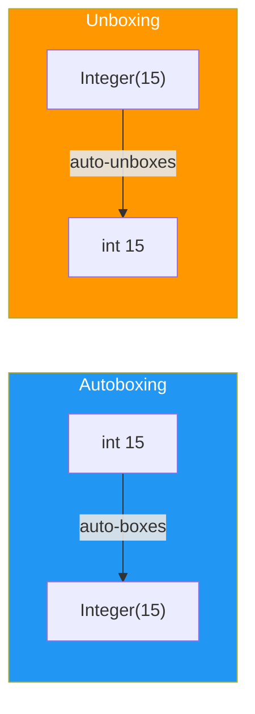
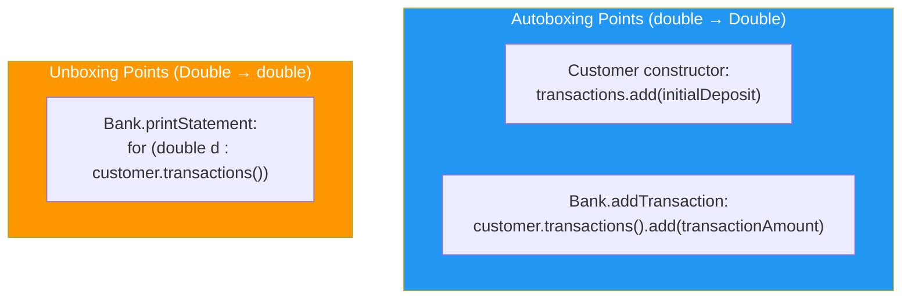

# :material-pencil: Topic Note: Autoboxing, Unboxing & Enums

> **Course:** Java Programming Masterclass - Tim Buchalka (Udemy)

> **Section:** 10 - Mastering Lists, Iterators, and Autoboxing (Part 3: Autoboxing + Enums)

> **Status:** :material-check-circle: Complete (Part 4 of Topic 3)

---

## :material-target: Learning Objectives

- [x] Understand why wrapper classes exist and when they are needed
- [x] Manually box primitives using `valueOf()` and understand deprecated `new Integer()` constructors
- [x] Leverage **autoboxing** (primitive → wrapper) and **unboxing** (wrapper → primitive) in variable assignments, method parameters, and return types
- [x] Apply autoboxing/unboxing with arrays, varargs, and ArrayLists
- [x] Build a simple Banking application using `ArrayList<Double>` with autoboxing/unboxing
- [x] Declare and use `enum` types with predefined constants
- [x] Use enum methods: `name()`, `ordinal()`, `values()`
- [x] Switch on enum values in enhanced switch statements
- [x] Add custom methods to an enum type

---

## Part A: Autoboxing & Unboxing

## :material-head-cog: 1. Why Wrapper Classes Matter

Java has 8 primitive types (`int`, `double`, `char`, etc.) that are **not objects**. This causes a problem:

```java
// ❌ WON'T COMPILE — generics don't accept primitives
LinkedList<int> numbers = new LinkedList<>();

// ✅ Must use the wrapper class instead
LinkedList<Integer> numbers = new LinkedList<>();
```

!!! warning "The Core Problem"

    Collections like `ArrayList`, `LinkedList`, and all generic types (`List<T>`, `Map<K,V>`, etc.) **require objects, not primitives**. You cannot write `ArrayList<int>` — only `ArrayList<Integer>`.

### Primitive ↔ Wrapper Class Mapping

| Primitive | Wrapper Class   | Size    |
| --------- | --------------- | ------- |
| `byte`    | `Byte`          | 8 bits  |
| `short`   | `Short`         | 16 bits |
| `int`     | **`Integer`**   | 32 bits |
| `long`    | `Long`          | 64 bits |
| `float`   | `Float`         | 32 bits |
| `double`  | **`Double`**    | 64 bits |
| `char`    | **`Character`** | 16 bits |
| `boolean` | `Boolean`       | 1 bit   |

!!! info "Naming Convention"

    Most wrapper classes are simply the capitalized form of the primitive (`double` → `Double`). The exceptions are `int` → `Integer` and `char` → `Character`.

---

## :material-head-cog: 2. Manual Boxing & Unboxing

### Boxing: Primitive → Wrapper

```java
// Method 1: Factory method (preferred manual way)
Integer boxedInt = Integer.valueOf(15);

// Method 2: Constructor (DEPRECATED since JDK 9 — do NOT use)
Integer deprecatedBoxing = new Integer(15);  // ⚠️ Marked for removal
```

Java's own documentation states:

> _"It is rarely appropriate to use this constructor. The static factory `valueOf(int)` is generally a better choice, as it is likely to yield significantly better space and time performance."_

The `valueOf()` method uses **caching** internally — for `Integer`, values between -128 and 127 are cached and reused, avoiding new object creation.

### Unboxing: Wrapper → Primitive

```java
Integer boxedValue = Integer.valueOf(15);
int unboxedInt = boxedValue.intValue();       // Manual unboxing

Double boxedDouble = Double.valueOf(3.14);
double unboxedDouble = boxedDouble.doubleValue(); // Manual unboxing
```

Each wrapper class has a corresponding `xxxValue()` method: `intValue()`, `doubleValue()`, `charValue()`, `booleanValue()`, etc.

!!! tip "You Almost Never Need Manual Boxing/Unboxing"

    IntelliJ will flag both `Integer.valueOf()` and `.intValue()` as **unnecessary boxing/unboxing**. Java handles this automatically — which brings us to autoboxing.

---

## :material-head-cog: 3. Autoboxing & Unboxing — Let Java Do the Work

### Autoboxing (Primitive → Wrapper, Automatically)

```java
Integer autoBoxed = 15;           // Java auto-boxes int → Integer
Double autoBoxedDouble = 3.14;    // Java auto-boxes double → Double
```

Underneath, Java is calling `Integer.valueOf(15)` for you, choosing the most efficient mechanism.

### Auto-Unboxing (Wrapper → Primitive, Automatically)

```java
Integer autoBoxed = 15;
int autoUnboxed = autoBoxed;      // Java auto-unboxes Integer → int
```



### Important Limitation

```java
Integer autoBoxed = 15;
System.out.println(autoBoxed.getClass().getName());  // ✅ java.lang.Integer

int autoUnboxed = autoBoxed;
// System.out.println(autoUnboxed.getClass().getName());  // ❌ COMPILER ERROR!
```

You **cannot** call methods on a primitive variable. `getClass()` is an inherited method from `Object`, and primitives are not objects.

---

## :material-head-cog: 4. Autoboxing in Method Parameters & Return Types

Autoboxing works seamlessly across method boundaries:

### Return Type Autoboxing

```java
private static Double getDoubleObject() {
    return Double.valueOf(100.00);    // Returns a wrapper object
}

private static double getLiteralDoublePrimitive() {
    return 100.0;                     // Returns a primitive
}
```

```java
// Auto-boxes: method returns a primitive, but assigned to wrapper
Double resultBoxed = getLiteralDoublePrimitive();

// Auto-unboxes: method returns a wrapper, but assigned to primitive
double resultUnboxed = getDoubleObject();
```

### Parameter Type Autoboxing

```java
private static int returnAnInt(Integer i) {
    return i;    // Unboxes Integer → int for the return type
}

private static Integer returnAnInteger(int i) {
    return i;    // Autoboxes int → Integer for the return type
}
```

The JVM handles all conversions transparently:

| Scenario                                              | What Happens |
| ----------------------------------------------------- | ------------ |
| Assign primitive to wrapper variable                  | Autoboxing   |
| Assign wrapper to primitive variable                  | Unboxing     |
| Pass primitive to method expecting wrapper parameter  | Autoboxing   |
| Pass wrapper to method expecting primitive parameter  | Unboxing     |
| Return primitive from method with wrapper return type | Autoboxing   |
| Return wrapper from method with primitive return type | Unboxing     |

---

## :material-head-cog: 5. Autoboxing with Arrays, Varargs & Lists

### Wrapper Arrays

```java
// Array of Integer wrappers (not int primitives)
Integer[] wrapperArray = new Integer[5];
wrapperArray[0] = 50;                          // Autoboxes int → Integer
System.out.println(Arrays.toString(wrapperArray));
// [50, null, null, null, null]

System.out.println(wrapperArray[0].getClass().getName());
// java.lang.Integer
```

!!! warning "Default Values Differ"

    - `int[]` elements default to **`0`**

    - `Integer[]` elements default to **`null`** (they are object references)

### Array Initializer with Autoboxing

```java
Character[] charArray = {'a', 'b', 'c'};       // Autoboxes char → Character
System.out.println(Arrays.toString(charArray));
// [a, b, c]
```

### Varargs with Autoboxing

```java
private static ArrayList<Integer> getList(int... varargs) {
    ArrayList<Integer> alist = new ArrayList<>();
    for (int i : varargs) {
        alist.add(i);           // Autoboxes each int → Integer
    }
    return alist;
}
```

Calling this method with primitive literals:

```java
var ourList = getList(1, 2, 3, 4, 5);
System.out.println(ourList);     // [1, 2, 3, 4, 5]
```

The `add()` method on `ArrayList<Integer>` expects an `Integer` parameter, but accepts `int` primitives through autoboxing.

!!! info "Varargs Type Doesn't Matter"

    - You can change the parameter type from `int... varargs` to `Integer... varargs`

    - the code still works identically. The JVM auto-boxes the literal `int` values passed to the method before they're added to the varargs array.

### Using `List.of()` with Primitives

```java
var ourList = List.of(1, 2, 3, 4, 5);    // Autoboxes to List<Integer>
```

This is the simplest way to create an immutable list of integers. Each literal is auto-boxed to an `Integer` instance.

---

## :material-head-cog: 6. Banking Challenge — Autoboxing in Practice

This challenge demonstrates autoboxing and unboxing in a real-world scenario: a simple banking application.

### The `Customer` Record

```java
record Customer(String name, ArrayList<Double> transactions) {

    public Customer(String name, double initialDeposit) {
        this(name.toUpperCase(),
                new ArrayList<Double>(500));   // Capacity hint: ~500 transactions/year
        transactions.add(initialDeposit);       // ← AUTOBOXING: double → Double
    }
}
```

**Key points:**

- The canonical constructor takes a `String` and an `ArrayList<Double>`
- The custom constructor takes a **primitive `double`** — autoboxing occurs when `add()` is called
- `name.toUpperCase()` normalizes customer names for case-insensitive matching
- Initial capacity `500` prevents incremental reallocations for typical usage

### The `Bank` Class

```java
class Bank {
    private String name;
    private ArrayList<Customer> customers = new ArrayList<>(5000);

    public Bank(String name) {
        this.name = name;
    }
```

!!! info "Encapsulation Pattern"

    The `customers` list has **no getter**. External code cannot access or modify the customer list directly — all operations go through Bank's public methods. This is a key OOP design principle.

### Finding a Customer

```java
private Customer getCustomer(String customerName) {
    for (var customer : customers) {
        if (customer.name().equalsIgnoreCase(customerName))
            return customer;
    }
    System.out.printf("Customer (%s) wasn't found %n", customerName);
    return null;
}
```

- **`private`** — only the Bank can look up customers
- Uses **case-insensitive** comparison (`equalsIgnoreCase`)
- Returns `null` if no match (simple error handling for this challenge)

### Adding a New Customer (with Duplicate Prevention)

```java
public void addNewCustomer(String customerName, double initialDeposit) {
    if (getCustomer(customerName) == null) {
        Customer customer = new Customer(customerName, initialDeposit);
        customers.add(customer);
        System.out.println("New Customer added: " + customer);
    }
}
```

Note: `getCustomer` prints "not found" when checking for duplicates during `addNewCustomer`. In production code, you'd separate the "exists" check from the "not found" message.

### Adding a Transaction (Autoboxing)

```java
public void addTransaction(String name, double transactionAmount) {
    Customer customer = getCustomer(name);
    if (customer != null) {
        customer.transactions().add(transactionAmount);   // ← AUTOBOXING
    }
}
```

`transactionAmount` is a **primitive `double`** → the `add()` method on `ArrayList<Double>` **autoboxes** it to a `Double` wrapper object.

### Printing a Statement (Unboxing)

```java
public void printStatement(String customerName) {
    Customer customer = getCustomer(customerName);
    if (customer == null) {
        return;
    }
    System.out.println("_".repeat(30));
    System.out.println("Customer Name: " + customer.name());
    System.out.println("Transactions: ");
    for (double d : customer.transactions()) {      // ← UNBOXING
        System.out.printf("$%10.2f (%s)%n",
                d, d < 0 ? "Debit" : "Credit");
    }
}
```

**This is the unboxing part:** The for-each loop iterates over `ArrayList<Double>` (wrapper objects), but the loop variable `d` is declared as a **primitive `double`**. Each `Double` wrapper object is automatically unboxed to `double`.

### Usage & Output

```java
Bank bank = new Bank("Chase");
bank.addNewCustomer("Jane A", 1000);

bank.addTransaction("Jane A", -10.25);    // Debit
bank.addTransaction("Jane A", -75.01);    // Debit
bank.printStatement("Jane A");

bank.addNewCustomer("Bob S", 25);
bank.addTransaction("Bob S", 100);        // Credit
bank.printStatement("Bob S");
```

```text
______________________________
Customer Name: JANE A
Transactions:
$   1000.00 (Credit)
$    -10.25 (Debit)
$    -75.01 (Debit)
______________________________
Customer Name: BOB S
Transactions:
$     25.00 (Credit)
$    100.00 (Credit)
```

### Where Autoboxing/Unboxing Occurs



---

# Part B: Enums

## :material-head-cog: 7. What Is an Enum?

An **enum** (short for enumeration) is a special Java type that contains a fixed set of **predefined constants**.

> **Wikipedia:** _"A complete ordered listing of all the items in a collection."_
>
> **Java:** _"A special data type that contains predefined constants."_

An enum is like an array, except:

- Its elements are **known at compile time** and **cannot change**
- Each element is referred to by a **named constant**, not an index
- The keyword **`enum`** replaces `class`

### Declaring an Enum

```java
public enum DayOfTheWeek {
    SUN, MON, TUE, WED, THU, FRI, SAT
}
```

**Conventions:**

- Enum name: **UpperCamelCase** (like a class)
- Constants: **ALL_UPPERCASE** (like final static fields)
- No semicolon needed after the last constant (unless you add methods/fields)

### Common Enum Examples

```java
enum Month       { JANUARY, FEBRUARY, MARCH, /* ... */ DECEMBER }
enum Direction    { NORTH, EAST, SOUTH, WEST }
enum Size         { EXTRA_SMALL, SMALL, MEDIUM, LARGE, EXTRA_LARGE }
```

!!! info "Enums Are Classes Underneath"

    Each enum constant is actually an **instance** of the enum class. Enums can have fields, methods, and constructors — they are much more than simple constant lists.

---

## :material-head-cog: 8. Using Enums in Code

### Declaring and Assigning

```java
DayOfTheWeek weekDay = DayOfTheWeek.TUE;
System.out.println(weekDay);      // TUE
```

### Built-in Enum Methods

| Method      | Returns      | Description                                         |
| ----------- | ------------ | --------------------------------------------------- |
| `name()`    | `String`     | The constant's name as declared (e.g., `"TUE"`)     |
| `ordinal()` | `int`        | Zero-based position in the enum (e.g., `TUE` → `2`) |
| `values()`  | `EnumType[]` | Array of all constants in declaration order         |

```java
System.out.printf("Name is %s, Ordinal Value = %d%n",
        weekDay.name(), weekDay.ordinal());
// Name is TUE, Ordinal Value = 2
```

!!! warning "Ordinal is Zero-Based"

    Like arrays and lists, enum ordinals start at **0**. `SUN` is ordinal `0`, `SAT` is ordinal `6`. If you want 1-based numbering (e.g., "Day 1"), add 1: `weekDay.ordinal() + 1`.

### Comparing Enums

```java
if (weekDay == DayOfTheWeek.FRI) {
    System.out.println("Found Friday!");
}
```

Use `==` (not `.equals()`) for enum comparison — enum constants are **singletons**, so reference equality works perfectly and is preferred.

### Iterating Over All Constants with `values()`

```java
for (DayOfTheWeek day : DayOfTheWeek.values()) {
    System.out.println(day.name() + " (ordinal: " + day.ordinal() + ")");
}
```

The `values()` method returns a **new array** of all enum constants in declaration order. You can use this array with enhanced `for`, indexed access, or `Random`:

### Random Enum Value

```java
public static DayOfTheWeek getRandomDay() {
    int randomInteger = new Random().nextInt(7);   // 0–6
    var allDays = DayOfTheWeek.values();            // Returns DayOfTheWeek[]
    return allDays[randomInteger];
}
```

Because `values()` returns a regular Java array, you can index into it with `[]`.

---

## :material-head-cog: 9. Enums in Switch Statements

Enums work as switch expressions — this is one of their most powerful features:

```java
public static void switchDayOfWeek(DayOfTheWeek weekDay) {
    int weekDayInteger = weekDay.ordinal() + 1;

    switch (weekDay) {
        case WED -> System.out.println("Wednesday is day " + weekDayInteger);
        case SAT -> System.out.println("Saturday is day " + weekDayInteger);
        default -> System.out.println(
                weekDay.name().charAt(0) +
                weekDay.name().substring(1).toLowerCase() +
                " is day " + weekDayInteger);
    }
}
```

**Key observations:**

1. The switch expression is the **enum variable** itself (`weekDay`)
2. Case labels use the **constant name without the enum type prefix** — just `WED`, not `DayOfTheWeek.WED`
3. The `default` branch uses String manipulation to convert `"TUE"` → `"Tue"` → `"Tuesday is day 3"`

!!! info "Switch Expression Types"

    You can switch on: `int`, `char`, `byte`, `short`, `String`, and **`enum`**. Enum switches are especially readable because the case labels are human-readable constant names.

---

## :material-head-cog: 10. Adding Custom Methods to Enums

Since enums are classes, you can add methods. **You must add a semicolon** after the last constant before adding any members:

### The `Topping` Enum with `getPrice()` Method

```java
public enum Topping {
    MUSTARD,
    PICKLES,
    BACON,
    CHEDDAR,
    TOMATO;                  // ← SEMICOLON required before methods

    public double getPrice() {
        return switch (this) {          // Switch on the enum instance itself
            case MUSTARD, PICKLES -> 0.50;
            case BACON -> 1.50;
            case CHEDDAR -> 1.00;
            case TOMATO -> 0.75;
        };
    }
}
```

**Key points:**

- The `switch (this)` expression refers to the **current enum instance** calling the method
- Enhanced switch with `->` returns different values per constant
- Multiple case labels can share a result: `case MUSTARD, PICKLES -> 0.50`
- No `default` needed — enum switch covers all possible values (compiler verifies exhaustiveness)

### Using the Custom Method

```java
for (Topping topping : Topping.values()) {
    System.out.println(topping.name() + " : " + topping.getPrice());
}
```

```text
MUSTARD : 0.5
PICKLES : 0.5
BACON : 1.5
CHEDDAR : 1.0
TOMATO : 0.75
```

### Alternative: Enum with Fields and Constructors (Preview)

Another approach (covered in depth later in the course) uses a field and constructor:

```java
public enum Topping {
    MUSTARD(0.50),
    PICKLES(0.50),
    BACON(1.50),
    CHEDDAR(1.00),
    TOMATO(0.75);

    private final double price;

    Topping(double price) {
        this.price = price;
    }

    public double getPrice() {
        return price;
    }
}
```

This pattern is more scalable when enums have multiple associated values.

---

## :material-alert: Common Pitfalls Summary

| Pitfall                                  | Example                                    | Fix                                        |
| ---------------------------------------- | ------------------------------------------ | ------------------------------------------ |
| Using primitive in generic type          | `ArrayList<int>`                           | Use wrapper: `ArrayList<Integer>`          |
| Using deprecated wrapper constructors    | `new Integer(15)`                          | Use `Integer.valueOf(15)` or just `15`     |
| Calling methods on primitives            | `autoUnboxed.getClass()`                   | Use the wrapper variable instead           |
| Unboxing `null` → `NullPointerException` | `Integer x = null; int y = x;`             | Check for `null` before unboxing           |
| Forgetting semicolon in enum             | Adding methods without `;` after constants | Add `;` after last constant before methods |
| Using enum type prefix in switch case    | `case DayOfTheWeek.WED:`                   | Just use `case WED:`                       |
| Assuming ordinal is 1-based              | `weekDay.ordinal()` for "Day 1"            | Add 1: `weekDay.ordinal() + 1`             |

!!! danger "The Most Dangerous Pitfall: Unboxing `null`"

    ```java
    Integer maybeNull = null;
    int value = maybeNull;         // 💥 NullPointerException at runtime!
    ```

    - When a wrapper variable is `null` and Java tries to unbox it, you get a **`NullPointerException`**. This compiles without issues
    - the error only appears at runtime. Always check for `null` before unboxing, especially with values from collections or method returns.

---

## :material-lightbulb-on: Key Takeaways

### Autoboxing & Unboxing

1. **Collections require objects, not primitives** — this is the fundamental reason wrapper classes exist.
2. **Autoboxing** (`int` → `Integer`) and **unboxing** (`Integer` → `int`) happen automatically in assignments, method parameters, return types, and enhanced loops.
3. **Prefer autoboxing** over manual `valueOf()` or deprecated constructors — let Java choose the most efficient mechanism.
4. **Wrapper arrays default to `null`**, not `0` — a common source of `NullPointerException`.
5. **Performance consideration**: Excessive boxing/unboxing in tight loops can cause unnecessary object creation. Use primitive arrays when performance matters significantly.

### Enums

6. **Enums are fixed, ordered sets of named constants** — use them instead of `int` or `String` constants for type safety.
7. **Enum constants are singletons** — compare with `==`, not `.equals()`.
8. **`values()` returns an array** — iterate with enhanced `for` or index into it for random access.
9. **Enums work in switch statements** — case labels use the constant name without type prefix.
10. **Enums can have methods, fields, and constructors** — they are full-featured classes with a fixed number of instances.

---

## :material-pin: Quick Reference

### Wrapper Class Methods

| Method                     | Description               | Example                  |
| -------------------------- | ------------------------- | ------------------------ |
| `Type.valueOf(primitive)`  | Manual boxing (factory)   | `Integer.valueOf(15)`    |
| `wrapper.typeValue()`      | Manual unboxing           | `myInt.intValue()`       |
| `Type.parseType(string)`   | Parse string to primitive | `Integer.parseInt("42")` |
| `Type.toString(primitive)` | Convert to String         | `Integer.toString(42)`   |
| `Type.MAX_VALUE`           | Maximum value for type    | `Integer.MAX_VALUE`      |
| `Type.MIN_VALUE`           | Minimum value for type    | `Double.MIN_VALUE`       |

### Enum Methods

| Method             | Returns      | Description                                                  |
| ------------------ | ------------ | ------------------------------------------------------------ |
| `name()`           | `String`     | Constant name exactly as declared                            |
| `ordinal()`        | `int`        | Zero-based position in the enum                              |
| `values()`         | `EnumType[]` | Array of all constants (static)                              |
| `valueOf(String)`  | `EnumType`   | Look up constant by name (throws `IllegalArgumentException`) |
| `compareTo(other)` | `int`        | Compare ordinal positions                                    |
| `toString()`       | `String`     | Same as `name()` by default, can be overridden               |

---

## :material-navigation: Related Notes

| Part | Topic                              | Link                            |
| :--: | ---------------------------------- | ------------------------------- |
|  1   | Arrays & `java.util.Arrays`        | [← Part 1](topic-note.md)       |
|  2   | ArrayList — Java's Resizable Array | [← Part 2](topic-note-part2.md) |
|  3   | LinkedList & Iterators             | [← Part 3](topic-note-part3.md) |
|  4   | Autoboxing, Unboxing & Enums       | **You are here**                |

---

## :material-bookshelf: References

- **Course:** Tim Buchalka - Java Programming Masterclass (Section 10, Lectures 15–18, 20–21)
- **API:** [java.lang.Integer (Java 17)](https://docs.oracle.com/en/java/javase/17/docs/api/java.base/java/lang/Integer.html)
- **API:** [java.lang.Enum (Java 17)](https://docs.oracle.com/en/java/javase/17/docs/api/java.base/java/lang/Enum.html)
- **Guide:** [Autoboxing and Unboxing (Oracle Tutorial)](https://docs.oracle.com/javase/tutorial/java/data/autoboxing.html)
- **Guide:** [Enum Types (Oracle Tutorial)](https://docs.oracle.com/javase/tutorial/java/javaOO/enum.html)

---

_Last Updated: 2026-02-11 | Confidence: 9/10_
