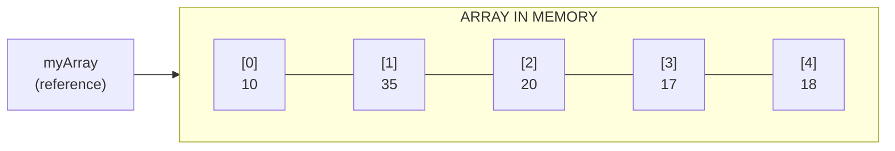
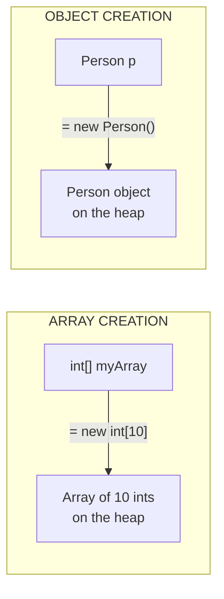
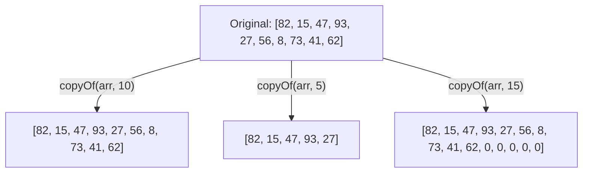
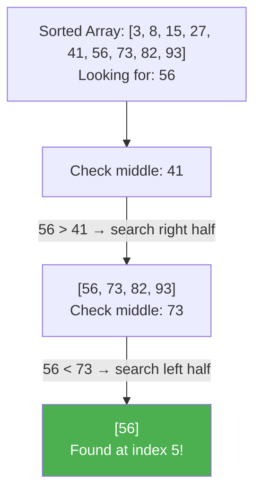
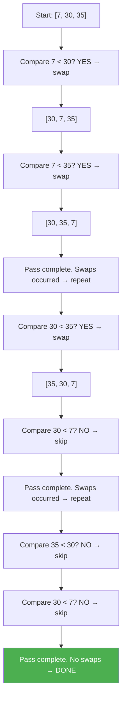
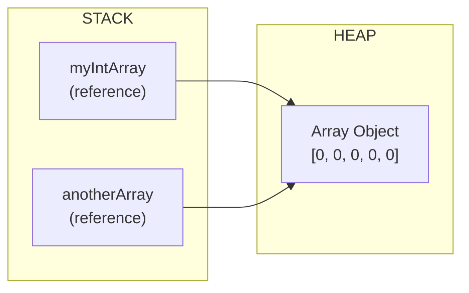
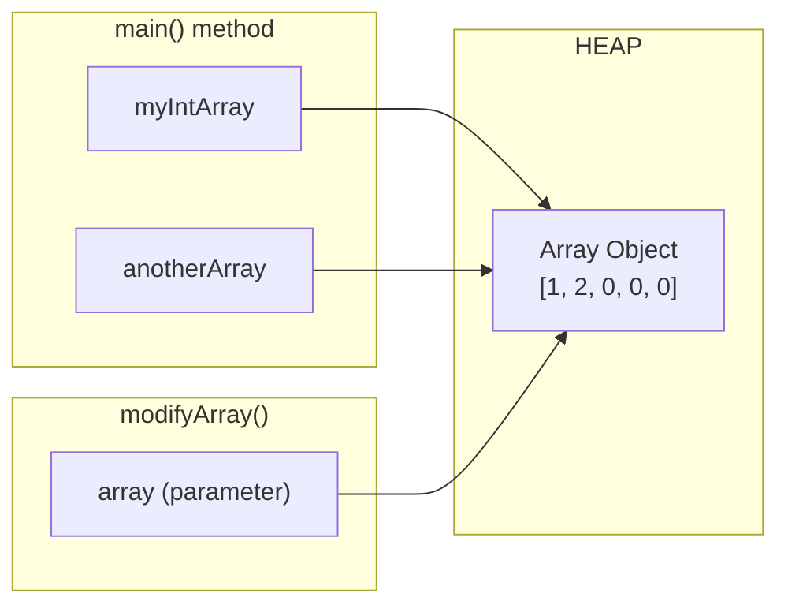
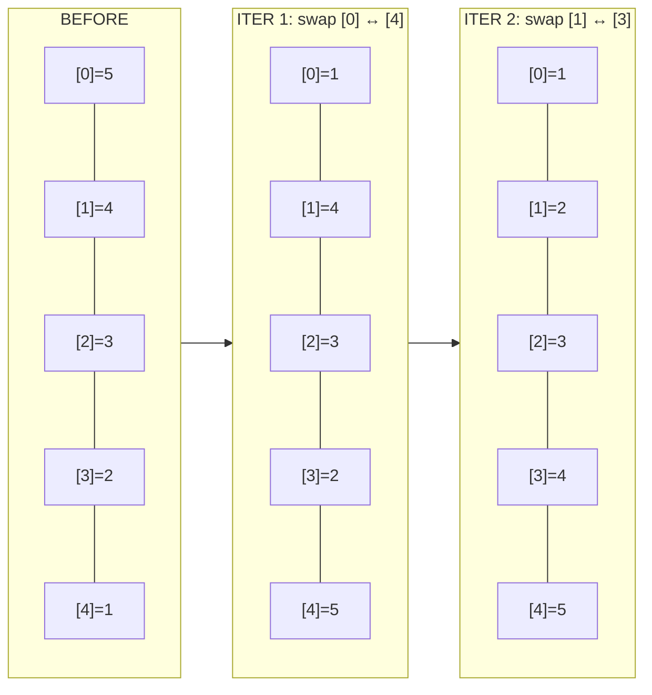
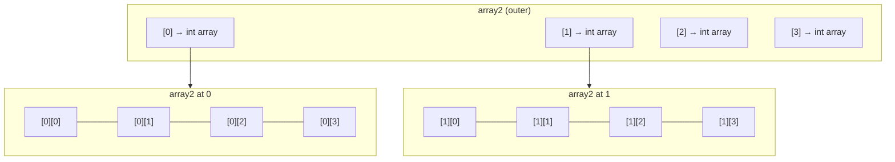

# :material-pencil: Topic Note: Advanced Arrays in Java

> **Course:** Java Programming Masterclass - Tim Buchalka (Udemy).

> **Section:** 09 - Advanced Arrays in Java: Single & Multi-Dimensional Techniques

> **Status:** :material-check-circle: Complete (Part 1 of Topic 3)

---

## :material-target: Learning Objectives

- [x] Understand what an array is and how Java implements it
- [x] Master all forms of array declaration and initialization
- [x] Loop through arrays with traditional `for` and enhanced `for-each`
- [x] Use the `java.util.Arrays` helper class effectively
- [x] Understand binary search prerequisites and behavior
- [x] Identify and avoid common array pitfalls
- [x] Understand arrays as reference types (and what that means for methods)
- [x] Use variable arguments (varargs) in methods
- [x] Work with two-dimensional and multi-dimensional arrays

---

## :material-head-cog: 1. What Is an Array?

An **array** is a data structure that stores a **fixed number of values**, all of the **same type**, in a **contiguous block of memory**.

### Why Arrays Exist

Before arrays, if you needed multiple values of the same type (e.g., 10 toppings for a burger), you had to create individual variables for each one. This leads to:

- Repetitive, hard-to-maintain code
- No way to loop through the values
- A fixed structure that can't scale

Arrays solve this by grouping values under a single variable name, accessible by index.

### Key Facts

| Property     | Detail                                                   |
| ------------ | -------------------------------------------------------- |
| **Type**     | Special class in Java (inherits from `java.lang.Object`) |
| **Size**     | Fixed at creation time — cannot grow or shrink           |
| **Indexing** | Zero-based (first element is at index `0`)               |
| **Types**    | Can hold any primitive type or any object type           |
| **Memory**   | Stored on the heap (the variable holds a reference)      |



---

## :material-head-cog: 2. Declaring, Initializing, and Accessing Arrays

### Declaration Styles

```java
// Style 1: Brackets after the type (PREFERRED)
int[] myArray;

// Style 2: Also brackets after the type
int[] myArray;

// Style 3: Brackets after the variable name (valid but less common)
int myArray[];
```

!!! tip "Convention"

    Always place brackets after the type (`int[]`), not after the variable name. This is the standard Java convention and makes the type clearer.

### Instantiation with `new`

```java
int[] myIntArray = new int[10];  // Array of 10 integers
```

Under the covers, a Java array is a **specialized class**, which is why the `new` keyword is used. Two key differences from regular object creation:

1. **Square brackets are required** with a size specified inside
2. **No parentheses** — you cannot pass data to an array constructor



### Array Initializers

If you know the values upfront, use an **array initializer**:

```java
// Explicit array initializer (with new keyword)
int[] firstTen = new int[]{1, 2, 3, 4, 5, 6, 7, 8, 9, 10};

// Anonymous array initializer (shorthand — only in declaration)
int[] firstTen = {1, 2, 3, 4, 5, 6, 7, 8, 9, 10};

// String array with anonymous initializer
String[] names = {"Andy", "Bob", "Charlie", "Dave", "Eve"};
```

!!! warning "Anonymous Initializer Restriction"

    The anonymous initializer (`{1, 2, 3}`) can **only** be used in a declaration statement. If you assign on a separate line, you **must** use the explicit form:

    ```java
    int[] newArray;
    // newArray = {5, 4, 3, 2, 1};           // COMPILE ERROR!
    newArray = new int[]{5, 4, 3, 2, 1};      // OK
    ```

### Accessing Elements

```java
int[] firstTen = {1, 2, 3, 4, 5, 6, 7, 8, 9, 10};

int first = firstTen[0];                        // 1 (first element)
int last  = firstTen[firstTen.length - 1];      // 10 (last element)

// WRONG — causes ArrayIndexOutOfBoundsException!
// int oops = firstTen[firstTen.length];        // Index 10 is out of bounds!
```

### The `.length` Field

Every array has a **field** (not a method) called `length`:

```java
int arrayLength = firstTen.length;  // 10
```

!!! info "Field vs Method"

    `.length` is a **field** on arrays (no parentheses). This is different from `String.length()` which is a **method** (with parentheses).

---

## :material-head-cog: 3. Default Values

When you create an array without an initializer, Java sets every element to the **default value** for that type:

| Array Type                             | Default Value               |
| -------------------------------------- | --------------------------- |
| `int[]`, `long[]`, `short[]`, `byte[]` | `0`                         |
| `double[]`, `float[]`                  | `0.0`                       |
| `boolean[]`                            | `false`                     |
| `char[]`                               | `'\u0000'` (null character) |
| `String[]`, `Object[]`, any class      | `null`                      |

```java
int[] zeros = new int[5];
// zeros → [0, 0, 0, 0, 0]
```

---

## :material-head-cog: 4. Looping Through Arrays

### Traditional `for` Loop

Use when you **need the index** — for setting values, swapping, or accessing by position:

```java
int[] newArray = new int[5];

// Populate with computed values (5, 4, 3, 2, 1)
for (int i = 0; i < newArray.length; i++) {
    newArray[i] = newArray.length - i;
}

// Print each element
for (int i = 0; i < newArray.length; i++) {
    System.out.print(newArray[i] + " ");
}
// Output: 5 4 3 2 1
```

### Enhanced `for-each` Loop

Use when you **only need to read** elements from start to finish:

```java
for (int element : newArray) {
    System.out.print(element + " ");
}
// Output: 5 4 3 2 1
```

### Side-by-Side Comparison

```java
// Traditional for loop                    // Enhanced for-each loop
for (int i = 0; i < arr.length; i++) {     for (int element : arr) {
    System.out.print(arr[i]);                  System.out.print(element);
}                                          }
```

| Aspect              | Traditional `for`          | Enhanced `for-each`   |
| ------------------- | -------------------------- | --------------------- |
| **Syntax**          | 3 components, semicolons   | 2 components, colon   |
| **Index access**    | Yes (`i`)                  | No                    |
| **Modify elements** | Yes                        | No (can't set values) |
| **Error-prone**     | More (off-by-one)          | Less                  |
| **Best for**        | Setting, swapping, sorting | Reading, printing     |

!!! tip "Rule of Thumb"

    Use the **enhanced for-each** loop as your default. Only fall back to the traditional `for` loop when you need to modify elements or need the index.

---

## :material-head-cog: 5. Printing Arrays

### The `println` Gotcha

```java
int[] myArray = {5, 4, 3, 2, 1};
System.out.println(myArray);
// Output: [I@6d06d69c   ← NOT the elements!
```

Why? Printing an array directly calls `Object.toString()`, which returns:

- `[I` — indicates a primitive `int` array
- `@6d06d69c` — hexadecimal hash code

### The Correct Way: `Arrays.toString()`

```java
import java.util.Arrays;

System.out.println(Arrays.toString(myArray));
// Output: [5, 4, 3, 2, 1]
```

For multi-dimensional arrays, use `Arrays.deepToString()`:

```java
int[][] matrix = {{1, 2}, {3, 4}};
System.out.println(Arrays.deepToString(matrix));
// Output: [[1, 2], [3, 4]]
```

---

## :material-head-cog: 6. The `java.util.Arrays` Helper Class

Java's array type is very basic — it only has the `.length` field and inherits from `Object`. The `java.util.Arrays` class provides **static utility methods** for common operations.

### `Arrays.sort()` — Sorting

Sorts elements in **ascending (natural) order**. Modifies the array in place (void return):

```java
int[] firstArray = getRandomArray(10);
System.out.println(Arrays.toString(firstArray));
// Output: [82, 15, 47, 93, 27, 56, 8, 73, 41, 62]

Arrays.sort(firstArray);
System.out.println(Arrays.toString(firstArray));
// Output: [8, 15, 27, 41, 47, 56, 62, 73, 82, 93]
```

### `Arrays.fill()` — Filling

Sets **all elements** to a specified value:

```java
int[] secondArray = new int[10];
System.out.println(Arrays.toString(secondArray));
// Output: [0, 0, 0, 0, 0, 0, 0, 0, 0, 0]

Arrays.fill(secondArray, 5);
System.out.println(Arrays.toString(secondArray));
// Output: [5, 5, 5, 5, 5, 5, 5, 5, 5, 5]
```

### `Arrays.copyOf()` — Copying

Creates a **new array** (a new object in memory). Three modes:

```java
int[] thirdArray = getRandomArray(10);

// 1. Exact copy (same length)
int[] fourthArray = Arrays.copyOf(thirdArray, thirdArray.length);

// 2. Partial copy (first 5 elements only)
int[] smallerArray = Arrays.copyOf(thirdArray, 5);

// 3. Expanded copy (original + 5 extra zeros)
int[] largerArray = Arrays.copyOf(thirdArray, 15);
```



!!! info "Copy Independence"

    Operations on the copy (like `sort` or `fill`) do **not** affect the original array. For primitives, values are copied. For objects, references are copied (shallow copy).

### `Arrays.equals()` — Equality Check

Two arrays are equal if they have the **same length** and **same elements in the same order**:

```java
int[] s1 = {1, 2, 3, 4, 5};
int[] s2 = {1, 2, 3, 4, 5};
System.out.println(Arrays.equals(s1, s2));  // true

int[] s3 = {5, 2, 3, 4, 1};  // Same values, different order
System.out.println(Arrays.equals(s1, s3));  // false

int[] s4 = {1, 2, 3, 4, 5, 0};  // Different length
System.out.println(Arrays.equals(s1, s4));  // false
```

### Complete Helper Class Reference

| Method                          | Returns   | Modifies Original? | Description                              |
| ------------------------------- | --------- | ------------------ | ---------------------------------------- |
| `Arrays.toString(arr)`          | `String`  | No                 | Formatted string of elements             |
| `Arrays.deepToString(arr)`      | `String`  | No                 | Formatted string for multi-dimensional   |
| `Arrays.sort(arr)`              | `void`    | **Yes**            | Sorts in ascending order                 |
| `Arrays.fill(arr, val)`         | `void`    | **Yes**            | Sets all elements to `val`               |
| `Arrays.copyOf(arr, len)`       | New array | No                 | Creates a copy with specified length     |
| `Arrays.binarySearch(arr, key)` | `int`     | No                 | Finds position of `key` (must be sorted) |
| `Arrays.equals(arr1, arr2)`     | `boolean` | No                 | Checks structural equality               |

### The `getRandomArray` Helper Method

This utility method is used throughout the course examples:

```java
private static int[] getRandomArray(int len) {
    Random random = new Random();
    int[] arr = new int[len];
    for (int i = 0; i < len; i++) {
        arr[i] = random.nextInt(100);  // 0 to 99 (exclusive upper bound)
    }
    return arr;
}
```

!!! info "`Random.nextInt(bound)`"

    The argument is an **exclusive upper bound**. `nextInt(100)` returns a random integer from 0 to 99. To include 100, pass `101`.

---

## :material-head-cog: 7. Binary Search Deep Dive

### How It Works

Binary search is an **interval search** — instead of checking every element one by one (linear search), it repeatedly divides the search space in half.

Think of finding a word in a dictionary: you don't start on page 1 — you open to roughly where you think the word is, then narrow down.



### Prerequisites and Rules

| Requirement                     | Why                                                              |
| ------------------------------- | ---------------------------------------------------------------- |
| **Array MUST be sorted**        | Binary search assumes sorted order to decide which half to check |
| **Duplicates are unreliable**   | If duplicates exist, no guarantee which one is returned          |
| **Elements must be comparable** | Different types in the same array will cause errors              |

### Return Values

| Return Value     | Meaning                                                   |
| ---------------- | --------------------------------------------------------- |
| `>= 0`           | Position of a match (but not necessarily the first match) |
| `< 0` (negative) | Element was **not found**                                 |

### Code Example

```java
String[] arr = {"Able", "Jane", "Mark", "Ralph", "David"};

// MUST sort before binary search!
Arrays.sort(arr);
System.out.println(Arrays.toString(arr));
// Output: [Able, David, Jane, Mark, Ralph]

if (Arrays.binarySearch(arr, "David") >= 0) {
    System.out.println("David is in the array");
}
// Output: David is in the array
```

!!! warning "Unsorted Array + Binary Search = Unreliable Results"

    If you forget to sort, `binarySearch` may return incorrect results or miss elements entirely. **Always sort first.**

---

## :material-head-cog: 8. Sorting Challenge: Descending Order (Bubble Sort)

`Arrays.sort()` only sorts in ascending order. To sort **descending**, the course implements a manual **bubble sort** algorithm.

### The Algorithm

Bubble sort works by repeatedly comparing **adjacent elements** and swapping them if they're in the wrong order. The process repeats until no more swaps are needed.



### Full Implementation

```java
public static int[] sortIntegers(int[] array) {
    System.out.println(Arrays.toString(array));
    int[] sortedArray = Arrays.copyOf(array, array.length);
    boolean flag = true;
    int temp;
    while (flag) {
        flag = false;
        for (int i = 0; i < sortedArray.length - 1; i++) {
            if (sortedArray[i] < sortedArray[i + 1]) {
                temp = sortedArray[i];
                sortedArray[i] = sortedArray[i + 1];
                sortedArray[i + 1] = temp;
                flag = true;
                System.out.println("----->" + Arrays.toString(sortedArray));
            }
        }
        System.out.println("--->" + Arrays.toString(sortedArray));
    }
    return sortedArray;
}
```

### Key Points

- **`flag` controls the `while` loop**: set to `false` at the start of each pass, flipped to `true` on any swap
- **`length - 1` in the `for` condition**: because we compare `[i]` with `[i+1]`, we stop one element early to avoid `ArrayIndexOutOfBoundsException`
- **`temp` variable for swapping**: you can't directly swap two values without losing one — store it temporarily first
- **Copy first**: `Arrays.copyOf()` ensures the original array is not mutated

---

## :material-head-cog: 9. Common Pitfalls and Best Practices

### Pitfall 1: Array Index Out of Bounds

```java
int[] myArray = {10, 35, 20, 17, 18};  // 5 elements, index 0-4

myArray[5] = 55;   // ArrayIndexOutOfBoundsException!
myArray[-1] = 10;  // ArrayIndexOutOfBoundsException!
```

!!! danger "Remember"

    Valid indices are `0` to `length - 1`. Index 5 on a 5-element array does **not** exist.

### Pitfall 2: Starting Loop at 1 Instead of 0

```java
// BUG: Skips the first element!
for (int i = 1; i < myArray.length; i++) {
    System.out.println(myArray[i]);
}
// Output: 35, 20, 17, 18  ← Missing 10!
```

### Pitfall 3: Using `<=` Instead of `<`

```java
// BUG: Causes ArrayIndexOutOfBoundsException on last iteration!
for (int i = 0; i <= myArray.length; i++) {
    System.out.println(myArray[i]);
}
// When i == 5: myArray[5] → CRASH!
```

**Fix:** Always use `<` with `.length`:

```java
for (int i = 0; i < myArray.length; i++) { ... }
```

### Best Practices Summary

| Practice                                             | Reason                                |
| ---------------------------------------------------- | ------------------------------------- |
| Use `<` not `<=` with `.length`                      | Avoids off-by-one errors              |
| Start loops at `i = 0`                               | Arrays are zero-indexed               |
| Prefer `for-each` for reading                        | Less error-prone, no index management |
| Use `for-each` from first to last when not modifying | Cleaner, more readable                |
| Use traditional `for` only when setting/swapping     | Need index access for modifications   |

---

## :material-head-cog: 10. Reference vs Value Types — Arrays in Memory

This is one of the most important concepts to understand about arrays.

### Arrays Are Reference Types

When you assign an array to a variable, the variable holds a **reference (address)** to the array object in memory, not the array data itself.

```java
int[] myIntArray = new int[5];
int[] anotherArray = myIntArray;  // Copies the REFERENCE, not the array!
```



Both variables point to the **same array in memory**. Changes through one reference are visible through the other:

```java
int[] myIntArray = new int[5];
int[] anotherArray = myIntArray;

System.out.println("myIntArray = " + Arrays.toString(myIntArray));
// Output: myIntArray = [0, 0, 0, 0, 0]

anotherArray[0] = 1;

System.out.println("after change myIntArray = " + Arrays.toString(myIntArray));
// Output: after change myIntArray = [1, 0, 0, 0, 0]  ← Changed!

System.out.println("after change anotherArray = " + Arrays.toString(anotherArray));
// Output: after change anotherArray = [1, 0, 0, 0, 0]
```

### Passing Arrays to Methods

When you pass an array to a method, Java copies the **reference** (the address), not the array. This means the method can **modify the original array**:

```java
private static void modifyArray(int[] array) {
    array[1] = 2;  // Modifies the ORIGINAL array!
}

public static void main(String[] args) {
    int[] myIntArray = new int[5];
    int[] anotherArray = myIntArray;

    anotherArray[0] = 1;
    modifyArray(myIntArray);  // Three references now: myIntArray, anotherArray, array (parameter)

    System.out.println("after change myIntArray = " + Arrays.toString(myIntArray));
    // Output: after change myIntArray = [1, 2, 0, 0, 0]
    System.out.println("after change anotherArray = " + Arrays.toString(anotherArray));
    // Output: after change anotherArray = [1, 2, 0, 0, 0]
}
```



!!! warning "Word of Caution"

    If you don't want a method to modify your array, **pass a copy** using `Arrays.copyOf()`:

    ```java
    modifyArray(Arrays.copyOf(myIntArray, myIntArray.length));
    // Original myIntArray remains unchanged
    ```

### The `new` Keyword = New Object

One way to know if you have a reference type: the `new` keyword creates a **new object in memory**.

- `int[] arr = new int[5]` → new array object on the heap
- `int[] arr2 = arr` → no `new`, just copies the reference

---

## :material-head-cog: 11. Variable Arguments (Varargs)

### What Is Varargs?

Varargs lets a method accept **zero, one, or many** arguments of the same type. Java automatically wraps them into an array.

```java
// Array parameter version
private static void printText(String[] textList) { ... }

// Varargs version (replace [] with ...)
private static void printText(String... textList) { ... }
```

Inside the method, `textList` is treated as a `String[]` — the code is identical. The difference is in **how callers invoke the method**:

```java
// All of these work with varargs:
printText(splitStrings);                     // Pass an array
printText("hello");                          // Pass a single string
printText("hello", "world", "again");        // Pass multiple strings
printText();                                 // Pass nothing (empty array)
```

### Varargs Rules

| Rule                                      | Detail                                                  |
| ----------------------------------------- | ------------------------------------------------------- |
| Only **one** varargs parameter per method | `void foo(int... a, int... b)` is **illegal**           |
| Must be the **last** parameter            | `void foo(int... a, String s)` is **illegal**           |
| Can be combined with other params         | `void foo(String delimiter, String... values)` is valid |

### `String.split()` and `String.join()`

The split method breaks a string into a `String[]` by a delimiter:

```java
String[] splitStrings = "Hello World Again".split(" ");
// splitStrings → ["Hello", "World", "Again"]
```

The join method (which uses varargs) does the opposite:

```java
String[] sArray = {"Tim", "Jan", "Ken", "Amy", "Bob"};
System.out.println(String.join(",", sArray));
// Output: Tim,Jan,Ken,Amy,Bob
```

!!! info "Why Delimiter Is First in `String.join()`"

    Because `join` uses varargs for the second parameter, and varargs **must be the last argument**, the delimiter has to come first.

### The `main` Method Uses Varargs

The main method signature can use either form—they are equivalent:

```java
public static void main(String[] args) { ... }   // Array form
public static void main(String... args) { ... }   // Varargs form
```

---

## :material-head-cog: 12. Challenges

### Challenge 1: Minimum Element

**Goal:** Read comma-separated integers from the user, find the minimum value.

```java
private static int[] readIntegers() {
    Scanner scanner = new Scanner(System.in);
    System.out.println("Enter a list of integers separated by commas:");
    String input = scanner.nextLine();

    String[] splits = input.split(",");
    int[] values = new int[splits.length];

    for (int i = 0; i < splits.length; i++) {
        values[i] = Integer.parseInt(splits[i].trim());
    }
    return values;
}

private static int findMinimum(int[] array) {
    int min = Integer.MAX_VALUE;
    for (int i : array) {
        if (i < min) {
            min = i;
        }
    }
    return min;
}
```

**Key Technique:** Initialize `min` to `Integer.MAX_VALUE` so the first comparison always sets it to the first element's value. Alternatively, set `min = array[0]` and loop from index 1.

### Challenge 2: Reverse Array In-Place (Mutating)

**Goal:** Reverse element order by swapping from the outside in.

```java
private static void reverse(int[] array) {
    int maxIndex = array.length - 1;
    int halfLength = array.length / 2;
    for (int i = 0; i < halfLength; i++) {
        int temp = array[i];
        array[i] = array[maxIndex - i];
        array[maxIndex - i] = temp;
    }
}
```



- Loop runs only `length / 2` times (integer division automatically skips the middle on odd-length arrays)
- This is a **mutating method** — it modifies the original array

### Challenge 3: Reverse Copy (Non-Mutating)

**Goal:** Same result, but returns a **new array** without modifying the original.

```java
private static int[] reverseCopy(int[] array) {
    int[] reversedArray = new int[array.length];
    int maxIndex = array.length - 1;
    for (int el : array) {
        reversedArray[maxIndex--] = el;  // Post-decrement!
    }
    return reversedArray;
}
```

**Key Technique:** The **post-decrement** (`maxIndex--`) uses the current value of `maxIndex` for the assignment, **then** decrements it. This populates the new array from last index to first.

---

## :material-head-cog: 13. Two-Dimensional Arrays

A 2D array is an **array of arrays** — think of it as a table with rows and columns.

### Declaration and Initialization

```java
// Uniform 4×4 matrix (all nested arrays have 4 elements)
int[][] array2 = new int[4][4];

// Array initializer (2×3 matrix)
int[][] matrix = {
    {1, 2, 3},
    {4, 5, 6}
};
```

### Traversing with Nested Loops

#### Traditional `for` Loops

```java
for (int i = 0; i < myArray.length; i++) {
    var innerArrayLength = myArray[i].length;
    for (int j = 0; j < innerArrayLength; j++) {
        myArray[i][j] = (i * 10) + (j + 1);
    }
}
```

This produces:

|           | Col 0 | Col 1 | Col 2 | Col 3 |
| --------- | ----- | ----- | ----- | ----- |
| **Row 0** | 1     | 2     | 3     | 4     |
| **Row 1** | 11    | 12    | 13    | 14    |
| **Row 2** | 21    | 22    | 23    | 24    |
| **Row 3** | 31    | 32    | 33    | 34    |

#### Enhanced `for-each` Loops

```java
for (var outer : myArray) {
    for (var element : outer) {
        System.out.print(element + " ");
    }
    System.out.println();
}
```

!!! tip "Use `var` for Readability"

    In nested for-each loops, `var` lets Java infer the type (`int[]` for outer, `int` for inner), keeping the code clean.

### Accessing 2D Elements

```java
// One-dimensional: one index
array[0] = 50;

// Two-dimensional: two indices
array2[0][0] = 50;   // First element of first array
array2[1][1] = 10;   // Second element of second array
```



### Printing with `Arrays.deepToString()`

```java
System.out.println(Arrays.deepToString(myArray));
// Output: [[1, 2, 3, 4], [11, 12, 13, 14], [21, 22, 23, 24], [31, 32, 33, 34]]
```

Regular `Arrays.toString()` on a 2D array prints the inner array references (hex), not the actual values. Always use `deepToString()` for multi-dimensional arrays.

---

## :material-head-cog: 14. Multi-Dimensional and Jagged Arrays

### Jagged Arrays (Different-Sized Rows)

Java does **not** require nested arrays to be the same size:

```java
int[][] jagged = {
    {1, 2, 3},
    {4, 5, 6, 7, 8},
    {9}
};
```

You can also reassign an element of the outer array to a differently-sized array:

```java
int[][] array2 = new int[4][4];  // Starts as 4×4

// Replace second element with a 3-element array
array2[1] = new int[]{10, 20, 30};

System.out.println(Arrays.deepToString(array2));
// Output: [[0, 0, 0, 0], [10, 20, 30], [0, 0, 0, 0], [0, 0, 0, 0]]
```

!!! warning "Anonymous Initializer Not Allowed Here"

    You cannot use `array2[1] = {10, 20, 30};` — the anonymous initializer only works in declaration statements. You **must** use `new int[]{10, 20, 30}`.

### Uninitialized Nested Arrays

You can declare a 2D array without specifying the inner array sizes:

```java
int[][] partial = new int[3][];  // 3 outer elements, each is null
```

Each element is `null` until you assign an `int[]` to it. This gives you full control over sizes.

### Object Arrays (Maximum Flexibility)

Using `Object[]`, you can hold any type — including arrays of different dimensions:

```java
Object[] anyArray = new Object[3];
System.out.println(Arrays.toString(anyArray));
// Output: [null, null, null]

// Element 0: a 1D string array
anyArray[0] = new String[]{"a", "b", "c"};

// Element 1: a 2D string array (jagged)
anyArray[1] = new String[][]{
    {"1", "2"},
    {"3", "4", "5"},
    {"6", "7", "8", "9"}
};

// Element 2: a 3D int array
anyArray[2] = new int[2][2][2];

System.out.println(Arrays.deepToString(anyArray));
```

### Iterating Object Arrays

```java
for (Object element : anyArray) {
    System.out.println("Element type: " + element.getClass().getSimpleName());
    System.out.println("Element toString() = " + element);
    System.out.println(Arrays.deepToString((Object[]) element));
}
```

Output:

```
Element type: String[]
Element type: String[][]
Element type: int[][][]
```

!!! danger "Type Safety Warning"

    Using `Object[]` provides **no compile-time type checking**. If you accidentally assign a non-array element (like a plain `String`), the cast to `Object[]` will throw a `ClassCastException` at runtime. Prefer **strongly-typed arrays** whenever possible.

---

## :material-alert: Common Pitfalls Summary

| Pitfall                            | Example                      | Fix                               |
| ---------------------------------- | ---------------------------- | --------------------------------- |
| Off-by-one (access)                | `arr[arr.length]`            | `arr[arr.length - 1]`             |
| Off-by-one (loop)                  | `i <= arr.length`            | `i < arr.length`                  |
| Starting at 1                      | `for (int i = 1; ...)`       | `for (int i = 0; ...)`            |
| Printing array directly            | `println(arr)`               | `println(Arrays.toString(arr))`   |
| Binary search unsorted             | Search without `sort()`      | Always `sort()` first             |
| Shared reference mutation          | `arr2 = arr1; arr2[0] = 99;` | `arr2 = Arrays.copyOf(arr1, ...)` |
| Anonymous init outside declaration | `arr = {1,2,3};`             | `arr = new int[]{1,2,3};`         |
| `toString()` on 2D array           | `Arrays.toString(matrix)`    | `Arrays.deepToString(matrix)`     |

---

## :material-lightbulb-on: Key Takeaways

1. **Arrays are fixed-size** — once created, you cannot add or remove elements. Use `ArrayList` (next section) if you need resizing.
2. **Arrays are objects** — they live on the heap and variables hold references to them. Assigning an array to another variable does **not** copy it.
3. **Zero-indexed** — first element is at `[0]`, last is at `[length - 1]`.
4. **Use `java.util.Arrays`** — don't reinvent sorting, copying, or searching. The helper class has optimized, tested implementations.
5. **Enhanced for-each for reading, traditional for for writing** — this simple rule prevents most loop-related bugs.
6. **Varargs = syntactic sugar for arrays** — methods with `Type... args` accept arrays, single values, or nothing.
7. **2D arrays are arrays of arrays** — each "row" can have a different length (jagged arrays).

---

## :material-pin: Quick Reference

| Concept     | Syntax                            |
| ----------- | --------------------------------- |
| Declare     | `int[] arr;`                      |
| Instantiate | `arr = new int[10];`              |
| Initialize  | `int[] arr = {1, 2, 3};`          |
| Access      | `arr[0]`                          |
| Length      | `arr.length`                      |
| Sort        | `Arrays.sort(arr);`               |
| Print       | `Arrays.toString(arr)`            |
| Copy        | `Arrays.copyOf(arr, arr.length)`  |
| Search      | `Arrays.binarySearch(arr, key)`   |
| Fill        | `Arrays.fill(arr, value)`         |
| Compare     | `Arrays.equals(arr1, arr2)`       |
| 2D Declare  | `int[][] matrix = new int[3][4];` |
| 2D Print    | `Arrays.deepToString(matrix)`     |
| Varargs     | `void method(int... nums)`        |

---

## :material-navigation: Related Notes

| Part | Topic                              | Link                            |
| :--: | ---------------------------------- | ------------------------------- |
|  1   | Arrays & `java.util.Arrays`        | **You are here**                |
|  2   | ArrayList — Java's Resizable Array | [Part 2 →](topic-note-part2.md) |
|  3   | LinkedList & Iterators             | [Part 3 →](topic-note-part3.md) |
|  4   | Autoboxing, Unboxing & Enums       | [Part 4 →](topic-note-part4.md) |

---

## :material-bookshelf: References

- **Course:** Tim Buchalka - Java Programming Masterclass (Section 9)
- **API:** [java.util.Arrays (Java 17)](https://docs.oracle.com/en/java/javase/17/docs/api/java.base/java/util/Arrays.html)
- **API:** [java.util.Random (Java 17)](https://docs.oracle.com/en/java/javase/17/docs/api/java.base/java/util/Random.html)

---

_Last Updated: 2026-02-11 | Confidence: 9/10_
