# :material-book-open-page-variant: Book Reading: Abstraction, Interfaces, Generics & Nested Classes

> **Book:** Effective Java (3rd Edition) by Joshua Bloch  
> **Relevant Items:** 21–24 (Chapter 4: Classes & Interfaces), 26–27, 29–31 (Chapter 5: Generics)  
> **Status:** :material-check-circle: Complete

---

## :material-target: Reading Goals

- [x] Understand the pitfalls of adding default methods to existing interfaces
- [x] Learn why interfaces must only define types — not carry constants
- [x] Master the transition from tagged classes to proper type hierarchies
- [x] Decide between static nested and inner (nonstatic) classes with confidence
- [x] Know why raw types are dangerous and how to eliminate unchecked warnings
- [x] Build generic types and generic methods using Bloch's patterns
- [x] Apply the PECS principle for bounded wildcards

---

## :material-book-open-variant: Chapter 4: Classes and Interfaces

### Item 21: Design Interfaces for Posterity

#### The Pre-Java 8 Problem

Before Java 8, interfaces were completely frozen once published. Adding a method broke every existing implementation — no safe way to evolve.

Java 8 introduced **default methods** as a solution: you can add a method with a body directly to an interface, and existing implementations inherit the default behavior automatically.

#### The Hidden Danger of Default Methods

While default methods are powerful, they can silently break existing code in subtle ways.

```java
// Java 8 added this default method to Collection:
default boolean removeIf(Predicate<? super E> filter) {
    Objects.requireNonNull(filter);
    boolean result = false;
    for (Iterator<E> it = iterator(); it.hasNext(); ) {
        if (filter.test(it.next())) {
            it.remove();
            result = true;
        }
    }
    return result;
}
```

**The real-world problem with `SynchronizedCollection`:**

```java
// Apache Commons Collections SynchronizedCollection
// wraps a collection to be thread-safe via a mutex lock.
// It overrides every Collection method to synchronize on a lock.

// But it did NOT override removeIf() because it was added in Java 8!
// Result: calling removeIf() on a SynchronizedCollection
// bypasses the lock and can corrupt state in a multithreaded context.

SynchronizedCollection<String> synced =
    SynchronizedCollection.decorate(new ArrayList<>());

// This runs removeIf() WITHOUT holding the lock! Dangerous!
synced.removeIf(s -> s.isEmpty());
```

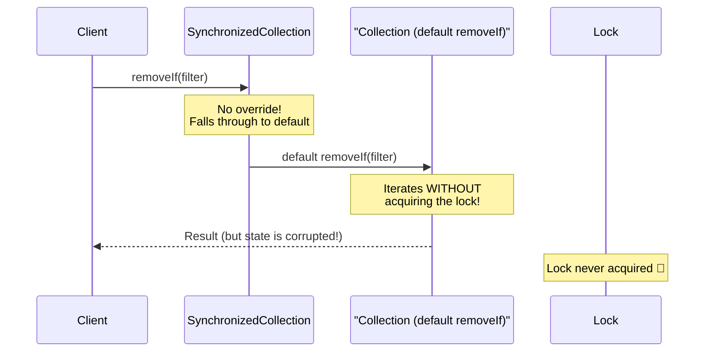

#### The Lesson: Interfaces Are Commitments

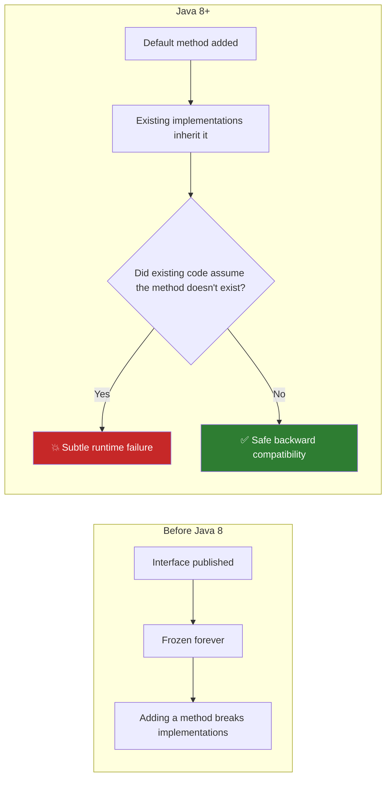

!!! warning "Default Methods Are Not Risk-Free"

    Default methods are inserted into existing implementations **without the knowledge or consent** of the implementing class's authors. In the presence of concurrency, invariants, and complex class contracts, silently inheriting a default method can violate those invariants.

#### Design Principle

> **"It is still of the utmost importance to design interfaces carefully."** — Bloch

- **New interfaces**: use default methods to provide convenience implementations.
- **Existing published interfaces**: add default methods only when there is no alternative, and only when the default cannot possibly violate existing invariants.
- **Always test default methods** against every known implementation before releasing.

#### Quotes to Remember

> _"In the presence of default methods, existing implementations of an interface may compile without error or warning but fail at runtime."_

---

### Item 22: Use Interfaces Only to Define Types

#### The Purpose of an Interface

An interface defines a **type** — a new reference type that says "any class that implements me CAN be used in this role." That's the only legitimate purpose of an interface.

#### The Constant Interface Antipattern

The **constant interface antipattern** is using an interface purely to export constants:

```java
// ❌ BAD: The constant interface antipattern
public interface PhysicalConstants {
    static final double AVOGADROS_NUMBER   = 6.022_140_857e23;
    static final double BOLTZMANN_CONSTANT = 1.380_648_52e-23;
    static final double ELECTRON_MASS      = 9.109_383_56e-31;
}

// Classes implement it just to avoid writing "PhysicalConstants." prefix
public class Atom implements PhysicalConstants {
    // Now uses AVOGADROS_NUMBER directly — but this is wrong!
}
```

**Why this is wrong:**

| Problem                         | Explanation                                                                                                |
| ------------------------------- | ---------------------------------------------------------------------------------------------------------- |
| **Leaks implementation detail** | The fact that a class uses these constants is an internal detail that should not be part of its public API |
| **Pollutes namespace**          | Every subclass of `Atom` also inherits these constants — forever                                           |
| **Can never be removed**        | Removing the `implements PhysicalConstants` later would be a binary-incompatible change                    |
| **Confuses clients**            | The interface type implies behavioral contract — not just naming constants                                 |

#### The Correct Alternatives

```java
// ✅ OPTION 1: Utility class (for arbitrary constants)
public class PhysicalConstants {
    private PhysicalConstants() { }  // Non-instantiable

    public static final double AVOGADROS_NUMBER   = 6.022_140_857e23;
    public static final double BOLTZMANN_CONSTANT = 1.380_648_52e-23;
    public static final double ELECTRON_MASS      = 9.109_383_56e-31;
}

// Usage — clear origin, no false "is-a" relationship
double atoms = PhysicalConstants.AVOGADROS_NUMBER * moles;

// With static import for brevity (acceptable in science/math code):
import static PhysicalConstants.*;
double atoms = AVOGADROS_NUMBER * moles;

// ✅ OPTION 2: Enum (for related integer/typed constants)
public enum Status {
    PENDING, ACTIVE, CLOSED;
}

// ✅ OPTION 3: Constants on the class that uses them (best locality)
public class Atom {
    static final double AVOGADROS_NUMBER = 6.022_140_857e23;
}
```

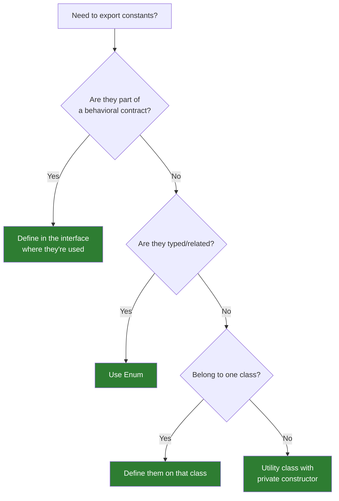

#### Connection to Course Material

In Part 2, Tim showed that interfaces **can** have `public static final` fields (constants). This is syntactically legal. Bloch clarifies the crucial distinction: just because you _can_ put constants on an interface doesn't mean you _should_. The key question is: **does this interface define a type (a behavioral contract), or is it just a bag of constants?**

#### Quotes to Remember

> _"Interfaces should be used only to define types. They should not be used merely to export constants."_

---

### Item 23: Prefer Class Hierarchies to Tagged Classes

#### What Is a Tagged Class?

A **tagged class** uses a discriminator field (a "tag") to indicate what variant of an object it represents — and then stuffs all variants into a single class:

```java
// ❌ BAD: Tagged class — all shapes in one bloated class
public class Shape {
    enum ShapeType { CIRCLE, RECTANGLE }

    final ShapeType shapeType;  // ← The "tag"

    // Circle-specific fields
    double radius;

    // Rectangle-specific fields
    double length;
    double width;

    // Circle constructor
    Shape(double radius) {
        this.shapeType = ShapeType.CIRCLE;
        this.radius = radius;
    }

    // Rectangle constructor
    Shape(double length, double width) {
        this.shapeType = ShapeType.RECTANGLE;
        this.length = length;
        this.width = width;
    }

    double area() {
        return switch (shapeType) {
            case CIRCLE    -> Math.PI * radius * radius;
            case RECTANGLE -> length * width;
            // What if we add TRIANGLE? Every switch must be updated!
        };
    }
}
```

**Problems:**

| Problem                                 | Impact                                                          |
| --------------------------------------- | --------------------------------------------------------------- |
| Boilerplate                             | enum declaration, tag field, switch on every method             |
| Fields for wrong variant always present | Circle has `length`, Rectangle has `radius` — both waste memory |
| Constructors can't set the wrong fields | Invariants not enforced by the compiler                         |
| Unreadable                              | The intent is buried in switch statements                       |
| Not extensible                          | Adding a variant means editing every switch                     |

#### The Class Hierarchy Solution

This is exactly the pattern taught in **Part 1** of the course — use abstract classes!

```java
// ✅ GOOD: Class hierarchy

// Abstract root with shared behavior
public abstract class Shape {
    abstract double area();  // Each subtype calculates area differently
}

// Circle only knows about circles
public class Circle extends Shape {
    private final double radius;
    Circle(double radius) { this.radius = radius; }

    @Override
    double area() { return Math.PI * radius * radius; }
}

// Rectangle only knows about rectangles
public class Rectangle extends Shape {
    private final double length, width;
    Rectangle(double length, double width) {
        this.length = length;
        this.width = width;
    }

    @Override
    double area() { return length * width; }
}

// Adding Triangle requires ZERO changes to existing code!
public class Triangle extends Shape {
    private final double base, height;
    Triangle(double base, double height) {
        this.base = base;
        this.height = height;
    }

    @Override
    double area() { return 0.5 * base * height; }
}
```

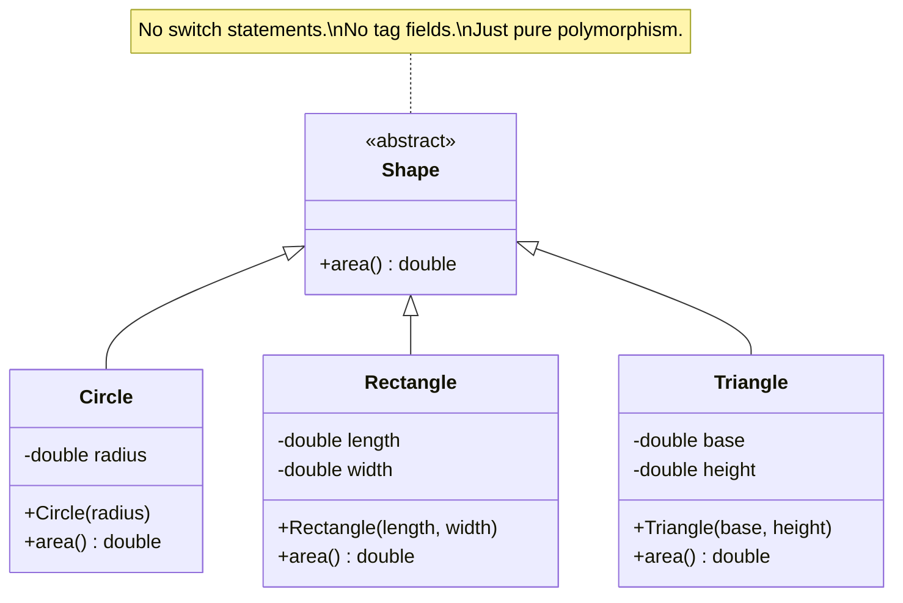

#### Side-by-Side Comparison


!!! success "Connection to Course Material"

    This item perfectly validates the **Store & Order System challenge** from Part 1. Instead of a single `Product` class with a tag field (`ART`, `FURNITURE`) and switch statements in `showDetails()`, the design used `abstract class ProductForSale` with concrete `ArtObject` and `Furniture` subclasses. That's exactly the class hierarchy pattern Bloch advocates.

#### Quotes to Remember

> _"Tagged classes are verbose, error-prone, and inefficient."_

> _"A class hierarchy is a much better alternative to a tagged class."_

---

### Item 24: Favor Static Member Classes Over Nonstatic

#### The Four Kinds of Nested Classes

This item directly corresponds to **Part 5** (Section 13) of the course — nested classes:

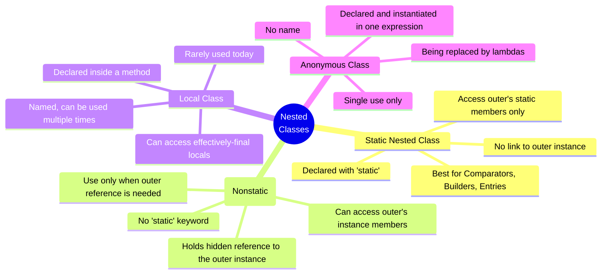

#### The Critical Difference: Static vs Nonstatic

Every **nonstatic** inner class instance holds a **hidden reference** to its enclosing outer class instance. This has serious consequences:

```java
// ❌ BAD: Nonstatic inner class where static would suffice
public class OuterClass {
    private int outerField = 42;  // Not even used by the inner class!

    // This inner class has an implicit reference to OuterClass.this
    class NonstaticlnnerClass {
        void doWork() {
            System.out.println("Working!");
            // Does NOT use outerField — so the reference is wasteful!
        }
    }
}

// Creating an inner instance REQUIRES an outer instance:
OuterClass outer = new OuterClass();
OuterClass.NonstaticlnnerClass inner = outer.new NonstaticlnnerClass();
//                                     ^^^^^^ outer instance required
```

```java
// ✅ GOOD: Static nested class — no outer reference needed
public class OuterClass {
    private int outerField = 42;

    static class StaticNestedClass {
        void doWork() {
            System.out.println("Working!");
            // Can be instantiated WITHOUT an outer instance:
        }
    }
}

// Cleaner creation — no outer instance required:
OuterClass.StaticNestedClass nested = new OuterClass.StaticNestedClass();
```

#### Why the Hidden Reference Is Dangerous

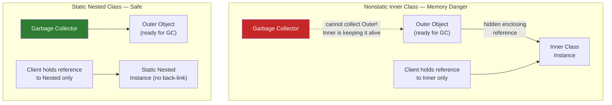

!!! danger "Memory Leak Risk"

      If a nonstatic inner class instance outlives its outer class instance (e.g., stored in a static field or a long-lived callback), it will **prevent the outer instance from being garbage collected**. This is a classic category of memory leak.

#### When Each Type Is Appropriate

| Type                  | When to Use                                                                                         |
| --------------------- | --------------------------------------------------------------------------------------------------- |
| **Static nested**     | Helper class used in conjunction with outer; no outer state needed (e.g., `Map.Entry`, `Builder`)   |
| **Nonstatic (inner)** | Adapter that enables instances to be viewed as instances of another type (e.g., `HashMap.EntrySet`) |
| **Local class**       | When you need a named type scoped to a single method and it's used more than once                   |
| **Anonymous class**   | Small, single-use implementation — but **prefer lambdas** for functional interfaces                 |

#### Connection to Course Material

In Part 5, the `Employee.YearOfJoinComparator` was a **static nested class** — exactly what Bloch recommends. The `Comparator` for employees doesn't need an `Employee` instance to work, so making it static is correct and efficient.

#### Quotes to Remember

> _"If you declare a member class that does not require access to an enclosing instance, always put the `static` modifier in its declaration."_

---

## :material-book-open-variant: Chapter 5: Generics

### Item 26: Don't Use Raw Types

#### What Are Raw Types?

Every generic class has a **raw type** — the class name without its type parameter:

| Generic        | Raw type    |
| -------------- | ----------- |
| `List<E>`      | `List`      |
| `Set<E>`       | `Set`       |
| `Map<K,V>`     | `Map`       |
| `ArrayList<E>` | `ArrayList` |

Raw types exist **only for backward compatibility** with pre-generics Java (before Java 5). You should never use them in new code.

#### The Danger: Errors Deferred to Runtime

```java
// ❌ BAD: Raw type — type safety is lost
private final Collection stamps = new ArrayList(); // Can hold ANYTHING

// This compiles with only an "unchecked" warning:
stamps.add(new Coin("Quarter"));   // Coin accidentally added!

// ... many lines later, far from the bug source:
for (Iterator i = stamps.iterator(); i.hasNext(); ) {
    Stamp s = (Stamp) i.next();  // 💥 ClassCastException at runtime!
}
```

```java
// ✅ GOOD: Parameterized type — error caught at compile time
private final Collection<Stamp> stamps = new ArrayList<>();

stamps.add(new Coin("Quarter"));  // COMPILE ERROR: "incompatible types"
//                  ^^^^^^^^^^^ The bug is caught immediately!
```

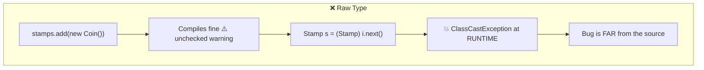

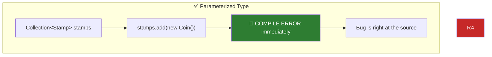

#### The Three Faces of a Generic Type

```java
// 1. Parameterized type — what you should use
List<String> strings = new ArrayList<>();

// 2. Raw type — backward compatibility only; never use in new code
List raw = new ArrayList();

// 3. Unbounded wildcard — when the type parameter truly doesn't matter
static int numElementsInCommon(Set<?> s1, Set<?> s2) {
    int result = 0;
    for (Object o1 : s1)
        if (s2.contains(o1))
            result++;
    return result;
}
// Set<?> is safe — you can't add anything (except null) to Set<?>
// Set (raw) is unsafe — you can add anything, breaking type invariants
```

!!! danger "The Two Exceptions to This Rule" 1. **Class literals**: `List.class`, `String[].class` — NOT `List<String>.class` 2. **`instanceof` checks**: `if (o instanceof Set)` — type erasure means you can't use `o instanceof Set<String>`

#### The Key Distinction: Raw Type vs Unbounded Wildcard

| Feature          |   `Set` (raw)   | `Set<?>` (wildcard) |
| ---------------- | :-------------: | :-----------------: |
| Type safe        |      ❌ No      |       ✅ Yes        |
| Can add elements |  ✅ (unsafe!)   |   ❌ Only `null`    |
| Purpose          | Backward compat | Any-type parameter  |

#### Quotes to Remember

> _"Using raw types loses all the safety and expressiveness benefits of generics."_

> _"If you use raw types, you lose all the safety and expressiveness benefits of generics."_

---

### Item 27: Eliminate Unchecked Warnings

#### Why Warnings Matter

The compiler generates unchecked warnings whenever it cannot verify type safety. Every unchecked warning is a potential `ClassCastException` at runtime. Your goal is **zero unchecked warnings**.

```java
// This generates an unchecked warning:
Set<Lark> exaltation = new HashSet();
//                          ^^^^^^^^ Warning: unchecked call to HashSet() as a member of raw type HashSet

// ✅ Fix: use the diamond operator (Java 7+)
Set<Lark> exaltation = new HashSet<>();
//                                ^^ Empty diamond — compiler infers <Lark>
```

#### When You Cannot Eliminate a Warning

Sometimes eliminating a warning is genuinely impossible — for example, in a generic array allocation:

```java
// Inside a generic Stack<E> class:
// ❌ Can't do: E[] elements = new E[DEFAULT_INITIAL_CAPACITY];
// ❌ Compiler: "generic array creation"

// Two options:

// Option A: Cast to generic array (unchecked warning)
@SuppressWarnings("unchecked")
E[] elements = (E[]) new Object[DEFAULT_INITIAL_CAPACITY];

// Option B: Use Object[] and cast on access (different trade-off)
Object[] elements = new Object[DEFAULT_INITIAL_CAPACITY];
// ...
@SuppressWarnings("unchecked") E result = (E) elements[--size];
```

#### The @SuppressWarnings Discipline

When you **know** a cast is safe but the compiler can't verify it, use `@SuppressWarnings("unchecked")` — but **always**:

1. Use it on the **smallest possible scope** (single statement, not the whole method or class)
2. Add a **comment** explaining why it is safe

```java
// ❌ BAD: Suppressing on an entire method hides future problems
@SuppressWarnings("unchecked")
public <T> T[] toArray(T[] a) {
    // ... large method body
}

// ✅ GOOD: Narrow scope + explanation
public <T> T[] toArray(T[] a) {
    if (a.length < size) {
        // This cast is correct because the array we're creating
        // is of the same type as the one passed in (T[]).
        @SuppressWarnings("unchecked") T[] result =
            (T[]) Arrays.copyOf(elements, size, a.getClass());
        return result;
    }
    // ...
}
```

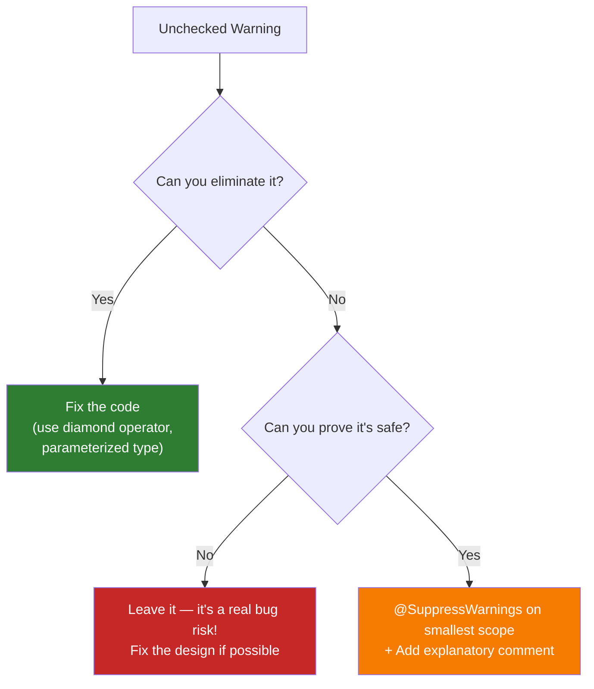

!!! tip "The Diamond Operator Is Your Friend"

    Most unchecked warnings from constructor calls disappear with the diamond operator `<>` (Java 7+). It lets the compiler infer the type argument instead of writing it out twice:

    ```java
    Map<String, List<Integer>> map = new HashMap<>(); // Not new HashMap<String, List<Integer>>()
    ```

#### Quotes to Remember

> _"Every unchecked warning represents the potential for a `ClassCastException` at runtime."_

> _"If you suppress the warning, you are taking on responsibility for the safety of the cast."_

---

### Item 29: Favor Generic Types

#### The Problem: Non-Generic Classes Force Unsafe Casts on Clients

When a reusable container class is not generic, every caller must cast:

```java
// ❌ BAD: Non-generic Stack — clients must cast on every pop()
public class Stack {
    private Object[] elements;
    private int size = 0;

    public void push(Object e) {
        elements[size++] = e;
    }

    public Object pop() {
        if (size == 0) throw new EmptyStackException();
        Object result = elements[--size];
        elements[size] = null;
        return result;
    }
}

// Client code — forced to cast, errors deferred to runtime:
Stack stringStack = new Stack();
stringStack.push("hello");
String s = (String) stringStack.pop();  // Unchecked cast!
```

#### The Solution: Genericize the Class

```java
// ✅ GOOD: Generic Stack<E>
public class Stack<E> {
    private E[] elements;
    private int size = 0;
    private static final int DEFAULT_INITIAL_CAPACITY = 16;

    // The unchecked cast here is safe because the internal elements array
    // is never exposed — only E references are returned to clients.
    @SuppressWarnings("unchecked")
    public Stack() {
        elements = (E[]) new Object[DEFAULT_INITIAL_CAPACITY];
    }

    public void push(E e) {
        elements[size++] = e;
    }

    public E pop() {
        if (size == 0) throw new EmptyStackException();
        E result = elements[--size];
        elements[size] = null;
        return result;
    }

    public boolean isEmpty() { return size == 0; }
}

// Client code — no cast needed, errors caught at compile time:
Stack<String> stringStack = new Stack<>();
stringStack.push("hello");
String s = stringStack.pop();   // No cast! Clean and safe.

// Can use different element types:
Stack<Integer> intStack = new Stack<>();
intStack.push(42);
int n = intStack.pop();
```

#### The Generic Class Transformation

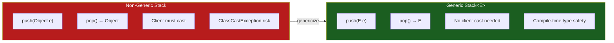

#### The Generic Array Problem

Java prohibits creating generic arrays directly (`new E[size]` is a compile error) because of type erasure. Bloch presents two approaches:

```java
// Approach 1: Cast Object[] to E[] in the constructor
// Pro: More readable; cast is in one place
// Con: Heap pollution (array's actual runtime type is Object[], not E[])
@SuppressWarnings("unchecked")
elements = (E[]) new Object[DEFAULT_INITIAL_CAPACITY];

// Approach 2: Declare the field as Object[], cast on pop()
// Pro: No heap pollution
// Con: Cast appears on every element access
private Object[] elements;
...
@SuppressWarnings("unchecked") E result = (E) elements[--size];
```

!!! info "Bounded Type Parameters"

    You can restrict what types `E` can be with an upper bound:
    ```java
    class DelayQueue<E extends Delayed> implements BlockingQueue<E>

    ```

This guarantees every element has the methods of `Delayed`, so `DelayQueue` can call `e.getDelay()` internally.

#### Connection to Course Material

In Part 3, Tim built the **Team** class evolution:

- `BaseballTeam` (specific) → `SportsTeam` (polymorphic, but uses Object casts) → `Team<T>` (generic, clean and safe)

This is exactly the transformation Bloch describes in Item 29. The final `Team<T extends Member>` with an upper bound mirrors his `DelayQueue<E extends Delayed>` example.

#### Quotes to Remember

> _"Generic types are safer and easier to use than types that require casts in client code."_

---

### Item 30: Favor Generic Methods

#### Methods Can Be Generic Too

Just as classes can be generic, so can **individual static (and instance) methods**. The type parameter list goes **before the return type**:

```java
// ❌ BAD: Non-generic method — returns raw type, requires casts
public static Set union(Set s1, Set s2) {
    Set result = new HashSet(s1);
    result.addAll(s2);
    return result;  // Raw Set — unsafe!
}

// ✅ GOOD: Generic method — type-safe, no casts needed
public static <E> Set<E> union(Set<E> s1, Set<E> s2) {
    Set<E> result = new HashSet<>(s1);
    result.addAll(s2);
    return result;
}

// Usage — compiler infers <String> from context:
Set<String> guys  = Set.of("Tom", "Dick", "Harry");
Set<String> stooges = Set.of("Larry", "Moe", "Curly");
Set<String> aflCio = union(guys, stooges);
```

#### Anatomy of a Generic Method

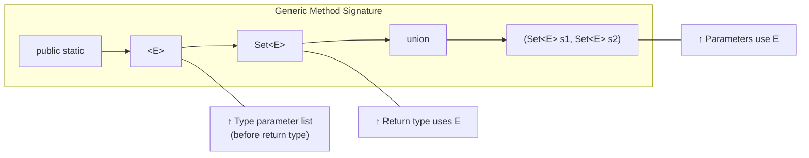

#### The Generic Singleton Factory

Some methods need to be both generic and return the exact same (singleton) object for all types. This uses a type-safe cast:

```java
// The identity function returns its argument unchanged — safe for all types
private static final UnaryOperator<Object> IDENTITY_FN = t -> t;

@SuppressWarnings("unchecked")
public static <T> UnaryOperator<T> identityFunction() {
    return (UnaryOperator<T>) IDENTITY_FN;  // Safe: identity never modifies T
}

// Usage with type inference:
UnaryOperator<String> sameString  = identityFunction();
UnaryOperator<Number> sameNumber  = identityFunction();

String   s = sameString.apply("Hello");  // Correct: returns "Hello"
Number   n = sameNumber.apply(3.14);     // Correct: returns 3.14
```

#### Recursive Type Bound: `<T extends Comparable<T>>`

The most important application of generic methods is **natural ordering** with `Comparable`:

```java
// T extends Comparable<T> means: "T is a type that can be compared to itself"
// — exactly the condition needed for sorting and finding max/min

public static <T extends Comparable<T>> T max(List<T> list) {
    if (list.isEmpty())
        throw new IllegalArgumentException("Empty collection");

    T result = list.get(0);
    for (int i = 1; i < list.size(); i++) {
        if (list.get(i).compareTo(result) > 0)
            result = list.get(i);
    }
    return result;
}

// Works with any Comparable type — no cast needed:
List<String> words   = List.of("banana", "apple", "cherry");
List<Integer> scores = List.of(42, 17, 99, 3);

String  maxWord  = max(words);    // "cherry"
Integer maxScore = max(scores);   // 99
```

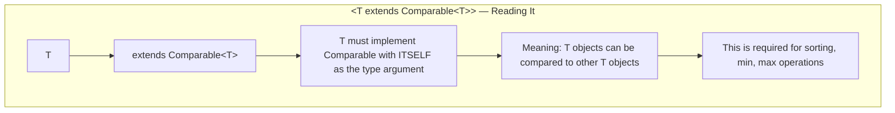

#### Connection to Course Material

In Part 4, Tim taught implementing `Comparable<T>` for the `Student` class and writing a `QueryList<T extends Student & Comparable<T>>`. Bloch's `max()` method is a textbook illustration of exactly the same **recursive type bound** pattern.

#### Quotes to Remember

> _"Generic methods, like generic types, are safer and easier to use than methods requiring their clients to put casts on input parameters or return values."_

---

### Item 31: Use Bounded Wildcards to Increase API Flexibility

#### The Problem: Generics Are Invariant

Generics are **invariant**: `List<String>` is **not** a subtype of `List<Object>`, even though `String` is a subtype of `Object`. This is by design — it prevents the covariance bugs that afflict arrays.

But invariance can make APIs unnecessarily rigid:

```java
// Stack<E> with a pushAll method:
public void pushAll(Iterable<E> src) {
    for (E e : src)
        push(e);
}

// This fails even though Integer extends Number:
Stack<Number> numberStack = new Stack<>();
Iterable<Integer> integers = List.of(1, 2, 3);

numberStack.pushAll(integers);
// 💥 COMPILE ERROR: Iterable<Integer> cannot be used as Iterable<Number>
```

#### The PECS Solution

**PECS: Producer Extends, Consumer Super**

This is the single most important mnemonic for using wildcards correctly:

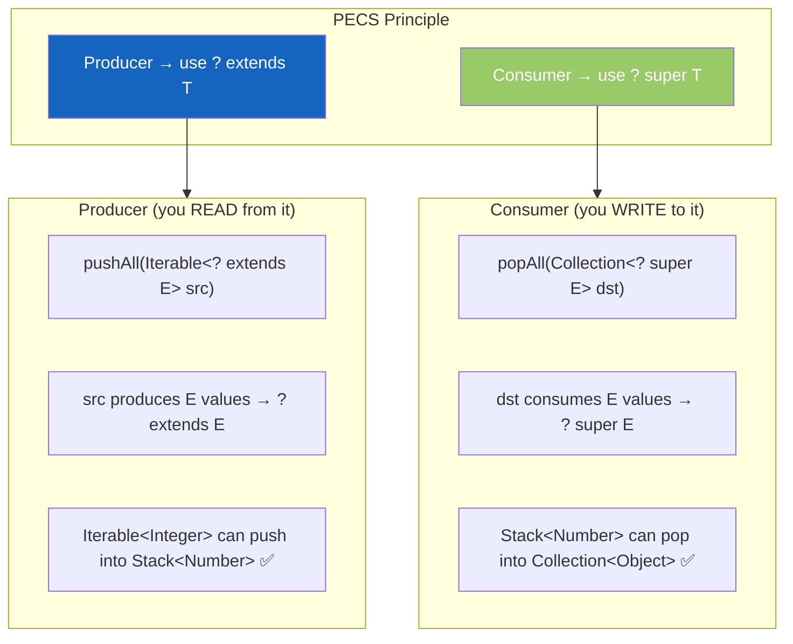

```java
// ✅ Fixed pushAll — Producer Extends
public void pushAll(Iterable<? extends E> src) {
    for (E e : src)
        push(e);
}

// ✅ Fixed popAll — Consumer Super
public void popAll(Collection<? super E> dst) {
    while (!isEmpty())
        dst.add(pop());
}

// Now both work:
Stack<Number> numberStack = new Stack<>();
Iterable<Integer> integers = List.of(1, 2, 3);
numberStack.pushAll(integers);   // ✅ Integer extends Number

Collection<Object> objects = new ArrayList<>();
numberStack.popAll(objects);     // ✅ Object super Number
```

#### PECS Applied to Generic Methods

```java
// Original (inflexible):
public static <E> Set<E> union(Set<E> s1, Set<E> s2) { ... }

// With PECS (flexible — both sets are producers):
public static <E> Set<E> union(Set<? extends E> s1,
                               Set<? extends E> s2) { ... }

// Now works with different-but-compatible types:
Set<Integer> integers = Set.of(1, 3, 5);
Set<Double>  doubles  = Set.of(2.0, 4.0, 6.0);
Set<Number>  numbers  = union(integers, doubles); // ✅ Inferred E = Number
```

#### Wildcard Types — The Full Taxonomy

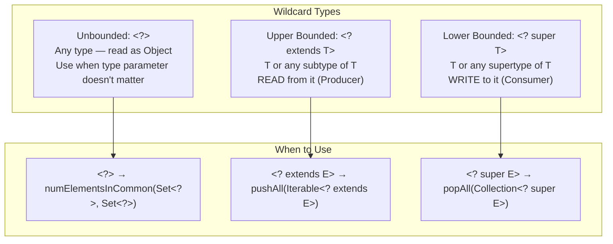

#### `Comparable` and `Comparator` Should Use `? super`

Because `Comparable<T>` and `Comparator<T>` are consumers (they consume T values to produce a comparison result), they should use `? super`:

```java
// Less flexible — only works with types that implement Comparable with themselves:
public static <T extends Comparable<T>> T max(List<T> list) { ... }

// ✅ More flexible — works with types that inherit Comparable from a supertype:
public static <T extends Comparable<? super T>> T max(List<? extends T> list) { ... }

// Real-world example this enables:
// ScheduledFuture<V> implements Delayed, and Delayed implements Comparable<Delayed>
// ScheduledFuture doesn't directly implement Comparable<ScheduledFuture>
// The ? super T version works; the original T version doesn't!
```

#### Don't Use Wildcards as Return Types

Wildcards in return types force callers to use wildcards everywhere — the complexity leaks into client code:

```java
// ❌ BAD: Wildcard return type infects clients
public static Set<? extends Number> getNumbers() { ... }

// Client code is now awkward:
Set<? extends Number> nums = getNumbers(); // What can I do with this?
```

!!! tip "The Rule for Wildcards in Returns"

    If a wildcard type appears as a **parameter**, fine. If it appears as a **return type**, that's almost always a design mistake. Wildcards should make APIs more flexible for callers, not more complicated.

#### Connection to Course Material

In Part 4, Tim introduced wildcards (`?`, `? extends T`, `? super T`) and the PECS principle directly. Bloch's `pushAll`/`popAll` example is the canonical illustration. The `QueryList<T>` challenge extended `ArrayList<T>` — applying bounded type parameters to restrict what can be stored, which is PECS from the class-level perspective.

#### Quotes to Remember

> _"For maximum flexibility, use wildcard types on input parameters that represent producers or consumers."_

> _"If the type parameter appears only once in a method declaration, replace it with a wildcard."_

> _"Do not use bounded wildcard types as return types."_

---

## :material-head-cog: Theoretical Framework

### Mental Model: The Abstraction Hierarchy

All the patterns in this topic form a layered system for building flexible, type-safe Java:

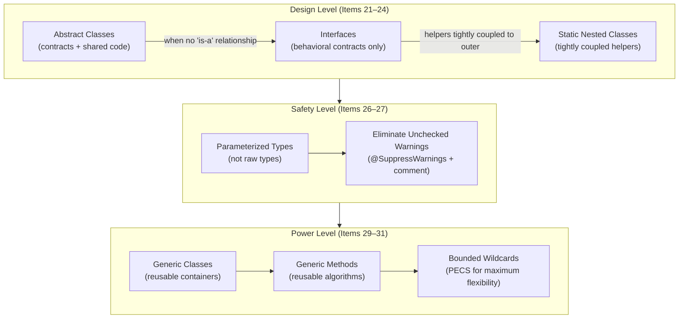

### The PECS Decision Table

| Scenario                        | Wildcard      | Example                          |
| ------------------------------- | ------------- | -------------------------------- |
| Reading values FROM a parameter | `? extends T` | `pushAll(Iterable<? extends E>)` |
| Writing values INTO a parameter | `? super T`   | `popAll(Collection<? super E>)`  |
| Both reading and writing        | No wildcard   | `swap(List<E>, int i, int j)`    |
| Type is completely irrelevant   | `?`           | `numInCommon(Set<?>, Set<?>)`    |

### Interface Design Principles Summary

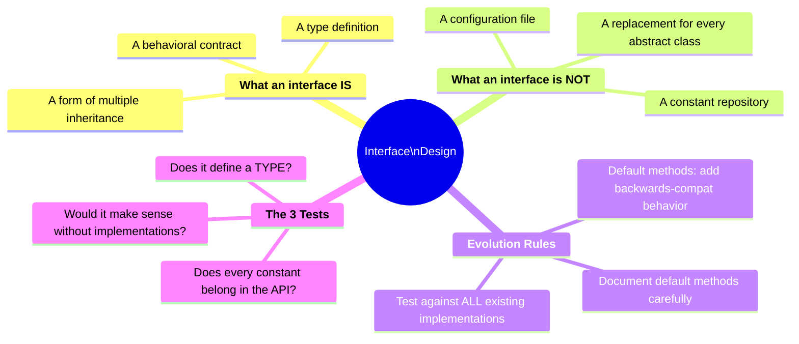

---

## :material-thought-bubble: Reflections & Connections

### Connections to Course Material

| Effective Java                         | Tim's Course (Topic 4)                                              |
| -------------------------------------- | ------------------------------------------------------------------- |
| Item 21 (Default methods posterity)    | Part 2: `default`, `static`, `private` methods in interfaces        |
| Item 22 (Interfaces only for types)    | Part 2: Interface constants — legal but often misused               |
| Item 23 (Class hierarchies > tagged)   | Part 1: `abstract ProductForSale` → `ArtObject`, `Furniture`        |
| Item 24 (Static nested > nonstatic)    | Part 5: `Employee.YearOfJoinComparator` as static nested            |
| Item 26 (Don't use raw types)          | Part 3: Raw `Team` → `Team<T>` evolution                            |
| Item 27 (Eliminate unchecked warnings) | Part 3: Generic array creation with `(E[]) new Object[...]`         |
| Item 29 (Favor generic types)          | Part 3: `BaseballTeam` → `SportsTeam` → `Team<T>`                   |
| Item 30 (Favor generic methods)        | Part 4: Generic method type parameters, `compareTo`, sort utilities |
| Item 31 (Bounded wildcards / PECS)     | Part 4: `? extends`, `? super`, PECS principle                      |

### New Perspectives Gained

1. **Default methods are not free** — they carry risk when added to existing published interfaces; the `SynchronizedCollection` bug is a cautionary tale that makes the lesson concrete
2. **Constant interfaces are an antipattern** — even though Java allows them, they betray the semantic purpose of interfaces and permanently pollute the namespace
3. **Tagged classes are the OOP equivalent of type-based switches** — both signal that you need polymorphism instead
4. **The hidden outer reference in inner classes is a memory leak waiting to happen** — making nested classes `static` by default is defensive programming
5. **PECS is not just a rule but an insight**: wildcard type represents what flows **through** a parameter — `extends` = things flow out (producer), `super` = things flow in (consumer)
6. **Unchecked warnings are type system IOUs** — every suppressed warning is a cast you're personally guaranteeing is safe

---

## :material-format-list-checks: Summary Points

1. **Default methods can break existing code** — design interfaces carefully from the start; adding default methods to existing published interfaces is a last resort
2. **Interfaces define types, not constants** — use utility classes, enums, or the class that owns the constant instead
3. **Tagged classes are a design smell** — replace them with abstract class hierarchies and let polymorphism eliminate the switch statements
4. **Prefer static member classes** — nonstatic inner classes hold a hidden reference to the outer instance and can cause memory leaks; only use nonstatic when outer-instance access is genuinely required
5. **Raw types lose all generic benefits** — parameterized types catch errors at compile time; raw types defer them to runtime
6. **Eliminate every unchecked warning** — if you must suppress, use the smallest scope and document why it is safe
7. **Generic classes remove client-side casts** — the cast is written once inside the generic class, not scattered across all callers
8. **Generic methods follow the same syntax** — type parameter list `<T>` goes before the return type; `<T extends Comparable<T>>` is the recursive bound for ordering
9. **PECS governs wildcard selection** — Producer → `? extends T`; Consumer → `? super T`; wildcards should never appear in return types

---

## :material-pin: Bookmarks & Page References

| Topic                          | Item    | Key Insight                                                      |
| ------------------------------ | ------- | ---------------------------------------------------------------- |
| Default method risk            | Item 21 | `SynchronizedCollection.removeIf` — inherited unsafe default     |
| Constant interface antipattern | Item 22 | Interfaces are for types, not namespaces; use utility class      |
| Tagged class smell             | Item 23 | `ShapeType` tag + switch → abstract `Shape` hierarchy            |
| Static vs inner class          | Item 24 | Inner class holds hidden outer reference → memory leak risk      |
| Raw types forbidden            | Item 26 | `List` is a raw type; `List<?>` is safe; `List<String>` is best  |
| Unchecked warnings             | Item 27 | Zero tolerance; `@SuppressWarnings` on narrowest scope + comment |
| Generic types                  | Item 29 | Convert `Stack` using `Object[]` to `Stack<E>`; two approaches   |
| Generic methods                | Item 30 | `<T extends Comparable<T>>` recursive bound for `max()`          |
| Bounded wildcards / PECS       | Item 31 | `pushAll(? extends E)` producer; `popAll(? super E)` consumer    |

---

## :material-code-tags: Practical Checklist

**Before designing an interface:**

- [ ] Does this define a behavioral contract (type), or just a group of related constants?
- [ ] If you're adding a default method to an existing interface, have you tested it against all known implementations?
- [ ] Are there any concurrency contracts that a default method could silently violate?

**Before using a nested class:**

- [ ] Does the nested class need to access instance members of the outer class?
- [ ] If no → make it `static`
- [ ] If yes → only use a nonstatic inner class; ensure its lifecycle is bounded by the outer instance

**Before writing a generic class or method:**

- [ ] Are clients currently writing unsafe casts to use this class?
- [ ] Does the type parameter need an upper bound (`extends`) to access specific methods?
- [ ] Are there multiple type parameters? Do they all appear in the method signature?

**Before using wildcards:**

- [ ] Is this parameter a producer (values flow out)? → `? extends T`
- [ ] Is this parameter a consumer (values flow in)? → `? super T`
- [ ] Does a wildcard appear in the return type? → Redesign; don't leak wildcards to callers
- [ ] Does `Comparable` or `Comparator` need `? super T` to handle supertype ordering?

**Before leaving unchecked warnings:**

- [ ] Have you tried using the diamond operator, parameterized types, or `List` instead of arrays?
- [ ] If suppressing: is `@SuppressWarnings` on the smallest possible scope?
- [ ] Is there a comment explaining exactly why the cast is safe?

---

_Last Updated: 2026-02-25_
