# :material-school: Summary: Abstraction, Interfaces, Generics & Nested Classes

> **Combined Knowledge from:** Tim Buchalka's Course (Sections 11–13) + Effective Java  
> **Mastery Level:** :material-star::material-star::material-star::material-star::material-star:

---

## :material-star-shooting: Topic Overview

This topic is the heart of professional Java design. It covers the full **abstraction toolbox** — from abstract classes and interfaces to generic types, bounded wildcards, and nested classes. Together, these features let you write code that is simultaneously **type-safe**, **reusable**, **flexible**, and **encapsulated**.

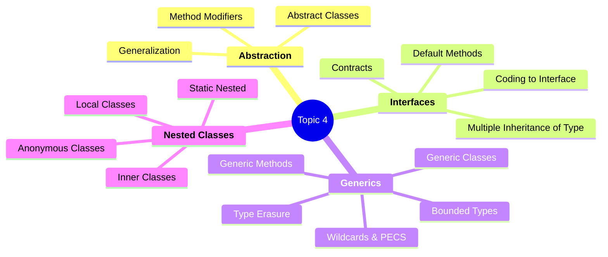

---

## :material-key: Core Concepts

### 1. Abstract Classes

**Definition:** A class declared `abstract` that cannot be instantiated. It acts as a strict base class that forces subclasses to provide implementations for all abstract methods.

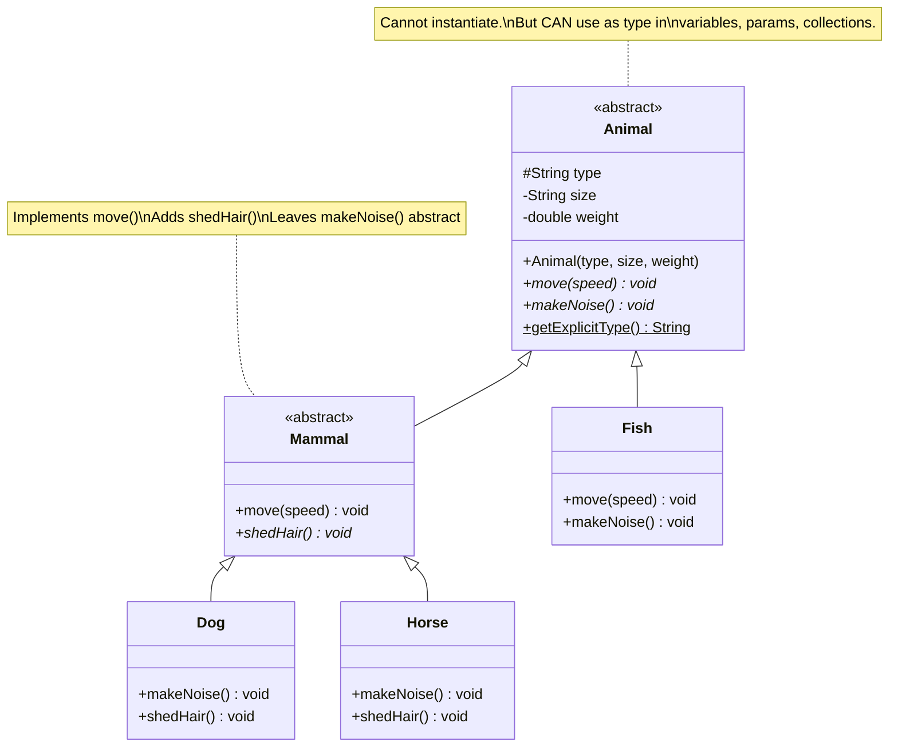

#### Key Rules Quick Reference

| Rule                            | Detail                                                                          |
| ------------------------------- | ------------------------------------------------------------------------------- |
| Cannot instantiate              | `new Animal()` → compile error                                                  |
| Can have constructors           | Subclasses MUST call `super(...)`                                               |
| Mix abstract + concrete         | Some methods forced, some inherited, some locked (`final`)                      |
| `abstract + private`            | ❌ Illegal — contradictory modifiers                                            |
| `abstract + final`              | ❌ Illegal — contradictory modifiers                                            |
| Abstract class extends abstract | OK — can implement some, none, or all parent abstract methods, and add new ones |

#### When to Use Abstract Classes

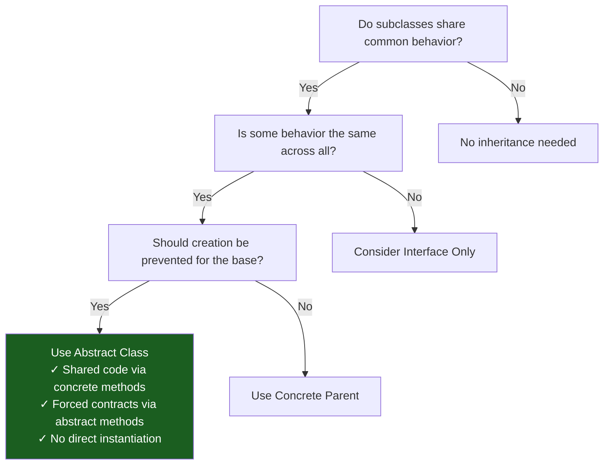

---

### 2. Interfaces

**Definition:** A contract type defining behavioral obligations. Any class implementing an interface promises to provide all its abstract methods. Unlike abstract classes, a class can implement **multiple** interfaces.

#### Interface Member Types

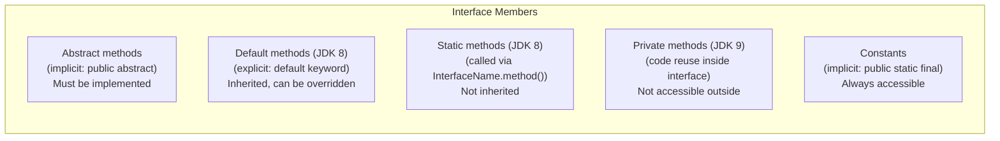

#### Abstract Class vs Interface — The Decision Matrix

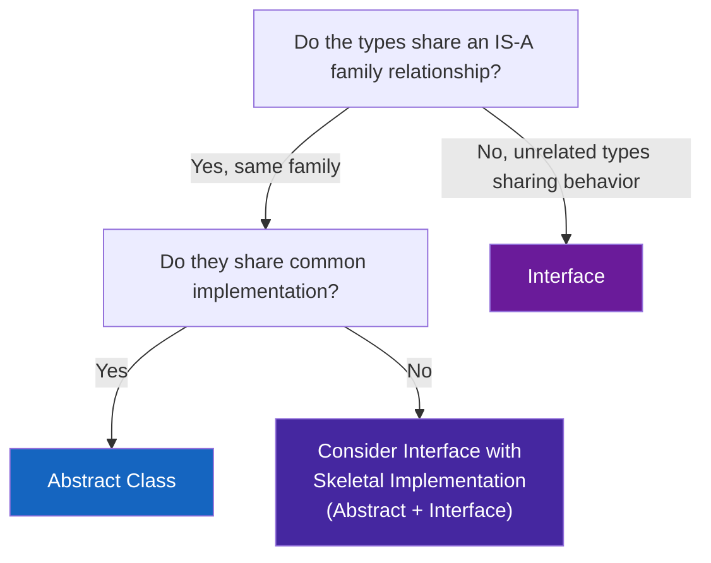

| Feature                 |   Abstract Class    |          Interface          |
| ----------------------- | :-----------------: | :-------------------------: |
| Multiple inheritance    |  ❌ Single extends  |   ✅ Multiple implements    |
| Constructor             |       ✅ Yes        |            ❌ No            |
| Instance state (fields) |       ✅ Yes        |   ❌ No (constants only)    |
| Common implementation   | ✅ Concrete methods | ✅ Default methods (JDK 8+) |
| Records/Enums can use   |  ❌ Cannot extend   |      ✅ Can implement       |
| Skeletal implementation |          —          |   ✅ AbstractXxx pattern    |

#### Coding to an Interface

```java
// ❌ Tight coupling — breaks when implementation changes
private static void triggerFliers(ArrayList<FlightEnabled> fliers) { ... }

// ✅ Coded to interface — any List implementation works
private static void triggerFliers(List<FlightEnabled> fliers) { ... }
```

Apply this to **parameters**, **return types**, **local variables**, and **fields**. The implementation becomes a one-line swap.

---

### 3. Generics

**Definition:** A language mechanism that lets you write classes and methods parameterized by type, providing compile-time type safety without sacrificing reusability.

#### The Three-Stage Evolution

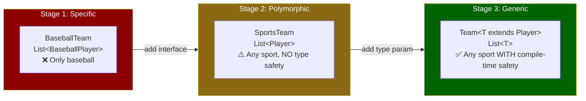

#### Type Parameter Naming Conventions

|  Letter   | Meaning         | Usage                                 |
| :-------: | --------------- | ------------------------------------- |
|    `T`    | Type            | `class Box<T>` — general-purpose      |
|    `E`    | Element         | `interface List<E>` — JCF collections |
| `K` / `V` | Key / Value     | `interface Map<K, V>`                 |
|    `N`    | Number          | Numeric types                         |
| `S`, `U`  | 2nd, 3rd params | `class Team<T, S>`                    |

#### Upper Bounds

```java
// Without bound: T can only use Object methods
class Team<T> { ... }

// With upper bound: T can use Player's methods too
class Team<T extends Player> { ... }
// OR multiple bounds (class must come first!):
class QueryList<T extends Student & QueryItem> { ... }
```

#### Comparable and Comparator

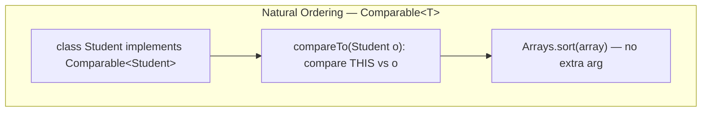

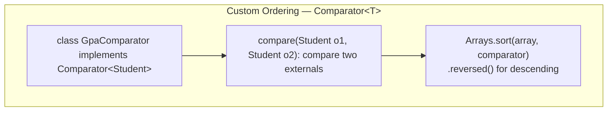

| Aspect           |     `Comparable<T>`      |        `Comparator<T>`         |
| ---------------- | :----------------------: | :----------------------------: |
| Package          |       `java.lang`        |          `java.util`           |
| Method           | `compareTo(T o)` — 1 arg | `compare(T o1, T o2)` — 2 args |
| Number per class |   One (natural order)    |           Unlimited            |
| Who implements   |     The class itself     |        A separate class        |

---

### 4. Wildcards & PECS

**The Core Problem:** Generics are **invariant** — `List<LPAStudent>` is NOT a `List<Student>`, even though `LPAStudent extends Student`. Wildcards add controlled flexibility.

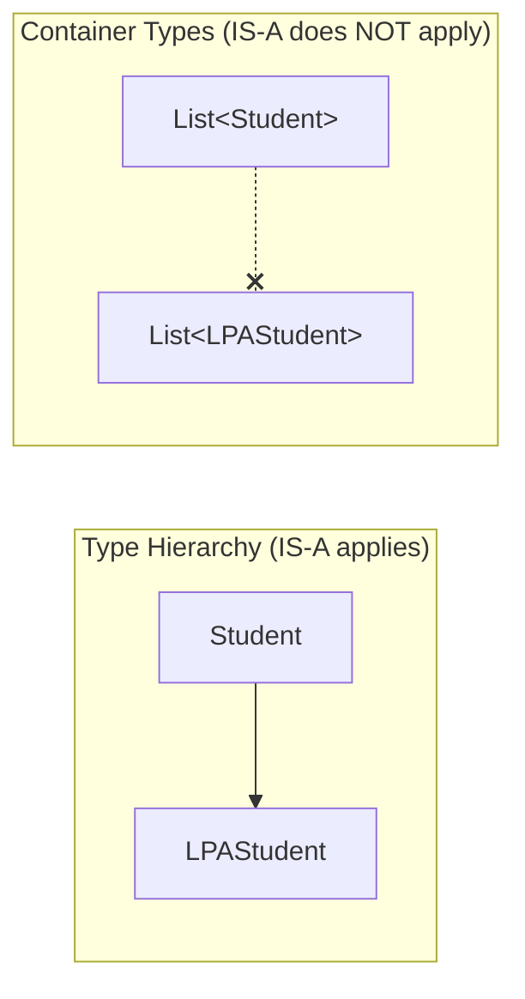

#### The PECS Principle

> **P**roducer **E**xtends, **C**onsumer **S**uper

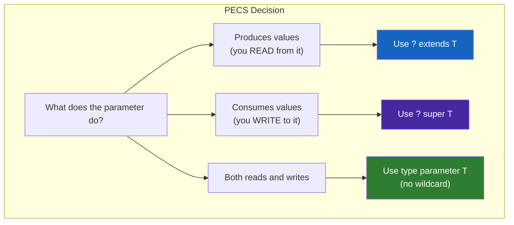

| Wildcard        | Reads as |    Can Write    | Use Case                                  |
| --------------- | :------: | :-------------: | ----------------------------------------- |
| `<?>`           | `Object` |       ❌        | Any type, logic uses `instanceof`         |
| `<? extends T>` |   `T`    |       ❌        | **Producer** — reading elements (pushAll) |
| `<? super T>`   | `Object` | ✅ T + subtypes | **Consumer** — adding elements (popAll)   |

---

### 5. Nested Classes

**Definition:** A class declared inside another class or interface. Used when two classes are tightly coupled and the inner type has no meaningful existence independent of the outer.

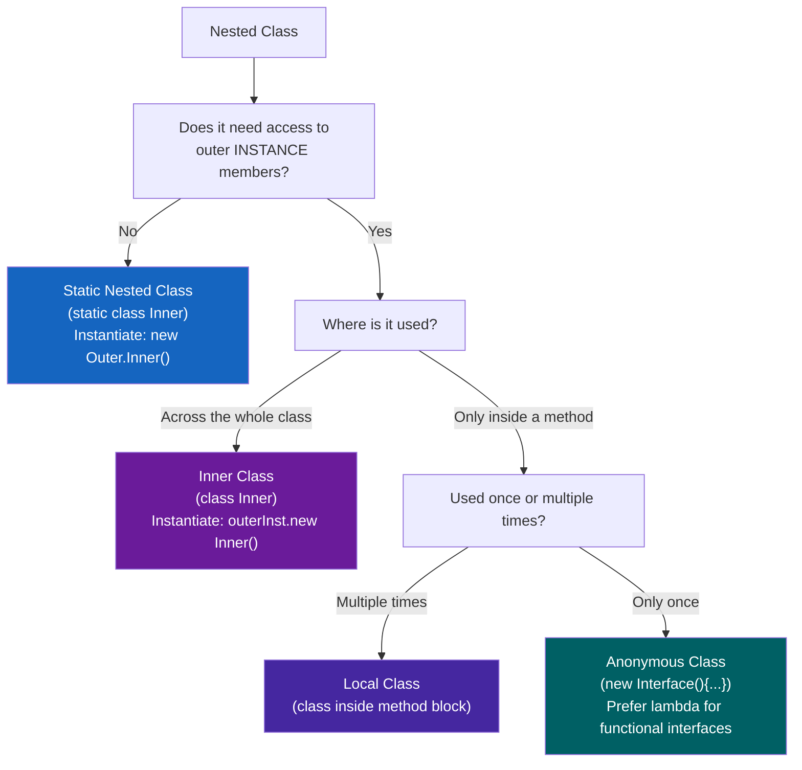

| Type          | `static`? | Outer Ref? | Scope        | Instantiation             |
| ------------- | :-------: | :--------: | ------------ | ------------------------- |
| Static Nested |    ✅     |     ❌     | Class-level  | `new Outer.Nested()`      |
| Inner         |    ❌     |     ✅     | Class-level  | `outerInst.new Inner()`   |
| Local         |    ❌     |     ✅     | Method block | Inside method only        |
| Anonymous     |    ❌     |     ✅     | Expression   | `new Interface() { ... }` |

---

## :material-head-cog: Key Internals to Understand

### 1. Arrays (Covariant) vs Generics (Invariant)

This is one of Java's most important design trade-offs. Arrays and generic types have opposing variance rules:

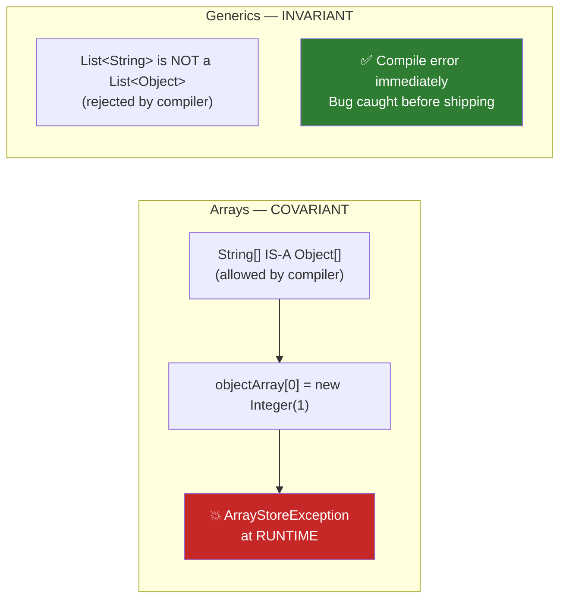

```java
// ❌ ARRAY COVARIANCE — compiles but fails at runtime:
Object[] objectArray = new Long[1];
objectArray[0] = "I don't fit here!"; // ArrayStoreException at runtime!

// ✅ GENERIC INVARIANCE — fails at compile time (safer):
List<Object> objects = new ArrayList<Long>(); // COMPILE ERROR
```

**Why arrays are covariant:** Legacy design from Java 1.0, before generics existed, to allow methods like `Arrays.sort(Object[])` to sort any array.

**Why generics are invariant:** To prevent the type-safety hole shown above. Wildcards (`? extends T`) provide controlled covariance when needed.

---

### 2. Type Erasure Mechanism

The Java compiler **erases** all generic type information before producing bytecode. This makes generics backward-compatible with pre-Java 5 code, but has important implications.

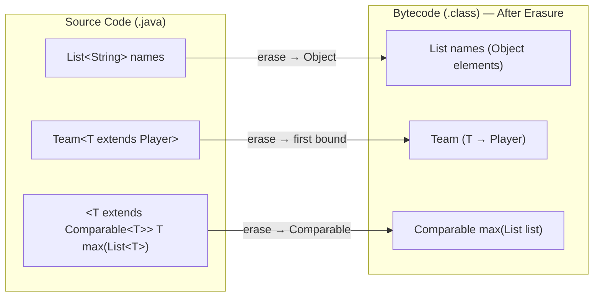

#### Erasure Rules

| Source                | Erased To           |
| --------------------- | ------------------- |
| `T` (no bound)        | `Object`            |
| `T extends Foo`       | `Foo`               |
| `T extends Foo & Bar` | `Foo` (first bound) |
| `List<String>`        | `List`              |
| `List<Integer>`       | `List`              |

#### The Three Consequences of Type Erasure

```java
// 1. Cannot create generic arrays
new T[10]  // ❌ "generic array creation" — type not known at runtime

// 2. Cannot overload on type arguments — same erasure
void process(List<String> list) { } // ❌ Both erase to process(List)
void process(List<Integer> list) { } // ❌ "have the same erasure"

// 3. Cannot use instanceof with parameterized types
if (obj instanceof List<String>) { } // ❌ Type erased at runtime
if (obj instanceof List<?>) { }      // ✅ Allowed — wildcard is safe
```

!!! tip "Why Erasure Exists"

    Type erasure preserves **binary compatibility**: compiled `ArrayList.class` from Java 5+ works with all Java code regardless of the type parameter. The JVM sees only the raw type, and the compiler inserts casts wherever needed (these are guaranteed safe because it verified the types before erasing them).

#### The Bridge Method

When a class implements a parameterized interface, the compiler inserts a synthetic **bridge method** to handle type erasure correctly:

```java
// Source:
class StudentList implements Comparable<Student> {
    public int compareTo(Student o) { ... }  // Parameterized method
}

// After erasure (what bytecode contains):
class StudentList implements Comparable {
    public int compareTo(Student o) { ... }  // Original
    public int compareTo(Object o) {          // Synthetic bridge method!
        return compareTo((Student) o);        // Delegates + casts
    }
}
```

---

### 3. Raw Types vs Parameterized Types

Raw types are the dangerous "no type parameter" form of a generic class. They exist only for backward compatibility.

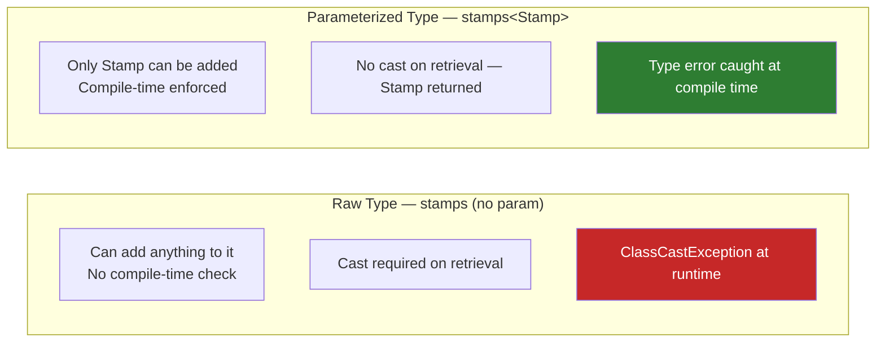

**The key distinction:**

| Form               | Example              | Safety              |
| ------------------ | -------------------- | ------------------- |
| Raw type           | `List stamps`        | ❌ No type checking |
| Unbounded wildcard | `List<?> stamps`     | ✅ Read-only, safe  |
| Parameterized      | `List<Stamp> stamps` | ✅ Full type safety |

> Use `List<?>` when you genuinely don't care about the element type (e.g., counting elements in common). Use a parameterized type for everything else. **Never use raw types in new code.**

---

### 4. PECS Principle (Producer Extends, Consumer Super)

PECS is the mental model for choosing the correct wildcard when writing flexible generic APIs.

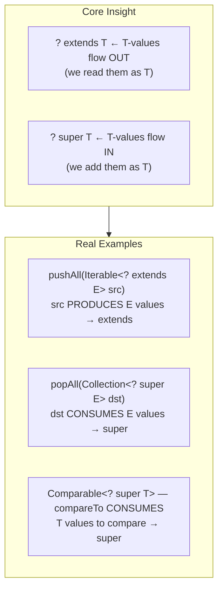

```java
// Stack<E> with PECS-correct methods:

// src is a PRODUCER of E values — use ? extends E
public void pushAll(Iterable<? extends E> src) {
    for (E e : src) push(e);
}

// dst is a CONSUMER of E values — use ? super E
public void popAll(Collection<? super E> dst) {
    while (!isEmpty()) dst.add(pop());
}
```

**The payoff:** `Stack<Number>` can now push from `Iterable<Integer>` and pop into `Collection<Object>` — the API is maximally flexible without sacrificing type safety.

> **Corollary:** `Comparator<T>` and `Comparable<T>` are consumers (they consume T values to produce a result). For maximum flexibility, declare them with `? super T`: `<T extends Comparable<? super T>>`.

---

### 5. Abstract Class vs Interface — The Deep Decision

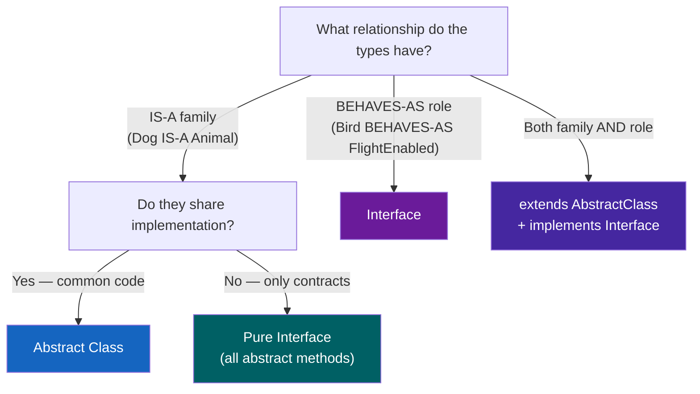

**The critical rule from Effective Java (Item 23):** Tagged classes (with discriminator fields + switch statements) are always inferior to class hierarchies. If you have a switch on a type tag, that's a sign you need an abstract class.

```java
// ❌ TAGGED CLASS — the anti-pattern
class Shape {
    enum Type { CIRCLE, RECTANGLE }
    Type shapeType;
    double radius; double length; double width;
    double area() {
        return switch (shapeType) { case CIRCLE -> ...; case RECTANGLE -> ...; }
    }
}

// ✅ CLASS HIERARCHY — the abstraction pattern
abstract class Shape { abstract double area(); }
class Circle extends Shape { double area() { return PI * r * r; } }
class Rectangle extends Shape { double area() { return l * w; } }
```

---

### 6. Nested Class Scope and Access Rules

#### The Hidden Outer Reference

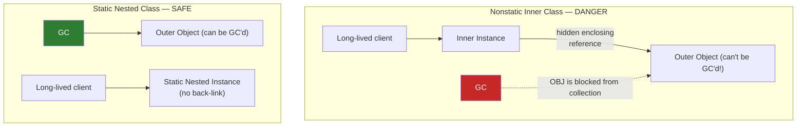

#### Effectively Final in Local Classes

Local and anonymous classes can only capture **effectively final** local variables:

```java
void method(String prefix) {      // prefix is effectively final
    class Printer {
        void print(String s) {
            System.out.println(prefix + s);  // ✅ captured from enclosing method
        }
    }
    prefix = "new";  // ❌ If you add this line, Printer won't compile!
    // "Local variable 'prefix' defined in enclosing scope must be final or effectively final"
}
```

**Why?** The local class instance may outlive the method stack frame. To avoid a dangling reference, Java copies the local variable's value at the time the class is instantiated — but only if the value never changes (effectively final).

#### The `.new` Syntax for Inner Classes

```java
// Static nested: no outer instance needed
Employee.EmployeeComparator<Employee> comp = new Employee.EmployeeComparator<>("name");

// Inner class: outer instance REQUIRED
StoreEmployee outer = new StoreEmployee();
StoreEmployee.StoreComparator<StoreEmployee> comp = outer.new StoreComparator<>();

// Or chained in one expression:
var comp = new StoreEmployee().new StoreComparator<>();
```

#### Resolving Shadowed Fields: `OuterClass.this`

```java
public class Meal {
    private double price = 5.0;  // Outer field

    private class Item {
        private double price;     // Inner field shadows outer!

        public Item() {
            this.price = Meal.this.price;  // Outer.this.field
            //           ^^^^^^^^^^^^ explicit outer reference
        }
    }
}
```

---

## :material-lightning-bolt: Design Patterns & Best Practices

### The Java Abstraction Toolkit

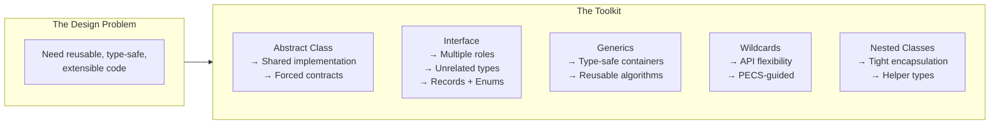

### Effective Java Best Practices Applied

| Practice                                         | Item    | Why It Matters                                                       |
| ------------------------------------------------ | ------- | -------------------------------------------------------------------- |
| Interfaces over abstract classes (when possible) | Item 20 | Records and enums can't extend classes, but can implement interfaces |
| Default methods: design carefully                | Item 21 | Adding defaults to existing interfaces can silently break invariants |
| Interfaces only to define types                  | Item 22 | Constant interfaces pollute namespace and leak impl details          |
| Class hierarchies over tagged classes            | Item 23 | Tagged classes need O(variants) switch updates; hierarchy is O(1)    |
| Static member classes over nonstatic             | Item 24 | Inner classes hold hidden outer ref → memory leak risk               |
| Don't use raw types                              | Item 26 | Raw types defer type errors to runtime                               |
| Eliminate unchecked warnings                     | Item 27 | Each warning = potential ClassCastException                          |
| Favor generic types                              | Item 29 | Generic containers remove client-side casts                          |
| Favor generic methods                            | Item 30 | Recursive type bound `<T extends Comparable<T>>`                     |
| Use bounded wildcards (PECS)                     | Item 31 | Maximum API flexibility without unsafe operations                    |

---

## :material-alert: Common Pitfalls

### 1. Trying to Instantiate an Abstract Class

```java
Animal a = new Animal("Dog", "big", 100); // ❌ "Cannot instantiate abstract class"
// ✅ Fix: Animal a = new Dog("Pug", "small", 20);
```

### 2. `abstract + private` and `abstract + final`

```java
private abstract void move(String speed);  // ❌ Contradictory: must override, but can't see
abstract final void move(String speed);    // ❌ Contradictory: must override, but can't override
```

### 3. Generic Array Creation

```java
// ❌ Cannot create generic arrays directly
E[] elements = new E[10];  // "generic array creation"

// ✅ Cast with @SuppressWarnings + comment
@SuppressWarnings("unchecked")
E[] elements = (E[]) new Object[10];  // Safe: array never exposed externally
```

### 4. Raw Comparable — The ClassCastException Trap

```java
class Student implements Comparable {     // ❌ Raw Comparable
    public int compareTo(Object o) {
        Student other = (Student) o;      // ClassCastException at runtime if misused!
    }
}

class Student implements Comparable<Student> {  // ✅ Parameterized
    public int compareTo(Student o) { ... }     // Type checked at compile time
}
```

### 5. Overloading on Type Arguments (Same Erasure)

```java
// ❌ Both erase to process(List) — compiler rejects
void process(List<String> list) { ... }
void process(List<Integer> list) { ... }

// ✅ One method with wildcard + instanceof
void process(List<?> list) {
    for (var e : list) {
        if (e instanceof String s) { ... }
        if (e instanceof Integer i) { ... }
    }
}
```

### 6. Calling Inner Class Methods Without an Outer Instance

```java
// ❌ Nonstatic inner class requires outer instance
var comp = new StoreEmployee.StoreComparator<>();  // Error!

// ✅ Must use outer instance to call .new
var comp = new StoreEmployee().new StoreComparator<>();
```

### 7. Adding Elements to `? extends T`

```java
// ❌ Cannot add to ? extends — compiler can't guarantee type safety
void readFrom(List<? extends Animal> list) {
    list.add(new Dog());  // COMPILE ERROR — might actually be List<Fish>
}

// ✅ Use ? extends only for reading
void readFrom(List<? extends Animal> list) {
    for (Animal a : list) { ... }  // Reading is always safe
}
```

### 8. Calling Interface Default Methods with Wrong Super

```java
// ❌ Plain super refers to the parent CLASS (Object), not the interface
return super.transition(stage);  // Compile error!

// ✅ Must qualify with the interface name
return FlightEnabled.super.transition(stage);  // Correct
```

---

## :material-lightbulb-on: Best Practices Checklist

**Abstract Classes:**

- [x] Make base classes `abstract` when direct instantiation makes no sense
- [x] Use `protected` for fields subclasses need to read directly
- [x] Use `final` on methods that must NOT be overridden by subclasses
- [x] Always provide a `super(...)` call chain in every subclass constructor
- [x] Prefer abstract classes over tagged classes with discriminator + switch

**Interfaces:**

- [x] Use interface types in parameters, return types, local vars, and fields (coding to interface)
- [x] Add `default` methods only when backwards compatibility requires it; document carefully
- [x] Never use interfaces as constant repositories — use utility classes or enums
- [x] Use `InterfaceName.super.method()` to call default methods from overriding implementations

**Generics:**

- [x] Never use raw types in new code — always specify type parameters
- [x] Eliminate all unchecked warnings; if suppressing, use narrowest scope + comment
- [x] Use upper bounds (`T extends X`) when a type parameter must call X's methods
- [x] Implement `Comparable<T>` (not raw `Comparable`) to prevent ClassCastException
- [x] Static methods in generic classes need their own type parameter declaration

**Wildcards:**

- [x] Producer (reads) → `? extends T`; Consumer (writes) → `? super T`
- [x] Never use wildcards in return types — they leak into client code
- [x] Use `Comparable<? super T>` for the most flexible natural-ordering constraints

**Nested Classes:**

- [x] Default to `static` for nested classes — only remove `static` if outer-instance access is genuinely needed
- [x] Prefer `static` nested class for Comparators, Builders, Entries, and helper types
- [x] In inner classes, use `Outer.this.field` to reference shadowed outer fields
- [x] Prefer lambdas over anonymous classes for functional interfaces (Topics 5+)

---

## :material-bookmark: Learning Resources

### Abstract Classes & Interfaces

- [Oracle — Abstract Methods and Classes](https://docs.oracle.com/javase/tutorial/java/IandI/abstract.html)
- [Oracle — Interfaces Tutorial](https://docs.oracle.com/javase/tutorial/java/IandI/createinterface.html)

### Generics

- [Oracle — Generics Tutorial](https://docs.oracle.com/javase/tutorial/java/generics/index.html)
- [Baeldung — Java Generics Deep Dive](https://www.baeldung.com/java-generics)
- [Angelika Langer — Java Generics FAQ](http://www.angelikalanger.com/GenericsFAQ/JavaGenericsFAQ.html) ⭐ The definitive reference

### Type Erasure

- [Oracle — Type Erasure](https://docs.oracle.com/javase/tutorial/java/generics/erasure.html)
- [Baeldung — Type Erasure](https://www.baeldung.com/java-type-erasure)

### Wildcards & PECS

- [Oracle — Wildcards](https://docs.oracle.com/javase/tutorial/java/generics/wildcards.html)
- [Baeldung — Wildcards in Java Generics](https://www.baeldung.com/java-generics-interview-questions#3-what-is-pecs)
- [Stack Overflow — What is PECS?](https://stackoverflow.com/questions/2723397/what-is-pecs-producer-extends-consumer-super) ⭐ Classic answer

### Nested Classes

- [Oracle — Nested Classes](https://docs.oracle.com/javase/tutorial/java/javaOO/nested.html)

### Effective Java

- [Effective Java 3rd Edition](https://www.oreilly.com/library/view/effective-java-3rd/9780134686097/)
- [GitHub — Effective Java Summary](https://github.com/HugoMatilla/Effective-JAVA-Summary)

---

## :material-link-variant: Related Topics

- [OOP & Class Design Internals](../topic-2-oop-class-design/summary.md)
- [Arrays, Lists & Autoboxing](../topic-3-arrays-lists-generics/summary.md)
- [Lambdas & Streams](../topic-5-lambdas-streams/summary.md) _(anonymous classes → lambdas)_

---

## :material-bookshelf: References

- **Course:** Tim Buchalka — Java Programming Masterclass (Sections 11, 12 & 13)
- **Book:** Effective Java — Joshua Bloch (Items 20–24, 26–27, 29–31)
- **API:** [java.lang.Comparable](https://docs.oracle.com/en/java/javase/17/docs/api/java.base/java/lang/Comparable.html)
- **API:** [java.util.Comparator](https://docs.oracle.com/en/java/javase/17/docs/api/java.base/java/util/Comparator.html)
- **API:** [java.util.List](https://docs.oracle.com/en/java/javase/17/docs/api/java.base/java/util/List.html)
- **Spec:** [JLS §8.1.4 — Superclasses and Subclasses](https://docs.oracle.com/javase/specs/jls/se17/html/jls-8.html#jls-8.1.4)
- **Spec:** [JLS §4.10 — Subtyping](https://docs.oracle.com/javase/specs/jls/se17/html/jls-4.html#jls-4.10)

---

_Completed: 2026-02-25 | Confidence: 9/10_
