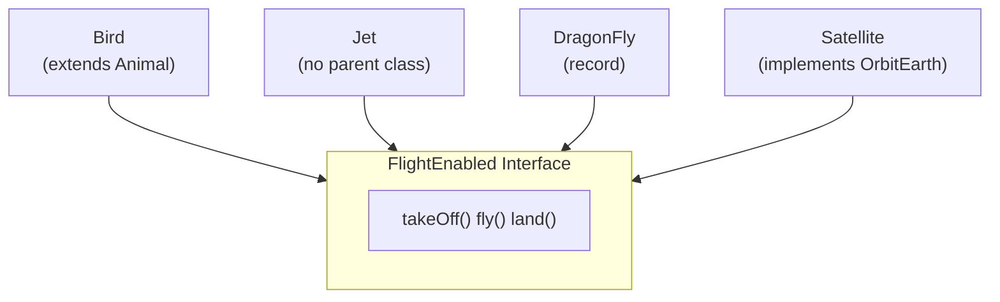
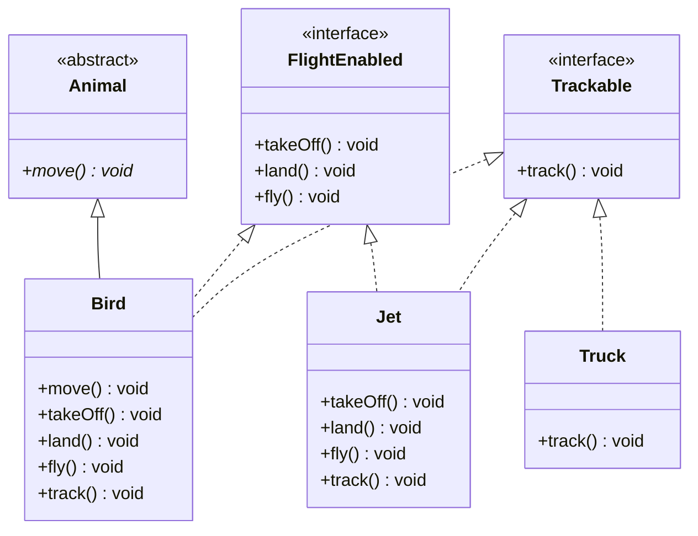
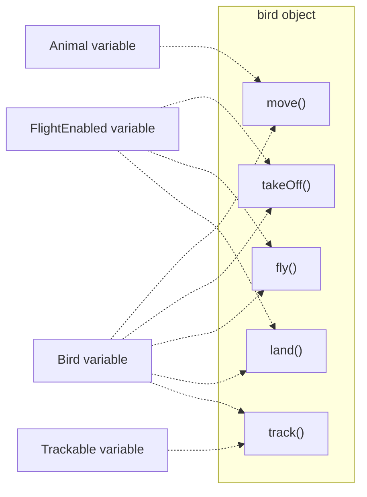
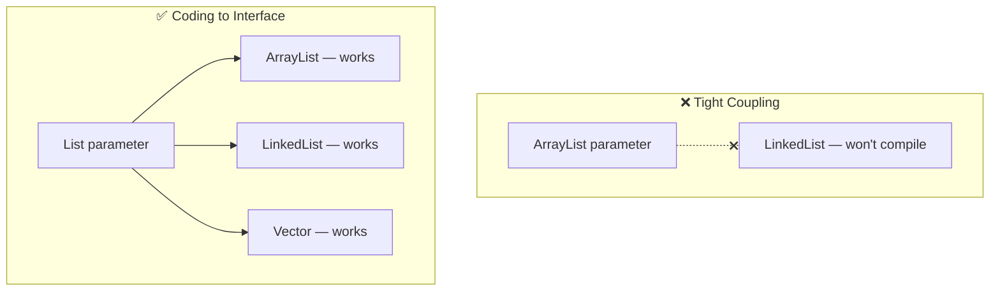
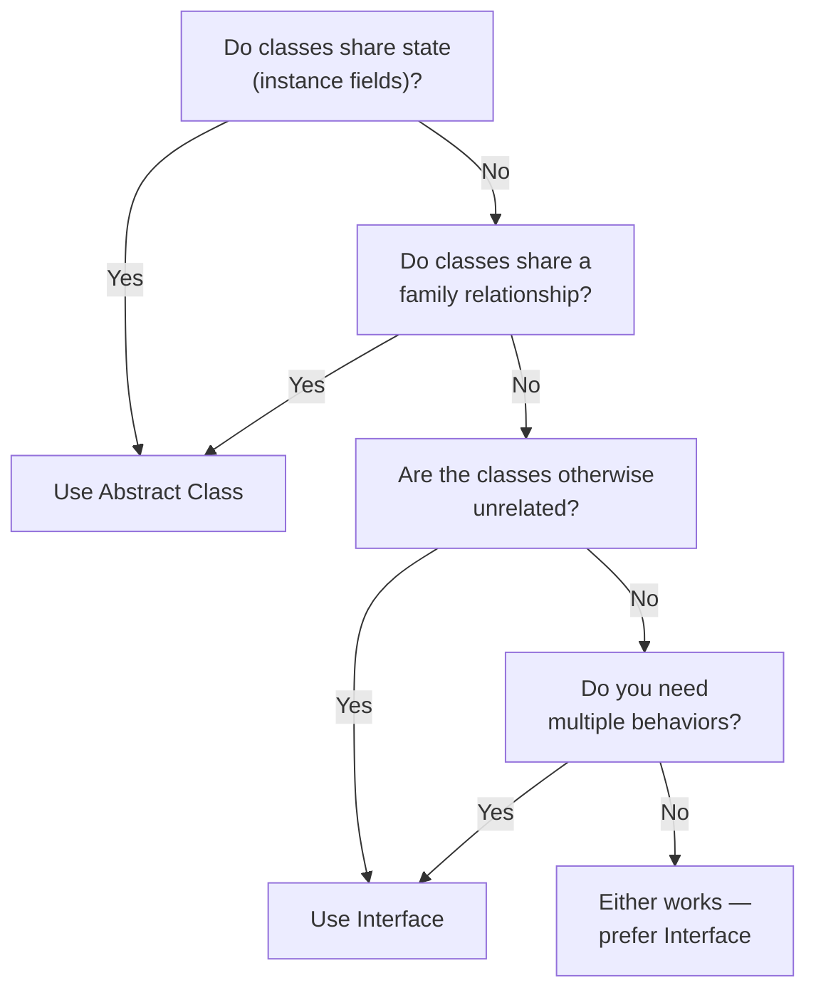
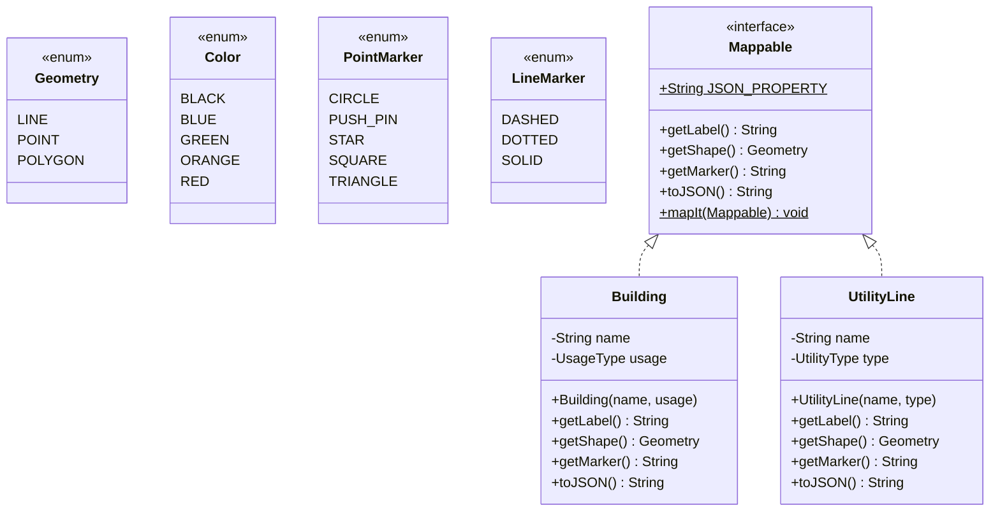
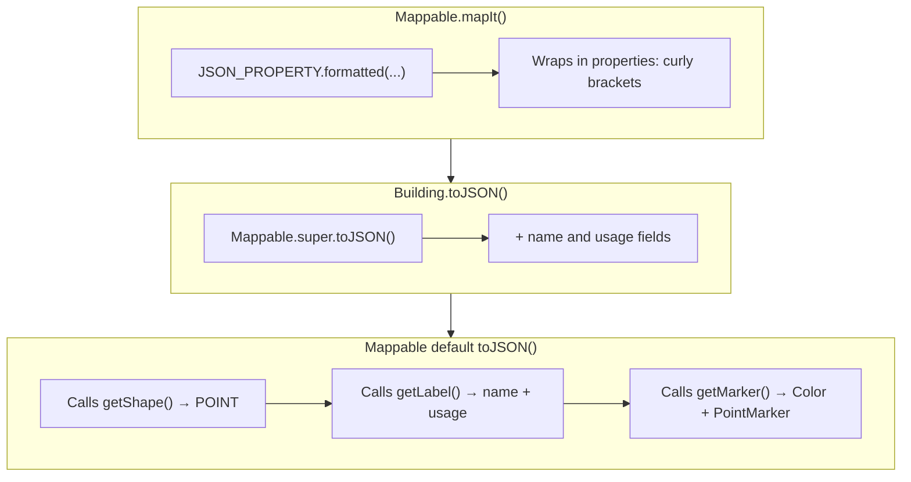
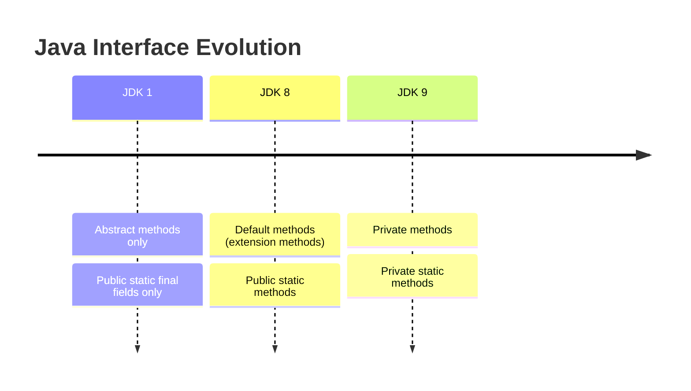

# :material-pencil: Topic Note: Interfaces & the Interface Challenge (Part 2 of Section 11)

> **Course:** Java Programming Masterclass — Tim Buchalka (Udemy)  
> **Section:** 11 — Mastering Abstraction & Interfaces (Lectures 8–16)  
> **Status:** :material-check-circle: Complete

---

## :material-target: Learning Objectives

By the end of this part, you should be able to:

- [x] Declare and implement **interfaces** in Java
- [x] Understand **implicit modifiers** on interface members (`public`, `abstract`, `static`, `final`)
- [x] Implement **multiple interfaces** on a single class
- [x] Use interfaces as **reference types** for polymorphism
- [x] Extend interfaces using `extends` (including multiple inheritance of type)
- [x] Have records, enums, and classes all implement interfaces
- [x] Declare and use **constants** (public static final fields) on interfaces
- [x] Apply the **"Coding to an Interface"** best practice
- [x] Use **default methods** (JDK 8) for backwards-compatible interface evolution
- [x] Use **static methods** (JDK 8) as interface helper utilities
- [x] Use **private methods** (JDK 9) for code reuse within interfaces
- [x] Compare and contrast **interface vs abstract class** design choices
- [x] Solve the **Mappable Interface Challenge** using all interface features

---

## :material-head-cog: 1. What Is an Interface?

An interface is **not a class** — it's a special type that acts as a **contract** between the class and client code, enforced by the compiler. By declaring that it implements an interface, a class promises to provide implementations of all the abstract methods the interface defines.

### Key Insight: Interfaces Unite Unrelated Types

Unlike abstract classes (which model "is-a" family relationships), interfaces let you group **completely unrelated types** by shared _behavior_:



> A Bird, Jet, DragonFly, and Satellite have **almost nothing in common** — yet they can all be treated uniformly as `FlightEnabled` objects.

---

## :material-head-cog: 2. Declaring and Implementing Interfaces

### Basic Declaration

```java
interface FlightEnabled {
    void takeOff();   // Implicitly public and abstract
    void land();      // No body — ends with ;
    void fly();
}

interface Trackable {
    void track();
}
```

### Implementing Interfaces

A class uses the `implements` keyword. It can implement **multiple** interfaces (separated by commas), and it can also extend a class at the same time:

```java
public class Bird extends Animal implements FlightEnabled, Trackable {

    @Override
    public void move() {
        System.out.println("Flaps its wings");
    }

    @Override
    public void takeOff() {
        System.out.println(getClass().getSimpleName() + " takes off");
    }

    @Override
    public void land() {
        System.out.println(getClass().getSimpleName() + " lands");
    }

    @Override
    public void fly() {
        System.out.println(getClass().getSimpleName() + " flies");
    }

    @Override
    public void track() {
        System.out.println(getClass().getSimpleName() + "'s coordinates recorded");
    }
}
```

**Key rule:** `extends` comes FIRST, `implements` comes SECOND in the declaration.



---

## :material-head-cog: 3. Implicit Modifiers — The Interface Rules

### Methods Without a Body

On an interface, any method declared **without** a body is automatically `public` and `abstract`. All three of these declarations are equivalent:

```java
public abstract void takeOff();  // Explicit — but redundant
abstract void takeOff();         // Partly explicit — still redundant  
void takeOff();                  // Preferred — clean and simple
```

!!! warning "Access Modifier Restrictions"
    - Methods without a body are **always public** — you CANNOT use `protected` or `private` on abstract interface methods
    - If you omit access modifiers on a **class** member → it's package-private
    - If you omit access modifiers on an **interface** member → it's **public**
    - This is an important difference to remember!

### Fields on Interfaces

Any field declared on an interface is implicitly **`public static final`** — making it a constant:

```java
interface FlightEnabled {
    // These are ALL identical — public static final is implied
    double MILES_TO_KM = 1.60934;
    public static final double KM_TO_MILES = 0.621371;  // Redundant modifiers
}
```

Access them like any static constant:

```java
double miles = 100 * FlightEnabled.KM_TO_MILES;
```

> **Why only constants?** An interface never gets instantiated and doesn't participate in inheritance. There's no object to hold instance state — so fields must be static and final.

---

## :material-head-cog: 4. Multiple Implementations & Polymorphism

### The Power: One Object, Many Types

When a class implements interfaces and extends a class, its instances can be assigned to **any** of those types:

```java
Bird bird = new Bird();           // Bird type — all methods available
Animal animal = bird;              // Animal type — only move()
FlightEnabled flier = bird;        // FlightEnabled — takeOff(), fly(), land()
Trackable tracked = bird;          // Trackable — only track()
```



> **The declared type determines which methods you can call.** Even though `bird` has all methods, a `FlightEnabled flier` variable can only call `FlightEnabled` methods.

### Method Using Interface Types

```java
private static void inFlight(FlightEnabled flier) {
    flier.takeOff();
    flier.fly();
    if (flier instanceof Trackable tracked) {
        tracked.track();  // Only if it's also Trackable
    }
    flier.land();
}

// Works with ANY FlightEnabled object:
inFlight(new Bird());  // Bird behavior
inFlight(new Jet());   // Jet behavior
```

### Truck — Implementing Only the Interface It Needs

```java
public class Truck implements Trackable {
    @Override
    public void track() {
        System.out.println(getClass().getSimpleName() + "'s coordinates recorded");
    }
}
```

A Truck can be tracked but can't fly — it only implements `Trackable`. Interfaces let you **mix and match** behaviors as needed.

---

## :material-head-cog: 5. Interface Extending Interface

An interface can **extend** another interface (not implement — that's only for classes):

```java
interface OrbitEarth extends FlightEnabled {
    void achieveOrbit();
}
```

Any class implementing `OrbitEarth` must implement:

- `achieveOrbit()` — from OrbitEarth
- `takeOff()`, `fly()`, `land()` — from FlightEnabled (inherited)

Important rules:

| Rule | Description |
|------|-------------|
| Interface uses `extends`, NOT `implements` | `interface B implements A` → ❌ compile error |
| Can extend **multiple** interfaces | `interface C extends A, B` → ✅ valid |
| Classes **implement**, interfaces **extend** | Different keywords for different relationships |

### Records and Enums Can Implement Interfaces

```java
// Record implementing FlightEnabled
record DragonFly(String name, String type) implements FlightEnabled {
    @Override
    public void takeOff() { }
    @Override
    public void land() { }
    @Override
    public void fly() { }
}

// Enum implementing Trackable
enum FlightStages implements Trackable {
    GROUNDED, LAUNCH, CRUISE, DATA_COLLECTION;

    @Override
    public void track() {
        if (this != GROUNDED) {
            System.out.println("Monitoring " + this);
        }
    }

    public FlightStages getNextStage() {
        FlightStages[] allStages = values();
        return allStages[(ordinal() + 1) % allStages.length];
    }
}
```

> **Records and enums can implement interfaces but CANNOT extend classes** (abstract or otherwise). This makes interfaces the _only_ way to add shared behavior contracts to records and enums.

---

## :material-head-cog: 6. Coding to an Interface — Best Practice

### The Problem: Tight Coupling to Specific Types

```java
// BAD: Method locked to ArrayList
private static void triggerFliers(ArrayList<FlightEnabled> fliers) {
    for (var flier : fliers) flier.takeOff();
}

// If you change to LinkedList, ALL methods break!
LinkedList<FlightEnabled> fliers = new LinkedList<>();
triggerFliers(fliers);  // ❌ Cannot pass LinkedList to ArrayList parameter
```

### The Solution: Use the Interface Type

```java
// GOOD: Method accepts ANY List implementation
private static void triggerFliers(List<FlightEnabled> fliers) {
    for (var flier : fliers) flier.takeOff();
}

// Both work now — no refactoring needed!
ArrayList<FlightEnabled> list1 = new ArrayList<>();
LinkedList<FlightEnabled> list2 = new LinkedList<>();
triggerFliers(list1);  // ✅
triggerFliers(list2);  // ✅
```



### Where to Apply This

Use interface types as the reference type for:

- ✅ Method **parameters**: `List<T>` instead of `ArrayList<T>`
- ✅ Method **return types**: return `List<T>` not `ArrayList<T>`
- ✅ **Local variables**: `List<T> items = new ArrayList<>()`
- ✅ **Class fields**: `private List<T> items`

> **Swapping implementations becomes a one-line change** instead of a system-wide refactor.

---

## :material-head-cog: 7. JDK 8 Enhancements: Default & Static Methods

### The Backwards Compatibility Problem

Before JDK 8, adding a new abstract method to an interface **broke every class** implementing it:

```java
// Adding this to FlightEnabled...
FlightStages transition(FlightStages stage);  // Abstract

// ...breaks Bird, Jet, Satellite, DragonFly — ALL must now implement it!
```

### Default Methods (Extension Methods)

The `default` keyword lets you provide a **concrete method on an interface** with a body:

```java
interface FlightEnabled {
    void takeOff();
    void land();
    void fly();

    // Default method — has a body, won't break existing implementations
    default FlightStages transition(FlightStages stage) {
        FlightStages nextStage = stage.getNextStage();
        System.out.println("Transitioning from " + stage + " to " + nextStage);
        return nextStage;
    }
}
```

**Key properties of default methods:**

| Property | Detail |
|----------|--------|
| Has a method body | Must have `{ }`, even if empty |
| Uses `default` keyword | NOT the same as package-private default access |
| Won't break existing classes | Existing implementations inherit the default behavior |
| Can be overridden | Subclasses can override with their own version |
| Can access `this` | At runtime, `this` refers to the implementing object |
| Call from override with `InterfaceName.super` | NOT just `super` — must qualify with interface name |

### Overriding a Default Method

Three choices (same as overriding a class method):

1. **Don't override** — inherit the default behavior
2. **Override completely** — ignore the default
3. **Override and call the default** — combine behaviors

```java
public class Jet implements FlightEnabled, Trackable {

    @Override
    public FlightStages transition(FlightStages stage) {
        System.out.println(getClass().getSimpleName() + " transitioning");
        // Must qualify super with interface name!
        return FlightEnabled.super.transition(stage);  // ✅
        // return super.transition(stage);              // ❌ Compile error!
    }
}
```

> **Why `FlightEnabled.super.transition()`?** Because interfaces aren't part of the class hierarchy. Plain `super` refers to the parent _class_ (which is `Object` for Jet). You must tell Java which interface's default method you mean.

### Public Static Methods (JDK 8)

Static helper methods can live directly on the interface:

```java
interface OrbitEarth extends FlightEnabled {
    void achieveOrbit();

    // Public static helper — called with OrbitEarth.log(...)
    static void log(String description) {
        var today = new java.util.Date();
        System.out.println(today + ": " + description);
    }
}

// Usage:
OrbitEarth.log("Testing " + new Satellite());
```

Before JDK 8, you'd need a separate helper class for static utilities related to an interface (like `Collections` for the `Collection` interface). Now they can be on the interface itself.

---

## :material-head-cog: 8. JDK 9 Enhancement: Private Methods

JDK 9 added **private methods** (both static and non-static) to interfaces, enabling code reuse between concrete methods:

```java
interface OrbitEarth extends FlightEnabled {
    void achieveOrbit();

    // Private static — accessible by static, default, and private methods
    private static void log(String description) {
        var today = new java.util.Date();
        System.out.println(today + ": " + description);
    }

    // Private non-static — supports default methods
    private void logStage(FlightStages stage, String description) {
        description = stage + ": " + description;
        log(description);  // Calls private static method
    }

    // Default method overriding parent interface's default
    @Override
    default FlightStages transition(FlightStages stage) {
        FlightStages nextStage = FlightEnabled.super.transition(stage);
        logStage(stage, "Transitioning to " + nextStage);  // Uses private method
        return nextStage;
    }
}
```

### Method Accessibility Matrix on Interfaces

| Method Type | Can call public static? | Can call default? | Can call private static? | Can call private non-static? |
|------------|:---:|:---:|:---:|:---:|
| **Public static** | ✅ | ❌ | ✅ | ❌ |
| **Default** | ✅ | ✅ | ✅ | ✅ |
| **Private static** | ✅ | ❌ | ✅ | ❌ |
| **Private non-static** | ✅ | ✅ | ✅ | ✅ |

### Complete Satellite Class

```java
class Satellite implements OrbitEarth {
    FlightStages stage = FlightStages.GROUNDED;

    public void achieveOrbit() {
        transition("Orbiting achieved!");
    }

    @Override
    public void takeOff() {
        transition("Taking off");
    }

    @Override
    public void land() {
        transition("Landing");
    }

    @Override
    public void fly() {
        achieveOrbit();
        transition("Data Collection while Orbiting");
    }

    // Overloaded (not overriding!) — different signature
    public void transition(String description) {
        System.out.println(description);
        stage = transition(stage);  // Calls OrbitEarth's default method
        stage.track();              // Each stage is Trackable
    }
}
```

---

## :material-head-cog: 9. Interface vs Abstract Class — Full Comparison

| Feature | Abstract Class | Interface |
|---------|---------------|-----------|
| **Instantiation** | ❌ Cannot instantiate | ❌ Cannot instantiate |
| **Constructors** | ✅ Yes — called by subclasses | ❌ No constructors |
| **Inherits from Object** | ✅ Implicitly extends `java.lang.Object` | ❌ Not a class at all |
| **Keyword to use** | `extends` (one only) | `implements` (many) |
| **Multiple inheritance** | ❌ Single class only | ✅ Can implement many interfaces |
| **Instance fields** | ✅ Any access modifier | ❌ Only public static final (constants) |
| **Abstract methods** | ✅ Any access except `private` | ✅ Implicitly `public abstract` |
| **Concrete methods** | ✅ Any access modifier | ✅ `default`, `static`, `private` only |
| **Who can use it** | Classes (via `extends`) | Classes, Records, Enums (via `implements`) |
| **Relationship modeled** | "**is-a**" (family hierarchy) | "**can-do**" (capability/behavior) |

### When to Use Which



**Use an Abstract Class when:**

- Classes are **closely related** (Animal → Dog, Mammal → Horse)
- You want **shared instance fields** (type, size, weight)
- You need **non-public access** on methods (protected, package-private)
- You want a **default implementation** that relies on instance state

**Use an Interface when:**

- **Unrelated classes** need the same behavior (Bird, Jet, DragonFly all fly)
- You want **multiple behavior contracts** on one class
- You want to **decouple** "what" from "how"
- Records and enums need to participate
- You're designing for **future extensibility**

> **Summary:** An abstract class provides a **common definition as a base class** for closely related types. An interface **decouples the "what" from the "how"** and makes different types behave in similar ways.

---

## :material-star: 10. Interface Challenge: The Mappable System

### Problem Statement

Create a `Mappable` interface that can be added to _any_ existing class so it can produce GeoJSON-like output for a mapping application. The interface should support:

- Three abstract methods: `getLabel()`, `getShape()`, `getMarker()`
- A constant `JSON_PROPERTY` template string
- A `default` method `toJSON()` that formats the interface properties
- A `static` method `mapIt()` that prints the full JSON output
- Two concrete classes: `Building` (POINT) and `UtilityLine` (LINE)

### Class Diagram



### The Mappable Interface

```java
enum Geometry {LINE, POINT, POLYGON}
enum Color {BLACK, BLUE, GREEN, ORANGE, RED}
enum PointMarker {CIRCLE, PUSH_PIN, STAR, SQUARE, TRIANGLE}
enum LineMarker {DASHED, DOTTED, SOLID}

public interface Mappable {

    // Constant — implicitly public static final
    String JSON_PROPERTY = """
          "properties": {%s}\s""";

    // 3 abstract methods — classes MUST implement these
    String getLabel();
    Geometry getShape();
    String getMarker();

    // Default method — provides base JSON formatting
    default String toJSON() {
        return """
                "type": "%s", "label": "%s", "marker": "%s"\s"""
                .formatted(getShape(), getLabel(), getMarker());
    }

    // Static helper — prints full JSON output for any Mappable
    static void mapIt(Mappable mappable) {
        System.out.println(JSON_PROPERTY.formatted(mappable.toJSON()));
    }
}
```

**Interface features used:**

| Feature | How Used |
|---------|----------|
| **Constant** | `JSON_PROPERTY` — template for all mappable output |
| **Abstract methods** | `getLabel()`, `getShape()`, `getMarker()` — forced on all implementations |
| **Default method** | `toJSON()` — base formatting, can be overridden to add more properties |
| **Static method** | `mapIt()` — utility to print any Mappable's JSON |

### Building — A POINT on the Map

```java
enum UsageType {ENTERTAINMENT, RESIDENTIAL, GOVERNMENT, SPORTS}

public class Building implements Mappable {
    private String name;
    private UsageType usage;

    public Building(String name, UsageType usage) {
        this.name = name;
        this.usage = usage;
    }

    @Override
    public String getLabel() {
        return name + " (" + usage + ")";
    }

    @Override
    public Geometry getShape() {
        return Geometry.POINT;
    }

    @Override
    public String getMarker() {
        return switch (usage) {
            case ENTERTAINMENT -> Color.GREEN + " " + PointMarker.TRIANGLE;
            case GOVERNMENT   -> Color.RED + " " + PointMarker.STAR;
            case RESIDENTIAL  -> Color.BLUE + " " + PointMarker.SQUARE;
            case SPORTS       -> Color.ORANGE + " " + PointMarker.PUSH_PIN;
            default           -> Color.BLACK + " " + PointMarker.CIRCLE;
        };
    }

    @Override
    public String toJSON() {
        return Mappable.super.toJSON() + """
                , "name": "%s", "usage": "%s"\s""".formatted(name, usage);
    }
}
```

### UtilityLine — A LINE on the Map

```java
enum UtilityType {ELECTRICAL, FIBER_OPTIC, GAS, WATER}

public class UtilityLine implements Mappable {
    private String name;
    private UtilityType type;

    public UtilityLine(String name, UtilityType type) {
        this.name = name;
        this.type = type;
    }

    @Override
    public String getLabel() {
        return name + " (" + type + ")";
    }

    @Override
    public Geometry getShape() {
        return Geometry.LINE;
    }

    @Override
    public String getMarker() {
        return switch (type) {
            case ELECTRICAL  -> Color.RED + " " + LineMarker.DASHED;
            case FIBER_OPTIC -> Color.GREEN + " " + LineMarker.DOTTED;
            case GAS         -> Color.ORANGE + " " + LineMarker.SOLID;
            case WATER       -> Color.BLUE + " " + LineMarker.SOLID;
            default          -> Color.BLACK + " " + LineMarker.SOLID;
        };
    }

    @Override
    public String toJSON() {
        return Mappable.super.toJSON() + """
                , "name": "%s", "utility": "%s"\s""".formatted(name, type);
    }
}
```

### The Main Class — Coding to the Interface

```java
public class Main {
    public static void main(String[] args) {
        // Coding to the interface: List<Mappable>, not ArrayList<Building>
        List<Mappable> mappables = new ArrayList<>();

        // Buildings — POINT geometry
        mappables.add(new Building("Sydney Town Hall", UsageType.GOVERNMENT));
        mappables.add(new Building("Sydney Opera House", UsageType.ENTERTAINMENT));
        mappables.add(new Building("Stadium Australia", UsageType.SPORTS));

        // Utility Lines — LINE geometry
        mappables.add(new UtilityLine("College St", UtilityType.FIBER_OPTIC));
        mappables.add(new UtilityLine("Olympic Blvd", UtilityType.WATER));

        // One loop handles ALL Mappable types
        for (var m : mappables) {
            Mappable.mapIt(m);
        }
    }
}
```

### Sample Output

```
"properties": {"type": "POINT", "label": "Sydney Town Hall (GOVERNMENT)", "marker": "RED STAR", "name": "Sydney Town Hall", "usage": "GOVERNMENT"}
"properties": {"type": "POINT", "label": "Sydney Opera House (ENTERTAINMENT)", "marker": "GREEN TRIANGLE", "name": "Sydney Opera House", "usage": "ENTERTAINMENT"}
"properties": {"type": "LINE", "label": "College St (FIBER_OPTIC)", "marker": "GREEN DOTTED", "name": "College St", "utility": "FIBER_OPTIC"}
```

### How `toJSON()` Override Works



---

## :material-alert: Common Pitfalls

### 1. Using `protected` on Interface Methods

```java
interface FlightEnabled {
    protected void takeOff();  // ❌ Compile error!
    // "Modifier 'protected' not allowed here"
}
```

**Fix:** Interface abstract methods are always `public`. Don't specify an access modifier, or use `public` (which is redundant).

### 2. Forgetting `public` When Implementing Interface Methods

```java
// In interface (implicitly public):
interface Mappable {
    String getLabel();  // public abstract
}

// In implementing class:
class Building implements Mappable {
    String getLabel() { ... }  // ❌ "Attempting to assign weaker access"
}
```

**Fix:** Always declare implementing methods as `public`, since interface methods are implicitly public:
```java
public String getLabel() { ... }  // ✅
```

### 3. Using `super` Instead of `InterfaceName.super`

```java
@Override
public FlightStages transition(FlightStages stage) {
    return super.transition(stage);              // ❌ "Cannot resolve method in Object"
    return FlightEnabled.super.transition(stage); // ✅ Correct!
}
```

**Why:** Interfaces are NOT part of the class hierarchy. `super` always refers to the parent _class_.

### 4. Interface Using `implements` Instead of `extends`

```java
interface OrbitEarth implements FlightEnabled { }  // ❌ Compile error!
interface OrbitEarth extends FlightEnabled { }     // ✅ Correct!
```

### 5. Adding Abstract Methods to Published Interfaces

```java
// Before: interface has 3 methods, 50 classes implement it
// After: add a 4th abstract method → ALL 50 classes break!
```

**Fix:** Use a `default` method instead — existing implementations inherit it without changes.

---

## :material-format-list-checks: Key Takeaways

1. **Interfaces are contracts, not classes** — they define _what_ without _how_
2. **Multiple interfaces per class** — one class can implement as many as it needs, unlike single inheritance
3. **Implicit modifiers matter** — interface methods are `public abstract` by default; fields are `public static final`
4. **"Coding to an Interface" is a best practice** — use `List<T>` not `ArrayList<T>` in declarations
5. **Default methods (JDK 8)** solve backwards compatibility — add new behavior without breaking existing implementations
6. **Static methods (JDK 8)** put helper utilities directly on the interface type
7. **Private methods (JDK 9)** enable code reuse between default methods
8. **Records and enums can implement interfaces** but cannot extend classes
9. **Interface vs Abstract Class is not either/or** — use abstract classes for shared state among family, interfaces for shared behavior among strangers
10. **`InterfaceName.super.method()`** is required to call default methods from overrides — plain `super` won't work

---

## :material-card-bulleted: Quick Reference

### Interface Method Types Summary

| JDK | Method Type | Has Body? | Modifier | Overridable? |
|-----|------------|:---------:|----------|:------------:|
| 1.0 | Abstract | ❌ | `public abstract` (implicit) | Must implement |
| 8 | Default | ✅ | `default` | ✅ Optional |
| 8 | Public Static | ✅ | `static` | ❌ |
| 9 | Private | ✅ | `private` | ❌ |
| 9 | Private Static | ✅ | `private static` | ❌ |

### Interface Evolution Timeline



---

## :material-navigation: Related Notes

| Part | Topic | Link |
|:----:|-------|------|
| 1 | Abstract Classes (Section 11, Lectures 1–7) | [Part 1 — Abstract Classes](topic-note.md) |
| 2 | Interfaces & Interface Challenge (Section 11, Lectures 8–16) | **You are here** |
| 3 | Generics: Classes, Bounds & Layer Challenge (Section 12, Lectures 1–6) | [Part 3 — Generics](topic-note-part3.md) |
| 4 | Comparable, Comparator, Wildcards, Type Erasure & Final Challenge (Section 12, Lectures 7–12) | [Part 4 — Advanced Generics](topic-note-part4.md) |
| 5 | Nested Classes, Local Types & Anonymous Classes (Section 13) | [Part 5 — Nested Classes](topic-note-part5.md) |

---

## :material-bookshelf: References

- **Course:** Tim Buchalka — Java Programming Masterclass (Section 11, Lectures 8–16)
- **API:** [java.lang.Comparable (Java 17)](https://docs.oracle.com/en/java/javase/17/docs/api/java.base/java/lang/Comparable.html)
- **Guide:** [Interfaces (Oracle Tutorial)](https://docs.oracle.com/javase/tutorial/java/IandI/createinterface.html)
- **Guide:** [Default Methods (Oracle Tutorial)](https://docs.oracle.com/javase/tutorial/java/IandI/defaultmethods.html)
- **Book:** Effective Java — Item 20: Prefer interfaces to abstract classes
- **Book:** Effective Java — Item 21: Design interfaces for posterity

---

*Last Updated: 2026-02-24 | Confidence: 9/10*
