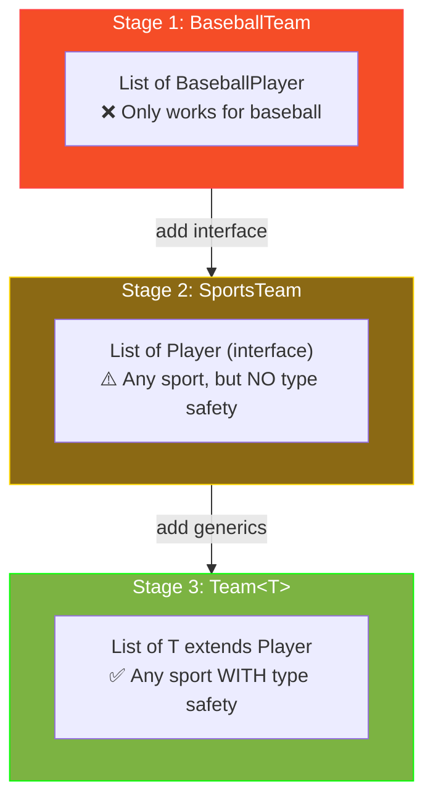
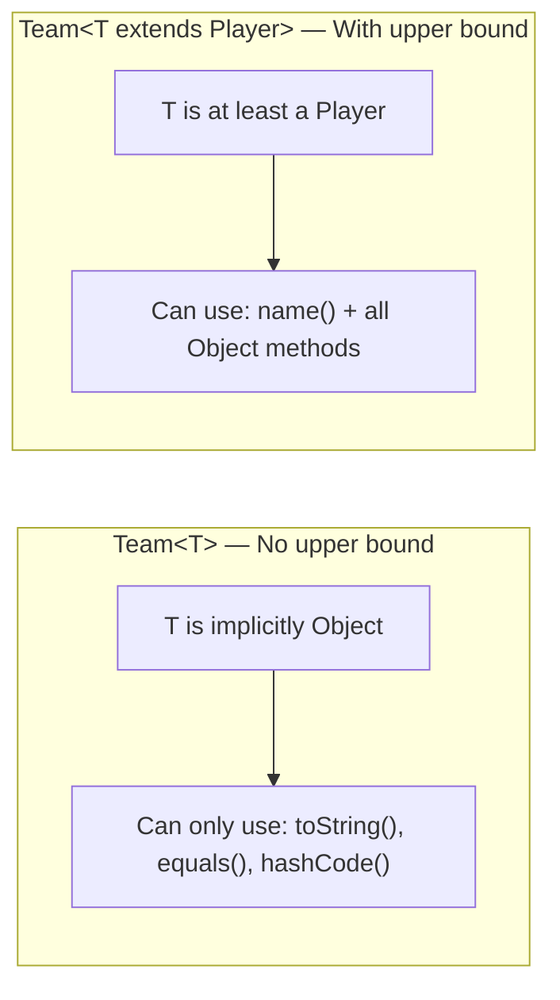
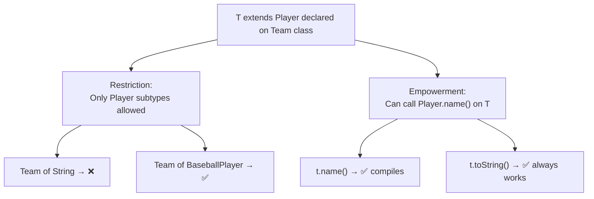
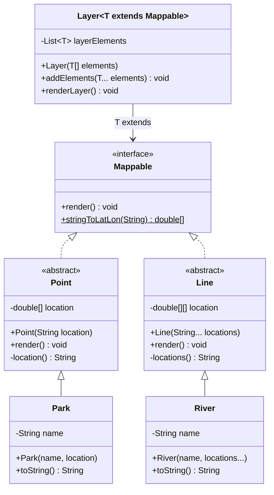
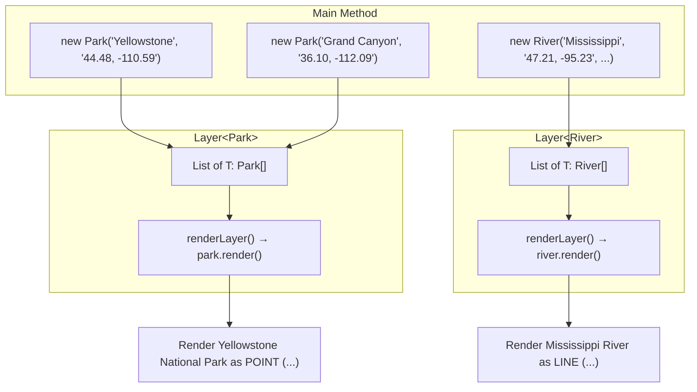
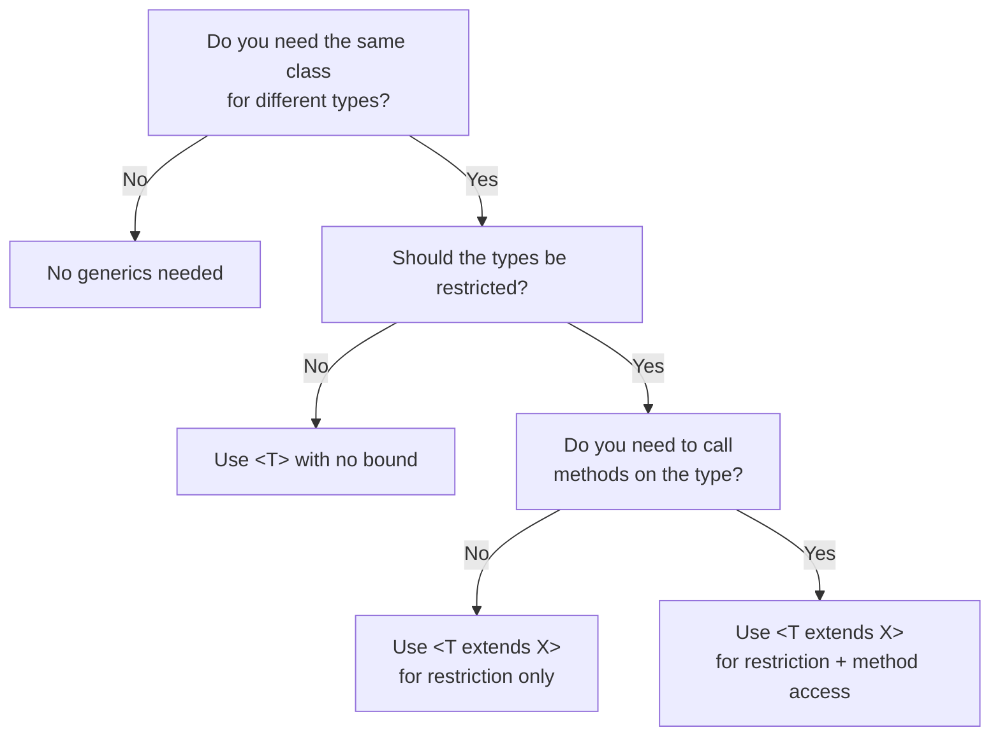

# :material-pencil: Topic Note: Java Generics — Classes, Bounds & the Layer Challenge (Part 3 — Section 12, Lectures 1–6)

> **Course:** Java Programming Masterclass — Tim Buchalka (Udemy)  
> **Section:** 12 — Deep Dive into Java Generics (Lectures 1–6)  
> **Status:** :material-check-circle: Complete

---

## :material-target: Learning Objectives

By the end of this part, you should be able to:

- [x] Explain **why generics exist** and what problem they solve
- [x] Identify the **three approaches** to reusable class design (copy-paste, polymorphism, generics) and their trade-offs
- [x] Write a **generic class** with one or more type parameters
- [x] Follow Java's **type parameter naming conventions** (T, E, K, V, S, U)
- [x] Understand **raw types** and why they are dangerous
- [x] Apply **upper bounds** (`T extends X`) to restrict type parameters
- [x] Explain both purposes of upper bounds: restricting types AND accessing bounded type's methods
- [x] Use **multiple type parameters** on a single generic class
- [x] Build the **Layer Challenge**: a generic container class bounded by a `Mappable` interface

---

## :material-head-cog: 1. Why Generics?

Generics enable us to design classes **without knowing the specific types** they'll work with. Instead of hard-coding a type, we use a **type parameter** — a placeholder that gets filled in later by whoever uses the class.

### The Core Problem

You've already used generics without knowing the internals:

```java
ArrayList<String> names = new ArrayList<>();       // T = String
ArrayList<Integer> scores = new ArrayList<>();     // T = Integer
ArrayList<Animal> animals = new ArrayList<>();     // T = Animal
```

`ArrayList` doesn't need to know it's working with `String`, `Integer`, or `Animal` — most of its operations (add, remove, get, contains) work for **any** type. That's the power of generics.

### Generic vs Non-Generic Declaration

```java
// NON-GENERIC — field type is locked to String
class RegularClass {
    private String field;
}

// GENERIC — field type is a placeholder T
class GenericClass<T> {
    private T field;
}
```

The `<T>` after the class name is the **type parameter declaration**. When you _use_ the class, you provide the actual type:

```java
GenericClass<String> a = new GenericClass<>();   // T becomes String
GenericClass<Integer> b = new GenericClass<>();  // T becomes Integer
```

---

## :material-head-cog: 2. The Evolution: From Specific to Generic

This section teaches generics through a **three-stage evolution** of the same class. Understanding this progression is crucial for grasping _why_ generics are needed.

### Stage 1: BaseballTeam — The Non-Generic Class

Our starting point: a `BaseballTeam` class that only works with `BaseballPlayer` records.

```java
record BaseballPlayer(String name, String position) {}

public class BaseballTeam {
    private String teamName;
    private List<BaseballPlayer> teamMembers = new ArrayList<>();
    private int totalWins = 0;
    private int totalLosses = 0;
    private int totalTies = 0;

    public BaseballTeam(String teamName) {
        this.teamName = teamName;
    }

    public void addTeamMember(BaseballPlayer player) {
        if (!teamMembers.contains(player)) {
            teamMembers.add(player);
        }
    }

    public void listTeamMembers() {
        System.out.println(teamName + " Roster:");
        System.out.println(teamMembers);
    }

    public int ranking() {
        return (totalLosses * 2) + totalTies + 1;
    }

    public String setScore(int ourScore, int theirScore) {
        String message = "lost to";
        if (ourScore > theirScore) {
            totalWins++;
            message = "beats";
        } else if (ourScore == theirScore) {
            totalTies++;
            message = "tied";
        } else {
            totalLosses++;
        }
        return message;
    }

    @Override
    public String toString() {
        return teamName + " (Ranked " + ranking() + ")";
    }
}
```

**Problem:** A football team wants the same functionality. Options:

1. ❌ **Copy-paste** the entire class and rename everything → code duplication
2. ⚠️ **Use polymorphism** (interface/abstract class for Players) → partially solves it
3. ✅ **Use generics** → the clean solution

### Stage 2: SportsTeam — The Polymorphic Approach

Create a `Player` interface and use it as the member type:

```java
interface Player {
    String name();
}

record BaseballPlayer(String name, String position) implements Player {}
record FootballPlayer(String name, String position) implements Player {}
```

```java
public class SportsTeam {
    private String teamName;
    private List<Player> teamMembers = new ArrayList<>();  // Any Player!
    // ... same fields and methods, but using Player instead of BaseballPlayer

    public void addTeamMember(Player player) {
        if (!teamMembers.contains(player)) {
            teamMembers.add(player);
        }
    }
}
```

**This is better, but has a critical flaw:**

```java
SportsTeam afc = new SportsTeam("Adelaide Crows");  // Football team
var tex = new FootballPlayer("Tex Walker", "Center half forward");
afc.addTeamMember(tex);  // ✅ Good — football player on football team

var guthrie = new BaseballPlayer("D Guthrie", "Center Fielder");
afc.addTeamMember(guthrie);  // ✅ Compiles! But WRONG — baseball player on football team!
```

> **There's no compile-time type checking!** Any `Player` can be added to any team. A baseball player on a football team compiles without error.

### Stage 3: Team\<T\> — The Generic Solution

```java
public class Team<T extends Player, S> {
    private String teamName;
    private List<T> teamMembers = new ArrayList<>();
    private int totalWins = 0;
    private int totalLosses = 0;
    private int totalTies = 0;
    private S affiliation;

    public Team(String teamName) {
        this.teamName = teamName;
    }

    public Team(String teamName, S affiliation) {
        this.teamName = teamName;
        this.affiliation = affiliation;
    }

    public void addTeamMember(T t) {
        if (!teamMembers.contains(t)) {
            teamMembers.add(t);
        }
    }

    public void listTeamMembers() {
        System.out.print(teamName + " Roster:");
        System.out.println(affiliation == null ? "" : " AFFILIATION: " + affiliation);
        for (T t : teamMembers) {
            System.out.println(t.name());
        }
    }

    public int ranking() {
        return (totalLosses * 2) + totalTies + 1;
    }

    public String setScore(int ourScore, int theirScore) {
        String message = "lost to";
        if (ourScore > theirScore) {
            totalWins++;
            message = "beats";
        } else if (ourScore == theirScore) {
            totalTies++;
            message = "tied";
        } else {
            totalLosses++;
        }
        return message;
    }

    @Override
    public String toString() {
        return teamName + " (Ranked " + ranking() + ")";
    }
}
```

Now the compiler **prevents mixing**:

```java
Team<BaseballPlayer, Affiliation> phillies = new Team<>("Philadelphia Phillies", philly);
Team<FootballPlayer, String> afc = new Team<>("Adelaide FC", "South Australia");

var guthrie = new BaseballPlayer("D Guthrie", "Center Fielder");
afc.addTeamMember(guthrie);  // ❌ COMPILE ERROR! Can't add BaseballPlayer to FootballPlayer team
```

### The Three Stages Compared



| Aspect                         | BaseballTeam           | SportsTeam               | Team\<T\>                  |
| ------------------------------ | ---------------------- | ------------------------ | -------------------------- |
| **Works for multiple sports?** | ❌ No                  | ✅ Yes                   | ✅ Yes                     |
| **Compile-time type safety?**  | ✅ Yes (only baseball) | ❌ No (any Player mixes) | ✅ Yes (compiler enforced) |
| **Can use Player methods?**    | ✅ Via BaseballPlayer  | ✅ Via Player interface  | ✅ Via upper bound         |
| **Code duplication needed?**   | ✅ For every sport     | ❌ One class             | ❌ One class               |

---

## :material-head-cog: 3. Type Parameter Naming Conventions

Type parameters use **single uppercase letters** by convention. This makes them easy to distinguish from real class names:

|    Letter     | Meaning             | Usage Example                                    |
| :-----------: | ------------------- | ------------------------------------------------ |
|      `T`      | **T** ype           | `class Team<T>` — most common general-purpose    |
|      `E`      | **E** lement        | `interface List<E>` — Java Collections Framework |
|      `K`      | **K** ey            | `interface Map<K, V>` — mapped types             |
|      `V`      | **V** alue          | `interface Map<K, V>` — paired with key          |
|      `N`      | **N** umber         | Numeric types                                    |
| `S`, `U`, `V` | 2nd, 3rd, 4th types | `class Team<T, S>` — multiple parameters         |

!!! note "Why single letters?"

    Using a single letter makes it immediately obvious that `T` is a **type parameter** and not a real class name. If your class had `Team<Player>`, it's ambiguous whether `Player` is a type parameter or an actual class reference.

### Multiple Type Parameters

You can have multiple type parameters, separated by commas:

```java
public class Team<T extends Player, S> {
    private List<T> teamMembers;  // T = the player type (bounded)
    private S affiliation;         // S = the affiliation type (unbounded)
}
```

Usage:

```java
Team<BaseballPlayer, Affiliation> phillies = new Team<>("Phillies", philly);
Team<FootballPlayer, String>      afc      = new Team<>("Adelaide FC", "South Australia");
Team<VolleyballPlayer, Affiliation> storm   = new Team<>("Adelaide Storm");
```

---

## :material-head-cog: 4. Raw Types — The Dangerous "No Type" Option

When you use a generic class **without** specifying a type parameter, you're using a **raw type**:

```java
// RAW TYPE — no type parameter specified
Team phillies = new Team("Philadelphia Phillies");   // ⚠️ Warning: raw use

// PARAMETERIZED TYPE — type parameter specified
Team<BaseballPlayer, Affiliation> phillies = new Team<>("Philadelphia Phillies");  // ✅
```

### Why Raw Types Exist

Raw types exist for **backwards compatibility** with pre-generics Java code (before JDK 5). They work, but they lose all the benefits of generics.

### Why They're Dangerous

Without a type parameter, **any object** can be used — there's no compile-time checking:

```java
Team raw = new Team("My Team");
raw.addTeamMember("Just a String");     // ✅ Compiles — but wrong!
raw.addTeamMember(42);                  // ✅ Compiles — but wrong!
raw.addTeamMember(new BaseballPlayer("X", "P"));  // ✅ Also compiles
```

!!! danger "Rule: NEVER use raw types in new code"

    Raw types bypass generic type checking entirely. When you don't specify a type parameter, `T` defaults to `Object`, meaning anything goes. IntelliJ will show yellow warnings for raw type usage — **always** fix them by adding type parameters.

### What Happens Without Upper Bounds

When you don't specify an upper bound, the implicit bound is `java.lang.Object`:

```java
class Team<T> {  // Implicitly: T extends Object
    // Can only call Object methods on T: toString(), equals(), hashCode()
    // CANNOT call T.name() — Object doesn't have a name() method!
}
```



---

## :material-head-cog: 5. Upper Bounds — Restricting and Empowering

The `extends` keyword in a type parameter declaration creates an **upper bound**:

```java
public class Team<T extends Player> { ... }
```

!!! warning "extends in generics ≠ extends in class declaration"

    In generics, `extends` means "**is a subtype of**" — it works for BOTH classes and interfaces. You always use `extends`, even if the bound is an interface. You NEVER use `implements` in a type parameter.

### Dual Purpose of Upper Bounds

**Purpose 1: Restrict** — Only types that are `Player` (or subtypes) can be used:

```java
Team<BaseballPlayer>  ✅  // BaseballPlayer implements Player
Team<FootballPlayer>  ✅  // FootballPlayer implements Player
Team<String>          ❌  // String does NOT implement Player
Team<Integer>         ❌  // Integer does NOT implement Player
```

**Purpose 2: Access functionality** — Inside the class, you can call `Player` methods on `T`:

```java
public void listTeamMembers() {
    for (T t : teamMembers) {
        System.out.println(t.name());  // ✅ Works because T extends Player, and Player has name()
    }
}
```

Without the bound, `t.name()` would fail because the compiler only knows `T` is `Object`.



### The Affiliation Record

The second type parameter `S` has no upper bound, demonstrating that bounds are optional per parameter:

```java
record Affiliation(String name, String type, String countryCode) {
    @Override
    public String toString() {
        return name + " (" + type + " in " + countryCode + ")";
    }
}

// S can be anything: Affiliation, String, or any class
Team<BaseballPlayer, Affiliation> phillies = new Team<>("Phillies",
    new Affiliation("city", "Philadelphia, PA", "US"));

Team<FootballPlayer, String> afc = new Team<>("Adelaide FC",
    "City of Adelaide, South Australia, in AU");
```

---

## :material-head-cog: 6. Primitives and Generics

You **cannot** use primitive types as type parameters:

```java
Team<int> team = new Team<>("My Team");  // ❌ Compile error!
```

Use the wrapper class instead:

```java
Team<Integer> team = new Team<>("My Team");  // ✅ (though makes no sense for a team of Integers)
```

Java's autoboxing/unboxing handles the conversion between primitives and their wrapper classes automatically.

---

## :material-head-cog: 7. Using the Generic Team

### Creating Teams

```java
var philly = new Affiliation("city", "Philadelphia, PA", "US");

// Baseball team with Affiliation record
Team<BaseballPlayer, Affiliation> phillies = new Team<>("Philadelphia Phillies", philly);
Team<BaseballPlayer, Affiliation> astros = new Team<>("Houston Astros");

// Football team with String affiliation
Team<FootballPlayer, String> afc = new Team<>("Adelaide FC",
    "City of Adelaide, South Australia, in AU");

// Volleyball team
Team<VolleyballPlayer, Affiliation> adelaide = new Team<>("Adelaide Storm");
```

### Adding Members and Scoring

```java
// Add players
phillies.addTeamMember(new BaseballPlayer("B Harper", "Right Fielder"));
phillies.addTeamMember(new BaseballPlayer("B Marsh", "Right Fielder"));
phillies.listTeamMembers();

afc.addTeamMember(new FootballPlayer("Tex Walker", "Center half forward"));
afc.addTeamMember(new FootballPlayer("Rory Laird", "Midfield"));
afc.listTeamMembers();

// Score a game
public static void scoreResult(Team team1, int t1Score, Team team2, int t2Score) {
    String message = team1.setScore(t1Score, t2Score);
    team2.setScore(t2Score, t1Score);
    System.out.printf("%s %s %s %n", team1, message, team2);
}

scoreResult(phillies, 3, astros, 5);
// Output: Philadelphia Phillies (Ranked 3) lost to Houston Astros (Ranked 1)
```

---

## :material-star: 8. Generic Class Challenge: The Layer System

### Problem Statement

Build a mapping layer system:

- A `Mappable` interface with a `render()` method and a static helper `stringToLatLon()`
- Abstract classes `Point` and `Line` implementing `Mappable`
- Concrete classes `Park` (extends Point) and `River` (extends Line)
- A **generic** `Layer<T extends Mappable>` class that serves as a typed container

### Class Diagram



### The Mappable Interface

```java
public interface Mappable {
    void render();  // Abstract — each type renders itself

    // Static helper — converts "lat, lon" String to double[]
    static double[] stringToLatLon(String location) {
        var splits = location.split(",");
        double lat = Double.parseDouble(splits[0]);
        double lng = Double.parseDouble(splits[1]);
        return new double[]{lat, lng};
    }
}
```

### Abstract Point and Line Classes

```java
abstract class Point implements Mappable {
    private final double[] location;

    public Point(String location) {
        this.location = Mappable.stringToLatLon(location);
    }

    @Override
    public void render() {
        System.out.println("Render " + this + " as POINT (" + location() + ")");
    }

    private String location() {
        return Arrays.toString(location);
    }
}

abstract class Line implements Mappable {
    private final double[][] location;

    public Line(String... locations) {
        this.location = new double[locations.length][];
        int index = 0;
        for (var l : locations) {
            this.location[index++] = Mappable.stringToLatLon(l);
        }
    }

    @Override
    public void render() {
        System.out.println("Render " + this + " as LINE (" + locations() + ")");
    }

    private String locations() {
        return Arrays.deepToString(location);
    }
}
```

**Key design decisions:**

| Decision                                       | Rationale                                                                         |
| ---------------------------------------------- | --------------------------------------------------------------------------------- |
| Both are **abstract**                          | Prevents direct instantiation — you must create specific types like Park or River |
| Both **implement Mappable**                    | Satisfies the interface contract — provides `render()`                            |
| `Point` stores `double[]`                      | Latitude + longitude as a 2-element array                                         |
| `Line` stores `double[][]`                     | Multiple lat/lon points forming a line (2D array)                                 |
| Constructors take **Strings**                  | Matches the format from Google Maps ("36.0617, -112.1077")                        |
| `Arrays.toString()` vs `Arrays.deepToString()` | `toString` for 1D arrays, `deepToString` for nested/2D arrays                     |

### Concrete Classes: Park and River

```java
public class Park extends Point {
    private final String name;

    public Park(String name, String location) {
        super(location);
        this.name = name;
    }

    @Override
    public String toString() {
        return name + " National Park";
    }
}
```

```java
public class River extends Line {
    private final String name;

    public River(String name, String... locations) {
        super(locations);
        this.name = name;
    }

    @Override
    public String toString() {
        return name + " River";
    }
}
```

Both are simple concrete classes that:

- Call `super(...)` to pass location data to the abstract parent
- Override `toString()` for readable rendering
- Inherit `render()` from their abstract parent (which uses `this.toString()`)

### The Generic Layer Class

```java
public class Layer<T extends Mappable> {

    private final List<T> layerElements;

    public Layer(T[] layerElements) {
        this.layerElements = new ArrayList<>(List.of(layerElements));
    }

    @SafeVarargs
    public final void addElements(T... elements) {
        layerElements.addAll(List.of(elements));
    }

    public void renderLayer() {
        for (T element : layerElements) {
            element.render();  // ✅ Works because T extends Mappable
        }
    }
}
```

**Why `T extends Mappable`?**

1. **Restricts** what types can be used — only `Mappable` implementations (Point, Line, Park, River, etc.)
2. **Empowers** the class to call `element.render()` — without the bound, the compiler wouldn't know `T` has a `render()` method

**Why `@SafeVarargs`?**

The `addElements(T... elements)` method uses a generic varargs parameter. Java generates a warning about potential heap pollution with generic varargs. The `@SafeVarargs` annotation tells the compiler you've verified this is safe. The method must be `final` (or `static` or `private`) to use this annotation.

### The Main Class — Assembling Layers

```java
public class Main {
    public static void main(String[] args) {
        // Create an array of Parks (Points)
        var nationalUSParks = new Park[]{
            new Park("Yellowstone", "44.4882, -110.5916"),
            new Park("Grand Canyon", "36.1085, -112.0965"),
            new Park("Yosemite", "37.8855, -119.5360")
        };

        // Create a Layer specifically for Parks
        Layer<Park> parkLayer = new Layer<>(nationalUSParks);
        parkLayer.renderLayer();

        // Create an array of Rivers (Lines)
        var majorUSRivers = new River[]{
            new River("Mississippi",
                "47.2160, -95.2348", "29.1566, -89.2495",
                "35.1556, -90.0659"),
            new River("Missouri",
                "45.9239, -111.4983", "38.8146, -90.1218")
        };

        // Create a Layer specifically for Rivers
        Layer<River> riverLayer = new Layer<>(majorUSRivers);
        riverLayer.addElements(
            new River("Colorado", "40.4708, -105.8286", "31.7811, -114.7724"),
            new River("Delaware", "42.2026, -75.0569", "39.4955, -75.5592")
        );
        riverLayer.renderLayer();
    }
}
```

### Sample Output

```
Render Yellowstone National Park as POINT ([44.4882, -110.5916])
Render Grand Canyon National Park as POINT ([36.1085, -112.0965])
Render Yosemite National Park as POINT ([37.8855, -119.536])
Render Mississippi River as LINE ([[47.216, -95.2348], [29.1566, -89.2495], [35.1556, -90.0659]])
Render Missouri River as LINE ([[45.9239, -111.4983], [38.8146, -90.1218]])
Render Colorado River as LINE ([[40.4708, -105.8286], [31.7811, -114.7724]])
Render Delaware River as LINE ([[42.2026, -75.0569], [39.4955, -75.5592]])
```

### How the System Flows



### Generics Type Safety in Action

```java
Layer<Park> parkLayer = new Layer<>(parks);
parkLayer.addElements(new River("Nile", "..."));  // ❌ Compile error! River ≠ Park

Layer<River> riverLayer = new Layer<>(rivers);
riverLayer.addElements(new Park("Zion", "..."));  // ❌ Compile error! Park ≠ River
```

The generic type `Layer<Park>` ensures **only Parks** can be in that layer. A `Layer<River>` only accepts Rivers. The compiler catches mixing at **compile time** — no runtime surprises.

---

## :material-alert: Common Pitfalls

### 1. Using Primitives as Type Parameters

```java
Team<int> team = new Team<>("Fail Team");  // ❌ Compile error!
// "Type argument cannot be of primitive type"
```

**Fix:** Use the wrapper class:

```java
Team<Integer> team = new Team<>("OK Team");  // ✅ (but probably wrong design)
```

### 2. Using Raw Types (No Type Parameter)

```java
Team phillies = new Team("Phillies");  // ⚠️ Raw type — compiles with warning
phillies.addTeamMember("A random String");  // ← No type checking!
```

**Fix:** Always specify the type parameter:

```java
Team<BaseballPlayer, Affiliation> phillies = new Team<>("Phillies");  // ✅
```

### 3. Forgetting the Upper Bound Restricts & Enables

```java
// Without upper bound:
class Team<T> {
    void listMembers() {
        for (T t : members) {
            System.out.println(t.name());  // ❌ "Cannot resolve method 'name' in Object"
        }
    }
}

// With upper bound:
class Team<T extends Player> {
    void listMembers() {
        for (T t : members) {
            System.out.println(t.name());  // ✅ Compiler knows T has name()
        }
    }
}
```

### 4. Using `implements` Instead of `extends` in Type Bounds

```java
class Layer<T implements Mappable> { }  // ❌ Compile error!
class Layer<T extends Mappable> { }     // ✅ Always use extends, even for interfaces
```

**Why:** In generic type bounds, `extends` means "is a subtype of" — it covers both class inheritance AND interface implementation.

### 5. Confusing `extends` in Bounds vs Class Declaration

```java
// In class declaration: means INHERITS FROM
class Dog extends Animal { }

// In generic bound: means IS A SUBTYPE OF (works for classes AND interfaces)
class Team<T extends Player> { }  // Player is an interface, not a class!
```

---

## :material-format-list-checks: Key Takeaways

1. **Generics solve the type-safety problem** — they let you write reusable code that the compiler still checks for correctness
2. **Three evolution stages:** Specific class → Polymorphic class (interface) → Generic class, each solving more problems
3. **Type parameters are placeholders** — `T`, `E`, `K`, `V` are conventions, not requirements
4. **Raw types lose all generic benefits** — always specify type parameters in new code
5. **Upper bounds serve two purposes:** restricting which types can be used AND enabling access to the bounded type's methods
6. **`extends` in generics always means "is a subtype of"** — whether the bound is a class or interface
7. **Primitives cannot be type parameters** — use wrapper classes (Integer, Double, etc.)
8. **Multiple type parameters** are supported — `<T, S>`, `<T extends X, S>`, etc.
9. **Generic classes know nothing about the specific types** they'll work with — `Layer` doesn't know about `Park` or `River`, only about `Mappable`
10. **Generics prevent bugs at compile time** — mixing types that should never be mixed is caught before the program runs

---

## :material-card-bulleted: Quick Reference

### Generic Class Declaration Syntax

```java
// One type parameter, no bound
class Box<T> { }

// One type parameter with upper bound
class Team<T extends Player> { }

// Two type parameters, one bounded
class Team<T extends Player, S> { }

// Using the generic class
Team<BaseballPlayer, Affiliation> team = new Team<>("Name");
```

### Type Bound Summary

| Declaration              | Meaning                   | Example Types Allowed                         |
| ------------------------ | ------------------------- | --------------------------------------------- |
| `<T>`                    | Any reference type        | String, Integer, Player, Object...            |
| `<T extends Player>`     | Must be Player or subtype | BaseballPlayer, FootballPlayer ✅ / String ❌ |
| `<T extends Comparable>` | Must implement Comparable | String ✅, Integer ✅ / Object ❌             |

### Decision Flowchart



---

## :material-navigation: Related Notes

| Part | Topic                                                                                         | Link                                              |
| :--: | --------------------------------------------------------------------------------------------- | ------------------------------------------------- |
|  1   | Abstract Classes (Section 11, Lectures 1–7)                                                   | [Part 1 — Abstract Classes](topic-note.md)        |
|  2   | Interfaces & Challenge (Section 11, Lectures 8–16)                                            | [Part 2 — Interfaces](topic-note-part2.md)        |
|  3   | Generics: Classes, Bounds & Layer Challenge (Section 12, Lectures 1–6)                        | **You are here**                                  |
|  4   | Comparable, Comparator, Wildcards, Type Erasure & Final Challenge (Section 12, Lectures 7–12) | [Part 4 — Advanced Generics](topic-note-part4.md) |
|  5   | Nested Classes, Local Types & Anonymous Classes (Section 13)                                  | [Part 5 — Nested Classes](topic-note-part5.md)    |

---

## :material-bookshelf: References

- **Course:** Tim Buchalka — Java Programming Masterclass (Section 12, Lectures 1–6)
- **API:** [java.util.ArrayList (Java 17)](https://docs.oracle.com/en/java/javase/17/docs/api/java.base/java/util/ArrayList.html)
- **Guide:** [Generics (Oracle Tutorial)](https://docs.oracle.com/javase/tutorial/java/generics/index.html)
- **Guide:** [Bounded Type Parameters (Oracle Tutorial)](https://docs.oracle.com/javase/tutorial/java/generics/bounded.html)
- **Book:** Effective Java — Item 26: Don't use raw types
- **Book:** Effective Java — Item 29: Favor generic types
- **Book:** Effective Java — Item 30: Favor generic methods

---

_Last Updated: 2026-02-24 | Confidence: 9/10_
