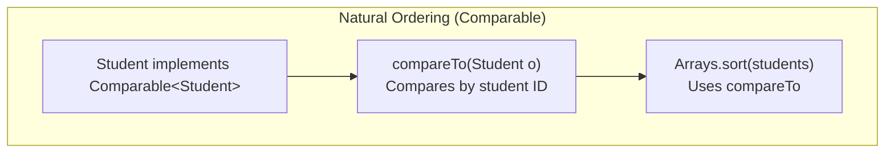
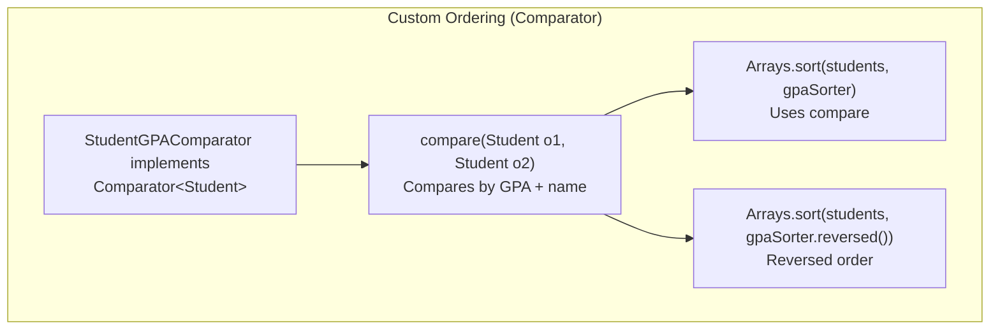
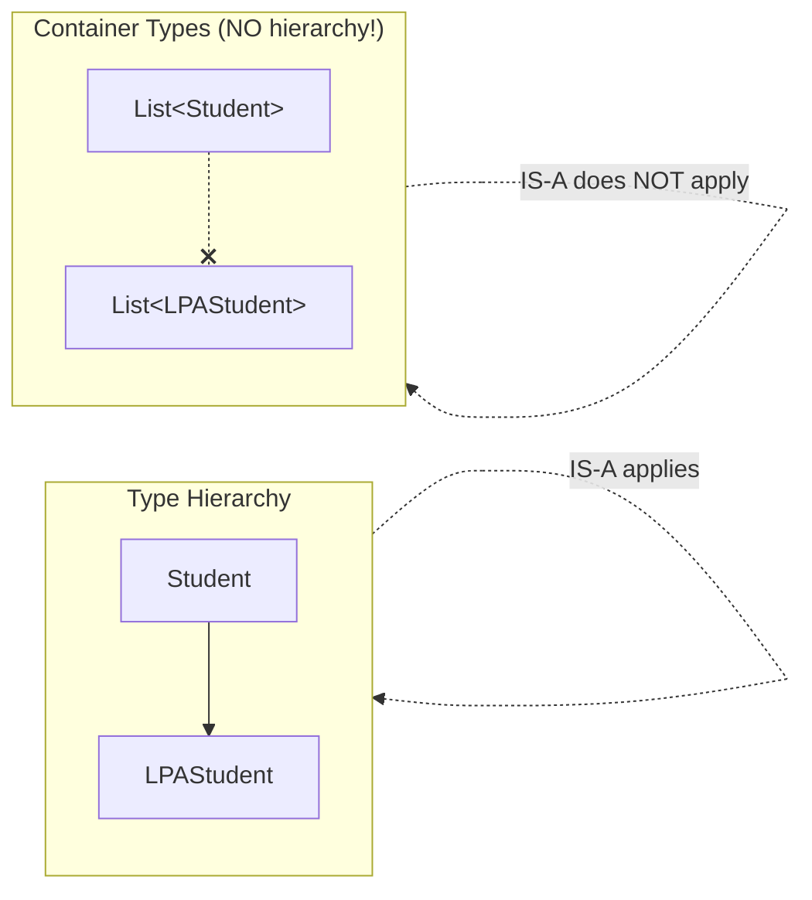
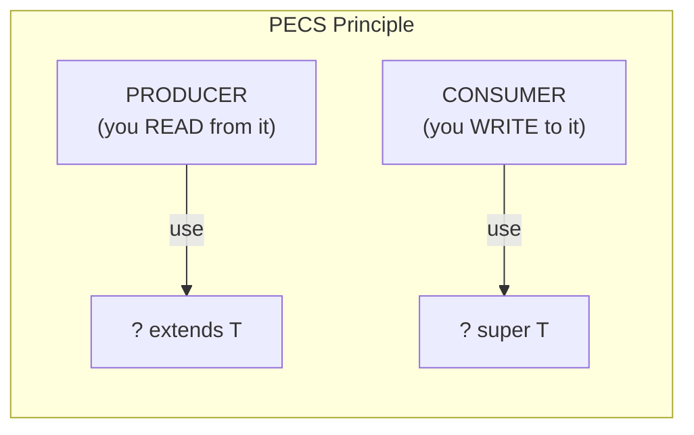
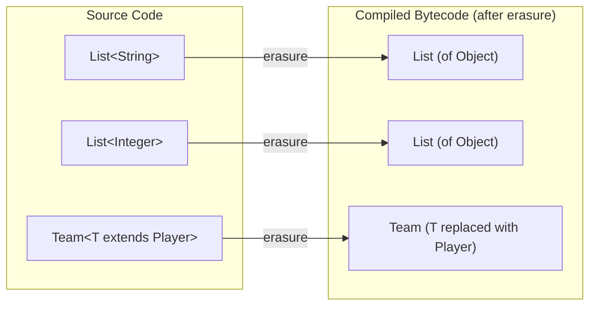
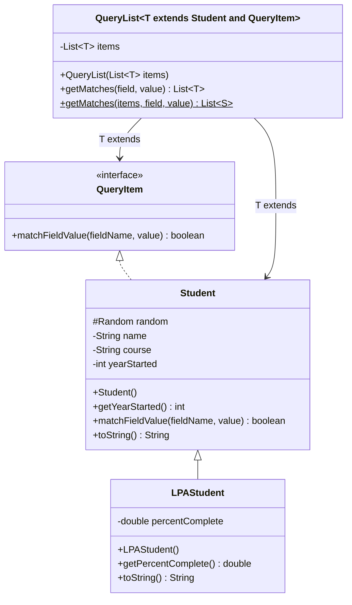
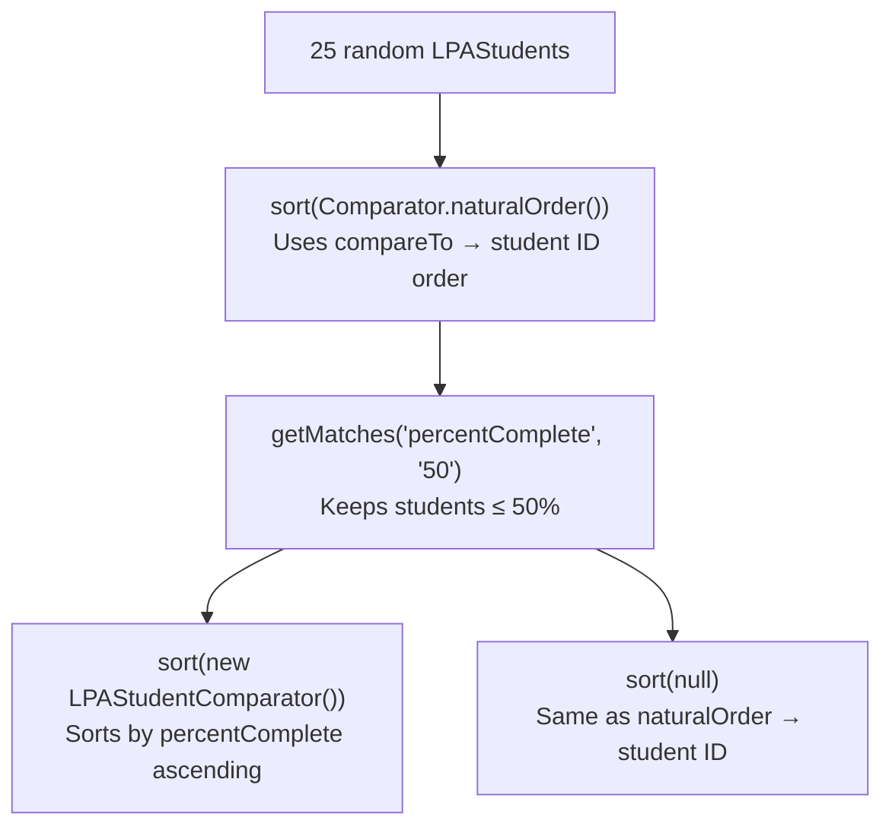
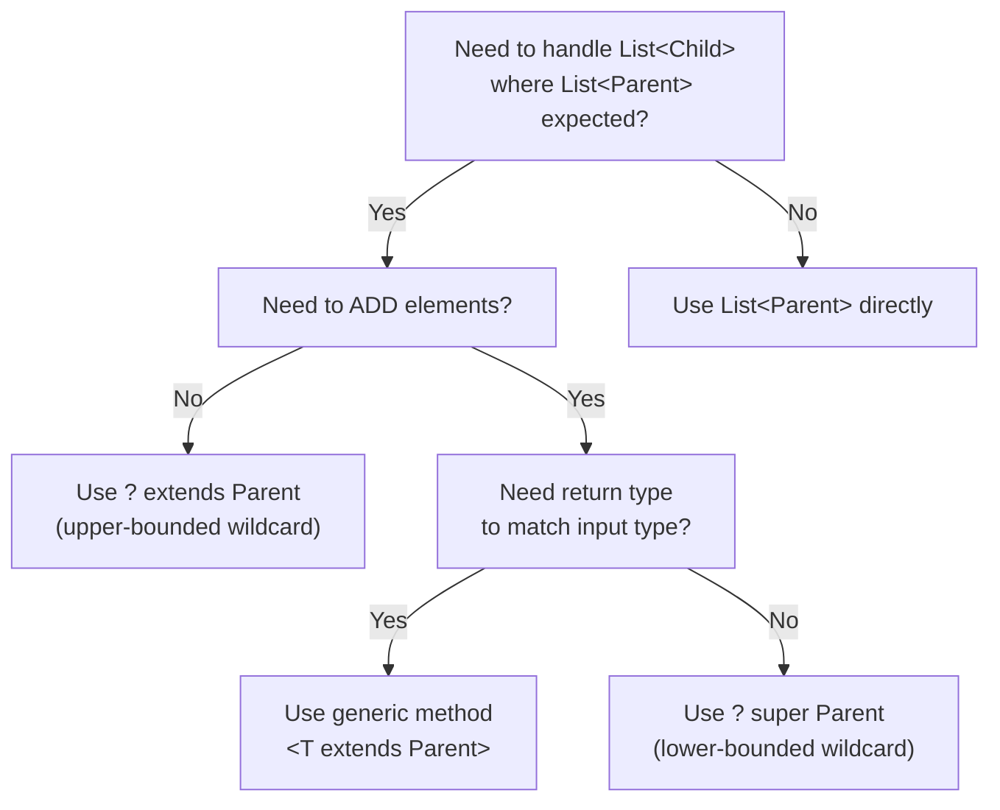

# :material-pencil: Topic Note: Comparable, Comparator, Wildcards, Type Erasure & Final Challenge (Part 4 — Section 12, Lectures 7–12)

> **Course:** Java Programming Masterclass — Tim Buchalka (Udemy)  
> **Section:** 12 — Deep Dive into Java Generics (Lectures 7–12)  
> **Status:** :material-check-circle: Complete

---

## :material-target: Learning Objectives

By the end of this part, you should be able to:

- [x] Implement `Comparable<T>` on a class and define its **natural ordering**
- [x] Understand how `compareTo` works for `Integer` and `String` (including character numeric values)
- [x] Know why raw `Comparable` (without type parameter) is dangerous and leads to `ClassCastException`
- [x] Implement a `Comparator<T>` class for **alternative sort orders**
- [x] Use `Comparator.naturalOrder()`, `Comparator.reversed()`, and `null` for sorting
- [x] Understand the distinction between **type parameters** and **type arguments**
- [x] Write **generic methods** (with `<T>` before the return type) on both generic and non-generic classes
- [x] Use **wildcards** (`?`) — unbounded, upper-bounded (`? extends X`), and lower-bounded (`? super X`)
- [x] Explain **type erasure** and why you can't overload methods that differ only by type arguments
- [x] Understand why `List<LPAStudent>` is NOT assignable to `List<Student>` (generic invariance)
- [x] Declare **multiple upper bounds** (`T extends Class & Interface`)
- [x] Know the difference between class type parameters and method type parameters (even when both use `T`)
- [x] Build the **Final Challenge**: `QueryList<T>` extending `ArrayList<T>`, with `Comparable` and `Comparator` sorting

---

## :material-head-cog: 1. Comparable\<T\> — Natural Ordering

### The Comparable Interface

`Comparable<T>` is a **generic interface** in `java.lang` with a single method:

```java
public interface Comparable<T> {
    int compareTo(T o);
}
```

`compareTo` compares `this` (the current instance) with the argument `o`, returning:

|   Return Value   | Meaning                        |
| :--------------: | ------------------------------ |
|       `0`        | `this` is **equal** to `o`     |
| Negative (`< 0`) | `this` is **less than** `o`    |
| Positive (`> 0`) | `this` is **greater than** `o` |

### How Integer Implements compareTo

```java
Integer five = 5;
Integer[] others = {0, 5, 10, -50, 50};

for (Integer i : others) {
    int val = five.compareTo(i);
    System.out.printf("%d %s %d: compareTo=%d%n", five,
            (val == 0 ? "==" : (val < 0) ? "<" : ">"), i, val);
}
```

**Output:**

```
5 > 0: compareTo=1
5 == 5: compareTo=0
5 < 10: compareTo=-1
5 > -50: compareTo=1
5 < 50: compareTo=-1
```

For `Integer`, compareTo returns exactly `-1`, `0`, or `1`.

### How String Implements compareTo

Strings compare **character by character** using their underlying integer (Unicode/ASCII) values:

```java
String banana = "banana";
String[] fruit = {"apple", "banana", "pear", "BANANA"};

for (String s : fruit) {
    int val = banana.compareTo(s);
    System.out.printf("%s %s %s: compareTo=%d%n", banana,
            (val == 0 ? "==" : (val < 0) ? "<" : ">"), s, val);
}
```

**Output:**

```
banana > apple: compareTo=1
banana == banana: compareTo=0
banana < pear: compareTo=-14
banana > BANANA: compareTo=32
```

!!! info "Why 32?"
Characters are stored as integers. Capital `A` = 65, lowercase `a` = 97. The difference is always 32. So comparing `'b'` (98) with `'B'` (66) gives 98 − 66 = **32**.

    | Character | Integer Value |
    |:---------:|:---:|
    | `A` | 65 |
    | `B` | 66 |
    | `P` | 80 |
    | `a` | 97 |
    | `b` | 98 |
    | `p` | 112 |

    `"banana".compareTo("pear")` → `'b'(98) - 'p'(112)` = **-14**

### Implementing Comparable on Your Own Class

**Step 1: Without type parameter (BAD — raw type)**

```java
class Student implements Comparable {  // ⚠️ Raw Comparable!
    String name;
    // ...

    @Override
    public int compareTo(Object o) {        // Parameter is Object!
        Student other = (Student) o;         // Must cast manually — dangerous!
        return name.compareTo(other.name);
    }
}
```

This compiles, but is dangerous:

```java
Student tim = new Student("Tim");
tim.compareTo("Mary");  // ✅ Compiles! ❌ ClassCastException at runtime!
```

**Step 2: With type parameter (GOOD — parameterized)**

```java
class Student implements Comparable<Student> {  // ✅ Typed!
    private static int LAST_ID = 1000;
    private static final Random random = new Random();

    String name;
    private int id;
    protected double gpa;

    public Student(String name) {
        this.name = name;
        id = LAST_ID++;
        gpa = random.nextDouble(1.0, 4.0);
    }

    @Override
    public int compareTo(Student o) {           // Parameter is Student, not Object!
        return Integer.valueOf(id).compareTo(Integer.valueOf(o.id));  // Compare by ID
    }

    @Override
    public String toString() {
        return "%d - %s (%.2f)".formatted(id, name, gpa);
    }
}
```

Now misuse is caught at **compile time**:

```java
tim.compareTo("Mary");  // ❌ Compile error! String is not Student
```

### Why Use `Integer.valueOf(id).compareTo(...)` Instead of `id - o.id`?

Subtracting primitive ints (`id - o.id`) can **overflow** for very large or very small values (e.g., `Integer.MIN_VALUE - 1` wraps around). Using `Integer.compareTo` is safer. Alternatively, use `Integer.compare(id, o.id)` which is a static method designed for this purpose.

### Natural Order and `Arrays.sort`

Once a class implements `Comparable<T>`, you can use `Arrays.sort()`:

```java
Student[] students = {new Student("Zach"), new Student("Ann"), new Student("Tim")};
Arrays.sort(students);  // ✅ Sorts by id (our compareTo implementation)
System.out.println(Arrays.toString(students));
```

!!! danger "ClassCastException without Comparable"
If your class does NOT implement `Comparable` and you call `Arrays.sort()`, you get a **runtime** `ClassCastException: MyClass cannot be cast to java.lang.Comparable`. This is NOT caught at compile time — the sort method uses a raw type internally.

---

## :material-head-cog: 2. Comparator\<T\> — Alternative Sort Orders

### The Problem

`Comparable` defines **one** natural ordering. But what if you want to sort students by GPA instead of ID? You shouldn't change `compareTo` — that's the natural order.

### The Solution: Comparator

`Comparator<T>` is a separate interface in `java.util`:

```java
public interface Comparator<T> {
    int compare(T o1, T o2);
}
```

Key difference from `Comparable`:

| Aspect                  | `Comparable<T>`               | `Comparator<T>`                     |
| ----------------------- | ----------------------------- | ----------------------------------- |
| **Package**             | `java.lang`                   | `java.util`                         |
| **Method**              | `compareTo(T o)` — 1 argument | `compare(T o1, T o2)` — 2 arguments |
| **Who implements?**     | The class being compared      | A **separate** class                |
| **Compares what?**      | `this` vs argument `o`        | Two external objects `o1` vs `o2`   |
| **How many per class?** | One (the natural order)       | Unlimited different comparators     |
| **Used by**             | `Arrays.sort(array)`          | `Arrays.sort(array, comparator)`    |

### Implementing a Comparator

```java
class StudentGPAComparator implements Comparator<Student> {
    @Override
    public int compare(Student o1, Student o2) {
        return (o1.gpa + o1.name).compareTo(o2.gpa + o2.name);
    }
}
```

This sorts by GPA first, then alphabetically by name if GPAs are equal.

### Using a Comparator

```java
Comparator<Student> gpaSorter = new StudentGPAComparator();
Arrays.sort(students, gpaSorter);            // Sort ascending by GPA
Arrays.sort(students, gpaSorter.reversed()); // Sort DESCENDING by GPA
```

### The `reversed()` Default Method

`Comparator` has a `reversed()` default method that returns a new comparator with the opposite ordering. This is much cleaner than swapping `o1`/`o2` in your compare method.

### Comparable + Comparator Flow





---

## :material-head-cog: 3. Generic Invariance — The Core Confusion

### The Problem

Consider this hierarchy: `LPAStudent extends Student`.

```java
List<Student> students = new ArrayList<>();
students.add(new LPAStudent());  // ✅ Works! LPAStudent IS-A Student

List<LPAStudent> lpaStudents = new ArrayList<>();
List<Student> alsoStudents = lpaStudents;  // ❌ COMPILE ERROR!
```

!!! warning "This is THE most confusing part of generics"

    Even though `LPAStudent` IS-A `Student`, `List<LPAStudent>` is **NOT** a `List<Student>`. This is called **generic invariance**.

### Why This Restriction Exists

If `List<LPAStudent>` were assignable to `List<Student>`, you could do:

```java
List<LPAStudent> lpaStudents = new ArrayList<>();
List<Student> students = lpaStudents;  // Hypothetically allowed
students.add(new Student());           // Adding a plain Student to an LPA list!
LPAStudent lpa = lpaStudents.get(0);   // 💥 ClassCastException: Student ≠ LPAStudent
```

Java prevents this at compile time to ensure type safety.

### The Same Applies to Method Parameters

```java
public static void printList(List<Student> students) { ... }

List<LPAStudent> lpaStudents = new ArrayList<>();
printList(lpaStudents);  // ❌ Compile error! List<LPAStudent> ≠ List<Student>
```



### Solutions to Generic Invariance

There are three approaches:

| Approach               | Syntax                                        | Can call methods on elements? |  Can add elements?  |
| ---------------------- | --------------------------------------------- | :---------------------------: | :-----------------: |
| Raw type               | `List`                                        |     Only `Object` methods     | ⚠️ Yes (but unsafe) |
| Generic method         | `<T extends Student> void printList(List<T>)` |      ✅ Student methods       |       ✅ Yes        |
| Upper-bounded wildcard | `void printList(List<? extends Student>)`     |      ✅ Student methods       |  ❌ No (read-only)  |

---

## :material-head-cog: 4. Generic Methods

A **generic method** declares its own type parameter, separate from any class type parameter:

```java
// Generic method on a NON-generic class
public static <T extends Student> void printList(List<T> students) {
    for (var student : students) {
        System.out.println(student.getYearStarted() + ": " + student);
    }
}
```

### Syntax

The type parameter goes **after modifiers** and **before the return type**:

```java
public static <T extends Student> void printList(List<T> students)
//             ^^^^^^^^^^^^^^^^^^^       ^^^^
//             type parameter             return type
```

### Key Properties of Generic Methods

| Property                                                 | Detail                                                                             |
| -------------------------------------------------------- | ---------------------------------------------------------------------------------- |
| Can exist on **any** class                               | Not just generic classes                                                           |
| Type parameter is **separate** from class type parameter | Even if both use `T`, they're different types                                      |
| Can have upper bounds                                    | `<T extends Student>` restricts and enables                                        |
| Type is usually **inferred**                             | From the argument passed                                                           |
| Can be **static**                                        | Static methods CANNOT use the class's type parameter — they must declare their own |

### When to Use

```java
// Both LPA and regular students work:
printList(students);     // ✅ T inferred as Student
printList(lpaStudents);  // ✅ T inferred as LPAStudent
```

!!! info "Generic method vs wildcard method"

    A generic method is preferred when:

    - You need to **add** elements to the collection
    - You need the type `T` in **multiple places** (parameters, return type, method body)
    - You need to **preserve** the element type for the return values

    A wildcard is preferred when:

    - You only **read** from the collection
    - The method logic doesn't depend on the specific type

---

## :material-head-cog: 5. Wildcards — `?`, `? extends T`, `? super T`

### What Is a Wildcard?

A wildcard (`?`) means "**unknown type**" in a type argument. It lets you write flexible method parameters.

### Critical Terminology

| Term               | Where Used                    | Example                                    |
| ------------------ | ----------------------------- | ------------------------------------------ |
| **Type parameter** | Class/method declaration      | `class Team<T>`, `<T> void print(List<T>)` |
| **Type argument**  | Variable/parameter references | `List<Student>`, `List<? extends Student>` |
| **Wildcard**       | Only in type arguments        | `List<?>`, `List<? extends Student>`       |

!!! danger "A wildcard can NEVER be used in:"

    ```java
    // Cannot use in class/method type parameter declaration:
    class Team<?> { } // ❌
    <? extends Student> void print() { } // ❌

        // Cannot use to instantiate:
    new ArrayList<?>()             // ❌
    ```

### The Three Types of Wildcards

#### 1. Unbounded: `List<?>`

Accepts a List of **any** type. Inside the method, elements are treated as `Object`:

```java
public static void testList(List<?> list) {
    for (var element : list) {
        if (element instanceof String s) {
            System.out.println("String: " + s.toUpperCase());
        } else if (element instanceof Integer i) {
            System.out.println("Integer: " + i.floatValue());
        }
    }
}

testList(new ArrayList<>(List.of("Able", "Barry", "Charlie")));  // ✅
testList(new ArrayList<>(List.of(1, 2, 3)));                     // ✅
```

**Limitations:** Can only treat elements as `Object`. Must use `instanceof` to access type-specific methods.

#### 2. Upper-Bounded: `List<? extends Student>`

Accepts a List of `Student` **or any subtype** of Student:

```java
public static void printMoreLists(List<? extends Student> students) {
    for (var student : students) {
        System.out.println(student.getYearStarted() + ": " + student);  // ✅ Can call Student methods
    }
}

printMoreLists(students);     // ✅ List<Student>
printMoreLists(lpaStudents);  // ✅ List<LPAStudent>
```

**Limitations:** You **cannot add** elements to the list:

```java
public static void printMoreLists(List<? extends Student> students) {
    Student last = students.get(students.size() - 1);  // ✅ Reading works
    students.set(0, last);  // ❌ Compile error! Can't write to ? extends
}
```

!!! info "Why can't you add?"

    The compiler doesn't know if this list is `List<Student>` or `List<LPAStudent>`. If it's really `List<LPAStudent>`, adding a plain `Student` would violate type safety. So Java prevents ALL writes to `? extends` collections.

#### 3. Lower-Bounded: `List<? super Student>`

Accepts a List of `Student` **or any supertype** (i.e., `Object`):

```java
void addStudents(List<? super Student> list) {
    list.add(new Student());     // ✅ Can add Student or subtypes
    list.add(new LPAStudent());  // ✅ LPAStudent IS-A Student
}
```

**Limitations:** Reading elements returns `Object` — you can't call Student methods without casting.

### Wildcard Summary Table

| Wildcard              | Accepts               | Can Read As |       Can Write       | Use Case                        |
| --------------------- | --------------------- | :---------: | :-------------------: | ------------------------------- |
| `<?>`                 | Any type              |  `Object`   |          ❌           | Most flexible, least useful     |
| `<? extends Student>` | Student or subtypes   |  `Student`  |          ❌           | **Producer** — reading elements |
| `<? super Student>`   | Student or supertypes |  `Object`   | ✅ Student & subtypes | **Consumer** — adding elements  |

### PECS: Producer Extends, Consumer Super



> **Producer Extends, Consumer Super** — If a parameter **produces** data you read, use `extends`. If it **consumes** data you add, use `super`. This is sometimes called the **Get and Put principle**.

---

## :material-head-cog: 6. Type Erasure

### What Is Type Erasure?

The Java compiler **erases** all type parameters at compile time, replacing them with their bounds (or `Object` if unbounded). The compiled bytecode contains **no generic type information**.



### Erasure Rules

| Declaration                     | Erased To               |
| ------------------------------- | ----------------------- |
| `T` (no bound)                  | `Object`                |
| `T extends Player`              | `Player`                |
| `T extends Student & QueryItem` | `Student` (first bound) |
| `List<String>`                  | `List` (of Object)      |
| `List<Integer>`                 | `List` (of Object)      |

### Why Does This Matter?

**You cannot overload methods that differ only by type argument:**

```java
// These two methods have the SAME erasure → List<Object>
public static void testList(List<String> list) { ... }   // ❌ Clash!
public static void testList(List<Integer> list) { ... }   // ❌ Clash!
// "Both methods have the same erasure"
```

After erasure, both become `testList(List list)` — identical signatures.

**Solution:** Use an unbounded wildcard with `instanceof`:

```java
public static void testList(List<?> list) {
    for (var element : list) {
        if (element instanceof String s) {
            System.out.println("String: " + s.toUpperCase());
        } else if (element instanceof Integer i) {
            System.out.println("Integer: " + i.floatValue());
        }
    }
}
```

### Type Erasure and `Comparable` Same-Erasure Error

When you implement `Comparable` with a type parameter AND have a raw `compareTo(Object)` method, you get:

```java
class Student implements Comparable<Student> {
    // This is the parameterized version:
    public int compareTo(Student o) { ... }   // After erasure: compareTo(Student)

    // This is the raw version from before:
    public int compareTo(Object o) { ... }    // After erasure: compareTo(Object)

    // ERROR: "both methods have the same erasure, yet neither overrides the other"
}
```

**Fix:** Delete the raw `compareTo(Object)` method — only keep the parameterized version.

---

## :material-head-cog: 7. Static Methods and Generic Classes

### The Problem

A generic class's type parameter belongs to **instances**, not to the class itself. Static methods exist at the class level and **cannot use** the class's type parameter:

```java
public class QueryList<T extends QueryItem> {

    // INSTANCE method — can use T ✅
    public List<T> getMatches(String field, String value) { ... }

    // STATIC method — CANNOT use T ❌
    public static List<T> getMatches(List<T> items, String field, String value) {
        // Error: "cannot be referenced from a static context"
    }
}
```

### The Solution: Declare a Method Type Parameter

Give the static method its **own** type parameter:

```java
public class QueryList<T extends QueryItem> {

    // Static method with its OWN type parameter S (separate from class's T)
    public static <S extends QueryItem> List<S> getMatches(
            List<S> items, String field, String value) {
        List<S> matches = new ArrayList<>();
        for (var item : items) {
            if (item.matchFieldValue(field, value)) {
                matches.add(item);
            }
        }
        return matches;
    }
}
```

!!! warning "S ≠ T here!"

    Even if you use `T` for both the class and the method, they're **completely independent**. The method's `T` shadows the class's `T`. Using different letters (`T` for class, `S` for method) makes this explicit.

### Calling a Static Generic Method

```java
// Type is INFERRED from the argument:
var matches = QueryList.getMatches(students, "YearStarted", "2021");
// students is List<Student> → S inferred as Student

// Type can be EXPLICITLY specified:
var matches = QueryList.<Student>getMatches(new ArrayList<>(), "Year", "2021");
//                      ^^^^^^^^^ explicit type argument
```

---

## :material-head-cog: 8. Multiple Upper Bounds

You can specify **multiple bounds** using `&`:

```java
public class QueryList<T extends Student & QueryItem> {
    // T must be BOTH a Student (or subtype) AND implement QueryItem
}
```

### Rules for Multiple Upper Bounds

| Rule                       | Detail                                                                  |
| -------------------------- | ----------------------------------------------------------------------- |
| Separated by `&`           | `T extends A & B & C`                                                   |
| At most **one class**      | Can have 0 or 1 class in the bound                                      |
| Class must be **first**    | `T extends Student & QueryItem` ✅ / `T extends QueryItem & Student` ❌ |
| Multiple interfaces OK     | `T extends Student & QueryItem & Comparable<Student>` ✅                |
| All conditions must be met | The type must satisfy ALL bounds                                        |

### Why Multiple Bounds?

```java
public class QueryList<T extends Student & QueryItem> {
    // Can call Student methods on T ✅
    // Can call QueryItem methods on T ✅
    // Only types that are BOTH are allowed ✅
}

// Employee implements QueryItem but is NOT a Student:
QueryList<Employee> employeeList = new QueryList<>();
// ❌ "Employee is not within its bound; should extend Student"
```

### Class Diagram with Multiple Bounds



---

## :material-head-cog: 9. The QueryItem Interface & QueryList Class

### QueryItem — A Searchable Contract

```java
public interface QueryItem {
    boolean matchFieldValue(String fieldName, String value);
}
```

Any class implementing this can be searched by field name and value.

### Student Implementing QueryItem

```java
public class Student implements QueryItem {
    private final String name;
    private final String course;
    private final int yearStarted;

    protected Random random = new Random();
    private static final String[] firstNames = {"Ann", "Bill", "Cathy", "John", "Tim"};
    private static final String[] courses = {"C++", "Java", "C", "Rust"};

    public Student() {
        int lastNameIndex = random.nextInt(65, 91);
        name = firstNames[random.nextInt(5)] + " " + (char) lastNameIndex;
        course = courses[random.nextInt(3)];
        yearStarted = random.nextInt(2015, 2027);
    }

    @Override
    public boolean matchFieldValue(String fieldName, String value) {
        String fName = fieldName.toUpperCase();
        return switch (fName) {
            case "NAME"   -> name.equalsIgnoreCase(value);
            case "COURSE" -> course.equalsIgnoreCase(value);
            case "YEAR"   -> yearStarted == Integer.parseInt(value);
            default       -> false;
        };
    }

    @Override
    public String toString() {
        return "%-15s %-15s %d".formatted(name, course, yearStarted);
    }

    public int getYearStarted() {
        return yearStarted;
    }
}
```

### LPAStudent — Extending Student

```java
public class LPAStudent extends Student {
    private final double percentComplete;

    public LPAStudent() {
        percentComplete = random.nextDouble(0, 100.001);
    }

    @Override
    public String toString() {
        return "%s %8.1f%%".formatted(super.toString(), percentComplete);
    }

    public double getPercentComplete() {
        return percentComplete;
    }
}
```

### QueryList — A Generic Searchable List

```java
public class QueryList<T extends Student & QueryItem> {
    private final List<T> items;

    public QueryList(List<T> items) {
        this.items = items;
    }

    public List<T> getMatches(String field, String value) {
        List<T> matches = new ArrayList<>();
        for (var item : items) {
            if (item.matchFieldValue(field, value)) {
                matches.add(item);
            }
        }
        return matches;
    }

    // Static generic method — its own type parameter S
    public static <S extends QueryItem> List<S> getMatches(
            List<S> items, String field, String value) {
        List<S> matches = new ArrayList<>();
        for (var item : items) {
            if (item.matchFieldValue(field, value)) {
                matches.add(item);
            }
        }
        return matches;
    }
}
```

### Using QueryList

```java
// Instance usage — type inferred from constructor argument
var queryList = new QueryList<>(lpaStudents);
var matches = queryList.getMatches("Course", "Java");
printMoreLists(matches);

// Static usage — type inferred from argument
var students2021 = QueryList.getMatches(students, "YearStarted", "2021");
printMoreLists(students2021);
```

---

## :material-star: 10. Final Challenge — The Complete Student System

### Challenge Requirements

1. Change `QueryList` to **extend `ArrayList`** (removing the items field)
2. Add a `studentId` field to `Student` and implement `Comparable<Student>` (natural sort by ID)
3. Implement a `Comparator` for alternate sorting (by percentComplete)
4. Override `matchFieldValue` on `LPAStudent` for percentage-based filtering
5. Sort 25 students in **two ways**: natural order and custom comparator

### The Final QueryList (Extending ArrayList)

```java
public class QueryList<T extends Student & QueryItem> extends ArrayList<T> {

    public QueryList() {}

    public QueryList(List<T> items) {
        super(items);
    }

    public QueryList<T> getMatches(String field, String value) {
        QueryList<T> matches = new QueryList<>();
        for (var item : this) {  // 'this' IS the ArrayList
            if (item.matchFieldValue(field, value)) {
                matches.add(item);
            }
        }
        return matches;  // Returns QueryList for chaining
    }
}
```

**Key changes from the original:**

| Change              | Before                | After                                 |
| ------------------- | --------------------- | ------------------------------------- |
| Inheritance         | Had a `List<T>` field | **Extends** `ArrayList<T>`            |
| Element access      | `items` field         | `this` (IS the list)                  |
| Constructor         | Assigns to field      | Calls `super(items)`                  |
| Return type         | `List<T>`             | `QueryList<T>` — enables **chaining** |
| No-args constructor | Not needed            | Added for empty list creation         |

### The Final Student (With Comparable)

```java
public class Student implements QueryItem, Comparable<Student> {
    private static int LAST_ID = 10_000;
    private final int studentID;

    private final String name;
    private final String course;
    private final int yearStarted;

    protected Random random = new Random();
    private static final String[] firstNames = {"Ann", "Bill", "Cathy", "John", "Tim"};
    private static final String[] courses = {"C++", "Java", "C", "Rust"};

    public Student() {
        studentID = LAST_ID++;
        int lastNameIndex = random.nextInt(65, 91);
        name = firstNames[random.nextInt(5)] + " " + (char) lastNameIndex;
        course = courses[random.nextInt(3)];
        yearStarted = random.nextInt(2015, 2027);
    }

    @Override
    public int compareTo(Student o) {
        return Integer.compare(studentID, o.studentID);
    }

    @Override
    public boolean matchFieldValue(String fieldName, String value) {
        String fName = fieldName.toUpperCase();
        return switch (fName) {
            case "NAME"   -> name.equalsIgnoreCase(value);
            case "COURSE" -> course.equalsIgnoreCase(value);
            case "YEAR"   -> yearStarted == Integer.parseInt(value);
            default       -> false;
        };
    }

    @Override
    public String toString() {
        return "%d %-15s %-15s %d".formatted(studentID, name, course, yearStarted);
    }
}
```

### The Final LPAStudent (With Override)

```java
public class LPAStudent extends Student implements QueryItem {
    private final double percentComplete;

    public LPAStudent() {
        percentComplete = random.nextDouble(0, 100.001);
    }

    @Override
    public String toString() {
        return "%s %8.1f%%".formatted(super.toString(), percentComplete);
    }

    public double getPercentComplete() {
        return percentComplete;
    }

    @Override
    public boolean matchFieldValue(String fieldName, String value) {
        if (fieldName.equalsIgnoreCase("percentComplete")) {
            return percentComplete <= Integer.parseInt(value);  // ≤ not ==
        }
        return super.matchFieldValue(fieldName, value);  // Delegate to Student
    }
}
```

!!! note "Why `<=` instead of `==`?"

    For percentage filtering, we want "students who are at most X% done" — a **range query** rather than an exact match. This makes the feature more practical.

### The LPAStudentComparator

```java
public class LPAStudentComparator implements Comparator<LPAStudent> {
    @Override
    public int compare(LPAStudent o1, LPAStudent o2) {
        return (int) (o1.getPercentComplete() - o2.getPercentComplete());
    }
}
```

### The Final Main Class

```java
public class Main {
    public static void main(String[] args) {

        QueryList<LPAStudent> queryList = new QueryList<>();
        for (int i = 0; i < 25; i++) {
            queryList.add(new LPAStudent());
        }

        // Sort by natural order (student ID)
        System.out.println("Ordered List:");
        queryList.sort(Comparator.naturalOrder());
        printList(queryList);

        // Filter: students ≤ 50% complete
        System.out.println("Matches (≤ 50% complete):");
        var matches = queryList.getMatches("percentComplete", "50");

        // Sort matches by percent complete (custom comparator)
        matches.sort(new LPAStudentComparator());
        printList(matches);

        // Sort matches by student ID (natural order)
        System.out.println("Ordered Matches:");
        matches.sort(null);  // null = natural order (Comparable)
        printList(matches);
    }

    public static void printList(List<?> students) {
        for (var student : students) {
            System.out.println(student);
        }
    }
}
```

### The Three Sorts Explained



| Sort Call                          | What Happens                                               |
| ---------------------------------- | ---------------------------------------------------------- |
| `sort(Comparator.naturalOrder())`  | Uses `compareTo` → sorted by student ID ascending          |
| `sort(new LPAStudentComparator())` | Uses `compare` → sorted by percent complete ascending      |
| `sort(null)`                       | Shortcut for natural order → uses `compareTo` → student ID |
| `sort(comparator.reversed())`      | Reverses any comparator → descending order                 |

### Method Chaining with QueryList

Because `getMatches` returns `QueryList<T>`, you can **chain** queries:

```java
var matches = queryList
    .getMatches("percentComplete", "50")   // ≤ 50% complete
    .getMatches("course", "Python");       // AND taking Python
```

This produces a result filtered by **both** conditions — students who are at most 50% complete AND taking the Python course.

---

## :material-alert: Common Pitfalls

### 1. Assuming `List<Child>` IS-A `List<Parent>`

```java
List<LPAStudent> lpaStudents = new ArrayList<>();
List<Student> students = lpaStudents;  // ❌ Compile error!
```

**Fix:** Use wildcards: `List<? extends Student>` accepts both.

### 2. Writing to an Upper-Bounded Wildcard

```java
void add(List<? extends Student> list) {
    list.add(new Student());  // ❌ Compile error! Can't add to ? extends
}
```

**Fix:** Use `List<? super Student>` if you need to add, or use a generic method `<T extends Student>`.

### 3. Overloading Methods That Differ Only by Type Argument

```java
void process(List<String> list) { }   // ❌ Same erasure
void process(List<Integer> list) { }  // ❌ as List<Object>
```

**Fix:** Use a single method with an unbounded wildcard and `instanceof`.

### 4. Using Raw Comparable (No Type Parameter)

```java
class Student implements Comparable {  // ⚠️ Raw type!
    public int compareTo(Object o) {   // Must cast manually
        Student other = (Student) o;   // 💥 ClassCastException if o isn't Student!
```

**Fix:** Always parameterize: `implements Comparable<Student>`.

### 5. Trying to Use Class Type Parameter in Static Method

```java
class QueryList<T extends QueryItem> {
    public static List<T> getMatches(List<T> items) { }  // ❌ T is instance-level!
}
```

**Fix:** Declare a separate method type parameter:

```java
public static <S extends QueryItem> List<S> getMatches(List<S> items) { }  // ✅
```

### 6. Forgetting the Class Must Come First in Multiple Bounds

```java
class QueryList<T extends QueryItem & Student> { }  // ❌ Class must be first!
class QueryList<T extends Student & QueryItem> { }  // ✅
```

### 7. Not Implementing Comparable Before Calling `sort(Comparator.naturalOrder())`

```java
List<Student> students = ...;
students.sort(Comparator.naturalOrder());  // 💥 ClassCastException if !Comparable
```

**Fix:** Make sure your class implements `Comparable<T>` OR always pass a specific `Comparator` (not `naturalOrder()`).

---

## :material-format-list-checks: Key Takeaways

1. **`Comparable<T>`** defines ONE natural ordering; implement it ON the class being sorted
2. **`Comparator<T>`** defines ALTERNATIVE orderings; implement it on a SEPARATE class
3. **Always parameterize** `Comparable<Student>` and `Comparator<Student>` — never use raw types
4. **Generic invariance** — `List<Child>` is NOT a `List<Parent>`, even if `Child extends Parent`
5. **Wildcards** solve invariance: `? extends T` for reading, `? super T` for writing (PECS)
6. **Type erasure** removes generics at compile time — you can't overload by type argument
7. **Generic methods** declare their own type parameter, independent of any class type parameter
8. **Static methods** on generic classes MUST declare their own type parameter — they can't use the class's
9. **Multiple upper bounds** use `&` — at most one class (listed first), then interfaces
10. **`sort(null)` uses natural order** (Comparable) — same as `sort(Comparator.naturalOrder())`
11. **Method chaining** — returning `QueryList<T>` from `getMatches()` lets you chain queries
12. **`compareTo` contract** — should be consistent with `equals()` for a true natural ordering

---

## :material-card-bulleted: Quick Reference

### Comparable vs Comparator at a Glance

```java
// COMPARABLE — natural order on the class itself
class Student implements Comparable<Student> {
    public int compareTo(Student o) {
        return Integer.compare(this.id, o.id);
    }
}
Arrays.sort(students);  // Uses compareTo

// COMPARATOR — external alternative order
class GPAComparator implements Comparator<Student> {
    public int compare(Student o1, Student o2) {
        return Double.compare(o1.gpa, o2.gpa);
    }
}
Arrays.sort(students, new GPAComparator());           // Ascending
Arrays.sort(students, new GPAComparator().reversed()); // Descending
```

### Wildcard Cheat Sheet

```java
List<?>               // Unbounded — any type, read as Object
List<? extends T>     // Upper-bounded — T or subtypes, read as T, NO writes
List<? super T>       // Lower-bounded — T or supertypes, read as Object, CAN write T

// PECS: Producer Extends, Consumer Super
void copy(List<? extends T> src, List<? super T> dst) {
    for (T item : src) dst.add(item);
}
```

### Generic Method Syntax

```java
// Instance generic method
public <T> void method(List<T> list) { }

// Static generic method with bound
public static <T extends Student> void printList(List<T> list) { }

// Calling with explicit type argument
QueryList.<Student>getMatches(list, field, value);
```

### Sort Method Variations

```java
list.sort(null);                           // Natural order (Comparable)
list.sort(Comparator.naturalOrder());      // Natural order (explicit)
list.sort(Comparator.reverseOrder());      // Reverse natural order
list.sort(new MyComparator());             // Custom comparator
list.sort(new MyComparator().reversed());  // Reversed custom comparator
```

### Decision Flowchart: Which Approach?



---

## :material-navigation: Related Notes

| Part | Topic                                                                                         | Link                                            |
| :--: | --------------------------------------------------------------------------------------------- | ----------------------------------------------- |
|  1   | Abstract Classes (Section 11, Lectures 1–7)                                                   | [Part 1 — Abstract Classes](topic-note.md)      |
|  2   | Interfaces & Challenge (Section 11, Lectures 8–16)                                            | [Part 2 — Interfaces](topic-note-part2.md)      |
|  3   | Generics: Classes, Bounds & Layer Challenge (Section 12, Lectures 1–6)                        | [Part 3 — Generics Basics](topic-note-part3.md) |
|  4   | Comparable, Comparator, Wildcards, Type Erasure & Final Challenge (Section 12, Lectures 7–12) | **You are here**                                |
|  5   | Nested Classes, Local Types & Anonymous Classes (Section 13)                                  | [Part 5 — Nested Classes](topic-note-part5.md)  |

---

## :material-bookshelf: References

- **Course:** Tim Buchalka — Java Programming Masterclass (Section 12, Lectures 7–12)
- **API:** [java.lang.Comparable (Java 17)](https://docs.oracle.com/en/java/javase/17/docs/api/java.base/java/lang/Comparable.html)
- **API:** [java.util.Comparator (Java 17)](https://docs.oracle.com/en/java/javase/17/docs/api/java.base/java/util/Comparator.html)
- **Guide:** [Wildcards (Oracle Tutorial)](https://docs.oracle.com/javase/tutorial/java/generics/wildcards.html)
- **Guide:** [Type Erasure (Oracle Tutorial)](https://docs.oracle.com/javase/tutorial/java/generics/erasure.html)
- **Book:** Effective Java — Item 14: Consider implementing Comparable
- **Book:** Effective Java — Item 26: Don't use raw types
- **Book:** Effective Java — Item 28: Prefer lists to arrays
- **Book:** Effective Java — Item 31: Use bounded wildcards to increase API flexibility

---

_Last Updated: 2026-02-24 | Confidence: 9/10_
