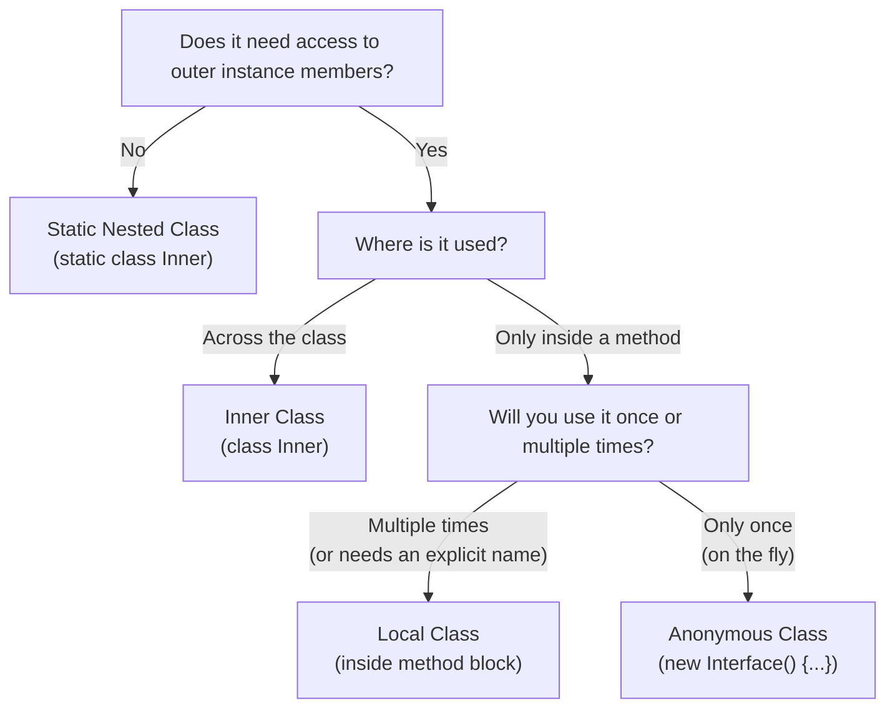
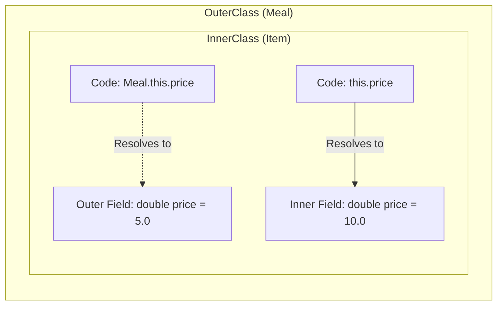
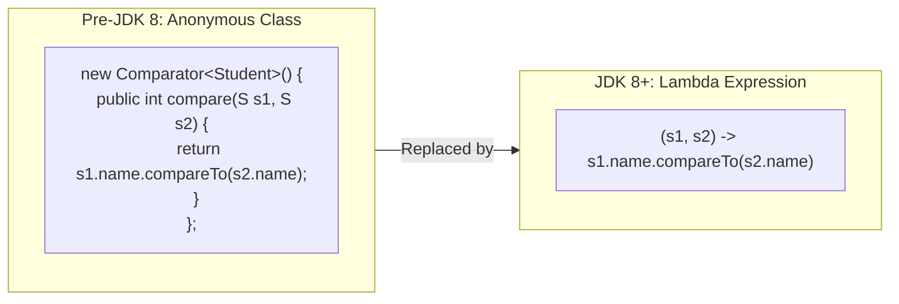

# :material-pencil: Topic Note: Nested Classes, Local Types & Anonymous Classes (Part 5 — Section 13)

> **Course:** Java Programming Masterclass — Tim Buchalka (Udemy)  
> **Section:** 13 — Exploring Nested Classes, Local Types & Anonymous Classes  
> **Status:** :material-check-circle: Complete

---

## :material-target: Learning Objectives

By the end of this part, you should be able to:

- [x] Identify the four types of nested classes: **Static Nested, Inner, Local, and Anonymous**.
- [x] Understand when and how to implement a **Static Nested Class** and access it via `Outer.Nested()`.
- [x] Understand the tricky instantiation syntax for **Inner Classes** (`outerInstance.new Inner()`).
- [x] Differentiate between `this.variable` and `OuterClass.this.variable` in an inner class.
- [x] Create **Local Classes** inside a method block and understand scoping rules.
- [x] Explain the concept of **"effectively final"** local variables and why local classes require them.
- [x] Declare and instantiate **Anonymous Classes** on the fly, and understand why Lambda expressions are largely replacing them.
- [x] Understand that since JDK 16, **all nested classes** (even non-static ones) can have `static` members.
- [x] See a practical challenge converting Bill's Burgers into highly encapsulated, tightly coupled nested types.

---

## :material-head-cog: 1. Overview of Nested Classes

A nested class is simply a class declared inside the body of another class or interface. It is used when the functionality of two classes is **tightly coupled** (their functionality is interwoven) and there is no reason for the nested class to exist independently of the outer class.

There are four specific types:

| Type | Declaration Type | Characteristics |
|------|-----------------|----------------|
| **Static Nested Class** | `static class Nested` (at class level) | Behaves like a regular top-level class. Does not need an instance of the outer class to be created. |
| **Inner Class** | `class Inner` (at class level) | Requires an instance of the outer class to instantiate. Can directly access the outer instance's fields (even private). |
| **Local Class** | `class Local` (inside a method) | Block scope. Can access outer fields AND local method variables (if they are final/effectively final). |
| **Anonymous Class** | `new SuperType() { ... }` | Has no name. Declared and instantiated on the fly in a single expression. Heavily used before lambdas. |

!!! info "JDK 16 Update: Static Members Everywhere"
    Before JDK 16, only *Static Nested* classes could contain static members. 
    **As of JDK 16**, all four types of nested classes can now have static fields, methods, interfaces, enums, and records.

### Decision Flowchart: Which Nested Class?



---

## :material-head-cog: 2. Static Nested Classes

A **static nested class** is enclosed in another class and declared with the `static` keyword. Because it's static, it does **not** rely on an instance of the enclosing outer class. 

### Key Characteristics:
1. Cannot access instance members of the outer class directly (only static members).
2. The outer class **can** access private instance members of the static nested class (if instantiated).
3. Provides excellent encapsulation (e.g., hiding a custom `Comparator` inside a specific domain class).

### Example: A Static Employee Comparator

```java
public class Employee {

    private final int employeeId;
    private final String name;
    private final int yearStarted;

    // ... Constructor, Getters, toString() omitted for brevity
    
    // THE STATIC NESTED CLASS
    public static class EmployeeComparator<T extends Employee> implements Comparator<Employee> {
        private final String sortType;

        public EmployeeComparator(String sortType) {
            this.sortType = sortType;
        }

        @Override
        public int compare(Employee o1, Employee o2) {
            if (sortType.equalsIgnoreCase("yearStarted")) {
                // Accessing PRIVATE FIELD 'yearStarted' directly!
                return o1.yearStarted - o2.yearStarted; 
            }
            return o1.name.compareTo(o2.name);
        }
    }
}
```

**Notice a crucial rule:** Even though `EmployeeComparator` is a separate class, because it is nested, it has **direct access to `Employee`'s private fields** like `o1.yearStarted`. 

### Instantiating a Static Nested Class

You qualify the nested class by preceding it with the outer class name:
```java
// Notice no instance of Employee is required to create the Comparator:
var comparator = new Employee.EmployeeComparator<>("yearStarted");

List<Employee> list = new ArrayList<>();
list.sort(comparator);
```

---

## :material-head-cog: 3. Inner Classes (Non-Static Nesting)

An **inner class** is a nested class declared *without* the `static` modifier. 

### Key Characteristics:
1. **Requires an instance** of the enclosing class to exist before you can create an instance of the inner class.
2. Has direct access to both static AND instance properties of the enclosing class.
3. Useful when the nested entity inherently belongs to one specific instance of the outer class.

### Example: A Store-Specific Comparator

```java
public class StoreEmployee extends Employee {
    private String store;
    // ... Constructors
    
    // THE INNER CLASS (No static keyword)
    public class StoreComparator<T extends StoreEmployee> implements Comparator<StoreEmployee> {
        @Override
        public int compare(StoreEmployee o1, StoreEmployee o2) {
            int result = o1.store.compareTo(o2.store);
            if (result == 0) {
                // Delegating to Employee's static nested comparator
                return new Employee.EmployeeComparator<>("yearStarted").compare(o1, o2);
            }
            return result;
        }
    }
}
```

### The Tricky Instantiation Syntax: `.new`

If you try to instantiate an Inner class from the outside like a static nested class, it will fail:

```java
// ❌ ERROR: "StoreEmployee is not an enclosing class"
var comp = new StoreEmployee.StoreComparator<>(); 
```

**Correct Syntax:** You must call `.new` on an **instance** of the outer class.
```java
StoreEmployee genericEmployee = new StoreEmployee();

// Using the instance to call .new
var comparator1 = genericEmployee.new StoreComparator<>();

// Or chaining instantiations directly:
var comparator2 = new StoreEmployee().new StoreComparator<>();
```

### Navigating Scope Shadows: `Outer.this`

If an inner class defines a field with the exact same name as an outer class field, the inner scope **shadows** the outer scope.



```java
public class Meal {
    private double price = 5.0; // Outer field

    private class Item {
        private double price; // Inner field shadows outer field

        public Item() {
            // Need the outer 'price'? Use OuterClass.this.field
            this.price = Meal.this.price; 
        }
    }
}
```
`Meal.this.price` tells the compiler specifically "Give me the `price` field belonging to the surrounding `Meal` instance."

---

## :material-star: 4. Inner Class Practical Application: Bill's Burgers
A fantastic real-world use of inner classes is taking a top-level hierarchy and encapsulating its complexity entirely inside a parent class. 

In the Bill's Burgers challenge, a `Meal` contains a Burger, Drink, and Side. Instead of forcing top-level `Burger` and `Drink` classes across the package, we encapsulate them as **private inner classes** of `Meal`.

```java
public class Meal {
    private final double base = 5.0;
    private final Burger burger;
    private final Item drink;
    private final Item side;

    public Meal() {
        burger = new Burger("regular");
        drink = new Item("coke", "drink", 1.5);
        side = new Item("fries", "side", 2.0);
    }
    
    // INNER CLASS: Item
    private class Item {
        private final String name;
        private final String type;
        private final double price;

        public Item(String name, String type, double price) {
            this.name = name;
            this.type = type;
            this.price = price;
        }
    }
    
    // INNER CLASS: Burger (inherits from Item!)
    private class Burger extends Item {
        private final List<Item> toppings = new ArrayList<>();
        
        // Inner classes can have Enums natively implicitly static
        private enum Extra { 
            AVOCADO, BACON, CHEESE; 
            public double getPrice() {
                return switch(this) { 
                    case BACON -> 1.50; 
                    case CHEESE -> 1.00; 
                    default -> 0.50; 
                };
            }
        }
        
        Burger(String name) {
            super(name, "burger", base); // Accessing outer class 'base' field directly!
        }
    }
}
```
**Benefits:**
- **Strict Encapsulation:** Only `Meal` knows how `Item` and `Burger` work. The client only interacts with `Meal`.
- **Easy state access:** The inner `Burger` constructor effortlessly accesses the private `base` attribute on `Meal`.

---

## :material-head-cog: 5. Local Classes

A **Local Class** is defined *inside a method body* (or an initialization block). It operates within the scope of that block.

### Key Characteristics:
1. Cannot have access modifiers (`public`, `private`, etc.).
2. Can extend classes and implement interfaces.
3. Has access to enclosing method's **local variables and parameters**, BUT ONLY IF they are `final` or **"effectively final"**.

### What is "Effectively Final"?
When a local class uses a method variable, Java actually captures (copies) the variable. To prevent inconsistencies where the method changes the variable but the hidden class copy does not, Java enforces that the variable never changes. 

- **Explicit Final:** `final String lastName = "Smith";`
- **Effectively Final:** `String lastName = "Smith";` (as long as it is NEVER modified later in the method). 
- If you change the variable later (`lastName = "Jones";`), the compiler throws an error: `"Variable used in lambda expression or inner class should be final or effectively final"`

### Example: Sorting with a Local Class
Suppose we want to add Pig Latin names to our `StoreEmployee` instances purely for sorting purposes, and we throw away the logic afterward.

```java
public static void addPigLatinName(List<? extends StoreEmployee> list) {

    String lastName = "Piggy"; // Effectively final local variable
    
    // LOCAL CLASS declaration (inside a method block!)
    class DecoratedEmployee extends StoreEmployee implements Comparable<DecoratedEmployee> {
        private final String pigLatinName;
        private final Employee originalInstance;

        public DecoratedEmployee(String pigLatinName, Employee originalInstance) {
            // Uses local variable from method scope!
            this.pigLatinName = pigLatinName + " " + lastName; 
            this.originalInstance = originalInstance;
        }

        @Override
        public int compareTo(DecoratedEmployee o) {
            return pigLatinName.compareTo(o.pigLatinName);
        }
    }

    List<DecoratedEmployee> newList = new ArrayList<>();
    for (var employee : list) {
         String name = employee.getName();
         String pigLatin = name.substring(1) + name.charAt(0) + "ay";
         newList.add(new DecoratedEmployee(pigLatin, employee)); // Instantiating local class
    }
    
    newList.sort(null); // Sorts by Pig Latin name via Comparable
}
```

!!! note "Local Records and Enums"
    In JDK 16, Java permitted local `record`, `enum`, and `interface` declarations inside methods. These are **implicitly static**, meaning they act like standard statically typed classes, not full local inner classes that retain state belonging to an outer element.

---

## :material-head-cog: 6. Anonymous Classes

An **Anonymous Class** is literally an inner or local class that has no name. It is declared and instantiated all in one single expression using the `new` keyword, followed by the interface to implement or class to extend.

### Key Characteristics:
1. **One-off usage:** Extremely common for listeners in UI frameworks (prior to Lambdas).
2. It's an expression. It requires a trailing semicolon: `new Class() { ... };`
3. Allows you to define very precise, customized logic immediately where you are passing a method argument. 

### Example: Anonymous Comparator

```java
public class RunMethod {
    public static void main(String[] args) {
        // ... (assumed list setup) ...
        
        // ANONYMOUS CLASS: implements Comparator
        var c4 = new Comparator<StoreEmployee>() {
            @Override
            public int compare(StoreEmployee o1, StoreEmployee o2) {
                return o1.getName().compareTo(o2.getName());
            }
        }; // Semicolon required! 
        
        // Or inline:
        list.sort(new Comparator<StoreEmployee>() {
             public int compare(StoreEmployee o, StoreEmployee o2) {
                 return o.getName().compareTo(o2.getName());
             }
        });
    }
}
```

### The Transition to Lambdas



Anonymous classes are incredibly verbose for simple operations. Because `Comparator` is an interface with only one abstract method (`compare`), modern Java can instantly map a Lambda expression to it:

```java
// What required an anonymous class...
list.sort(new Comparator<StoreEmployee>() {
    @Override
    public int compare(StoreEmployee o1, StoreEmployee o2) {
        return o1.getName().compareTo(o2.getName());
    }
});

// ... is replaced identically by a Lambda (JDK 8+):
list.sort((o1, o2) -> o1.getName().compareTo(o2.getName()));
```
While Lambdas replaced the need for anonymous classes in functional interfaces, Anonymous classes are still strictly required if building out an interface with *multiple* unimplemented methods, or if extending an abstract class on the fly.

---

## :material-alert: Common Pitfalls

### 1. Forgetting the weird initialization syntax for Inner Classes
```java
// Assuming StoreComparator is NON-static inside StoreEmployee
StoreEmployee.StoreComparator comp = new StoreEmployee.StoreComparator(); // ❌ Fails
var comp = new StoreEmployee().new StoreComparator(); // ✅ Requires outer instance logic
```

### 2. Assuming nested classes can't be static
```java
class Outer {
    static class StaticNested {} // ✅ Perfectly legal
    class Inner {
        static int val = 5; // ❌ Pre-JDK 16 Error, ✅ JDK 16+ completely valid
    }
}
```

### 3. Not understanding "Effectively Final"
```java
String criteria = "name";
class LocalCmp implements Comparator<Employee> {
    public int compare(Employee a, Employee b) {
        if(criteria.equals("name")) return a.name.compareTo(b.name); // Using local variable criteria
    }
}
criteria = "year"; // ❌ BREAKS LocalCmp immediately! 
// "Variable used in inner class should be final or effectively final."
```

### 4. Shadowing fields and incorrectly writing `this`
When an inner class field shadows an outer class field:
```java
class Outer {
    int id = 5;
    class Inner {
        int id = 10;
        public void print() {
            System.out.println(this.id);       // Prints 10 (Inner)
            System.out.println(Outer.this.id); // Prints 5 (Outer)
        }
    }
}
```

---

## :material-card-bulleted: Quick Summary Checklist

| Context | Keyword | Name | Characteristics |
|---------|----------|----------|-----------------|
| In class | `static` | Static Nested | Operates like a top-level outer class. Hides logic. |
| In class | None | Inner Class | Must be instantiated from an Outer instance (`.new`). |
| In method | None | Local Class | Highly temporary. Can read enclosing method's final variables. |
| In expression| `new` | Anonymous | Has an `{}` block upon creation. Creates on-the-fly functionality. |

---

## :material-navigation: Related Notes

| Part | Topic | Link |
|:----:|-------|------|
| 1 | Abstract Classes (Section 11, Lectures 1–7) | [Part 1 — Abstract Classes](topic-note.md) |
| 2 | Interfaces & Challenge (Section 11, Lectures 8–16) | [Part 2 — Interfaces](topic-note-part2.md) |
| 3 | Generics: Classes, Bounds & Layer Challenge (Section 12, Lectures 1–6) | [Part 3 — Generics Basics](topic-note-part3.md) |
| 4 | Comparable, Comparator, Wildcards, Type Erasure (Section 12, Lectures 7–12) | [Part 4 — Advanced Generics](topic-note-part4.md) |
| 5 | Nested Classes, Local Types & Anonymous Classes (Section 13) | **You are here** |

---

## :material-bookshelf: References

- **Course:** Tim Buchalka — Java Programming Masterclass (Section 13, Lectures 1–9)
- **API:** [Oracle Java Tutorials — Nested Classes](https://docs.oracle.com/javase/tutorial/java/javaOO/nested.html)
- **Book:** Effective Java — Item 24: Favor static member classes over nonstatic

---

*Last Updated: 2026-02-24 | Confidence: 9/10*
