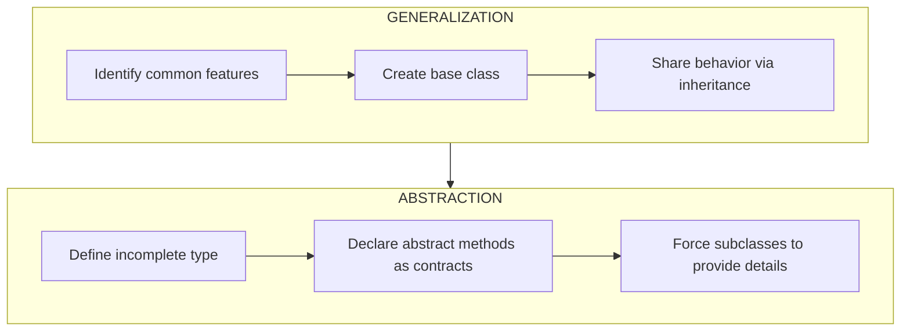
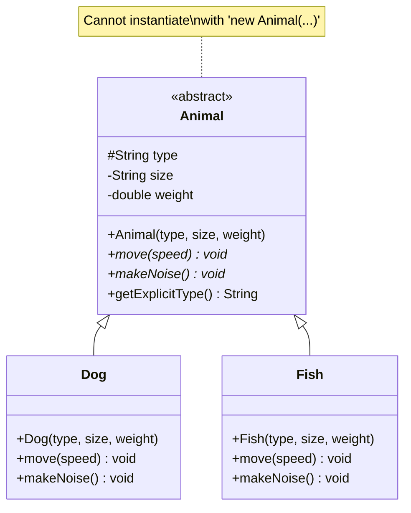
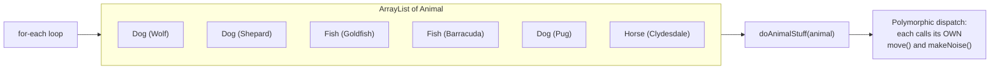
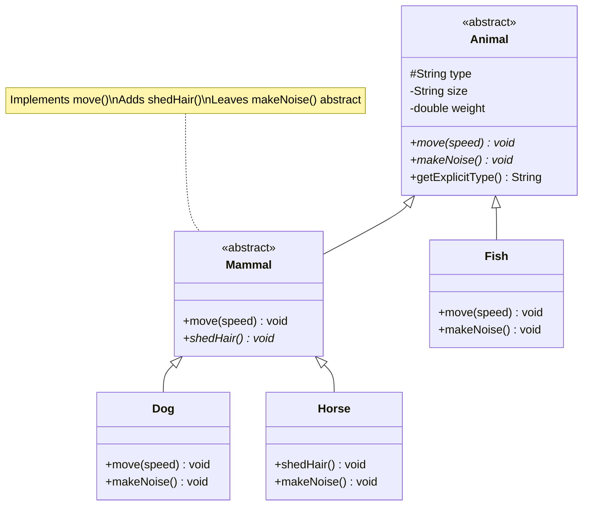
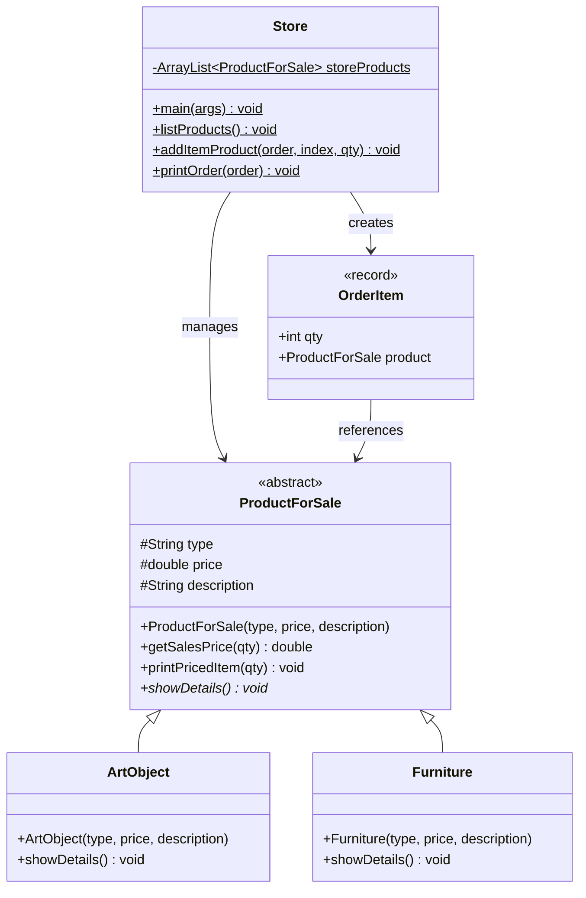
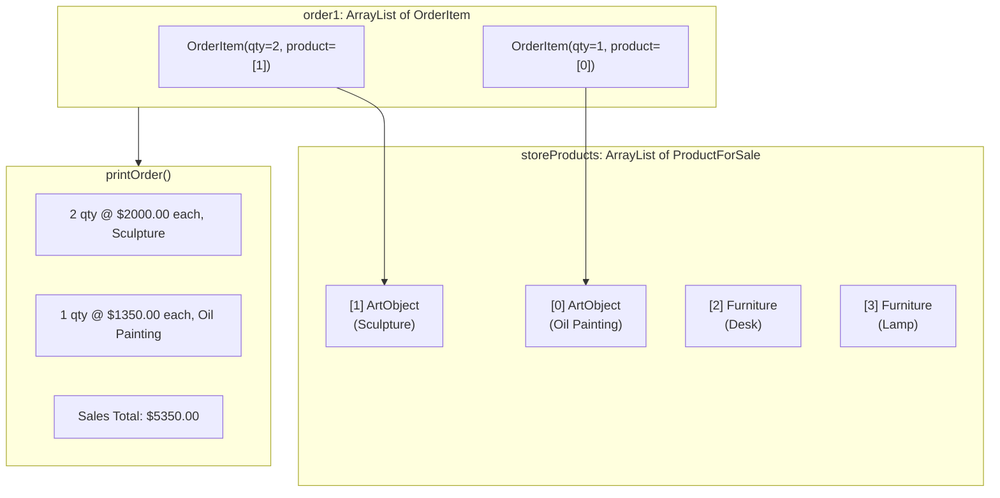
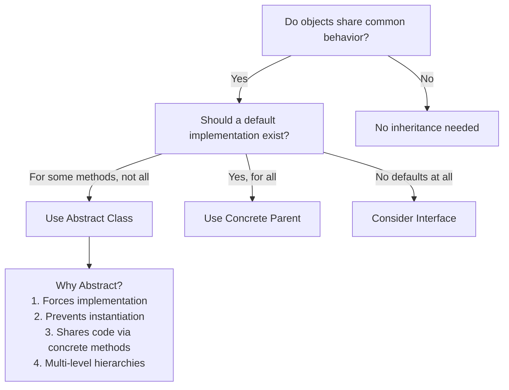

# :material-pencil: Topic Note: Abstract Classes (Part 1 of Section 11)

> **Course:** Java Programming Masterclass - Tim Buchalka (Udemy)  
> **Section:** 11 — Mastering Abstraction & Interfaces (Lectures 1–7)  
> **Status:** :material-check-circle: Complete

---

## :material-target: Learning Objectives

By the end of this part, you should be able to:

- [x] Explain the difference between **abstraction** and **generalization** in OOP
- [x] Distinguish between **abstract** and **concrete** methods and classes
- [x] Know all the **method modifiers** and what each one controls
- [x] Design class hierarchies using **abstract classes** as strict base types
- [x] Use the `abstract`, `final`, and `protected` modifiers effectively
- [x] Build multi-level abstract hierarchies (abstract extending abstract)
- [x] Leverage polymorphism with abstract types in collections and parameters
- [x] Solve the **Store & Order System** challenge using abstract classes

---

## :material-head-cog: 1. Abstraction & Generalization

### What Do These Terms Mean?

**Generalization** is the process of identifying common features and behaviors across a set of objects, and placing them in a shared base class. A base class is the most general class — it represents the common building block.

**Abstraction** takes generalization further — you simplify a set of characteristics and behaviors into an abstract type that **cannot exist on its own**. It only exists to describe a group of more specific things.



> **The "Can You Draw It?" Test:** If you can't draw something on paper without more information, it's probably abstract. You can draw a _Dog_ or a _Goldfish_, but how would you draw just an "Animal"?

### Why It Matters

These concepts reduce code and encourage **extensible, flexible** applications:

- **Extensible** — supports future enhancements with little or no effort
- **Flexible** — designed with change in mind
- **Less code** — common behavior lives once in the base, not duplicated in every subclass

---

## :material-head-cog: 2. Method Modifiers in Java

Before diving into abstract classes, it's important to understand the full set of method modifiers Java provides. Besides **access modifiers** (`public`, `protected`, package-private, `private`), methods have additional modifiers:

| Modifier | What It Does | Can Combine With |
|----------|-------------|-----------------|
| `abstract` | No method body; subclass **must** implement it | Abstract class or interface only |
| `static` | Called on the class itself, not an instance | Any class |
| `final` | **Cannot be overridden** by subclasses | Any class (not abstract methods) |
| `default` | Only on interfaces — provides a body | Interfaces only (JDK 8+) |
| `native` | Body implemented in platform-dependent code (C/C++) | Advanced, rarely used |
| `synchronized` | Controls multi-threaded access | Concurrency topic |

### Abstract vs Concrete Methods

| Aspect | Abstract Method | Concrete Method |
|--------|----------------|-----------------|
| Has a body? | ❌ No — ends with `;` | ✅ Yes — has `{ }` block |
| Where declared? | Abstract class or interface | Any class or interface |
| Subclass must implement? | ✅ Yes (if subclass is concrete) | ❌ No — can inherit as-is |
| Purpose | **Contract** — defines what must exist | **Implementation** — defines what happens |

```java
// Abstract method — a contract promising behavior
public abstract void move(String speed);  // ← No body, ends with ;

// Concrete method — an actual implementation
public void move(String speed) {          // ← Has a body with { }
    System.out.println("Moving " + speed);
}
```

---

## :material-head-cog: 3. Abstract Classes — The Foundation

### Declaration and Rules

An **abstract class** is declared with the `abstract` modifier. It is an _incomplete_ class — you **cannot** create an instance of it with `new`.

```java
public abstract class Animal {
    protected String type;
    private String size;
    private double weight;

    public Animal(String type, String size, double weight) {
        this.type = type;
        this.size = size;
        this.weight = weight;
    }

    public abstract void move(String speed);  // Abstract — no body
    public abstract void makeNoise();         // Abstract — no body

    public final String getExplicitType() {   // Concrete + final
        return getClass().getSimpleName() + " (" + type + ")";
    }
}
```



### Key Rules of Abstract Classes

| Rule | Description |
|------|-------------|
| **Cannot instantiate** | `new Animal(...)` → compile error |
| **Can have constructors** | Subclass constructors MUST call `super(...)` |
| **Can have concrete methods** | `getExplicitType()` has a body — inherited by subclasses |
| **Can have fields** | Both `private` and `protected` fields are allowed |
| **Abstract methods have no body** | Not even empty curly braces `{}` — that's still a body! |
| **Abstract + private is illegal** | If private, subclass can't see it; if abstract, subclass must implement it — contradiction |
| **Subclass must implement OR be abstract** | Concrete subclass must implement ALL abstract methods |

### What Happens Without Abstract

With a **concrete parent**, subclasses have three choices for inherited methods:

1. **Inherit as-is** — don't declare the method at all
2. **Override completely** — provide new code, ignore parent's version
3. **Override + call super** — extend parent's behavior

With an **abstract parent**, there's only one choice:

> **The subclass MUST provide an implementation.** No default to inherit, no option to skip it. The compiler forces this.

!!! tip "The Strict Parent"
    Think of an abstract class as a **much stricter parent**. It never gets instantiated itself, so you have more freedom in building rules that well-behaved subclasses must follow.

---

## :material-head-cog: 4. Concrete Subclasses

### Dog — Implementing Abstract Methods

When `Dog extends Animal`, the compiler **forces** Dog to implement `move()` and `makeNoise()`:

```java
public class Dog extends Animal {

    public Dog(String type, String size, double weight) {
        super(type, size, weight);  // Must call Animal's constructor
    }

    @Override
    public void move(String speed) {
        if (speed.equals("slow")) {
            System.out.println(getExplicitType() + " Walking");
        } else {
            System.out.println(getExplicitType() + " Running");
        }
    }

    @Override
    public void makeNoise() {
        if (Objects.equals(type, "Wolf")) {
            System.out.println("Howling!");
        } else {
            System.out.println("Woof!");
        }
    }
}
```

**Key observations:**

- `super(type, size, weight)` — Even though `Animal` is abstract and can never be instantiated, its constructor **must** be called by every subclass
- `type` is accessible directly — because it's declared `protected` in `Animal`
- `getExplicitType()` is called — a concrete method inherited from `Animal`
- Empty method bodies are technically valid — the abstract contract only requires the _signature_, not meaningful code (though not recommended in real apps)

### Fish — A Different Implementation

```java
public class Fish extends Animal {

    public Fish(String type, String size, double weight) {
        super(type, size, weight);
    }

    @Override
    public void move(String speed) {
        if (speed.equals("slow")) {
            System.out.println(getExplicitType() + " lazily swimming");
        } else {
            System.out.println(getExplicitType() + " darting");
        }
    }

    @Override
    public void makeNoise() {
        if (Objects.equals(type, "Goldfish")) {
            System.out.println("swish");
        } else {
            System.out.println("splash");
        }
    }
}
```

Same abstract contract, completely different behavior. This is the **power of abstraction** — both `Dog` and `Fish` ARE `Animal`s, both have `move()` and `makeNoise()`, but each implements them uniquely.

---

## :material-head-cog: 5. Polymorphism with Abstract Types

### The Real Power: Using the Abstract Type

You can't instantiate `Animal` with `new`, but you **can** use `Animal` as a:

- Variable type

- Method parameter type

- Collection type parameter

This is what makes abstract classes so powerful for extensible design.

```java
// ❌ Cannot create an instance of Animal
Animal animal = new Animal("Animal", "big", 100); // COMPILE ERROR!

// ✅ Can use Animal as the declared type
Animal dog = new Dog("Wolf", "big", 100);
dog.makeNoise();  // Calls Dog's makeNoise() at runtime
```

### Method Parameter Polymorphism

```java
private static void doAnimalStuff(Animal animal) {
    animal.makeNoise();   // Calls the actual subclass's method
    animal.move("slow");  // Calls the actual subclass's method
}

// Works with ANY Animal subclass!
doAnimalStuff(new Dog("Pug", "small", 20));     // Dog behavior
doAnimalStuff(new Fish("Goldfish", "small", 1)); // Fish behavior
```

### Collection Polymorphism

```java
ArrayList<Animal> animals = new ArrayList<>();  // Typed as Animal

animals.add(new Dog("Wolf", "big", 100));
animals.add(new Dog("German Shepard", "big", 150));
animals.add(new Fish("Goldfish", "small", 1));
animals.add(new Fish("Barracuda", "big", 75));
animals.add(new Dog("Pug", "small", 20));
animals.add(new Horse("Clydesdale", "large", 1000));

// One loop handles ALL animal types:
for (Animal animal : animals) {
    doAnimalStuff(animal);  // Each animal behaves according to its own type
}
```

> **If you used `Dog` or `Fish` as the type parameter, you'd need two separate lists.** By using the abstract `Animal` type, one list holds everything — and future animal types automatically work without changing this code.



---

## :material-head-cog: 6. Abstract Class Extending Abstract Class

### Multi-Level Abstract Hierarchies

An abstract class can extend another abstract class. This creates a **tiered hierarchy** of increasingly specific contracts.

```java
abstract class Mammal extends Animal {

    public Mammal(String type, String size, double weight) {
        super(type, size, weight);
    }

    @Override
    public void move(String speed) {
        System.out.print(getExplicitType() + " ");
        System.out.println(speed.equals("slow") ? "walks" : "runs");
    }

    public abstract void shedHair();  // New abstract method for mammals only
}
```

### What Mammal Does and Doesn't Do

`Mammal extends Animal` has special flexibility as an abstract class:

| Choice | Description |
|--------|-------------|
| Implement **ALL** parent's abstract methods | Provide body for both `move()` and `makeNoise()` |
| Implement **SOME** | Provide body for `move()` only (leave `makeNoise()` abstract) |
| Implement **NONE** | Leave both abstract — pass responsibility to concrete subclasses |
| Add **NEW** abstract methods | `shedHair()` — now concrete subclasses must implement this too |

In our code, `Mammal`:

- ✅ Implements `move()` — provides a common walking/running behavior for all mammals

- ❌ Does NOT implement `makeNoise()` — each mammal makes different sounds

- ✅ Adds `shedHair()` — a new behavior specific to mammals

### Horse — Extending a Mid-Level Abstract

```java
public class Horse extends Mammal {

    public Horse(String type, String size, double weight) {
        super(type, size, weight);
    }

    @Override
    public void shedHair() {
        System.out.println(getExplicitType() + " sheds in the spring");
    }

    @Override
    public void makeNoise() {
        // Empty — horses in this example are quiet
    }
}
```

`Horse` must implement:
- `shedHair()` → from `Mammal` (new abstract method)
- `makeNoise()` → from `Animal` (not implemented by `Mammal`)
- `move()` → already implemented by `Mammal` (inherited, no override needed)



### Using instanceof with Abstract Hierarchies

When iterating over `Animal` objects, not all animals are mammals. Use pattern matching `instanceof` to safely access mammal-specific methods:

```java
for (Animal animal : animals) {
    doAnimalStuff(animal);
    
    // Check if this animal is also a Mammal
    if (animal instanceof Mammal currentMammal) {
        currentMammal.shedHair();  // Only called for Dog and Horse
    }
}
```

> You CANNOT call `animal.shedHair()` directly — the compiler only knows about `Animal`'s methods. You must cast or use pattern matching to access `Mammal`-specific behavior.

---

## :material-head-cog: 7. The `final` Modifier on Methods

Abstract classes can also have **final concrete methods** — methods that subclasses **cannot** override.

```java
// In Animal class:
public final String getExplicitType() {
    return getClass().getSimpleName() + " (" + type + ")";
}
```

```java
// In Dog class — trying to override:
@Override
public String getExplicitType() {  // ❌ COMPILE ERROR!
    return "Custom type";           // "Cannot override final method"
}
```

| Modifier | Effect on Method |
|----------|-----------------|
| `abstract` | Must be overridden by concrete subclasses |
| `final` | **Cannot** be overridden by any subclass |
| Neither | Can optionally be overridden |

!!! note "abstract + final is illegal"
    A method can't be both `abstract` (must override) and `final` (can't override). These are contradictory modifiers.

---

## :material-star: 8. Abstract Class Challenge: Store & Order System

### Problem Statement

Build a storefront application that:
- Manages a list of products using an **abstract** `ProductForSale` class
- Supports different product types (Art, Furniture) via concrete subclasses
- Creates orders with line items using an `OrderItem` record
- Prints product listings and formatted order receipts

### Class Diagram



### The Abstract Base: ProductForSale

```java
public abstract class ProductForSale {
    protected String type;
    protected double price;
    protected String description;

    public ProductForSale(String type, double price, String description) {
        this.type = type;
        this.price = price;
        this.description = description;
    }

    // Concrete — same calculation for ALL products
    public double getSalesPrice(int qty) {
        return qty * price;
    }

    // Concrete — same formatted output for ALL products
    public void printPricedItem(int qty) {
        System.out.printf("%2d qty at $%8.2f each, %-15s %-35s %n",
                qty, price, type, "");
    }

    // Abstract — each product decides how to display itself
    public abstract void showDetails();
}
```

**Design insight:** `getSalesPrice()` and `printPricedItem()` are concrete because the calculation and format are the same for every product. But `showDetails()` is abstract because an art piece and a desk would be described completely differently.

### Concrete Products

```java
public class ArtObject extends ProductForSale {
    public ArtObject(String type, double price, String description) {
        super(type, price, description);
    }

    @Override
    public void showDetails() {
        System.out.println("This " + type + " is a beautiful piece of art");
        System.out.printf("The Price of the piece is $%6.2f %n", price);
        System.out.println("Description: " + description);
    }
}
```

```java
public class Furniture extends ProductForSale {
    public Furniture(String type, double price, String description) {
        super(type, price, description);
    }

    @Override
    public void showDetails() {
        System.out.println("This " + type + " was manufactured in the 19th century");
        System.out.printf("The Price of the piece is $%6.2f %n", price);
        System.out.println("Description: " + description);
    }
}
```

Both subclasses:
- Call `super(...)` to initialize the protected fields from `ProductForSale`
- Provide their own unique implementation of `showDetails()`
- Inherit `getSalesPrice()` and `printPricedItem()` as-is

### The OrderItem Record

```java
record OrderItem(int qty, ProductForSale product) { }
```

Simple, elegant. A record captures the quantity and what product was ordered. Notice `ProductForSale` is the type — meaning any subclass (ArtObject, Furniture, or future products) can be part of an order.

### The Store Class

```java
public class Store {

    private static ArrayList<ProductForSale> storeProducts = new ArrayList<>();

    public static void main(String[] args) {
        // Inventory — mix of ArtObjects and Furniture in one list
        storeProducts.add(new ArtObject("Oil Painting", 1350,
                "Impressionistic work by ABF painted in 2010"));
        storeProducts.add(new ArtObject("Sculpture", 2000,
                "Bronze work by JKF, produced in 1950"));
        storeProducts.add(new Furniture("Desk", 500, "Mahogany Desk"));
        storeProducts.add(new Furniture("Lamp", 200,
                "Tiffany Lamp with Hummingbirds"));

        listProducts();

        // Order 1: 2 Sculptures + 1 Oil Painting = $5,350
        System.out.println("\nOrder 1");
        var order1 = new ArrayList<OrderItem>();
        addItemProduct(order1, 1, 2);  // 2x Sculpture @ $2,000
        addItemProduct(order1, 0, 1);  // 1x Oil Painting @ $1,350
        printOrder(order1);

        // Order 2: 5 Lamps + 1 Painting + 1 Desk = $2,850
        System.out.println("\nOrder 2");
        var order2 = new ArrayList<OrderItem>();
        addItemProduct(order2, 3, 5);  // 5x Lamp @ $200
        addItemProduct(order2, 0, 1);  // 1x Oil Painting @ $1,350
        addItemProduct(order2, 2, 1);  // 1x Desk @ $500
        printOrder(order2);
    }

    public static void listProducts() {
        for (var item : storeProducts) {
            System.out.println("-".repeat(30));
            item.showDetails();   // Polymorphic! ArtObject or Furniture
        }
    }

    public static void addItemProduct(ArrayList<OrderItem> order,
                                       int orderIndex, int qty) {
        order.add(new OrderItem(qty, storeProducts.get(orderIndex)));
    }

    public static void printOrder(ArrayList<OrderItem> order) {
        double salesTotal = 0;
        for (var item : order) {
            item.product().printPricedItem(item.qty());// ← Concrete method
            salesTotal += item.product().getSalesPrice(item.qty()); // ← Concrete
        }
        System.out.printf("Sales Total: $%6.2f %n", salesTotal);
    }
}
```

### How Polymorphism Works in the Store



### Challenge Design Patterns

| Pattern | How It's Used |
|---------|--------------|
| **Abstract base class** | `ProductForSale` defines the common interface and shared behavior |
| **Template method** | `getSalesPrice()` and `printPricedItem()` are templates that work for any product |
| **Polymorphic collections** | `ArrayList<ProductForSale>` holds mixed product types |
| **Record type** | `OrderItem` is a lightweight data carrier (immutable, with auto-generated accessors) |

---

## :material-alert: Common Pitfalls

### 1. Trying to Instantiate an Abstract Class

```java
Animal a = new Animal("Dog", "big", 100);  // ❌ Compile error!
// "Cannot instantiate abstract class Animal"
```

**Fix:** Instantiate a concrete subclass: `Animal a = new Dog("Pug", "small", 20);`

### 2. Empty Curly Braces = A Body

```java
public abstract void move(String speed) {}  // ❌ Compile error!
// "Abstract methods can't have bodies" — even empty {}
```

**Fix:** Use semicolon: `public abstract void move(String speed);`

### 3. Abstract + Private = Illegal

```java
private abstract void move(String speed);   // ❌ Compile error!
// "Illegal combination of modifiers: abstract and private"
```

**Why:** `abstract` says "subclass must implement me." `private` says "subclass can't see me." These contradict each other.

### 4. Forgetting the Constructor Chain

```java
public class Dog extends Animal {
    // ❌ Compile error if you don't provide a constructor
    // that calls super(type, size, weight)
}
```

**Why:** `Animal` has no default constructor. Subclasses MUST call the explicit `super(...)`.

### 5. Calling Subclass-Specific Methods on the Parent Type

```java
Animal animal = new Horse("Mustang", "medium", 500);
animal.shedHair();  // ❌ Compile error!
// "Cannot resolve method 'shedHair' in 'Animal'"
```

**Fix:** Use pattern matching `instanceof` to safely cast:
```java
if (animal instanceof Mammal m) {
    m.shedHair();  // ✅ Now the compiler knows about Mammal's methods
}
```

---

## :material-format-list-checks: Key Takeaways

1. **Abstraction reduces code** — common behavior defined once in the base class, not duplicated
2. **Abstract classes are contracts** — they force subclasses to "think about and implement" specific methods
3. **You can't instantiate abstract classes** — but you CAN use them as types in variables, parameters, and collections
4. **Abstract + concrete = flexible** — abstract classes can mix abstract methods (forced), concrete methods (inherited), and final methods (locked)
5. **Multi-level hierarchies** — `Animal → Mammal → Horse` lets you define contracts at different levels of specificity
6. **`protected` fields** give subclasses direct access — useful for abstract class designs where subclasses need to read parent state
7. **`final` methods on abstract classes** enforce behavior that no subclass can change
8. **Polymorphism is the payoff** — a single `ArrayList<Animal>` or `doAnimalStuff(Animal)` handles all current AND future subtypes

---

## :material-card-bulleted: Quick Reference

### Abstract Class Checklist

```
✅ Can have: constructors, fields, concrete methods, abstract methods, final methods
✅ Can be extended by: concrete classes, other abstract classes
✅ Can extend: any single class (abstract or concrete)
❌ Cannot: be instantiated with 'new'
❌ Cannot: have abstract + private methods
❌ Cannot: have abstract + final methods
```

### When to Use Abstract Classes



---

## :material-navigation: Related Notes

| Part | Topic | Link |
|:----:|-------|------|
| 1 | Abstract Classes (Section 11, Lectures 1–7) | **You are here** |
| 2 | Interfaces & Challenge (Section 11, Lectures 8–16) | [Part 2 — Interfaces & Challenge](topic-note-part2.md) |
| 3 | Generics: Classes, Bounds & Layer Challenge (Section 12, Lectures 1–6) | [Part 3 — Generics](topic-note-part3.md) |
| 4 | Comparable, Comparator, Wildcards, Type Erasure & Final Challenge (Section 12, Lectures 7–12) | [Part 4 — Advanced Generics](topic-note-part4.md) |
| 5 | Nested Classes, Local Types & Anonymous Classes (Section 13) | [Part 5 — Nested Classes](topic-note-part5.md) |

---

## :material-bookshelf: References

- **Course:** Tim Buchalka - Java Programming Masterclass (Section 11, Lectures 1–7)
- **API:** [java.lang.Object (Java 17)](https://docs.oracle.com/en/java/javase/17/docs/api/java.base/java/lang/Object.html)
- **Guide:** [Abstract Methods and Classes (Oracle Tutorial)](https://docs.oracle.com/javase/tutorial/java/IandI/abstract.html)
- **Book:** Effective Java - Item 20: Prefer interfaces to abstract classes

---

*Last Updated: 2026-02-24 | Confidence: 9/10*
