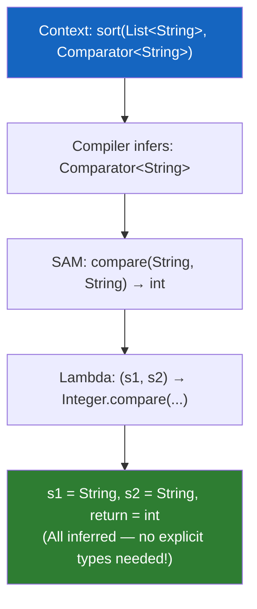
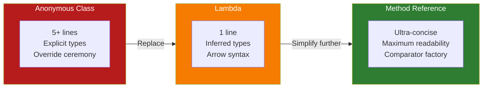
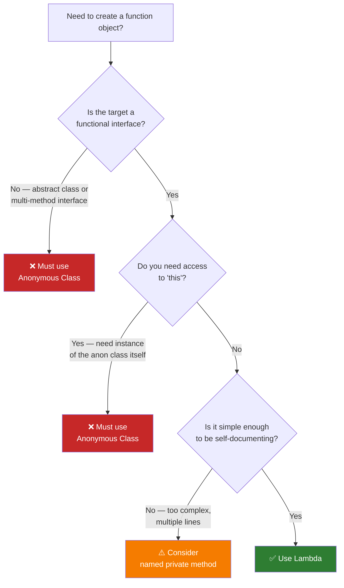
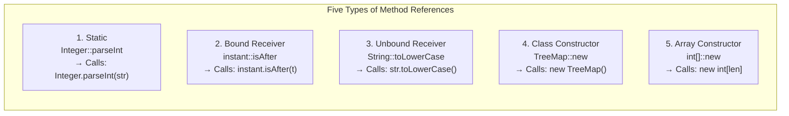
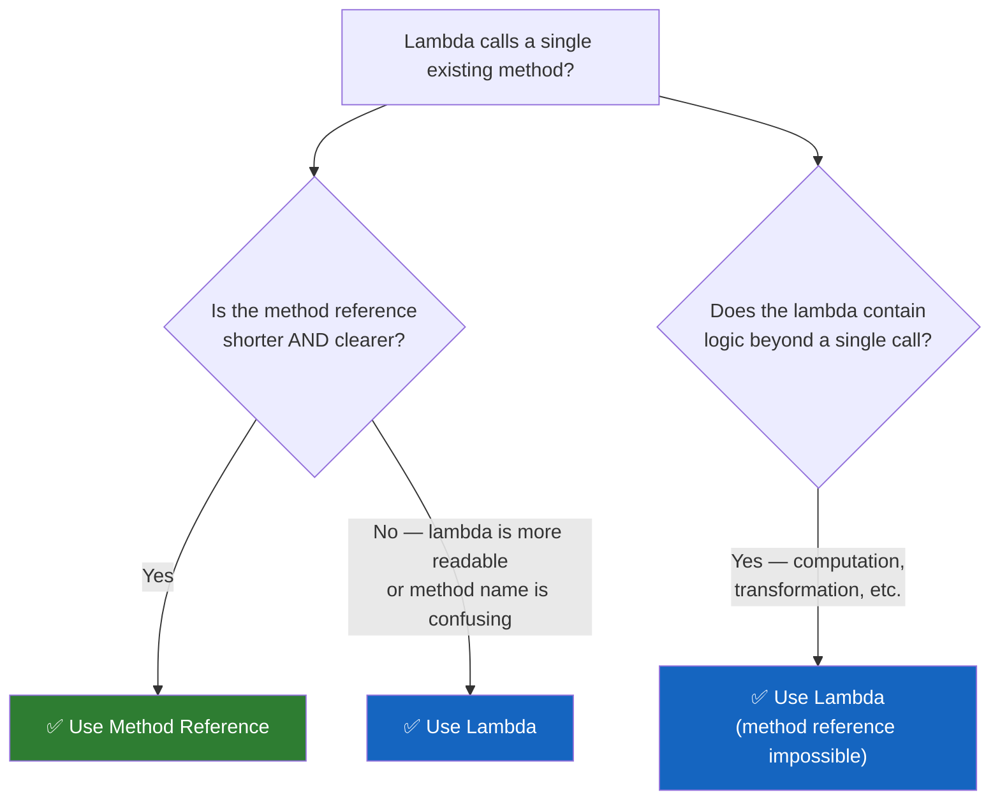
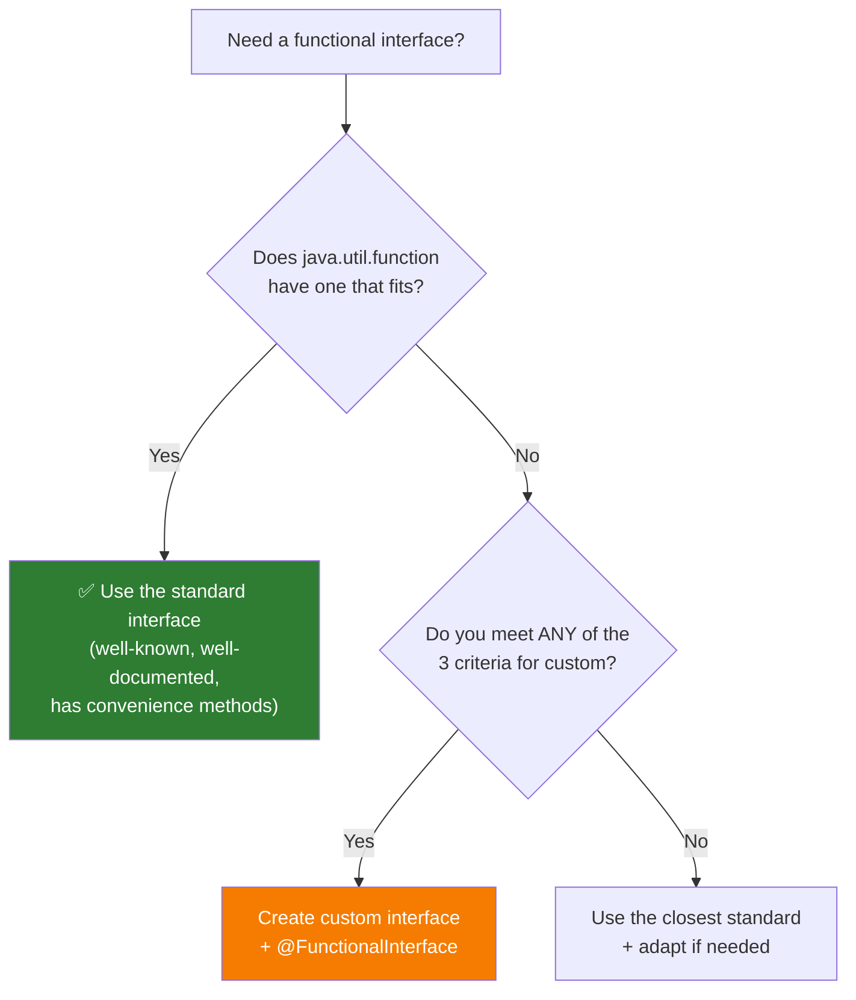
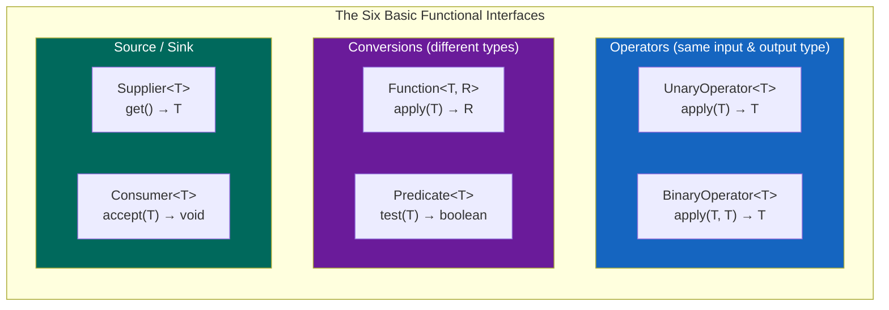
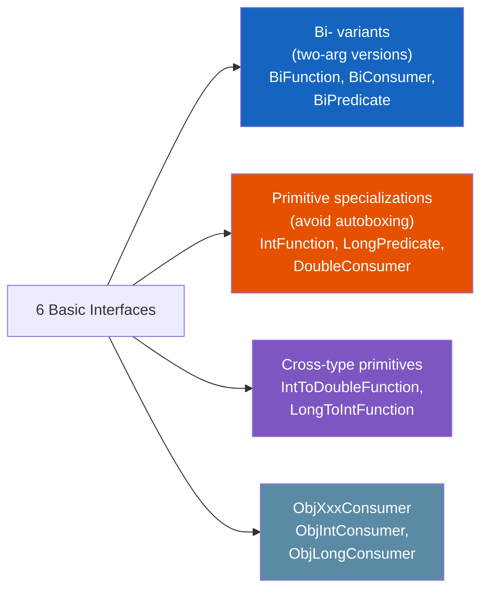
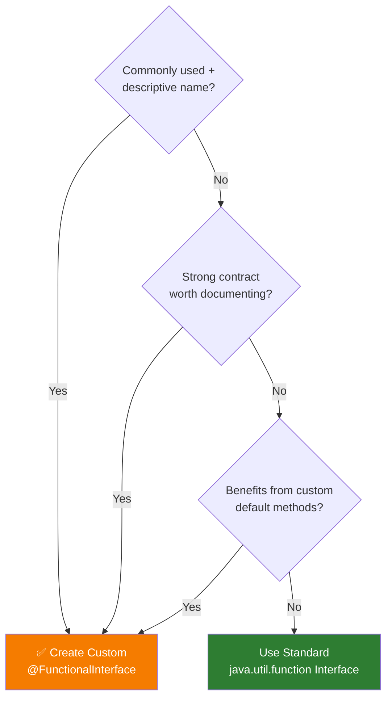
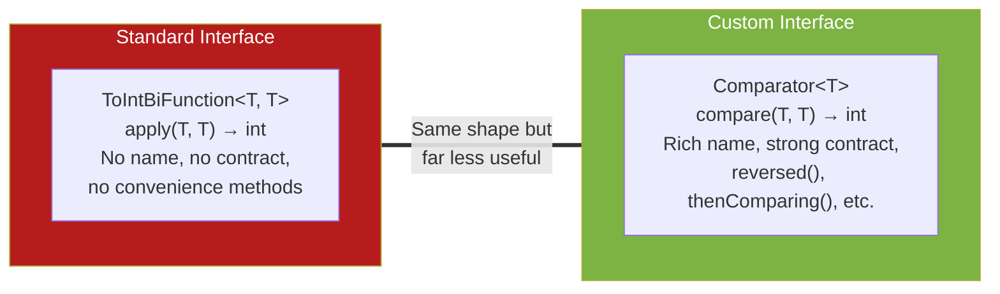

# :material-book-open-page-variant: Book Reading: Lambda Expressions & Functional Programming

> **Book:** Effective Java (3rd Edition) by Joshua Bloch  
> **Relevant Items:** 42–44 (Chapter 7: Lambdas and Streams)  
> **Status:** :material-check-circle: Complete

---

## :material-target: Reading Goals

- [x] Understand exactly when lambdas are superior to anonymous classes — and the three cases where anonymous classes are still required
- [x] Know when method references improve readability and when a lambda is actually cleaner
- [x] Memorize the six standard functional interfaces and know when to create custom ones
- [x] Apply the `@FunctionalInterface` annotation as a design discipline

---

## :material-book-open-variant: Chapter 7: Lambdas and Streams

### Item 42: Prefer Lambdas to Anonymous Classes

#### The Historical Context

Before Java 8, the **anonymous class** was the primary mechanism for creating function objects — small objects embodying a function or action to pass around:

```java
// Pre-Java 8: Anonymous class (verbose!)
Collections.sort(words, new Comparator<String>() {
    public int compare(String s1, String s2) {
        return Integer.compare(s1.length(), s2.length());
    }
});
```

This requires **five lines** just to sort by string length. The ceremony of the anonymous class (declaring the type, the method signature, the override annotation) drowns out the single line of actual logic.

#### The Lambda Revolution

Java 8 formalized the concept: **if an interface has a single abstract method** (a functional interface), then writing an anonymous class for it is unnecessarily verbose:

```java
// Java 8+: Lambda expression (concise!)
Collections.sort(words, (s1, s2) -> Integer.compare(s1.length(), s2.length()));
```

The lambda has no explicit type declaration for its parameters — the compiler **infers** the types from the context (the `Comparator<String>` target type). This is called **target typing**.

#### How Type Inference Works



Bloch's key insight: **type inference relies on generics**. If your code doesn't use generic types properly, the compiler can't infer lambda parameter types, and you're forced to write them out explicitly — losing conciseness.

> _"Omit the types of all lambda parameters unless their presence makes your program clearer."_

#### The Evolution: Anonymous → Lambda → Method Reference

Bloch shows a three-step refinement:

```java
// Step 1: Anonymous class (most verbose)
Collections.sort(words, new Comparator<String>() {
    public int compare(String s1, String s2) {
        return Integer.compare(s1.length(), s2.length());
    }
});

// Step 2: Lambda expression (concise)
Collections.sort(words, (s1, s2) -> Integer.compare(s1.length(), s2.length()));

// Step 3: Method reference + Comparator factory (most concise)
Collections.sort(words, comparingInt(String::length));

// Step 4: Even better — use the List.sort default method!
words.sort(comparingInt(String::length));
```



#### Practical Example: Enum with Behavior

Bloch demonstrates lambdas inside enum constants — a powerful pattern:

```java
// ❌ BAD: Constant-specific class bodies (from Item 34)
public enum Operation {
    PLUS   { public double apply(double x, double y) { return x + y; } },
    MINUS  { public double apply(double x, double y) { return x - y; } },
    TIMES  { public double apply(double x, double y) { return x * y; } },
    DIVIDE { public double apply(double x, double y) { return x / y; } };

    public abstract double apply(double x, double y);
}

// ✅ GOOD: Lambdas stored in enum fields
public enum Operation {
    PLUS  ("+", (x, y) -> x + y),
    MINUS ("-", (x, y) -> x - y),
    TIMES ("*", (x, y) -> x * y),
    DIVIDE("/", (x, y) -> x / y);

    private final String symbol;
    private final DoubleBinaryOperator op;

    Operation(String symbol, DoubleBinaryOperator op) {
        this.symbol = symbol;
        this.op = op;
    }

    public double apply(double x, double y) {
        return op.applyAsDouble(x, y);
    }
}
```

!!! info "Why `DoubleBinaryOperator`?"
    Bloch uses `DoubleBinaryOperator` (a primitive specialization of `BinaryOperator`) to avoid autoboxing overhead. This connects directly to Tim's Section 14 coverage of `BinaryOperator` and the custom `Operation<T>` interface.

#### The Three Cases Where Anonymous Classes Are Still Required

Lambdas cannot replace anonymous classes in every situation:



| Situation | Why Lambda Fails | Use Instead |
|-----------|-----------------|-------------|
| **Abstract class** (not interface) | Lambdas can only target functional interfaces | Anonymous class |
| **Interface with multiple abstract methods** | Lambda maps to exactly one method | Anonymous class |
| **Need `this` reference to the function object** | In a lambda, `this` refers to the **enclosing class**, not the lambda itself | Anonymous class |

#### Lambda Limitations to Remember

1. **Lambdas lack names and documentation** — if a computation isn't self-explanatory, it belongs in a named method
2. **One to three lines is ideal** — more than three lines hurts readability
3. **Lambdas cannot be serialized reliably** — never serialize lambdas (or anonymous classes)
4. **No access to `this`** — `this` inside a lambda refers to the enclosing instance

#### Connection to Course Material

In Part 5 (Section 13), Tim demonstrated replacing anonymous `Comparator` instances with lambdas — and IntelliJ even suggested the replacement automatically. The `EnhancedComparator<T>` example (which extends `Comparator<T>` and adds a `secondLevel` method) is a perfect illustration of **when you can't use a lambda**: the interface has two abstract methods, so it's not a functional interface.

Tim's use of `@FunctionalInterface` on the custom `Operation<T>` interface in Section 14 directly validates Bloch's recommendation.

#### Quotes to Remember

> _"Don't use anonymous classes for function objects unless you have to create instances of types that aren't functional interfaces."_

> _"Lambdas make it practical to use function objects where it would not previously have made sense."_

> _"Omit the types of all lambda parameters unless their presence makes your program clearer."_

---

### Item 43: Prefer Method References to Lambdas

#### The Core Insight

Method references are **even more concise** than lambdas — and in most cases, **more readable**. If a lambda does nothing but call an existing method, a method reference eliminates the boilerplate of declaring the parameter and passing it:

```java
// Lambda — parameter is declared and forwarded
map.merge(key, 1, (count, incr) -> count + incr);

// Method reference — no parameter noise
map.merge(key, 1, Integer::sum);
```

#### The Five Types of Method References

Bloch categorizes method references into five types (expanding on the four Tim covered in Section 14):

| Type | Example | Lambda Equivalent |
|------|---------|-------------------|
| **Static** | `Integer::parseInt` | `str -> Integer.parseInt(str)` |
| **Bound** | `Instant.now()::isAfter` | `t -> Instant.now().isAfter(t)` |
| **Unbound** | `String::toLowerCase` | `str -> str.toLowerCase()` |
| **Class Constructor** | `TreeMap<K,V>::new` | `() -> new TreeMap<K,V>()` |
| **Array Constructor** | `int[]::new` | `len -> new int[len]` |



!!! info "Bounded vs Unbounded — Bloch's Terminology"
    Bloch uses "Bound" and "Unbound" (same terms Tim introduced), and explains the critical distinction:
    
    - **Bound**: the receiving object is specified **in** the method reference (e.g., `System.out::println` — `System.out` is the bound receiver)
    - **Unbound**: the receiving object is the **first parameter** when the function is invoked (e.g., `String::toLowerCase` — the String to lower-case comes from the first argument)

#### The Rule: When Lambda Beats Method Reference

Bloch's decision is nuanced — method references are **usually** more readable, but not always:

```java
// ✅ Method reference is clearer (the common case)
service.execute(GoshThisClassNameIsHumongous::action);

// ❌ Same thing as a lambda — FAR more verbose
service.execute(() -> GoshThisClassNameIsHumongous.action());
```

BUT:

```java
// ❌ Method reference is LESS clear (the class name is redundant)
// When the lambda appears INSIDE the class calling the method:
service.execute(this::action);  // Some argue this is clear enough

// But what about:
// Inside class "Function":
service.execute(Function.identity()); // Static factory method — clearest of all

// Vs the method reference:
service.execute(Function::identity);  // Actually LESS clear — what does this return?
```



#### Bloch's Decision Table

| Scenario | Lambda | Method Reference | Winner |
|----------|--------|-----------------|:------:|
| Action is a static method on a well-known class | `s -> Integer.parseInt(s)` | `Integer::parseInt` | **MR** |
| Action is `println` | `x -> System.out.println(x)` | `System.out::println` | **MR** |
| Action uses `this` class but the name is long | `() -> action()` | `GoshThisClassNameIsHumongous::action` | **Lambda** |
| Action creates a new object | `() -> new TreeMap<>()` | `TreeMap::new` | **MR** |
| Complex transformation | `s -> s.substring(0, s.indexOf(" "))` | — (no named method) | **Lambda** |

#### Connection to Course Material

Tim's Section 14 (Lectures 9–11) covered the same four types of method references. The `MethodReferenceChallenge.java` specifically exercised all types in a single `List<UnaryOperator<String>>`:

```java
List<UnaryOperator<String>> list = List.of(
    String::toUpperCase,                    // Unbound
    s -> s += " " + getRandomChar('D', 'M') + ".",  // Lambda
    MethodReferenceChallenge::reverse,      // Static
    String::new,                            // Constructor
    ahmed::last                             // Bound
);
```

Bloch adds the **array constructor** (`int[]::new`) as a fifth type, which Tim didn't cover but becomes useful with `Stream.toArray()`.

#### Quotes to Remember

> _"Where method references are shorter and clearer, use them; where they aren't, stick with lambdas."_

---

### Item 44: Favor the Use of Standard Functional Interfaces

#### The Central Rule

The `java.util.function` package provides **43 interfaces** covering all common function shapes. Before creating a custom functional interface, **always check if a standard one already exists**.



#### The Six Basic Functional Interfaces

Bloch identifies **six fundamental** interfaces from which all 43 variants derive:

| Interface | Method Signature | Example | Mnemonic |
|-----------|:---------------:|---------|----------|
| `UnaryOperator<T>` | `T apply(T t)` | `String::toLowerCase` | **Same-type transform** |
| `BinaryOperator<T>` | `T apply(T t1, T t2)` | `BigInteger::add` | **Two inputs, same-type result** |
| `Predicate<T>` | `boolean test(T t)` | `Collection::isEmpty` | **Boolean test** |
| `Function<T,R>` | `R apply(T t)` | `Arrays::asList` | **Transform to different type** |
| `Supplier<T>` | `T get()` | `Instant::now` | **Factory / no input** |
| `Consumer<T>` | `void accept(T t)` | `System.out::println` | **Side effect / no output** |



#### The Remaining 37: Derivation Pattern

The other 37 interfaces follow a **systematic derivation** from the six basics:



**The naming convention is your guide:**

| Prefix/Suffix | Meaning | Example |
|:---:|---------|---------|
| `Bi-` | Two arguments instead of one | `BiFunction<T,U,R>` |
| `Int-` / `Long-` / `Double-` | Primitive specialization (avoids boxing) | `IntPredicate` |
| `-ToInt-` / `-ToLong-` / `-ToDouble-` | Primitive return type | `ToIntFunction<T>` |
| `ObjInt-` / `ObjLong-` / `ObjDouble-` | One reference + one primitive argument | `ObjIntConsumer<T>` |

!!! tip "Memorization Strategy"
    You need to **memorize the six basics**. The rest follow predictable patterns. If you know `Function<T,R>`, you can derive:
    
    - `BiFunction<T,U,R>` → two inputs
    - `IntFunction<R>` → int input instead of T
    - `ToIntFunction<T>` → int output instead of R
    - `IntToDoubleFunction` → int input, double output (no generics at all!)

#### When To Create a Custom Functional Interface

Bloch says you should consider a custom interface when **any** of these three criteria are met:

1. **It will be commonly used and could benefit from a descriptive name**
    ```java
    // Comparator<T> is a custom functional interface — it COULD be BiFunction<T,T,Integer>
    // But "Comparator" is far more meaningful and self-documenting
    @FunctionalInterface
    public interface Comparator<T> {
        int compare(T o1, T o2);  // Same as BiFunction<T,T,Integer>.apply()
    }
    ```

2. **It has a strong contract that benefits from documentation**
    ```java
    // Predicate could replace this, but EqualityCheck has a strong contract:
    // "Implementations must be reflexive, symmetric, transitive, consistent"
    @FunctionalInterface
    public interface EqualityCheck<T> {
        boolean areEqual(T a, T b);
    }
    ```

3. **It would benefit from custom default methods**
    ```java
    // Comparator provides reversed(), thenComparing(), naturalOrder(), etc.
    // These convenience methods make Comparator far more powerful than
    // a raw BiFunction<T,T,Integer> would be.
    Comparator.comparing(Person::lastName)
              .thenComparing(Person::firstName)
              .reversed();
    ```



#### @FunctionalInterface: The Essential Annotation

Bloch is emphatic: **always use `@FunctionalInterface`** on functional interfaces. Three reasons:

| Reason | Explanation |
|--------|-------------|
| **Tells the reader** | It communicates that the interface was designed for lambdas |
| **Prevents accidents** | Compiler error if someone adds a second abstract method |
| **Documents intent** | Future maintainers know not to break the one-method contract |

```java
// Without annotation — fragile:
public interface Operation<T> {
    T operate(T v1, T v2);
    // Someone adds: String describe(); → now it's NOT functional anymore!
    // All existing lambda usages BREAK — and the compiler doesn't warn!
}

// With annotation — safe:
@FunctionalInterface
public interface Operation<T> {
    T operate(T v1, T v2);
    // If someone adds: String describe();
    // → COMPILE ERROR: "Multiple non-overriding abstract methods found"
}
```

#### The `Comparator<T>` Case Study

Bloch uses `Comparator<T>` as the ultimate example of **why custom functional interfaces exist**. It could be replaced by `ToIntBiFunction<T,T>`, but:

1. **The name `Comparator` is universally understood** — `ToIntBiFunction<T,T>` is meaningless
2. **It has a strong contract** — the `compare` method must define a total ordering (transitive, reflexive, antisymmetric)
3. **It has rich default methods** — `reversed()`, `thenComparing()`, `comparing()`, `naturalOrder()`, `reverseOrder()`



#### Connection to Course Material

Tim's Section 14 walkthrough is a **perfect practical complement** to this item:

- **Lecture 4** created the `Operation<T>` custom interface with `@FunctionalInterface` — then revealed that `BinaryOperator<T>` is almost identical. This mirrors Bloch's advice: check if a standard one already exists first.
- **Lectures 5–6** covered all four core categories (Consumer, Predicate, Function, Supplier) with practical API methods (`forEach`, `removeIf`, `replaceAll`, `setAll`).
- **Lecture 13** showed `Comparator.comparing()`, `thenComparing()`, `reversed()` — the very convenience methods that justify `Comparator` as a custom functional interface per Bloch's criteria.

#### Quotes to Remember

> _"If one of the standard functional interfaces does the job, you should generally use it in preference to a purpose-built functional interface."_

> _"Don't be tempted to use basic functional interfaces with boxed primitives instead of primitive functional interfaces."_

> _"Always annotate your functional interfaces with the `@FunctionalInterface` annotation."_

---

## :material-thought-bubble: Reflections & Connections

### How the Book Complements the Course

| Course Content (Tim) | Book Insight (Bloch) | Synthesis |
|:---------------------|:---------------------|:----------|
| Showed lambda syntax variations and rules | Explains **why** type inference works (target typing from generic context) | Type inference is the reason lambdas can omit parameter types — and it depends on proper use of generics in API design |
| Created custom `Operation<T>` interface | Says "check standard interfaces first" — `Operation<T>` ≈ `BinaryOperator<T>` | Build custom to learn, then refactor to standard in production |
| Covered 4 types of method references | Adds 5th type (array constructor `int[]::new`) and the "when NOT to use" guidance | Method references are the default; lambda is the fallback for complex cases or when the reference would be less clear |
| Demonstrated `Comparator.comparing()` chains | Explains why `Comparator` is a custom functional interface despite being equivalent to `ToIntBiFunction<T,T>` | Custom interfaces are justified by: descriptive name, strong contract, and useful default methods |
| `@FunctionalInterface` mentioned briefly | Explains three concrete reasons it should ALWAYS be used | The annotation is cheap insurance against accidental API breakage |

### New Perspectives Gained

1. **Lambdas are not just syntactic sugar** — they changed API design philosophy. Methods like `removeIf`, `replaceAll`, and `sort` were redesigned around functional interfaces to enable lambda-powered client code.

2. **The six basic interfaces are the periodic table of functional programming in Java** — everything else is a derivation via Bi-, primitive, or cross-type specialization.

3. **`Comparator` is the Rosetta Stone** — it demonstrates why custom functional interfaces exist (name, contract, convenience methods), how method references simplify usage (`Person::lastName`), and how chaining (`thenComparing`, `reversed`) creates a fluent API.

4. **Self-documenting code vs self-documenting types** — lambdas document the *what* (inline behavior), while functional interface names document the *why* (semantic contract).

---

## :material-format-list-checks: Summary Points

1. **Prefer lambdas over anonymous classes** for functional interfaces — they are shorter, clearer, and enable target-typed inference; reserve anonymous classes for abstract classes, multi-method interfaces, and when you need `this`
2. **Prefer method references when they are shorter AND clearer** — which is most of the time; use lambdas when the method reference would be longer or confusing (especially inside the class defining the method)
3. **Know the six basic functional interfaces** — `UnaryOperator`, `BinaryOperator`, `Predicate`, `Function`, `Supplier`, `Consumer` — and derive the other 37 using the `Bi-` / primitive prefix pattern
4. **Use standard functional interfaces first** — custom ones are justified only when the name, contract, or convenience methods add real value (like `Comparator`)
5. **Always use `@FunctionalInterface`** — it documents intent, prevents accidental breakage, and signals to users that lambda/method-reference usage is intended
6. **Keep lambdas short** — one to three lines maximum; extract complex logic into named methods (which can then be used as method references!)

---

## :material-pin: Bookmarks & Page References

| Topic | Item | Key Insight |
|-------|:----:|-------------|
| Lambdas vs Anonymous Classes | Item 42 | Target typing enables type inference; anonymous classes still needed for abstract classes, multi-method interfaces, and `this` access |
| Method References vs Lambdas | Item 43 | Five types of method references; use MR when shorter AND clearer; lambda when MR would be confusing |
| Standard Functional Interfaces | Item 44 | Six basic interfaces × derivation patterns = 43 total; custom interfaces justified by name, contract, or convenience methods; always use `@FunctionalInterface` |

---

## :material-code-tags: Practical Checklist

**Before writing a lambda:**

- [ ] Is the target a functional interface (single abstract method)?
- [ ] Can you omit the parameter types? (If not, check that the surrounding code uses proper generics)
- [ ] Is the lambda body 1–3 lines? If longer, extract to a named method
- [ ] Do you need `this` to refer to the function object itself? If yes → use anonymous class

**Before choosing between lambda and method reference:**

- [ ] Does the lambda simply forward to a single existing method?
- [ ] Is the method reference shorter than the lambda?
- [ ] Is the method reference at least as clear as the lambda?
- [ ] If all three → use the method reference

**Before creating a custom functional interface:**

- [ ] Have you checked all 43 interfaces in `java.util.function`?
- [ ] Does your interface have a name that's more descriptive than the standard one?
- [ ] Does it have a strong contract worth documenting (beyond "applies a function")?
- [ ] Would it benefit from custom default methods?
- [ ] If none of the above → use the standard interface instead
- [ ] Have you added `@FunctionalInterface`?

**Before using a primitive specialization:**

- [ ] Are you passing primitives to lambdas frequently in a hot path?
- [ ] Would autoboxing create measurable overhead? → Use `IntPredicate`, `DoubleBinaryOperator`, etc.
- [ ] Don't use boxed types (`Predicate<Integer>`) when a primitive specialization (`IntPredicate`) exists

---

*Last Updated: 2026-03-12*
