# :material-school: Summary: Lambda Expressions & Functional Programming

> **Combined Knowledge from:** Tim Buchalka's Course (Section 14) + Effective Java (Items 42–44)  
> **Mastery Level:** :material-star::material-star::material-star::material-star::material-star:

---

## :material-star-shooting: Topic Overview

This topic marks Java's paradigm shift from purely object-oriented programming to a **hybrid OOP + Functional** model. Lambda expressions, introduced in JDK 8, are not just syntactic sugar — they triggered a **fundamental redesign** of Java's APIs, compilation strategy, and developer mindset. Understanding lambdas at an expert level means understanding three dimensions: the **language semantics** (syntax, scoping, type inference), the **API ecosystem** (functional interfaces, convenience methods, Comparator fluent API), and the **JVM internals** (`invokedynamic`, lambda metafactory, and desugar strategies).

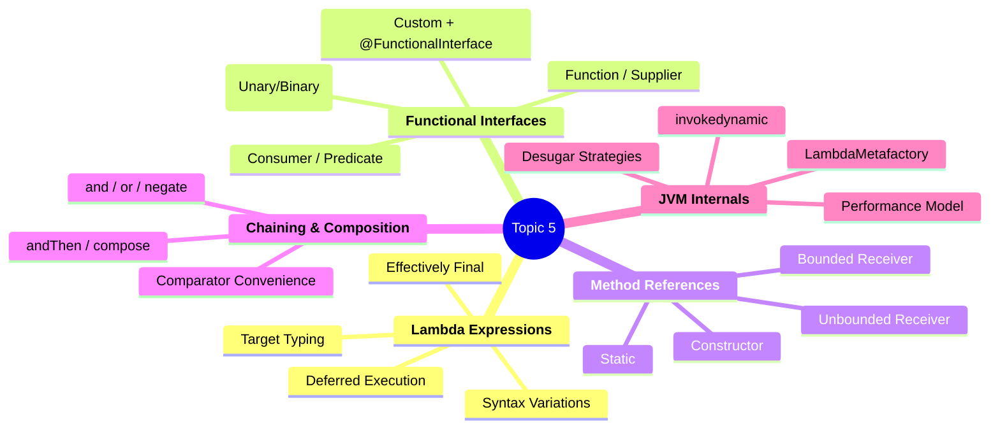

---

## :material-key: Core Concepts

### 1. Lambda Expressions

**Definition:** A lambda expression is a concise representation of a function object — an anonymous method that targets a **functional interface** (an interface with exactly one abstract method). It replaces the ceremony of anonymous classes with clean, expressive syntax.

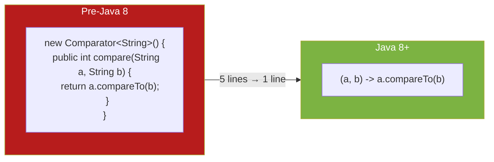

#### Syntax Quick Reference

| Form | Syntax | Notes |
|------|--------|-------|
| No params | `() -> expr` | Parens required |
| One param, no type | `s -> expr` | Parens optional |
| One param, typed | `(String s) -> expr` | Parens required |
| Multiple params | `(a, b) -> expr` | All types or none |
| `var` params | `(var a, var b) -> expr` | All must be `var` |
| Expression body | `(a, b) -> a + b` | Implicit return, no semicolons |
| Block body | `(a, b) -> { return a + b; }` | Explicit return + semicolons |

#### The Three Laws of Lambda Scoping

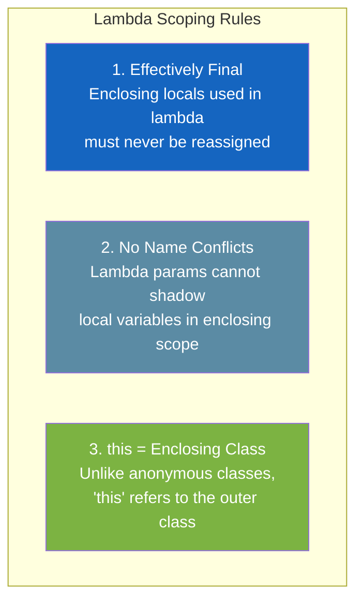

---

### 2. Functional Interfaces

**Definition:** An interface with exactly **one abstract method** (SAM — Single Abstract Method). The `@FunctionalInterface` annotation is optional but strongly recommended — it prevents accidental API breakage.

#### The Six Fundamental Interfaces

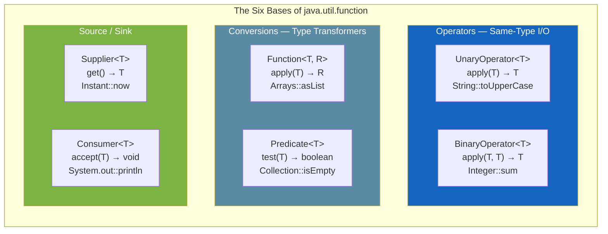

#### The Full 43-Interface Derivation

All 43 interfaces in `java.util.function` derive from the six basics via three axes of variation:

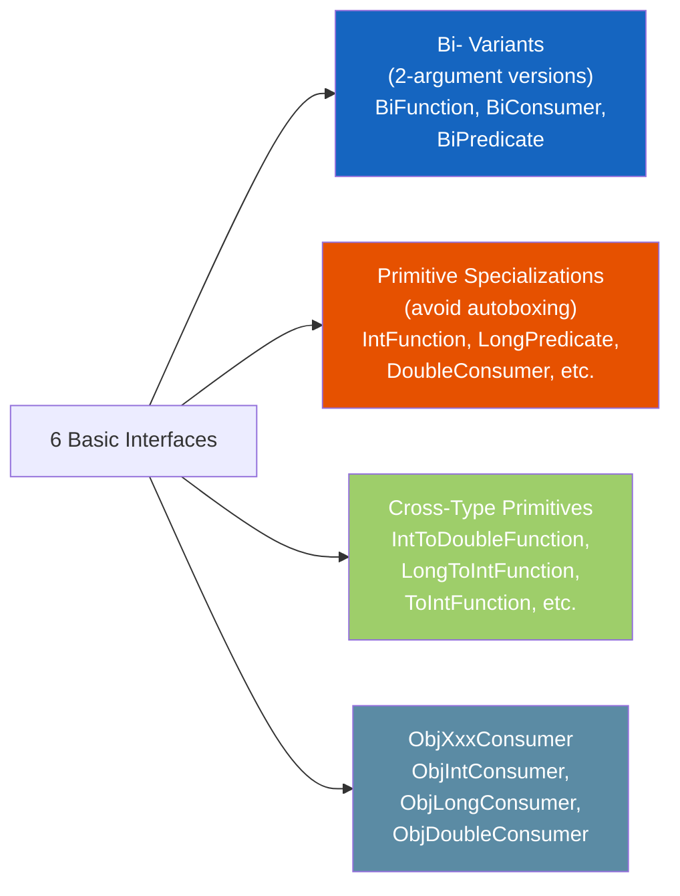

#### API Methods That Accept Functional Interfaces

| Method | Accepts | Category | Purpose |
|--------|---------|:--------:|---------|
| `Iterable.forEach(...)` | `Consumer<T>` | Consumer | Iterate and execute |
| `List.removeIf(...)` | `Predicate<T>` | Predicate | Remove matching elements |
| `List.replaceAll(...)` | `UnaryOperator<T>` | Function | Transform each element |
| `List.sort(...)` | `Comparator<T>` | Custom FI | Sort with custom logic |
| `Arrays.setAll(...)` | `IntFunction<T>` | Function | Populate array by index |
| `Map.merge(...)` | `BiFunction<V,V,V>` | Function | Resolve key conflicts |
| `String.transform(...)` | `Function<String,R>` | Function | Apply function to string |

---

### 3. Method References

**Definition:** A method reference is a compact lambda expression that delegates to an existing method. It removes the boilerplate of declaring parameters and forwarding them.

#### The Four Types

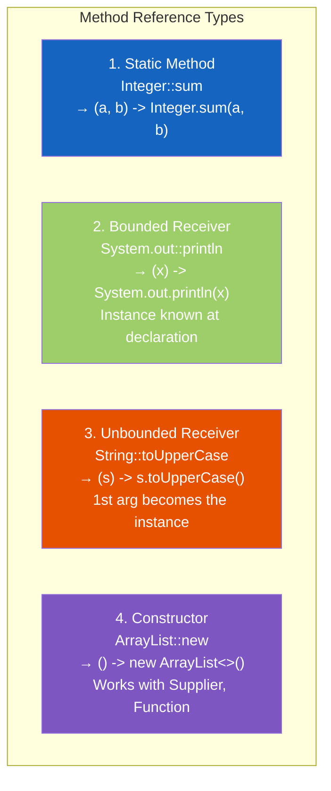

#### The Unbounded Receiver — The Confusing One

The key insight: for unbounded receivers, the **first argument** to the functional method becomes the **instance** on which the method is called:

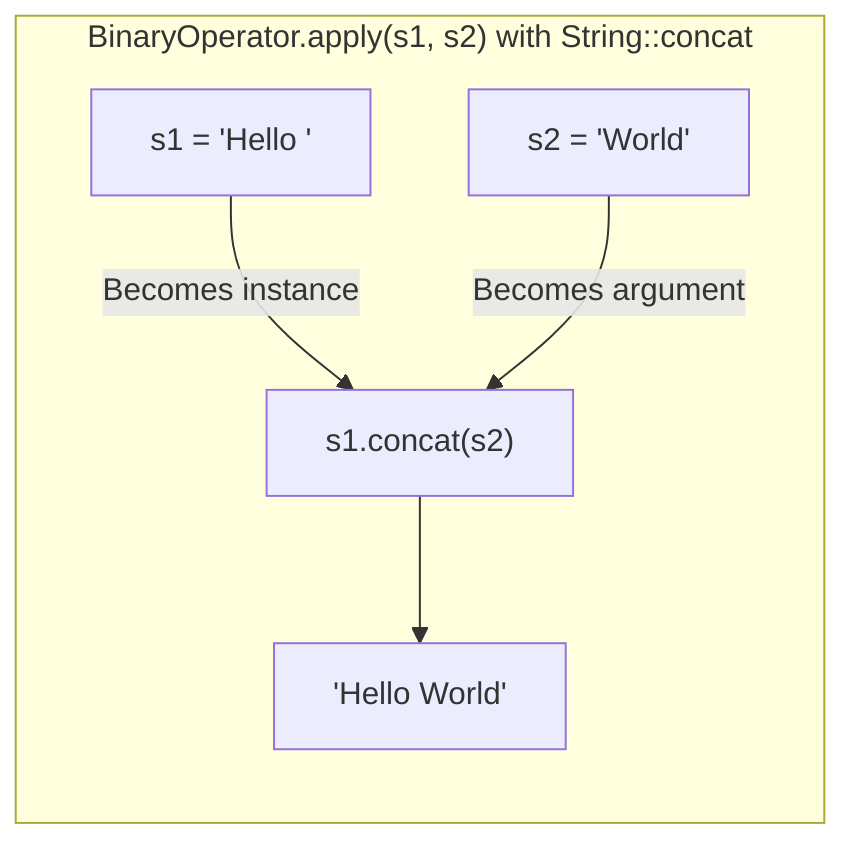

| Functional Interface | Params | Unbounded Receiver `ClassName::method` | Works? |
|:---:|:---:|:---:|:---:|
| `UnaryOperator<String>` | 1 | 1 instance + 0 args for `toUpperCase()` | ✅ |
| `BinaryOperator<String>` | 2 | 1 instance + 1 arg for `concat(String)` | ✅ |
| `UnaryOperator<String>` | 1 | 1 instance + 1 arg for `concat(String)` | ❌ Not enough! |

---

### 4. Chaining & Convenience Methods

Functional interfaces provide **default methods** for composition — chaining multiple operations into a single pipeline:

#### Function Chaining: `andThen` vs `compose`

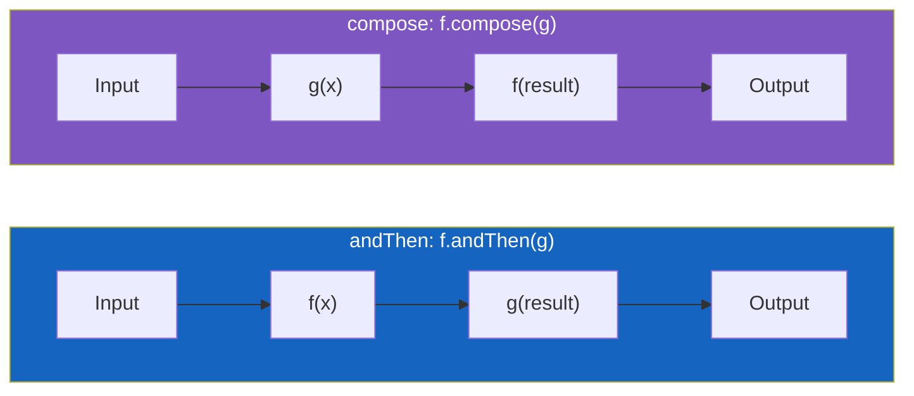

```java
Function<String, String> uCase = String::toUpperCase;
Function<String, String> addSuffix = s -> s.concat(" Egyptian");

// andThen: uCase FIRST, then addSuffix
uCase.andThen(addSuffix).apply("Ahmed"); // "AHMED Egyptian"

// compose: addSuffix FIRST, then uCase
uCase.compose(addSuffix).apply("Ahmed"); // "AHMED EGYPTIAN"
```

**Intermediate types can differ** — only the final type must match the declaration:

```java
Function<String, Integer> pipeline = uCase                      // String → String
    .andThen(s -> s.concat(" Egyptian"))                         // String → String
    .andThen(s -> s.split(" "))                                  // String → String[]
    .andThen(s -> String.join(", ", s))                          // String[] → String
    .andThen(String::length);                                    // String → Integer
// Returns: 15
```

#### Complete Convenience Methods Reference

| Method | Available On | Behavior |
|--------|:------------|---------|
| `andThen(after)` | Function, UnaryOp, BiFunction, BinaryOp, Consumer, BiConsumer | Execute **this** first, then **after** |
| `compose(before)` | Function, UnaryOperator **only** | Execute **before** first, then **this** |
| `and(other)` | Predicate, BiPredicate | Logical **AND** of two predicates |
| `or(other)` | Predicate, BiPredicate | Logical **OR** of two predicates |
| `negate()` | Predicate, BiPredicate | **Invert** the boolean result |

#### Comparator Fluent API


| Method | Type | Purpose |
|--------|:----:|---------|
| `Comparator.comparing(keyExtractor)` | Static | Create from key extraction function |
| `Comparator.naturalOrder()` | Static | Sort by `Comparable` natural order |
| `Comparator.reverseOrder()` | Static | Reverse natural order |
| `.thenComparing(keyExtractor)` | Default | Add secondary sort level |
| `.reversed()` | Default | Reverse the entire comparator chain |

---

## :material-head-cog: Key Internals to Understand

### 1. How Lambdas Are Compiled: `invokedynamic`

This is one of the most important JVM internals to understand. **Lambdas are NOT compiled to anonymous classes.** Instead, they use the `invokedynamic` bytecode instruction (introduced in Java 7 for dynamic languages, repurposed for lambdas in Java 8).

#### The Anonymous Class Approach (What Java Doesn't Do)

If lambdas were compiled like anonymous classes, each lambda would generate a separate `.class` file:

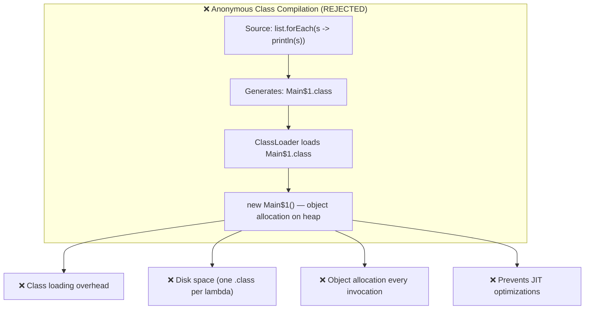

#### The `invokedynamic` Approach (What Java Actually Does)

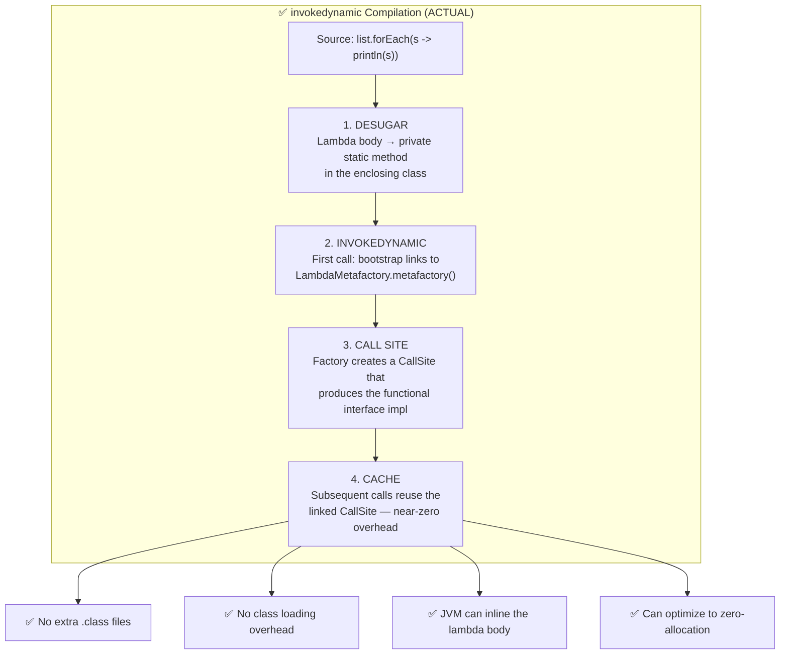

#### Step-by-Step: What Happens at Runtime

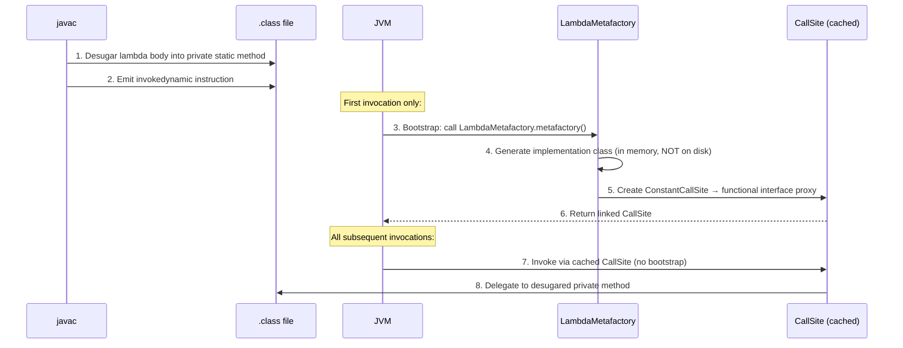

#### The Desugar Step in Detail

When the compiler encounters a lambda, it:

1. **Extracts the lambda body** into a private method in the same class
2. If the lambda **captures** local variables, they become method parameters
3. If the lambda captures `this`, the method is **instance** (not static)

```java
// Source code:
public class Main {
    public void process(List<String> list) {
        String prefix = "Hello";
        list.forEach(s -> System.out.println(prefix + " " + s));
    }
}

// After desugaring (conceptual — actual bytecode):
public class Main {
    public void process(List<String> list) {
        String prefix = "Hello";
        list.forEach(/* invokedynamic → lambda$process$0(prefix, s) */);
    }

    // Compiler-generated private method:
    private static void lambda$process$0(String prefix, String s) {
        System.out.println(prefix + " " + s);
    }
    // 'prefix' is passed as a parameter because it's captured from the enclosing scope
}
```

!!! info "Why Effectively Final Is Required"
    Now the technical reason is clear: since the captured variable is **copied** as a parameter to the desugared method, any subsequent mutation to the original variable would create an inconsistency. Java prevents this by requiring the variable to be effectively final — guaranteeing the copy and the original always have the same value.

---

### 2. Lambda vs Anonymous Class — Performance Comparison

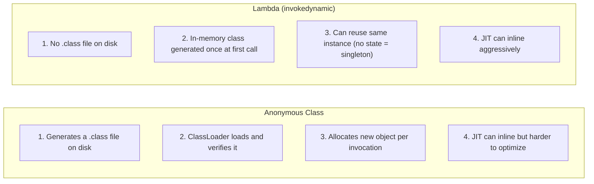

| Aspect | Anonymous Class | Lambda |
|--------|:--------------:|:------:|
| **Class files** | One `.class` per anonymous class | None (in-memory generation) |
| **First invocation** | Class loading + verification | Bootstrap + metafactory (similar cost) |
| **Subsequent invocations** | `new AnonymousClass()` allocation | Cached CallSite (no allocation for non-capturing) |
| **Memory** | New object every time | Singleton when non-capturing |
| **JIT optimization** | Limited inlining | Aggressive inlining possible |
| **Startup impact** | More class loading at startup | Deferred to first use |

!!! tip "Non-Capturing Lambdas Are Free"
    A lambda that **doesn't capture** any variables (no local variables from the enclosing scope, no `this`) can be implemented as a **singleton** — the JVM creates one instance and reuses it forever. This means zero allocation overhead after the first call.

    ```java
    // Non-capturing — singleton, zero allocation:
    list.forEach(System.out::println);

    // Capturing 'prefix' — new instance each invocation:
    list.forEach(s -> System.out.println(prefix + s));
    ```

---

### 3. The `LambdaMetafactory` — JVM Machinery

The `java.lang.invoke.LambdaMetafactory` is the bootstrap method that the JVM calls to link lambda call sites. It receives **three critical pieces of information**:

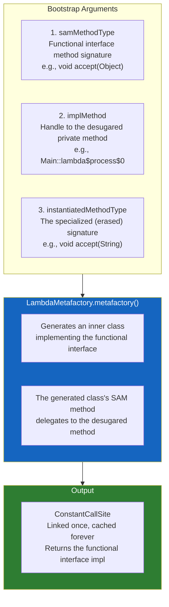

#### Why `invokedynamic` Over Direct Class Generation?

The key advantage of `invokedynamic` is **future flexibility**:

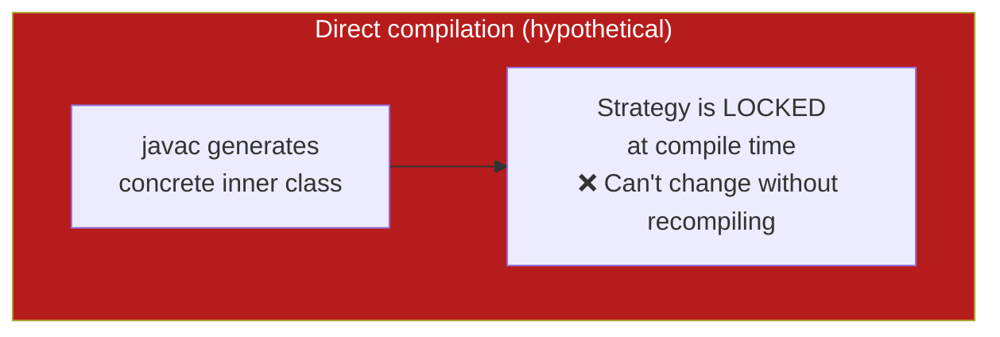

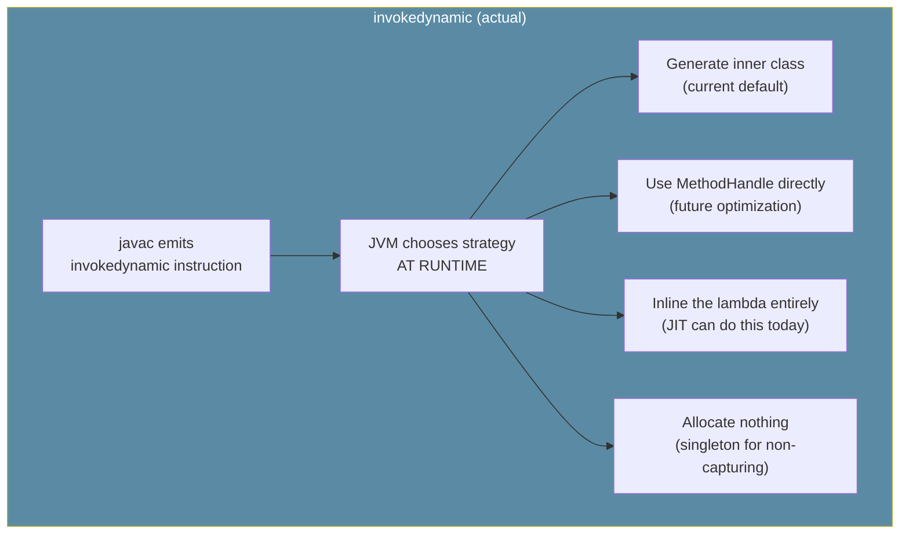

> _The JVM is free to change its lambda implementation strategy in future versions without recompiling any existing code._ This is why `invokedynamic` was chosen over simply generating anonymous classes or method handles directly.

---

### 4. Target Typing and Type Inference

Lambda expressions don't carry explicit type information — the compiler **infers** the target functional interface from context. This is called **target typing**.

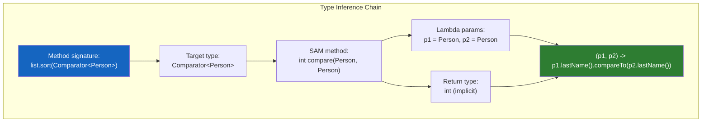

#### Where Target Typing Works

| Context | Example | Target Type Source |
|---------|---------|-------------------|
| Variable declaration | `Predicate<String> p = s -> s.isEmpty()` | Declared variable type |
| Method argument | `list.removeIf(s -> s.isEmpty())` | Method parameter type |
| Return statement | `return s -> s.isEmpty()` | Method return type |
| Cast expression | `(Predicate<String>) s -> s.isEmpty()` | Cast type |
| Ternary expression | `condition ? s -> s.isEmpty() : s -> true` | Inferred from other branch |

#### When Inference Fails

```java
// ❌ Ambiguous — which interface to target?
var p = s -> s.isEmpty();  // Error! 'var' can't infer the functional interface type

// ✅ Provide the target type explicitly:
Predicate<String> p = s -> s.isEmpty();
Function<String, Boolean> f = s -> s.isEmpty();
// Both are valid targets for the SAME lambda!
```

---

### 5. Effectively Final — The Technical Deep Dive

#### Why It's Required (The Real Reason)

When a lambda captures a local variable, the variable's **value is copied** into the lambda's environment (it's passed as a parameter to the desugared method). If the original variable could change after the copy, the lambda and the enclosing method would disagree about the variable's value — a data consistency bug.

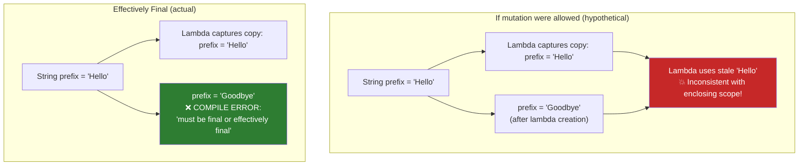

#### Effectively Final vs `final`

| Term | Meaning | Example |
|------|---------|---------|
| `final` | **Explicitly** declared immutable | `final String prefix = "Hello";` |
| Effectively final | **Implicitly** immutable — assigned once, never reassigned | `String prefix = "Hello";` (no subsequent `prefix = ...`) |
| Not effectively final | Reassigned at any point in the scope | `String prefix = "Hello"; prefix = "Bye";` |

A variable is effectively final if removing `final` from a `final` declaration would not change program semantics. The compiler checks this — if any assignment to the variable exists anywhere after initialization, the lambda won't compile.

!!! warning "The Check Is Scope-Wide"
    Even if the reassignment appears **after** the lambda, it still breaks the lambda:
    ```java
    String prefix = "Hello";
    list.forEach(s -> System.out.println(prefix + s)); // ❌ Breaks!
    prefix = "Goodbye"; // This line breaks the lambda ABOVE, not just below
    ```
    The compiler considers the entire scope of the variable, not just execution order.

---

### 6. Deferred Execution — When Lambdas Actually Run

A lambda assigned to a variable is **NOT executed at assignment time**. The code is captured as a function object — it runs only when the functional method is explicitly invoked.

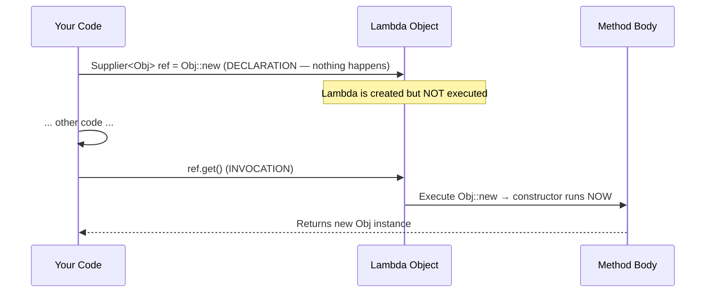

This matters for understanding:

1. **Performance**: The constructor doesn't run until `.get()` — lazy initialization
2. **Side effects**: `System.out::println` stored in a variable prints nothing until `.accept()` is called
3. **Effectively final**: Since the lambda might execute much later (or on another thread), the captured variables must remain constant

---

## :material-lightning-bolt: Design Patterns & Best Practices

### The Lambda Decision Tree

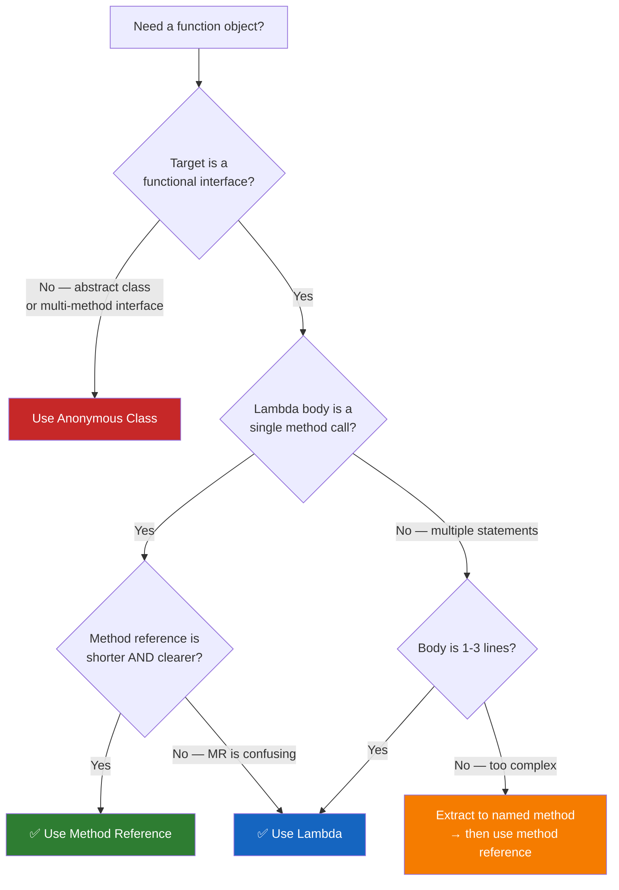

### Effective Java Best Practices Applied

| Practice | Item | Why It Matters |
|----------|:----:|---------------|
| Prefer lambdas to anonymous classes | 42 | Anonymous classes are 5× more verbose and harder to read |
| Omit lambda parameter types | 42 | Type inference is powered by generics — trust the compiler |
| Prefer method references when clearer | 43 | Less parameter noise; IntelliJ suggests conversions |
| Five types of method references | 43 | Static, bound, unbound, class constructor, array constructor |
| Use standard functional interfaces | 44 | 43 built-in interfaces cover virtually all use cases |
| `@FunctionalInterface` always | 44 | Prevents adding a second abstract method accidentally |
| Custom FI only when it adds value | 44 | Justified by: descriptive name, strong contract, or convenience methods |

---

## :material-alert: Common Pitfalls

### 1. Using `return` Without Braces

```java
(a, b) -> return a + b     // ❌ Compile error!
(a, b) -> a + b            // ✅ Expression body — implicit return
(a, b) -> { return a + b; } // ✅ Block body — explicit return
```

### 2. Mixing `var` and Explicit Types

```java
(Integer a, var b) -> a + b  // ❌ Cannot mix!
(var a, var b) -> a + b      // ✅ All var
(Integer a, Integer b) -> a + b // ✅ All typed
```

### 3. Modifying Captured Variables

```java
String prefix = "Hello";
list.forEach(s -> System.out.println(prefix + s));
prefix = "Goodbye";  // ❌ Even though it's AFTER the lambda, it breaks it!
// "Variable used in lambda should be final or effectively final"
```

### 4. Confusing Static and Unbounded Receiver

```java
Integer::sum     // STATIC method (sum is static on Integer)
String::concat   // UNBOUNDED RECEIVER (concat is an instance method!)
// Both use ClassName::method syntax — the compiler decides based on static vs instance
```

### 5. Wrong Argument Count for Unbounded Receiver

```java
UnaryOperator<String> u = String::concat;  // ❌ 1 param → 1 instance + 0 args for concat
                                           //    But concat needs 1 arg! → mismatch
BinaryOperator<String> b = String::concat; // ✅ 2 params → 1 instance + 1 arg for concat
```

### 6. Forgetting `compose` Reverses Order

```java
f.andThen(g).apply(x);   // f(x) first, then g(result)
f.compose(g).apply(x);   // g(x) first, then f(result) ← REVERSED!
```

### 7. Using `var` with Lambdas

```java
var p = s -> s.isEmpty();  // ❌ Compile error!
// 'var' cannot infer functional interface type from lambda
// Which one? Predicate<String>? Function<String, Boolean>? Custom?

Predicate<String> p = s -> s.isEmpty();  // ✅ Explicit target type
```

### 8. Verbose Comparator When Convenience Methods Exist

```java
// ❌ Verbose and error-prone
list.sort((o1, o2) -> {
    int result = o1.lastName().compareTo(o2.lastName());
    return result == 0 ? o1.firstName().compareTo(o2.firstName()) : result;
});

// ✅ Fluent and readable
list.sort(Comparator.comparing(Person::lastName)
                    .thenComparing(Person::firstName));
```

---

## :material-lightbulb-on: Best Practices Checklist

**Lambda Expressions:**

- [x] Use expression bodies for single-expression lambdas (no braces, no return)
- [x] Omit parameter types — let the compiler infer from context
- [x] Keep lambda bodies to 1–3 lines; extract longer logic to named methods
- [x] Never serialize lambdas — the serialized form is brittle and implementation-dependent
- [x] Remember `this` refers to the enclosing class, not the lambda itself

**Functional Interfaces:**

- [x] Memorize the six basic interfaces: Consumer, Predicate, Function, Supplier, UnaryOp, BinaryOp
- [x] Always add `@FunctionalInterface` to custom functional interfaces
- [x] Prefer standard interfaces — custom only when name, contract, or default methods add value
- [x] Use primitive specializations (`IntPredicate`, `DoubleBinaryOperator`) to avoid autoboxing

**Method References:**

- [x] Default to method references when they are shorter AND clearer
- [x] Understand all four types: static, bounded, unbounded, constructor
- [x] Watch for the unbounded receiver argument-count trap
- [x] Use IntelliJ's gutter icons to identify and convert lambda ↔ method reference

**Chaining & Composition:**

- [x] Use `andThen` for left-to-right pipelines; `compose` only when right-to-left makes sense
- [x] For Predicates: `and`, `or`, `negate` — compose test logic without imperative conditionals
- [x] For Comparators: `Comparator.comparing()` + `.thenComparing()` + `.reversed()`
- [x] Remember Consumer chains all receive the same input; Function chains pipe output → input

---

## :material-bookmark: Learning Resources

### Lambda Expressions & Functional Interfaces

- [Oracle — Lambda Expressions Tutorial](https://docs.oracle.com/javase/tutorial/java/javaOO/lambdaexpressions.html)
- [Oracle — Method References Tutorial](https://docs.oracle.com/javase/tutorial/java/javaOO/methodreferences.html)
- [Baeldung — Lambda Expressions and Functional Interfaces](https://www.baeldung.com/java-8-lambda-expressions-tips)
- [Baeldung — Method References in Java](https://www.baeldung.com/java-method-references)

### JVM Internals

- [Oracle — JEP 276: Dynamic Linking of Language-Defined Object Models](https://openjdk.org/jeps/276)
- [Brian Goetz — Translation of Lambda Expressions](https://cr.openjdk.org/~briangoetz/lambda/lambda-translation.html) ⭐ The definitive design document
- [Baeldung — Java invokedynamic](https://www.baeldung.com/java-invoke-dynamic)
- [StackOverflow — How does Java 8 compile lambdas?](https://stackoverflow.com/questions/16827262/) 

### Functional Interface Library

- [API — java.util.function (Java 17)](https://docs.oracle.com/en/java/javase/17/docs/api/java.base/java/util/function/package-summary.html)
- [API — java.util.Comparator (Java 17)](https://docs.oracle.com/en/java/javase/17/docs/api/java.base/java/util/Comparator.html)

### Effective Java

- [Effective Java 3rd Edition](https://www.oreilly.com/library/view/effective-java-3rd/9780134686097/) — Chapter 7: Lambdas and Streams
- [GitHub — Effective Java Summary](https://github.com/HugoMatilla/Effective-JAVA-Summary)

---

## :material-link-variant: Related Topics

- [Abstraction, Interfaces & Nested Classes](../topic-4-abstraction-generics/summary.md) _(anonymous classes → lambdas bridge)_
- [Collections Framework](../topic-6-collections-framework/summary.md) _(lambdas power the Collections API)_
- [Java Streams API](../topic-7-streams/summary.md) _(built entirely on top of lambdas & functional interfaces)_

---

## :material-bookshelf: References

- **Course:** Tim Buchalka — Java Programming Masterclass (Section 14)
- **Book:** Effective Java (3rd Edition) — Joshua Bloch (Items 42–44)
- **API:** [java.util.function (Java 17)](https://docs.oracle.com/en/java/javase/17/docs/api/java.base/java/util/function/package-summary.html)
- **API:** [java.util.Comparator (Java 17)](https://docs.oracle.com/en/java/javase/17/docs/api/java.base/java/util/Comparator.html)
- **Spec:** [JLS §15.27 — Lambda Expressions](https://docs.oracle.com/javase/specs/jls/se17/html/jls-15.html#jls-15.27)
- **Spec:** [JLS §15.13 — Method Reference Expressions](https://docs.oracle.com/javase/specs/jls/se17/html/jls-15.html#jls-15.13)
- **Design:** [Brian Goetz — Translation of Lambda Expressions](https://cr.openjdk.org/~briangoetz/lambda/lambda-translation.html)

---

_Completed: 2026-03-12 | Confidence: 9/10_
