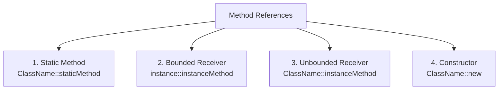
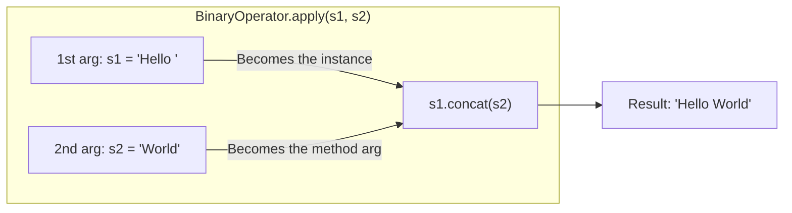
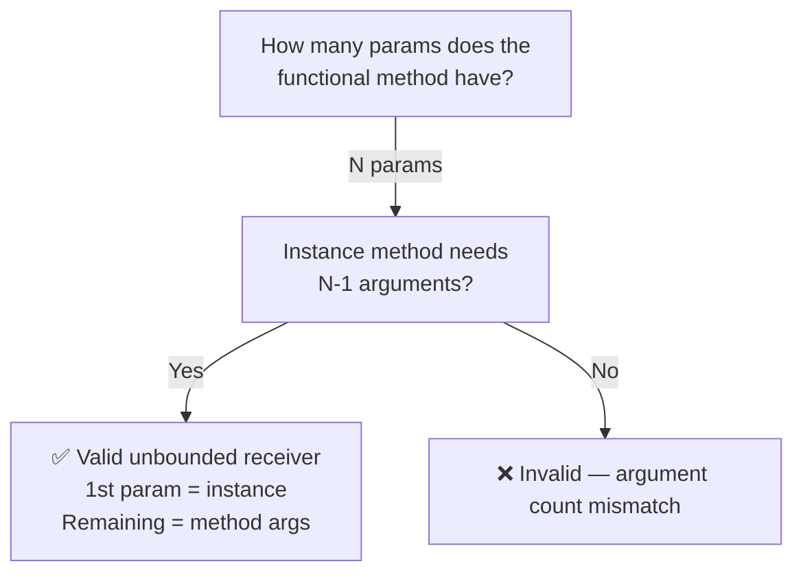
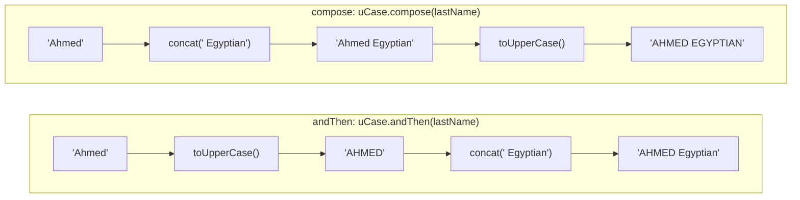
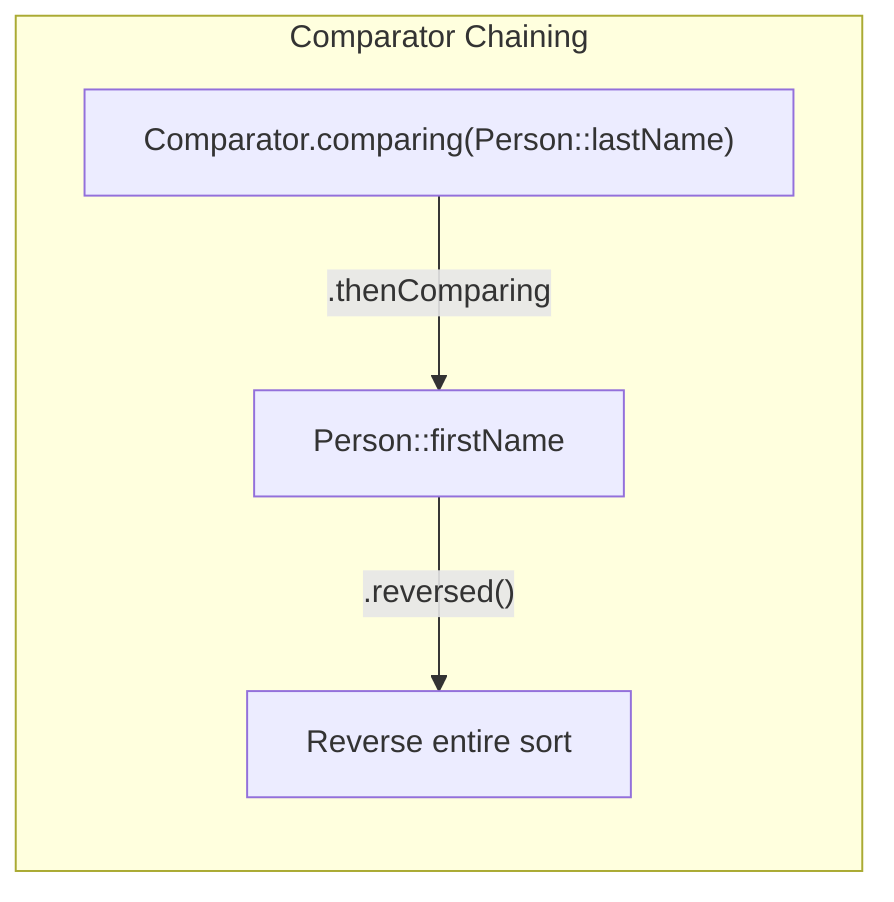

# :material-pencil: Topic Note: Method References, Chaining & Comparator Convenience (Part 2 — Section 14, Lectures 9–13)

> **Course:** Java Programming Masterclass — Tim Buchalka (Udemy)  
> **Section:** 14 — Mastering Java Lambdas Expressions, Interfaces, and Method References  
> **Status:** :material-check-circle: Complete

---

## :material-target: Learning Objectives

By the end of this part, you should be able to:

- [x] Understand and use the four types of **Method References**: static, bounded receiver, unbounded receiver, and constructor.
- [x] Differentiate between a **Bounded Receiver** (`instance::method`) and an **Unbounded Receiver** (`ClassName::instanceMethod`).
- [x] Explain why `String::concat` is valid as a `BinaryOperator<String>` but NOT as a `UnaryOperator<String>`.
- [x] Chain functional interfaces using **convenience methods**: `andThen`, `compose`, `and`, `or`, `negate`.
- [x] Understand that chained `Function` lambdas can have **different intermediate types** — only the final type must match the declared return type.
- [x] Use `Comparator.comparing()`, `thenComparing()`, and `reversed()` for concise multi-level sorting.
- [x] Use `String.transform()` to apply a `Function` or `UnaryOperator` directly on a String.

---

## :material-head-cog: 1. Method References Overview

A **method reference** is an even more concise alternative to a lambda expression. Instead of writing the parameters and calling a method, you simply reference the method directly using the `::` operator.

```java
// Lambda expression
list.forEach(s -> System.out.println(s));

// Equivalent method reference
list.forEach(System.out::println);
```

### The Four Types of Method References



| Type | Syntax | Lambda Equivalent | Example |
|------|--------|-------------------|---------|
| **Static** | `ClassName::staticMethod` | `(args) -> ClassName.staticMethod(args)` | `Integer::sum` |
| **Bounded Receiver** | `instance::instanceMethod` | `(args) -> instance.instanceMethod(args)` | `System.out::println` |
| **Unbounded Receiver** | `ClassName::instanceMethod` | `(obj, args) -> obj.instanceMethod(args)` | `String::concat` |
| **Constructor** | `ClassName::new` | `(args) -> new ClassName(args)` | `PlainOld::new` |

---

## :material-head-cog: 2. Static Method References

The simplest type. You call a **static method** on a class:

```java
// Lambda:
calculator((a, b) -> a + b, 10, 25);

// Method reference — Integer.sum(a, b) is a static method:
calculator(Integer::sum, 10, 25);

// Double also has a static sum method:
calculator(Double::sum, 2.5, 7.5);
```

The compiler knows `Integer::sum` matches `BinaryOperator<Integer>` because the `sum` method signature `(int, int) -> int` matches `apply(T, T) -> T`.

---

## :material-head-cog: 3. Bounded Receiver Method References

The **instance** on which the method is called is **known at declaration time** — it comes from the enclosing scope:

```java
// System.out is the instance (bounded receiver)
list.forEach(System.out::println);

// Equivalent lambda:
list.forEach(s -> System.out.println(s));
```

The `PrintStream` object returned by `System.out` is the "bounded receiver" — it's already known when the reference is created.

### Bounded Receiver with Custom Objects

```java
Person ahmed = new Person("Ahmed");

// ahmed is the bounded receiver — known at declaration time
UnaryOperator<String> boundedRef = ahmed::last;
// Equivalent: s -> ahmed.last(s)
```

---

## :material-head-cog: 4. Unbounded Receiver Method References

This is the **most confusing** type. The instance to call the method on is NOT known at declaration - it comes from the **first argument** when the lambda is eventually executed.

### Why `String::concat` Works as a `BinaryOperator`

```java
BinaryOperator<String> b1 = String::concat;
// b1.apply("Hello ", "World") → "Hello ".concat("World") → "Hello World"
```



The first argument becomes the **instance** on which `concat` is invoked, and the second argument is passed **to** `concat`.

### Why `String::concat` Does NOT Work as `UnaryOperator`

```java
UnaryOperator<String> u1 = String::concat;  // ❌ ERROR!
// UnaryOperator.apply(s1) — only ONE argument!
// concat needs an instance AND an argument → 2 values needed
// But UnaryOperator only provides 1 value
```

### `String::toUpperCase` Works as `UnaryOperator`

```java
UnaryOperator<String> u1 = String::toUpperCase;  // ✅
// u1.apply("hello") → "hello".toUpperCase() → "HELLO"
// The single argument becomes the instance, toUpperCase() takes no args
```

### Decision Rule for Unbounded Receiver



---

## :material-head-cog: 5. Constructor Method References

Use `ClassName::new` to reference a constructor:

```java
// Lambda:
Supplier<PlainOld> ref = () -> new PlainOld();

// Method reference:
Supplier<PlainOld> ref = PlainOld::new;

// Deferred! Nothing created yet.
PlainOld obj = ref.get();  // NOW the constructor executes
```

### Factory Pattern: Seeding an Array

```java
private static PlainOld[] seedArray(Supplier<PlainOld> reference, int count) {
    PlainOld[] array = new PlainOld[count];
    for (int i = 0; i < count; i++) {
        array[i] = reference.get();  // Creates a new instance each call
    }
    return array;
}

// Usage:
PlainOld[] pojo1 = seedArray(PlainOld::new, 10);
// Creates 10 PlainOld objects with auto-incrementing IDs
```

---

## :material-head-cog: 6. String.transform() — Applying Functions to Strings

The `String.transform()` method (added in JDK 12) takes a `Function<String, R>` and applies it:

```java
UnaryOperator<String> u1 = String::toUpperCase;

String result = "hello".transform(u1);
System.out.println(result);  // "HELLO"

result = result.transform(String::toLowerCase);
System.out.println(result);  // "hello"

// Can return non-String types:
Function<String, Boolean> f0 = String::isEmpty;
boolean resultBoolean = result.transform(f0);
System.out.println(resultBoolean);  // false
```

---

## :material-head-cog: 7. Method Reference Challenge

The challenge demonstrates a pipeline of `UnaryOperator<String>` transformations applied to an array:

```java
String[] names = {"Anna", "Cameron", "Bob", "Donald", "Eva", "Francis"};
Person ahmed = new Person("Ahmed");

List<UnaryOperator<String>> list = List.of(
    String::toUpperCase,                                         // Unbounded receiver
    s -> s += " " + getRandomChar('D', 'M') + ".",             // Lambda
    s -> s += " " + reverse(s, 0, s.indexOf(" ")),             // Lambda
    MethodReferenceChallenge::reverse,                          // Static method ref
    String::new,                                                // Constructor ref
    String::valueOf,                                            // Static method ref
    ahmed::last                                                 // Bounded receiver
);

private static void applyChanges(String[] names, List<UnaryOperator<String>> stringFunctions) {
    List<String> backedByArray = Arrays.asList(names);
    for (var function : stringFunctions) {
        backedByArray.replaceAll(s -> s.transform(function));
        System.out.println(Arrays.toString(names));
    }
}
```

---

## :material-head-cog: 8. Chaining Lambdas with Convenience Methods

### Function: `andThen` and `compose`

The `Function` interface provides **two** convenience methods for chaining:

| Method | Execution Order | Available On |
|--------|----------------|--------------|
| `andThen(after)` | `this` first, then `after` | Function, UnaryOperator, BiFunction, BinaryOperator, Consumer |
| `compose(before)` | `before` first, then `this` | Function, UnaryOperator **only** |

```java
Function<String, String> uCase = String::toUpperCase;
Function<String, String> lastName = s -> s.concat(" Egyptian");

// andThen: uCase FIRST, then lastName
Function<String, String> uCaseLastName = uCase.andThen(lastName);
System.out.println(uCaseLastName.apply("Ahmed"));  // "AHMED Egyptian"

// compose: lastName FIRST, then uCase
uCaseLastName = uCase.compose(lastName);
System.out.println(uCaseLastName.apply("Ahmed"));  // "AHMEDEGYPTIAN"
```



### Chaining with Different Intermediate Types

The **intermediate types don't have to match** — only the first input and the final output types matter:

```java
Function<String, String[]> f0 = uCase
    .andThen(s -> s.concat(" Egyptian"))     // String → String
    .andThen(s -> s.split(" "));              // String → String[]
// Input: String, Output: String[]

Function<String, String> f1 = uCase
    .andThen(s -> s.concat(" Egyptian"))     // String → String
    .andThen(s -> s.split(" "))              // String → String[]
    .andThen(s -> s[1].toUpperCase() + ", " + s[0]); // String[] → String
// EGYPTIAN, AHMED

Function<String, Integer> f2 = uCase
    .andThen(s -> s.concat(" Egyptian"))     // String → String
    .andThen(s -> s.split(" "))              // String → String[]
    .andThen(s -> String.join(", ", s))       // String[] → String
    .andThen(String::length);                // String → Integer
// 15
```

### Consumer Chaining with `andThen`

Consumer chains are different because **no value is returned**. The same input is passed to each chained consumer:

```java
String[] names = {"Ahmed", "Mohamed", "Ali", "Hany"};
Consumer<String> s0 = s -> System.out.print(s.charAt(0));
Consumer<String> s1 = System.out::println;

Arrays.asList(names).forEach(
    s0                                       // Print first initial
    .andThen(s -> System.out.print(" - "))  // Print separator
    .andThen(s1)                            // Print full name + newline
);
// Output: A - Ahmed
//         M - Mohamed
//         A - Ali
//         H - Hany
```

---

## :material-head-cog: 9. Predicate Convenience Methods

Predicates support **logical composition** with `and`, `or`, and `negate`:

```java
Predicate<String> p1 = s -> s.equals("AHMED");
Predicate<String> p2 = s -> s.equalsIgnoreCase("Ahmed");
Predicate<String> p3 = s -> s.startsWith("A");
Predicate<String> p4 = s -> s.endsWith("d");

// OR — true if EITHER is true
Predicate<String> combined1 = p1.or(p2);
combined1.test("Ahmed");  // true (p2 passes)

// AND — true if BOTH are true
Predicate<String> combined2 = p3.and(p4);
combined2.test("Ahmad");  // false ('Ahmad' doesn't end with 'd'... wait, it does!)

// NEGATE — inverts the result
Predicate<String> combined3 = p3.and(p4).negate();
combined3.test("Ahmed");  // false (p3 AND p4 = true → negated = false)
```

### Convenience Methods Summary

| Method | Category | Behaviour |
|--------|----------|-----------|
| `andThen(after)` | Function, Consumer | Execute **this** first, then **after** |
| `compose(before)` | Function only | Execute **before** first, then **this** |
| `and(other)` | Predicate | Logical AND of two predicates |
| `or(other)` | Predicate | Logical OR of two predicates |
| `negate()` | Predicate | Inverts the boolean result |

---

## :material-head-cog: 10. Comparator Convenience Methods

The `Comparator` interface provides powerful **static and default methods** for building sort logic concisely:

### `Comparator.comparing()` — Single-Level Sort

```java
record Person(String firstName, String lastName) {}

List<Person> list = new ArrayList<>(Arrays.asList(
    new Person("Peter", "Pan"),
    new Person("Peter", "PumpkinEater"),
    new Person("Minnie", "Mouse"),
    new Person("Mickey", "Mouse")
));

// Old way — verbose lambda:
list.sort((o1, o2) -> o1.lastName().compareTo(o2.lastName()));

// New way — Comparator.comparing with method reference:
list.sort(Comparator.comparing(Person::lastName));
```

### `thenComparing()` — Multi-Level Sort

```java
// Sort by lastName, then by firstName within same lastName
list.sort(Comparator.comparing(Person::lastName)
                    .thenComparing(Person::firstName));
// Mouse → Mickey before Minnie, Pan before PumpkinEater
```

### `reversed()` — Reverse the Entire Sort

```java
list.sort(Comparator.comparing(Person::lastName)
                    .thenComparing(Person::firstName)
                    .reversed());
// PumpkinEater before Pan, Mouse → Minnie before Mickey
```



### Comparator Methods Summary

| Method | Type | Purpose |
|--------|------|---------|
| `Comparator.comparing(keyExtractor)` | Static | Create comparator from key |
| `Comparator.naturalOrder()` | Static | Sort by `Comparable` natural order |
| `Comparator.reverseOrder()` | Static | Reverse of natural order |
| `.thenComparing(keyExtractor)` | Default | Secondary sort level |
| `.reversed()` | Default | Reverse the entire comparator |

---

## :material-alert: Common Pitfalls

### 1. Confusing Static and Unbounded Receiver Method References

```java
Integer::sum     // ✅ STATIC method reference (sum is static on Integer)
String::concat   // ✅ UNBOUNDED RECEIVER (concat is an instance method!)
// Both look identical syntactically: ClassName::method
// The compiler distinguishes based on whether the method is static or instance
```

### 2. Wrong Number of Arguments for Unbounded Receiver

```java
UnaryOperator<String> u = String::concat;  // ❌ concat needs 2 values
// UnaryOperator provides only 1 → instance + 0 args for concat → missing concat's arg!

BinaryOperator<String> b = String::concat; // ✅ provides 2 values
// 1st = instance to call concat on, 2nd = argument to pass to concat
```

### 3. Forgetting `compose` Reverses Execution Order

```java
Function<String, String> uCase = String::toUpperCase;
Function<String, String> addSuffix = s -> s + "!";

uCase.andThen(addSuffix).apply("hi");  // "HI!"  — upper first, then suffix
uCase.compose(addSuffix).apply("hi");  // "HI!"  — suffix first... wait:
// compose: addSuffix("hi") → "hi!" → toUpperCase("hi!") → "HI!"
```

### 4. Not Using `Comparator.comparing()` When You Should

```java
// ❌ Verbose and error-prone
list.sort((o1, o2) -> o1.lastName().compareTo(o2.lastName()));

// ✅ Concise and readable
list.sort(Comparator.comparing(Person::lastName));
```

---

## :material-format-list-checks: Key Takeaways

1. **Method references** (`::`) are shorthand for lambdas that simply call an existing method
2. **Bounded receiver** = instance from enclosing scope (`System.out::println`)
3. **Unbounded receiver** = first argument becomes the instance (`String::toUpperCase`)
4. **Constructor references** use `ClassName::new` and work with `Supplier` or `Function`
5. **`andThen`** chains sequentially; **`compose`** reverses the order (Function only)
6. **Consumer chains** re-pass the same input; **Function chains** pipe output → input
7. **Predicate** supports `and`, `or`, `negate` for logical composition
8. **`Comparator.comparing()`** + `.thenComparing()` + `.reversed()` replaces verbose lambdas
9. **`String.transform()`** applies a `Function` or `UnaryOperator` to a String

---

## :material-navigation: Related Notes

| Part | Topic | Link |
|:----:|-------|------|
| 1 | Lambda Expressions & Functional Interfaces (Section 14, Lectures 1–8) | [Part 1 — Lambda Fundamentals](topic-note.md) |
| 2 | Method References, Chaining & Comparator Convenience (Section 14, Lectures 9–13) | **You are here** |

---

## :material-bookshelf: References

- **Course:** Tim Buchalka — Java Programming Masterclass (Section 14, Lectures 9–13)
- **API:** [java.util.function (Java 17)](https://docs.oracle.com/en/java/javase/17/docs/api/java.base/java/util/function/package-summary.html)
- **API:** [java.util.Comparator (Java 17)](https://docs.oracle.com/en/java/javase/17/docs/api/java.base/java/util/Comparator.html)
- **Guide:** [Method References (Oracle Tutorial)](https://docs.oracle.com/javase/tutorial/java/javaOO/methodreferences.html)
- **Book:** Effective Java — Item 43: Prefer method references to lambdas
- **Book:** Effective Java — Item 44: Favor the use of standard functional interfaces

---

*Last Updated: 2026-03-12 | Confidence: 9/10*
