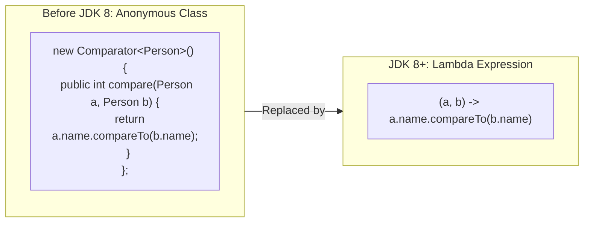
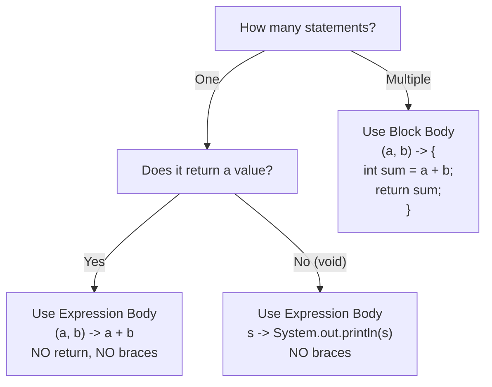
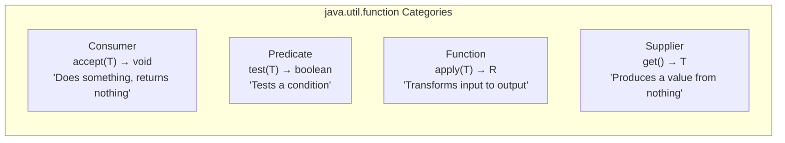
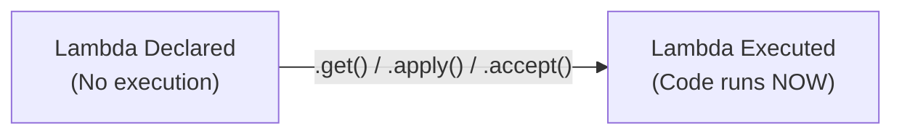

# :material-pencil: Topic Note: Lambda Expressions & Functional Interfaces (Part 1 — Section 14, Lectures 1–8)

> **Course:** Java Programming Masterclass — Tim Buchalka (Udemy)  
> **Section:** 14 — Mastering Java Lambdas Expressions, Interfaces, and Method References  
> **Status:** :material-check-circle: Complete

---

## :material-target: Learning Objectives

By the end of this part, you should be able to:

- [x] Explain what a **Lambda Expression** is and why it was introduced in JDK 8.
- [x] Identify a **Functional Interface** (SAM — Single Abstract Method) and use `@FunctionalInterface`.
- [x] Write lambdas using all **syntax variations** (single/multiple params, with/without types, expression vs block body).
- [x] Understand variable scoping: **effectively final** local variables and lambda parameter naming rules.
- [x] Use Java's four core built-in functional interfaces: **Consumer**, **Predicate**, **Function**, **Supplier**.
- [x] Distinguish between `BinaryOperator`, `UnaryOperator`, `BiConsumer`, and `BiFunction`.
- [x] Create **custom functional interfaces** with `@FunctionalInterface`.
- [x] Apply lambdas with real API methods: `forEach`, `removeIf`, `replaceAll`, `Arrays.setAll`.
- [x] Understand **deferred execution** — lambdas assigned to variables are NOT immediately executed.

---

## :material-head-cog: 1. What Is a Lambda Expression?

A **lambda expression** is a concise way to represent an anonymous function (a method with no name). It was introduced in **JDK 8** and is essentially a shorthand for implementing an anonymous class that targets a **functional interface**.



### Lambda Structure

```
(parameters) -> expression_or_block
```

| Part | Description |
|------|-------------|
| **Parameters** | Formal parameter list (can omit types, parens for single untyped param) |
| **Arrow (`->`)** | Separates parameters from body |
| **Body** | An expression (returns implicitly) OR a code block `{ ... }` with explicit `return` |

---

## :material-head-cog: 2. Functional Interfaces (SAM)

A **Functional Interface** is an interface that has exactly **one abstract method** (SAM = Single Abstract Method). This single method is called the **functional method**.

Java can **infer** which method a lambda implements because there is only one possibility.

```java
@FunctionalInterface
public interface Operation<T> {
    T operate(T value1, T value2);  // The functional method
}
```

### Why @FunctionalInterface?

| Without Annotation | With Annotation |
|---|---|
| Compiles, but no safety net | Compiler **enforces** single abstract method rule |
| Future devs might accidentally add abstract methods | Prevents breaking lambda-compatible code |
| No documentation hint | Explicitly communicates intent |

!!! warning "An Interface with 2+ Abstract Methods is NOT Functional"
    If an interface extends another and inherits a second abstract method, it has **two** abstract methods total. Java cannot infer which one to use → no lambdas allowed.
    ```java
    interface EnhancedComparator<T> extends Comparator<T> {
        int secondLevel(T o1, T o2);
        // compare() inherited from Comparator → 2 abstract methods!
        // ❌ NOT a functional interface
    }
    ```

---

## :material-head-cog: 3. Lambda Syntax Rules

### Single Parameter

```java
// 1. No parens, no type (simplest form)
s -> System.out.println(s)

// 2. With optional parens
(s) -> System.out.println(s)

// 3. With explicit type (parens REQUIRED)
(String s) -> System.out.println(s)

// 4. With var (parens REQUIRED)
(var s) -> System.out.println(s)
```

### Multiple Parameters

```java
// 1. No types (types inferred)
(a, b) -> a + b

// 2. With explicit types (ALL must have types)
(Integer a, Integer b) -> a + b

// 3. With var (ALL must be var)
(var a, var b) -> a + b

// ❌ Cannot mix: (Integer a, var b) -> a + b
// ❌ Cannot mix: (Integer a, b) -> a + b
// ❌ Cannot omit parens for multiple params
```

### No Parameters

```java
// Empty parens REQUIRED
() -> "I love Java!"
```

### Expression Body vs Block Body

```java
// EXPRESSION body — implicit return, NO semicolons
(a, b) -> a + b

// ❌ Cannot use 'return' without braces
(a, b) -> return a + b  // Compiler ERROR

// BLOCK body — explicit return REQUIRED, semicolons REQUIRED
(a, b) -> {
    int sum = a + b;
    return sum;
}

// VOID block — no return needed
(s) -> {
    char first = s.charAt(0);
    System.out.println(s + " means " + first);
}
```



---

## :material-head-cog: 4. Variable Scoping in Lambdas

### Effectively Final Rule

Like local and anonymous classes, lambdas can use **local variables from the enclosing method** — but only if those variables are `final` or **effectively final** (never reassigned).

```java
String prefix = "nato";  // Effectively final — never changed

list.forEach((var myString) -> {
    char first = myString.charAt(0);
    // ✅ Using 'prefix' from enclosing scope
    System.out.println(prefix + " " + myString + " means " + first);
});

// ❌ If you add this line ANYWHERE, the lambda above breaks:
// prefix = "NATO";
// Error: "Variable used in lambda expression should be final or effectively final"
```

### Parameter Name Conflicts

Lambda parameters **cannot** share names with local variables in the enclosing scope:

```java
String myString = "test";
// ❌ ERROR: myString already exists in the enclosing scope
list.forEach(myString -> System.out.println(myString));
```

---

## :material-head-cog: 5. Java's Four Core Functional Interface Categories

Java provides **40+ functional interfaces** in `java.util.function`, but they all fall into four categories:



### Complete Reference Table

| Interface | Functional Method | Input → Output | Use Case |
|-----------|------------------|:--------------:|----------|
| `Consumer<T>` | `accept(T)` | `T → void` | Execute logic, no return |
| `BiConsumer<T,U>` | `accept(T, U)` | `T, U → void` | Execute with two inputs |
| `Predicate<T>` | `test(T)` | `T → boolean` | Test a condition |
| `BiPredicate<T,U>` | `test(T, U)` | `T, U → boolean` | Test with two inputs |
| `Function<T,R>` | `apply(T)` | `T → R` | Transform to different type |
| `BiFunction<T,U,R>` | `apply(T, U)` | `T, U → R` | Combine two inputs |
| `UnaryOperator<T>` | `apply(T)` | `T → T` | Transform same type |
| `BinaryOperator<T>` | `apply(T, T)` | `T, T → T` | Combine two of same type |
| `Supplier<T>` | `get()` | `() → T` | Factory / value producer |

!!! info "UnaryOperator and BinaryOperator"
    `UnaryOperator<T>` extends `Function<T, T>` — same input and output type.  
    `BinaryOperator<T>` extends `BiFunction<T, T, T>` — both inputs and output are the same type.

---

## :material-head-cog: 6. Consumer & BiConsumer in Action

### `forEach` — The Simplest Consumer Example

The `forEach` method on `Iterable` takes a `Consumer`:

```java
List<String> list = new ArrayList<>(List.of("alpha", "bravo", "charlie", "delta"));

// ✅ Lambda as Consumer
list.forEach(s -> System.out.println(s));

// Under the hood, forEach is doing:
// for (T t : this) { consumer.accept(t); }
```

### BiConsumer — Processing Two Values

```java
public static <T> void processPoint(T t1, T t2, BiConsumer<T, T> consumer) {
    consumer.accept(t1, t2);
}

// Creating a BiConsumer variable (deferred — NOT executed here!)
BiConsumer<Double, Double> p1 = (lat, lng) ->
    System.out.printf("[lat:%.3f long:%.3f]%n", lat, lng);

// Actually executing it:
var firstPoint = coords.getFirst();
processPoint(firstPoint[0], firstPoint[1], p1);

// Looping with nested lambdas:
coords.forEach(s -> processPoint(s[0], s[1], p1));
```

---

## :material-head-cog: 7. Predicate in Action

### `removeIf` — Conditional Element Removal

`List.removeIf()` takes a `Predicate`. If the predicate returns `true`, the element is removed:

```java
list.removeIf(s -> s.equalsIgnoreCase("bravo"));
// Removes "bravo" from the list

list.removeIf(s -> s.startsWith("ea"));
// Removes any string starting with "ea"
```

Under the hood, `removeIf` uses an `Iterator` to safely remove elements during iteration.

---

## :material-head-cog: 8. Function & UnaryOperator in Action

### `replaceAll` — Transform Every Element In-Place

`List.replaceAll()` takes a `UnaryOperator<T>` (same input and output type):

```java
list.replaceAll(s -> s.charAt(0) + " - " + s.toUpperCase());
// "alpha" → "a - ALPHA", "charlie" → "c - CHARLIE", etc.
```

Under the hood, `replaceAll` uses a `ListIterator` and calls `set()` for each element.

### `Arrays.setAll` — Populate Array by Index

`Arrays.setAll()` takes an `IntFunction<T>` (index → value):

```java
String[] emptyStrings = new String[10];
Arrays.setAll(emptyStrings, i -> "" + (i + 1) + ". ");
// ["1. ", "2. ", "3. ", ..., "10. "]

// Using a switch expression inside the lambda:
Arrays.setAll(emptyStrings, i -> "" + (i + 1) + ". " + switch (i) {
    case 0 -> "one";
    case 1 -> "two";
    case 2 -> "three";
    default -> "";
});
```

---

## :material-head-cog: 9. Supplier in Action

### Factory Pattern with Supplier

`Supplier<T>` takes no arguments but returns a value — perfect for factory methods:

```java
// Generating random names from an array
String[] names = {"Ann", "Bob", "Carol", "David", "Ed", "Fred"};

String[] randomList = randomlySelectedValues(
    15,     // count
    names,  // source array
    () -> new Random().nextInt(0, names.length)  // Supplier lambda
);
```

The helper method:
```java
public static String[] randomlySelectedValues(int count, String[] values, Supplier<Integer> s) {
    String[] selectedValues = new String[count];
    for (int i = 0; i < count; i++) {
        selectedValues[i] = values[s.get()];  // s.get() invokes the lambda
    }
    return selectedValues;
}
```

---

## :material-head-cog: 10. Custom Functional Interface: Operation

Creating your own functional interface demonstrates why `BinaryOperator` exists:

```java
@FunctionalInterface
public interface Operation<T> {
    T operate(T value1, T value2);
}
```

This is effectively identical to `BinaryOperator<T>` (which uses `apply` instead of `operate`):

```java
// Using custom Operation interface
public static <T> T calculator(Operation<T> function, T v1, T v2) {
    T result = function.operate(v1, v2);
    System.out.println("Result: " + result);
    return result;
}

// Using built-in BinaryOperator — same thing!
public static <T> T calculator(BinaryOperator<T> function, T v1, T v2) {
    T result = function.apply(v1, v2);  // Only the method name differs
    System.out.println("Result: " + result);
    return result;
}
```

The power is that **one method** handles any type and any operation:

```java
int result     = calculator((a, b) -> a + b, 5, 2);          // 7
var result2    = calculator((a, b) -> a / b, 7.8, 2.3);      // 3.39...
var result3    = calculator((a, b) -> a.toUpperCase() + " " + b.toUpperCase(),
                            "Hello", "World");                // "HELLO WORLD"
```

---

## :material-star: 11. Deferred Execution

A critical concept: **Assigning a lambda to a variable does NOT execute it.** The code is deferred until the functional method is explicitly called.

```java
// Declaration — NOTHING happens here!
Supplier<PlainOld> reference1 = PlainOld::new;

// Execution — NOW the constructor runs
PlainOld newPojo = reference1.get();
```



This is the same reason `effectively final` is enforced — since lambdas might execute much later, the captured variable must remain unchanged.

---

## :material-star: 12. Lambda Challenge Solutions

### Mini Challenge: `everySecondChar`

```java
// UnaryOperator lambda that extracts every second character
UnaryOperator<String> everySecondChar = source -> {
    StringBuilder returnVal = new StringBuilder();
    for (int i = 0; i < source.length(); i++) {
        if (i % 2 == 1) {
            returnVal.append(source.charAt(i));
        }
    }
    return returnVal.toString();
};

System.out.println(everySecondChar.apply("1234567890")); // "24680"

// Passing it to a method that accepts Function<String, String>
public static String everySecondCharacter(Function<String, String> function, String source) {
    return function.apply(source);
}
```

### Full Challenge: Array Transformations

```java
String[] names = {"Anna", "Bob", "Carole", "David", "Ed", "Fred", "Gary"};

// 1. Transform to uppercase using Arrays.setAll
Arrays.setAll(names, i -> names[i].toUpperCase());

// 2. Add random middle initial using replaceAll
List<String> backedByArray = Arrays.asList(names);
backedByArray.replaceAll(s -> s += " " + getRandomChar('A', 'D') + ".");

// 3. Add reversed first name as surname
backedByArray.replaceAll(s -> s += " " + getReversedName(s.split(" ")[0]));

// 4. Remove palindromic entries (first name = reversed last name)
List<String> newList = new ArrayList<>(List.of(names));
newList.removeIf(s -> {
    String first = s.substring(0, s.indexOf(" "));
    String last = s.substring(s.lastIndexOf(" ") + 1);
    return first.equals(last);
});
```

---

## :material-alert: Common Pitfalls

### 1. Using `return` Without Braces

```java
(a, b) -> return a + b    // ❌ Compiler error!
(a, b) -> a + b           // ✅ Expression body (implicit return)
(a, b) -> { return a + b; } // ✅ Block body (explicit return)
```

### 2. Mixing `var` and Explicit Types

```java
(Integer a, var b) -> a + b  // ❌ Cannot mix!
(var a, var b) -> a + b      // ✅ All var
(Integer a, Integer b) -> a + b // ✅ All typed
```

### 3. Forgetting That Lambdas Are Deferred

```java
Supplier<PlainOld> ref = PlainOld::new;
// Nothing printed yet! The constructor hasn't run!
PlainOld obj = ref.get();  // NOW the constructor runs
```

### 4. Assuming a Lambda Returns void When It Doesn't

```java
// Operation<T> returns T — can't use println (which returns void)!
calculator((a, b) -> System.out.println(a + b), 5, 2);
// ❌ "Bad return type in lambda expression: void cannot be converted to Integer"
```

### 5. Modifying Enclosing Variables

```java
String prefix = "nato";
list.forEach(s -> System.out.println(prefix + " " + s));
prefix = "NATO"; // ❌ Breaks the lambda above, even though it appears AFTER!
```

---

## :material-card-bulleted: Quick Reference

### Lambda Syntax Cheat Sheet

| Scenario | Syntax | Notes |
|----------|--------|-------|
| No params | `() -> expr` | Parens required |
| One param, no type | `s -> expr` | Parens optional |
| One param, with type | `(String s) -> expr` | Parens required |
| Multiple params | `(a, b) -> expr` | Parens required |
| Block body | `(a, b) -> { return a + b; }` | Semicolons & return required |
| Void block | `(s) -> { System.out.println(s); }` | No return needed |

### API Methods Using Functional Interfaces

| Method | Interface Used | Purpose |
|--------|---------------|---------|
| `list.forEach(...)` | `Consumer<T>` | Iterate and execute |
| `list.removeIf(...)` | `Predicate<T>` | Remove matching elements |
| `list.replaceAll(...)` | `UnaryOperator<T>` | Transform each element |
| `list.sort(...)` | `Comparator<T>` | Sort with custom logic |
| `Arrays.setAll(...)` | `IntFunction<T>` | Populate array by index |

---

## :material-navigation: Related Notes

| Part | Topic | Link |
|:----:|-------|------|
| 1 | Lambda Expressions & Functional Interfaces (Section 14, Lectures 1–8) | **You are here** |
| 2 | Method References, Chaining & Comparator Convenience (Section 14, Lectures 9–13) | [Part 2 — Method References & Chaining](topic-note-part2.md) |

---

## :material-bookshelf: References

- **Course:** Tim Buchalka — Java Programming Masterclass (Section 14, Lectures 1–8)
- **API:** [java.util.function (Java 17)](https://docs.oracle.com/en/java/javase/17/docs/api/java.base/java/util/function/package-summary.html)
- **Guide:** [Lambda Expressions (Oracle Tutorial)](https://docs.oracle.com/javase/tutorial/java/javaOO/lambdaexpressions.html)
- **Book:** Effective Java — Item 42: Prefer lambdas to anonymous classes
- **Book:** Effective Java — Item 44: Favor the use of standard functional interfaces

---

*Last Updated: 2026-03-12 | Confidence: 9/10*
