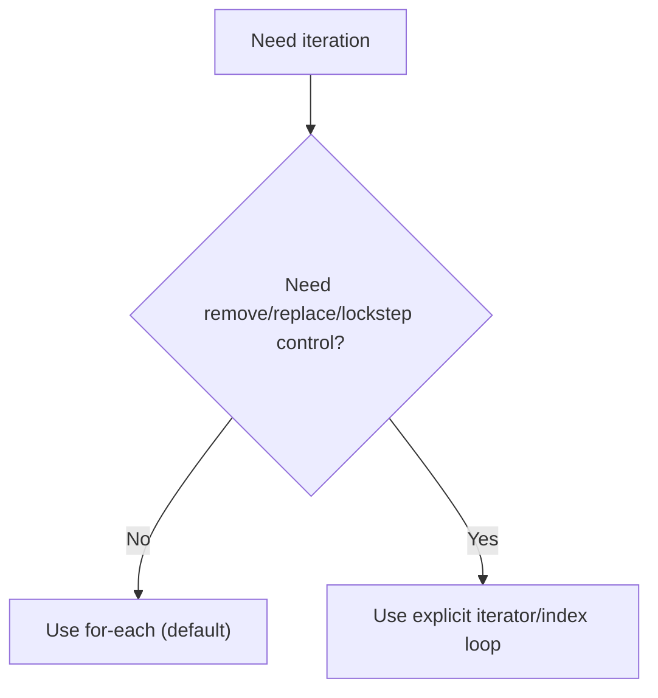

# :material-book-open-page-variant: Book Reading: Collections Framework

> **Book:** Effective Java by Joshua Bloch  
> **Focused Items:** 52, 54, 55, 58  
> **Status:** :material-check-circle: Complete (for selected items)

---

## :material-target: Reading Goals

- [x] Internalize overload-resolution pitfalls in collection APIs (Item 52)
- [x] Use empty containers as API defaults instead of `null` (Item 54)
- [x] Decide when `Optional` is appropriate and when it is harmful (Item 55)
- [x] Default to for-each iteration and know the three exceptions (Item 58)
- [x] Map each item to already-covered roadmap notes and identify coverage gaps

---

## :material-book-open-variant: Effective Java: Core Collection-Relevant Items

### Item 52: Use Overloading Judiciously

#### Core Message

Overloading feels elegant but can silently produce surprising behavior.  
The root cause: **overload selection is compile-time**, while overriding is runtime.

#### Why this is dangerous

When multiple overloads are “close” in applicability, callers may trigger a different overload than intended, especially with generics, autoboxing, and method references.

#### Collection-focused classic pitfall

```java
List<Integer> list = new ArrayList<>(List.of(-3, -2, -1, 0, 1, 2));

for (int i = 0; i < 3; i++) {
    list.remove(i); // removes by index, not by value
}
```

This does **not** remove values `0,1,2`; it removes elements at positions `0,1,2` as the list keeps shrinking.

Correct value-removal intent:

```java
list.remove((Integer) i);              // or Integer.valueOf(i)
```

#### Practical rules from Item 52

1. Avoid exporting overloads with the same number of parameters unless selection is always obvious.
2. Prefer distinct names when operations are semantically different.
3. Be extra cautious when overloading intersects with autoboxing/generics.
4. Avoid overload sets that differ only by functional interface target type.
5. If compatibility forces overloads, make behavior identical when argument meaning overlaps.

#### Why this item matters for collections mastery

Collections code is often dense and generic-heavy. Ambiguous overloads increase the chance of bugs that compile cleanly but behave incorrectly.

---

### Item 54: Return Empty Collections or Arrays, Not Nulls

#### Core Message

If a method returns a collection/array and has “no data,” return an empty container, not `null`.

#### Why this is better API design

- Removes repetitive null checks in every client.
- Prevents delayed `NullPointerException` chains.
- Keeps absence semantics inside the return type contract.
- Improves readability and reliability at call sites.

#### Typical anti-pattern and correction

```java
// Bad
public List<Cheese> getCheeses() {
    return cheesesInStock.isEmpty() ? null : new ArrayList<>(cheesesInStock);
}

// Good
public List<Cheese> getCheeses() {
    return cheesesInStock.isEmpty()
            ? Collections.emptyList()
            : new ArrayList<>(cheesesInStock);
}
```

#### Performance clarification from the item

The “null is faster” argument is weak:

1. You should not optimize this prematurely.
2. Shared immutable empties already exist (`emptyList`, `emptySet`, `emptyMap`).

For arrays:

```java
return cheesesInStock.toArray(new Cheese[0]); // preferred
```

Avoid preallocating by exact size as a supposed optimization in this pattern.

---

### Item 55: Return Optionals Judiciously

#### Core Message

`Optional<T>` is excellent for methods that may return one value or no value.  
It is not a universal wrapper for all “nullable-ish” design choices.

#### When `Optional<T>` is a strong fit

Use it when:

1. Method conceptually returns exactly one result.
2. Absence is expected and non-exceptional.
3. Caller should explicitly handle absence.

#### High-value usage patterns

```java
max(words).orElse("No words...");
max(toys).orElseThrow(MyDomainException::new);
max(values).orElseGet(this::expensiveDefaultComputation);
```

#### Critical restrictions from the item

1. Never return `null` from an Optional-returning method.
2. Do not wrap container types in Optional (`Optional<List<T>>`, `Optional<Map<K,V>>`, etc.).
3. Avoid optionals as map values, collection elements, or array elements.
4. Prefer primitive optional variants over boxed primitive optionals:
   - `OptionalInt`
   - `OptionalLong`
   - `OptionalDouble`

#### Subtle design note

Optionals are mainly a **return-type communication tool**.  
Using them as general-purpose fields or nested wrappers often introduces complexity instead of clarity.

#### Streams alignment

For `Stream<Optional<T>>`:

- Java 8 style: `filter(Optional::isPresent).map(Optional::get)`
- Java 9+ style: `flatMap(Optional::stream)`

---

### Item 58: Prefer For-Each Loops to Traditional For Loops

#### Core Message

Use for-each as the default iteration idiom for collections and arrays.

#### Why this item is high impact

- Removes iterator/index clutter.
- Reduces accidental misuse of control variables.
- Prevents common nested-iteration bugs.
- No inherent performance penalty versus equivalent hand-written loops.

#### Preferred form

```java
for (Element e : elements) {
    // process e
}
```

#### Three legitimate exceptions

1. **Destructive filtering** (remove while traversing)
   - Prefer `removeIf` where applicable.
2. **Transforming/replacing in place**
   - Need index or `ListIterator`.
3. **Parallel lockstep iteration**
   - Need explicit control over multiple iterators/indexes.



#### Extra value from the item

If you build your own aggregate type, implementing `Iterable` gives users for-each ergonomics and reduces friction in API adoption.

---

### Matched Insights (What this means for our roadmap)

1. **Item 52 is already operationalized** through the `remove` overload pitfall treatment.
2. **Item 54 is policy-level aligned** in Topic 6 summary, but can be echoed in future API design sections.
3. **Item 55 is the main opportunity area** to make Optional rules explicit in upcoming Streams write-up.
4. **Item 58 is maturely integrated** across fundamentals and functional programming notes.

---

## :material-thought-bubble: Reflections & Connections

### How these four items work together

1. **52 + 58** reduce algorithmic/iteration mistakes by making method and loop intent explicit.
2. **54 + 55** reduce absence-handling mistakes by enforcing explicit return contracts.
3. Combined, they form a practical API design compass:
   - predictable call behavior
   - explicit absence model
   - cleaner clients
   - lower bug surface

### New Perspectives Gained

1. “Compiles” is not enough; dispatch semantics can still be wrong.
2. Null-avoidance is not just safety—it’s API ergonomics.
3. Optional adds clarity only when used narrowly and deliberately.
4. Iteration style is a correctness decision, not just a style preference.

---

## :material-format-list-checks: Summary Points

1. Prefer explicit, non-ambiguous APIs over overloaded cleverness.
2. Never return `null` for collection/array absence—return empties.
3. Use `Optional<T>` for maybe-one return values, not wrapped containers.
4. Use for-each by default; switch only for remove/replace/lockstep cases.
5. Our roadmap already aligns strongly with Items 52, 54, and 58; Item 55 needs deeper integration in Topic 7.

---

## :material-pin: Bookmarks & Page References

| Topic                           | Reference                            | Note                                                    |
| ------------------------------- | ------------------------------------ | ------------------------------------------------------- |
| Overload resolution behavior    | Effective Java Item 52 (pp. 238–244) | Compile-time overload choice can violate user intuition |
| `List.remove` ambiguity         | Effective Java Item 52               | Autoboxing/generics intensify overload confusion        |
| Empty returns contract          | Effective Java Item 54 (pp. 247–249) | Empty containers over null improve API safety           |
| Optional design boundaries      | Effective Java Item 55 (pp. 249–254) | Return-type tool; avoid wrapping containers             |
| Iteration defaults & exceptions | Effective Java Item 58 (pp. 264–267) | For-each default with 3 explicit exceptions             |

---

## :material-bookshelf: References

- **Book:** Effective Java (3rd Edition) — Joshua Bloch
- **Items covered:** 52, 54, 55, 58
- **Cross-checked against:** existing Phase 1 roadmap notes (Topics 1, 3, 5, 6, 7)

---

_Last Updated: 2026-04-16_
