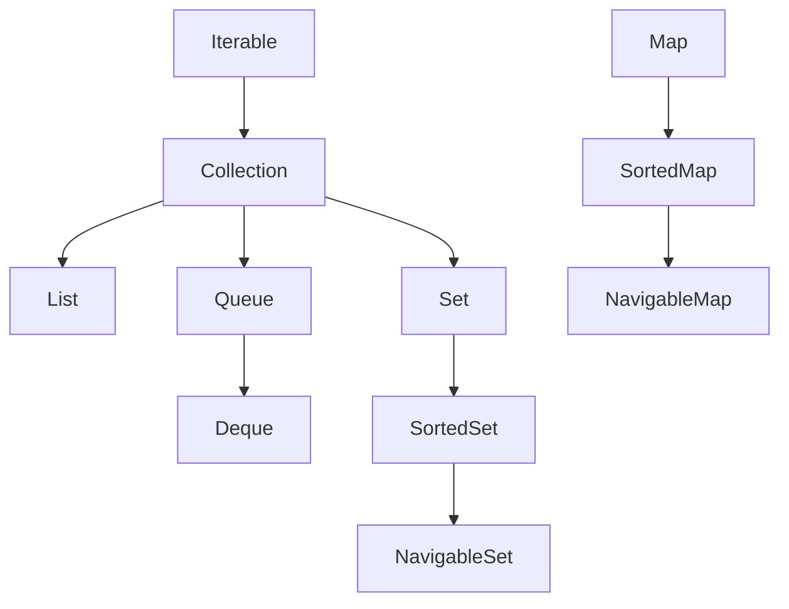
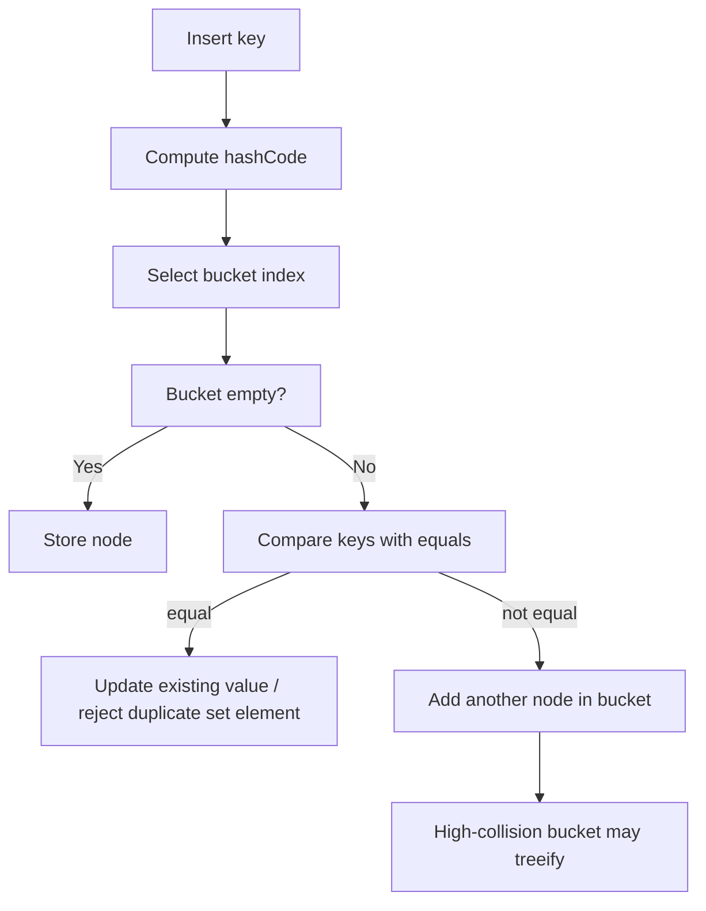
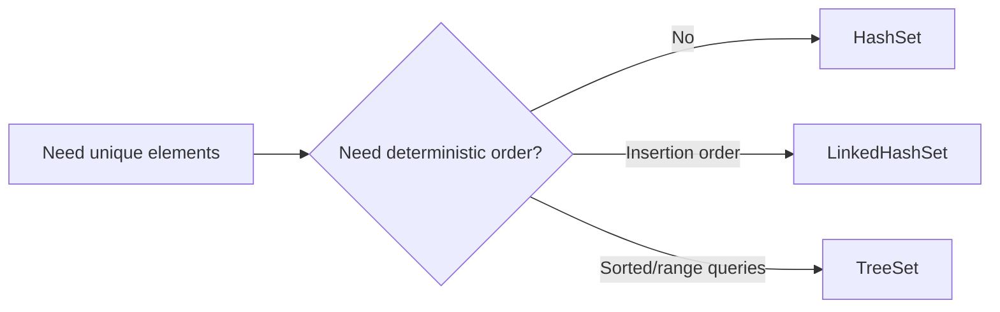
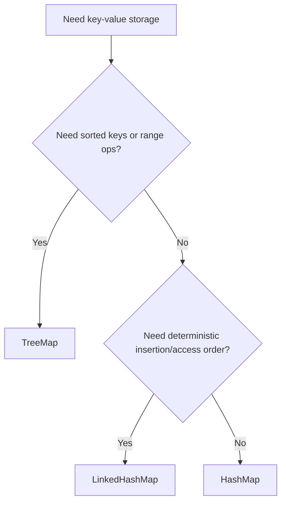
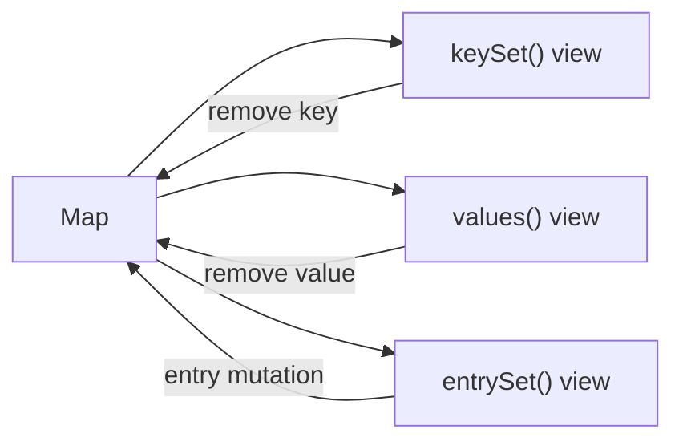
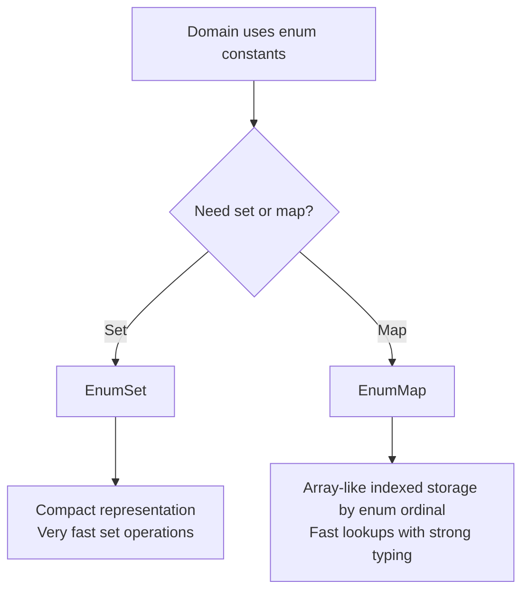
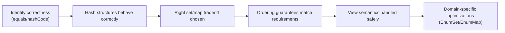

# :material-school: Summary: Collections Framework

> **Combined Knowledge from:** Tim Buchalka's Course + Effective Java + Core Java  
> **Mastery Level:** :material-star::material-star::material-star::material-star::material-star:

---

## :material-star-shooting: Topic Overview

The Java Collections Framework is not just a list of container classes. It is a design system for:

1. modeling data shape (sequence, uniqueness, key-value, priority)
2. choosing behavior contracts (ordering, mutability, concurrency)
3. optimizing for access patterns (lookup-heavy, iteration-heavy, range-heavy)

The real skill is **selection and tradeoff decisions**, not memorizing class names.

---

## :material-key: Core Interfaces and Hierarchy



### Mental model

- **List**: ordered sequence, duplicates allowed.
- **Set**: uniqueness enforced.
- **Queue/Deque**: processing order semantics.
- **Map**: key-value lookup and indexing.

---

## :material-format-list-bulleted: Implementation Families (Quick Selection)

### Lists

| Implementation | Best for | Main tradeoff |
|---|---|---|
| `ArrayList` | random access + append-heavy workloads | costly middle insert/remove |
| `LinkedList` | frequent endpoint modifications | poor random access/cache locality |

### Sets

| Implementation | Ordering | Typical complexity | Best for |
|---|---|---|---|
| `HashSet` | none | O(1) avg | fast membership |
| `LinkedHashSet` | insertion order | O(1) avg | deterministic iteration |
| `TreeSet` | sorted | O(log n) | range/nearest queries |

### Maps

| Implementation | Ordering | Typical complexity | Best for |
|---|---|---|---|
| `HashMap` | none | O(1) avg | general purpose key lookup |
| `LinkedHashMap` | insertion/access order | O(1) avg | ordered iteration, LRU-style behavior |
| `TreeMap` | key-sorted | O(log n) | sorted reports and range navigation |

---

## :material-head-cog: Key Internals to Understand

### 1) Hashing Identity and Collision Behavior

Hash-based collections (`HashSet`, `HashMap`) depend on **identity contracts**:

1. `equals` defines logical equality.
2. `hashCode` places candidates into buckets.
3. collisions are resolved inside the selected bucket.



#### Practical example

```java
record UserKey(String email) {}
```

If two `UserKey` objects have the same email, they must be equal and hash-consistent, otherwise map/set behavior becomes unstable.

#### Why collisions matter

- Average O(1) only holds with good hash distribution.
- High collisions degrade toward linear bucket scans.
- Modern JDKs treeify long buckets to recover better worst-case behavior.

#### Design takeaway

When keys are custom objects, correctness starts at `equals/hashCode`, not at map API calls.

---

### 2) Tradeoffs Between `HashSet`, `LinkedHashSet`, and `TreeSet`



#### Connected decision logic

- Choose **HashSet** when membership speed dominates.
- Choose **LinkedHashSet** when stable output order matters (logs, UI, deterministic tests).
- Choose **TreeSet** when you need sorted iteration plus nearest/range methods.

#### Example scenarios

1. Deduplicating large IDs quickly -> `HashSet`
2. Preserve arrival order of unique events -> `LinkedHashSet`
3. Keep unique timestamps and query next/previous candidate -> `TreeSet`

#### Hidden cost awareness

- `TreeSet` adds O(log n) updates for ordering guarantees.
- `LinkedHashSet` stores linking metadata for order maintenance.

---

### 3) Tradeoffs Between `HashMap`, `LinkedHashMap`, and `TreeMap`



#### Practical comparison

| Concern | `HashMap` | `LinkedHashMap` | `TreeMap` |
|---|---|---|---|
| fastest average lookup | :material-check: | :material-check: | :material-close: |
| stable insertion order | :material-close: | :material-check: | :material-close: |
| access-order mode (LRU basis) | :material-close: | :material-check: | :material-close: |
| sorted keys / range queries | :material-close: | :material-close: | :material-check: |

#### Example-driven guidance

- API response cache with eviction policy hooks -> `LinkedHashMap` (access order).
- High-throughput lookup index -> `HashMap`.
- Price map where you query ceiling/floor keys -> `TreeMap`.

---

### 4) Map View Backing Behavior and Mutation Side Effects

Map views are **live backed views**, not detached snapshots.

| View | Meaning | Backed by map |
|---|---|---|
| `keySet()` | all keys as a set | Yes |
| `values()` | all values as a collection | Yes |
| `entrySet()` | key-value nodes | Yes |



#### Side-effect example

```java
Map<String, Integer> stock = new HashMap<>();
stock.put("apple", 10);
stock.put("banana", 8);

Set<String> keys = stock.keySet();
keys.remove("apple");  // also removes entry from stock
```

If you need isolation:

```java
Set<String> keySnapshot = new HashSet<>(stock.keySet());
```

#### Key takeaway

Know whether you need:

1. **live view** (coupled behavior), or
2. **snapshot copy** (independent behavior).

Many subtle bugs come from mixing these two mental models.

---

### 5) Enum-Specialized Structures and Where They Outperform General Collections

When domain keys/values are enums, prefer:

- `EnumSet` over general `Set`
- `EnumMap` over general `Map`



#### Why they often win

1. Better memory efficiency for enum domains.
2. Fast operations with predictable behavior.
3. Cleaner domain semantics than generic hash structures.

#### Example scenarios

- Workdays per employee -> `EnumSet<Weekday>`
- Shift assignment by day -> `EnumMap<Weekday, Shift>`

Use general hash/tree structures only when key space is not enum-bounded.

---

## :material-connection: How These Internals Connect as One System



Collections mastery is cumulative:

1. correct identity
2. correct structure choice
3. correct ordering assumptions
4. correct mutation semantics
5. correct domain specialization

Missing any layer creates expensive downstream bugs.

---

## :material-lightbulb-on: Choosing the Right Collection (Decision Matrix)

| You need... | Prefer |
|---|---|
| fastest average key lookup | `HashMap` |
| key lookup + deterministic iteration order | `LinkedHashMap` |
| sorted keys + nearest/range operations | `TreeMap` |
| unique values, no order requirement | `HashSet` |
| unique values + insertion order | `LinkedHashSet` |
| unique values + sorted/range operations | `TreeSet` |
| enum-domain set/map | `EnumSet` / `EnumMap` |

---

## :material-alert: Common Pitfalls

1. **Broken key identity**
   - Inconsistent `equals/hashCode` corrupts hash behavior.

2. **Wrong structure for ordering needs**
   - Expecting stable order from `HashSet`/`HashMap`.

3. **Unexpected map-view side effects**
   - Mutating `keySet`/`values` and forgetting it mutates the map.

4. **Overusing generic structures for enum domains**
   - Missing simpler and faster enum-specialized options.

5. **Returning null for collections**
   - Return empty containers to keep APIs safer and cleaner.

---

## :material-lightbulb-on: Best Practices Checklist

- [x] Choose structures based on access pattern, not habit
- [x] Model key identity first (`equals/hashCode`)
- [x] Treat ordering as an explicit requirement
- [x] Distinguish live views from snapshot copies
- [x] Prefer enum-specialized collections for enum-bounded domains
- [x] Return empty containers instead of `null`
- [x] Use interface types in declarations and concrete types in construction

---

## :material-link-variant: Related Topics

- [Arrays, Lists & Generics](../topic-3-arrays-lists-generics/summary.md)
- [Lambda Expressions & Method References](../topic-5-lambdas-method-references/summary.md)
- [Java Streams API](../topic-7-streams/index.md)

---

## :material-bookshelf: References

- **Course:** Tim Buchalka - Java Programming Masterclass
- **Book:** Effective Java - Joshua Bloch (Items 52, 54, 55, 58)
- **Book:** Core Java Volume I - Cay S. Horstmann (Collections chapter)
- **Documentation:** [Oracle Collections Framework](https://docs.oracle.com/javase/tutorial/collections/)

---

*Completed: 2026-04-16 | Confidence: 9/10*
