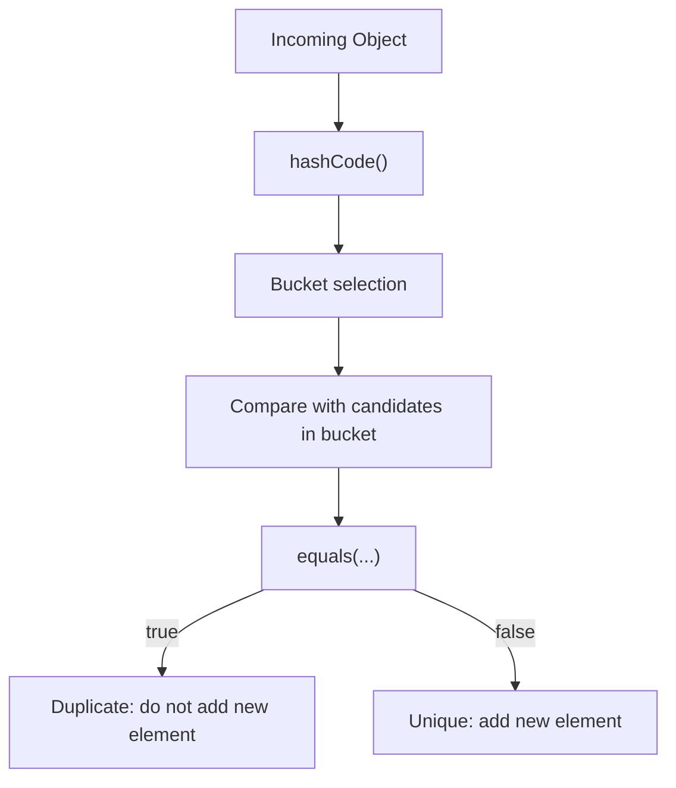
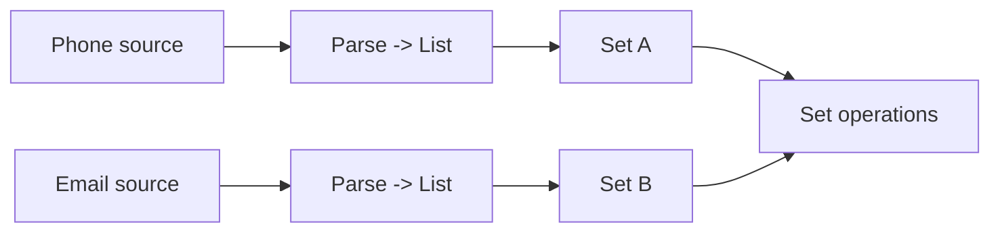

# :material-pencil: Topic Note: Hashing, Set Identity, and Set Algebra in Real Projects (Part 2 — Section 15, Lectures 9–14)

> **Course:** Java Programming Masterclass — Tim Buchalka (Udemy)  
> **Section:** 15 — Mastering Java Collections Framework, Lists, Sets, and Maps  
> **Status:** :material-check-circle: Complete

---

## :material-target: Learning Objectives

By the end of this part, you should be able to:

- [x] Explain how hash-based collections decide uniqueness.
- [x] Write and validate correct `equals`/`hashCode` contracts for domain entities.
- [x] Use `HashSet` for deduplication and membership queries with confidence.
- [x] Apply set algebra to practical analysis questions (overlap, missing, exclusive).
- [x] Build reusable set helper methods that scale from toy examples to business reporting.

---

## :material-head-cog: 1. Hashing Is About Identity, Not Order (Lecture 9)

When Java stores an object in a `HashSet`, it does **not** keep asking "what index?"  
It asks:

1. Which bucket does this object belong to? (`hashCode`)
2. Is there already an equal object in that bucket? (`equals`)



### Why the two-step process exists

- Hash buckets make lookup near O(1) average instead of O(n).
- `equals` protects correctness when collisions happen.
- Good hash quality reduces collisions but does not replace equality checks.

### Code-level observation from the module

`PlayingCard` uses both suit and face for equality.  
That means:

- `Ace of Hearts` equals another `Ace of Hearts`
- `Ace of Hearts` is different from `Ace of Clubs`

This is exactly the identity needed for card games and set deduplication.

---

## :material-head-cog: 2. Correct `equals`/`hashCode` Contracts

### Contract rules you must preserve

| Rule | Meaning |
|---|---|
| Reflexive | `x.equals(x)` is always true |
| Symmetric | if `x.equals(y)`, then `y.equals(x)` |
| Transitive | if `x.equals(y)` and `y.equals(z)`, then `x.equals(z)` |
| Consistent | repeated checks return same result if state unchanged |
| Null-safe | `x.equals(null)` is always false |
| Hash consistency | if `x.equals(y)`, then `x.hashCode() == y.hashCode()` |

### Most dangerous bug pattern

Using mutable fields in equality/hash when object is already in a hash collection.

If a key field changes after insertion:

- object may become "lost" in the wrong bucket
- `contains` and `remove` may fail unexpectedly

For this reason, the module models identity around stable fields.

---

## :material-head-cog: 3. Data Setup Pattern Before Set Algebra (Lecture 10)

The contact example is intentionally realistic:

- same person appears in different sources
- each source has partial data
- final result should merge, not duplicate people

### Pipeline used in the code

1. parse source text blocks (`ContactData`)
2. build typed contact objects
3. convert lists to sets
4. run set algebra on normalized identity



### Smart modeling decisions in `Contact`

- `name` defines person identity.
- `emails` and `phones` are themselves sets (intra-contact dedupe).
- `mergeContactData` supports progressive enrichment.

This is exactly how to model "same entity, multiple sources".

---

## :material-head-cog: 4. `HashSet` Behavior and Tradeoffs (Lecture 11)

`HashSet` gives uniqueness and speed, but not sorted order.

| Concern | `HashSet` behavior |
|---|---|
| Duplicate insertion | ignored (based on equality) |
| Iteration order | unspecified |
| Memory | hash table overhead |
| Best use | fast membership and dedupe |

### Practical implication

If output order matters for UX/reporting:

- use `LinkedHashSet` (insertion order), or
- use `TreeSet` (sorted order)

Use `HashSet` when correctness is based on identity and performance matters most.

---

## :material-head-cog: 5. Set Algebra as a Query Language (Lecture 12)

Set operations are not just math exercises; they are compact business queries.

### Operations used in code

| Query in plain language | Set operation |
|---|---|
| "All contacts from both sources" | Union (`A ∪ B`) |
| "Contacts present in both sources" | Intersection (`A ∩ B`) |
| "Email-only contacts" | Difference (`A - B`) |
| "Exactly one source only" | Symmetric Difference (`A △ B`) |

### Why this is powerful

- expressions are short and precise
- operations compose cleanly
- intent is visible directly in code

Example pattern from module:

```java
Set<Contact> unionAB = new HashSet<>(emailContacts);
unionAB.addAll(phoneContacts);
```

This reads exactly like the requirement.

---

## :material-head-cog: 6. Task Model Setup for Challenge (Lecture 13)

The challenge shifts from contacts to project tasks.

`Task` has:

- project
- description
- assignee
- priority
- status

### Why equality is `(project, description)` only

Identity question: "Is this the same task definition?"  
Not: "Is this currently assigned to same person?"

So assignment/status are **state**, not identity.

That design enables:

- comparing assignment sets safely
- detecting duplicate task definitions
- changing assignee/status without breaking set identity

### Comparable role in `Task`

Natural ordering (`compareTo`) gives deterministic reporting:

1. project name
2. description

This keeps output stable and understandable.

---

## :material-head-cog: 7. Challenge Solution Strategy (Lecture 14)

The module solution decomposes the problem into reusable primitives:

- union helper
- intersection helper
- difference helper

Then composes them to answer many questions.

### Derived insights produced by the code

1. all assigned tasks
2. full known task universe
3. missing from baseline
4. currently unassigned
5. overlapping assignments across users

### Why this architecture is intelligent

- helpers are generic and reusable
- each derived query is a one-liner composition
- low cognitive load for future maintenance

---

## :material-lightbulb-on: Deep Takeaways from Part 2

1. **Model identity first, then choose collection type.**  
   Most collection bugs are identity bugs, not algorithm bugs.

2. **Set algebra is a requirement language.**  
   "in both", "missing from", "only in one" map directly to code operators.

3. **Separate ingestion from reasoning.**  
   Parsing classes should feed clean data structures; analytics should consume them.

4. **Prefer helpers for operations you repeat.**  
   `getUnion/getIntersect/getDifference` is a pattern worth reusing in future modules.

---

## :material-alert: Common Pitfalls

### 1) `equals` and `hashCode` mismatch

If two objects are equal but hash to different values, hash collections become inconsistent.

### 2) Mutable hash identity

Changing identity fields after insertion can make an element effectively unreachable.

### 3) Wrong operation direction

`A - B` and `B - A` answer different questions.

### 4) Assuming deterministic `HashSet` iteration

Use `LinkedHashSet`/`TreeSet` when order is part of the requirement.

---

## :material-card-bulleted: Quick Reference

| Need | Best fit |
|---|---|
| fast dedupe | `HashSet` |
| overlap analysis | intersection |
| missing analysis | difference |
| combine all distinct values | union |
| exactly-one-source values | symmetric difference |

---

## :material-navigation: Related Notes

| Part | Topic | Link |
|:--:|---|---|
| 1 | Collections Fundamentals & Utility Methods (Lectures 1–8) | [Part 1 — Fundamentals](topic-note.md) |
| 2 | Hashing, Set Identity, and Set Algebra (Lectures 9–14) | **You are here** |
| 3 | Ordered Sets & TreeSet Challenge (Lectures 15–18) | [Part 3 — Ordered Sets](topic-note-part3.md) |
| 4 | Map Interface, View Collections & HashMap Challenge (Lectures 19–23) | [Part 4 — Maps](topic-note-part4.md) |
| 5 | Ordered Maps, Enum Collections & Final Challenge (Lectures 24–29) | [Part 5 — Ordered Maps & Final Challenge](topic-note-part5.md) |

---

## :material-bookshelf: References

- **Course:** Tim Buchalka — Java Programming Masterclass (Section 15, Lectures 9–14)
- **API:** [Set (Java 17)](https://docs.oracle.com/en/java/javase/17/docs/api/java.base/java/util/Set.html)
- **API:** [HashSet (Java 17)](https://docs.oracle.com/en/java/javase/17/docs/api/java.base/java/util/HashSet.html)
- **API:** [Map (Java 17)](https://docs.oracle.com/en/java/javase/17/docs/api/java.base/java/util/Map.html)
- **Guide:** [Object `equals` and `hashCode` contract](https://docs.oracle.com/en/java/javase/17/docs/api/java.base/java/lang/Object.html)


---

*Last Updated: 2026-04-16 | Confidence: 9/10*
