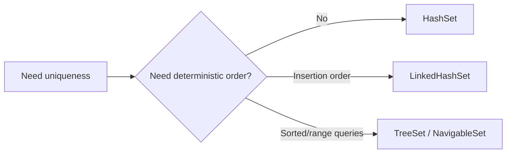
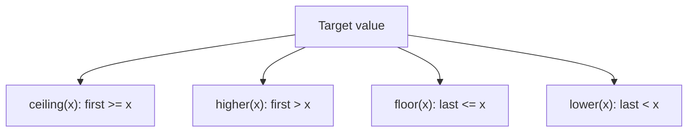
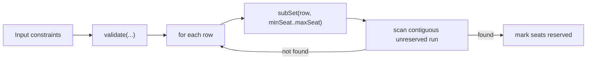

# :material-pencil: Topic Note: Ordered Sets, NavigableSet, and TreeSet Challenge Design (Part 3 — Section 15, Lectures 15–18)

> **Course:** Java Programming Masterclass — Tim Buchalka (Udemy)  
> **Section:** 15 — Mastering Java Collections Framework, Lists, Sets, and Maps  
> **Status:** :material-check-circle: Complete

---

## :material-target: Learning Objectives

By the end of this part, you should be able to:

- [x] Compare `HashSet`, `LinkedHashSet`, and `TreeSet` with clear selection criteria.
- [x] Use `NavigableSet` APIs for nearest-match and range queries.
- [x] Understand live views (`descendingSet`, `headSet`, `tailSet`, `subSet`) and mutation behavior.
- [x] Implement practical seat-reservation logic using `TreeSet` and ordered lookup.
- [x] Build contiguous-seat search with subranges and validation constraints.

---

## :material-head-cog: 1. Why Ordered Sets Exist (Lecture 15)

`HashSet` gives fast uniqueness but no order guarantee.  
Two common order requirements lead to two specific implementations:

| Requirement              | Best choice     |
| ------------------------ | --------------- |
| preserve insertion order | `LinkedHashSet` |
| keep sorted order        | `TreeSet`       |

### Mental model

- `LinkedHashSet`: hash table + linked order chain
- `TreeSet`: balanced search tree (sorted by natural order/comparator)

### Code anchor

The demo implementation constructs ordered `Contact` sets with comparator-based sorting by name.

---

## :material-head-cog: 2. `TreeSet` and `NavigableSet` APIs (Lecture 16)

`NavigableSet` extends sorted-set behavior with navigation and range intelligence.

### Key methods and purpose

| Method                         | Purpose                  |
| ------------------------------ | ------------------------ |
| `first`, `last`                | boundary elements        |
| `pollFirst`, `pollLast`        | remove+return boundaries |
| `ceiling(x)`                   | smallest element `>= x`  |
| `higher(x)`                    | smallest element `> x`   |
| `floor(x)`                     | largest element `<= x`   |
| `lower(x)`                     | largest element `< x`    |
| `headSet`, `tailSet`, `subSet` | bounded range views      |
| `descendingSet`                | reverse-order live view  |

### Important implementation detail

Most of these are **views**, not detached copies.  
Mutating a view mutates the backing set.

The module explicitly demonstrates this through:

- `descendingSet.pollLast()` impacting original `fullSet`
- view-based subsets and boundary iterations

---

## :material-head-cog: 3. Closest-Match Semantics (Lecture 16)

The nearest-match methods are perfect for recommendation/assignment style logic.

### Real usage pattern in module

Contacts not present in the set are probed using synthetic instances (e.g., "Daisy Duck"), then nearest available matches are fetched.

That same strategy generalizes to:

- nearest timeslot
- nearest inventory key
- nearest lexicographic candidate

---

## :material-head-cog: 4. TreeSet Challenge Requirements (Lecture 17)

Challenge objective: implement a theatre seat booking system with ordered search.

### Domain model highlights

- `Theatre` owns `NavigableSet<Seat>`
- nested static `Seat` implements `Comparable<Seat>`
- seat identity format: `A005`, `B010`, etc.

This design is strong because:

- seat order is intrinsic and deterministic
- sorted traversal/range queries are natural
- nearest-match methods become directly useful

---

## :material-head-cog: 5. Seat Reservation Solution Walkthrough (Lecture 18)

The provided solution solves two workflows:

1. reserve one specific seat
2. reserve contiguous block of seats under row/seat constraints

### Single-seat reservation strategy

1. Construct requested seat token.
2. Use `floor(requested)` to find nearest candidate.
3. Validate exact match (`seatNum` equality).
4. Check reservation flag and update.

This avoids manual linear scans.

### Contiguous block strategy

1. Validate range bounds (`validate(...)`).
2. Iterate row by row.
3. Build row-limited subset via `subSet`.
4. Track continuous run of non-reserved seats.
5. On success, reserve selected subset and return copy.

### Why this is robust

- constraints are checked before heavy work
- sorted structure removes index bookkeeping complexity
- subset ranges reduce search scope dramatically

---

## :material-lightbulb-on: Design Insights from Part 3

1. **Use `TreeSet` when ordering and lookup are both requirements.**
2. **Use live views intentionally** (and carefully) for memory-efficient range operations.
3. **Represent domain IDs as sortable tokens** (`A005`) to align data model with collection behavior.
4. **Push validation to explicit helper methods** to keep booking logic readable.

---

## :material-alert: Common Pitfalls

### 1) Forgetting comparator consistency

If comparator says two distinct objects are equal (`compare(...) == 0`), one may be dropped in `TreeSet`.

### 2) Assuming subset views are copies

`subSet/headSet/tailSet/descendingSet` are usually backed views.

### 3) Weak seat token format

Without zero-padding (`A5` vs `A005`), lexical sort breaks numeric seat ordering.

### 4) Linear search inside ordered structures

Using loops for exact/nearest lookup misses `NavigableSet` strengths.

---

## :material-card-bulleted: Quick Reference

| Need                       | Method/Type                |
| -------------------------- | -------------------------- |
| insertion-ordered set      | `LinkedHashSet`            |
| sorted set + range queries | `TreeSet` / `NavigableSet` |
| nearest greater/equal      | `ceiling`                  |
| nearest lower/equal        | `floor`                    |
| bounded row block          | `subSet`                   |

---

## :material-navigation: Related Notes

| Part | Topic                                                                | Link                                                           |
| :--: | -------------------------------------------------------------------- | -------------------------------------------------------------- |
|  1   | Collections Fundamentals & Utility Methods (Lectures 1–8)            | [Part 1 — Fundamentals](topic-note.md)                         |
|  2   | Hashing, Set Identity, and Set Algebra (Lectures 9–14)               | [Part 2 — Hashing & Sets](topic-note-part2.md)                 |
|  3   | Ordered Sets, NavigableSet, and TreeSet Challenge (Lectures 15–18)   | **You are here**                                               |
|  4   | Map Interface, View Collections & HashMap Challenge (Lectures 19–23) | [Part 4 — Maps](topic-note-part4.md)                           |
|  5   | Ordered Maps, Enum Collections & Final Challenge (Lectures 24–29)    | [Part 5 — Ordered Maps & Final Challenge](topic-note-part5.md) |

---

## :material-bookshelf: References

- **Course:** Tim Buchalka — Java Programming Masterclass (Section 15, Lectures 15–18)
- **API:** [TreeSet (Java 17)](https://docs.oracle.com/en/java/javase/17/docs/api/java.base/java/util/TreeSet.html)
- **API:** [NavigableSet (Java 17)](https://docs.oracle.com/en/java/javase/17/docs/api/java.base/java/util/NavigableSet.html)
- **API:** [SortedSet (Java 17)](https://docs.oracle.com/en/java/javase/17/docs/api/java.base/java/util/SortedSet.html)

---

_Last Updated: 2026-04-16 | Confidence: 9/10_
