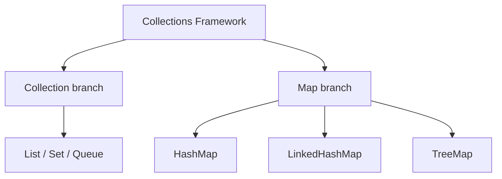
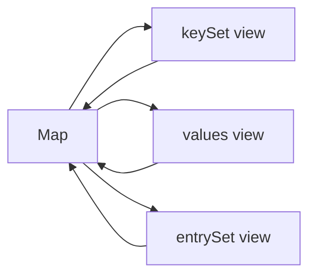
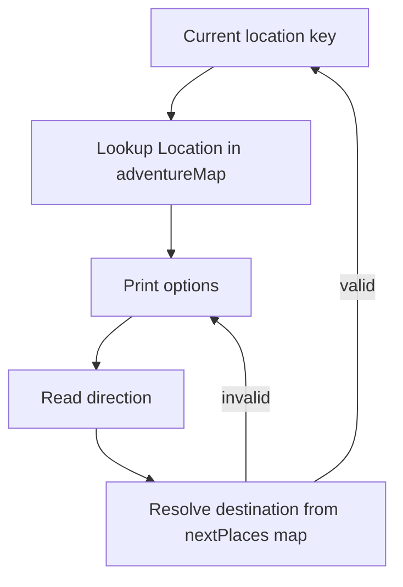

# :material-pencil: Topic Note: Map Interface, Advanced Map APIs, and HashMap Challenge (Part 4 — Section 15, Lectures 19–23)

> **Course:** Java Programming Masterclass — Tim Buchalka (Udemy)  
> **Section:** 15 — Mastering Java Collections Framework, Lists, Sets, and Maps  
> **Status:** :material-check-circle: Complete

---

## :material-target: Learning Objectives

By the end of this part, you should be able to:

- [x] Explain why `Map` is in the framework but outside the `Collection` hierarchy.
- [x] Use core and modern `Map` APIs (`putIfAbsent`, `merge`, `compute*`, conditional `replace/remove`).
- [x] Reason about map view collections (`keySet`, `values`, `entrySet`) and backing behavior.
- [x] Build and extend a text adventure engine driven by nested maps.
- [x] Choose map operations based on correctness and intent, not habit.

---

## :material-head-cog: 1. Map Interface in the Collections Framework (Lecture 19)

`Map<K, V>` models associations, not standalone elements.

That is why:

- it belongs to the framework ecosystem
- but does not implement `Collection<E>`



### Core map guarantees

| Concern          | Map behavior             |
| ---------------- | ------------------------ |
| key uniqueness   | required                 |
| value uniqueness | not required             |
| null support     | implementation dependent |
| ordering         | implementation dependent |

### Module anchoring

The map demo starts by joining contact lists, then indexing by contact name.

---

## :material-head-cog: 2. Choosing the Right Write Operation (Lectures 19–20)

Many map bugs come from using `put` for everything.  
Part 4 highlights intent-driven operations.

### Operation semantics

| API                     | When to use                                |
| ----------------------- | ------------------------------------------ |
| `put(k,v)`              | unconditional overwrite                    |
| `putIfAbsent(k,v)`      | keep existing value if key already present |
| `merge(k,v,f)`          | combine old/new values with merge function |
| `computeIfAbsent(k,f)`  | lazily create only when missing            |
| `computeIfPresent(k,f)` | update only when existing                  |
| `compute(k,f)`          | full control for present/absent cases      |
| `replace(k,v)`          | replace if key exists                      |
| `replace(k,old,new)`    | replace only when current value matches    |
| `remove(k,v)`           | remove only when key and value both match  |

### Why `merge` is a highlight in this module

In contact merging, duplicate keys represent partial data from multiple sources.  
`merge` captures this exactly:

```java
contacts.merge(contact.getName(), contact, Contact::mergeContactData);
```

That one line is cleaner and safer than manual contains-get-put sequences.

---

## :material-head-cog: 3. Conditional Updates and Defensive Mutation (Lecture 20)

Two powerful patterns in the map demo:

1. `computeIfAbsent` for default object creation (duck contacts)
2. `computeIfPresent` for targeted enrichment (adding generated emails)

These APIs reduce race-prone and branch-heavy boilerplate:

- no double lookups
- no manual null checks scattered across code
- clear intent per branch

### Conditional replace/remove

`replace(key, oldValue, newValue)` and `remove(key, value)` protect against stale writes by verifying expected state before mutation.

---

## :material-head-cog: 4. Map View Collections (Lecture 21)

Map view collections are **backed views**, not detached snapshots.

| View         | Type                  | Backed by map? |
| ------------ | --------------------- | -------------- |
| `keySet()`   | `Set<K>`              | Yes            |
| `values()`   | `Collection<V>`       | Yes            |
| `entrySet()` | `Set<Map.Entry<K,V>>` | Yes            |



### Practical consequences shown in module

- Removing from `keySet` removes map entries.
- Filtering `values` changes map content.
- Copying to `TreeSet`/`ArrayList` creates detached structures (safe snapshots).

This distinction is critical for both correctness and performance.

---

## :material-head-cog: 5. HashMap Challenge Architecture (Lecture 22)

Challenge objective: text adventure navigation with map-backed world state.

The adventure challenge implementation uses:

- `Map<String, Location> adventureMap`
- nested enum `Compass`
- nested record `Location(description, nextPlaces)`
- parsed text-block world definition

### Design quality notes

1. Data is declarative: map layout is encoded in text, not hard-coded branching.
2. Navigation is key-driven (`N/E/S/W`) through nested map lookups.
3. World extension is easy: pass custom location block to constructor.

---

## :material-head-cog: 6. Challenge Completion and Extension (Lecture 23)

Completion focuses on:

- robust parsing (`split`, trim, direction map loading)
- movement validation (`containsKey`, direction existence)
- replay-friendly input loop in the runner class



### Strong engineering pattern here

The navigation engine is data-driven.  
Changing the world means changing data, not control flow.

---

## :material-lightbulb-on: Design Insights from Part 4

1. **Operation choice communicates intent.**  
   `merge` and `compute*` are not just convenience methods; they make invariants explicit.

2. **Views are powerful but dangerous if misunderstood.**  
   Always decide: do I need a live backed view or an isolated copy?

3. **Nested maps are excellent for graph-like navigation domains.**

4. **Conditional mutations (`replace/remove` with expected value) support safer state transitions.**

---

## :material-alert: Common Pitfalls

### 1) Using `put` where `merge` is needed

This can silently discard old value state.

### 2) Forgetting views are live

Mutating `keySet`/`values` can unexpectedly mutate the map.

### 3) Recomputing keys in custom formats

Inconsistent key naming breaks lookups and creates duplicate logical nodes.

### 4) Overusing `containsKey` + `get`

Prefer `compute`/`merge` patterns that handle state transitions atomically in one call.

---

## :material-card-bulleted: Quick Reference

| Need                             | Best API                 |
| -------------------------------- | ------------------------ |
| create only when absent          | `computeIfAbsent`        |
| update only when present         | `computeIfPresent`       |
| combine duplicate incoming value | `merge`                  |
| conditional replacement          | `replace(key, old, new)` |
| safe conditional removal         | `remove(key, value)`     |
| inspect live key view            | `keySet()`               |

---

## :material-navigation: Related Notes

| Part | Topic                                                                    | Link                                                           |
| :--: | ------------------------------------------------------------------------ | -------------------------------------------------------------- |
|  1   | Collections Fundamentals & Utility Methods (Lectures 1–8)                | [Part 1 — Fundamentals](topic-note.md)                         |
|  2   | Hashing, Set Identity, and Set Algebra (Lectures 9–14)                   | [Part 2 — Hashing & Sets](topic-note-part2.md)                 |
|  3   | Ordered Sets, NavigableSet, and TreeSet Challenge (Lectures 15–18)       | [Part 3 — Ordered Sets](topic-note-part3.md)                   |
|  4   | Map Interface, Advanced Map APIs, and HashMap Challenge (Lectures 19–23) | **You are here**                                               |
|  5   | Ordered Maps, Enum Collections & Final Challenge (Lectures 24–29)        | [Part 5 — Ordered Maps & Final Challenge](topic-note-part5.md) |

---

## :material-bookshelf: References

- **Course:** Tim Buchalka — Java Programming Masterclass (Section 15, Lectures 19–23)
- **API:** [Map (Java 17)](https://docs.oracle.com/en/java/javase/17/docs/api/java.base/java/util/Map.html)
- **API:** [HashMap (Java 17)](https://docs.oracle.com/en/java/javase/17/docs/api/java.base/java/util/HashMap.html)
- **API:** [Map.Entry (Java 17)](https://docs.oracle.com/en/java/javase/17/docs/api/java.base/java/util/Map.Entry.html)
- **Guide:** [Collections Framework Overview](https://docs.oracle.com/en/java/javase/17/docs/api/java.base/java/util/doc-files/coll-overview.html)

---

_Last Updated: 2026-04-16 | Confidence: 9/10_
