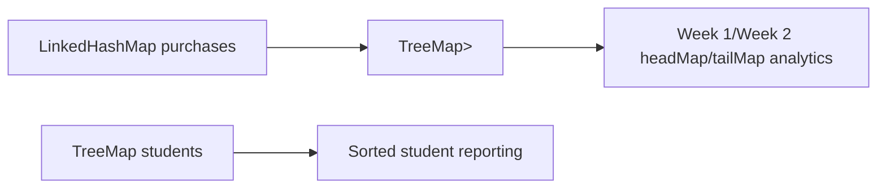
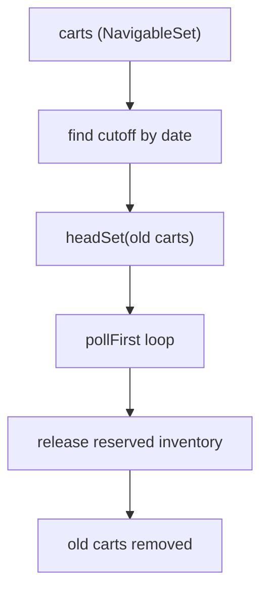

# :material-pencil: Topic Note: Ordered Maps, Enum Collections, and Final Store Challenge (Part 5 — Section 15, Lectures 24–29)

> **Course:** Java Programming Masterclass — Tim Buchalka (Udemy)  
> **Section:** 15 — Mastering Java Collections Framework, Lists, Sets, and Maps  
> **Status:** :material-check-circle: Complete

---

## :material-target: Learning Objectives

By the end of this part, you should be able to:

- [x] Select between `LinkedHashMap` and `TreeMap` based on ordering and query needs.
- [x] Use `NavigableMap` features for date/range analytics.
- [x] Explain why `EnumSet`/`EnumMap` outperform general-purpose hash structures for enums.
- [x] Design a multi-map inventory system with category indexing and cart workflows.
- [x] Connect map/set choices to correctness in checkout, reservation, and abandonment flows.

---

## :material-head-cog: 1. Ordered Map Families (Lecture 24)

`Map` has two major ordered implementations with different guarantees:

| Type            | Ordering model                         | Best use                                             |
| --------------- | -------------------------------------- | ---------------------------------------------------- |
| `LinkedHashMap` | insertion order (or access order mode) | chronological/event streams, deterministic iteration |
| `TreeMap`       | sorted by key (natural/comparator)     | range queries, nearest lookup, sorted reporting      |

### Decision rule

- Need "in order added"? -> `LinkedHashMap`
- Need "sorted and query by ranges"? -> `TreeMap` / `NavigableMap`

---

## :material-head-cog: 2. Purchase + Student Map Model (Lecture 25)

The sorted-maps demo shows a realistic dual-map design:

1. `LinkedHashMap<String, Purchase>`: preserve purchase insertion chronology
2. `TreeMap<String, Student>`: keep students sorted by name key
3. `TreeMap<LocalDate, List<Purchase>>`: date-indexed purchase analytics

### Why this composition is strong

- each map is optimized for its retrieval pattern
- no single map is overloaded with conflicting responsibilities
- secondary index (`LocalDate -> List<Purchase>`) enables period reports

### Navigable operations highlighted

- `headMap(week1)` for early period slice
- `tailMap(week1)` for later period slice
- reverse traversal via `descendingMap`
- key navigation via `lowerKey`, `higherKey`

This is a direct map-side analog to `NavigableSet` concepts from Part 3.

---

## :material-head-cog: 3. Enum-Optimized Collections (Lecture 26)

`EnumSet` and `EnumMap` are specialized for enum keys/values.

### Why they are special

- compact internal representation
- very fast operations
- type safety tied to enum class

### Patterns shown in the enum collections demo

| Task                          | API                            |
| ----------------------------- | ------------------------------ |
| build from existing enum list | `EnumSet.copyOf(...)`          |
| all constants                 | `EnumSet.allOf(...)`           |
| complement set                | `EnumSet.complementOf(...)`    |
| contiguous enum range         | `EnumSet.range(...)`           |
| enum-keyed map                | `new EnumMap<>(Weekday.class)` |

### Practical principle

If your keys are enum constants, use enum-native collections first; they are usually clearer and faster.

---

## :material-head-cog: 4. Final Challenge: Domain Model (Lecture 27)

The final challenge models a store with inventory and carts.

Key types:

- `Product` record (immutable identity info)
- `InventoryItem` class (price + quantity + reservation/sale logic)
- `Cart` class (sku -> quantity map + lifecycle date)
- `Store` orchestration (inventory, aisle index, active carts)

This is a rich testbed for collection design decisions.

---

## :material-head-cog: 5. Store Implementation Part 1 (Lecture 28)

From the store challenge implementation:

### Core structures

| Field            | Collection choice                           | Reason                                       |
| ---------------- | ------------------------------------------- | -------------------------------------------- |
| `inventory`      | `Map<String, InventoryItem>`                | direct lookup by SKU                         |
| `carts`          | `NavigableSet<Cart>`                        | ordered cart lifecycle by ID/date operations |
| `aisleInventory` | `Map<Category, Map<String, InventoryItem>>` | category -> product-name index               |

### Stocking and aisle indexing

- `inventory` is built first (SKU index).
- `stockAisles()` projects inventory into `EnumMap<Category, TreeMap<String, InventoryItem>>`.

This creates two complementary indexes:

1. SKU index for transactional operations
2. category/product-name index for browsing

---

## :material-head-cog: 6. Store Implementation Part 2 (Lecture 29)

Main lifecycle actions:

1. add/remove cart items (reserve/release quantities)
2. checkout (sell inventory, print slip, remove cart)
3. abandon stale carts (release reserved quantities)

### Why cart abandonment is collection-interesting

`abandonCarts()` uses ordered cart set and head subset logic to target old carts only:

- identify boundary cart by date
- `headSet(lastCart, true)` to get old carts view
- repeatedly `pollFirst()` to process and clear

This is exactly where ordered-set semantics become operationally useful.

### Quantity-control model in `InventoryItem`

- `reserveItem(qty)` checks available stock before reservation.
- `releaseItem(qty)` unreserves on cart changes/abandonment.
- `sellItem(qty)` finalizes sale and triggers reorder check.

This is a clear three-state quantity flow:

`available -> reserved -> sold` (or `reserved -> available` on rollback).

---

## :material-lightbulb-on: Design Insights from Part 5

1. **Use multiple indexes for different query patterns.**  
   One canonical map is often not enough for a real domain.

2. **Ordered maps/sets are analytics and lifecycle tools, not just formatting tools.**

3. **Enum-specific collections are ideal for categorical data models.**

4. **Model reservations explicitly** to avoid overselling and hidden race-like logic bugs.

5. **Prefer deterministic iteration for financial/reporting outputs.**

---

## :material-alert: Common Pitfalls

### 1) Picking `TreeMap` when insertion order is the actual requirement

This adds sort overhead without business value.

### 2) Using general hash collections for enum keys by habit

You lose the clarity and optimization of enum-native types.

### 3) Skipping reservation rollback paths

Without release logic, abandoned carts lock inventory permanently.

### 4) Mixing browse and transaction keys in one map

Keep SKU and category/name indexes separate; each answers different questions.

---

## :material-card-bulleted: Quick Reference

| Requirement                       | Preferred collection       |
| --------------------------------- | -------------------------- |
| preserve insertion chronology     | `LinkedHashMap`            |
| key-sorted reporting/ranges       | `TreeMap` / `NavigableMap` |
| enum key map                      | `EnumMap`                  |
| enum value set                    | `EnumSet`                  |
| ordered cart lifecycle operations | `NavigableSet`             |

---

## :material-navigation: Related Notes

| Part | Topic                                                                      | Link                                           |
| :--: | -------------------------------------------------------------------------- | ---------------------------------------------- |
|  1   | Collections Fundamentals & Utility Methods (Lectures 1–8)                  | [Part 1 — Fundamentals](topic-note.md)         |
|  2   | Hashing, Set Identity, and Set Algebra (Lectures 9–14)                     | [Part 2 — Hashing & Sets](topic-note-part2.md) |
|  3   | Ordered Sets, NavigableSet, and TreeSet Challenge (Lectures 15–18)         | [Part 3 — Ordered Sets](topic-note-part3.md)   |
|  4   | Map Interface, Advanced Map APIs, and HashMap Challenge (Lectures 19–23)   | [Part 4 — Maps](topic-note-part4.md)           |
|  5   | Ordered Maps, Enum Collections, and Final Store Challenge (Lectures 24–29) | **You are here**                               |

---

## :material-bookshelf: References

- **Course:** Tim Buchalka — Java Programming Masterclass (Section 15, Lectures 24–29)
- **API:** [LinkedHashMap (Java 17)](https://docs.oracle.com/en/java/javase/17/docs/api/java.base/java/util/LinkedHashMap.html)
- **API:** [TreeMap (Java 17)](https://docs.oracle.com/en/java/javase/17/docs/api/java.base/java/util/TreeMap.html)
- **API:** [NavigableMap (Java 17)](https://docs.oracle.com/en/java/javase/17/docs/api/java.base/java/util/NavigableMap.html)
- **API:** [EnumSet (Java 17)](https://docs.oracle.com/en/java/javase/17/docs/api/java.base/java/util/EnumSet.html)
- **API:** [EnumMap (Java 17)](https://docs.oracle.com/en/java/javase/17/docs/api/java.base/java/util/EnumMap.html)

---

_Last Updated: 2026-04-16 | Confidence: 9/10_
