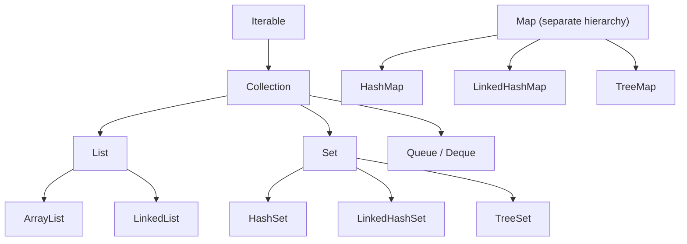
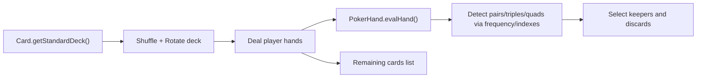

# :material-pencil: Topic Note: Collections Framework Fundamentals & Collections Utility Methods (Part 1 — Section 15, Lectures 1–8)

> **Course:** Java Programming Masterclass — Tim Buchalka (Udemy)  
> **Section:** 15 — Mastering Java Collections Framework, Lists, Sets, and Maps  
> **Status:** :material-check-circle: Complete

---

## :material-target: Learning Objectives

By the end of this part, you should be able to:

- [x] Explain the Collections Framework hierarchy and why `Map` is a separate branch.
- [x] Distinguish the **framework** from the `java.util.Collections` utility class.
- [x] Use core utility methods: `addAll`, `fill`, `nCopies`, `copy`, `shuffle`, `reverse`, `sort`.
- [x] Apply advanced utility methods: `indexOfSubList`, `binarySearch`, `replaceAll`, `frequency`, `max`, `min`, `rotate`, `swap`.
- [x] Build a reusable `Card` model and deck generator for algorithm demonstrations.
- [x] Implement and reason about a 5-card-draw challenge solution using list/set/map operations.

---

## :material-head-cog: 1. Collections Framework Big Picture

Java's Collections Framework gives a common contract for data containers plus reusable algorithms.



### Core clarification

- `Collection` handles **single-value containers**.
- `Map<K, V>` stores **key-value pairs**, so it is in the framework but not a subtype of `Collection`.
- Algorithms can often work against interfaces (`List`, `Set`, `Map`) rather than concrete types.

---

## :material-head-cog: 2. `Collections` Utility Class vs Framework

The framework is the whole ecosystem; `Collections` is one static helper class inside it.

| Layer | Example | Purpose |
|---|---|---|
| Framework contracts | `List`, `Set`, `Map` | Define behavior |
| Implementations | `ArrayList`, `HashSet`, `HashMap` | Store data |
| Utility algorithms | `Collections.shuffle`, `Collections.sort` | Reusable operations |

In the course practice implementation, this section demonstrates:

```java
Collections.shuffle(deck);
Collections.reverse(deck);
Collections.sort(deck, sortingAlgorithm);
int index = Collections.indexOfSubList(deck, tens);
```

---

## :material-head-cog: 3. Card Model Setup (Reusable Course Base)

The course card model is a strong reusable base:

- `record Card(Suit suit, String face, int rank)`
- Factory methods:
  - `getNumericCard(...)`
  - `getFaceCard(...)`
  - `getStandardDeck()`
- Comparator helper:
  - `sortRankReversedSuit()`

This lets all algorithm demos stay focused on collections behavior, not object setup noise.

---

## :material-head-cog: 4. Essential Utility Methods (Lectures 4–5)

### Methods and intent

| Method | What it does | Typical caution |
|---|---|---|
| `Collections.addAll` | bulk add elements | target must be mutable |
| `Collections.fill` | overwrite all positions | list must already have size |
| `Collections.nCopies` | immutable repeated elements view | repeated reference for mutable objects |
| `Collections.copy(dest, src)` | copy by index into existing list | `dest.size() >= src.size()` |
| `List.copyOf(...)` | immutable structural copy | later source mutations not reflected |

### Ordering algorithms

- `shuffle` randomizes order.
- `reverse` flips current order.
- `sort` uses natural order or comparator.
- `indexOfSubList` searches contiguous patterns.

### Complexity and behavior notes

| Method | Typical complexity | Important detail |
|---|---|---|
| `shuffle` | O(n) | random permutation in place |
| `reverse` | O(n) | swaps mirrored positions |
| `sort` | O(n log n) | comparator must be consistent |
| `indexOfSubList` | O(n*m) worst case | good for contiguous pattern detection |

---

## :material-head-cog: 5. Advanced Utility Methods (Lecture 6)

From the practice implementation:

- `Collections.binarySearch(deck, tenOfHearts, sortingAlgorithm)`
- `Collections.replaceAll(deck, tenOfClubs, tenOfHearts)`
- `Collections.frequency(deck, tenOfClubs)`
- `Collections.max(deck, sortingAlgorithm)` / `min(...)`
- `Collections.rotate(copied, ±2)`
- `Collections.swap(...)` for manual reverse

### Why these matter

- They compress common patterns into tested standard library calls.
- They often make intent clearer than custom loops.
- They reduce edge-case bugs (off-by-one, mutation while iterating, etc.).

### Binary search contract reminder

`binarySearch` is correct only when:

1. the list is sorted
2. with the same ordering logic (natural order or same comparator)

If either condition is violated, result index is undefined for your business logic.

---

## :material-head-cog: 6. Challenge Architecture — Five Card Draw (Lectures 7–8)



Main challenge components:

- game controller
- poker game engine
- hand evaluator
- ranking enum

### Implementation insights from solution

1. `deal()` maps the deck into `Card[][]` then converts to `PokerHand`.
2. Hand evaluation extracts faces, finds duplicates with `Collections.frequency(...)`.
3. Ranking is promoted through explicit state transitions (`ONE_PAIR` -> `TWO_PAIR` / `FULL_HOUSE`).
4. Discard logic keeps ranked cards and selectively drops low-value extras.

### Why the challenge solution is clever

- It separates **dealing**, **evaluation**, and **remaining-card tracking** into distinct steps.
- It reuses collection algorithms rather than custom nested-condition spaghetti.
- It keeps ranking logic explicit and readable through enum transitions.

---

## :material-alert: Common Pitfalls (Part 1)

1. Calling `Collections.fill` on an empty list and expecting it to grow.
2. Forgetting `binarySearch` requires same sort order used for search comparator.
3. Treating `nCopies` as a deep copy.
4. Using immutable copies (`List.copyOf`) then trying to mutate.

---

## :material-card-bulleted: Quick Reference

| Goal | Best utility method |
|---|---|
| Random order | `shuffle` |
| Deterministic ordering | `sort` |
| Find sorted element fast | `binarySearch` |
| Count repeated values | `frequency` |
| Find best/worst by comparator | `max` / `min` |
| Circular shift | `rotate` |

---

## :material-navigation: Related Notes

| Part | Topic | Link |
|:--:|---|---|
| 1 | Collections Fundamentals & Utility Methods (Lectures 1–8) | **You are here** |
| 2 | Hashing, Sets & Set Operations (Lectures 9–14) | [Part 2 — Hashing & Sets](topic-note-part2.md) |
| 3 | Ordered Sets & TreeSet Challenge (Lectures 15–18) | [Part 3 — Ordered Sets](topic-note-part3.md) |
| 4 | Map Interface, View Collections & HashMap Challenge (Lectures 19–23) | [Part 4 — Maps](topic-note-part4.md) |
| 5 | Ordered Maps, Enum Collections & Final Challenge (Lectures 24–29) | [Part 5 — Ordered Maps & Final Challenge](topic-note-part5.md) |

---

## :material-bookshelf: References

- **Course:** Tim Buchalka — Java Programming Masterclass (Section 15, Lectures 1–8)
- **API:** [Collections (Java 17)](https://docs.oracle.com/en/java/javase/17/docs/api/java.base/java/util/Collections.html)
- **API:** [Collection (Java 17)](https://docs.oracle.com/en/java/javase/17/docs/api/java.base/java/util/Collection.html)


---

*Last Updated: 2026-04-16 | Confidence: 9/10*
