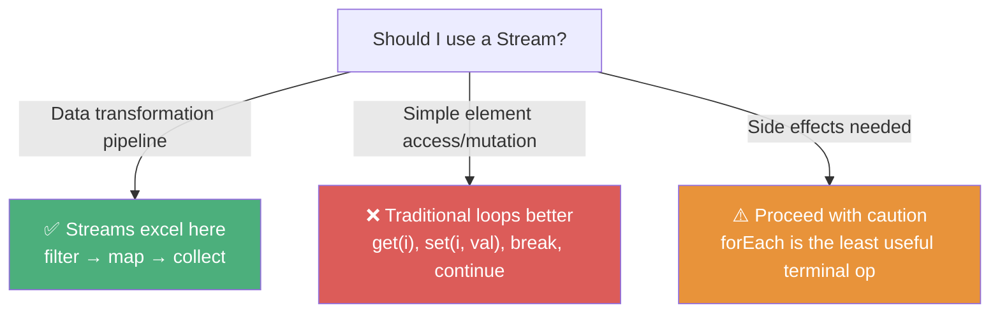
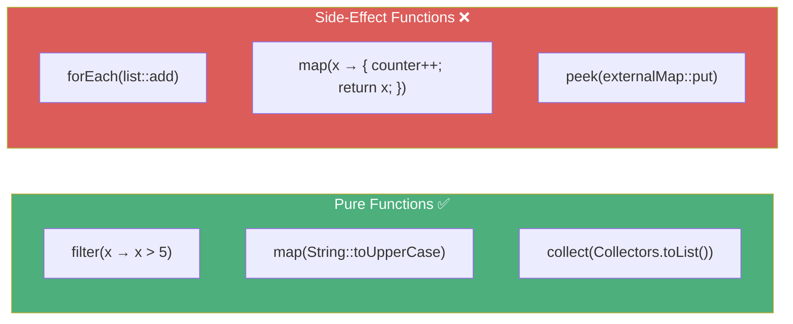
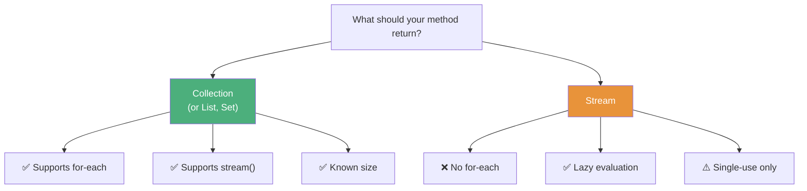

# :material-book-open-page-variant: Book Reading: Comprehensive Java Streams

> **Book:** Effective Java (3rd Edition) by Joshua Bloch
> **Relevant Items:** 45, 46, 47, 48 (Chapter 7: Lambdas and Streams)
> **Status:** :material-check-circle: Complete

---

## :material-target: Reading Goals

- [x] Understand when streams are appropriate vs traditional loops
- [x] Master the principle of side-effect-free stream functions
- [x] Know when to return Collections vs Streams from methods
- [x] Understand the risks and benefits of parallel streams

---

## :material-book-open-variant: Chapter 7: Lambdas and Streams

### Item 45: Use Streams Judiciously

#### The Core Principle

Streams can make programs shorter and clearer, or longer and less clear. **There is no hard rule** — use judgment to determine when a stream makes the code more readable.



#### Things You CAN'T Do in a Stream Lambda

| Limitation | Why |
|------------|-----|
| **Read/modify local variables** | Lambdas can only access effectively final variables |
| **`return` from enclosing method** | Return in a lambda returns from the lambda, not the method |
| **`break`/`continue`** | No loop control flow in lambda expressions |
| **Throw checked exceptions** | Functional interfaces don't declare checked exceptions |

#### When Streams Shine

- **Uniformly transform** sequences of elements
- **Filter** sequences based on conditions
- **Combine** elements (add, concatenate, compute minimums)
- **Accumulate** elements into collections
- **Search** for elements satisfying conditions

#### Connection to Course Material

Tim demonstrates this principle throughout — the Bingo Ball example (Lecture 2) directly compares iterative vs stream approaches, showing how stream code is more concise but isn't always simpler for every task.

#### Quote to Remember

> *"If you're not sure whether a task is better served by streams or iteration, try both and see which works better."*

---

### Item 46: Prefer Side-Effect-Free Functions in Streams

#### The Central Rule

**Stream pipeline functions should be pure functions** — their result depends only on their input, without modifying any state or depending on mutable state.



#### The `forEach` Anti-Pattern

```java
// ❌ WRONG — forEach as a mutative sink (side-effect-heavy)
Map<String, Long> freq = new HashMap<>();
words.forEach(word -> freq.merge(word, 1L, Long::sum));

// ✅ CORRECT — use Collectors
Map<String, Long> freq = words.stream()
    .collect(Collectors.groupingBy(String::toLowerCase, Collectors.counting()));
```

> *"The `forEach` operation should be used only to report the result of a stream computation, not to perform the computation."*

#### Essential Collectors

Bloch highlights these as the most important `Collectors` methods:

| Collector | Purpose | Course Connection |
|-----------|---------|-------------------|
| `toList()` / `toSet()` | Collect into List/Set | Lecture 13 — `toList` vs `Collectors.toList()` |
| `toMap(keyMapper, valueMapper)` | Collect into Map | Lecture 14 — student data aggregation |
| `groupingBy(classifier)` | Group into Map | Lecture 14 — by country, by gender |
| `joining(delimiter)` | Concatenate strings | Lecture 14 — country code joining |
| `counting()` | Count elements in groups | Lecture 15 — enrollment trends |
| `partitioningBy(predicate)` | Split by boolean | Lecture 14 — experienced vs beginner |

#### Connection to Course Material

Tim explicitly warns about side effects in Lecture 3 (optimization may skip operations) and Lecture 5 (the `generate` method with `counter++`). Bloch's rule formalizes what Tim demonstrates practically.

---

### Item 47: Prefer Collection to Stream as a Return Type

#### The Core Principle

If a method returns a sequence of elements, prefer **Collection** (or an appropriate subtype) over Stream:

- Collection is a **subtype of Iterable**, so it supports for-each loops
- Collection provides a `stream()` method, so callers can still create a stream
- Stream does **not** extend Iterable, so callers can't use for-each loops



#### Exceptions

Use Stream when:
- The sequence is **very large** (or infinite) — materialization into a Collection would be wasteful
- The computation is **lazy** by design — the elements should only be generated when consumed

#### Connection to Course Material

Tim's Student Engagement System uses both patterns — `Student.getRandomStudent()` returns concrete objects, while the stream pipelines remain as streams until a terminal operation finalizes them. The `toList()` vs `Collectors.toList()` distinction (Lecture 13) directly reflects this consideration.

---

### Item 48: Use Caution When Making Streams Parallel

#### The Core Principle

**Parallelizing a stream is easy; doing it correctly and beneficially is not.** Performance gains from parallelism are highly dependent on the data source, operations, and terminal operation.

#### When Parallel Streams Work Well

| Factor | Good for Parallel | Bad for Parallel |
|--------|:---:|:---:|
| **Source** | `ArrayList`, arrays, `IntStream.range` | `LinkedList`, `Stream.iterate`, IO streams |
| **Operations** | Stateless (`filter`, `map`) | Stateful (`sorted`, `distinct`, `limit`) |
| **Terminal** | Reductions (`reduce`, `count`, `sum`) | `forEach` (non-deterministic order) |
| **Data size** | Large datasets (10,000+ elements) | Small datasets |

#### The Danger

```java
// ❌ parallelStream with ordered, stateful operations
stream.parallel()
    .sorted()
    .limit(10)
    .forEach(System.out::println);
// May be SLOWER than sequential due to overhead!
```

#### The Rule of Thumb

> *"Do not parallelize indiscriminately. At best, parallelizing a stream incorrectly will cause your program to fail or to perform poorly; at worst, it will produce incorrect results."*

#### Connection to Course Material

Tim explicitly defers parallel streams to the concurrency section (Lecture 1). The course builds a solid sequential foundation first, which aligns with Bloch's advice to start with sequential streams and only parallelize after profiling shows a bottleneck.

---

## :material-thought-bubble: Reflections & Connections

### How the Book Complements the Course

| Course Content (Tim) | Book Insight (Bloch) | Synthesis |
|:-----|:-----|:-----|
| Bingo Ball comparison (Lecture 2) | Item 45: streams vs iteration | Streams are better for transformation pipelines; loops for element mutation |
| Side-effect warning (Lectures 3, 5) | Item 46: pure functions in streams | Side effects break stream optimization; use Collectors instead of forEach mutations |
| `toList()` vs `Collectors.toList()` (Lecture 13) | Item 47: Collection over Stream returns | Returning collections gives callers more flexibility |
| Parallel streams deferred (Lecture 1) | Item 48: caution with parallelism | Sequential first; parallel only after profiling confirms benefit |
| `groupingBy`, `partitioningBy` (Lecture 14) | Item 46: Collectors mastery | Collectors replace the need for side-effecting forEach operations |
| `Optional` class (Lecture 16) | Item 55: Return optionals judiciously | Use Optional as return type only; never for fields or parameters |

### New Perspectives Gained

1. **`forEach` is the least useful terminal operation** — it's for reporting results, not computing them. Collectors should do the heavy lifting.

2. **The "pure function" lens** changes how you think about intermediate operations — every lambda should be a function of its input only.

3. **Collection vs Stream as return types** is a design decision — prefer Collection for maximum caller flexibility.

4. **Parallel streams are NOT a free speedup** — source type, operation statefulness, and data size all matter.

---

## :material-format-list-checks: Summary Points

1. **Use streams judiciously** (Item 45) — they excel at transformation pipelines but aren't always more readable than loops
2. **Keep stream functions pure** (Item 46) — no side effects in lambdas; use Collectors for aggregation
3. **Return Collections, not Streams** (Item 47) — unless the sequence is very large or computation should be lazy
4. **Don't blindly parallelize** (Item 48) — wrong parallelism can be slower or produce incorrect results
5. **`forEach` is for reporting** — use `collect`, `reduce`, `toList` for computation
6. **Master `Collectors`** — `groupingBy`, `partitioningBy`, `joining`, `toMap` replace most imperative accumulation patterns

---

## :material-pin: Bookmarks & Page References

| Topic | Item | Key Insight |
|-------|:----:|-------------|
| Streams vs loops | Item 45 | Use judgment; streams for transforms, loops for mutation |
| Pure functions | Item 46 | No side effects; forEach only for reporting |
| Return types | Item 47 | Prefer Collection over Stream as method return |
| Parallel caution | Item 48 | Source type + operation statefulness determine if parallelism helps |

---

## :material-code-tags: Practical Checklist

**Before using a stream:**

- [ ] Is this a transformation pipeline? If not → consider a loop
- [ ] Can I express the logic without `break`, `continue`, or checked exceptions?
- [ ] Am I trying to use `forEach` for computation? If yes → use `collect`/`reduce` instead

**Before parallelizing:**

- [ ] Is my data source efficiently splittable? (ArrayList ✅, LinkedList ❌)
- [ ] Are my operations stateless? (filter/map ✅, sorted/distinct ⚠️)
- [ ] Is the dataset large enough to justify threading overhead? (10,000+ elements)
- [ ] Have I profiled the sequential version first?

**When returning sequences:**

- [ ] Can I return a `List` or `Set` instead of a `Stream`?
- [ ] If returning a Stream, is there a good reason (lazy, very large, infinite)?

---

*Last Updated: 2026-04-29*
