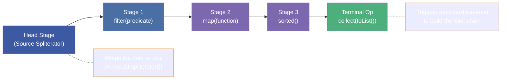
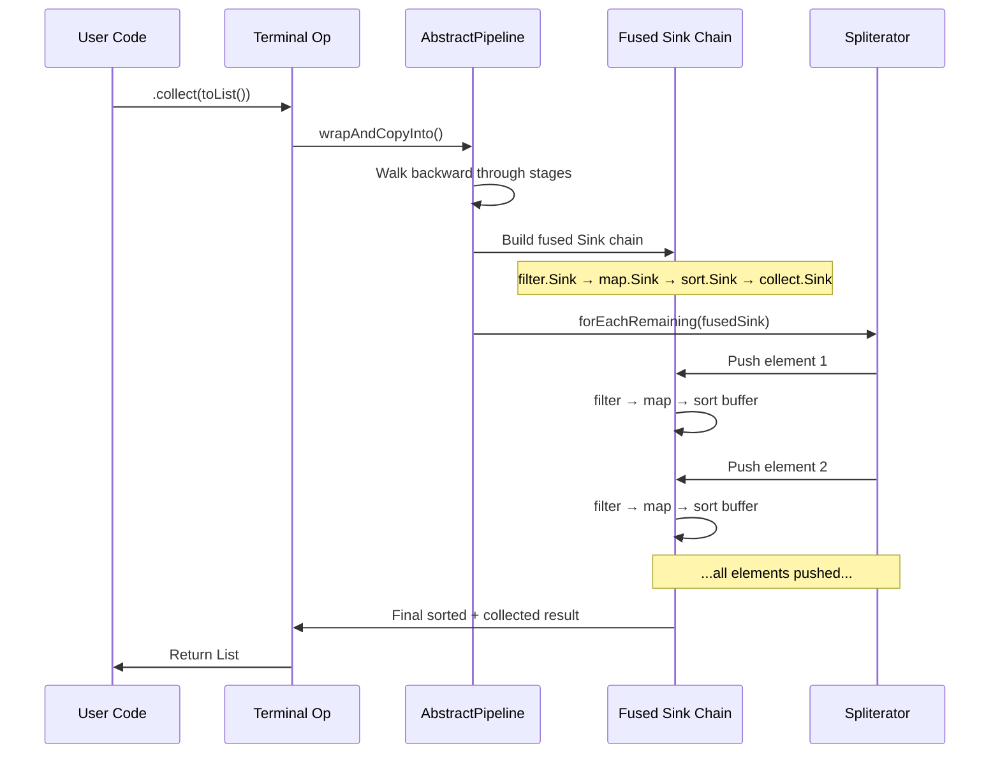
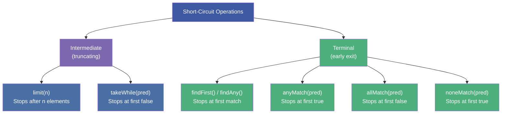
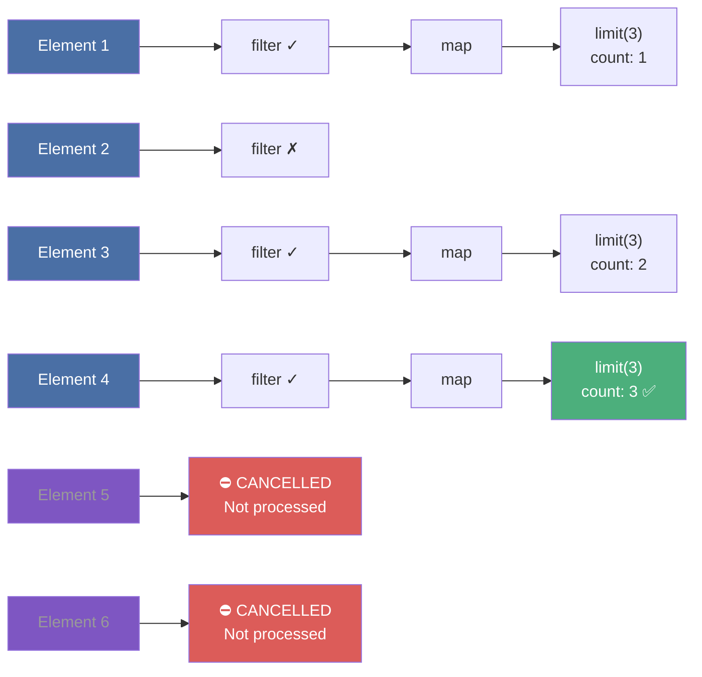
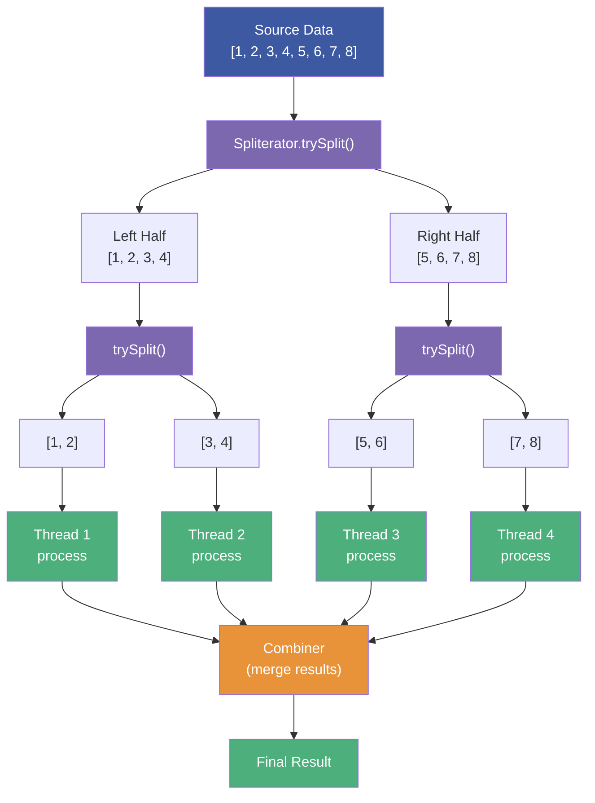
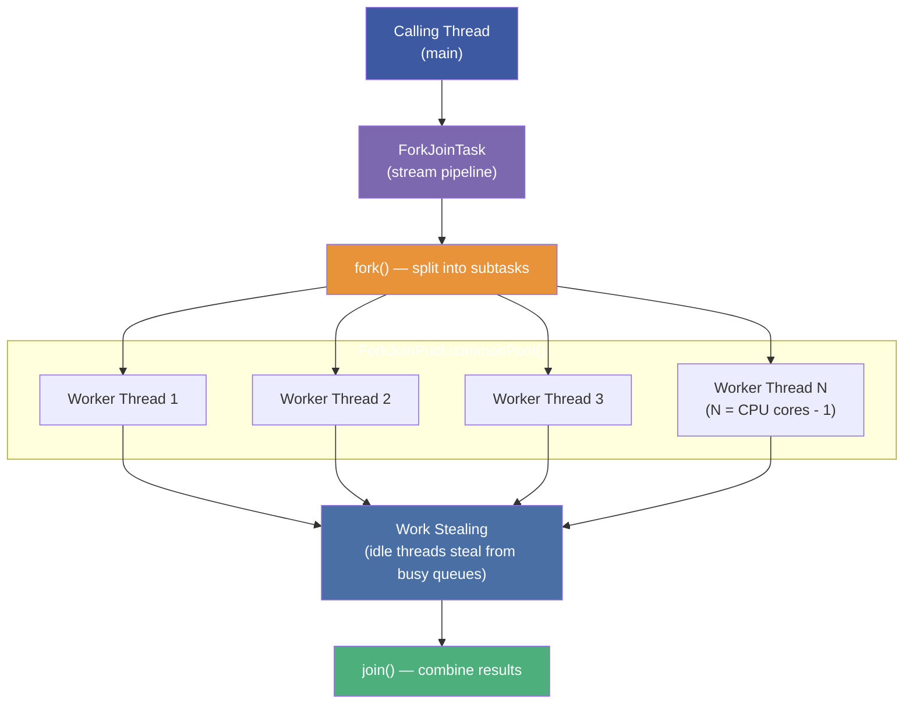
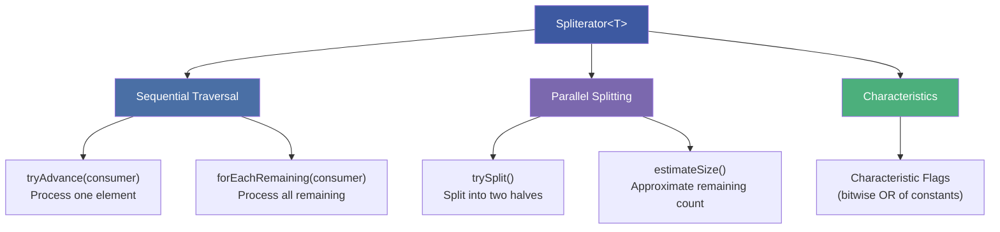
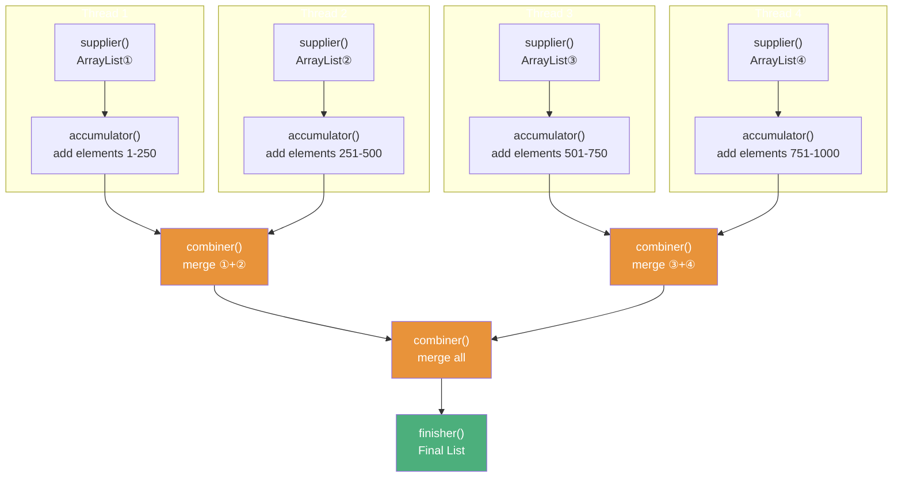

# :material-school: Summary: Comprehensive Java Streams Operations, Pipelines & Sources

> **Status:** :material-check-circle: Complete

---

## :material-lightning-bolt: Key Takeaways

### 1. Streams Are Declarative Processing Pipelines

A stream is **not** a data structure — it's a sequence of computational steps. Think of it as writing a SQL query: you declare _what_ you want, not _how_ to get it.

```
Source → [Intermediate Ops (0..N)] → Terminal Op (exactly 1) → Result
```

### 2. The Three Stream Laws

1. **Lazy** — Nothing happens until a terminal operation is invoked
2. **Non-storing** — Streams do not hold data; they process from source on-demand
3. **Single-use** — Once consumed by a terminal op, a stream cannot be reused

### 3. Stream Creation Hierarchy

| Source | Method | Finite? |
|--------|--------|:---:|
| Collection | `collection.stream()` | ✅ |
| Array | `Arrays.stream(array)` | ✅ |
| Values | `Stream.of(a, b, c)` | ✅ |
| Iterate (3-arg) | `Stream.iterate(seed, predicate, op)` | ✅ |
| Range | `IntStream.range` / `rangeClosed` | ✅ |
| Iterate (2-arg) | `Stream.iterate(seed, op)` | ❌ |
| Generate | `Stream.generate(supplier)` | ❌ |

### 4. Intermediate Operations At a Glance

| Category | Operations |
|----------|-----------|
| **Element Reducing** | `filter`, `distinct`, `limit`, `skip`, `takeWhile`, `dropWhile` |
| **Element Transforming** | `map`, `mapToInt`/`mapToDouble`/`mapToLong`, `mapToObj`, `flatMap`, `peek`, `sorted` |

### 5. Terminal Operations At a Glance

| Category | Operations | Returns |
|----------|-----------|---------|
| **Iteration** | `forEach`, `forEachOrdered` | `void` |
| **Aggregation** | `count`, `sum`, `min`, `max`, `average`, `summaryStatistics` | Primitive / `Optional` |
| **Matching** | `allMatch`, `anyMatch`, `noneMatch` | `boolean` |
| **Finding** | `findFirst`, `findAny` | `Optional<T>` |
| **Collecting** | `collect`, `toList`, `toArray` | Collection / Array |
| **Reducing** | `reduce` | `Optional<T>` / `T` |

### 6. Collectors — The Power Tools

| Collector | Purpose |
|-----------|---------|
| `Collectors.toList()` | Mutable List |
| `Collectors.toSet()` | Mutable Set |
| `Collectors.toMap(k, v)` | Map from key/value mappers |
| `Collectors.groupingBy(classifier)` | Group by key into `Map<K, List<T>>` |
| `Collectors.partitioningBy(predicate)` | Split into `Map<Boolean, List<T>>` |
| `Collectors.joining(delim)` | Concatenate strings |
| `Collectors.counting()` | Count elements in groups |
| `Collectors.averagingDouble(fn)` | Average of mapped values |

### 7. Optional — Safe Null Handling

- Created via `Optional.of()`, `Optional.ofNullable()`, `Optional.empty()`
- Access via `ifPresent()`, `ifPresentOrElse()`, `orElse()`, `orElseGet()`
- Has stream-like methods: `map()`, `filter()`, `flatMap()`
- **Rule**: Methods returning Optional must NEVER return `null`
- **Rule**: Prefer `orElseGet` over `orElse` for expensive fallbacks

### 8. flatMap — Flattening Hierarchies

`map` = one-to-one transformation; `flatMap` = one-to-many flattening.
Use `flatMap` whenever you have `Stream<Collection<T>>` and need `Stream<T>`.

---

## :material-brain: Key Internals & Deep-Dive Performance Notes

### Internal 1: Stream Lazy Evaluation Mechanism

Understanding _how_ lazy evaluation works internally is critical. Streams don't execute operations eagerly — they build a **pipeline descriptor** that only materializes when a terminal operation triggers it.

#### The Stage-Based Pipeline Architecture

Internally, the JVM models a stream pipeline as a **linked list of stages**. Each call to an intermediate operation creates a new `AbstractPipeline` node that references the previous stage:



#### How Terminal Operations Trigger Execution

When the terminal operation is invoked, the runtime performs a **backward traversal** of the stage chain, wrapping each stage's operation into a `Sink` (a specialized `Consumer`). These sinks are chained together and then the source spliterator pushes elements through the entire fused chain:



#### Why This Matters

- **No intermediate collections are created** between stages — elements flow through the fused sink chain one at a time (except for stateful operations like `sorted`)
- **Operation fusion** means the JVM can optimize the combined behavior, not each operation individually
- **Dead code elimination**: if a short-circuit terminal op (like `findFirst`) completes early, remaining source elements are never processed

> **Resource:** [OpenJDK `AbstractPipeline.java`](https://github.com/openjdk/jdk/blob/master/src/java.base/share/classes/java/util/stream/AbstractPipeline.java) — The backbone of all stream pipeline implementations, containing `wrapAndCopyInto()` and `wrapSink()` methods

---

### Internal 2: Short-Circuit Operations in Streams

Short-circuit operations are a critical optimization — they allow the pipeline to **stop processing early** without consuming the entire source.

#### Which Operations Short-Circuit?



#### How Short-Circuiting Works Internally

The `Sink` interface has a `cancellationRequested()` method. When a short-circuit operation determines the result is complete, it sets a flag that propagates upstream:



#### Performance Impact — Infinite Streams

Short-circuiting is **essential** for infinite streams. Without `limit`, `findFirst`, or `takeWhile`, an infinite source would loop forever:

```java
// Without short-circuit → runs forever ❌
Stream.iterate(1, n -> n + 1)
    .filter(Main::isPrime)
    .forEach(System.out::println);  // Never terminates!

// With short-circuit → terminates after 20 results ✅
Stream.iterate(1, n -> n + 1)
    .filter(Main::isPrime)
    .limit(20)                       // Short-circuit!
    .forEach(System.out::println);
```

#### Stateful vs Stateless — Impact on Short-Circuiting

| Operation Type | Examples | Can Short-Circuit Effectively? |
|:---:|---|:---:|
| **Stateless** | `filter`, `map`, `peek` | ✅ Process one-at-a-time |
| **Stateful (bounded)** | `limit`, `skip`, `takeWhile` | ✅ Track count/condition |
| **Stateful (unbounded)** | `sorted`, `distinct` | ⚠️ Must see ALL elements first |

!!! warning "sorted + limit Trap"
    `stream.sorted().limit(5)` must sort **all** elements before limiting to 5. But `stream.limit(5).sorted()` only sorts 5 elements. Order matters!

> **Resource:** [OpenJDK `Sink.java`](https://github.com/openjdk/jdk/blob/master/src/java.base/share/classes/java/util/stream/Sink.java) — The `cancellationRequested()` mechanism that enables short-circuiting

---

### Internal 3: Parallel Streams & the Fork/Join Framework

Parallel streams split work across multiple CPU cores using Java's **Fork/Join Framework** (introduced in Java 7).

#### How Parallel Streams Work



#### The Fork/Join Framework Under the Hood

Parallel streams run on the **common ForkJoinPool** (`ForkJoinPool.commonPool()`), which defaults to `Runtime.getRuntime().availableProcessors() - 1` threads plus the calling thread.



**Work Stealing**: Each worker thread has its own deque (double-ended queue). When a thread finishes its work, it **steals** tasks from the tail of another thread's deque, ensuring load balancing.

#### When to Use Parallel Streams

| Factor | Good for Parallel ✅ | Bad for Parallel ❌ |
|--------|---|---|
| **Source** | `ArrayList`, arrays, `IntStream.range` | `LinkedList`, `Stream.iterate`, IO-bound |
| **Operations** | Stateless (`filter`, `map`) | Stateful (`sorted`, `distinct`, `limit`) |
| **Terminal** | `reduce`, `count`, `sum`, `collect` | `forEach` (non-deterministic order) |
| **Data size** | Large (10,000+ elements) | Small (overhead > benefit) |
| **Element cost** | CPU-intensive per element | Simple operations |

#### The Three-Parameter `reduce` in Parallel Context

The combiner parameter only matters for parallel streams:

```java
// Sequential: accumulator processes elements one-by-one
// Parallel: each thread accumulates locally, then combiner merges results
int total = students.parallelStream()
    .reduce(
        0,                                          // identity
        (subtotal, student) -> subtotal + student.getAge(),  // accumulator
        Integer::sum                                // combiner (parallel merge)
    );
```

#### Common Pitfalls

```java
// ❌ forEach on parallel → non-deterministic order
list.parallelStream()
    .forEach(System.out::println);  // Output order is random!

// ✅ forEachOrdered → preserves encounter order (but loses parallelism benefit)
list.parallelStream()
    .forEachOrdered(System.out::println);

// ❌ Shared mutable state → race condition
List<String> results = new ArrayList<>();  // NOT thread-safe!
stream.parallel().forEach(results::add);    // ConcurrentModificationException!

// ✅ Use collect instead
List<String> results = stream.parallel()
    .collect(Collectors.toList());          // Thread-safe accumulation
```

> **Resource:** [Java Concurrency in Practice by Brian Goetz](https://jcip.net/) — Chapter 6 on Fork/Join and work-stealing algorithms
> **Resource:** [Doug Lea's Fork/Join Paper](http://gee.cs.oswego.edu/dl/papers/fj.pdf) — Original design paper by the framework's author

---

### Internal 4: Spliterator & Stream Source Characteristics

The `Spliterator` (splitable iterator) is the **engine** that drives stream processing. It determines how data is traversed, split for parallelism, and optimized.

#### What Is a Spliterator?

Every stream source provides a `Spliterator<T>` that has two core responsibilities:

1. **Traverse** elements sequentially (`tryAdvance` / `forEachRemaining`)
2. **Split** the element space for parallel processing (`trySplit`)



#### Characteristic Flags — The Optimization Signals

Each `Spliterator` reports a set of **characteristics** as bit flags. The stream pipeline uses these flags to skip unnecessary work:

```mermaid
flowchart TD
    CHARACTERISTICS["Spliterator Characteristics"] --> ORDERED["ORDERED\nElements have defined encounter order"]
    CHARACTERISTICS --> SIZED["SIZED\nExact element count is known"]
    CHARACTERISTICS --> SUBSIZED["SUBSIZED\nSub-spliterators are also SIZED"]
    CHARACTERISTICS --> DISTINCT_C["DISTINCT\nAll elements are unique"]
    CHARACTERISTICS --> SORTED_C["SORTED\nElements are in natural order"]
    CHARACTERISTICS --> NONNULL["NONNULL\nSource guarantees no nulls"]
    CHARACTERISTICS --> IMMUTABLE["IMMUTABLE\nSource cannot be modified"]
    CHARACTERISTICS --> CONCURRENT["CONCURRENT\nSource safely supports concurrent modification"]

    style CHARACTERISTICS fill:#3d59a1,color:#fff
    style ORDERED fill:#4a6fa5,color:#fff
    style SIZED fill:#4a6fa5,color:#fff
    style SUBSIZED fill:#4a6fa5,color:#fff
    style DISTINCT_C fill:#7b68ae,color:#fff
    style SORTED_C fill:#7b68ae,color:#fff
    style NONNULL fill:#4caf7c,color:#fff
    style IMMUTABLE fill:#4caf7c,color:#fff
    style CONCURRENT fill:#4caf7c,color:#fff
```



#### How Characteristics Enable Optimizations

| Characteristic | Optimization Enabled |
|:---:|---|
| **SIZED** | `count()` returns immediately without traversing; `toArray()` pre-allocates exact array size |
| **DISTINCT** | `distinct()` operation becomes a no-op (already unique) |
| **SORTED** | `sorted()` operation becomes a no-op (already ordered) |
| **ORDERED** | `findFirst()` is well-defined; parallel streams preserve order when needed |
| **SUBSIZED** | Enables balanced parallel splitting — each half knows its exact size |
| **NONNULL** | Skip null checks in `Optional`-returning operations |

#### Characteristics by Collection Type

| Source | ORDERED | SIZED | DISTINCT | SORTED | Parallel Split Quality |
|--------|:---:|:---:|:---:|:---:|:---:|
| `ArrayList` | ✅ | ✅ | ❌ | ❌ | ⭐⭐⭐ Excellent (index-based split) |
| `LinkedList` | ✅ | ✅ | ❌ | ❌ | ⭐ Poor (must traverse to split) |
| `HashSet` | ❌ | ✅ | ✅ | ❌ | ⭐⭐ Good (bucket-based split) |
| `TreeSet` | ✅ | ✅ | ✅ | ✅ | ⭐⭐ Good (tree-based split) |
| `IntStream.range` | ✅ | ✅ | ✅ | ✅ | ⭐⭐⭐ Excellent (arithmetic split) |
| `Stream.iterate` | ✅ | ❌ | ❌ | ❌ | ⭐ Terrible (sequential dependency) |
| `Stream.generate` | ❌ | ❌ | ❌ | ❌ | ⭐ Terrible (no structure) |

#### How Operations Change Characteristics

Intermediate operations can **add or remove** characteristics from the stream:


| Operation | Adds | Removes |
|-----------|------|---------|
| `filter()` | — | SIZED |
| `map()` | — | DISTINCT, SORTED |
| `sorted()` | SORTED, ORDERED | — |
| `distinct()` | DISTINCT | SIZED |
| `limit()` / `skip()` | — | SIZED |
| `flatMap()` | — | DISTINCT, SORTED, SIZED |
| `unordered()` | — | ORDERED |

#### The `trySplit()` Balancing Strategy

For efficient parallelism, `trySplit()` should return a spliterator covering approximately **half** the remaining elements. The quality varies dramatically by source:

```java
// ArrayList: splits by index → O(1), perfectly balanced
// [0..49] → left: [0..24], right: [25..49]

// LinkedList: must traverse to find midpoint → O(n)
// Degrades to sequential in practice

// IntStream.range(0, 1000): arithmetic split → O(1)
// left: range(0, 500), right: range(500, 1000)
```

> **Resource:** [Spliterator JavaDoc](https://docs.oracle.com/en/java/javase/21/docs/api/java.base/java/util/Spliterator.html) — Full specification of characteristics and splitting contracts
> **Resource:** [OpenJDK `ArrayListSpliterator`](https://github.com/openjdk/jdk/blob/master/src/java.base/share/classes/java/util/ArrayList.java) — See how `trySplit()` divides the backing array by index midpoint

---

### Bonus Internal: Collector Internals

The `Collector` interface's four functions map directly to stream processing stages:

| Function | Role | Example for `toList()` |
|----------|------|------------------------|
| `supplier()` | Create accumulation container | `ArrayList::new` |
| `accumulator()` | Add element to container | `List::add` |
| `combiner()` | Merge two containers (parallel) | `(a,b) -> { a.addAll(b); return a; }` |
| `finisher()` | Final transformation | `Function.identity()` |

In parallel execution, each thread gets its own container from `supplier()`, fills it with `accumulator()`, and the framework uses `combiner()` to merge all thread-local containers into a single result:



> **Resource:** [OpenJDK `Collectors.java`](https://github.com/openjdk/jdk/blob/master/src/java.base/share/classes/java/util/stream/Collectors.java) — All built-in collector implementations
> **Resource:** [OpenJDK `ReduceOps.java`](https://github.com/openjdk/jdk/blob/master/src/java.base/share/classes/java/util/stream/ReduceOps.java) — How `collect` and `reduce` terminal operations orchestrate the Collector

---

## :material-compass: Quick Decision Guide

### When to Use Streams vs Loops

```
✅ Use streams when:
  → You're building a transformation pipeline (filter/map/collect)
  → You need declarative data processing (reads like SQL)
  → You want aggregation (count, sum, grouping)
  → You're working with Collections/Arrays as source

❌ Use loops when:
  → You need break/continue/return logic
  → You need to modify elements in place
  → You need index-based access
  → Side effects are the primary goal
  → Checked exceptions must be thrown
```

### When to Use `toList()` vs `Collectors.toList()`

```
toList()             → Unmodifiable result, no further mutation needed
Collectors.toList()  → Mutable result, will add/remove/shuffle later
```

### When to Use `orElse` vs `orElseGet`

```
orElse(defaultValue)         → When default is a constant or cheap
orElseGet(() -> compute())   → When default is expensive (DB call, creation)
```

---

## :material-chart-line: Concept Map

```mermaid
flowchart TD
    STREAMS["Java Streams API"] --> SOURCE["Sources"]
    STREAMS --> INT["Intermediate Ops"]
    STREAMS --> TERM["Terminal Ops"]
    STREAMS --> OPT["Optional"]
    STREAMS --> COLL["Collectors"]

    SOURCE --> S1["Collections\nArrays\nStream.of"]
    SOURCE --> S2["Infinite\ngenerate / iterate"]
    SOURCE --> S3["Primitive\nIntStream / DoubleStream"]

    INT --> I1["Reducing\nfilter, distinct, limit\nskip, takeWhile, dropWhile"]
    INT --> I2["Transforming\nmap, flatMap, sorted, peek\nmapToInt/Double/Long"]

    TERM --> T1["forEach\ncount, sum"]
    TERM --> T2["collect\nreduce"]
    TERM --> T3["allMatch, anyMatch\nfindFirst, findAny"]

    OPT --> O1["of / ofNullable / empty"]
    OPT --> O2["ifPresent / orElseGet"]
    OPT --> O3["map / filter"]

    COLL --> C1["toList / toSet / toMap"]
    COLL --> C2["groupingBy\npartitioningBy"]
    COLL --> C3["joining / counting"]

    style STREAMS fill:#3d59a1,color:#fff
    style SOURCE fill:#4a6fa5,color:#fff
    style INT fill:#7b68ae,color:#fff
    style TERM fill:#4caf7c,color:#fff
    style OPT fill:#e8933a,color:#fff
    style COLL fill:#dc5c59,color:#fff
```



---

## :material-code-tags: Essential Code Patterns

### Pattern 1: Collection Processing Pipeline

```java
List<String> result = dataList.stream()
    .filter(predicate)
    .map(transformation)
    .sorted(comparator)
    .collect(Collectors.toList());
```

### Pattern 2: Group & Aggregate

```java
Map<String, Long> countByGroup = items.stream()
    .collect(Collectors.groupingBy(
        Item::getCategory,
        Collectors.counting()
    ));
```

### Pattern 3: Flatten & Process

```java
long count = nestedMap.values().stream()
    .flatMap(Collection::stream)
    .filter(predicate)
    .count();
```

### Pattern 4: Safe Value Retrieval

```java
String result = Optional.ofNullable(getValue())
    .map(String::toUpperCase)
    .filter(s -> s.length() > 3)
    .orElse("DEFAULT");
```

### Pattern 5: Primitive Statistics

```java
IntSummaryStatistics stats = items.stream()
    .mapToInt(Item::getQuantity)
    .summaryStatistics();
// stats.getCount(), stats.getSum(), stats.getAverage(), stats.getMin(), stats.getMax()
```

---

*Last Updated: 2026-04-29*
